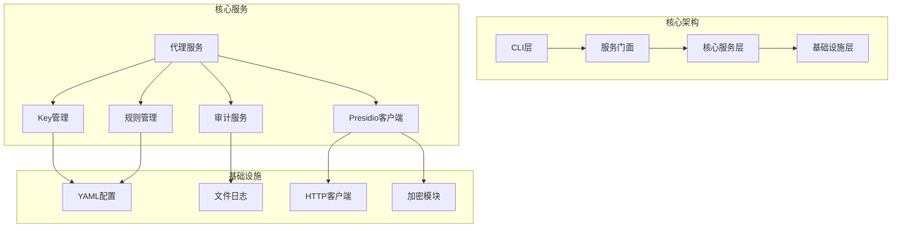
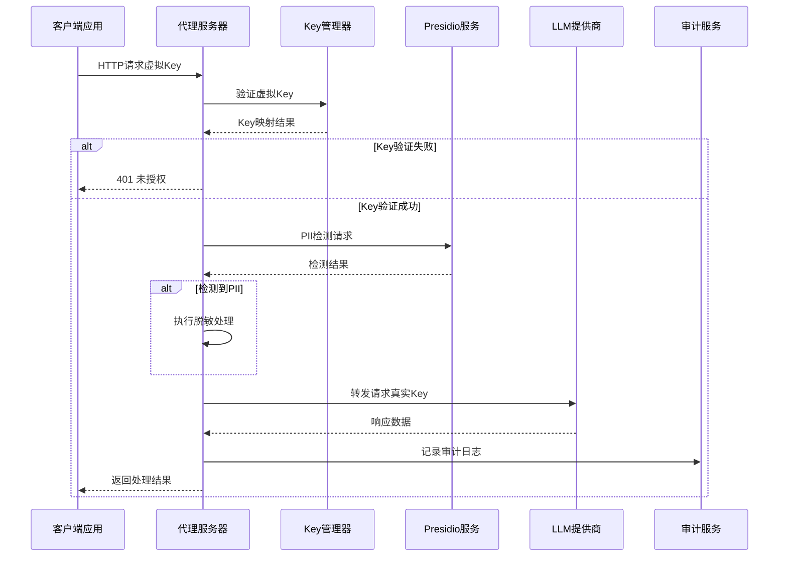
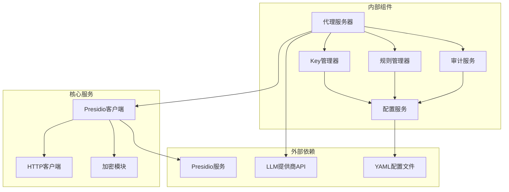

# API参考文档

<cite>
**本文档引用的文件**
- [design-update-20260404-v1.0-init.md](file://doc/design/design-update-20260404-v1.0-init.md)
- [02_proxy_service.md](file://doc/test/tcs/v1.0/02_proxy_service.md)
- [03_key_management.md](file://doc/test/tcs/v1.0/03_key_management.md)
- [04_pii_detection.md](file://doc/test/tcs/v1.0/04_pii_detection.md)
- [05_rule_management.md](file://doc/test/tcs/v1.0/05_rule_management.md)
- [06_audit_logging.md](file://doc/test/tcs/v1.0/06_audit_logging.md)
- [07_configuration.md](file://doc/test/tcs/v1.0/07_configuration.md)
- [config_sample.yaml](file://doc/test/tcs/v1.0/test_data/config_sample.yaml)
- [providers_sample.yaml](file://doc/test/tcs/v1.0/test_data/providers_sample.yaml)
</cite>

## 目录
1. [简介](#简介)
2. [项目结构](#项目结构)
3. [核心组件](#核心组件)
4. [架构概览](#架构概览)
5. [详细组件分析](#详细组件分析)
6. [依赖关系分析](#依赖关系分析)
7. [性能考虑](#性能考虑)
8. [故障排除指南](#故障排除指南)
9. [结论](#结论)
10. [附录](#附录)

## 简介

LLM Privacy Gateway是一个基于Python开发的本地隐私保护代理服务，旨在为大语言模型API调用提供PII（个人身份信息）检测和脱敏功能。该项目采用模块化设计，支持OpenAI API格式的请求转发，具备完善的隐私保护机制。

### 主要特性

- **PII检测与脱敏**：基于Presidio服务实现敏感信息检测和脱敏处理
- **虚拟Key管理**：提供虚拟Key生成、映射和验证机制
- **规则管理**：支持内置和自定义规则的加载、启用/禁用
- **审计日志**：完整的请求处理记录和统计功能
- **配置驱动**：基于YAML配置的灵活系统配置
- **多提供商支持**：支持OpenAI、Azure OpenAI、Anthropic等多家LLM提供商

## 项目结构



**图表来源**
- [design-update-20260404-v1.0-init.md: 70-122:70-122](file://doc/design/design-update-20260404-v1.0-init.md#L70-L122)
- [design-update-20260404-v1.0-init.md: 124-160:124-160](file://doc/design/design-update-20260404-v1.0-init.md#L124-L160)

### 目录结构

项目采用分层架构设计，主要包含以下目录结构：

- **src/lpg/**：核心源代码目录
  - **cli/**：CLI命令实现
  - **core/**：核心业务逻辑
  - **models/**：数据模型定义
  - **utils/**：工具函数
- **rules/**：内置规则文件
- **tests/**：测试代码
- **docs/**：文档资源

**章节来源**
- [design-update-20260404-v1.0-init.md: 742-768:742-768](file://doc/design/design-update-20260404-v1.0-init.md#L742-L768)

## 核心组件

### 代理服务（Proxy Service）

代理服务是系统的核心组件，负责接收外部API请求并进行处理。它实现了完整的请求处理流程，包括虚拟Key验证、PII检测、脱敏处理和请求转发。

#### 主要功能

- **请求接收**：监听本地端口，接收API请求
- **虚拟Key验证**：验证请求中的虚拟Key有效性
- **PII检测**：调用Presidio服务检测敏感信息
- **脱敏处理**：对检测到的PII进行脱敏处理
- **请求转发**：将处理后的请求转发到目标LLM服务
- **响应处理**：处理目标服务的响应并返回给客户端

#### 服务状态

系统提供详细的服务状态信息，包括运行状态、主机地址、端口号、进程ID、运行时间和统计信息等。

**章节来源**
- [design-update-20260404-v1.0-init.md: 570-741:570-741](file://doc/design/design-update-20260404-v1.0-init.md#L570-L741)

### Key管理服务

Key管理服务提供虚拟Key的生成、管理和验证功能。每个虚拟Key都与真实的LLM提供商API Key相关联，并支持过期时间设置和权限控制。

#### Key属性

- **ID**：Key的唯一标识符
- **虚拟Key**：客户端使用的Key值
- **提供商**：关联的LLM提供商
- **名称**：Key的描述性名称
- **创建时间**：Key的创建时间
- **过期时间**：Key的有效期
- **权限**：Key的使用权限配置
- **使用次数**：Key的使用统计
- **最后使用时间**：Key的最后使用时间

**章节来源**
- [03_key_management.md: 38-50:38-50](file://doc/test/tcs/v1.0/03_key_management.md#L38-L50)

### 规则管理服务

规则管理服务负责PII检测规则的加载、管理和应用。系统支持内置规则和自定义规则，用户可以根据需要启用或禁用特定规则。

#### 规则分类

- **PII**：个人身份信息规则
- **凭证信息**：密码、API Key、Token等
- **金融信息**：信用卡号、银行账号等

#### 规则状态

- **启用**：规则参与检测
- **禁用**：规则不参与检测

**章节来源**
- [05_rule_management.md: 601-623:601-623](file://doc/test/tcs/v1.0/05_rule_management.md#L601-L623)

### 审计服务

审计服务提供完整的请求处理记录功能，包括请求日志、错误日志、PII检测结果和性能统计等。

#### 日志级别

- **INFO**：正常操作流程记录
- **WARNING**：潜在问题记录
- **ERROR**：错误信息记录
- **DEBUG**：调试信息记录

#### 审计字段

- **时间戳**：请求处理时间
- **级别**：日志级别
- **请求ID**：请求唯一标识
- **客户端IP**：请求来源IP
- **方法**：HTTP方法
- **路径**：请求路径
- **状态码**：响应状态码
- **耗时**：请求处理时间
- **PII检测结果**：可选的PII检测信息

**章节来源**
- [06_audit_logging.md: 344-356:344-356](file://doc/test/tcs/v1.0/06_audit_logging.md#L344-L356)

## 架构概览



**图表来源**
- [design-update-20260404-v1.0-init.md: 166-250:166-250](file://doc/design/design-update-20260404-v1.0-init.md#L166-L250)

### 数据流设计

系统采用流水线式的数据处理架构，每个请求都会经过以下处理阶段：

1. **请求接收**：代理服务器接收外部请求
2. **Key验证**：验证虚拟Key的有效性和权限
3. **PII检测**：调用Presidio服务检测敏感信息
4. **脱敏处理**：对检测到的PII进行脱敏处理
5. **请求转发**：将处理后的请求转发到目标LLM服务
6. **响应处理**：处理LLM响应并返回给客户端
7. **审计记录**：记录完整的请求处理过程

**章节来源**
- [design-update-20260404-v1.0-init.md: 162-250:162-250](file://doc/design/design-update-20260404-v1.0-init.md#L162-L250)

## 详细组件分析

### 代理服务器API

#### 健康检查端点

**端点**：`GET /health`

**功能**：检查代理服务器的健康状态

**响应**：
```json
{
  "status": "ok",
  "version": "1.0.0",
  "uptime": 1234.56
}
```

**章节来源**
- [design-update-20260404-v1.0-init.md: 734-741:734-741](file://doc/design/design-update-20260404-v1.0-init.md#L734-L741)

#### OpenAI API兼容端点

**端点**：`POST /v1/chat/completions`

**功能**：处理聊天补全请求

**请求头**：
- `Authorization: Bearer sk-virtual-{虚拟Key}`
- `Content-Type: application/json`

**请求体**（示例）：
```json
{
  "model": "gpt-3.5-turbo",
  "messages": [
    {
      "role": "user", 
      "content": "你好"
    }
  ],
  "stream": false
}
```

**响应**：标准OpenAI API格式的响应

**章节来源**
- [design-update-20260404-v1.0-init.md: 698-711:698-711](file://doc/design/design-update-20260404-v1.0-init.md#L698-L711)

**端点**：`POST /v1/completions`

**功能**：处理文本补全请求

**端点**：`POST /v1/embeddings`

**功能**：处理嵌入向量生成请求

**章节来源**
- [02_proxy_service.md: 255-342:255-342](file://doc/test/tcs/v1.0/02_proxy_service.md#L255-L342)

### Key管理API

#### 创建虚拟Key

**端点**：`lpg key create`

**参数**：
- `--provider`：提供商名称（必需）
- `--name`：Key名称（可选）
- `--expires`：过期时间（可选）
- `--permissions`：权限配置（可选）

**响应**：
```json
{
  "id": "vk_xxxxxxxxxxxxxxxx",
  "virtual_key": "sk-virtual-xxxxxxxx",
  "provider": "openai",
  "name": "test-key",
  "created_at": "2026-01-01T00:00:00Z",
  "expires_at": "2026-12-31T23:59:59Z",
  "permissions": {}
}
```

**章节来源**
- [03_key_management.md: 38-50:38-50](file://doc/test/tcs/v1.0/03_key_management.md#L38-L50)

#### 列出虚拟Key

**端点**：`lpg key list`

**参数**：
- `--format`：输出格式（json/yaml）

**响应**：Key列表，包含每个Key的详细信息

#### 获取Key详情

**端点**：`lpg key show <key_id>`

**响应**：指定Key的完整信息

#### 吊销虚拟Key

**端点**：`lpg key revoke <key_id>`

**响应**：吊销确认信息

**章节来源**
- [03_key_management.md: 206-219:206-219](file://doc/test/tcs/v1.0/03_key_management.md#L206-L219)

### 规则管理API

#### 列出规则

**端点**：`lpg rule list`

**参数**：
- `--category`：按分类筛选（pii/credentials/finance）
- `--enabled`：只显示启用的规则
- `--disabled`：只显示禁用的规则

**响应**：规则列表，包含规则名称、分类、状态、优先级等信息

#### 启用/禁用规则

**端点**：`lpg rule enable <rule_name>`
**端点**：`lpg rule disable <rule_name>`

**响应**：操作确认信息

#### 导入规则

**端点**：`lpg rule import <file_path>`

**参数**：
- 支持YAML和JSON格式的规则文件

**响应**：导入结果和统计信息

**章节来源**
- [05_rule_management.md: 118-177:118-177](file://doc/test/tcs/v1.0/05_rule_management.md#L118-L177)

### 审计日志API

#### 查询日志

**端点**：`lpg log get`

**参数**：
- `--lines`：显示最近N条日志
- `--level`：按日志级别过滤
- `--since`：按时间范围过滤

**响应**：日志列表，支持JSON格式输出

#### 导出日志

**端点**：`lpg log export <output_path>`

**参数**：
- `--since`：起始时间
- `--until`：结束时间

**响应**：导出结果和文件路径

**章节来源**
- [06_audit_logging.md: 87-166:87-166](file://doc/test/tcs/v1.0/06_audit_logging.md#L87-L166)

### 配置管理API

#### 初始化配置

**端点**：`lpg config init`

**参数**：
- `--non-interactive`：非交互模式
- `--output`：输出路径
- `--force`：强制覆盖

**响应**：配置文件生成结果

#### 读取/设置配置

**端点**：`lpg config get <key>`
**端点**：`lpg config set <key> <value>`

**参数**：
- 支持嵌套配置项（如 `proxy.port`）

**响应**：配置值或设置结果

**章节来源**
- [07_configuration.md: 37-173:37-173](file://doc/test/tcs/v1.0/07_configuration.md#L37-L173)

## 依赖关系分析



**图表来源**
- [design-update-20260404-v1.0-init.md: 124-160:124-160](file://doc/design/design-update-20260404-v1.0-init.md#L124-L160)

### 组件耦合度分析

系统采用松耦合设计，各组件通过接口和依赖注入进行交互：

- **服务门面**：提供统一的对外接口，隐藏内部组件依赖关系
- **依赖注入**：通过构造函数注入依赖，便于测试和维护
- **接口抽象**：定义清晰的接口契约，降低组件间的耦合度

**章节来源**
- [design-update-20260404-v1.0-init.md: 415-480:415-480](file://doc/design/design-update-20260404-v1.0-init.md#L415-L480)

## 性能考虑

### 并发处理

系统支持高并发请求处理，采用异步I/O模型处理大量并发连接：

- **最大连接数**：默认100个并发连接
- **请求队列**：支持请求排队和限流
- **资源管理**：自动管理连接池和内存使用

### 缓存策略

- **Key缓存**：缓存Key映射关系，减少数据库查询
- **规则缓存**：缓存加载的规则，提高检测效率
- **响应缓存**：可选的响应缓存机制

### 性能监控

系统提供详细的性能统计信息：

- **请求统计**：总请求数、成功/失败数
- **延迟统计**：平均延迟、P50/P95/P99延迟
- **PII检测统计**：检测数量、脱敏效果

**章节来源**
- [02_proxy_service.md: 686-715:686-715](file://doc/test/tcs/v1.0/02_proxy_service.md#L686-L715)

## 故障排除指南

### 常见错误及解决方案

#### 401 未授权错误

**原因**：虚拟Key无效或已过期

**解决方案**：
1. 验证虚拟Key格式是否正确
2. 检查Key是否已过期
3. 确认Key是否已被吊销
4. 重新生成新的虚拟Key

#### 502 网关错误

**原因**：无法连接到目标LLM服务

**解决方案**：
1. 检查网络连接
2. 验证提供商配置
3. 确认目标服务可用性
4. 检查防火墙设置

#### 504 网关超时

**原因**：目标服务响应超时

**解决方案**：
1. 增加超时配置
2. 检查目标服务性能
3. 优化请求参数
4. 实施重试机制

### 调试技巧

#### 启用详细日志

```bash
lpg start --log-level debug
```

#### 检查服务状态

```bash
lpg status
```

#### 查看审计日志

```bash
lpg log get --lines 100
```

**章节来源**
- [06_audit_logging.md: 167-245:167-245](file://doc/test/tcs/v1.0/06_audit_logging.md#L167-L245)

## 结论

LLM Privacy Gateway提供了一个完整的企业级隐私保护解决方案，具有以下优势：

### 技术优势

- **模块化设计**：清晰的架构分离，便于维护和扩展
- **安全性**：内置PII检测和脱敏机制，确保数据隐私
- **灵活性**：支持多种LLM提供商和配置选项
- **可观测性**：完整的审计日志和性能监控

### 适用场景

- **企业合规**：满足GDPR等数据保护法规要求
- **API网关**：作为LLM服务的统一入口
- **隐私保护**：在AI应用中保护用户敏感信息
- **多租户环境**：支持多个应用程序的安全隔离

### 未来发展

系统采用渐进增强的设计理念，为后续版本的功能扩展预留了充分的空间，包括规则库订阅、云端同步、可视化配置界面等高级功能。

## 附录

### 配置示例

**基本配置**（config_sample.yaml）：
```yaml
proxy:
  host: 127.0.0.1
  port: 8080
  timeout: 30
  max_connections: 100

log:
  level: info
  file: /var/log/lpg.log

providers:
  openai:
    type: openai
    api_key: sk-test123456789
    base_url: https://api.openai.com
    timeout: 60

rules:
  enabled: true
  path: /etc/lpg/rules

audit:
  enabled: true
  log_file: /var/log/lpg/audit.log
```

**提供商配置**（providers_sample.yaml）：
```yaml
providers:
  openai:
    type: openai
    api_key: sk-test123456789
    base_url: https://api.openai.com
    timeout: 60
    enabled: true

  azure:
    type: azure_openai
    api_key: azure-test-key
    base_url: https://your-resource.openai.azure.com
    api_version: 2024-02-01
    timeout: 60
    enabled: true

  anthropic:
    type: anthropic
    api_key: sk-ant-test123
    base_url: https://api.anthropic.com
    timeout: 60
    enabled: false
```

### API使用示例

#### 基本请求示例

```bash
# 创建虚拟Key
lpg key create --provider openai --name production-key

# 启动代理服务
lpg start --port 8080

# 发送LLM请求
curl -X POST http://localhost:8080/v1/chat/completions \
  -H "Authorization: Bearer sk-virtual-{虚拟Key}" \
  -H "Content-Type: application/json" \
  -d '{
    "model": "gpt-3.5-turbo",
    "messages": [{"role": "user", "content": "你好"}]
  }'
```

#### 高级配置示例

```bash
# 设置配置
lpg config set proxy.max_connections 200
lpg config set log.level debug

# 导出日志
lpg log export /tmp/lpg-audit.json --since "2026-01-01"

# 管理规则
lpg rule import ./custom-rules.yaml
lpg rule enable pii-detection
```

**章节来源**
- [config_sample.yaml: 1-27:1-27](file://doc/test/tcs/v1.0/test_data/config_sample.yaml#L1-L27)
- [providers_sample.yaml: 1-25:1-25](file://doc/test/tcs/v1.0/test_data/providers_sample.yaml#L1-L25)