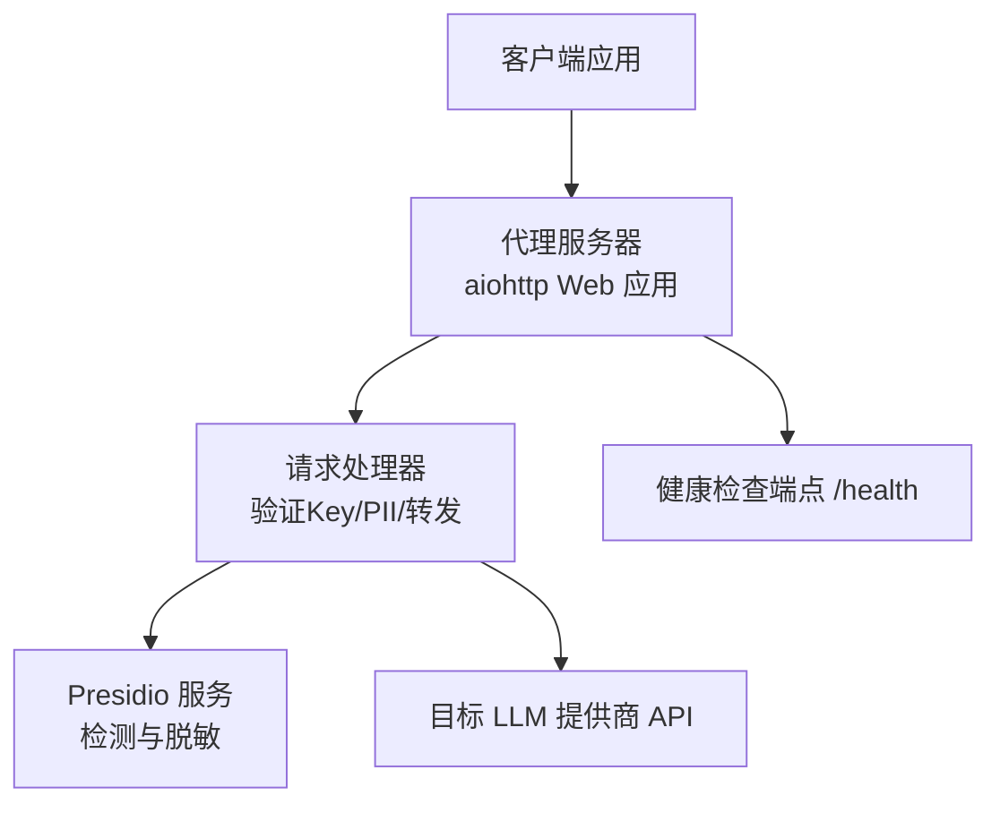
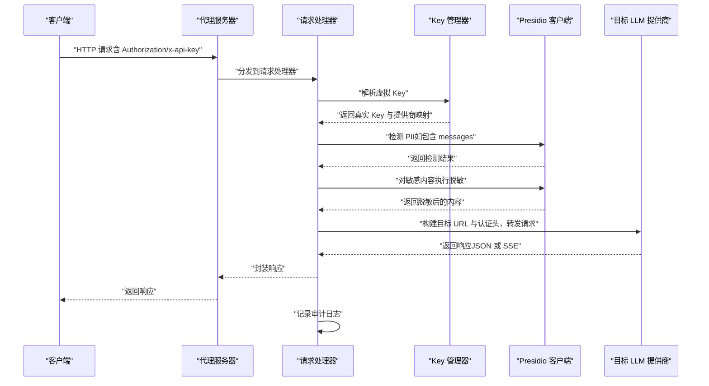
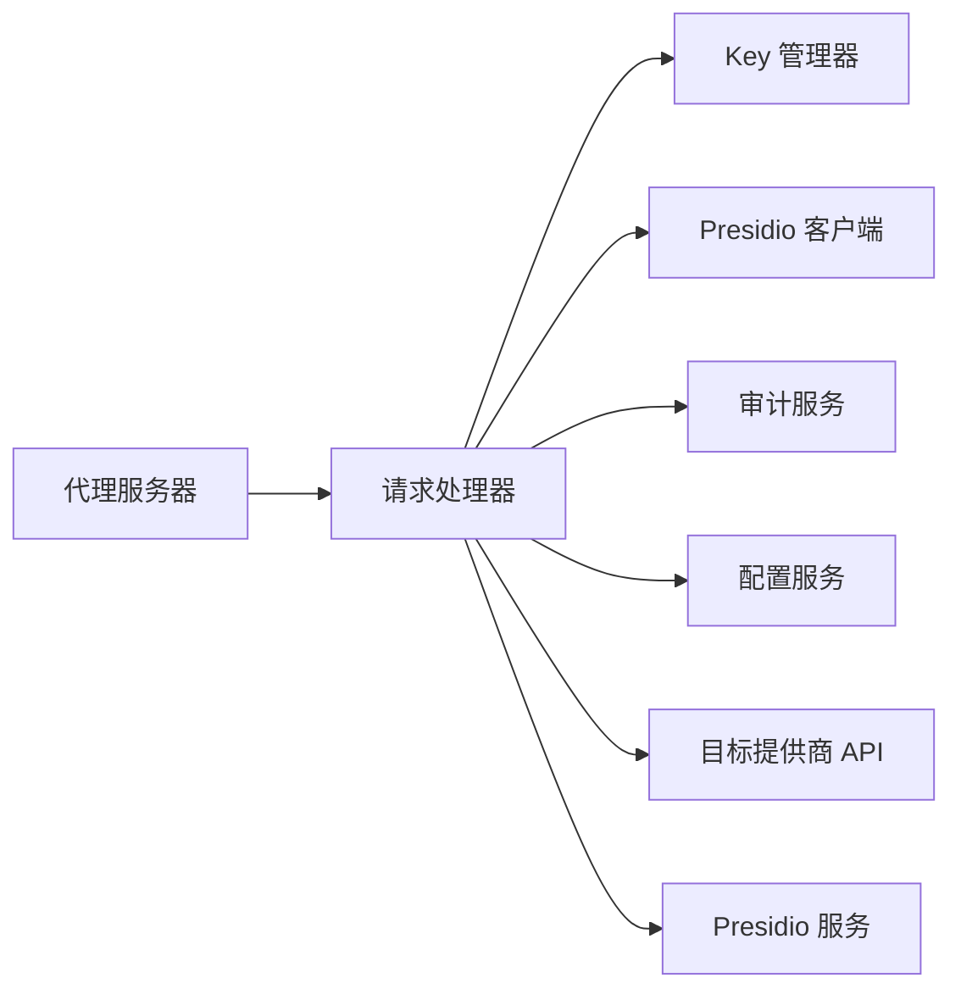

# HTTP API端点

<cite>
**本文引用的文件**
- [设计文档](file://doc/design/design-update-20260404-v1.0-init.md)
- [代理服务测试用例](file://doc/test/tcs/v1.0/02_proxy_service.md)
- [键管理测试用例](file://doc/test/tcs/v1.0/03_key_management.md)
- [端到端测试数据](file://doc/test/tcs/v1.0/08_e2e_integration_testdata.md)
- [提供商配置示例](file://doc/test/tcs/v1.0/test_data/providers_sample.yaml)
</cite>

## 目录
1. [简介](#简介)
2. [项目结构](#项目结构)
3. [核心组件](#核心组件)
4. [架构总览](#架构总览)
5. [详细组件分析](#详细组件分析)
6. [依赖分析](#依赖分析)
7. [性能考量](#性能考量)
8. [故障排查指南](#故障排查指南)
9. [结论](#结论)
10. [附录](#附录)

## 简介
本文件为 LLM Privacy Gateway 的 HTTP API 端点权威文档，覆盖代理服务端点（/v1/chat/completions、/v1/completions、/v1/embeddings）、通用转发端点（/{path:.*}）以及健康检查端点（/health）。文档详细说明各端点的 URL 模式、HTTP 方法、请求参数、响应格式、认证机制（虚拟 Key 验证）、错误处理与安全注意事项，并提供使用示例与 SDK 集成建议。

## 项目结构
- 代理服务基于 aiohttp Web 应用，路由在代理服务器中集中注册。
- 请求进入后由请求处理器完成虚拟 Key 验证、PII 检测与脱敏、目标 URL 构建、请求头转换、转发与响应处理（含流式 SSE）。
- 健康检查端点用于服务存活探测与基本状态查询。

图表来源
- [设计文档:570-741](file://doc/design/design-update-20260404-v1.0-init.md#L570-L741)
- [设计文档:743-944](file://doc/design/design-update-20260404-v1.0-init.md#L743-L944)

章节来源
- [设计文档:570-741](file://doc/design/design-update-20260404-v1.0-init.md#L570-L741)

## 核心组件
- 代理服务器（ProxyServer）
  - 路由注册：/v1/chat/completions、/v1/completions、/v1/embeddings、/{path:.*}、/health
  - 生命周期管理：启动、停止、守护进程模式
  - 统计指标：总请求数、成功/失败数、PII 检测数、总耗时
- 请求处理器（RequestHandler）
  - 虚拟 Key 提取与解析
  - PII 检测与脱敏（Presidio）
  - 目标 URL 构建与请求头转换
  - 普通响应与流式响应（SSE）处理
  - 审计日志记录
- 健康检查端点（/health）
  - 返回服务状态、版本与运行时长

章节来源
- [设计文档:570-741](file://doc/design/design-update-20260404-v1.0-init.md#L570-L741)
- [设计文档:743-944](file://doc/design/design-update-20260404-v1.0-init.md#L743-L944)

## 架构总览
下图展示请求从客户端到目标 LLM 提供商的完整链路，包括虚拟 Key 验证、PII 检测与脱敏、请求头转换与转发、响应处理与审计日志。

图表来源
- [设计文档:162-250](file://doc/design/design-update-20260404-v1.0-init.md#L162-L250)
- [设计文档:743-944](file://doc/design/design-update-20260404-v1.0-init.md#L743-L944)

## 详细组件分析

### 代理服务端点
- /v1/chat/completions
  - 方法：POST
  - 用途：OpenAI 兼容聊天补全请求
  - 请求体：包含 model、messages、temperature、max_tokens 等参数（详见测试数据）
  - 认证：Authorization: Bearer <虚拟Key> 或 x-api-key: <虚拟Key>
  - 响应：与目标提供商一致的 JSON 结构
  - 特性：支持流式响应（stream=true），返回 text/event-stream
  - 错误：400（JSON 解析失败）、401（虚拟 Key 缺失/无效）、500（提供商未配置）、502/504（上游错误）
  - 示例：见“端到端测试数据”中的 chat_completion_request
- /v1/completions
  - 方法：POST
  - 用途：OpenAI 兼容补全请求
  - 请求体：包含 model、prompt、temperature、max_tokens 等参数
  - 认证：同上
  - 响应：与目标提供商一致的 JSON 结构
  - 错误：同上
  - 示例：见“端到端测试数据”中的 completion_request
- /v1/embeddings
  - 方法：POST
  - 用途：OpenAI 兼容嵌入向量请求
  - 请求体：包含 model、input 等参数
  - 认证：同上
  - 响应：包含嵌入向量的 JSON 结构
  - 错误：同上
  - 示例：见“端到端测试数据”中的 embedding_request

章节来源
- [设计文档:570-741](file://doc/design/design-update-20260404-v1.0-init.md#L570-L741)
- [代理服务测试用例:253-342](file://doc/test/tcs/v1.0/02_proxy_service.md#L253-L342)
- [端到端测试数据:91-135](file://doc/test/tcs/v1.0/08_e2e_integration_testdata.md#L91-L135)

### 通用转发端点
- /{path:.*}
  - 方法：POST、GET
  - 用途：将任意路径请求转发至配置的提供商（按提供商 base_url 与原始路径拼接）
  - 认证：根据提供商配置的 auth_type 设置 Authorization/x-api-key/api-key
  - 请求体：透传原始请求体（JSON）
  - 响应：透传目标提供商响应
  - 注意：此端点适合自定义或非 OpenAI 兼容的提供商接口

章节来源
- [设计文档:570-741](file://doc/design/design-update-20260404-v1.0-init.md#L570-L741)
- [设计文档:865-887](file://doc/design/design-update-20260404-v1.0-init.md#L865-L887)

### 健康检查端点
- /health
  - 方法：GET
  - 用途：服务存活与状态检查
  - 响应体字段：
    - status：字符串，服务状态（如 "ok"）
    - version：字符串，服务版本
    - uptime：数值，服务运行时长（秒）
  - 示例响应：见“代理服务测试用例”中的健康检查用例

章节来源
- [设计文档:734-740](file://doc/design/design-update-20260404-v1.0-init.md#L734-L740)
- [代理服务测试用例:776-801](file://doc/test/tcs/v1.0/02_proxy_service.md#L776-L801)

### 认证机制与安全
- 虚拟 Key 验证
  - 提取方式：优先从 Authorization: Bearer <虚拟Key>，否则从 x-api-key 头提取
  - 解析流程：Key 管理器校验虚拟 Key 是否存在、未过期、未吊销，返回真实提供商 Key 与映射
  - 错误：401 Missing API key 或 Invalid API key
- 提供商认证头
  - 根据提供商配置的 auth_type 设置：
    - bearer：Authorization: Bearer <真实Key>
    - x-api-key：x-api-key: <真实Key>
    - api-key：api-key: <真实Key>
- 安全建议
  - 仅使用 HTTPS 传输（建议在反向代理层启用 TLS）
  - 控制虚拟 Key 的过期时间与权限范围
  - 审计日志记录所有请求与 PII 检测结果，便于合规追溯

章节来源
- [设计文档:849-887](file://doc/design/design-update-20260404-v1.0-init.md#L849-L887)
- [键管理测试用例:128-171](file://doc/test/tcs/v1.0/03_key_management.md#L128-L171)
- [端到端测试数据:194-221](file://doc/test/tcs/v1.0/08_e2e_integration_testdata.md#L194-L221)

### 错误处理与响应格式
- 通用错误格式
  - {"error": {"message": "...", "type": "invalid_request_error"}}
- 典型状态码
  - 400：请求体 JSON 解析失败
  - 401：缺失或无效虚拟 Key
  - 500：内部错误（如提供商未配置）
  - 502：上游网关错误
  - 504：上游超时
- 流式响应（SSE）
  - Content-Type: text/event-stream
  - 支持断连与超时处理，日志记录中断与资源释放

章节来源
- [设计文档:938-944](file://doc/design/design-update-20260404-v1.0-init.md#L938-L944)
- [代理服务测试用例:424-514](file://doc/test/tcs/v1.0/02_proxy_service.md#L424-L514)

### 请求与响应示例
- /v1/chat/completions
  - 请求示例：见“端到端测试数据”中的 chat_completion_request
  - 响应示例：见“端到端测试数据”中的 chat_completion_response（测试用例中定义）
- /v1/completions
  - 请求示例：见“端到端测试数据”中的 completion_request
  - 响应示例：见“端到端测试数据”中的 completion_response
- /v1/embeddings
  - 请求示例：见“端到端测试数据”中的 embedding_request
  - 响应示例：见“端到端测试数据”中的 embedding_response
- /health
  - 响应示例：{"status": "ok", "version": "1.0.0", "uptime": <数值>}

章节来源
- [端到端测试数据:75-135](file://doc/test/tcs/v1.0/08_e2e_integration_testdata.md#L75-L135)
- [代理服务测试用例:776-801](file://doc/test/tcs/v1.0/02_proxy_service.md#L776-L801)

### SDK 集成指南
- 基本设置
  - 将 SDK 的 API Base URL 指向本地代理服务（例如 http://127.0.0.1:8080）
  - 在请求头中使用 Authorization: Bearer <虚拟Key> 或 x-api-key: <虚拟Key>
- OpenAI 兼容 SDK
  - Chat Completions：使用 /v1/chat/completions
  - Completions：使用 /v1/completions
  - Embeddings：使用 /v1/embeddings
- 流式处理
  - 设置 stream=true，SDK 将接收 text/event-stream 流
- 错误处理
  - 捕获 401（认证失败）、400（请求体错误）、502/504（上游错误）等状态码并进行重试或降级

章节来源
- [设计文档:836-847](file://doc/design/design-update-20260404-v1.0-init.md#L836-L847)
- [代理服务测试用例:424-454](file://doc/test/tcs/v1.0/02_proxy_service.md#L424-L454)

## 依赖分析
- 组件耦合
  - 代理服务器依赖请求处理器；请求处理器依赖 Key 管理器、Presidio 客户端、审计服务与配置服务
- 外部依赖
  - 目标 LLM 提供商 API（由提供商配置决定）
  - Presidio 服务（Analyzer/Anonymizer）

图表来源
- [设计文档:570-741](file://doc/design/design-update-20260404-v1.0-init.md#L570-L741)
- [设计文档:743-944](file://doc/design/design-update-20260404-v1.0-init.md#L743-L944)

章节来源
- [设计文档:570-741](file://doc/design/design-update-20260404-v1.0-init.md#L570-L741)
- [设计文档:743-944](file://doc/design/design-update-20260404-v1.0-init.md#L743-L944)

## 性能考量
- 异步 I/O：基于 aiohttp 与 asyncio，适合高并发场景
- 流式响应：SSE 流式返回，降低首字节延迟
- 超时与重试：可根据提供商配置设置超时与重试策略
- 统计指标：内置请求数、成功率、失败率与 PII 检测统计，便于性能监控

## 故障排查指南
- 401 未授权
  - 检查虚拟 Key 是否正确传递（Authorization 或 x-api-key）
  - 确认 Key 未过期、未吊销
- 400 请求体错误
  - 确认请求体为合法 JSON
- 502/504 上游错误
  - 检查目标提供商可达性与超时设置
- 流式响应中断
  - 检查客户端连接与代理超时配置
- 健康检查失败
  - 使用 /health 确认服务运行状态与版本

章节来源
- [代理服务测试用例:515-630](file://doc/test/tcs/v1.0/02_proxy_service.md#L515-L630)
- [代理服务测试用例:424-514](file://doc/test/tcs/v1.0/02_proxy_service.md#L424-L514)
- [键管理测试用例:145-171](file://doc/test/tcs/v1.0/03_key_management.md#L145-L171)

## 结论
本文档提供了 LLM Privacy Gateway 的 HTTP API 端点完整说明，涵盖 OpenAI 兼容端点、通用转发端点与健康检查端点，明确了认证机制、错误处理与安全注意事项，并给出使用示例与 SDK 集成建议。建议在生产环境中结合提供商配置、超时与重试策略、TLS 传输与审计日志，确保安全与稳定性。

## 附录
- 提供商配置示例（包含 base_url、auth_type、api_key 等）
  - 参考：[提供商配置示例:1-24](file://doc/test/tcs/v1.0/test_data/providers_sample.yaml#L1-L24)

章节来源
- [提供商配置示例:1-24](file://doc/test/tcs/v1.0/test_data/providers_sample.yaml#L1-L24)