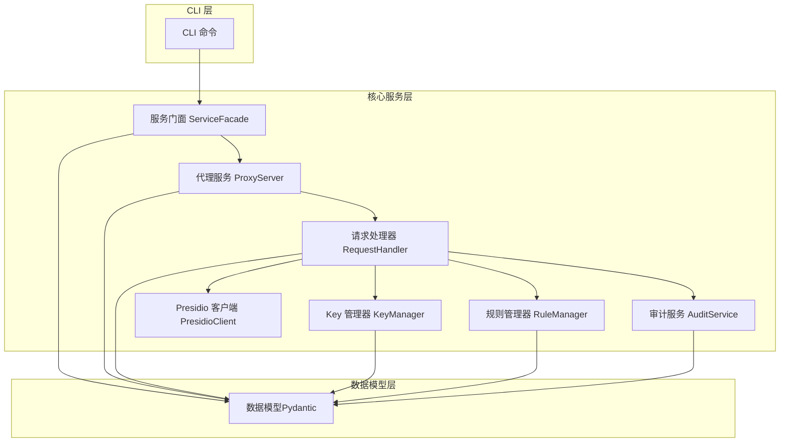
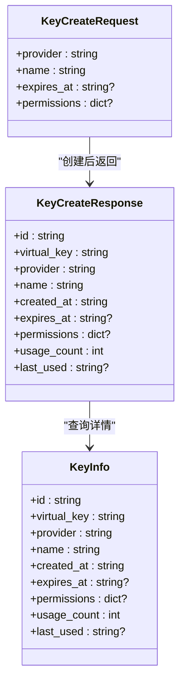
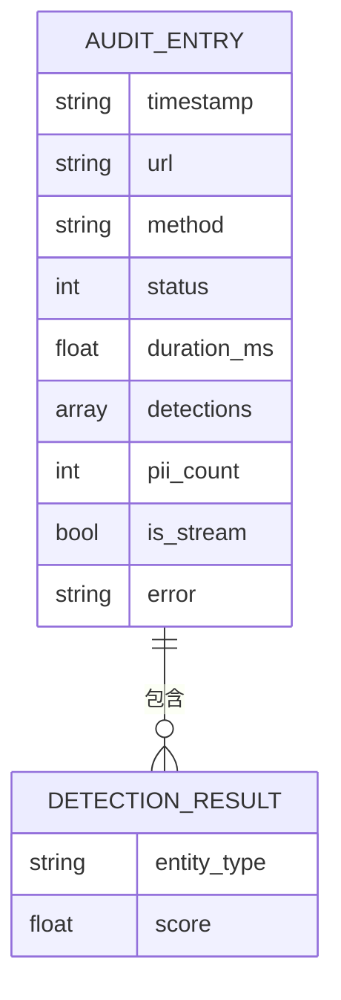
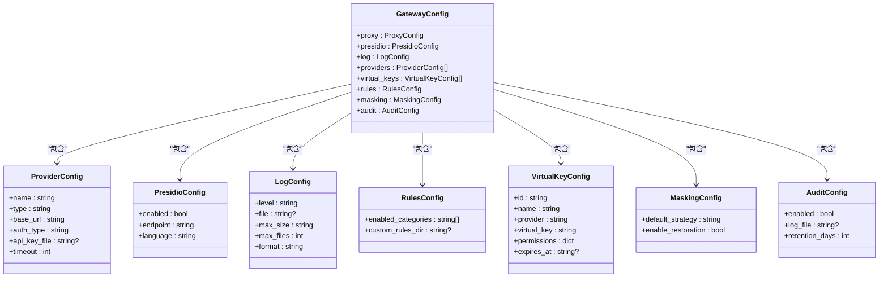
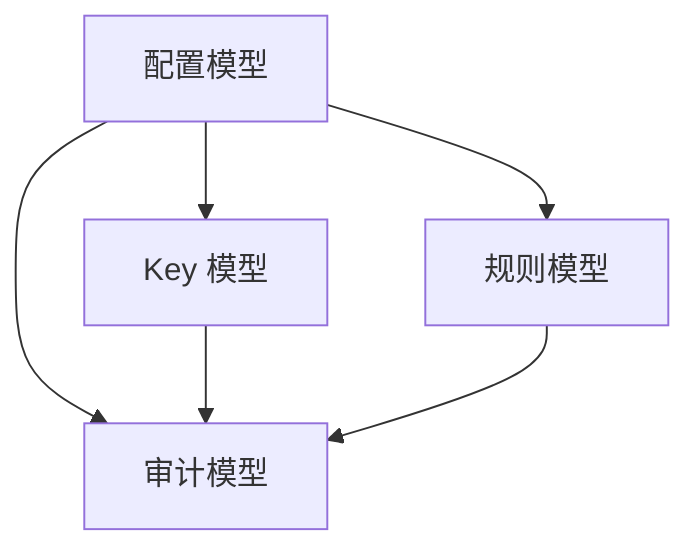
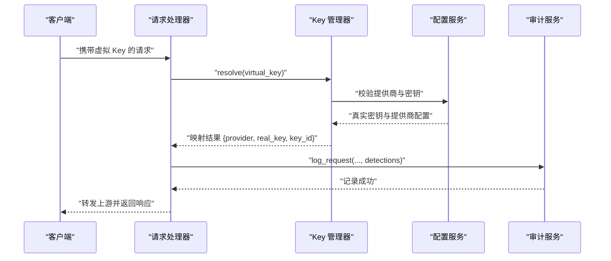
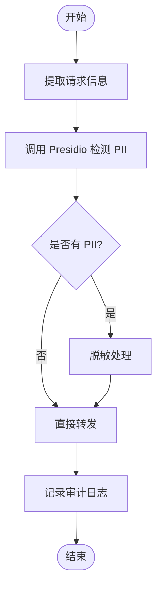
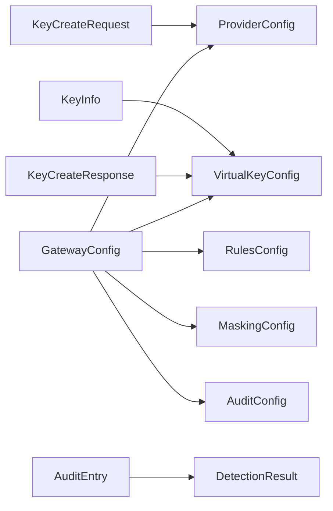

# 数据模型

<cite>
**本文引用的文件**
- [设计文档](file://doc/design/design-update-20260404-v1.0-init.md)
- [配置测试数据](file://doc/test/tcs/v1.0/07_configuration_testdata.md)
- [规则管理测试数据](file://doc/test/tcs/v1.0/05_rule_management_testdata.md)
- [审计日志测试数据](file://doc/test/tcs/v1.0/06_audit_logging_testdata.md)
- [编码规范](file://AGENTS.md)
</cite>

## 目录
1. [简介](#简介)
2. [项目结构](#项目结构)
3. [核心数据模型](#核心数据模型)
4. [架构总览](#架构总览)
5. [详细组件分析](#详细组件分析)
6. [依赖关系分析](#依赖关系分析)
7. [性能考量](#性能考量)
8. [故障排查指南](#故障排查指南)
9. [结论](#结论)
10. [附录](#附录)

## 简介
本文件为 LLM Privacy Gateway 的数据模型文档，聚焦于 v1.0 MVP 版本中的关键数据结构，包括虚拟 Key 管理、审计日志、规则与配置等。文档基于设计文档与测试数据，系统梳理字段定义、数据类型、验证规则与业务约束，并给出关系图与示例数据，帮助开发者与运维人员准确理解与使用。

## 项目结构
- 项目采用四层架构：CLI → Core → Models → Utils。数据模型位于 Models 层，为核心业务提供类型安全与校验。
- 关键模块与数据模型分布：
  - 虚拟 Key 管理：KeyManager 与相关配置模型
  - 审计日志：AuditService 与审计条目模型
  - 规则管理：RuleManager 与规则配置模型
  - 配置系统：ConfigService 与各类配置模型

图表来源
- [设计文档:411-568](file://doc/design/design-update-20260404-v1.0-init.md#L411-L568)

章节来源
- [设计文档:1-2595](file://doc/design/design-update-20260404-v1.0-init.md#L1-L2595)

## 核心数据模型

### 虚拟 Key 相关模型
- KeyCreateRequest/Response：用于创建虚拟 Key 的请求与响应结构
- KeyInfo：Key 管理器返回的 Key 详情结构

图表来源
- [设计文档:1155-1275](file://doc/design/design-update-20260404-v1.0-init.md#L1155-L1275)

字段定义与验证规则（来自设计文档与编码规范）：
- provider
  - 类型：string
  - 验证：必须存在于配置的提供商列表中；由 KeyManager 在创建时校验
- name
  - 类型：string
  - 验证：非空；建议唯一且可读
- expires_at
  - 类型：string（ISO 8601 或相对时间）
  - 验证：可选；若提供需为有效时间格式；过期 Key 会被拒绝解析
- permissions
  - 类型：dict
  - 验证：可选；键值对形式，如 {"models": ["gpt-4"], "max_tokens": 4096}
- usage_count/last_used
  - 类型：int/string
  - 验证：自动维护，创建时为 0/None，每次解析成功递增并更新时间

示例数据（来自测试数据与设计文档）：
- 创建请求示例
  - provider: "openai"
  - name: "vscode"
  - expires_at: "2025-12-31T23:59:59Z"
  - permissions: {"models": ["gpt-4", "gpt-3.5-turbo"], "max_tokens": 4096}
- Key 详情示例
  - id: "vk_a1b2c3"
  - virtual_key: "sk-virtual_abc123"
  - provider: "openai"
  - name: "vscode"
  - created_at: "2025-01-01T10:00:00Z"
  - expires_at: "2025-12-31T23:59:59Z"
  - permissions: {"models": ["gpt-4", "gpt-3.5-turbo"], "max_tokens": 4096}
  - usage_count: 12
  - last_used: "2025-04-01T14:30:00Z"

章节来源
- [设计文档:1155-1275](file://doc/design/design-update-20260404-v1.0-init.md#L1155-L1275)
- [配置测试数据:354-438](file://doc/test/tcs/v1.0/07_configuration_testdata.md#L354-L438)

### 审计日志模型 AuditEntry
- 审计条目用于记录请求处理的关键信息，便于追踪与合规审计

图表来源
- [设计文档:1482-1520](file://doc/design/design-update-20260404-v1.0-init.md#L1482-L1520)

字段定义与验证规则：
- timestamp
  - 类型：string（ISO 8601）
  - 验证：必填；格式需满足 ISO 8601，支持微秒/毫秒精度
- url
  - 类型：string（URL）
  - 验证：必填；需为合法 URL（http/https），支持查询参数与路径参数
- method
  - 类型：string（HTTP 方法）
  - 验证：必填；需为合法方法（GET/POST/PUT/DELETE 等）
- status
  - 类型：int
  - 验证：必填；需为合法 HTTP 状态码（2xx/4xx/5xx）
- duration_ms
  - 类型：float
  - 验证：必填；单位毫秒，需为非负数
- detections
  - 类型：array of DetectionResult
  - 验证：可选；当检测到 PII 时存在；每个元素包含 entity_type 与 score
- pii_count
  - 类型：int
  - 验证：必填；detections 数量的计数
- is_stream
  - 类型：bool
  - 验证：可选；是否为流式响应
- error
  - 类型：string
  - 验证：可选；错误信息

示例数据（来自测试数据与设计文档）：
- 审计条目示例
  - timestamp: "2025-04-01T10:30:45.123456Z"
  - url: "https://api.openai.com/v1/chat/completions"
  - method: "POST"
  - status: 200
  - duration_ms: 156.78
  - detections: [{"entity_type": "EMAIL_ADDRESS", "score": 0.95}, {"entity_type": "PHONE_NUMBER", "score": 0.9}]
  - pii_count: 2
  - is_stream: false
  - error: null

章节来源
- [设计文档:1482-1520](file://doc/design/design-update-20260404-v1.0-init.md#L1482-L1520)
- [审计日志测试数据:1-768](file://doc/test/tcs/v1.0/06_audit_logging_testdata.md#L1-L768)

### PII 检测结果模型 DetectionResult
- 用于描述 Presidio 检测到的敏感信息实体

字段定义与验证规则：
- entity_type
  - 类型：string
  - 验证：必填；枚举值（如 EMAIL_ADDRESS、PHONE_NUMBER、CN_ID_CARD 等）
- start/end
  - 类型：int
  - 验证：必填；字符索引范围，start < end
- score
  - 类型：float
  - 验证：必填；置信度 [0, 1]，通常 ≥ 0.5 视为有效检测

示例数据（来自测试数据）：
- 单个检测结果
  - entity_type: "EMAIL_ADDRESS"
  - start: 10
  - end: 30
  - score: 0.95
- 多个检测结果
  - [{"entity_type": "EMAIL_ADDRESS", "start": 10, "end": 30, "score": 0.95}, {"entity_type": "PHONE_NUMBER", "start": 35, "end": 46, "score": 0.90}]

章节来源
- [设计文档:1482-1520](file://doc/design/design-update-20260404-v1.0-init.md#L1482-L1520)
- [审计日志测试数据:165-208](file://doc/test/tcs/v1.0/06_audit_logging_testdata.md#L165-L208)

### 配置模型
- GatewayConfig：主配置容器，聚合各子配置
- ProviderConfig：LLM 提供商配置
- PresidioConfig：Presidio 服务配置
- LogConfig：日志配置
- RulesConfig：规则配置
- VirtualKeyConfig：虚拟 Key 配置
- MaskingConfig：脱敏配置
- AuditConfig：审计配置

图表来源
- [设计文档:1869-1879](file://doc/design/design-update-20260404-v1.0-init.md#L1869-L1879)

字段定义与验证规则（来自设计文档与编码规范）：
- proxy.host/port/timeout/max_connections
  - host：IPv4/IPv6/域名；默认 127.0.0.1
  - port：1-65535；默认 8080
  - timeout：1-300；默认 60
  - max_connections：1-10000；默认 100
- presidio.enabled/endpoint/language
  - enabled：bool；默认 true
  - endpoint：http/https URL；默认 http://localhost:5001
  - language：ISO 639-1；默认 zh
- log.level/file/max_size/max_files/format
  - level：debug/info/warn/error/critical；默认 info
  - file：可选；默认 ~/.llm-privacy-gateway/logs/gateway.log
  - max_size：带单位的字符串；默认 100MB
  - max_files：1-1000；默认 10
  - format：json/text；默认 json
- providers[]
  - name/type/base_url/auth_type/timeout；type 支持 openai/anthropic/gemini/custom
- virtual_keys[]
  - id/name/provider/virtual_key/permissions/expires_at；permissions 为键值对
- rules.enabled_categories/custom_rules_dir
  - enabled_categories：至少包含一个类别（如 pii/credentials/finance）
  - custom_rules_dir：可选；指向自定义规则目录
- masking.default_strategy/enable_restoration
  - default_strategy：replace/mask/hash/redact；默认 replace
  - enable_restoration：bool；默认 true
- audit.enabled/log_file/retention_days
  - enabled：bool；默认 false
  - log_file：可选；默认 ~/.llm-privacy-gateway/audit.log
  - retention_days：1-3650；默认 30

章节来源
- [设计文档:1807-1879](file://doc/design/design-update-20260404-v1.0-init.md#L1807-L1879)
- [配置测试数据:1-800](file://doc/test/tcs/v1.0/07_configuration_testdata.md#L1-L800)

### 规则数据模型
- 规则文件（YAML/JSON）包含规则列表，每条规则具有 id/name/type/pattern/category/entity_type/priority/enabled/description 等字段
- 支持正则（regex）与关键词（keyword）两类规则
- entity_type 支持内置与自定义类型（如 EMAIL_ADDRESS、CN_ID_CARD 等）

字段定义与验证规则（来自规则管理测试数据）：
- id
  - 类型：string；必填；唯一标识；建议使用字母数字与下划线
- name
  - 类型：string；必填；人类可读名称
- type
  - 类型：string；必填；regex/keyword/ai（大小写不敏感）
- pattern/keywords
  - regex：正则表达式；需可编译
  - keyword：关键词数组；不能为空
- category
  - 类型：string；必填；如 pii/credentials/finance
- entity_type
  - 类型：string；必填；如 EMAIL_ADDRESS/CN_ID_CARD
- priority
  - 类型：int；1-100；默认 50
- enabled
  - 类型：bool；默认 true
- description
  - 类型：string；可选；规则说明

示例数据（来自规则管理测试数据）：
- 正则规则示例
  - id: "email_detector"
  - name: "邮箱地址检测"
  - type: "regex"
  - pattern: "[a-zA-Z0-9._%+-]+@[a-zA-Z0-9.-]+\\.[a-zA-Z]{2,}"
  - category: "pii"
  - entity_type: "EMAIL_ADDRESS"
  - priority: 50
  - enabled: true
  - description: "检测标准邮箱地址格式"

章节来源
- [规则管理测试数据:1-585](file://doc/test/tcs/v1.0/05_rule_management_testdata.md#L1-L585)

## 架构总览
- 数据模型通过 Pydantic 提供类型安全与自动校验
- KeyManager/RuleManager/AuditService 等核心服务依赖配置模型进行运行时行为控制
- 审计日志模型贯穿请求处理全流程，记录 PII 检测与脱敏结果

图表来源
- [设计文档:1807-1879](file://doc/design/design-update-20260404-v1.0-init.md#L1807-L1879)

## 详细组件分析

### 虚拟 Key 生命周期与解析流程

图表来源
- [设计文档:785-944](file://doc/design/design-update-20260404-v1.0-init.md#L785-L944)
- [设计文档:1198-1232](file://doc/design/design-update-20260404-v1.0-init.md#L1198-L1232)

章节来源
- [设计文档:785-944](file://doc/design/design-update-20260404-v1.0-init.md#L785-L944)
- [设计文档:1198-1232](file://doc/design/design-update-20260404-v1.0-init.md#L1198-L1232)

### 审计日志记录流程

图表来源
- [设计文档:810-847](file://doc/design/design-update-20260404-v1.0-init.md#L810-L847)
- [设计文档:1482-1520](file://doc/design/design-update-20260404-v1.0-init.md#L1482-L1520)

章节来源
- [设计文档:810-847](file://doc/design/design-update-20260404-v1.0-init.md#L810-L847)
- [设计文档:1482-1520](file://doc/design/design-update-20260404-v1.0-init.md#L1482-L1520)

## 依赖关系分析
- 模型层依赖关系
  - GatewayConfig 作为根容器，聚合 ProviderConfig/VirtualKeyConfig/RulesConfig/MaskingConfig/AuditConfig
  - KeyCreateRequest/Response/KeyInfo 依赖 ProviderConfig 与配置服务
  - AuditEntry 依赖 DetectionResult
- 服务层依赖关系
  - RequestHandler 依赖 KeyManager/RuleManager/PresidioClient/AuditService/ConfigService
  - KeyManager 依赖 ConfigService 与虚拟 Key 配置
  - AuditService 依赖配置中的审计日志文件路径与保留策略

图表来源
- [设计文档:1807-1879](file://doc/design/design-update-20260404-v1.0-init.md#L1807-L1879)

章节来源
- [设计文档:1807-1879](file://doc/design/design-update-20260404-v1.0-init.md#L1807-L1879)

## 性能考量
- 审计日志采用 JSONL 文本追加写入，建议配合轮转与压缩策略，避免单文件过大
- 虚拟 Key 解析与规则匹配应避免在热路径中进行昂贵操作；可考虑缓存与预编译规则
- Presidio 检测与脱敏为异步 I/O，注意超时与重试策略，防止阻塞请求处理

## 故障排查指南
- 审计日志字段校验
  - timestamp/url/method/status/duration_ms 必填且格式正确
  - detections 中的 entity_type/score/start/end 需满足枚举与范围约束
- 虚拟 Key 相关
  - provider 必须存在于配置；expires_at 过期将导致解析失败
  - permissions 格式错误会导致创建失败
- 配置相关
  - host/port/timeout/max_connections 等数值范围与格式需符合要求
  - log_file/audit.log_file 路径需可写且存在

章节来源
- [审计日志测试数据:1-768](file://doc/test/tcs/v1.0/06_audit_logging_testdata.md#L1-L768)
- [配置测试数据:1-800](file://doc/test/tcs/v1.0/07_configuration_testdata.md#L1-L800)

## 结论
本文档系统梳理了 LLM Privacy Gateway v1.0 的核心数据模型，明确了虚拟 Key、审计日志、规则与配置等关键结构的字段、类型与验证规则，并通过关系图与示例数据帮助读者快速理解与落地。建议在生产环境中结合配置优先级与环境变量进行灵活部署，并持续完善审计与监控体系。

## 附录
- 术语
  - PII：个人身份信息（如邮箱、电话、身份证等）
  - 虚拟 Key：用于代理层鉴权的中间密钥，映射到真实提供商密钥
  - 审计日志：记录请求处理过程与结果的结构化日志
- 参考
  - 编码规范与类型注解要求详见编码规范文档