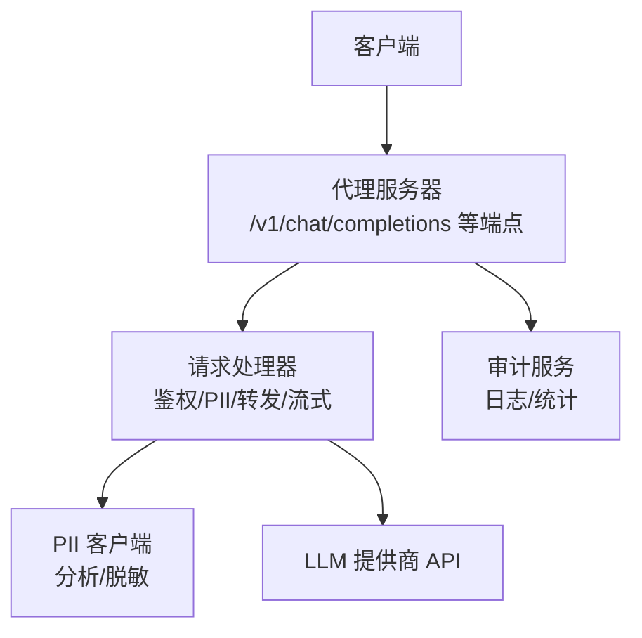
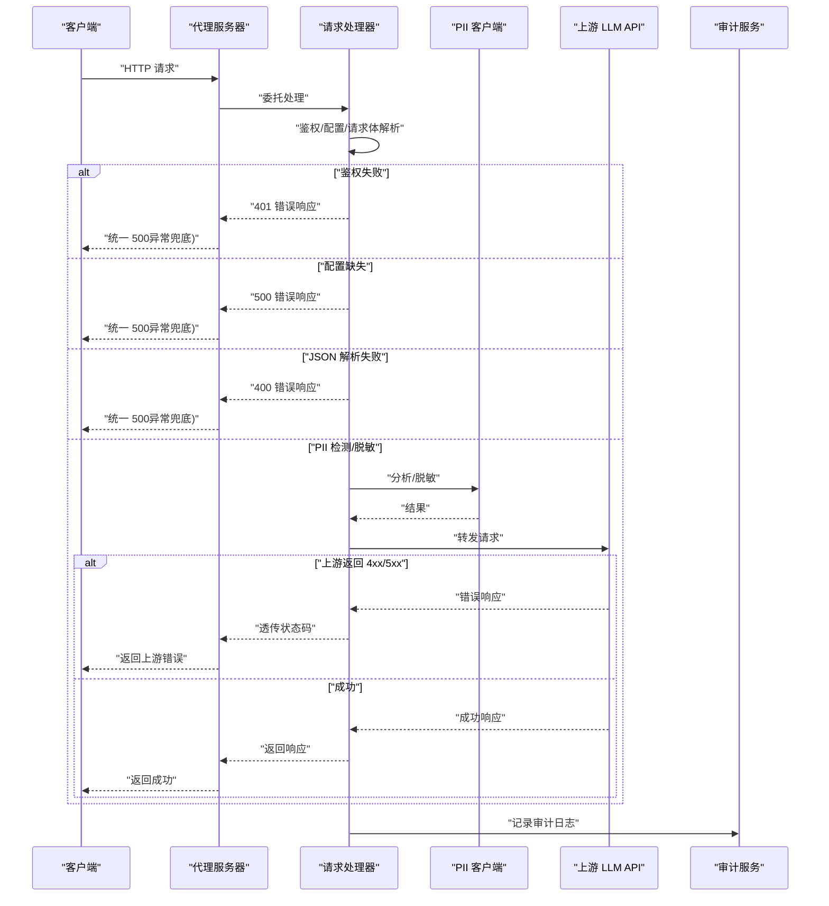
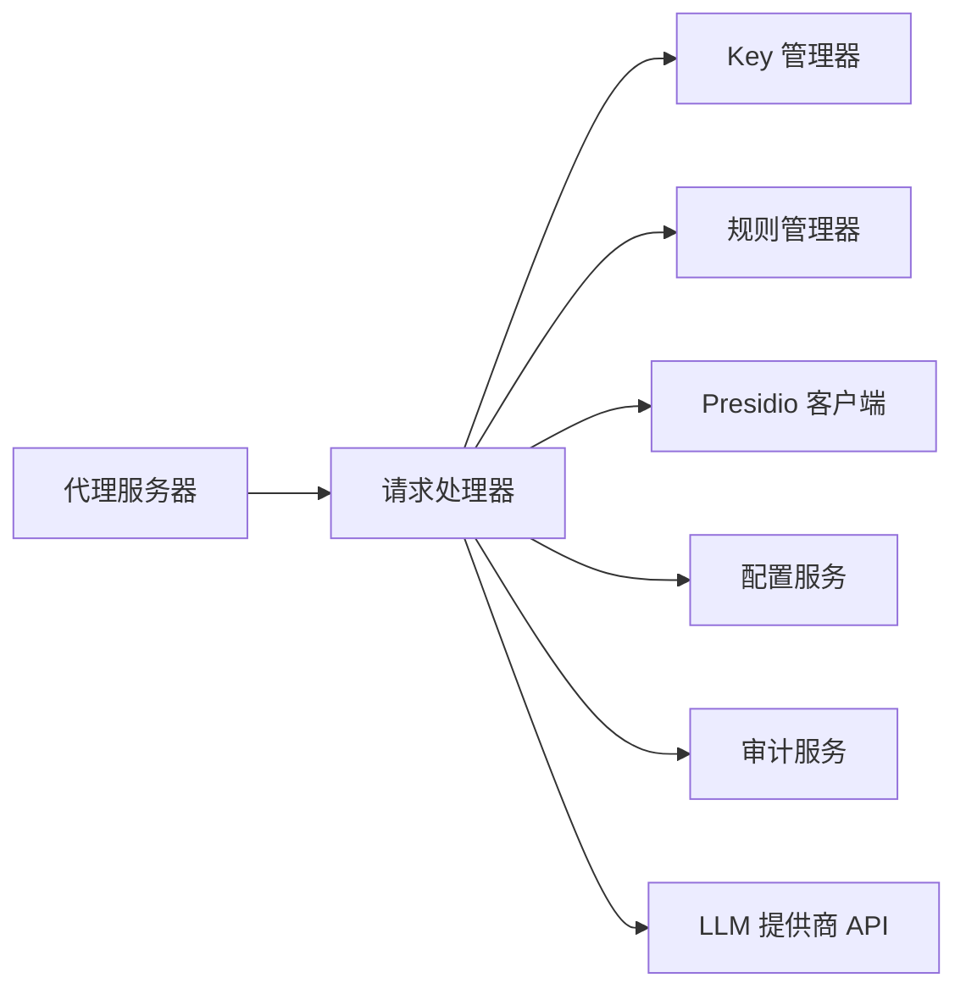

# 错误处理

<cite>
**本文引用的文件**
- [设计文档](file://doc/design/design-update-20260404-v1.0-init.md)
- [代理服务测试用例](file://doc/test/tcs/v1.0/02_proxy_service.md)
- [审计日志测试数据](file://doc/test/tcs/v1.0/06_audit_logging_testdata.md)
- [端到端集成测试数据](file://doc/test/tcs/v1.0/08_e2e_integration_testdata.md)
</cite>

## 目录
1. [简介](#简介)
2. [项目结构](#项目结构)
3. [核心组件](#核心组件)
4. [架构总览](#架构总览)
5. [详细组件分析](#详细组件分析)
6. [依赖分析](#依赖分析)
7. [性能考量](#性能考量)
8. [故障排查指南](#故障排查指南)
9. [结论](#结论)
10. [附录](#附录)

## 简介
本文件聚焦 LLM Privacy Gateway 的错误处理机制，系统性梳理代理服务器在认证、配置、PII 检测、网络连接等场景下的错误类型、HTTP 状态码、错误响应格式、诊断方法、重试策略与客户端实现要点，并提供跨语言的处理建议。

## 项目结构
- 错误处理主要由代理服务器与请求处理器协同实现：
  - 代理服务器负责路由、统计、异常兜底与健康检查。
  - 请求处理器负责鉴权、PII 检测/脱敏、上游转发、流式响应与审计日志。
- 审计日志模块提供统一的错误记录与查询能力，支撑排障与统计。

图示来源
- [设计文档:570-741](file://doc/design/design-update-20260404-v1.0-init.md#L570-L741)
- [设计文档:743-944](file://doc/design/design-update-20260404-v1.0-init.md#L743-L944)

章节来源
- [设计文档:570-741](file://doc/design/design-update-20260404-v1.0-init.md#L570-L741)
- [设计文档:743-944](file://doc/design/design-update-20260404-v1.0-init.md#L743-L944)

## 核心组件
- 代理服务器（ProxyServer）
  - 路由注册：/v1/chat/completions、/v1/completions、/v1/embeddings、/health 等。
  - 统一异常捕获：捕获未处理异常并返回统一的 500 错误响应。
  - 健康检查：/health 返回 200。
- 请求处理器（RequestHandler）
  - 鉴权：校验虚拟 Key，缺失或无效返回 401。
  - 配置：提供商未配置返回 500。
  - 请求体：JSON 解析失败返回 400。
  - PII：检测与脱敏；上游返回的 4xx/5xx 直接透传。
  - 转发：根据提供商配置构造目标 URL 与认证头。
  - 流式：SSE 流式响应，记录审计日志。
- 审计服务（AuditService）
  - 记录请求耗时、状态码、PII 检测结果、错误信息等。
  - 支持查询、统计与导出。

章节来源
- [设计文档:570-741](file://doc/design/design-update-20260404-v1.0-init.md#L570-L741)
- [设计文档:743-944](file://doc/design/design-update-20260404-v1.0-init.md#L743-L944)
- [设计文档:1441-1640](file://doc/design/design-update-20260404-v1.0-init.md#L1441-L1640)

## 架构总览
下图展示错误处理在整体链路中的位置与流转：

图示来源
- [设计文档:743-944](file://doc/design/design-update-20260404-v1.0-init.md#L743-L944)
- [设计文档:1441-1640](file://doc/design/design-update-20260404-v1.0-init.md#L1441-L1640)

## 详细组件分析

### 代理服务器错误处理
- 异常兜底
  - 任何未捕获异常将被转换为统一的 500 错误响应，响应体包含错误消息与类型。
- 健康检查
  - /health 返回 200，包含版本与运行时信息。
- 统计
  - 维护总请求数、成功数、失败数、平均延迟与 PII 检测数等。

章节来源
- [设计文档:570-741](file://doc/design/design-update-20260404-v1.0-init.md#L570-L741)

### 请求处理器错误处理
- 鉴权错误（401）
  - 缺少 API Key 或虚拟 Key 无效时返回 401。
- 配置错误（500）
  - 无法解析提供商配置时返回 500。
- 请求体错误（400）
  - JSON 解析失败返回 400。
- 上游错误透传
  - 上游返回 4xx/5xx 时直接透传状态码与响应体。
- 流式错误
  - 流式响应过程中断或异常，审计日志记录流式状态与耗时。

章节来源
- [设计文档:743-944](file://doc/design/design-update-20260404-v1.0-init.md#L743-L944)

### 审计日志与错误记录
- 审计条目包含时间戳、URL、方法、状态码、耗时、PII 检测与错误信息等字段。
- 支持按时间范围、级别、关键词等条件查询与导出，便于排障与统计。

章节来源
- [设计文档:1441-1640](file://doc/design/design-update-20260404-v1.0-init.md#L1441-L1640)

## 依赖分析
- 组件耦合
  - 代理服务器依赖请求处理器；请求处理器依赖 Key/规则/配置/Presidio/审计服务。
- 外部依赖
  - 上游 LLM API；Presidio 本地服务。
- 错误传播
  - 鉴权/配置/请求体错误在处理器侧即刻返回；上游错误透传；未处理异常由服务器兜底为 500。

图示来源
- [设计文档:570-741](file://doc/design/design-update-20260404-v1.0-init.md#L570-L741)
- [设计文档:743-944](file://doc/design/design-update-20260404-v1.0-init.md#L743-L944)

章节来源
- [设计文档:570-741](file://doc/design/design-update-20260404-v1.0-init.md#L570-L741)
- [设计文档:743-944](file://doc/design/design-update-20260404-v1.0-init.md#L743-L944)

## 性能考量
- 统计指标
  - 总请求数、成功/失败数、平均延迟、PII 检测数等可用于评估性能与错误趋势。
- 超时与重试
  - 测试数据表明存在 502（DNS 解析失败）与 504（网关超时）等场景，建议结合上游超时配置与重试策略。
- 流式处理
  - 流式响应需关注中断与超时处理，确保资源释放与审计日志记录。

章节来源
- [代理服务测试用例:515-630](file://doc/test/tcs/v1.0/02_proxy_service.md#L515-L630)
- [端到端集成测试数据:1198-1229](file://doc/test/tcs/v1.0/08_e2e_integration_testdata.md#L1198-L1229)

## 故障排查指南

### 常见错误类型与状态码
- 400 请求格式错误
  - 触发条件：请求体 JSON 无效、缺少必需字段、参数非法。
  - 响应：包含统一错误对象，类型为 invalid_request_error。
- 401 未授权
  - 触发条件：未提供 API Key 或虚拟 Key 无效。
  - 响应：包含统一错误对象，类型为 authentication_error。
- 403 禁止访问
  - 触发条件：权限不足（测试数据覆盖）。
  - 响应：包含统一错误对象。
- 404 资源不存在
  - 触发条件：端点错误（测试数据覆盖）。
  - 响应：包含统一错误对象。
- 408 请求超时
  - 触发条件：客户端超时（测试数据覆盖）。
  - 响应：包含统一错误对象。
- 413 请求过大
  - 触发条件：请求体过大（测试数据覆盖）。
  - 响应：包含统一错误对象。
- 415 不支持的媒体类型
  - 触发条件：格式错误（测试数据覆盖）。
  - 响应：包含统一错误对象。
- 429 请求过多
  - 触发条件：限流触发（测试数据覆盖）。
  - 响应：包含统一错误对象。
- 500 服务器内部错误
  - 触发条件：未处理异常、配置错误（如提供商未配置）。
  - 响应：包含统一错误对象，类型为 server_error。
- 502 网关错误
  - 触发条件：DNS 解析失败等上游错误（测试数据覆盖）。
  - 响应：包含统一错误对象。
- 503 服务不可用
  - 触发条件：服务端拒绝或排队（测试数据覆盖）。
  - 响应：包含统一错误对象。
- 504 网关超时
  - 触发条件：上游超时（测试数据覆盖）。
  - 响应：包含统一错误对象。

章节来源
- [代理服务测试用例:515-630](file://doc/test/tcs/v1.0/02_proxy_service.md#L515-L630)
- [审计日志测试数据:92-126](file://doc/test/tcs/v1.0/06_audit_logging_testdata.md#L92-L126)
- [端到端集成测试数据:1198-1229](file://doc/test/tcs/v1.0/08_e2e_integration_testdata.md#L1198-L1229)

### 错误响应格式与结构
- 统一错误对象
  - 字段：message（错误消息）、type（错误类型）。
  - 示例路径：[错误响应示例:655-692](file://doc/test/tcs/v1.0/08_e2e_integration_testdata.md#L655-L692)
- 审计日志错误字段
  - 字段：error.type、error.message 等，便于查询与统计。
  - 示例路径：[审计日志错误条目示例:436-493](file://doc/test/tcs/v1.0/06_audit_logging_testdata.md#L436-L493)

章节来源
- [设计文档:743-944](file://doc/design/design-update-20260404-v1.0-init.md#L743-L944)
- [审计日志测试数据:329-493](file://doc/test/tcs/v1.0/06_audit_logging_testdata.md#L329-L493)

### 诊断方法与步骤
- 快速定位
  - 查看 /health 健康状态与代理服务器日志。
  - 使用审计日志查询最近错误（按时间范围、状态码、错误类型）。
- 逐层排查
  - 鉴权：确认虚拟 Key 是否存在且有效。
  - 配置：确认提供商配置是否正确。
  - 请求体：确认 JSON 格式与必填字段。
  - 上游：观察上游返回的状态码与响应体。
- 统计分析
  - 通过统计接口查看成功率、失败数、平均延迟与 PII 检测分布。

章节来源
- [代理服务测试用例:776-800](file://doc/test/tcs/v1.0/02_proxy_service.md#L776-L800)
- [审计日志测试数据:547-597](file://doc/test/tcs/v1.0/06_audit_logging_testdata.md#L547-L597)

### 重试策略与最佳实践
- 何时重试
  - 对于 502（DNS 解析失败）、504（网关超时）等可重试场景，建议指数退避重试。
- 重试上限与超时
  - 设置最大重试次数与总超时时间，避免雪崩。
- 客户端幂等
  - 对于非幂等请求，谨慎重试；必要时引入去重标识。
- 超时与队列
  - 配置合理的上游超时与连接池大小，避免请求堆积导致 503。

章节来源
- [代理服务测试用例:515-630](file://doc/test/tcs/v1.0/02_proxy_service.md#L515-L630)
- [端到端集成测试数据:1198-1229](file://doc/test/tcs/v1.0/08_e2e_integration_testdata.md#L1198-L1229)

### 客户端实现指南（跨语言）
- Python（requests/aiohttp）
  - 捕获 HTTPError，解析响应 JSON 中的错误对象字段。
  - 对 5xx 与 504 建议指数退避重试。
  - 对 401 建议刷新或重新发放虚拟 Key。
- JavaScript/Node.js（axios/fetch）
  - 检查 response.status，解析 response.data.error。
  - 使用 retry 库或自实现指数退避。
- Go（net/http）
  - 使用 http.Client 发起请求，检查 StatusCode。
  - 对 502/504/500 实施指数退避重试。
- Java（OkHttp/RestTemplate）
  - 捕获异常并解析响应体中的错误字段。
  - 配置超时与重试策略，避免阻塞线程池。

章节来源
- [代理服务测试用例:515-630](file://doc/test/tcs/v1.0/02_proxy_service.md#L515-L630)
- [端到端集成测试数据:1198-1229](file://doc/test/tcs/v1.0/08_e2e_integration_testdata.md#L1198-L1229)

## 结论
- 本项目采用“处理器内快速失败 + 服务器兜底”的错误策略，确保错误响应统一、可观测性强。
- 通过审计日志与统计接口，可高效定位与复盘错误。
- 建议客户端结合指数退避与幂等设计，提升稳定性与用户体验。

## 附录

### 错误类型与状态码对照表
- 400：请求格式错误（JSON 无效、字段缺失、参数非法）
- 401：未授权（虚拟 Key 缺失或无效）
- 403：禁止访问（权限不足）
- 404：资源不存在（端点错误）
- 408：请求超时（客户端超时）
- 413：请求过大（请求体过大）
- 415：不支持的媒体类型（格式错误）
- 429：请求过多（限流触发）
- 500：服务器内部错误（未处理异常、配置错误）
- 502：网关错误（DNS 解析失败等上游错误）
- 503：服务不可用（服务端拒绝或排队）
- 504：网关超时（上游超时）

章节来源
- [代理服务测试用例:515-630](file://doc/test/tcs/v1.0/02_proxy_service.md#L515-L630)
- [审计日志测试数据:92-126](file://doc/test/tcs/v1.0/06_audit_logging_testdata.md#L92-L126)
- [端到端集成测试数据:1198-1229](file://doc/test/tcs/v1.0/08_e2e_integration_testdata.md#L1198-L1229)