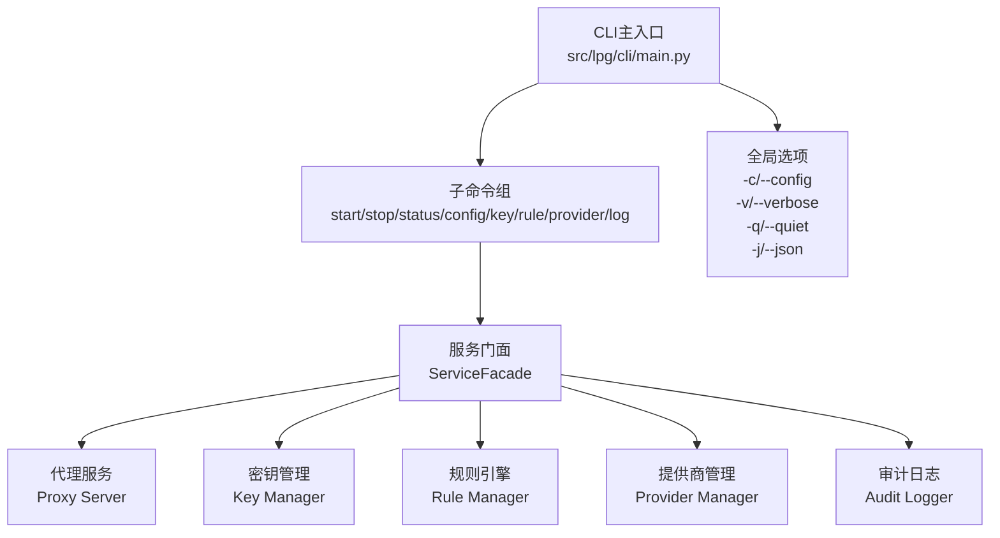
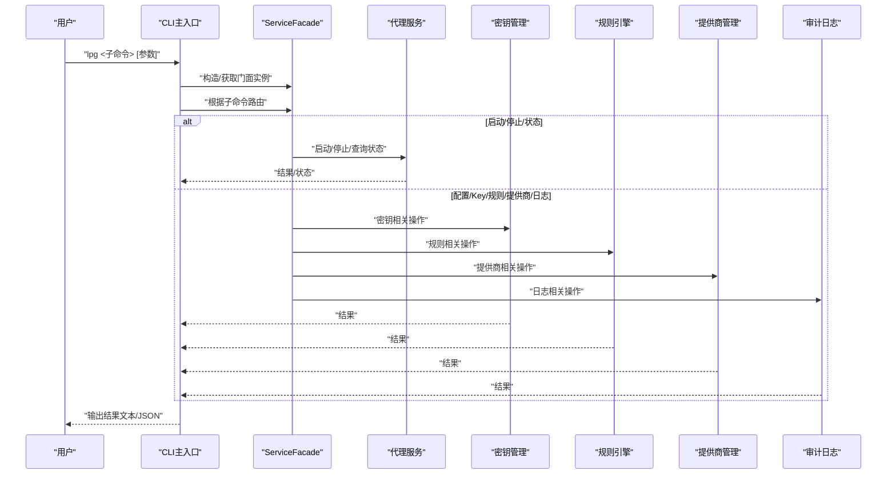
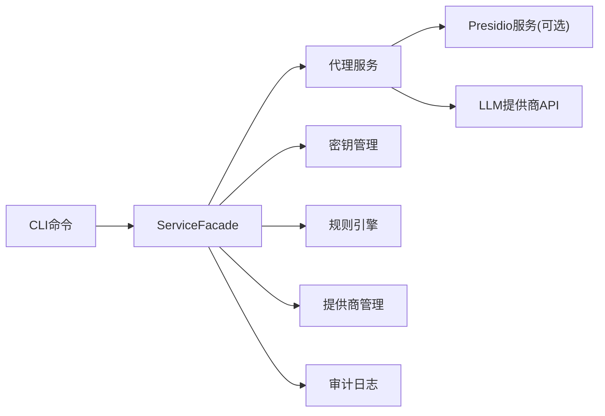

# CLI命令行工具

<cite>
**本文引用的文件**
- [设计文档（主入口与架构）](file://doc/design/design-update-20260404-v1.0-init.md)
- [CLI命令测试用例](file://doc/test/tcs/v1.0/01_cli_commands.md)
- [测试用例总览](file://doc/test/tcs/v1.0/README.md)
- [Plane CLI示例](file://doc/test/issues_management_platform/cli/plane_cli.py)
- [Plane CLI使用说明](file://doc/test/issues_management_platform/cli/README.md)
</cite>

## 目录
1. [简介](#简介)
2. [项目结构](#项目结构)
3. [核心组件](#核心组件)
4. [架构总览](#架构总览)
5. [详细组件分析](#详细组件分析)
6. [依赖关系分析](#依赖关系分析)
7. [性能考虑](#性能考虑)
8. [故障排除指南](#故障排除指南)
9. [结论](#结论)
10. [附录](#附录)

## 简介
本文件为 LLM Privacy Gateway 的 CLI 命令行工具提供权威、可操作的使用文档。基于仓库中的测试用例与设计文档，系统性梳理了所有 CLI 子命令的功能、参数、默认值、使用示例与依赖关系，并给出常见场景与最佳实践，帮助不同经验水平的用户高效、安全地使用该工具。

## 项目结构
- CLI 主入口位于 src/lpg/cli/main.py，通过 Click 注册全局选项与子命令。
- 子命令按功能分组：启动/停止/状态、配置、Key 管理、提供商、规则、日志。
- 设计文档明确了各模块职责与调用关系，CLI 通过 ServiceFacade 统一协调核心能力。

图表来源
- [设计文档（主入口设计）:280-311](file://doc/design/design-update-20260404-v1.0-init.md#L280-L311)

章节来源
- [设计文档（项目结构）:2417-2516](file://doc/design/design-update-20260404-v1.0-init.md#L2417-L2516)

## 核心组件
- CLI 主入口：注册全局选项与子命令，初始化 ServiceFacade 并注入上下文对象。
- 子命令：start、stop、status、config、key、rule、provider、log。
- 输出控制：支持详细/静默/JSON 输出模式，便于自动化集成。

章节来源
- [设计文档（主入口设计）:280-311](file://doc/design/design-update-20260404-v1.0-init.md#L280-L311)

## 架构总览
CLI 通过 Click 将用户输入解析为具体子命令，随后由 ServiceFacade 统一调度核心模块完成业务逻辑。整体呈现“命令层 → 门面层 → 业务层”的清晰分层。

图表来源
- [设计文档（主入口设计）:280-311](file://doc/design/design-update-20260404-v1.0-init.md#L280-L311)

## 详细组件分析

### 基础命令
- lpg --help
  - 功能：显示帮助信息，包含所有可用子命令列表与简要说明。
  - 适用场景：首次使用、快速查阅命令清单。
- lpg --version
  - 功能：显示版本号（例如 1.0.0）。
  - 适用场景：环境诊断、兼容性检查。
- lpg --config/-c PATH
  - 功能：指定配置文件路径；若不指定，默认读取项目内默认配置。
  - 适用场景：多环境部署、隔离配置。
- lpg --verbose/-v 与 lpg --quiet/-q
  - 功能：切换详细/静默输出模式。
  - 适用场景：调试与生产日志分流。
- lpg --json/-j
  - 功能：以 JSON 格式输出结果，便于自动化处理。
  - 适用场景：CI/CD、监控集成。

章节来源
- [CLI命令测试用例:39-81](file://doc/test/tcs/v1.0/01_cli_commands.md#L39-L81)

### 启动与停止命令
- lpg start
  - 功能：启动代理服务，支持默认参数启动。
  - 关键行为：校验配置文件存在性与端口可用性；启动后输出监听地址、PID、加载的规则数、Key 数等信息。
  - 参数：
    - --port PORT：自定义监听端口（默认 8080）。
    - --daemon：后台模式启动。
    - --config/-c PATH：指定配置文件路径。
  - 适用场景：本地开发、联调测试、生产部署预热。
- lpg stop
  - 功能：停止运行中的代理服务。
  - 关键行为：若服务未运行，提示“未在运行”；若成功停止，提示确认信息。
  - 适用场景：维护窗口、版本升级、故障排查。
- lpg status
  - 功能：查询服务状态（运行中/未运行），显示地址、PID、运行时间、请求数等。
  - 适用场景：运维巡检、健康检查。

章节来源
- [CLI命令测试用例:84-220](file://doc/test/tcs/v1.0/01_cli_commands.md#L84-L220)

### 配置管理命令
- lpg config init
  - 功能：初始化配置文件。
  - 选项：
    - --no-interactive：非交互模式，使用默认值创建配置。
  - 适用场景：全新安装、自动化部署。
- lpg config show
  - 功能：显示完整配置内容。
  - 适用场景：配置核对、审计。
- lpg config get KEY
  - 功能：显示指定配置项的值。
  - 适用场景：定位配置项、脚本读取。
- lpg config set KEY VALUE
  - 功能：设置配置项的值并持久化。
  - 适用场景：在线调整、灰度变更。
- 注意事项：
  - 若配置项不存在，会提示“配置项不存在”。
  - 配置文件格式错误时，启动会失败并提示“配置文件不存在/格式错误”。

章节来源
- [CLI命令测试用例:223-312](file://doc/test/tcs/v1.0/01_cli_commands.md#L223-L312)

### Key 管理命令
- lpg key create
  - 功能：创建虚拟 Key。
  - 关键行为：校验提供商是否存在；支持设置过期时间；返回 Key ID 与相关信息。
  - 参数：
    - --provider PROVIDER：提供商名称。
    - --name NAME：Key 名称。
    - --expires YYYY-MM-DD：过期日期。
  - 适用场景：临时授权、租户隔离、权限回收。
- lpg key list
  - 功能：列出所有虚拟 Key（ID、名称、提供商、状态、创建时间）。
  - 适用场景：资产盘点、合规审计。
- lpg key show <key_id>
  - 功能：显示指定 Key 的详细信息。
  - 适用场景：问题定位、权限核验。
- lpg key revoke <key_id>
  - 功能：吊销指定 Key。
  - 关键行为：若 Key 不存在，提示“不存在”；成功后状态变更为已吊销。
  - 适用场景：安全事件处置、权限回收。

章节来源
- [CLI命令测试用例:315-420](file://doc/test/tcs/v1.0/01_cli_commands.md#L315-L420)

### 提供商管理命令
- lpg provider list
  - 功能：列出所有配置的提供商（名称、类型、状态）。
  - 适用场景：配置核对、故障排查。
- lpg provider add
  - 功能：添加新的 LLM 提供商。
  - 参数：
    - --type TYPE：提供商类型（如 openai）。
    - --name NAME：提供商名称。
    - --base-url URL：API 基础地址。
    - --api-key KEY：访问密钥。
  - 适用场景：新增供应商、切换供应商。
- lpg provider remove <provider_name>
  - 功能：移除已配置的提供商。
  - 适用场景：下线供应商、清理配置。
- lpg provider test <provider_name>
  - 功能：测试提供商连接连通性与鉴权有效性。
  - 关键行为：返回测试结果（成功/失败及详情）。
  - 适用场景：上线前验证、日常健康检查。

章节来源
- [CLI命令测试用例:422-496](file://doc/test/tcs/v1.0/01_cli_commands.md#L422-L496)

### 规则管理命令
- lpg rule list
  - 功能：列出所有规则（ID、名称、类别、启用状态）。
  - 适用场景：策略核对、合规检查。
- lpg rule enable <rule_id>
  - 功能：启用指定规则。
  - 适用场景：灰度开启、紧急启用。
- lpg rule disable <rule_id>
  - 功能：禁用指定规则。
  - 适用场景：回滚策略、临时关闭。
- lpg rule add --file FILE
  - 功能：从文件批量导入规则。
  - 适用场景：批量上线、模板复用。
- lpg rule remove <rule_id>
  - 功能：移除指定规则。
  - 适用场景：策略清理、降级。
- lpg rule test <rule_id> --text TEXT
  - 功能：测试规则匹配效果（匹配情况、检测到的实体等）。
  - 适用场景：规则验证、回归测试。

章节来源
- [CLI命令测试用例:499-588](file://doc/test/tcs/v1.0/01_cli_commands.md#L499-L588)

### 日志管理命令
- lpg log show
  - 功能：显示最近日志条目。
  - 适用场景：实时观测、问题定位。
- lpg log show --lines N
  - 功能：显示最近 N 条日志。
  - 适用场景：批量回溯、性能分析。
- lpg log stats
  - 功能：显示统计信息（请求数、成功率、PII 检测数等）。
  - 适用场景：运营报表、SLA 分析。
- lpg log export --output FILE
  - 功能：导出日志到文件。
  - 适用场景：离线分析、合规取证。
- lpg log clear
  - 功能：清除所有日志。
  - 适用场景：磁盘清理、周期性维护。

章节来源
- [CLI命令测试用例:591-665](file://doc/test/tcs/v1.0/01_cli_commands.md#L591-L665)

### 命令依赖与执行顺序
- 启动前置条件：配置文件存在且格式正确；目标端口未被占用；提供商配置有效。
- Key/规则/提供商/日志等子命令通常依赖于代理服务处于“运行中”状态，以便进行实时操作与查询。
- 停止命令应在确认服务已启动后再执行，避免出现“未在运行”的提示。

章节来源
- [CLI命令测试用例:84-188](file://doc/test/tcs/v1.0/01_cli_commands.md#L84-L188)

## 依赖关系分析
- CLI 层：负责参数解析与子命令路由。
- 门面层（ServiceFacade）：统一协调代理服务、密钥、规则、提供商、日志等模块。
- 业务层：各模块独立实现具体功能，通过门面层解耦。
- 外部依赖：Presidio Analyzer/Anonymizer（可选）、LLM 提供商 API。

图表来源
- [设计文档（主入口设计）:280-311](file://doc/design/design-update-20260404-v1.0-init.md#L280-L311)

章节来源
- [设计文档（项目结构）:2417-2516](file://doc/design/design-update-20260404-v1.0-init.md#L2417-L2516)

## 性能考虑
- 后台模式启动：适合生产环境长期运行，避免阻塞终端。
- JSON 输出：便于监控系统采集指标，降低解析成本。
- 日志导出与统计：建议定期归档与清理，避免日志膨胀影响性能。
- 规则批量导入：建议在低峰期执行，减少对代理服务的影响。

## 故障排除指南
- 启动失败：端口被占用
  - 现象：启动时报错“端口被占用”。
  - 处理：更换端口或释放占用端口后重试。
- 启动失败：配置文件不存在/格式错误
  - 现象：启动时报错“配置文件不存在/格式错误”。
  - 处理：检查配置文件路径与格式，使用 config show/get 核对关键项。
- 停止失败：服务未运行
  - 现象：stop 提示“未在运行”。
  - 处理：先执行 start 启动服务，再执行 stop。
- Key/提供商/规则/日志操作失败
  - 现象：操作提示“不存在/不可用”。
  - 处理：使用 list/show 核对资源状态，provider test 检查连通性，确保代理服务处于运行中。
- 日志无法导出/统计为空
  - 现象：log export/stats 无输出或空统计。
  - 处理：确认日志文件存在且有写入权限，检查代理服务是否正常运行。

章节来源
- [CLI命令测试用例:131-188](file://doc/test/tcs/v1.0/01_cli_commands.md#L131-L188)

## 结论
LLM Privacy Gateway 的 CLI 工具围绕“启动/停止/状态查询”“配置/密钥/提供商/规则/日志”五大维度构建，具备完善的参数体系与错误处理机制。结合本文档的命令语法、参数说明、使用示例与故障排除指南，用户可在不同场景下安全、高效地完成部署、运维与治理任务。

## 附录

### 常见使用场景与最佳实践
- 开发联调
  - 使用默认端口启动，配合 --verbose 查看详细日志；完成后使用 stop 停止。
- 生产部署
  - 使用 --daemon 后台启动；通过 status 定期巡检；使用 --json 输出对接监控系统。
- 安全治理
  - 使用 key revoke 快速回收权限；定期执行 log stats 与 log export 归档审计证据。
- 规则上线
  - 先在测试环境使用 rule test 验证匹配效果；再在低峰期批量导入 rule add；最后启用 rule enable。

### 与测试框架集成参考
- 可参考 Plane CLI 的集成方式，使用 subprocess 调用 lpg 命令并断言输出，实现自动化测试与 CI/CD 集成。

章节来源
- [Plane CLI使用说明:83-134](file://doc/test/issues_management_platform/cli/README.md#L83-L134)