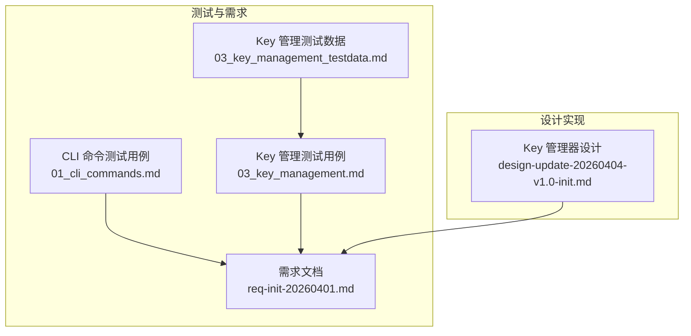
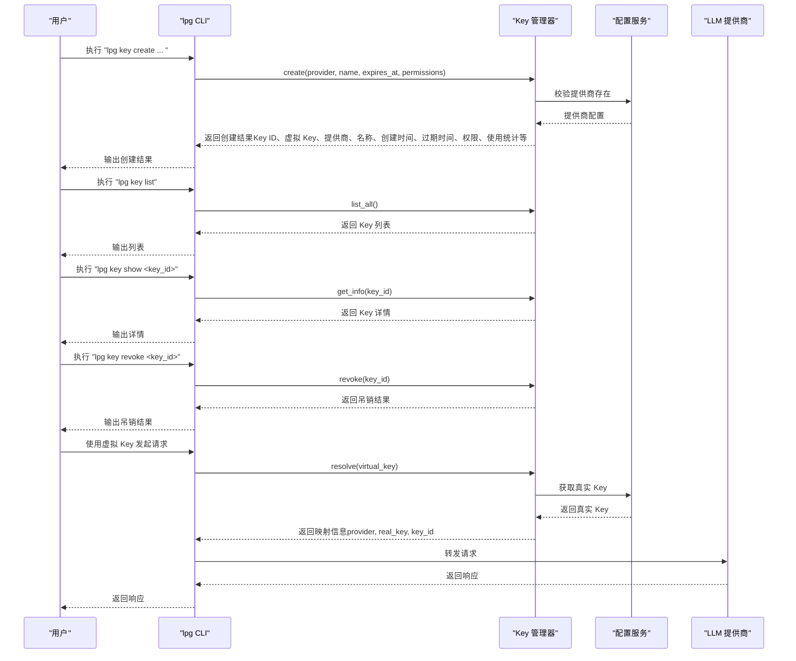
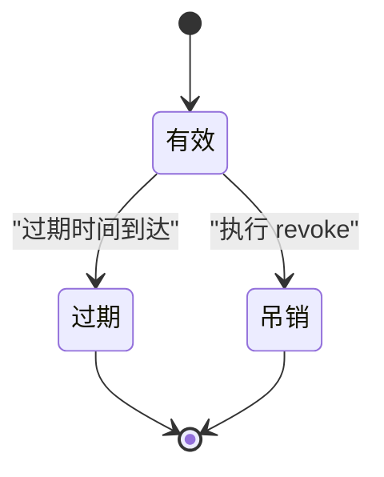
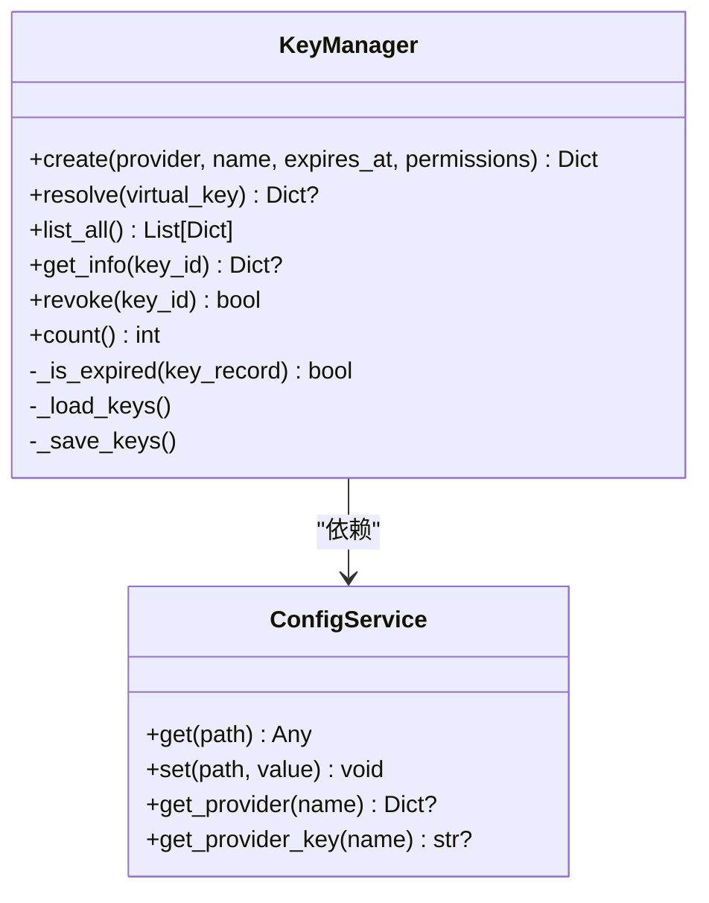
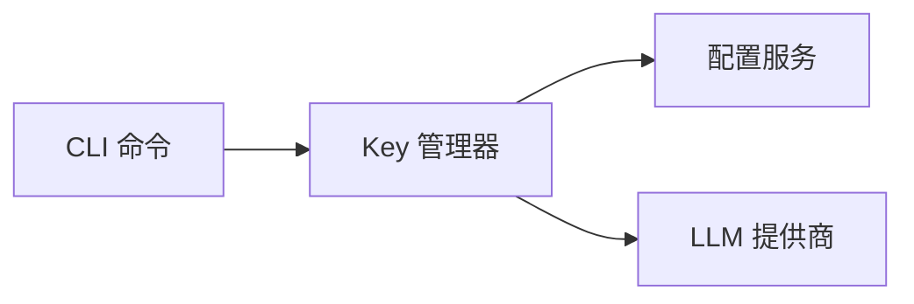

# Key管理命令

<cite>
**本文引用的文件**
- [01_cli_commands.md](file://doc/test/tcs/v1.0/01_cli_commands.md)
- [03_key_management.md](file://doc/test/tcs/v1.0/03_key_management.md)
- [03_key_management_testdata.md](file://doc/test/tcs/v1.0/03_key_management_testdata.md)
- [req-init-20260401.md](file://doc/req/req-init-20260401.md)
- [design-update-20260404-v1.0-init.md](file://doc/design/design-update-20260404-v1.0-init.md)
</cite>

## 目录
1. [简介](#简介)
2. [项目结构](#项目结构)
3. [核心组件](#核心组件)
4. [架构总览](#架构总览)
5. [详细组件分析](#详细组件分析)
6. [依赖分析](#依赖分析)
7. [性能考虑](#性能考虑)
8. [故障排除指南](#故障排除指南)
9. [结论](#结论)
10. [附录](#附录)

## 简介
本文件面向 LLM Privacy Gateway 的 Key 管理命令，系统性梳理 lpg key 命令系列（create、list、show、revoke）的使用方法与行为规范，覆盖虚拟 Key 的创建流程（提供商选择、名称设置、过期时间配置）、Key 的状态与生命周期管理（有效、吊销、过期），以及 Key 验证、吊销等关键操作的详细说明与故障排除建议。文档同时给出安全策略与最佳实践，帮助用户在生产环境中安全、稳定地使用虚拟 Key。

## 项目结构
围绕 Key 管理相关的文档与设计要点，主要分布在如下位置：
- CLI 命令测试用例：覆盖 lpg key 的 create、list、show、revoke 等命令的黑盒测试场景
- Key 管理测试数据：提供虚拟 Key 格式、提供商、名称、过期时间、权限配置、解析与吊销等边界与异常场景
- 需求文档：定义 lpg key 的命令语法、选项与输出示例
- 设计文档：提供 Key 管理器的类设计与实现要点（创建、解析、列表、详情、吊销、过期判断）

图表来源
- [01_cli_commands.md:315-421](file://doc/test/tcs/v1.0/01_cli_commands.md#L315-L421)
- [03_key_management.md:36-125](file://doc/test/tcs/v1.0/03_key_management.md#L36-L125)
- [03_key_management_testdata.md:10-206](file://doc/test/tcs/v1.0/03_key_management_testdata.md#L10-L206)
- [req-init-20260401.md:1053-1087](file://doc/req/req-init-20260401.md#L1053-L1087)
- [design-update-20260404-v1.0-init.md:1128-1275](file://doc/design/design-update-20260404-v1.0-init.md#L1128-L1275)

章节来源
- [01_cli_commands.md:315-421](file://doc/test/tcs/v1.0/01_cli_commands.md#L315-L421)
- [03_key_management.md:36-125](file://doc/test/tcs/v1.0/03_key_management.md#L36-L125)
- [03_key_management_testdata.md:10-206](file://doc/test/tcs/v1.0/03_key_management_testdata.md#L10-L206)
- [req-init-20260401.md:1053-1087](file://doc/req/req-init-20260401.md#L1053-L1087)
- [design-update-20260404-v1.0-init.md:1128-1275](file://doc/design/design-update-20260404-v1.0-init.md#L1128-L1275)

## 核心组件
- lpg key 命令族
  - create：创建虚拟 Key，支持指定提供商、名称、过期时间与权限配置
  - list：列出所有虚拟 Key，展示关键元信息
  - show：显示指定 Key 的完整详情
  - revoke：吊销指定 Key
- Key 管理器（核心实现）
  - 负责虚拟 Key 的生成、持久化、解析映射、生命周期管理（过期判断）、使用统计与吊销
  - 与配置服务协作，读取提供商配置与真实 Key

章节来源
- [req-init-20260401.md:1053-1087](file://doc/req/req-init-20260401.md#L1053-L1087)
- [design-update-20260404-v1.0-init.md:1128-1275](file://doc/design/design-update-20260404-v1.0-init.md#L1128-L1275)

## 架构总览
下图展示了 lpg key 命令与 Key 管理器之间的交互关系，以及虚拟 Key 的创建与解析流程。

图表来源
- [01_cli_commands.md:315-421](file://doc/test/tcs/v1.0/01_cli_commands.md#L315-L421)
- [03_key_management.md:36-125](file://doc/test/tcs/v1.0/03_key_management.md#L36-L125)
- [design-update-20260404-v1.0-init.md:1128-1275](file://doc/design/design-update-20260404-v1.0-init.md#L1128-L1275)

## 详细组件分析

### lpg key create：虚拟 Key 创建
- 命令语法与选项
  - 选项：--provider/-p、--name/-n、--expires/-e
  - 示例：创建 Key 并指定提供商与名称；可选设置过期时间；可选设置权限配置
- 创建流程
  - 校验提供商存在性
  - 生成虚拟 Key（固定前缀 + 随机部分）
  - 生成 Key ID（基于虚拟 Key 的哈希）
  - 记录 Key 元信息（提供商、名称、创建时间、过期时间、权限、使用统计等）
  - 持久化到配置
- 关键参数
  - 提供商：必须存在于配置中
  - 名称：支持空格与特殊字符，长度有限制
  - 过期时间：ISO 8601 格式，未来时间有效，过去时间无效
  - 权限配置：可选，支持模型、端点、Token 上限等字段

章节来源
- [req-init-20260401.md:1053-1087](file://doc/req/req-init-20260401.md#L1053-L1087)
- [03_key_management.md:36-125](file://doc/test/tcs/v1.0/03_key_management.md#L36-L125)
- [03_key_management_testdata.md:10-206](file://doc/test/tcs/v1.0/03_key_management_testdata.md#L10-L206)
- [design-update-20260404-v1.0-init.md:1155-1196](file://doc/design/design-update-20260404-v1.0-init.md#L1155-L1196)

### lpg key list：虚拟 Key 列表
- 展示字段：ID、名称、提供商、虚拟 Key、创建时间、过期时间、使用次数、最后使用时间
- 空列表：当没有 Key 时，显示空列表或提示信息
- 包含过期 Key：列表会包含已过期的 Key，但通常会标注状态或过期标识

章节来源
- [01_cli_commands.md:362-374](file://doc/test/tcs/v1.0/01_cli_commands.md#L362-L374)
- [03_key_management.md:205-249](file://doc/test/tcs/v1.0/03_key_management.md#L205-L249)
- [03_key_management_testdata.md:321-355](file://doc/test/tcs/v1.0/03_key_management_testdata.md#L321-L355)

### lpg key show：虚拟 Key 详情
- 展示字段：ID、虚拟 Key、提供商、名称、创建时间、过期时间、权限、使用次数、最后使用时间
- 不存在的 Key：返回错误提示或空值
- 完整性校验：确保返回字段齐全，便于审计与运维

章节来源
- [01_cli_commands.md:377-389](file://doc/test/tcs/v1.0/01_cli_commands.md#L377-L389)
- [03_key_management.md:252-296](file://doc/test/tcs/v1.0/03_key_management.md#L252-L296)
- [03_key_management_testdata.md:156-206](file://doc/test/tcs/v1.0/03_key_management_testdata.md#L156-L206)

### lpg key revoke：虚拟 Key 吊销
- 行为：删除 Key 记录并持久化
- 结果：Key 状态变为已吊销，后续使用该 Key 的请求将失败
- 异常：对不存在的 Key 吊销会失败并提示错误

章节来源
- [01_cli_commands.md:392-419](file://doc/test/tcs/v1.0/01_cli_commands.md#L392-L419)
- [03_key_management.md:299-358](file://doc/test/tcs/v1.0/03_key_management.md#L299-L358)
- [03_key_management_testdata.md:287-318](file://doc/test/tcs/v1.0/03_key_management_testdata.md#L287-L318)

### Key 生命周期与状态管理
- 状态
  - 有效：可正常使用
  - 吊销：已删除，不可再使用
  - 过期：超过过期时间，不可使用
- 生命周期
  - 创建：生成虚拟 Key 与 Key ID，记录元信息
  - 使用：解析虚拟 Key，映射到真实 Key，更新使用统计
  - 过期：检查过期时间，过期后不可使用
  - 吊销：删除 Key 记录，后续解析失败

图表来源
- [design-update-20260404-v1.0-init.md:1269-1275](file://doc/design/design-update-20260404-v1.0-init.md#L1269-L1275)
- [03_key_management.md:361-405](file://doc/test/tcs/v1.0/03_key_management.md#L361-L405)

### Key 解析与验证
- 解析流程
  - 校验虚拟 Key 格式与长度
  - 查找 Key 记录，检查是否过期
  - 获取真实 Key 并返回映射信息
  - 更新使用次数与最后使用时间
- 验证场景
  - 有效 Key：解析成功，返回映射信息
  - 无效 Key：解析失败，返回错误
  - 过期 Key：解析失败，提示已过期
  - 吊销 Key：解析失败，提示已吊销

章节来源
- [03_key_management.md:128-187](file://doc/test/tcs/v1.0/03_key_management.md#L128-L187)
- [03_key_management_testdata.md:209-243](file://doc/test/tcs/v1.0/03_key_management_testdata.md#L209-L243)
- [design-update-20260404-v1.0-init.md:1198-1232](file://doc/design/design-update-20260404-v1.0-init.md#L1198-L1232)

### Key 管理器类设计

图表来源
- [design-update-20260404-v1.0-init.md:1128-1275](file://doc/design/design-update-20260404-v1.0-init.md#L1128-L1275)

## 依赖分析
- CLI 与 Key 管理器
  - CLI 命令调用 Key 管理器的相应方法，负责参数解析与输出格式化
- Key 管理器与配置服务
  - Key 管理器依赖配置服务进行提供商校验与真实 Key 获取
- Key 管理器与 LLM 提供商
  - 解析阶段通过配置服务获取真实 Key，随后由代理层转发至提供商

图表来源
- [01_cli_commands.md:315-421](file://doc/test/tcs/v1.0/01_cli_commands.md#L315-L421)
- [design-update-20260404-v1.0-init.md:1128-1275](file://doc/design/design-update-20260404-v1.0-init.md#L1128-L1275)

章节来源
- [01_cli_commands.md:315-421](file://doc/test/tcs/v1.0/01_cli_commands.md#L315-L421)
- [design-update-20260404-v1.0-init.md:1128-1275](file://doc/design/design-update-20260404-v1.0-init.md#L1128-L1275)

## 性能考虑
- 并发操作
  - 并发创建、解析、吊销均具备良好性能表现，测试覆盖低、中、高并发场景
- 使用统计
  - 每次解析成功都会更新使用次数与最后使用时间，注意高并发下的写入开销
- 过期检查
  - 过期检查为轻量级时间比较，对性能影响极小

章节来源
- [03_key_management_testdata.md:287-318](file://doc/test/tcs/v1.0/03_key_management_testdata.md#L287-L318)
- [03_key_management.md:408-469](file://doc/test/tcs/v1.0/03_key_management.md#L408-L469)

## 故障排除指南
- 常见错误与处理
  - 提供商不存在：检查配置文件中的提供商列表，确保名称拼写正确
  - Key 格式无效：确认虚拟 Key 符合固定前缀与长度要求
  - Key 已过期：延长过期时间或重新创建
  - Key 已吊销：无法再使用，需重新创建
  - Key 不存在：确认 Key ID 正确，或先创建后再操作
- 排查步骤
  - 使用 list/show 确认 Key 状态与元信息
  - 使用 resolve 验证虚拟 Key 是否可解析
  - 检查配置文件中的提供商与真实 Key 是否正确

章节来源
- [03_key_management.md:128-187](file://doc/test/tcs/v1.0/03_key_management.md#L128-L187)
- [03_key_management_testdata.md:209-243](file://doc/test/tcs/v1.0/03_key_management_testdata.md#L209-L243)
- [03_key_management_testdata.md:321-355](file://doc/test/tcs/v1.0/03_key_management_testdata.md#L321-L355)

## 结论
lpg key 命令提供了完善的虚拟 Key 生命周期管理能力，涵盖创建、列表、详情、吊销与解析验证。结合严格的参数校验、丰富的测试数据与并发稳定性验证，用户可在生产环境中安全、可靠地使用虚拟 Key。建议遵循安全策略与最佳实践，定期审查 Key 状态与使用统计，及时吊销不再使用的 Key，确保最小暴露面与合规审计。

## 附录
- 命令速查
  - lpg key create -p PROVIDER -n NAME [-e EXPIRES] [--permissions JSON]
  - lpg key list
  - lpg key show <key_id>
  - lpg key revoke <key_id>
- 安全策略与最佳实践
  - 为每个应用或环境单独创建 Key，避免共享
  - 合理设置过期时间，定期轮换
  - 限制权限范围（模型、端点、Token 上限）
  - 对不再使用的 Key 及时吊销
  - 严格控制虚拟 Key 的分发与存储

章节来源
- [req-init-20260401.md:1053-1087](file://doc/req/req-init-20260401.md#L1053-L1087)
- [03_key_management.md:36-125](file://doc/test/tcs/v1.0/03_key_management.md#L36-L125)
- [03_key_management_testdata.md:156-206](file://doc/test/tcs/v1.0/03_key_management_testdata.md#L156-L206)