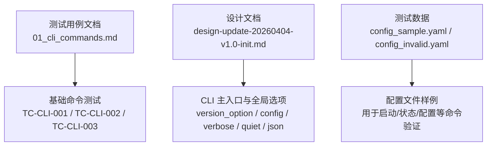
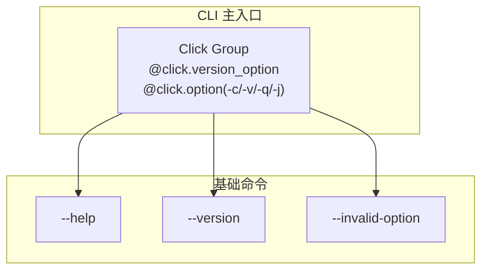
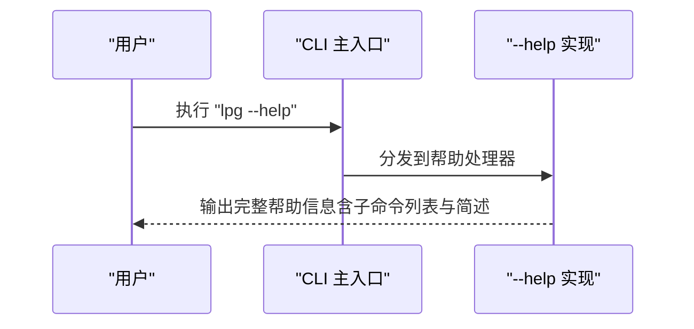
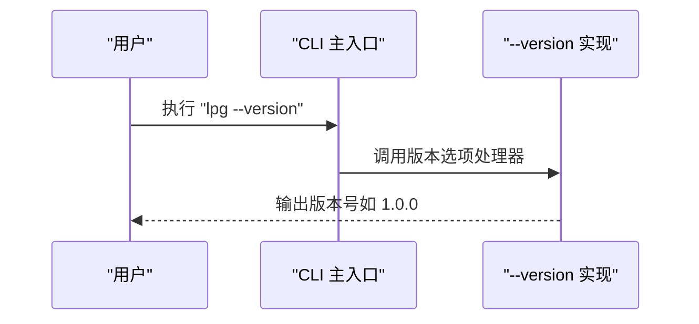
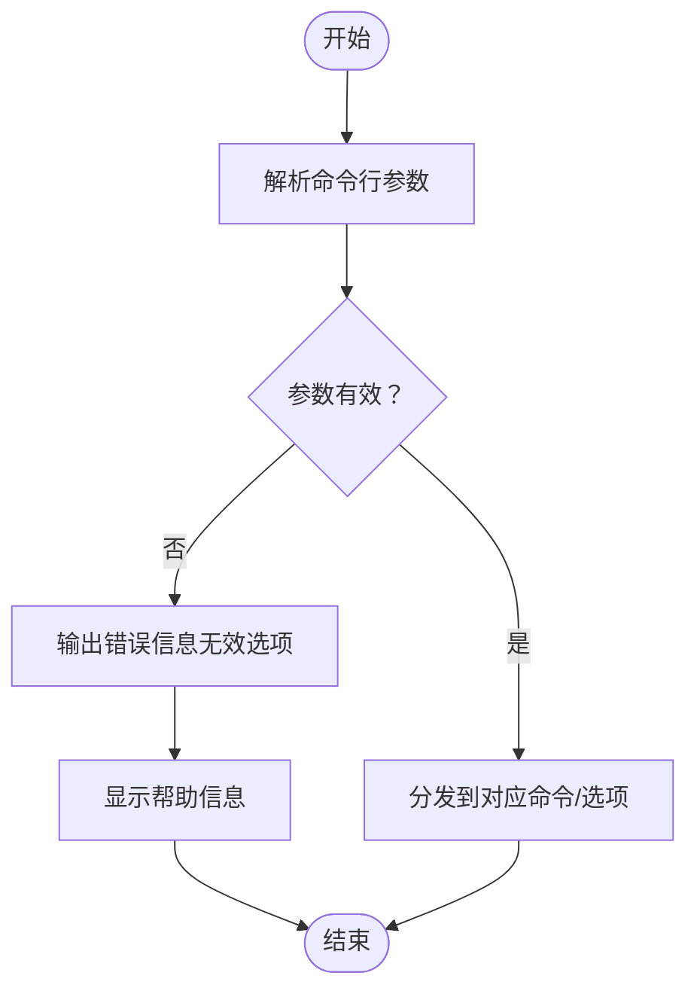
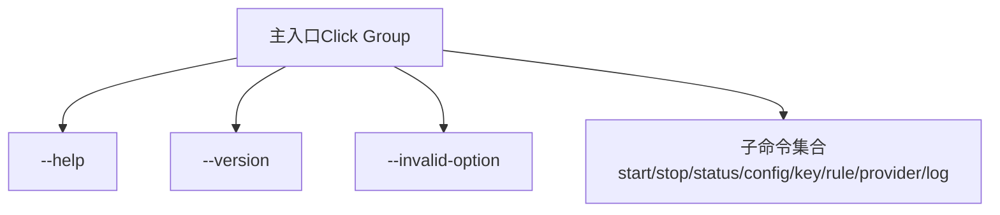

# 基础命令

<cite>
**本文引用的文件**
- [01_cli_commands.md](file://doc/test/tcs/v1.0/01_cli_commands.md)
- [design-update-20260404-v1.0-init.md](file://doc/design/design-update-20260404-v1.0-init.md)
- [config_sample.yaml](file://doc/test/tcs/v1.0/test_data/config_sample.yaml)
- [config_invalid.yaml](file://doc/test/tcs/v1.0/test_data/config_invalid.yaml)
</cite>

## 目录
1. [简介](#简介)
2. [项目结构](#项目结构)
3. [核心组件](#核心组件)
4. [架构总览](#架构总览)
5. [详细组件分析](#详细组件分析)
6. [依赖分析](#依赖分析)
7. [性能考虑](#性能考虑)
8. [故障排查指南](#故障排查指南)
9. [结论](#结论)
10. [附录](#附录)

## 简介
本章节面向 LLM Privacy Gateway 的基础命令，聚焦于以下三个关键命令的行为与用法：
- lpg --help：显示完整帮助信息，包含所有可用子命令及其简要说明
- lpg --version：显示版本号
- lpg --invalid-option：处理无效选项，输出错误信息并提示帮助信息

文档将从语法、参数选项、默认行为、预期输出、使用示例、系统诊断与用户引导作用、常见场景与最佳实践等方面进行系统阐述。

## 项目结构
围绕基础命令的相关资料主要分布在以下位置：
- 测试用例文档：包含对 --help、--version、--invalid-option 的测试步骤与预期结果
- 设计文档：给出 CLI 主入口的定义与全局选项（如版本、配置、输出模式等）
- 测试数据：提供标准配置样例与无效配置样例，便于在不同场景下验证命令行为

**图表来源**
- [01_cli_commands.md:39-81](file://doc/test/tcs/v1.0/01_cli_commands.md#L39-L81)
- [design-update-20260404-v1.0-init.md:288-311](file://doc/design/design-update-20260404-v1.0-init.md#L288-L311)

**章节来源**
- [01_cli_commands.md:1-81](file://doc/test/tcs/v1.0/01_cli_commands.md#L1-L81)
- [design-update-20260404-v1.0-init.md:280-311](file://doc/design/design-update-20260404-v1.0-init.md#L280-L311)

## 核心组件
本节梳理基础命令的语法、参数、默认行为与预期输出。

- lpg --help
  - 语法：lpg --help
  - 参数：无
  - 默认行为：输出完整帮助信息，包含所有可用子命令列表（例如 start、stop、status、config、key、rule、provider、log）及简要说明
  - 预期输出：帮助信息（包含命令列表与简述）
  - 使用示例：执行 lpg --help
  - 适用场景：首次使用、快速浏览可用命令、排查命令拼写问题
  - 最佳实践：结合 --verbose/--quiet/--json 控制输出风格；在 CI 中可配合 --help 进行静态校验

- lpg --version
  - 语法：lpg --version
  - 参数：无
  - 默认行为：输出版本号（例如 1.0.0）
  - 预期输出：版本字符串（如 1.0.0）
  - 使用示例：执行 lpg --version
  - 适用场景：版本确认、问题定位、合规审计
  - 最佳实践：在自动化脚本中固定版本检查，避免因版本差异导致的兼容性问题

- lpg --invalid-option
  - 语法：lpg --invalid-option（任意无效选项）
  - 参数：任意无效选项
  - 默认行为：输出错误信息，提示无效选项，并显示帮助信息
  - 预期输出：错误提示 + 帮助信息
  - 使用示例：执行 lpg --invalid-option
  - 适用场景：用户误操作、命令行健壮性测试
  - 最佳实践：将无效选项测试纳入回归测试，确保错误提示清晰且包含帮助信息

**章节来源**
- [01_cli_commands.md:39-81](file://doc/test/tcs/v1.0/01_cli_commands.md#L39-L81)
- [design-update-20260404-v1.0-init.md:288-311](file://doc/design/design-update-20260404-v1.0-init.md#L288-L311)

## 架构总览
下图展示了基础命令在 CLI 架构中的位置与关系：主入口通过 Click 注解提供全局选项与版本能力，基础命令作为顶层命令直接由主入口分发。

**图表来源**
- [design-update-20260404-v1.0-init.md:288-311](file://doc/design/design-update-20260404-v1.0-init.md#L288-L311)

**章节来源**
- [design-update-20260404-v1.0-init.md:288-311](file://doc/design/design-update-20260404-v1.0-init.md#L288-L311)

## 详细组件分析

### lpg --help 行为分析
- 功能要点
  - 输出完整帮助信息，包含所有子命令列表与简要说明
  - 作为用户引导的第一入口，帮助用户快速了解可用命令
- 预期输出要点
  - 命令列表（start、stop、status、config、key、rule、provider、log）
  - 各命令的简要说明
- 使用示例
  - 执行 lpg --help
- 适用场景
  - 新手入门
  - 快速查阅命令清单
  - 排查命令拼写问题
- 最佳实践
  - 在自动化文档中引用 --help 输出作为参考
  - 将 --help 作为 CI 静态检查的一部分，确保帮助信息完整

**图表来源**
- [01_cli_commands.md:39-51](file://doc/test/tcs/v1.0/01_cli_commands.md#L39-L51)
- [design-update-20260404-v1.0-init.md:288-311](file://doc/design/design-update-20260404-v1.0-init.md#L288-L311)

**章节来源**
- [01_cli_commands.md:39-51](file://doc/test/tcs/v1.0/01_cli_commands.md#L39-L51)
- [design-update-20260404-v1.0-init.md:288-311](file://doc/design/design-update-20260404-v1.0-init.md#L288-L311)

### lpg --version 行为分析
- 功能要点
  - 输出版本号（如 1.0.0），用于版本确认与问题定位
- 预期输出要点
  - 版本字符串（如 1.0.0）
- 使用示例
  - 执行 lpg --version
- 适用场景
  - 版本确认
  - 合规审计
  - 自动化脚本中的版本约束
- 最佳实践
  - 在部署前检查版本一致性
  - 将版本检查纳入健康检查与监控

**图表来源**
- [01_cli_commands.md:54-66](file://doc/test/tcs/v1.0/01_cli_commands.md#L54-L66)
- [design-update-20260404-v1.0-init.md:288-311](file://doc/design/design-update-20260404-v1.0-init.md#L288-L311)

**章节来源**
- [01_cli_commands.md:54-66](file://doc/test/tcs/v1.0/01_cli_commands.md#L54-L66)
- [design-update-20260404-v1.0-init.md:288-311](file://doc/design/design-update-20260404-v1.0-init.md#L288-L311)

### lpg --invalid-option 行为分析
- 功能要点
  - 对无效选项输出错误信息，并显示帮助信息，提升用户引导体验
- 预期输出要点
  - 错误提示（无效选项）
  - 帮助信息（命令列表与简述）
- 使用示例
  - 执行 lpg --invalid-option
- 适用场景
  - 用户误操作
  - 健壮性测试
  - 故障排查
- 最佳实践
  - 将无效选项测试纳入回归测试
  - 确保错误提示清晰、包含帮助信息，便于用户自助修复

**图表来源**
- [01_cli_commands.md:69-81](file://doc/test/tcs/v1.0/01_cli_commands.md#L69-L81)

**章节来源**
- [01_cli_commands.md:69-81](file://doc/test/tcs/v1.0/01_cli_commands.md#L69-L81)

## 依赖分析
- 基础命令与主入口的关系
  - 主入口通过 Click 注解提供全局选项与版本能力
  - 基础命令作为顶层命令由主入口统一分发
- 与其他模块的耦合
  - --help 与 --version 通常不依赖业务模块，仅依赖 CLI 框架
  - --invalid-option 的处理依赖 CLI 框架的错误处理机制
- 外部依赖与集成点
  - 版本信息来源于主入口的版本选项注解
  - 帮助信息来源于各子命令的注册与描述

**图表来源**
- [design-update-20260404-v1.0-init.md:288-311](file://doc/design/design-update-20260404-v1.0-init.md#L288-L311)

**章节来源**
- [design-update-20260404-v1.0-init.md:288-311](file://doc/design/design-update-20260404-v1.0-init.md#L288-L311)

## 性能考虑
- 基础命令均为轻量级操作，不涉及网络或磁盘 IO，因此性能开销极低
- 建议在自动化脚本中缓存版本信息，减少重复调用
- 在大规模批量测试中，优先使用 --help 与 --version 的静态校验，避免不必要的启动流程

## 故障排查指南
- 无法显示帮助或版本信息
  - 检查 LPG 是否正确安装与 PATH 配置
  - 确认主入口版本选项是否生效
- 无效选项未显示帮助信息
  - 确认 CLI 框架的错误处理逻辑是否按预期工作
  - 检查是否存在自定义错误处理器覆盖了默认行为
- 配置相关问题（与基础命令间接关联）
  - 使用标准配置样例进行对比，排除配置格式错误
  - 参考无效配置样例定位 YAML 解析问题

**章节来源**
- [01_cli_commands.md:69-81](file://doc/test/tcs/v1.0/01_cli_commands.md#L69-L81)
- [config_sample.yaml](file://doc/test/tcs/v1.0/test_data/config_sample.yaml)
- [config_invalid.yaml](file://doc/test/tcs/v1.0/test_data/config_invalid.yaml)

## 结论
- lpg --help、--version、--invalid-option 三者构成了用户与系统的“第一接触点”，承担着用户引导与系统诊断的关键职责
- 基于 Click 的主入口设计提供了稳定的全局选项与版本能力，保证基础命令的一致性与可维护性
- 建议在日常运维与自动化测试中将这三个命令纳入常规检查，以确保 CLI 的可用性与用户体验

## 附录
- 常见使用场景与最佳实践
  - 新手入门：先执行 lpg --help，再执行 lpg --version 确认版本
  - 自动化脚本：在部署前加入版本检查与帮助信息静态校验
  - 故障排查：遇到无效选项时，优先查看错误提示与帮助信息
  - 回归测试：将无效选项测试纳入持续集成，确保错误提示清晰且包含帮助信息