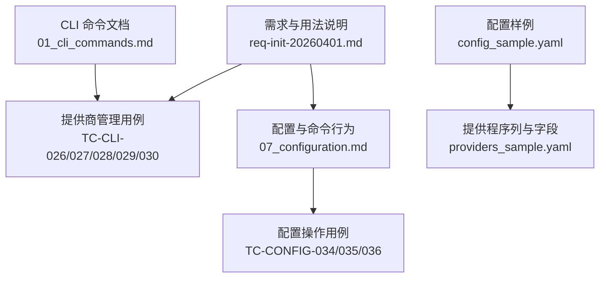
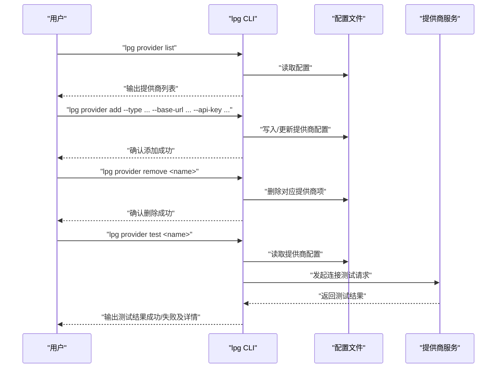
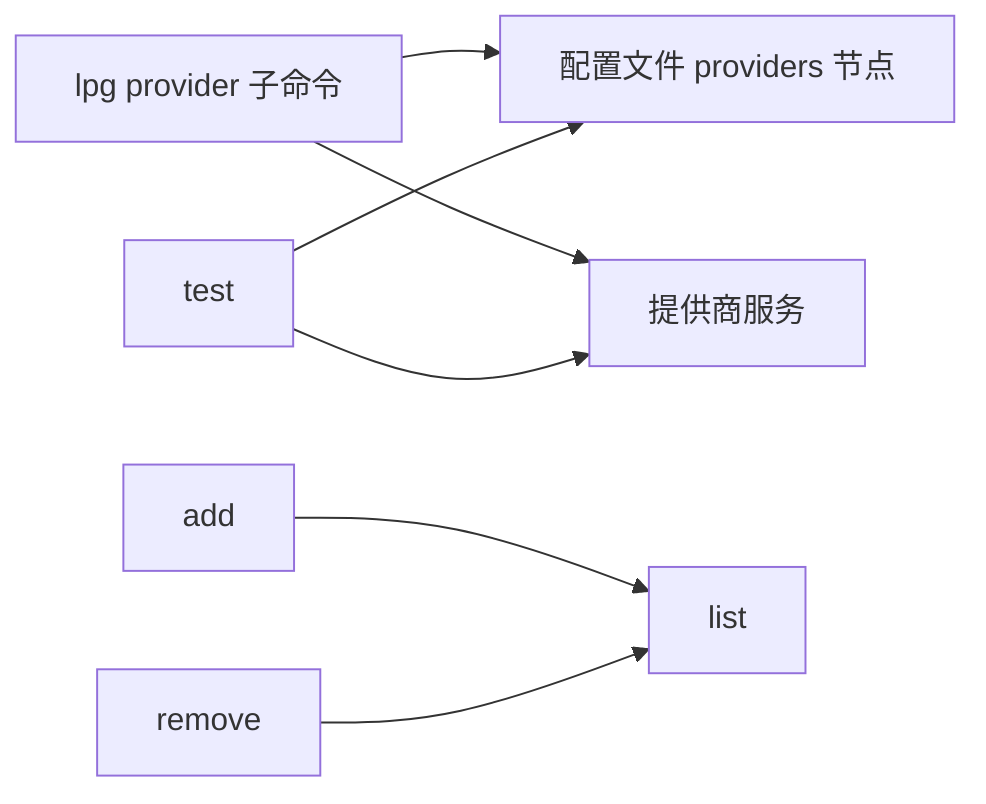

# 提供商管理命令

<cite>
**本文引用的文件**
- [01_cli_commands.md](file://doc/test/tcs/v1.0/01_cli_commands.md)
- [07_configuration.md](file://doc/test/tcs/v1.0/07_configuration.md)
- [providers_sample.yaml](file://doc/test/tcs/v1.0/test_data/providers_sample.yaml)
- [config_sample.yaml](file://doc/test/tcs/v1.0/test_data/config_sample.yaml)
- [req-init-20260401.md](file://doc/req/req-init-20260401.md)
</cite>

## 目录
1. [简介](#简介)
2. [项目结构](#项目结构)
3. [核心组件](#核心组件)
4. [架构总览](#架构总览)
5. [详细组件分析](#详细组件分析)
6. [依赖关系分析](#依赖关系分析)
7. [性能考虑](#性能考虑)
8. [故障排查指南](#故障排查指南)
9. [结论](#结论)
10. [附录](#附录)

## 简介
本文件面向 LLM Privacy Gateway 的“提供商管理命令”（lpg provider）系列，系统性说明以下子命令的使用方法与最佳实践：
- provider list：列出已配置的提供商
- provider add：添加新的提供商
- provider remove：移除已配置的提供商
- provider test：测试提供商连接

同时，本文结合仓库中的测试用例与配置样例，解释提供商的配置要素（类型、名称、API 密钥、基础 URL 等），并给出连接测试流程、常见问题与解决方案。

## 项目结构
围绕提供商管理命令的相关资料主要分布在以下位置：
- CLI 行为与测试用例：doc/test/tcs/v1.0/01_cli_commands.md
- 配置与命令行为补充：doc/test/tcs/v1.0/07_configuration.md
- 配置样例：doc/test/tcs/v1.0/test_data/*.yaml
- 命令用法与参数说明：doc/req/req-init-20260401.md

图表来源
- [01_cli_commands.md:422-496](file://doc/test/tcs/v1.0/01_cli_commands.md#L422-L496)
- [07_configuration.md:540-594](file://doc/test/tcs/v1.0/07_configuration.md#L540-L594)
- [config_sample.yaml:1-27](file://doc/test/tcs/v1.0/test_data/config_sample.yaml#L1-L27)
- [providers_sample.yaml:1-25](file://doc/test/tcs/v1.0/test_data/providers_sample.yaml#L1-L25)
- [req-init-20260401.md:1089-1110](file://doc/req/req-init-20260401.md#L1089-L1110)

章节来源
- [01_cli_commands.md:422-496](file://doc/test/tcs/v1.0/01_cli_commands.md#L422-L496)
- [07_configuration.md:540-594](file://doc/test/tcs/v1.0/07_configuration.md#L540-L594)
- [config_sample.yaml:1-27](file://doc/test/tcs/v1.0/test_data/config_sample.yaml#L1-L27)
- [providers_sample.yaml:1-25](file://doc/test/tcs/v1.0/test_data/providers_sample.yaml#L1-L25)
- [req-init-20260401.md:1089-1110](file://doc/req/req-init-20260401.md#L1089-L1110)

## 核心组件
- 命令入口与动作
  - lpg provider list：列出所有已配置提供商
  - lpg provider add：添加新提供商（支持交互式输入或通过参数传入）
  - lpg provider remove <name>：移除指定提供商
  - lpg provider test <name>：测试提供商连接

- 参数与选项
  - -t, --type <type>：提供商类型（如 openai、anthropic、gemini、custom 等）
  - -u, --base-url <url>：API 基础 URL
  - -k, --api-key <key>：API Key（建议通过环境变量或交互方式输入）

- 配置文件要点
  - providers 节点下包含多个提供商条目
  - 每个提供商通常包含 type、base_url、timeout 等字段；部分提供商可能包含特定字段（如 Azure 的 api_version）
  - 可通过 enabled 字段控制提供商是否启用

章节来源
- [req-init-20260401.md:1089-1110](file://doc/req/req-init-20260401.md#L1089-L1110)
- [providers_sample.yaml:1-25](file://doc/test/tcs/v1.0/test_data/providers_sample.yaml#L1-L25)
- [config_sample.yaml:13-19](file://doc/test/tcs/v1.0/test_data/config_sample.yaml#L13-L19)

## 架构总览
下图展示了“提供商管理命令”的典型调用链路：用户执行 lpg provider 子命令后，CLI 读取配置文件，解析提供商参数，执行相应动作（列出、添加、删除、测试），并在完成后返回结果或错误信息。

图表来源
- [01_cli_commands.md:422-496](file://doc/test/tcs/v1.0/01_cli_commands.md#L422-L496)
- [07_configuration.md:540-594](file://doc/test/tcs/v1.0/07_configuration.md#L540-L594)
- [req-init-20260401.md:1089-1110](file://doc/req/req-init-20260401.md#L1089-L1110)

## 详细组件分析

### provider list：列出所有提供商
- 功能概述
  - 读取配置文件中的 providers 节点，输出每个提供商的名称、类型、状态等信息
- 使用场景
  - 快速核对当前已配置的提供商清单
  - 在批量操作前确认目标提供商是否存在
- 输出格式
  - 默认表格格式；可通过 --format json 获取 JSON 输出（见配置测试用例）

章节来源
- [01_cli_commands.md:424-435](file://doc/test/tcs/v1.0/01_cli_commands.md#L424-L435)
- [07_configuration.md:588-591](file://doc/test/tcs/v1.0/07_configuration.md#L588-L591)

### provider add：添加新提供商
- 功能概述
  - 支持交互式输入或通过参数传入提供商类型、基础 URL、API Key 等
  - 将新提供商写入配置文件的 providers 节点
- 关键参数
  - --type：提供商类型（openai、anthropic、gemini、custom 等）
  - --base-url：API 基础 URL
  - --api-key：API Key（建议通过环境变量或交互方式输入）
- 示例与验证
  - 测试用例演示了添加 OpenAI 提供商并随后列出验证
  - 配置样例展示了 providers 的基本结构

章节来源
- [01_cli_commands.md:439-450](file://doc/test/tcs/v1.0/01_cli_commands.md#L439-L450)
- [07_configuration.md:543-546](file://doc/test/tcs/v1.0/07_configuration.md#L543-L546)
- [config_sample.yaml:13-19](file://doc/test/tcs/v1.0/test_data/config_sample.yaml#L13-L19)

### provider remove：移除提供商
- 功能概述
  - 从配置文件中删除指定名称的提供商条目
- 注意事项
  - 删除前应确认提供商名称正确
  - 删除后可通过 list 验证是否生效

章节来源
- [01_cli_commands.md:454-465](file://doc/test/tcs/v1.0/01_cli_commands.md#L454-L465)
- [07_configuration.md:558-561](file://doc/test/tcs/v1.0/07_configuration.md#L558-L561)

### provider test：测试提供商连接
- 功能概述
  - 读取配置文件中指定提供商的配置，向其基础 URL 发起连接测试
  - 返回测试结果（成功/失败及详情）
- 行为与用例
  - 正常测试：当提供商存在且配置正确时，返回成功及详细信息
  - 异常测试：当提供商不存在时，返回错误提示

章节来源
- [01_cli_commands.md:469-480](file://doc/test/tcs/v1.0/01_cli_commands.md#L469-L480)
- [01_cli_commands.md:484-495](file://doc/test/tcs/v1.0/01_cli_commands.md#L484-L495)

### 提供商配置字段与示例
- 基本字段
  - name：提供商名称（唯一标识）
  - type：提供商类型（如 openai、anthropic、gemini、custom）
  - base_url：API 基础 URL
  - timeout：请求超时（秒）
  - enabled：是否启用（布尔）
  - api_key 或 api_key_file：API 密钥或密钥文件路径（视实现而定）
  - 特定提供商字段：如 Azure 的 api_version
- 示例参考
  - providers_sample.yaml 展示了多种提供商类型的配置
  - config_sample.yaml 展示了顶层 providers 节点的基本结构

章节来源
- [providers_sample.yaml:1-25](file://doc/test/tcs/v1.0/test_data/providers_sample.yaml#L1-L25)
- [config_sample.yaml:13-19](file://doc/test/tcs/v1.0/test_data/config_sample.yaml#L13-L19)

### 不同提供商类型的配置示例与最佳实践
- OpenAI
  - 类型：openai
  - 基础 URL：官方 API 地址
  - 建议：使用环境变量存储 API Key，避免明文写入配置文件
- Azure OpenAI
  - 类型：azure_openai
  - 基础 URL：Azure 资源域名
  - 特有字段：api_version（版本号）
  - 建议：确保 api_version 与 Azure 资源匹配
- Anthropic
  - 类型：anthropic
  - 基础 URL：官方 API 地址
  - 建议：定期轮换 API Key，限制访问权限
- 自定义提供商
  - 类型：custom
  - 建议：明确 base_url 与认证方式，必要时提供额外头信息或路径参数

章节来源
- [providers_sample.yaml:1-25](file://doc/test/tcs/v1.0/test_data/providers_sample.yaml#L1-L25)
- [req-init-20260401.md:1101-1109](file://doc/req/req-init-20260401.md#L1101-L1109)

## 依赖关系分析
- CLI 与配置文件
  - provider list/add/remove/test 均依赖于配置文件中的 providers 节点
  - 配置文件的读写由 CLI 负责，测试用例验证了配置更新后的可见性
- CLI 与提供商服务
  - provider test 会实际向提供商发起连接请求，验证网络连通性与鉴权有效性
- 命令间耦合
  - add 与 list：add 成功后通过 list 验证
  - remove 与 list：remove 成功后通过 list 验证
  - test 与 add/list：test 依赖于已存在的提供商配置

图表来源
- [01_cli_commands.md:422-496](file://doc/test/tcs/v1.0/01_cli_commands.md#L422-L496)
- [07_configuration.md:540-594](file://doc/test/tcs/v1.0/07_configuration.md#L540-L594)

章节来源
- [01_cli_commands.md:422-496](file://doc/test/tcs/v1.0/01_cli_commands.md#L422-L496)
- [07_configuration.md:540-594](file://doc/test/tcs/v1.0/07_configuration.md#L540-L594)

## 性能考虑
- 超时设置
  - 建议为提供商配置合理的 timeout，避免长时间阻塞 CLI 操作
- 并发与重试
  - 测试阶段可适当增加重试次数，但需避免对上游服务造成压力
- 输出格式
  - 大量提供商时，使用 --format json 可提升解析效率

## 故障排查指南
- 提供商不存在
  - 现象：执行 provider test nonexistent 返回错误提示
  - 排查：确认提供商名称拼写正确；使用 provider list 核对可用列表
- 配置文件未更新
  - 现象：执行 add/remove 后，provider list 未反映最新变更
  - 排查：检查配置文件路径与权限；确认 CLI 已写入成功
- 连接失败
  - 现象：provider test 返回失败
  - 排查：检查 base_url 是否可达；确认 API Key 有效；核对网络与防火墙设置
- 类型或名称不合法
  - 现象：添加时出现校验错误
  - 排查：遵循提供商类型与名称的命名规范（仅字母、数字、短横线等）

章节来源
- [01_cli_commands.md:484-495](file://doc/test/tcs/v1.0/01_cli_commands.md#L484-L495)
- [07_configuration.md:540-594](file://doc/test/tcs/v1.0/07_configuration.md#L540-L594)
- [providers_sample.yaml:1-25](file://doc/test/tcs/v1.0/test_data/providers_sample.yaml#L1-L25)

## 结论
- lpg provider 命令系列提供了完整的提供商生命周期管理能力：列出、添加、删除与连接测试
- 通过配置样例与测试用例，可以快速掌握提供商的配置要点与最佳实践
- 建议在生产环境中采用环境变量管理敏感信息，定期进行连接测试，并保持配置文件的版本化管理

## 附录
- 常用命令速查
  - 列出提供商：lpg provider list
  - 添加提供商：lpg provider add --type <type> --base-url <url> --api-key <key>
  - 移除提供商：lpg provider remove <name>
  - 测试提供商：lpg provider test <name>
- 配置文件位置与结构
  - 全局配置：~/.llm-privacy-gateway/config.yaml
  - 本地配置：./.lpg/config.yaml（优先级更高）
  - providers 节点用于存放提供商配置

章节来源
- [req-init-20260401.md:1166-1171](file://doc/req/req-init-20260401.md#L1166-L1171)
- [config_sample.yaml:1-27](file://doc/test/tcs/v1.0/test_data/config_sample.yaml#L1-L27)