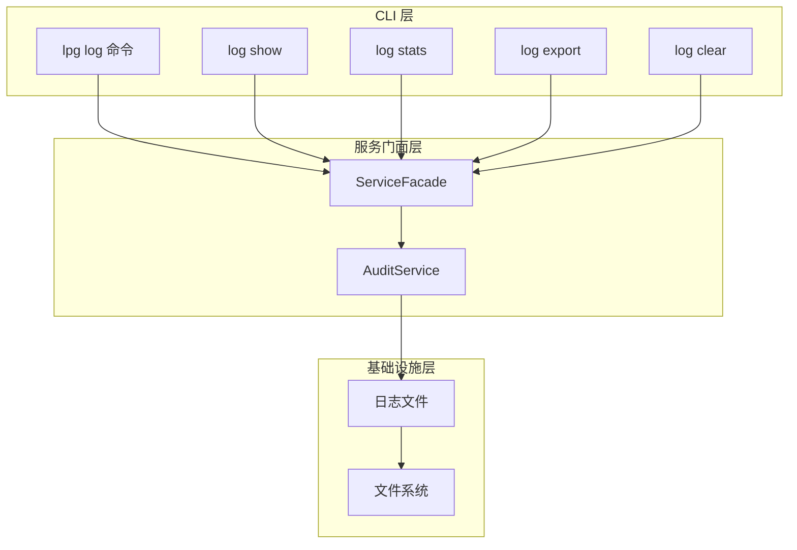
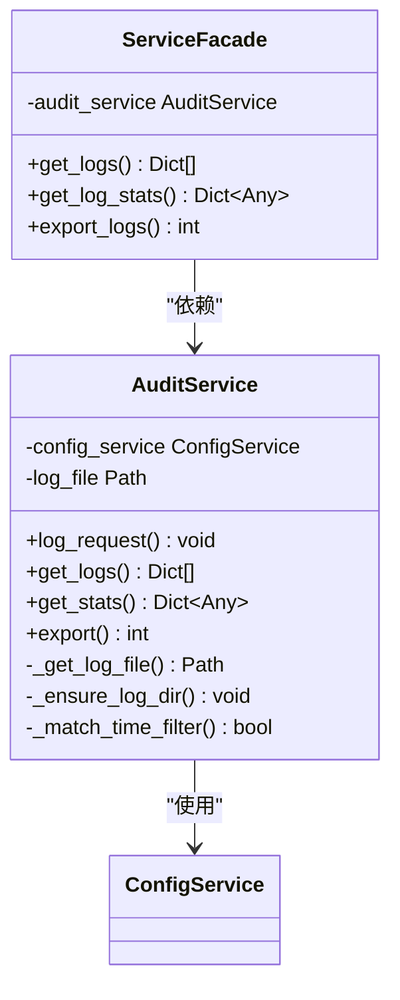
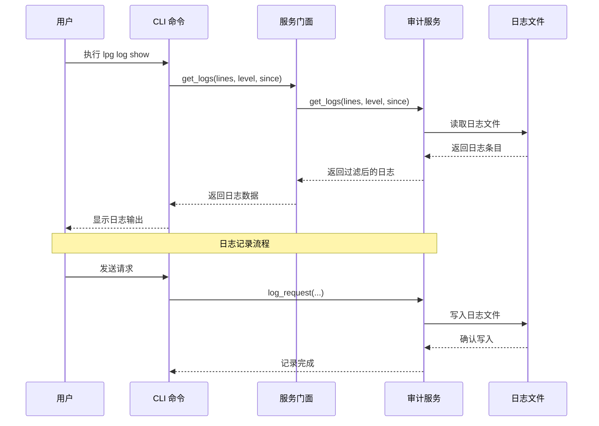
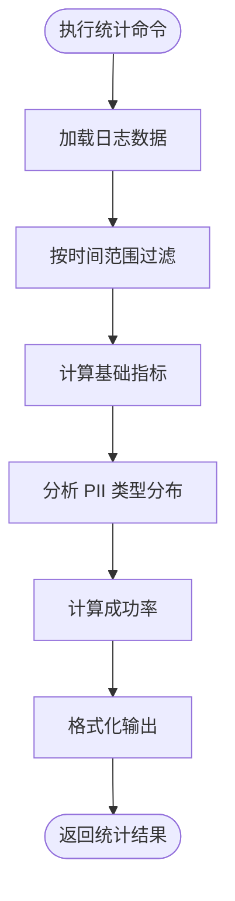
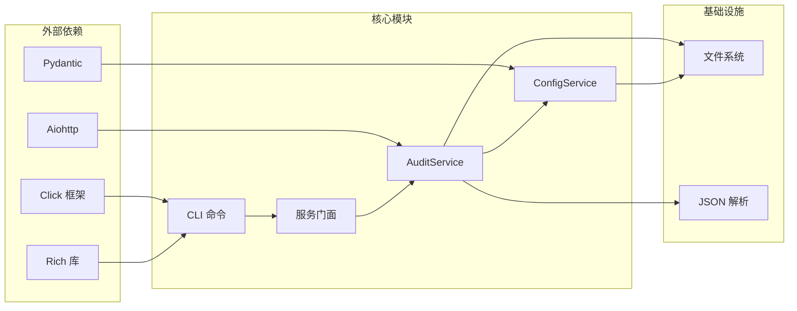

# 日志管理命令

<cite>
**本文档引用的文件**
- [design-update-20260404-v1.0-init.md](file://doc/design/design-update-20260404-v1.0-init.md)
- [01_cli_commands.md](file://doc/test/tcs/v1.0/01_cli_commands.md)
- [06_audit_logging.md](file://doc/test/tcs/v1.0/06_audit_logging.md)
- [06_audit_logging_testdata.md](file://doc/test/tcs/v1.0/06_audit_logging_testdata.md)
</cite>

## 目录
1. [简介](#简介)
2. [项目结构](#项目结构)
3. [核心组件](#核心组件)
4. [架构概览](#架构概览)
5. [详细组件分析](#详细组件分析)
6. [依赖关系分析](#依赖关系分析)
7. [性能考虑](#性能考虑)
8. [故障排除指南](#故障排除指南)
9. [结论](#结论)

## 简介

LLM Privacy Gateway 的日志管理命令提供了完整的审计日志查看、统计、导出和清理功能。该系统基于 JSON Lines 格式的审计日志文件，支持实时查看、历史查询、统计分析和批量导出等高级功能。

日志管理命令是 LLM Privacy Gateway v1.0 的核心功能之一，它允许用户：
- 实时查看最近的日志条目
- 按时间范围和条件过滤日志
- 获取详细的统计信息和指标
- 导出日志到文件进行离线分析
- 清理过期或不需要的日志数据

## 项目结构

日志管理系统由多个层次组成，从 CLI 命令层到底层审计服务层：



**图表来源**
- [design-update-20260404-v1.0-init.md:280-311](file://doc/design/design-update-20260404-v1.0-init.md#L280-L311)
- [design-update-20260404-v1.0-init.md:554-568](file://doc/design/design-update-20260404-v1.0-init.md#L554-L568)

**章节来源**
- [design-update-20260404-v1.0-init.md:256-279](file://doc/design/design-update-20260404-v1.0-init.md#L256-L279)

## 核心组件

### CLI 命令层

日志管理命令通过 Click 框架实现，提供统一的命令接口：

| 命令 | 功能 | 语法 |
|------|------|------|
| `lpg log show` | 显示最近日志 | `lpg log show [--lines N]` |
| `lpg log stats` | 显示统计信息 | `lpg log stats [--since RANGE]` |
| `lpg log export` | 导出日志到文件 | `lpg log export --output PATH [--since RANGE]` |
| `lpg log clear` | 清除所有日志 | `lpg log clear` |

### 审计服务层

审计服务负责日志的存储、查询和统计：



**图表来源**
- [design-update-20260404-v1.0-init.md:1441-1640](file://doc/design/design-update-20260404-v1.0-init.md#L1441-L1640)
- [design-update-20260404-v1.0-init.md:554-568](file://doc/design/design-update-20260404-v1.0-init.md#L554-L568)

**章节来源**
- [design-update-20260404-v1.0-init.md:1441-1640](file://doc/design/design-update-20260404-v1.0-init.md#L1441-L1640)

## 架构概览

日志管理系统的整体架构采用分层设计，确保功能的模块化和可维护性：



**图表来源**
- [design-update-20260404-v1.0-init.md:1482-1520](file://doc/design/design-update-20260404-v1.0-init.md#L1482-L1520)
- [design-update-20260404-v1.0-init.md:1521-1558](file://doc/design/design-update-20260404-v1.0-init.md#L1521-L1558)

## 详细组件分析

### 日志查看命令 (`lpg log show`)

日志查看命令支持多种查询选项：

#### 基本用法
- 显示最近 50 条日志（默认）
- 支持指定显示行数：`lpg log show --lines 100`

#### 高级查询功能
- 按时间范围过滤：`--since 1h`、`--since 1d`、`--since 1w`
- 按日志级别过滤：`--level error`、`--level warn`

#### 输出格式
- 默认表格格式（使用 Rich 库美化）
- JSON 格式输出：`-j` 或 `--json` 选项

**章节来源**
- [01_cli_commands.md:593-620](file://doc/test/tcs/v1.0/01_cli_commands.md#L593-L620)
- [06_audit_logging.md:87-113](file://doc/test/tcs/v1.0/06_audit_logging.md#L87-L113)

### 日志统计命令 (`lpg log stats`)

统计命令提供全面的指标分析：

#### 基础统计指标
- 总请求数：`total_requests`
- 成功请求数：`success_requests`
- 失败请求数：`failed_requests`
- PII 检测总数：`pii_detected`
- 平均响应时间：`avg_duration_ms`

#### 高级统计功能
- 按时间范围统计：`--since 1d`、`--since 1w`
- PII 类型分布统计
- 成功率计算



**图表来源**
- [design-update-20260404-v1.0-init.md:1559-1597](file://doc/design/design-update-20260404-v1.0-init.md#L1559-L1597)

**章节来源**
- [01_cli_commands.md:623-634](file://doc/test/tcs/v1.0/01_cli_commands.md#L623-L634)
- [06_audit_logging.md:167-245](file://doc/test/tcs/v1.0/06_audit_logging.md#L167-L245)

### 日志导出命令 (`lpg log export`)

导出功能支持多种格式和选项：

#### 导出格式
- JSON 格式：标准 JSON 数组
- 支持指定输出路径：`--output /path/to/file.json`

#### 导出选项
- 时间范围过滤：`--since 1d`、`--since 1w`
- 大数据量处理：支持导出大量日志记录

#### 文件管理
- 自动创建输出目录
- 支持相对路径和绝对路径
- 文件权限检查和错误处理

**章节来源**
- [01_cli_commands.md:638-649](file://doc/test/tcs/v1.0/01_cli_commands.md#L638-L649)
- [06_audit_logging.md:247-286](file://doc/test/tcs/v1.0/06_audit_logging.md#L247-L286)

### 日志清理命令 (`lpg log clear`)

清理功能提供安全的日志管理：

#### 清理选项
- 清除所有日志：`lpg log clear`
- 确认提示：防止误操作
- 状态反馈：显示清理结果

#### 安全考虑
- 操作确认机制
- 错误处理和回滚
- 日志文件完整性检查

**章节来源**
- [01_cli_commands.md:653-664](file://doc/test/tcs/v1.0/01_cli_commands.md#L653-L664)
- [06_audit_logging.md:288-301](file://doc/test/tcs/v1.0/06_audit_logging.md#L288-L301)

## 依赖关系分析

日志管理系统各组件之间的依赖关系：



**图表来源**
- [design-update-20260404-v1.0-init.md:280-311](file://doc/design/design-update-20260404-v1.0-init.md#L280-L311)
- [design-update-20260404-v1.0-init.md:415-480](file://doc/design/design-update-20260404-v1.0-init.md#L415-L480)

**章节来源**
- [design-update-20260404-v1.0-init.md:415-480](file://doc/design/design-update-20260404-v1.0-init.md#L415-L480)

## 性能考虑

### 日志存储优化

#### 文件格式选择
- JSON Lines 格式：逐行存储，支持流式处理
- 文件大小限制：避免单文件过大影响性能
- 自动轮转机制：定期分割日志文件

#### 写入性能
- 异步写入：减少 I/O 阻塞
- 批量写入：合并多个日志条目
- 缓冲区管理：平衡内存使用和性能

### 查询性能优化

#### 索引策略
- 时间戳索引：快速时间范围查询
- 状态码索引：按状态过滤
- PII 类型索引：PII 检测统计

#### 内存管理
- 分页查询：避免一次性加载大量数据
- 流式处理：大文件的分块读取
- 内存限制：防止内存溢出

### 监控和告警

#### 性能指标
- 日志写入延迟
- 查询响应时间
- 文件大小增长趋势
- 磁盘空间使用率

#### 告警机制
- 磁盘空间不足告警
- 查询超时告警
- 文件损坏检测

**章节来源**
- [06_audit_logging.md:370-409](file://doc/test/tcs/v1.0/06_audit_logging.md#L370-L409)

## 故障排除指南

### 常见问题诊断

#### 日志文件访问问题
- **问题**：无法读取日志文件
- **原因**：文件权限不足、文件不存在
- **解决方案**：检查文件权限，确认日志文件路径

#### 查询结果为空
- **问题**：查询返回空结果
- **可能原因**：时间范围设置不当、过滤条件过于严格
- **解决方法**：调整时间范围，简化过滤条件

#### 导出失败
- **问题**：日志导出过程中断
- **原因**：磁盘空间不足、文件权限问题
- **处理方案**：清理磁盘空间，检查输出路径权限

### 调试技巧

#### 启用详细日志
```bash
# 使用详细模式查看日志
lpg log show -v

# JSON 格式输出便于调试
lpg log show -j
```

#### 性能分析
```bash
# 监控日志文件大小
du -h ~/.llm-privacy-gateway/logs/

# 检查磁盘使用情况
df -h ~/.llm-privacy-gateway/
```

#### 配置验证
```bash
# 验证日志配置
lpg config get audit.log_file

# 检查日志文件权限
ls -la ~/.llm-privacy-gateway/logs/
```

**章节来源**
- [06_audit_logging.md:411-450](file://doc/test/tcs/v1.0/06_audit_logging.md#L411-L450)

### 最佳实践建议

#### 日志管理最佳实践

1. **定期清理策略**
   - 建议保留 30 天的日志数据
   - 定期导出重要时间段的日志
   - 监控磁盘空间使用情况

2. **性能优化建议**
   - 使用 `--lines` 限制显示数量
   - 合理使用时间范围过滤
   - 避免同时执行多个大型查询

3. **安全考虑**
   - 定期备份重要的审计日志
   - 控制日志文件的访问权限
   - 敏感信息脱敏处理

4. **监控和告警**
   - 设置磁盘空间告警阈值
   - 监控日志文件增长趋势
   - 建立日志质量检查机制

#### 命令使用建议

```bash
# 实时监控日志
watch -n 1 "lpg log show --lines 20"

# 查看最近错误日志
lpg log show --lines 50 --level error

# 导出特定时间段的日志
lpg log export --output audit_2026-04-04.json --since 1d

# 清理旧日志前的检查
lpg log stats --since 30d
lpg log show --lines 10 --since 30d
```

**章节来源**
- [06_audit_logging.md:167-245](file://doc/test/tcs/v1.0/06_audit_logging.md#L167-L245)

## 结论

LLM Privacy Gateway 的日志管理命令提供了完整的审计日志解决方案，具有以下特点：

### 核心优势
- **功能完整**：涵盖查看、统计、导出、清理四大核心功能
- **易于使用**：简洁的命令语法和直观的输出格式
- **性能优秀**：优化的查询和存储机制
- **安全可靠**：完善的错误处理和安全考虑

### 技术特色
- **模块化设计**：清晰的分层架构和职责分离
- **扩展性强**：预留的扩展点和插件机制
- **监控完善**：全面的性能指标和告警机制
- **文档齐全**：详细的测试用例和使用指南

### 应用场景
- **日常运维**：实时监控系统状态和性能
- **问题排查**：快速定位和解决技术问题
- **合规审计**：满足监管要求的日志记录和审查
- **容量规划**：基于日志数据的资源规划和优化

通过合理使用这些日志管理命令，用户可以有效地监控和管理 LLM Privacy Gateway 的运行状态，确保系统的稳定性和安全性。