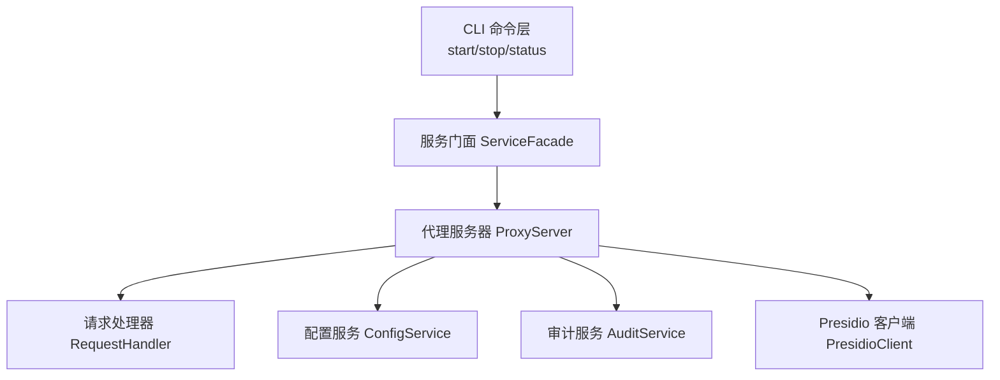
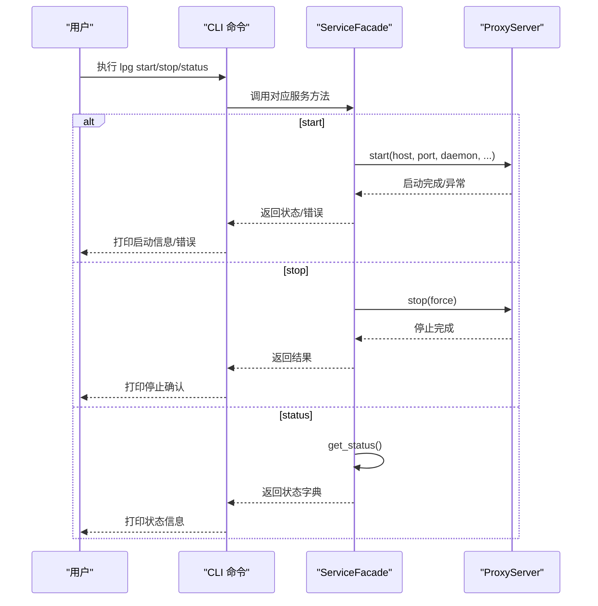
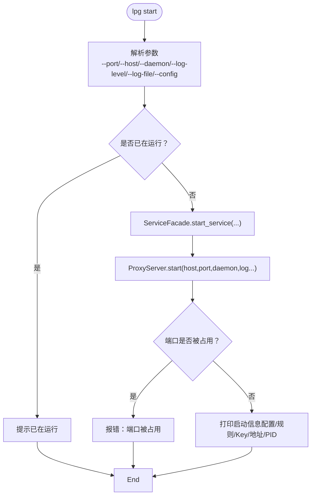
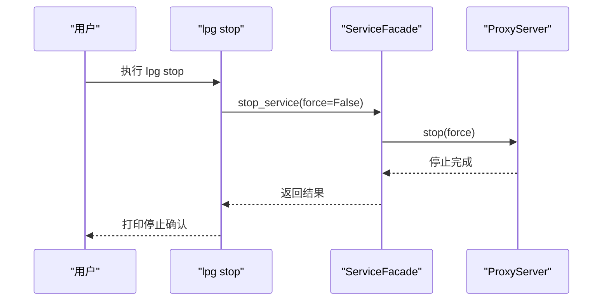
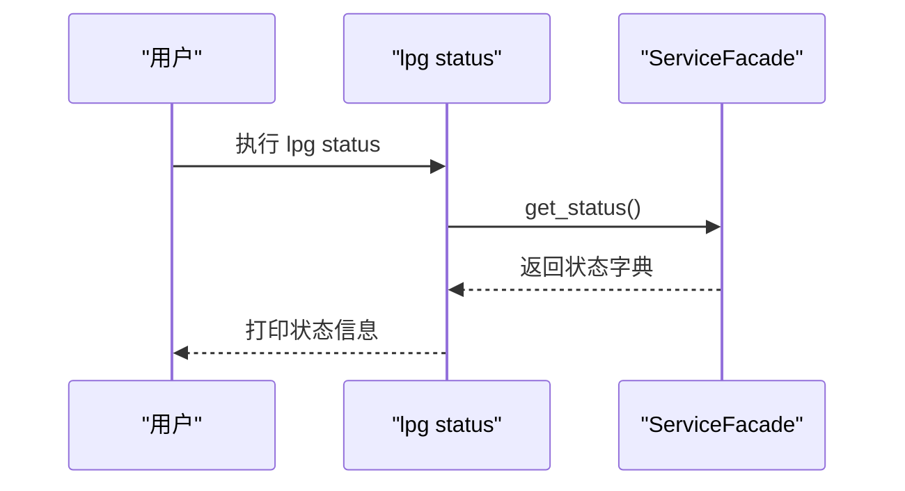
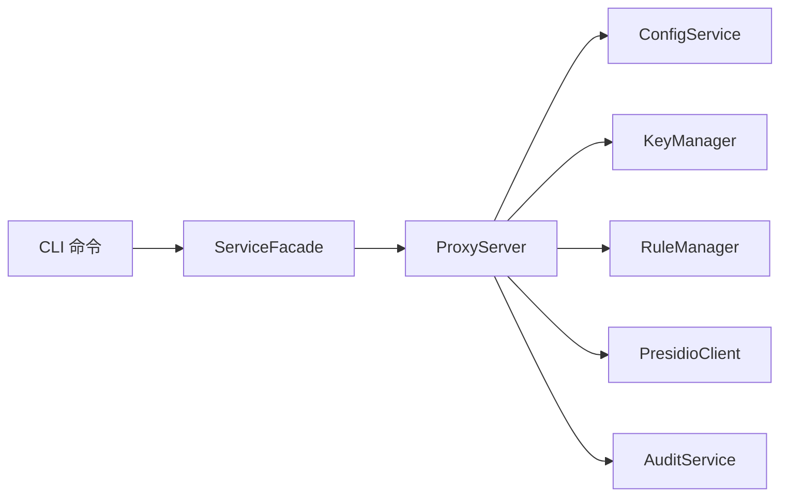

# 服务器管理命令

<cite>
**本文引用的文件**   
- [design-update-20260404-v1.0-init.md](file://doc/design/design-update-20260404-v1.0-init.md)
- [01_cli_commands.md](file://doc/test/tcs/v1.0/01_cli_commands.md)
</cite>

## 目录
1. [简介](#简介)
2. [项目结构](#项目结构)
3. [核心组件](#核心组件)
4. [架构总览](#架构总览)
5. [详细组件分析](#详细组件分析)
6. [依赖分析](#依赖分析)
7. [性能考量](#性能考量)
8. [故障排除指南](#故障排除指南)
9. [结论](#结论)

## 简介
本文档面向 LLM Privacy Gateway（简称 LPG）的服务器管理命令，系统性说明 lpg start、lpg stop、lpg status 等命令的功能、参数与使用方法，并结合测试用例对启动、停止、状态查询的完整流程进行梳理，同时覆盖端口冲突处理、配置文件验证、后台运行等特殊情况，最后提供故障排除建议，帮助用户高效、稳定地管理本地代理服务。

## 项目结构
围绕服务器管理命令，CLI 层位于 doc/design 文档中描述的 cli/ 目录，核心服务由 ServiceFacade 统一调度，代理服务由 ProxyServer 提供。下图展示与服务器管理命令直接相关的模块关系与数据流。

图表来源
- [design-update-20260404-v1.0-init.md:280-311](file://doc/design/design-update-20260404-v1.0-init.md#L280-L311)
- [design-update-20260404-v1.0-init.md:411-568](file://doc/design/design-update-20260404-v1.0-init.md#L411-L568)
- [design-update-20260404-v1.0-init.md:570-741](file://doc/design/design-update-20260404-v1.0-init.md#L570-L741)

章节来源
- [design-update-20260404-v1.0-init.md:256-311](file://doc/design/design-update-20260404-v1.0-init.md#L256-L311)

## 核心组件
- CLI 命令层：定义 lpg start、lpg stop、lpg status 等命令，解析参数并调用 ServiceFacade。
- ServiceFacade：统一服务入口，负责启动/停止代理服务、查询状态、委派各子服务。
- ProxyServer：HTTP 代理服务器，负责监听端口、路由请求、生命周期管理（含后台运行）。
- RequestHandler：请求处理主流程，负责 Key 校验、PII 检测/脱敏、转发与审计。
- ConfigService/AuditService/PresidioClient：支撑服务，分别提供配置、日志与 Presidio 集成。

章节来源
- [design-update-20260404-v1.0-init.md:280-311](file://doc/design/design-update-20260404-v1.0-init.md#L280-L311)
- [design-update-20260404-v1.0-init.md:411-568](file://doc/design/design-update-20260404-v1.0-init.md#L411-L568)
- [design-update-20260404-v1.0-init.md:570-741](file://doc/design/design-update-20260404-v1.0-init.md#L570-L741)

## 架构总览
下图展示服务器管理命令的典型调用链路与关键节点：

图表来源
- [design-update-20260404-v1.0-init.md:444-479](file://doc/design/design-update-20260404-v1.0-init.md#L444-L479)
- [design-update-20260404-v1.0-init.md:659-696](file://doc/design/design-update-20260404-v1.0-init.md#L659-L696)

## 详细组件分析

### lpg start 启动命令
- 功能概要：启动本地代理服务器，支持指定监听地址、端口、后台运行、日志级别与日志文件等。
- 关键参数
  - --port/-p：代理端口，默认 8080；用于绑定监听端口。
  - --host/-h：监听地址，默认 127.0.0.1；用于绑定网络接口。
  - --daemon/-d：后台运行模式；启动后立即返回，终端可继续使用。
  - --log-level：日志级别（debug/info/warn/error），默认 info。
  - --log-file：日志文件路径，可选。
  - --config/-c：配置文件路径（CLI 层全局选项），用于指定配置文件。
- 行为流程
  - CLI 解析参数并调用 ServiceFacade.start_service。
  - ServiceFacade 构造 ProxyServer 并调用其 start/host/port/daemon/log_* 等参数。
  - 若后台模式，ProxyServer 以守护进程方式启动子进程；否则主线程持续运行。
  - 启动成功后打印启动信息（配置加载、规则/Key 数量、监听地址、PID 等）。
- 异常与边界
  - 端口被占用：启动失败并提示端口冲突。
  - 配置文件不存在：启动失败并提示配置文件不可用。
  - 已在运行：提示已在运行，不重复启动。
- 使用场景
  - 开发联调：使用默认端口 8080 快速启动。
  - 多实例：通过不同 --port 启动多个实例。
  - 生产运维：使用 --daemon 在后台运行，结合 --log-file 记录日志。

图表来源
- [design-update-20260404-v1.0-init.md:313-370](file://doc/design/design-update-20260404-v1.0-init.md#L313-L370)
- [design-update-20260404-v1.0-init.md:444-457](file://doc/design/design-update-20260404-v1.0-init.md#L444-L457)
- [design-update-20260404-v1.0-init.md:659-686](file://doc/design/design-update-20260404-v1.0-init.md#L659-L686)

章节来源
- [design-update-20260404-v1.0-init.md:313-370](file://doc/design/design-update-20260404-v1.0-init.md#L313-L370)
- [01_cli_commands.md:86-128](file://doc/test/tcs/v1.0/01_cli_commands.md#L86-L128)

### lpg stop 停止命令
- 功能概要：停止正在运行的代理服务器。
- 关键参数
  - 无特定参数；可通过 CLI 全局选项 --config 指定配置文件。
- 行为流程
  - CLI 调用 ServiceFacade.stop_service。
  - ServiceFacade 委派 ProxyServer.stop。
  - 停止完成后打印确认信息。
- 异常与边界
  - 未在运行：提示“服务器未在运行”。
- 使用场景
  - 日常维护：优雅停止服务。
  - 批量运维：配合脚本循环停止多个实例。

图表来源
- [design-update-20260404-v1.0-init.md:459-462](file://doc/design/design-update-20260404-v1.0-init.md#L459-L462)
- [design-update-20260404-v1.0-init.md:694-696](file://doc/design/design-update-20260404-v1.0-init.md#L694-L696)

章节来源
- [design-update-20260404-v1.0-init.md:459-462](file://doc/design/design-update-20260404-v1.0-init.md#L459-L462)
- [01_cli_commands.md:161-188](file://doc/test/tcs/v1.0/01_cli_commands.md#L161-L188)

### lpg status 状态命令
- 功能概要：查询代理服务当前运行状态（运行中/未运行）、监听地址、PID、运行时长、请求数等。
- 关键参数
  - 无特定参数；可通过 CLI 全局选项 --config 指定配置文件。
- 行为流程
  - CLI 调用 ServiceFacade.get_status。
  - ServiceFacade 返回聚合状态字典，CLI 打印状态信息。
- 异常与边界
  - 未在运行：打印“未运行”状态。
- 使用场景
  - 运维巡检：快速确认服务状态。
  - 自动化：结合 JSON 输出（若启用）解析状态。

图表来源
- [design-update-20260404-v1.0-init.md:468-479](file://doc/design/design-update-20260404-v1.0-init.md#L468-L479)

章节来源
- [design-update-20260404-v1.0-init.md:468-479](file://doc/design/design-update-20260404-v1.0-init.md#L468-L479)
- [01_cli_commands.md:191-220](file://doc/test/tcs/v1.0/01_cli_commands.md#L191-L220)

### CLI 全局参数与配置文件
- --config/-c：指定配置文件路径（全局选项）。用于启动/停止/状态查询时加载统一配置。
- --verbose/-v、--quiet/-q、--json/-j：输出控制（全局选项），可用于调试或自动化解析。

章节来源
- [design-update-20260404-v1.0-init.md:288-301](file://doc/design/design-update-20260404-v1.0-init.md#L288-L301)

## 依赖分析
- CLI 命令层依赖 ServiceFacade，后者再依赖 ProxyServer 与其他核心服务。
- ProxyServer 依赖 ConfigService、KeyManager、RuleManager、PresidioClient、AuditService。
- 该依赖关系保证了 CLI 层与核心服务解耦，便于扩展与测试。

图表来源
- [design-update-20260404-v1.0-init.md:411-568](file://doc/design/design-update-20260404-v1.0-init.md#L411-L568)

章节来源
- [design-update-20260404-v1.0-init.md:411-568](file://doc/design/design-update-20260404-v1.0-init.md#L411-L568)

## 性能考量
- 启动性能：后台模式通过子进程启动，避免阻塞 CLI；前台模式采用事件循环常驻，适合开发调试。
- 运行时性能：请求处理在异步环境下进行，注意避免阻塞操作；日志级别与日志文件路径会影响 I/O 开销。
- 资源占用：多实例启动时需关注端口与内存占用；建议按需调整日志级别与审计频率。

## 故障排除指南
- 端口被占用
  - 现象：启动时报错提示端口被占用。
  - 处理：更换 --port 或释放占用端口；确认防火墙与 SELinux 策略。
  - 参考测试用例：TC-CLI-007。
- 配置文件不存在或格式错误
  - 现象：启动失败并提示配置文件不可用。
  - 处理：使用 --config 指向有效配置；先用 config 命令校验配置。
  - 参考测试用例：TC-CLI-008。
- 服务器未在运行
  - 现象：执行 stop/status 时提示未在运行。
  - 处理：确认服务是否已启动；检查 PID 文件与进程状态；必要时重启服务。
  - 参考测试用例：TC-CLI-010、TC-CLI-012。
- 后台运行验证
  - 现象：使用 --daemon 启动后终端无输出。
  - 处理：通过 status 或系统进程工具确认进程存在；检查 --log-file 输出。
  - 参考测试用例：TC-CLI-006。
- 端口冲突与多实例
  - 建议：为不同实例分配不同 --port；避免在同一主机上重复绑定同一端口。
- 日志定位
  - 建议：生产环境使用 --log-level 与 --log-file；配合 status 查看运行时长与请求统计辅助诊断。

章节来源
- [01_cli_commands.md:131-158](file://doc/test/tcs/v1.0/01_cli_commands.md#L131-L158)
- [01_cli_commands.md:161-188](file://doc/test/tcs/v1.0/01_cli_commands.md#L161-L188)
- [01_cli_commands.md:191-220](file://doc/test/tcs/v1.0/01_cli_commands.md#L191-L220)
- [01_cli_commands.md:116-128](file://doc/test/tcs/v1.0/01_cli_commands.md#L116-L128)

## 结论
lpg start/stop/status 三命令构成服务器管理的核心闭环：启动时支持端口、地址、后台、日志等灵活配置；停止时安全可靠；状态查询提供运行时关键指标。结合配置文件与全局参数，用户可在开发与生产环境中高效、稳定地部署与运维本地代理服务。遇到异常时，可依据本文提供的流程与测试用例快速定位与解决。