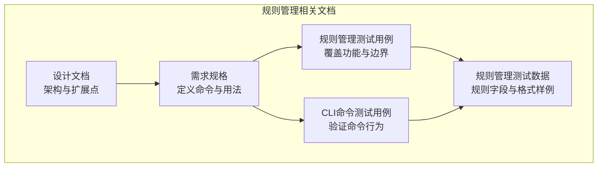
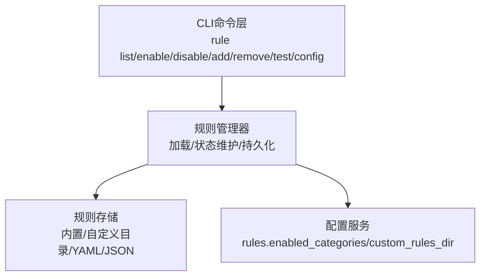
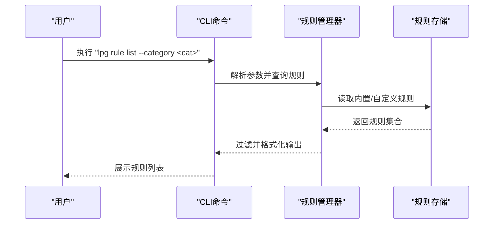
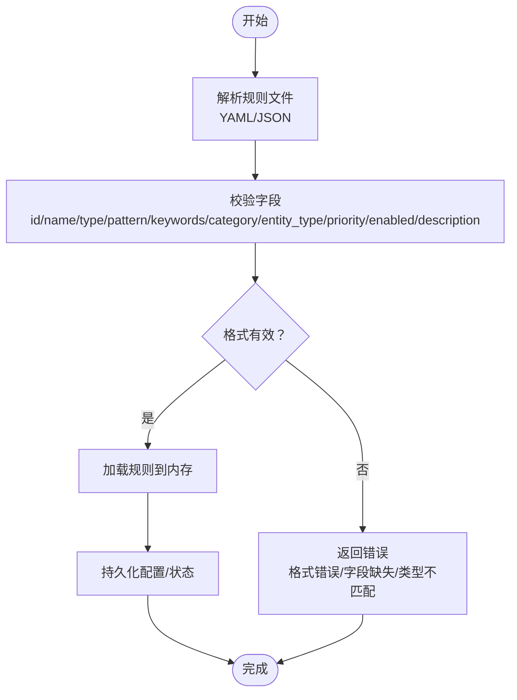
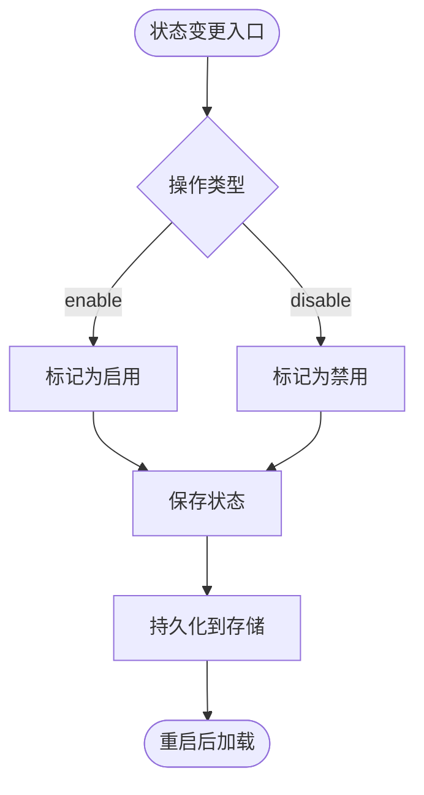
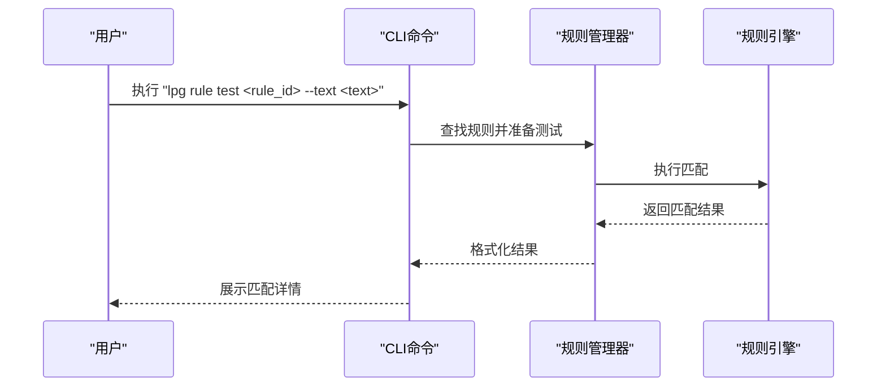
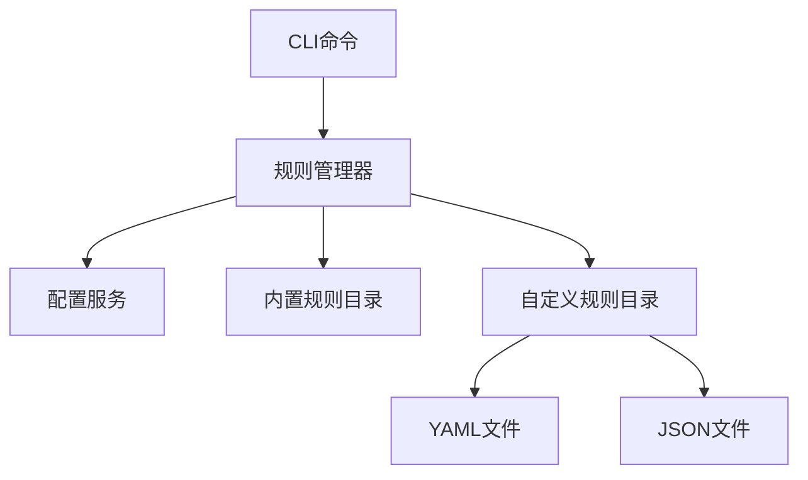

# 规则管理命令

<cite>
**本文档引用的文件**
- [规则管理测试用例](file://doc/test/tcs/v1.0/05_rule_management.md)
- [CLI命令测试用例](file://doc/test/tcs/v1.0/01_cli_commands.md)
- [规则管理测试数据](file://doc/test/tcs/v1.0/05_rule_management_testdata.md)
- [需求规格说明](file://doc/req/req-init-20260401.md)
- [设计文档](file://doc/design/design-update-20260404-v1.0-init.md)
</cite>

## 目录
1. [简介](#简介)
2. [项目结构](#项目结构)
3. [核心组件](#核心组件)
4. [架构总览](#架构总览)
5. [详细组件分析](#详细组件分析)
6. [依赖关系分析](#依赖关系分析)
7. [性能考虑](#性能考虑)
8. [故障排除指南](#故障排除指南)
9. [结论](#结论)
10. [附录](#附录)

## 简介
本文件面向LLM Privacy Gateway的规则管理命令，系统性梳理并说明以下能力：
- 规则管理命令族：rule list、rule enable、rule disable、rule add、rule remove、rule test 等
- 规则文件格式与配置语法：YAML/JSON规则文件结构、字段语义、校验与约束
- 规则启用/禁用机制与持久化策略
- 规则测试方法与应用场景
- 自定义规则开发指南与最佳实践
- 性能优化与故障排除建议

本说明基于仓库内的测试用例、需求规格与设计文档进行归纳总结，确保读者能够从使用到实现层面全面理解规则管理子系统。

## 项目结构
围绕规则管理命令的相关资料主要分布在以下文档：
- 需求规格：定义命令族、选项与典型用法
- 测试用例：覆盖规则加载、列表、启用/禁用、导入、移除、测试、配置、优先级与持久化等场景
- 测试数据：提供规则ID、名称、类型、正则、关键词、分类、脱敏策略、实体类型、优先级、启用状态、文件格式等样例
- 设计文档：给出规则管理器与CLI扩展点的架构预留

**图表来源**
- [需求规格说明:1110-1137](file://doc/req/req-init-20260401.md#L1110-L1137)
- [规则管理测试用例:1-623](file://doc/test/tcs/v1.0/05_rule_management.md#L1-L623)
- [CLI命令测试用例:484-590](file://doc/test/tcs/v1.0/01_cli_commands.md#L484-L590)
- [规则管理测试数据:1-585](file://doc/test/tcs/v1.0/05_rule_management_testdata.md#L1-L585)
- [设计文档:2049-2117](file://doc/design/design-update-20260404-v1.0-init.md#L2049-L2117)

**章节来源**
- [需求规格说明:1110-1137](file://doc/req/req-init-20260401.md#L1110-L1137)
- [规则管理测试用例:1-623](file://doc/test/tcs/v1.0/05_rule_management.md#L1-L623)
- [CLI命令测试用例:484-590](file://doc/test/tcs/v1.0/01_cli_commands.md#L484-L590)
- [规则管理测试数据:1-585](file://doc/test/tcs/v1.0/05_rule_management_testdata.md#L1-L585)
- [设计文档:2049-2117](file://doc/design/design-update-20260404-v1.0-init.md#L2049-L2117)

## 核心组件
- 规则管理命令族
  - list：列出规则，支持按分类、启用/禁用状态筛选
  - enable/disable：启用/禁用单个或批量规则
  - add/import：从文件导入规则（支持YAML/JSON）
  - remove：移除规则（内置规则不可移除）
  - test：测试规则匹配效果（支持文本输入与详细输出）
  - config：显示规则配置（分类、自定义目录等）
- 规则文件格式
  - 支持YAML/JSON两种格式
  - 规则数组包含字段：id、name、type、pattern/keywords、category、entity_type、priority、enabled、description等
- 规则管理器与CLI扩展点
  - 规则管理器负责加载内置与自定义规则
  - CLI预留扩展点，支持云端规则同步等未来能力

**章节来源**
- [需求规格说明:1110-1137](file://doc/req/req-init-20260401.md#L1110-L1137)
- [规则管理测试用例:118-599](file://doc/test/tcs/v1.0/05_rule_management.md#L118-L599)
- [CLI命令测试用例:500-590](file://doc/test/tcs/v1.0/01_cli_commands.md#L500-L590)
- [规则管理测试数据:408-524](file://doc/test/tcs/v1.0/05_rule_management_testdata.md#L408-L524)
- [设计文档:2049-2117](file://doc/design/design-update-20260404-v1.0-init.md#L2049-L2117)

## 架构总览
规则管理命令通过CLI入口调用规则管理器，规则管理器负责规则的加载、状态维护与持久化。测试用例覆盖了从规则文件加载、列表展示、启用/禁用、导入导出、测试验证到配置持久化的完整链路。

**图表来源**
- [设计文档:2049-2117](file://doc/design/design-update-20260404-v1.0-init.md#L2049-L2117)
- [规则管理测试用例:41-115](file://doc/test/tcs/v1.0/05_rule_management.md#L41-L115)
- [需求规格说明:1220-1227](file://doc/req/req-init-20260401.md#L1220-L1227)

## 详细组件分析

### 命令族与使用方法
- rule list
  - 功能：列出所有规则；支持按分类、启用/禁用状态筛选
  - 典型用法：列出全部、按类别筛选、仅显示启用/禁用
  - 行为验证：空规则集提示、分类过滤正确性、状态筛选一致性
- rule enable / disable
  - 功能：启用/禁用单个或批量规则
  - 行为验证：不存在规则报错、重复禁用显示警告、批量操作计数
- rule add / import
  - 功能：从文件导入规则（YAML/JSON）
  - 行为验证：格式错误提示、空文件警告、重复规则处理
- rule remove
  - 功能：移除规则（内置规则不可移除）
  - 行为验证：不存在规则报错、内置规则保护
- rule test
  - 功能：测试规则匹配效果（支持文本输入与详细输出）
  - 行为验证：正则/关键词规则匹配、无效规则报错、详细结果展示
- rule config
  - 功能：显示规则配置（分类、自定义目录等）
  - 行为验证：配置加载、分类展示、目录可访问性

**图表来源**
- [规则管理测试用例:135-177](file://doc/test/tcs/v1.0/05_rule_management.md#L135-L177)
- [CLI命令测试用例:501-513](file://doc/test/tcs/v1.0/01_cli_commands.md#L501-L513)

**章节来源**
- [规则管理测试用例:118-599](file://doc/test/tcs/v1.0/05_rule_management.md#L118-L599)
- [CLI命令测试用例:500-590](file://doc/test/tcs/v1.0/01_cli_commands.md#L500-L590)
- [需求规格说明:1110-1137](file://doc/req/req-init-20260401.md#L1110-L1137)

### 规则文件格式与配置语法
- 支持格式：YAML与JSON
- 规则数组字段（示例字段）：
  - id：规则唯一标识
  - name：规则名称
  - type：规则类型（regex/keyword/ai等）
  - pattern/keywords：规则内容（正则表达式或关键词列表）
  - category：规则分类（pii/credentials/finance等）
  - entity_type：实体类型（如EMAIL_ADDRESS等）
  - priority：优先级（数值，影响应用顺序）
  - enabled：启用状态（布尔或可转换值）
  - description：规则描述
- 配置文件（示例字段）：
  - rules.enabled_categories：启用的规则分类列表
  - rules.custom_rules_dir：自定义规则目录路径

**图表来源**
- [规则管理测试数据:408-524](file://doc/test/tcs/v1.0/05_rule_management_testdata.md#L408-L524)
- [规则管理测试用例:103-115](file://doc/test/tcs/v1.0/05_rule_management.md#L103-L115)

**章节来源**
- [规则管理测试数据:408-524](file://doc/test/tcs/v1.0/05_rule_management_testdata.md#L408-L524)
- [规则管理测试用例:103-115](file://doc/test/tcs/v1.0/05_rule_management.md#L103-L115)
- [需求规格说明:1220-1227](file://doc/req/req-init-20260401.md#L1220-L1227)

### 规则启用/禁用机制与持久化
- 启用/禁用状态
  - 支持单个与批量操作
  - 不存在规则报错，重复禁用显示警告
- 状态持久化
  - 重启服务后状态保持
  - 配置持久化保证规则行为一致
- 冲突与优先级
  - 多规则冲突时按优先级顺序处理
  - 优先级数值影响应用顺序

**图表来源**
- [规则管理测试用例:195-284](file://doc/test/tcs/v1.0/05_rule_management.md#L195-L284)
- [规则管理测试用例:552-581](file://doc/test/tcs/v1.0/05_rule_management.md#L552-L581)

**章节来源**
- [规则管理测试用例:195-284](file://doc/test/tcs/v1.0/05_rule_management.md#L195-L284)
- [规则管理测试用例:552-581](file://doc/test/tcs/v1.0/05_rule_management.md#L552-L581)

### 规则测试方法与应用场景
- 测试命令：rule test
- 输入：规则ID与待检测文本
- 输出：匹配结果、匹配位置/内容、匹配数量、详细信息（可选）
- 应用场景：规则有效性验证、规则冲突排查、规则效果评估

**图表来源**
- [规则管理测试用例:411-470](file://doc/test/tcs/v1.0/05_rule_management.md#L411-L470)
- [CLI命令测试用例:576-588](file://doc/test/tcs/v1.0/01_cli_commands.md#L576-L588)

**章节来源**
- [规则管理测试用例:411-470](file://doc/test/tcs/v1.0/05_rule_management.md#L411-L470)
- [CLI命令测试用例:576-588](file://doc/test/tcs/v1.0/01_cli_commands.md#L576-L588)

### 自定义规则开发指南与最佳实践
- 规则字段设计
  - id：全局唯一、简洁明确
  - name：可读性强，支持多语言
  - type：严格遵循枚举值（regex/keyword/ai）
  - pattern/keywords：正则需转义正确，关键词列表去重
  - category：使用标准分类（pii/credentials/finance等）
  - entity_type：与检测引擎约定的实体类型一致
  - priority：合理分配优先级区间，避免冲突
  - enabled：默认启用或禁用需符合业务策略
  - description：提供规则用途、边界与注意事项
- 文件组织
  - 使用YAML/JSON格式，保持缩进与转义正确
  - 分类存放：内置与自定义规则目录分离
- 质量保障
  - 使用测试命令验证规则匹配效果
  - 对边界条件与异常输入进行测试
  - 定期评估优先级与冲突处理

**章节来源**
- [规则管理测试数据:81-524](file://doc/test/tcs/v1.0/05_rule_management_testdata.md#L81-L524)
- [规则管理测试用例:287-362](file://doc/test/tcs/v1.0/05_rule_management.md#L287-L362)

## 依赖关系分析
- CLI命令依赖规则管理器
- 规则管理器依赖配置服务与规则存储
- 规则存储支持内置与自定义目录，以及YAML/JSON文件

**图表来源**
- [设计文档:2049-2117](file://doc/design/design-update-20260404-v1.0-init.md#L2049-L2117)
- [需求规格说明:1220-1227](file://doc/req/req-init-20260401.md#L1220-L1227)

**章节来源**
- [设计文档:2049-2117](file://doc/design/design-update-20260404-v1.0-init.md#L2049-L2117)
- [需求规格说明:1220-1227](file://doc/req/req-init-20260401.md#L1220-L1227)

## 性能考虑
- 规则加载
  - 优先加载必要规则，避免一次性加载过多规则导致启动缓慢
  - 对YAML/JSON解析进行缓存与校验，减少重复开销
- 规则匹配
  - 合理设置优先级，减少冲突与回溯
  - 正则表达式避免回溯陷阱，使用高效模式
- 并发与持久化
  - 状态变更采用原子写入，避免频繁IO
  - 批量操作合并提交，降低持久化压力

[本节为通用指导，无需特定文件引用]

## 故障排除指南
- 规则文件格式错误
  - 现象：导入/加载时报格式错误
  - 排查：检查YAML/JSON语法、字段类型与转义
  - 参考：无效格式样例与错误提示
- 规则不存在
  - 现象：启用/禁用/移除/测试时报规则不存在
  - 排查：确认规则ID拼写与是否存在
- 重复规则
  - 现象：导入重复规则显示警告
  - 排查：根据配置决定覆盖或跳过
- 内置规则不可移除
  - 现象：尝试移除内置规则报错
  - 排查：使用禁用命令替代移除
- 空规则集
  - 现象：规则列表为空
  - 排查：检查内置/自定义目录与配置文件

**章节来源**
- [规则管理测试用例:103-115](file://doc/test/tcs/v1.0/05_rule_management.md#L103-L115)
- [规则管理测试用例:227-254](file://doc/test/tcs/v1.0/05_rule_management.md#L227-L254)
- [规则管理测试用例:319-362](file://doc/test/tcs/v1.0/05_rule_management.md#L319-L362)
- [规则管理测试用例:381-408](file://doc/test/tcs/v1.0/05_rule_management.md#L381-L408)
- [规则管理测试用例:180-192](file://doc/test/tcs/v1.0/05_rule_management.md#L180-L192)

## 结论
规则管理命令提供了从规则加载、列表、启用/禁用、导入导出、测试验证到配置持久化的完整能力。通过标准化的规则文件格式与严格的测试覆盖，系统在易用性与可靠性方面具备良好基础。建议在生产环境中结合性能优化与故障排除实践，持续完善规则体系。

[本节为总结性内容，无需特定文件引用]

## 附录

### 命令速查表
- lpg rule list：列出所有规则
- lpg rule list --category <category>：按分类列出规则
- lpg rule list --enabled：列出启用的规则
- lpg rule list --disabled：列出禁用的规则
- lpg rule enable <rule_name>：启用规则
- lpg rule disable <rule_name>：禁用规则
- lpg rule import <file>：导入规则文件
- lpg rule remove <rule_name>：移除规则
- lpg rule test <rule_name> --text <text>：测试规则
- lpg rule config：显示规则配置

**章节来源**
- [规则管理测试用例:586-599](file://doc/test/tcs/v1.0/05_rule_management.md#L586-L599)
- [CLI命令测试用例:501-590](file://doc/test/tcs/v1.0/01_cli_commands.md#L501-L590)

### 规则分类与状态
- 分类：pii（个人身份信息）、credentials（凭证信息）、finance（金融信息）
- 状态：enabled（启用）、disabled（禁用）

**章节来源**
- [规则管理测试用例:601-623](file://doc/test/tcs/v1.0/05_rule_management.md#L601-L623)