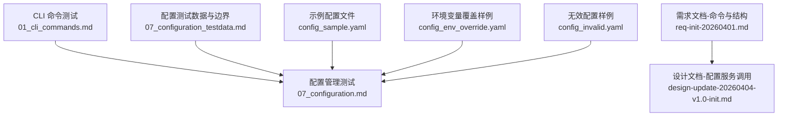
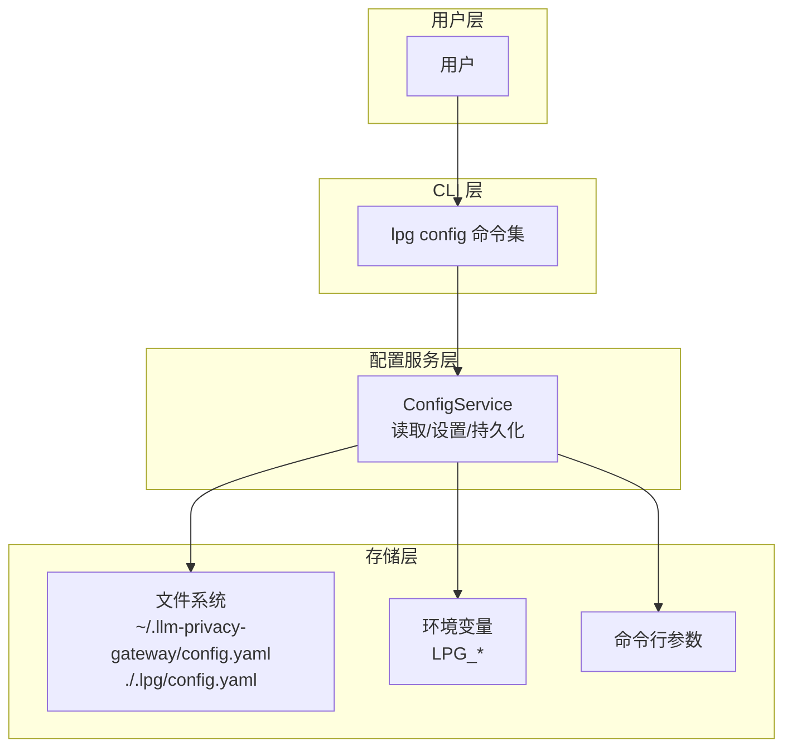
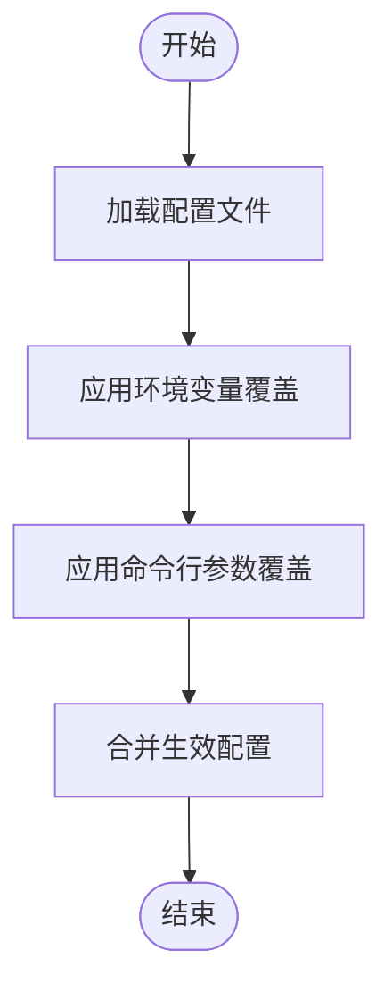
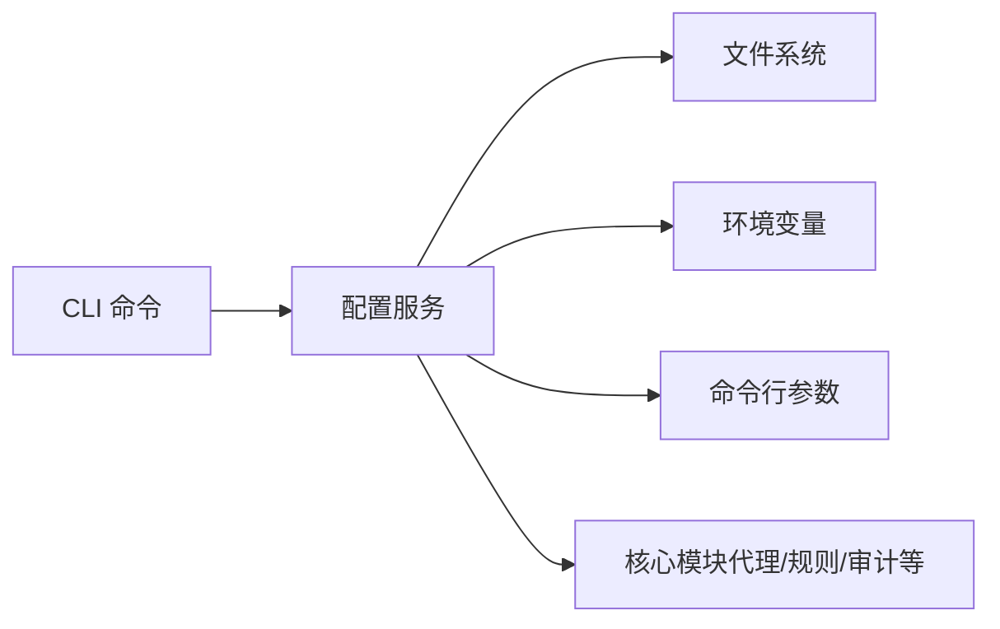

# 配置管理命令

<cite>
**本文引用的文件**
- [01_cli_commands.md](file://doc/test/tcs/v1.0/01_cli_commands.md)
- [07_configuration.md](file://doc/test/tcs/v1.0/07_configuration.md)
- [07_configuration_testdata.md](file://doc/test/tcs/v1.0/07_configuration_testdata.md)
- [config_sample.yaml](file://doc/test/tcs/v1.0/test_data/config_sample.yaml)
- [config_env_override.yaml](file://doc/test/tcs/v1.0/test_data/config_env_override.yaml)
- [config_invalid.yaml](file://doc/test/tcs/v1.0/test_data/config_invalid.yaml)
- [req-init-20260401.md](file://doc/req/req-init-20260401.md)
- [design-update-20260404-v1.0-init.md](file://doc/design/design-update-20260404-v1.0-init.md)
</cite>

## 目录
1. [简介](#简介)
2. [项目结构](#项目结构)
3. [核心组件](#核心组件)
4. [架构总览](#架构总览)
5. [详细组件分析](#详细组件分析)
6. [依赖关系分析](#依赖关系分析)
7. [性能考虑](#性能考虑)
8. [故障排查指南](#故障排查指南)
9. [结论](#结论)
10. [附录](#附录)

## 简介
本文件面向 LLM Privacy Gateway 的配置管理命令，系统性说明 lpg config 命令系列的功能与使用方法，包括：
- 初始化配置：交互式与非交互式两种模式及其适用场景
- 显示与读取配置：完整配置展示、指定配置项读取、嵌套配置项访问语法
- 设置配置：单值设置、嵌套项设置、类型与范围校验
- 配置验证与错误处理最佳实践
- 配置文件格式与常见配置项说明
- 配置优先级与环境变量覆盖机制

## 项目结构
围绕配置管理的相关文档与测试数据分布在以下位置：
- CLI 命令测试用例：doc/test/tcs/v1.0/01_cli_commands.md
- 配置管理黑盒测试用例：doc/test/tcs/v1.0/07_configuration.md
- 配置测试数据与边界条件：doc/test/tcs/v1.0/07_configuration_testdata.md
- 示例配置文件：doc/test/tcs/v1.0/test_data/*.yaml
- 需求文档中的命令与配置文件结构：doc/req/req-init-20260401.md
- 设计文档中对配置服务的调用与键空间：doc/design/design-update-20260404-v1.0-init.md

**图表来源**
- [01_cli_commands.md:223-299](file://doc/test/tcs/v1.0/01_cli_commands.md#L223-L299)
- [07_configuration.md:35-594](file://doc/test/tcs/v1.0/07_configuration.md#L35-L594)
- [07_configuration_testdata.md:1-808](file://doc/test/tcs/v1.0/07_configuration_testdata.md#L1-L808)
- [config_sample.yaml:1-27](file://doc/test/tcs/v1.0/test_data/config_sample.yaml#L1-L27)
- [config_env_override.yaml:1-16](file://doc/test/tcs/v1.0/test_data/config_env_override.yaml#L1-L16)
- [config_invalid.yaml:1-29](file://doc/test/tcs/v1.0/test_data/config_invalid.yaml#L1-L29)
- [req-init-20260401.md:1046-1051](file://doc/req/req-init-20260401.md#L1046-L1051)
- [design-update-20260404-v1.0-init.md:525-535](file://doc/design/design-update-20260404-v1.0-init.md#L525-L535)

**章节来源**
- [01_cli_commands.md:223-299](file://doc/test/tcs/v1.0/01_cli_commands.md#L223-L299)
- [07_configuration.md:35-594](file://doc/test/tcs/v1.0/07_configuration.md#L35-L594)
- [07_configuration_testdata.md:1-808](file://doc/test/tcs/v1.0/07_configuration_testdata.md#L1-L808)
- [config_sample.yaml:1-27](file://doc/test/tcs/v1.0/test_data/config_sample.yaml#L1-L27)
- [config_env_override.yaml:1-16](file://doc/test/tcs/v1.0/test_data/config_env_override.yaml#L1-L16)
- [config_invalid.yaml:1-29](file://doc/test/tcs/v1.0/test_data/config_invalid.yaml#L1-L29)
- [req-init-20260401.md:1046-1051](file://doc/req/req-init-20260401.md#L1046-L1051)
- [design-update-20260404-v1.0-init.md:525-535](file://doc/design/design-update-20260404-v1.0-init.md#L525-L535)

## 核心组件
- lpg config init：初始化配置文件，支持交互式与非交互式两种模式；可指定输出路径与强制覆盖
- lpg config show：显示当前完整配置
- lpg config get：读取指定配置项，支持嵌套键访问；可提供默认值
- lpg config set：设置配置项，支持嵌套键；具备类型与范围校验
- 配置文件格式：YAML；包含代理、Presidio、日志、提供商、虚拟 Key、规则、脱敏、审计等键空间
- 配置优先级：命令行参数 > 环境变量 > 本地配置 > 全局配置 > 默认配置
- 环境变量覆盖：通过 LPG_* 前缀的环境变量覆盖对应配置项

**章节来源**
- [01_cli_commands.md:225-299](file://doc/test/tcs/v1.0/01_cli_commands.md#L225-L299)
- [07_configuration.md:39-594](file://doc/test/tcs/v1.0/07_configuration.md#L39-L594)
- [07_configuration_testdata.md:596-745](file://doc/test/tcs/v1.0/07_configuration_testdata.md#L596-L745)
- [req-init-20260401.md:1046-1051](file://doc/req/req-init-20260401.md#L1046-L1051)
- [design-update-20260404-v1.0-init.md:525-535](file://doc/design/design-update-20260404-v1.0-init.md#L525-L535)

## 架构总览
下图展示了配置管理命令在系统中的位置与调用关系：

**图表来源**
- [07_configuration.md:407-453](file://doc/test/tcs/v1.0/07_configuration.md#L407-L453)
- [07_configuration_testdata.md:699-745](file://doc/test/tcs/v1.0/07_configuration_testdata.md#L699-L745)
- [design-update-20260404-v1.0-init.md:525-535](file://doc/design/design-update-20260404-v1.0-init.md#L525-L535)

## 详细组件分析

### 初始化配置（config init）
- 交互式模式：适用于首次安装或需要手动确认的场景，会提示输入关键配置项并生成默认路径的配置文件
- 非交互式模式：适用于自动化部署，直接使用默认值生成配置文件
- 输出路径：可指定任意可写路径；默认路径为用户主目录下的全局配置
- 强制覆盖：当目标路径已有配置文件时，可通过强制选项进行覆盖并给出警告

典型使用场景
- 开发机首次安装：交互式初始化，便于确认各项配置
- CI/CD 环境：非交互式初始化，确保流水线可重复执行
- 多环境隔离：指定输出路径，生成不同环境的配置文件

**章节来源**
- [01_cli_commands.md:225-252](file://doc/test/tcs/v1.0/01_cli_commands.md#L225-L252)
- [07_configuration.md:39-96](file://doc/test/tcs/v1.0/07_configuration.md#L39-L96)

### 显示配置（config show）
- 功能：打印当前生效的完整配置内容
- 输出格式：默认 YAML，支持 JSON 格式输出（在相关测试中体现）

使用建议
- 在变更配置后，先使用 show 确认最终生效值
- 结合 list 命令对比不同来源的配置差异

**章节来源**
- [01_cli_commands.md:255-267](file://doc/test/tcs/v1.0/01_cli_commands.md#L255-L267)
- [07_configuration.md:238-250](file://doc/test/tcs/v1.0/07_configuration.md#L238-L250)

### 读取配置（config get）
- 支持嵌套键访问：如 proxy.port、providers.openai.api_key
- 默认值：当键不存在时，可提供默认值避免错误
- 不存在键：返回“配置项不存在”的提示信息

嵌套访问语法
- 使用点号分隔层级，例如：parent.child.grandchild
- 支持数组索引与对象字段组合访问（在设计文档中体现键空间）

**章节来源**
- [01_cli_commands.md:270-297](file://doc/test/tcs/v1.0/01_cli_commands.md#L270-L297)
- [07_configuration.md:178-235](file://doc/test/tcs/v1.0/07_configuration.md#L178-L235)
- [design-update-20260404-v1.0-init.md:525-535](file://doc/design/design-update-20260404-v1.0-init.md#L525-L535)

### 设置配置（config set）
- 支持嵌套键设置：如 providers.openai.api_key
- 类型与范围校验：对端口、超时、日志级别、URL 等进行严格校验
- 错误处理：无效值或越界值会拒绝设置并提示原因
- 持久化：设置成功后自动写回配置文件

常见校验示例
- 端口范围：1-65535
- 超时范围：>0 且不超过上限
- 日志级别：debug/info/warn/error（小写）
- URL 格式：http/https，协议与主机合法

**章节来源**
- [01_cli_commands.md:300-312](file://doc/test/tcs/v1.0/01_cli_commands.md#L300-L312)
- [07_configuration.md:255-327](file://doc/test/tcs/v1.0/07_configuration.md#L255-L327)
- [07_configuration_testdata.md:29-88](file://doc/test/tcs/v1.0/07_configuration_testdata.md#L29-L88)

### 配置文件格式与常见配置项
- 路径与优先级：全局配置（用户主目录）、本地配置（当前目录），本地优先级更高
- 示例结构：代理、Presidio、日志、提供商、虚拟 Key、规则、脱敏、审计等键空间
- 环境变量覆盖：通过 LPG_* 前缀覆盖对应配置项
- 命令行参数优先级最高：启动服务时可覆盖配置文件与环境变量

配置项示例（来源于示例文件）
- 代理：host、port、timeout、max_connections
- Presidio：endpoint、language、enabled、timeout
- 日志：level、file、max_size、max_files、format
- 提供商：name、type、base_url、auth_type、api_key_file
- 虚拟 Key：id、name、provider、permissions
- 规则：enabled_categories、custom_rules_dir
- 脱敏：default_strategy、enable_restoration
- 审计：enabled、log_file、retention_days

**章节来源**
- [req-init-20260401.md:1166-1239](file://doc/req/req-init-20260401.md#L1166-L1239)
- [config_sample.yaml:1-27](file://doc/test/tcs/v1.0/test_data/config_sample.yaml#L1-L27)
- [config_env_override.yaml:1-16](file://doc/test/tcs/v1.0/test_data/config_env_override.yaml#L1-L16)
- [07_configuration_testdata.md:635-745](file://doc/test/tcs/v1.0/07_configuration_testdata.md#L635-L745)

### 配置优先级与环境变量覆盖
- 优先级顺序：命令行参数 > 环境变量 > 本地配置 > 全局配置 > 默认配置
- 环境变量命名：LPG_ 前缀 + 大写键名（如 LPG_PROXY_PORT）
- 无效环境变量值：不会导致程序退出，而是使用配置文件中的值并发出警告

**图表来源**
- [07_configuration.md:407-453](file://doc/test/tcs/v1.0/07_configuration.md#L407-L453)
- [07_configuration_testdata.md:699-745](file://doc/test/tcs/v1.0/07_configuration_testdata.md#L699-L745)

**章节来源**
- [07_configuration.md:407-453](file://doc/test/tcs/v1.0/07_configuration.md#L407-L453)
- [07_configuration_testdata.md:699-745](file://doc/test/tcs/v1.0/07_configuration_testdata.md#L699-L745)

## 依赖关系分析
- CLI 命令层依赖配置服务层完成读取、设置与持久化
- 配置服务层依赖文件系统、环境变量与命令行参数
- 设计文档体现了配置服务在业务模块中的调用方式（如代理、规则、审计等）

**图表来源**
- [design-update-20260404-v1.0-init.md:525-535](file://doc/design/design-update-20260404-v1.0-init.md#L525-L535)

**章节来源**
- [design-update-20260404-v1.0-init.md:525-535](file://doc/design/design-update-20260404-v1.0-init.md#L525-L535)

## 性能考虑
- 配置读取为内存操作，频繁变更配置对性能影响极小
- 建议在批量设置配置后统一读取一次，减少多次 IO
- 对于大规模配置项，优先使用嵌套键一次性设置，避免多次往返

## 故障排查指南
常见问题与处理建议
- 配置文件不存在
  - 现象：加载失败并提示不存在
  - 处理：使用初始化命令生成配置文件，或提供有效路径
- 配置文件格式错误
  - 现象：YAML 解析错误
  - 处理：修复 YAML 语法（缩进、键重复等），参考无效配置样例定位问题
- 无效配置值
  - 现象：设置失败并提示类型或范围错误
  - 处理：根据校验规则修正值（端口范围、日志级别、URL 格式等）
- 不存在的配置项
  - 现象：读取失败并提示不存在
  - 处理：确认键名拼写与嵌套层级，或提供默认值
- 环境变量覆盖无效
  - 现象：环境变量未生效
  - 处理：检查 LPG_* 前缀与键名映射，确认值符合类型要求

**章节来源**
- [07_configuration.md:131-173](file://doc/test/tcs/v1.0/07_configuration.md#L131-L173)
- [07_configuration.md:188-235](file://doc/test/tcs/v1.0/07_configuration.md#L188-L235)
- [07_configuration.md:285-327](file://doc/test/tcs/v1.0/07_configuration.md#L285-L327)
- [config_invalid.yaml:1-29](file://doc/test/tcs/v1.0/test_data/config_invalid.yaml#L1-L29)

## 结论
lpg config 命令提供了完善的配置生命周期管理能力：从初始化、读取、设置到验证与持久化，配合环境变量与命令行参数的优先级机制，能够满足开发、测试与生产多场景需求。建议在团队内统一配置规范与校验流程，结合自动化测试保障配置变更的稳定性。

## 附录

### 命令速查表
- 初始化配置
  - 交互式：lpg config init
  - 非交互式：lpg config init --no-interactive
  - 指定路径：lpg config init --output <path>
  - 强制覆盖：lpg config init --force
- 显示配置
  - 显示完整配置：lpg config show
  - JSON 格式：lpg config show --format json
- 读取配置
  - 单项读取：lpg config get <key>
  - 嵌套读取：lpg config get parent.child
  - 带默认值：lpg config get <key> --default <value>
- 设置配置
  - 单项设置：lpg config set <key> <value>
  - 嵌套设置：lpg config set parent.child <value>
  - 批量设置后验证：lpg config get <key>

**章节来源**
- [01_cli_commands.md:225-312](file://doc/test/tcs/v1.0/01_cli_commands.md#L225-L312)
- [req-init-20260401.md:1046-1051](file://doc/req/req-init-20260401.md#L1046-L1051)