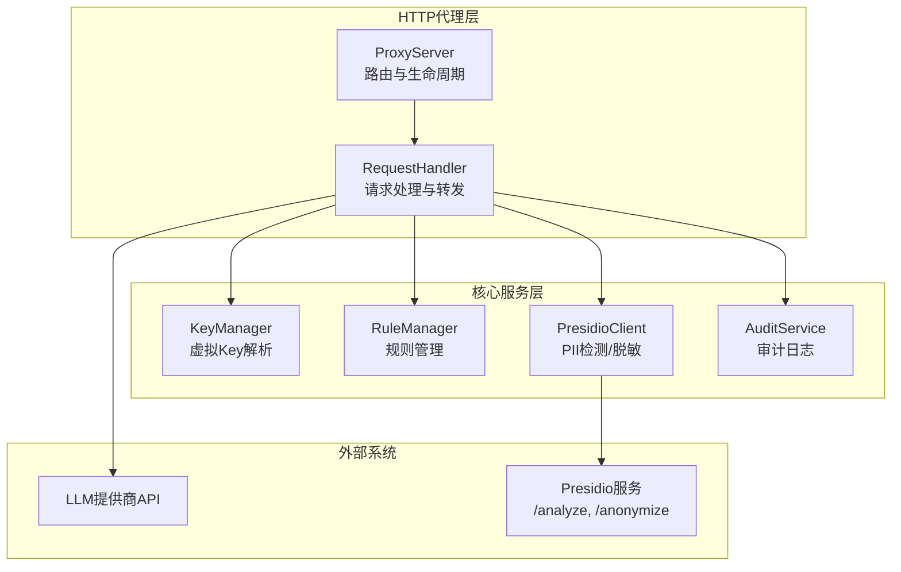
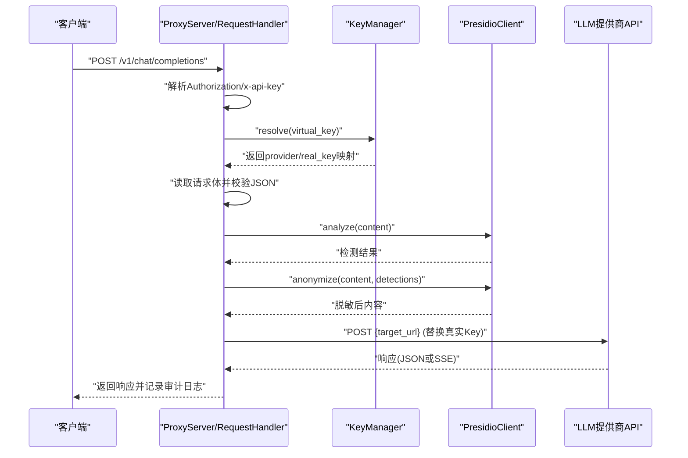
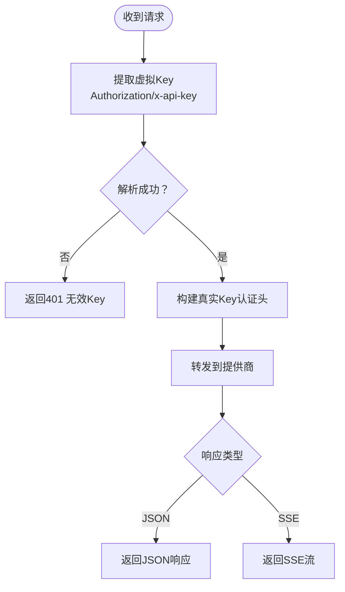
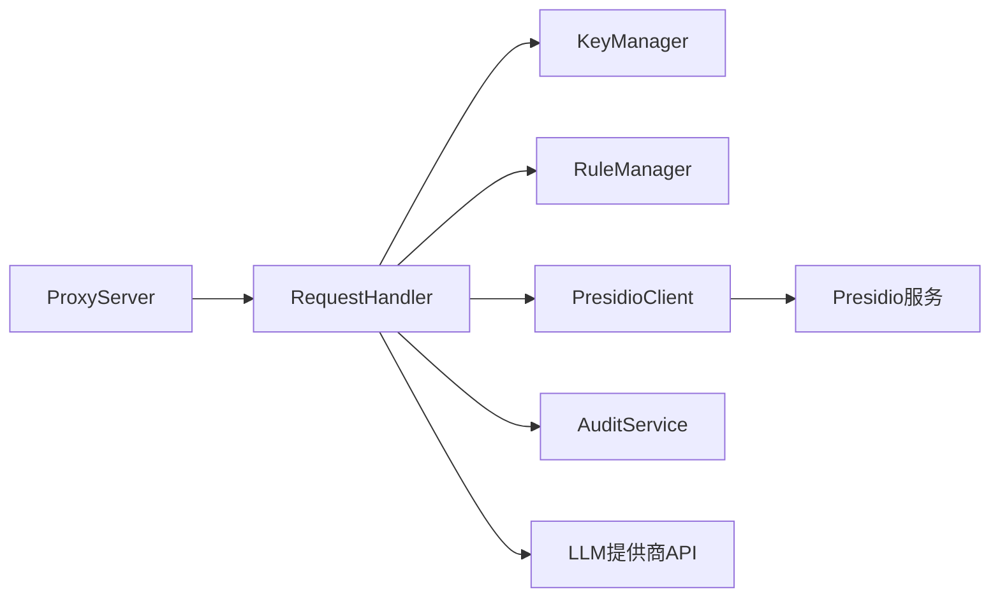

# API端点

<cite>
**本文引用的文件**
- [设计文档](file://doc/design/design-update-20260404-v1.0-init.md)
- [代理服务测试用例](file://doc/test/tcs/v1.0/02_proxy_service.md)
- [端到端集成测试数据](file://doc/test/tcs/v1.0/08_e2e_integration_testdata.md)
- [Key管理测试用例](file://doc/test/tcs/v1.0/03_key_management.md)
</cite>

## 目录
1. [简介](#简介)
2. [项目结构](#项目结构)
3. [核心组件](#核心组件)
4. [架构总览](#架构总览)
5. [详细组件分析](#详细组件分析)
6. [依赖分析](#依赖分析)
7. [性能考虑](#性能考虑)
8. [故障排查指南](#故障排查指南)
9. [结论](#结论)
10. [附录](#附录)

## 简介
本文件面向LLM Privacy Gateway v1.0的HTTP代理API端点，系统化说明以下内容：
- 支持的API端点：/v1/chat/completions、/v1/completions、/v1/embeddings以及通用端点/{path:.*}
- HTTP方法、请求格式、响应结构与错误处理
- 通用端点的路由机制与转发行为
- 完整的请求/响应示例（JSON与SSE流式响应）
- 认证机制与虚拟Key使用方法
- API版本兼容性与迁移指南

## 项目结构
LLM Privacy Gateway采用模块化设计，HTTP代理服务位于核心模块的proxy子系统中，配合Key管理、规则管理、Presidio脱敏与审计日志服务协同工作。

图表来源
- [设计文档:588-741](file://doc/design/design-update-20260404-v1.0-init.md#L588-L741)
- [设计文档:762-944](file://doc/design/design-update-20260404-v1.0-init.md#L762-L944)

章节来源
- [设计文档:70-122](file://doc/design/design-update-20260404-v1.0-init.md#L70-L122)

## 核心组件
- 代理服务器（ProxyServer）：负责路由注册、请求接收与生命周期管理，支持/v1/chat/completions、/v1/completions、/v1/embeddings以及通用端点/{path:.*}。
- 请求处理器（RequestHandler）：负责虚拟Key校验、PII检测与脱敏、请求转发、响应处理（含SSE）、审计日志记录。
- Key管理器（KeyManager）：虚拟Key生成、映射、解析与生命周期管理。
- Presidio客户端（PresidioClient）：调用本地Presidio服务进行PII检测与脱敏。
- 审计服务（AuditService）：记录请求处理日志，支持查询与导出。

章节来源
- [设计文档:588-741](file://doc/design/design-update-20260404-v1.0-init.md#L588-L741)
- [设计文档:762-944](file://doc/design/design-update-20260404-v1.0-init.md#L762-L944)
- [设计文档:1115-1275](file://doc/design/design-update-20260404-v1.0-init.md#L1115-L1275)
- [设计文档:1441-1640](file://doc/design/design-update-20260404-v1.0-init.md#L1441-L1640)

## 架构总览
下图展示从客户端到LLM提供商的完整请求链路，包括虚拟Key校验、PII检测/脱敏、请求转发与响应处理。

图表来源
- [设计文档:785-847](file://doc/design/design-update-20260404-v1.0-init.md#L785-L847)
- [设计文档:832-847](file://doc/design/design-update-20260404-v1.0-init.md#L832-L847)
- [设计文档:889-936](file://doc/design/design-update-20260404-v1.0-init.md#L889-L936)

## 详细组件分析

### /v1/chat/completions 端点
- HTTP方法：POST
- 请求格式：JSON，包含messages数组（需包含content字段），可选stream等参数
- 响应格式：JSON；若stream=true则返回SSE流
- 认证：支持Authorization: Bearer {虚拟Key} 或 x-api-key: {虚拟Key}
- PII处理：对messages中的content进行PII检测与脱敏
- 错误处理：400（JSON解析失败）、401（缺少/无效Key）、500（提供商未配置）、5xx（上游错误）

请求示例（JSON）
- 请求头：Authorization: Bearer sk-virtual-xxx
- 请求体：包含model与messages数组
- 响应：标准OpenAI风格的聊天补全响应

请求示例（SSE）
- 请求体：包含stream: true
- 响应：text/event-stream，逐段返回chunk，最后以[data: [DONE]]结尾

章节来源
- [设计文档:701-703](file://doc/design/design-update-20260404-v1.0-init.md#L701-L703)
- [设计文档:836-847](file://doc/design/design-update-20260404-v1.0-init.md#L836-L847)
- [代理服务测试用例:255-284](file://doc/test/tcs/v1.0/02_proxy_service.md#L255-L284)
- [端到端集成测试数据:636-653](file://doc/test/tcs/v1.0/08_e2e_integration_testdata.md#L636-L653)

### /v1/completions 端点
- HTTP方法：POST
- 请求格式：JSON，包含model与prompt等字段
- 响应格式：JSON
- 认证：同上
- PII处理：对prompt等文本字段进行PII检测与脱敏
- 错误处理：同上

章节来源
- [设计文档:701-703](file://doc/design/design-update-20260404-v1.0-init.md#L701-L703)
- [代理服务测试用例:287-313](file://doc/test/tcs/v1.0/02_proxy_service.md#L287-L313)

### /v1/embeddings 端点
- HTTP方法：POST
- 请求格式：JSON，包含model与input等字段
- 响应格式：JSON，包含嵌入向量数组
- 认证：同上
- PII处理：对input等文本字段进行PII检测与脱敏
- 错误处理：同上

章节来源
- [设计文档:701-703](file://doc/design/design-update-20260404-v1.0-init.md#L701-L703)
- [代理服务测试用例:316-342](file://doc/test/tcs/v1.0/02_proxy_service.md#L316-L342)

### 通用端点 /{path:.*}
- HTTP方法：支持GET与POST
- 路由机制：所有未显式绑定的路径均转发至配置的提供商base_url
- 转发行为：保持原始路径与查询参数，替换认证头为真实提供商Key
- 认证：同上
- 错误处理：同上

章节来源
- [设计文档:705-707](file://doc/design/design-update-20260404-v1.0-init.md#L705-L707)
- [设计文档:865-868](file://doc/design/design-update-20260404-v1.0-init.md#L865-L868)
- [设计文档:870-887](file://doc/design/design-update-20260404-v1.0-init.md#L870-L887)

### 认证机制与虚拟Key
- 虚拟Key生成：KeyManager根据提供商配置生成，带有唯一ID与过期时间
- Key解析：RequestHandler从Authorization或x-api-key中提取虚拟Key并解析映射
- 认证头替换：根据提供商配置的auth_type（bearer/x-api-key/api-key）替换真实Key
- 过期与吊销：KeyManager支持过期检查与吊销操作

图表来源
- [设计文档:789-796](file://doc/design/design-update-20260404-v1.0-init.md#L789-L796)
- [设计文档:870-887](file://doc/design/design-update-20260404-v1.0-init.md#L870-L887)

章节来源
- [设计文档:1115-1275](file://doc/design/design-update-20260404-v1.0-init.md#L1115-L1275)
- [Key管理测试用例:128-187](file://doc/test/tcs/v1.0/03_key_management.md#L128-L187)

### 错误处理与响应格式
- 400：请求体JSON解析失败
- 401：缺少或无效虚拟Key
- 500：提供商未配置
- 5xx：上游提供商错误
- 通用错误响应：包含error对象，字段包含message与type

章节来源
- [设计文档:804-808](file://doc/design/design-update-20260404-v1.0-init.md#L804-L808)
- [设计文档:938-943](file://doc/design/design-update-20260404-v1.0-init.md#L938-L943)
- [代理服务测试用例:631-683](file://doc/test/tcs/v1.0/02_proxy_service.md#L631-L683)

### 流式响应（SSE）
- 触发条件：请求体包含stream: true
- 响应头：Content-Type: text/event-stream；Cache-Control: no-cache
- 数据格式：逐段返回data: {...}\n\n，最后以data: [DONE]\n\n结束
- 超时与中断：支持超时与客户端断开处理

章节来源
- [设计文档:836-847](file://doc/design/design-update-20260404-v1.0-init.md#L836-L847)
- [设计文档:910-936](file://doc/design/design-update-20260404-v1.0-init.md#L910-L936)
- [代理服务测试用例:424-454](file://doc/test/tcs/v1.0/02_proxy_service.md#L424-L454)

## 依赖分析
- 路由依赖：ProxyServer在启动时注册/v1/*与/{path:.*}路由，委托给统一的请求处理函数
- 处理依赖：RequestHandler依赖KeyManager、RuleManager、PresidioClient与AuditService
- 外部依赖：LLM提供商API与Presidio服务

图表来源
- [设计文档:598-608](file://doc/design/design-update-20260404-v1.0-init.md#L598-L608)
- [设计文档:775-783](file://doc/design/design-update-20260404-v1.0-init.md#L775-L783)

章节来源
- [设计文档:598-608](file://doc/design/design-update-20260404-v1.0-init.md#L598-L608)

## 性能考虑
- 流式响应：SSE逐段转发，降低内存占用，适合长文本生成
- 统计指标：代理服务器维护总请求数、成功/失败数、平均延迟与PII检测计数
- 超时与重试：可根据配置调整上游超时与重试策略（具体实现以配置为准）

## 故障排查指南
- 401未授权：检查虚拟Key是否有效、是否过期或已被吊销
- 400请求错误：检查请求体JSON格式与必填字段
- 500/5xx上游错误：检查提供商配置与网络连通性
- SSE中断：检查客户端连接稳定性与代理超时设置
- 审计日志：通过审计服务查询与导出日志，定位问题与统计指标

章节来源
- [代理服务测试用例:515-573](file://doc/test/tcs/v1.0/02_proxy_service.md#L515-L573)
- [Key管理测试用例:374-383](file://doc/test/tcs/v1.0/03_key_management.md#L374-L383)
- [设计文档:1441-1640](file://doc/design/design-update-20260404-v1.0-init.md#L1441-L1640)

## 结论
LLM Privacy Gateway v1.0的HTTP代理API端点实现了OpenAI兼容的/v1/*端点与通用端点转发，结合虚拟Key认证、PII检测与脱敏、SSE流式响应与完善的审计日志，提供了安全、可观测且兼容主流LLM提供商的本地代理能力。后续版本可在现有接口稳定的基础上，按扩展点逐步增强（如订阅/同步服务等）。

## 附录

### API版本兼容性与迁移指南
- 版本：v1.0.0
- 兼容性：严格遵循OpenAI Chat Completions/Completions/Embeddings接口语义
- 迁移建议：
  - 保持Authorization: Bearer {虚拟Key}或x-api-key: {虚拟Key}不变
  - 保留messages/prompt/input等字段结构
  - 若使用SSE，请确保客户端正确处理text/event-stream与[dONE]结束标记
  - 如需切换提供商，请在配置中更新base_url与auth_type

章节来源
- [设计文档:736-740](file://doc/design/design-update-20260404-v1.0-init.md#L736-L740)
- [设计文档:879-886](file://doc/design/design-update-20260404-v1.0-init.md#L879-L886)