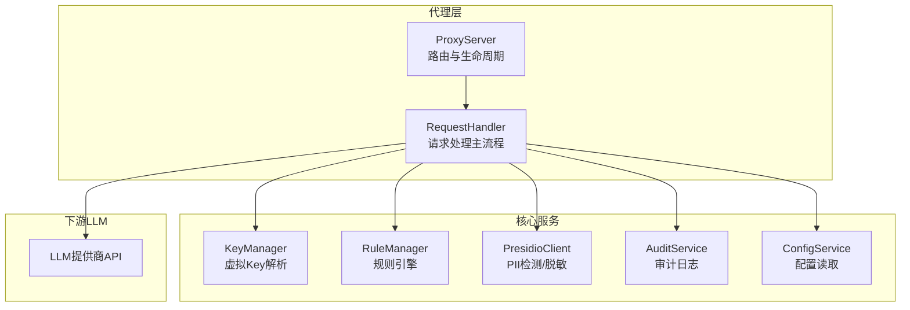
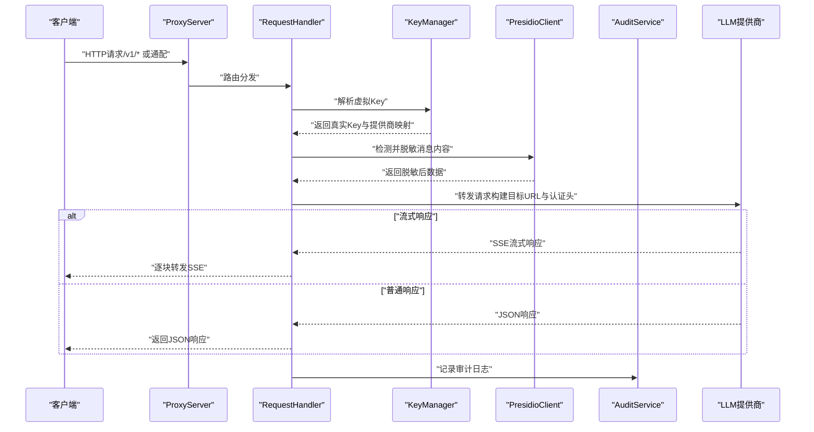
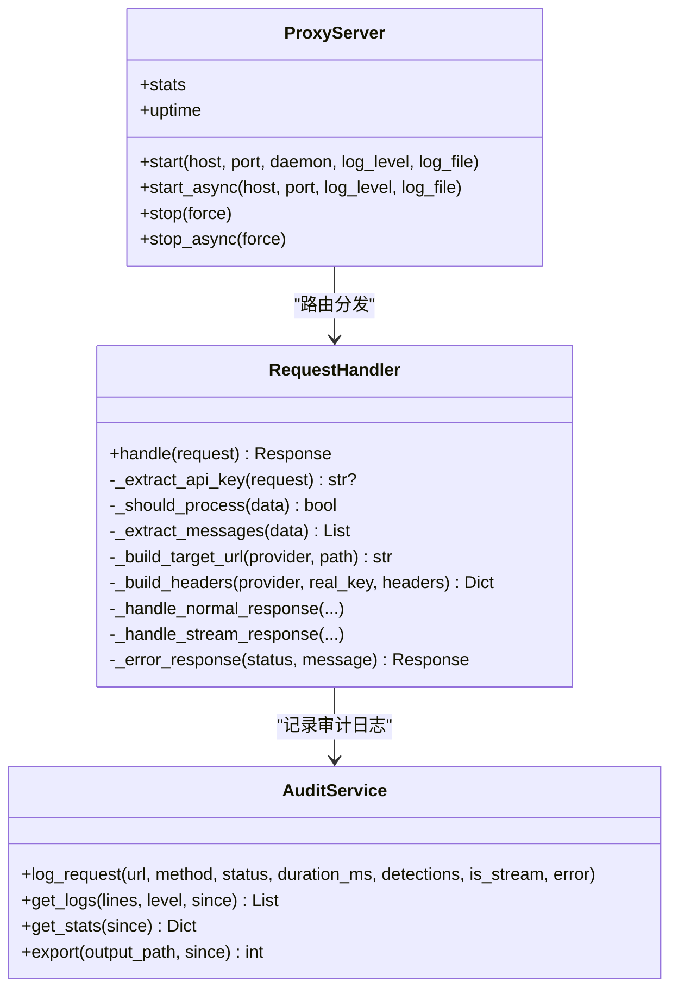

# HTTP代理服务

<cite>
**本文引用的文件**
- [设计文档](file://doc/design/design-update-20260404-v1.0-init.md)
- [代理服务测试用例](file://doc/test/tcs/v1.0/02_proxy_service.md)
- [代理服务测试数据](file://doc/test/tcs/v1.0/02_proxy_service_testdata.md)
- [键管理测试用例](file://doc/test/tcs/v1.0/03_key_management.md)
- [PII检测测试用例](file://doc/test/tcs/v1.0/04_pii_detection.md)
- [配置管理测试用例](file://doc/test/tcs/v1.0/07_configuration.md)
- [配置样例](file://doc/test/tcs/v1.0/test_data/config_sample.yaml)
- [提供商配置样例](file://doc/test/tcs/v1.0/test_data/providers_sample.yaml)
- [环境变量覆盖配置样例](file://doc/test/tcs/v1.0/test_data/config_env_override.yaml)
</cite>

## 目录
1. [简介](#简介)
2. [项目结构](#项目结构)
3. [核心组件](#核心组件)
4. [架构总览](#架构总览)
5. [详细组件分析](#详细组件分析)
6. [依赖关系分析](#依赖关系分析)
7. [性能考量](#性能考量)
8. [故障排除指南](#故障排除指南)
9. [结论](#结论)
10. [附录](#附录)

## 简介
本文件面向LLM Privacy Gateway的HTTP代理服务，系统化阐述其配置选项、启动与管理流程、支持的API端点、请求处理链路、与虚拟Key管理及PII检测的集成方式，并提供配置示例、性能优化建议与故障排除方法。文档内容基于仓库中的设计文档与测试用例，确保术语与实现一致。

## 项目结构
- 代理服务采用aiohttp框架实现，核心由代理服务器与请求处理器组成，负责接收外部请求、解析虚拟Key、执行PII检测与脱敏、转发至LLM提供商，并处理流式与非流式响应。
- 配置管理、规则引擎、审计服务与Presidio PII检测作为依赖注入组件参与请求处理。

图示来源
- [设计文档:570-741](file://doc/design/design-update-20260404-v1.0-init.md#L570-L741)
- [设计文档:743-1640](file://doc/design/design-update-20260404-v1.0-init.md#L743-L1640)

章节来源
- [设计文档:570-741](file://doc/design/design-update-20260404-v1.0-init.md#L570-L741)

## 核心组件
- 代理服务器（ProxyServer）
  - 负责路由注册、生命周期管理（启动/停止）、健康检查端点、统计信息维护。
  - 支持前台运行与后台守护模式。
- 请求处理器（RequestHandler）
  - 负责虚拟Key提取与解析、PII检测与脱敏、请求头构建、目标URL拼接、普通响应与流式响应处理、审计日志记录。
- 审计服务（AuditService）
  - 记录请求处理日志、提供日志查询与统计、支持导出。

章节来源
- [设计文档:570-741](file://doc/design/design-update-20260404-v1.0-init.md#L570-L741)
- [设计文档:743-1640](file://doc/design/design-update-20260404-v1.0-init.md#L743-L1640)

## 架构总览
代理服务的请求处理链路如下：

图示来源
- [设计文档:743-1640](file://doc/design/design-update-20260404-v1.0-init.md#L743-L1640)

## 详细组件分析

### 代理服务器（ProxyServer）
- 路由与端点
  - POST /v1/chat/completions
  - POST /v1/completions
  - POST /v1/embeddings
  - 通用通配路由（/{path:.*}）支持任意OpenAI兼容端点
  - GET /health 健康检查
- 生命周期
  - 异步启动/停止，支持前台常驻与后台守护模式
  - 维护进程ID、启动时间、运行时统计
- 统计指标
  - 总请求数、成功/失败数、平均延迟、PII检测计数等

章节来源
- [设计文档:570-741](file://doc/design/design-update-20260404-v1.0-init.md#L570-L741)
- [代理服务测试用例:776-800](file://doc/test/tcs/v1.0/02_proxy_service.md#L776-L800)

### 请求处理器（RequestHandler）
- 关键职责
  - 虚拟Key提取与解析（支持Authorization: Bearer与x-api-key）
  - PII检测与脱敏（仅对包含messages的请求）
  - 构建目标URL与认证头（依据提供商配置）
  - 普通响应与SSE流式响应处理
  - 审计日志记录（含PII检测结果）
- 错误处理
  - 缺失/无效Key返回401
  - JSON解析失败返回400
  - 其他异常返回500

章节来源
- [设计文档:743-1640](file://doc/design/design-update-20260404-v1.0-init.md#L743-L1640)
- [代理服务测试用例:515-683](file://doc/test/tcs/v1.0/02_proxy_service.md#L515-L683)

### 审计服务（AuditService）
- 日志结构
  - 时间戳、URL、方法、状态码、耗时、PII检测明细与数量、是否流式、错误信息
- 功能
  - 日志追加写入、查询（按行数、状态过滤）、统计（总数、成功率、平均耗时、PII类型分布）、导出

章节来源
- [设计文档:1441-1640](file://doc/design/design-update-20260404-v1.0-init.md#L1441-L1640)
- [代理服务测试用例:521-582](file://doc/test/tcs/v1.0/02_proxy_service.md#L521-L582)

### 虚拟Key管理集成
- Key解析流程
  - 从请求头提取虚拟Key → KeyManager解析 → 返回真实Key与提供商映射
- Key生命周期与权限
  - 支持创建、吊销、过期控制、使用统计与权限约束（端点白名单、模型限制等）
- 与代理服务的协作
  - RequestHandler使用解析结果构建下游请求头与目标URL

章节来源
- [键管理测试用例:128-202](file://doc/test/tcs/v1.0/03_key_management.md#L128-L202)

### PII检测与脱敏集成
- 触发条件
  - 请求包含messages字段时进行检测与脱敏
- 处理流程
  - PresidioClient.analyze检测实体 → PresidioClient.anonymize脱敏 → 更新请求内容
- 多语言与策略
  - 支持多语言文本、多种脱敏策略（mask、replace、hash、redact等）

章节来源
- [PII检测测试用例:42-206](file://doc/test/tcs/v1.0/04_pii_detection.md#L42-L206)

## 依赖关系分析

图示来源
- [设计文档:570-741](file://doc/design/design-update-20260404-v1.0-init.md#L570-L741)
- [设计文档:743-1640](file://doc/design/design-update-20260404-v1.0-init.md#L743-L1640)

## 性能考量
- 异步I/O与流式处理
  - 使用aiohttp与异步会话，支持SSE流式响应，降低内存占用与提升吞吐
- 超时与连接限制
  - 代理与提供商分别配置超时，避免请求堆积与资源泄露
- 并发与队列
  - 支持高并发请求，建议结合最大连接数与队列策略控制资源
- 统计与观测
  - 内置统计指标与审计日志，便于性能分析与瓶颈定位

章节来源
- [代理服务测试用例:686-773](file://doc/test/tcs/v1.0/02_proxy_service.md#L686-L773)
- [配置管理测试用例:375-403](file://doc/test/tcs/v1.0/07_configuration.md#L375-L403)

## 故障排除指南
- 常见错误与处理
  - 401 未授权：检查Authorization/x-api-key头与虚拟Key有效性
  - 400 请求体格式错误：检查JSON格式与必填字段
  - 502 网关错误：目标LLM服务不可达，检查网络与提供商配置
  - 504 网关超时：调整代理与提供商超时配置
- 健康检查
  - GET /health 返回{"status":"ok"}表示服务正常
- 审计日志
  - 通过审计服务查询最近日志与统计，定位异常请求与耗时热点

章节来源
- [代理服务测试用例:515-683](file://doc/test/tcs/v1.0/02_proxy_service.md#L515-L683)
- [设计文档:1441-1640](file://doc/design/design-update-20260404-v1.0-init.md#L1441-L1640)

## 结论
LLM Privacy Gateway的HTTP代理服务以模块化架构实现，具备完善的Key管理、PII检测与脱敏、审计日志与健康检查能力。通过OpenAI兼容的端点与流式响应支持，满足多样化的LLM接入需求。配合配置管理与测试用例，可实现稳定、可观测、可扩展的代理服务。

## 附录

### A. 支持的API端点与请求格式
- /v1/chat/completions
  - 方法：POST
  - 请求体：包含messages数组的标准OpenAI格式
  - 响应：标准OpenAI聊天补全响应
- /v1/completions
  - 方法：POST
  - 请求体：包含prompt的标准OpenAI格式
  - 响应：标准OpenAI补全响应
- /v1/embeddings
  - 方法：POST
  - 请求体：包含input与model
  - 响应：标准OpenAI嵌入响应
- 通用端点
  - 方法：GET/POST
  - 路径：/{path:.*}
  - 作用：转发到配置的提供商

章节来源
- [代理服务测试用例:253-342](file://doc/test/tcs/v1.0/02_proxy_service.md#L253-L342)
- [代理服务测试数据:47-105](file://doc/test/tcs/v1.0/02_proxy_service_testdata.md#L47-L105)

### B. 配置选项与示例
- 代理配置（proxy）
  - host：监听地址
  - port：监听端口
  - timeout：代理超时（秒）
  - max_connections：最大连接数
- 日志配置（log）
  - level：日志级别
  - file：日志文件路径
- 提供商配置（providers）
  - type：提供商类型（如openai、azure_openai、anthropic）
  - api_key：真实API Key
  - base_url：提供商基础URL
  - timeout：提供商超时（秒）
  - auth_type：认证方式（bearer/x-api-key等）
- 规则与审计
  - rules.enabled：是否启用规则
  - audit.enabled：是否启用审计
  - audit.log_file：审计日志文件路径

章节来源
- [配置样例:1-27](file://doc/test/tcs/v1.0/test_data/config_sample.yaml#L1-L27)
- [提供商配置样例:1-25](file://doc/test/tcs/v1.0/test_data/providers_sample.yaml#L1-L25)
- [配置管理测试用例:331-403](file://doc/test/tcs/v1.0/07_configuration.md#L331-L403)

### C. 启动与管理
- 默认启动
  - lpg proxy start
- 自定义端口/主机
  - lpg proxy start --port 9090 --host 192.168.1.100
- 后台模式
  - lpg proxy start --daemon
- 停止服务
  - lpg proxy stop（可选--force）
- 状态与健康检查
  - lpg status
  - curl http://localhost:8080/health

章节来源
- [代理服务测试用例:46-195](file://doc/test/tcs/v1.0/02_proxy_service.md#L46-L195)

### D. 与虚拟Key管理的集成
- Key创建与解析
  - lpg key create --provider <name> --name <key-name>
  - 通过Authorization: Bearer或x-api-key头携带虚拟Key
- 权限与过期
  - 支持端点白名单、模型限制、过期时间与吊销操作

章节来源
- [键管理测试用例:36-202](file://doc/test/tcs/v1.0/03_key_management.md#L36-L202)

### E. 与PII检测的集成
- 触发条件：请求包含messages字段
- 处理流程：Presidio检测→脱敏→更新请求内容
- 多语言与策略：支持多种实体类型与脱敏策略

章节来源
- [PII检测测试用例:42-206](file://doc/test/tcs/v1.0/04_pii_detection.md#L42-L206)