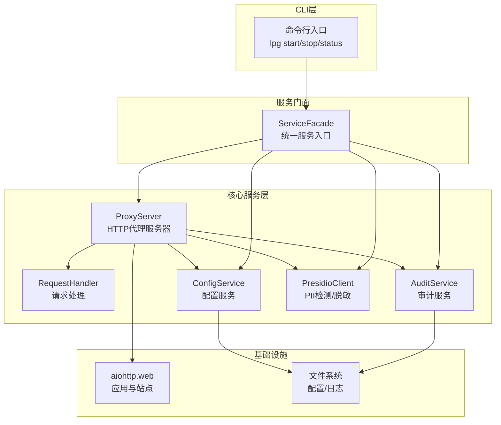
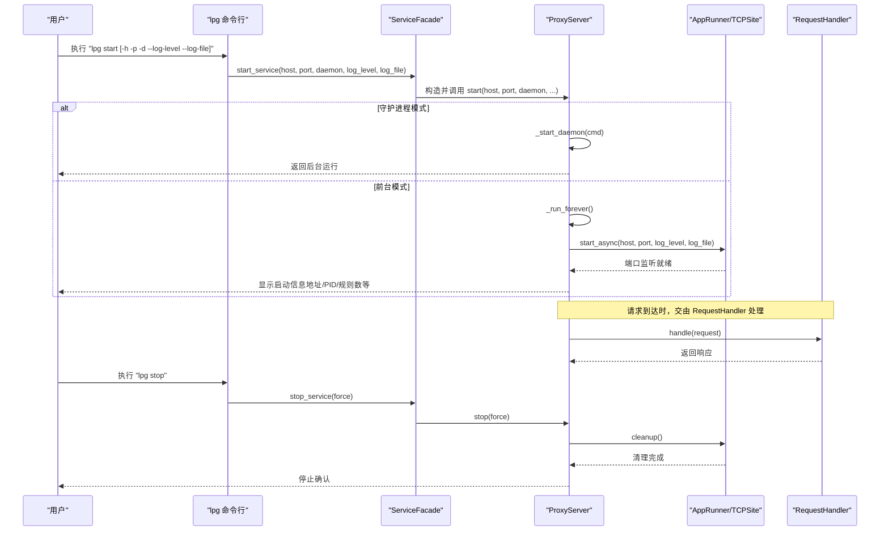
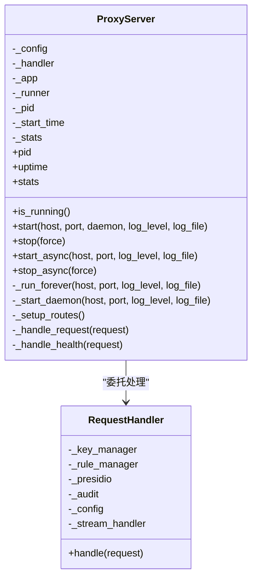
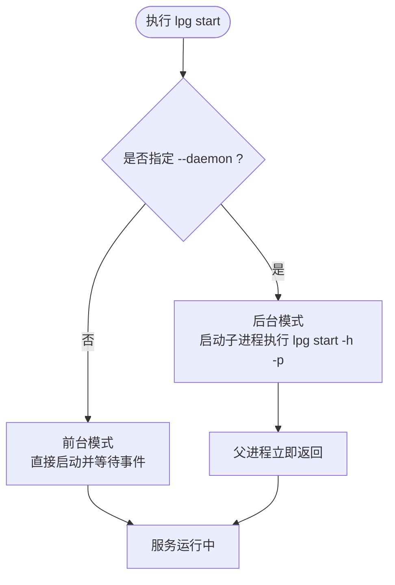
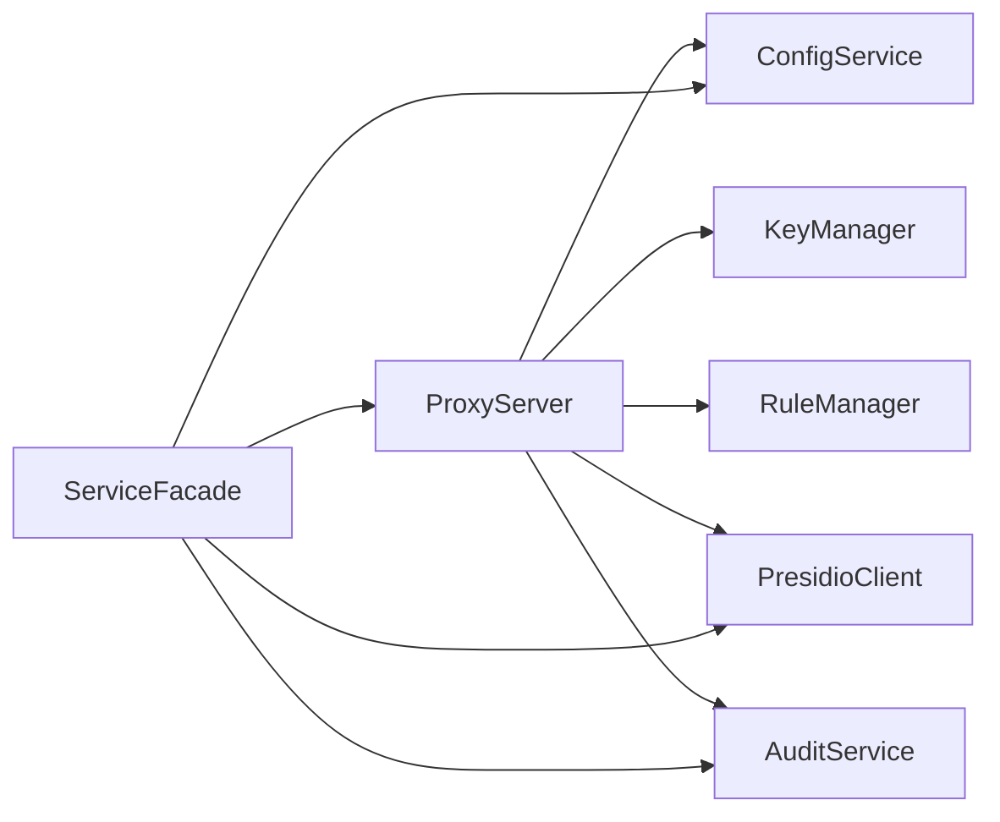

# 服务器管理

<cite>
**本文引用的文件**   
- [design-update-20260404-v1.0-init.md](file://doc/design/design-update-20260404-v1.0-init.md)
- [req-init-20260401.md](file://doc/req/req-init-20260401.md)
- [07_configuration.md](file://doc/test/tcs/v1.0/07_configuration.md)
- [01_cli_commands.md](file://doc/test/tcs/v1.0/01_cli_commands.md)
- [config_sample.yaml](file://doc/test/tcs/v1.0/test_data/config_sample.yaml)
- [config_env_override.yaml](file://doc/test/tcs/v1.0/test_data/config_env_override.yaml)
</cite>

## 目录
1. [简介](#简介)
2. [项目结构](#项目结构)
3. [核心组件](#核心组件)
4. [架构总览](#架构总览)
5. [详细组件分析](#详细组件分析)
6. [依赖分析](#依赖分析)
7. [性能考虑](#性能考虑)
8. [故障排查指南](#故障排查指南)
9. [结论](#结论)
10. [附录](#附录)

## 简介
本章节面向“LLM Privacy Gateway”的HTTP代理服务器管理，系统化阐述服务器的启动与停止流程、命令行参数配置（host、port、daemon模式、日志级别等）、生命周期管理（PID跟踪、运行时间统计、状态查询）、守护进程模式的实现原理与使用场景，并提供开发与生产环境的配置示例、监控指标与性能调优建议。文档严格依据仓库中的设计与测试用例，确保术语与行为一致。

## 项目结构
围绕服务器管理的关键文件与职责如下：
- 设计文档：定义了代理服务器类、路由、健康检查、生命周期管理与守护进程模式。
- 需求文档：给出CLI命令规范（start/stop/status），以及状态输出字段与日志级别等。
- 测试用例：覆盖启动/停止、状态查询、配置优先级、环境变量覆盖、守护进程模式等。
- 配置样例：提供默认配置与环境变量覆盖样例，便于理解配置项与优先级。

图表来源
- [design-update-20260404-v1.0-init.md](file://doc/design/design-update-20260404-v1.0-init.md)
- [req-init-20260401.md](file://doc/req/req-init-20260401.md)

章节来源
- [design-update-20260404-v1.0-init.md](file://doc/design/design-update-20260404-v1.0-init.md)
- [req-init-20260401.md](file://doc/req/req-init-20260401.md)

## 核心组件
- 代理服务器（ProxyServer）：负责监听端口、设置路由、处理请求、健康检查、生命周期管理（启动/停止）、PID与运行时间统计、请求统计与延迟聚合。
- 请求处理器（RequestHandler）：负责虚拟Key解析、提供商选择、PII检测与脱敏、请求转发、响应处理（含流式）、审计日志记录。
- 服务门面（ServiceFacade）：CLI与核心服务的统一入口，提供启动/停止/状态查询等能力。
- 配置服务（ConfigService）：提供配置读取、设置、持久化、环境变量覆盖、优先级策略等。
- 审计服务（AuditService）：提供日志读取、统计、导出等能力。
- Presidio客户端（PresidioClient）：与本地Presidio服务通信，执行PII检测与脱敏。

章节来源
- [design-update-20260404-v1.0-init.md](file://doc/design/design-update-20260404-v1.0-init.md)
- [req-init-20260401.md](file://doc/req/req-init-20260401.md)

## 架构总览
下图展示了服务器启动与停止的总体流程，以及关键组件之间的交互：

图表来源
- [design-update-20260404-v1.0-init.md](file://doc/design/design-update-20260404-v1.0-init.md)
- [req-init-20260401.md](file://doc/req/req-init-20260401.md)

## 详细组件分析

### 代理服务器（ProxyServer）
- 职责
  - 监听本地端口，接收API请求。
  - 设置路由（OpenAI兼容端点与通用转发端点）。
  - 委托RequestHandler处理请求。
  - 管理服务器生命周期（启动/停止/健康检查）。
  - 统计运行状态（PID、运行时间、请求总数、成功/失败数、PII检测数、总延迟）。
- 关键属性与方法
  - pid/uptime/stats：状态查询。
  - is_running：运行态判断。
  - start/stop：同步接口；start_async/stop_async：异步接口。
  - _run_forever/_start_daemon：前台持续运行与后台守护进程模式。
  - _setup_routes/_handle_request/_handle_health：路由与处理逻辑。
- 健康检查
  - /health返回状态、版本与运行时长。

图表来源
- [design-update-20260404-v1.0-init.md](file://doc/design/design-update-20260404-v1.0-init.md)

章节来源
- [design-update-20260404-v1.0-init.md](file://doc/design/design-update-20260404-v1.0-init.md)

### 服务门面（ServiceFacade）
- 统一入口，封装代理服务的启动/停止/状态查询，以及Key/规则/配置/提供商/日志等能力。
- 提供状态聚合：运行态、主机/端口、PID、运行时长、规则数、Key数、代理统计。

章节来源
- [design-update-20260401.md](file://doc/req/req-init-20260401.md)

### 命令行参数与启动流程
- lpg start
  - 参数：-p/--port、-h/--host、-d/--daemon、--log-level、--log-file。
  - 行为：检查是否已运行；若未运行则调用ServiceFacade启动；前台模式下持续运行，后台模式下以子进程方式启动。
- lpg stop
  - 行为：调用ServiceFacade停止代理服务。
- lpg status
  - 行为：输出运行状态、地址、PID、运行时间、统计信息、规则数、Key数等。

章节来源
- [req-init-20260401.md](file://doc/req/req-init-20260401.md)
- [01_cli_commands.md](file://doc/test/tcs/v1.0/01_cli_commands.md)

### 守护进程模式实现原理与使用场景
- 实现原理
  - 前台模式：直接启动并阻塞等待事件循环。
  - 后台模式：通过子进程启动自身（携带相同host/port等参数），父进程立即返回，实现“后台运行”。
- 使用场景
  - 需要长期运行且不占用终端会话。
  - 与系统服务管理器配合（如systemd）时，可先以守护进程方式启动，再由服务管理器接管。
- 注意事项
  - 后台模式下，启动失败不会阻塞终端，需通过日志或status命令确认状态。

图表来源
- [design-update-20260404-v1.0-init.md](file://doc/design/design-update-20260404-v1.0-init.md)
- [req-init-20260401.md](file://doc/req/req-init-20260401.md)

章节来源
- [design-update-20260404-v1.0-init.md](file://doc/design/design-update-20260404-v1.0-init.md)
- [01_cli_commands.md](file://doc/test/tcs/v1.0/01_cli_commands.md)

### 生命周期管理与状态查询
- PID跟踪：启动时记录当前进程PID。
- 运行时间统计：启动时记录开始时间，uptime属性计算当前运行时长。
- 状态查询：ServiceFacade.get_status聚合运行态、主机/端口、PID、运行时长、规则数、Key数、代理统计。
- 健康检查：/health端点返回状态、版本与uptime。

章节来源
- [design-update-20260404-v1.0-init.md](file://doc/design/design-update-20260404-v1.0-init.md)
- [req-init-20260401.md](file://doc/req/req-init-20260401.md)

### 配置与优先级（含环境变量）
- 配置项示例：proxy.host、proxy.port、proxy.timeout、log.level、log.file、providers.*、rules.*、audit.*。
- 优先级（高到低）：命令行参数 > 环境变量 > 配置文件。
- 环境变量覆盖：当环境变量与配置冲突时，以环境变量为准。
- 配置持久化：设置配置项后会自动保存到配置文件。

章节来源
- [07_configuration.md](file://doc/test/tcs/v1.0/07_configuration.md)
- [config_sample.yaml](file://doc/test/tcs/v1.0/test_data/config_sample.yaml)
- [config_env_override.yaml](file://doc/test/tcs/v1.0/test_data/config_env_override.yaml)

### 服务器监控指标与性能调优建议
- 监控指标
  - 运行状态：running、host、port、pid、uptime。
  - 代理统计：total_requests、success_requests、failed_requests、pii_detected、total_latency_ms。
  - 规则与Key：rules_count、keys_count。
- 性能调优建议
  - 并发与超时：根据负载调整max_connections与timeout；在配置中合理设置。
  - 日志级别：生产环境建议使用info或warn，减少IO开销；调试时使用debug。
  - 端口与绑定：仅绑定必要地址（如0.0.0.0需谨慎），避免不必要的暴露。
  - 守护进程：生产环境推荐守护进程模式，便于与系统服务管理器集成。
  - 健康检查：定期访问/health端点，结合外部监控系统告警。

章节来源
- [design-update-20260404-v1.0-init.md](file://doc/design/design-update-20260404-v1.0-init.md)
- [req-init-20260401.md](file://doc/req/req-init-20260401.md)

## 依赖分析
- 组件耦合
  - ProxyServer依赖ConfigService、KeyManager、RuleManager、PresidioClient、AuditService。
  - ServiceFacade聚合多个服务，屏蔽底层细节，便于扩展。
- 外部依赖
  - aiohttp用于HTTP服务；文件系统用于配置与日志；Presidio本地服务用于PII检测与脱敏。
- 配置与环境变量
  - 配置服务负责读取、设置、持久化与优先级合并。

图表来源
- [design-update-20260404-v1.0-init.md](file://doc/design/design-update-20260404-v1.0-init.md)

章节来源
- [design-update-20260404-v1.0-init.md](file://doc/design/design-update-20260404-v1.0-init.md)

## 性能考虑
- 启动与停止
  - 前台模式适合开发调试，后台模式适合生产长期运行。
  - 停止时清理AppRunner，避免资源泄漏。
- 日志与IO
  - 生产环境降低日志级别，避免频繁磁盘IO。
- 路由与处理
  - 仅启用必要的端点，减少路由开销。
  - 对流式响应（如SSE）进行高效处理，避免阻塞主线程。

[本节为通用指导，无需引用具体文件]

## 故障排查指南
- 启动失败（端口被占用）
  - 现象：启动时报错提示端口被占用。
  - 处理：更换端口或释放占用端口后重试。
- 启动失败（配置文件不存在）
  - 现象：提示配置文件不存在。
  - 处理：使用lpg config init初始化配置，或指定有效配置路径。
- 停止失败（服务未运行）
  - 现象：提示服务未在运行。
  - 处理：先确认服务状态，再执行停止命令。
- 后台模式无输出
  - 现象：执行--daemon后终端立即返回。
  - 处理：通过lpg status查看状态，或检查日志文件。

章节来源
- [01_cli_commands.md](file://doc/test/tcs/v1.0/01_cli_commands.md)

## 结论
本文基于仓库的设计与测试用例，系统梳理了LLM Privacy Gateway代理服务器的启动/停止流程、命令行参数、生命周期管理、守护进程模式、配置优先级与监控指标，并提供了开发与生产的最佳实践建议。遵循本文档的配置与运维策略，可在保证安全与合规的前提下，获得稳定可靠的代理服务。

[本节为总结，无需引用具体文件]

## 附录

### A. 命令行参数与示例
- lpg start
  - 选项：-p/--port、-h/--host、-d/--daemon、--log-level、--log-file。
  - 示例：后台运行在端口9000、调试模式启动。
- lpg stop
  - 选项：-f/--force。
- lpg status
  - 选项：-j/--json、-w/--watch。
  - 输出：运行状态、Uptime、Port、PID、统计信息、规则数、Key数等。

章节来源
- [req-init-20260401.md](file://doc/req/req-init-20260401.md)

### B. 配置示例（开发与生产）
- 开发环境
  - 默认监听127.0.0.1:8080，日志级别info，规则与Key按需加载。
- 生产环境
  - 绑定0.0.0.0或内网地址，设置合适端口与超时；启用守护进程；日志级别warn或error；开启审计日志；定期检查/health端点。

章节来源
- [config_sample.yaml](file://doc/test/tcs/v1.0/test_data/config_sample.yaml)
- [config_env_override.yaml](file://doc/test/tcs/v1.0/test_data/config_env_override.yaml)
- [07_configuration.md](file://doc/test/tcs/v1.0/07_configuration.md)