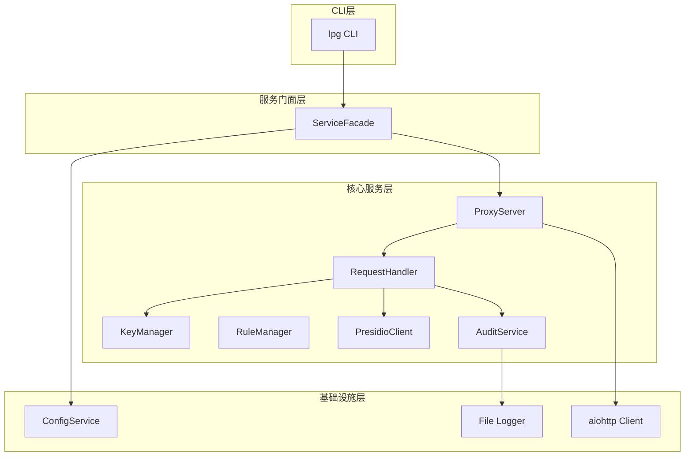
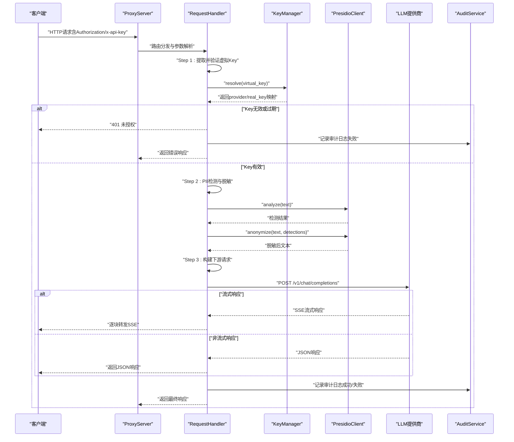
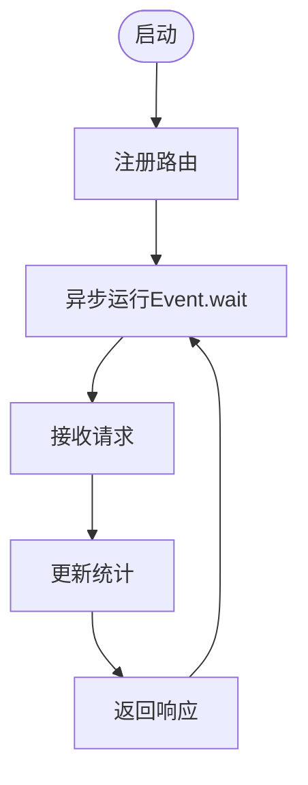
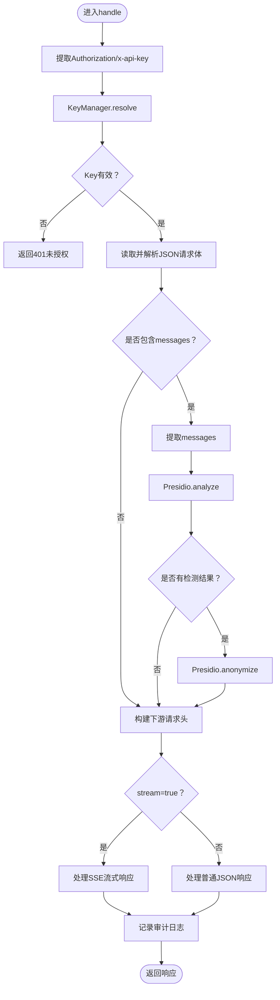
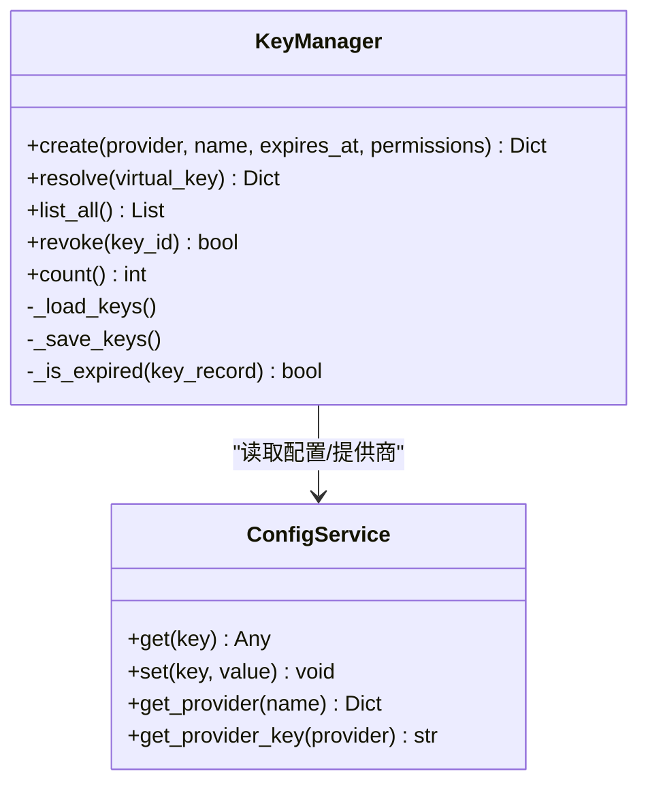
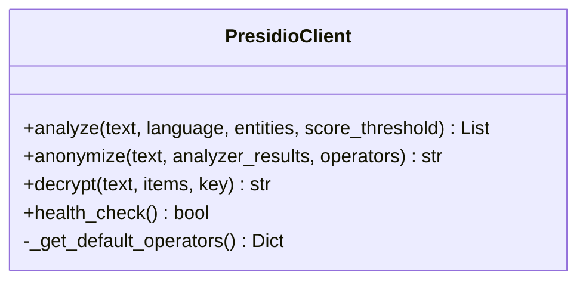
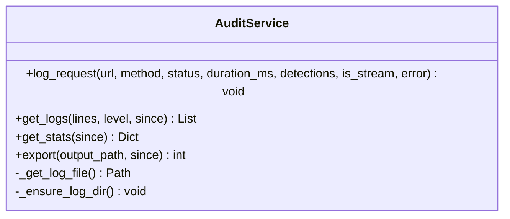
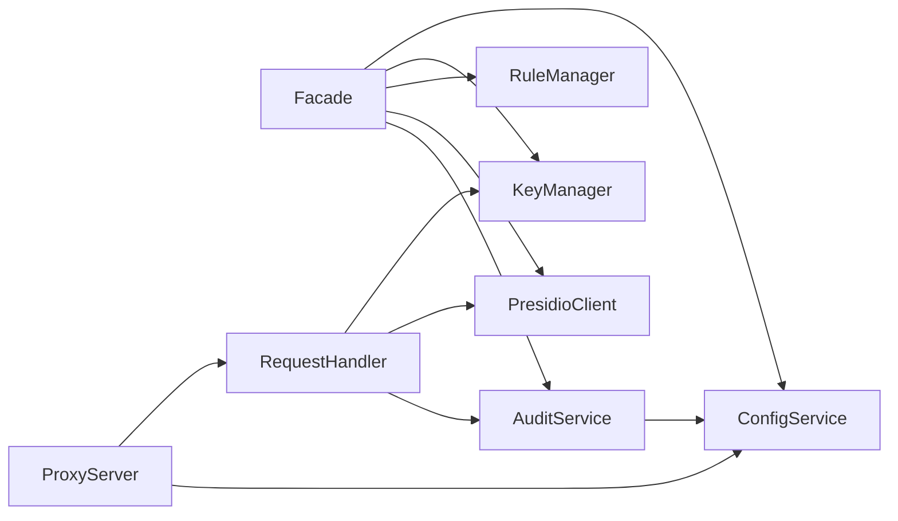

# 请求处理流程

<cite>
**本文档引用的文件**
- [设计文档](file://doc/design/design-update-20260404-v1.0-init.md)
- [代理服务测试用例](file://doc/test/tcs/v1.0/02_proxy_service.md)
- [代理服务测试数据](file://doc/test/tcs/v1.0/02_proxy_service_testdata.md)
- [Key管理测试用例](file://doc/test/tcs/v1.0/03_key_management.md)
- [Key管理测试数据](file://doc/test/tcs/v1.0/03_key_management_testdata.md)
- [PII检测测试用例](file://doc/test/tcs/v1.0/04_pii_detection.md)
- [PII检测测试数据](file://doc/test/tcs/v1.0/04_pii_detection_testdata.md)
- [审计日志测试用例](file://doc/test/tcs/v1.0/06_audit_logging.md)
- [编码规范](file://AGENTS.md)
</cite>

## 目录
1. [简介](#简介)
2. [项目结构](#项目结构)
3. [核心组件](#核心组件)
4. [架构概览](#架构概览)
5. [详细组件分析](#详细组件分析)
6. [依赖关系分析](#依赖关系分析)
7. [性能考量](#性能考量)
8. [故障排查指南](#故障排查指南)
9. [结论](#结论)
10. [附录](#附录)

## 简介
本文件面向LLM Privacy Gateway的HTTP代理请求处理流程，系统性阐述从接收外部请求到返回响应的完整处理链路。重点覆盖以下环节：
- 虚拟Key验证与解析
- PII检测与脱敏处理
- 请求转发至下游LLM提供商
- 响应处理与流式响应支持
- 审计日志记录
- 异步处理机制与并发控制策略
- 错误处理与异常恢复机制
- 性能指标与监控方法
- 常见问题诊断与解决方案

## 项目结构
LLM Privacy Gateway采用模块化设计，核心由CLI层、服务门面层、核心服务层与基础设施层组成。代理服务位于核心服务层，负责HTTP代理、请求处理、PII检测与脱敏、审计日志等关键功能。

**图示来源**
- [设计文档:70-122](file://doc/design/design-update-20260404-v1.0-init.md#L70-L122)

**章节来源**
- [设计文档:70-122](file://doc/design/design-update-20260404-v1.0-init.md#L70-L122)

## 核心组件
- 代理服务器（ProxyServer）：基于aiohttp的异步HTTP服务器，负责路由注册、请求接收与统计。
- 请求处理器（RequestHandler）：实现完整的请求处理流水线，包括Key验证、PII检测与脱敏、请求转发、响应处理与审计日志。
- Key管理器（KeyManager）：虚拟Key生成、解析、生命周期管理与权限控制。
- Presidio客户端（PresidioClient）：封装PII检测与脱敏的HTTP客户端，支持分析器与匿名化器。
- 审计服务（AuditService）：记录请求处理日志、提供查询与统计、支持导出与清理。
- 配置服务（ConfigService）：提供配置读取与提供商信息管理。

**章节来源**
- [设计文档:570-741](file://doc/design/design-update-20260404-v1.0-init.md#L570-L741)
- [设计文档:743-944](file://doc/design/design-update-20260404-v1.0-init.md#L743-L944)
- [设计文档:1115-1275](file://doc/design/design-update-20260404-v1.0-init.md#L1115-L1275)
- [设计文档:946-1113](file://doc/design/design-update-20260404-v1.0-init.md#L946-L1113)
- [设计文档:1441-1599](file://doc/design/design-update-20260404-v1.0-init.md#L1441-L1599)

## 架构概览
代理服务采用异步非阻塞I/O模型，结合依赖注入与服务门面，确保模块解耦与可扩展性。请求处理流程如下：

**图示来源**
- [设计文档:800-944](file://doc/design/design-update-20260404-v1.0-init.md#L800-L944)

**章节来源**
- [设计文档:164-250](file://doc/design/design-update-20260404-v1.0-init.md#L164-L250)

## 详细组件分析

### 代理服务器（ProxyServer）
- 职责：启动/停止HTTP服务器、注册路由、统计请求指标、健康检查端点。
- 异步启动：使用AppRunner与TCPSite异步启动，支持守护进程模式。
- 路由：支持/v1/chat/completions、/v1/completions、/v1/embeddings等端点，以及/{path:.*}通用端点。
- 统计：维护总请求数、成功/失败数、PII检测数、总延迟等指标。

**图示来源**
- [设计文档:570-741](file://doc/design/design-update-20260404-v1.0-init.md#L570-L741)

**章节来源**
- [设计文档:570-741](file://doc/design/design-update-20260404-v1.0-init.md#L570-L741)

### 请求处理器（RequestHandler）
- 职责：实现完整的请求处理流水线，包括Key验证、PII检测与脱敏、请求转发、响应处理与审计日志。
- Key验证：从Authorization头或x-api-key中提取虚拟Key，调用KeyManager解析映射。
- PII处理：提取messages内容，调用PresidioClient.analyze进行检测，再调用anonymize进行脱敏。
- 请求转发：根据Provider配置构建目标URL与认证头，使用aiohttp ClientSession转发请求。
- 响应处理：支持普通JSON响应与SSE流式响应，流式响应逐块转发。
- 审计日志：记录URL、方法、状态码、耗时、检测结果等。

**图示来源**
- [设计文档:743-944](file://doc/design/design-update-20260404-v1.0-init.md#L743-L944)

**章节来源**
- [设计文档:743-944](file://doc/design/design-update-20260404-v1.0-init.md#L743-L944)

### Key管理器（KeyManager）
- 虚拟Key生成：使用安全随机数生成随机部分，拼接前缀形成虚拟Key，计算ID摘要。
- Key解析：遍历已加载的Key配置，匹配virtual_key，检查过期时间，获取真实Provider Key。
- 生命周期：支持吊销、统计使用次数与最后使用时间。
- 存储：配置文件持久化，支持动态加载与保存。

**图示来源**
- [设计文档:1115-1275](file://doc/design/design-update-20260404-v1.0-init.md#L1115-L1275)

**章节来源**
- [设计文档:1115-1275](file://doc/design/design-update-20260404-v1.0-init.md#L1115-L1275)

### Presidio客户端（PresidioClient）
- analyze：调用Analyzer服务检测PII，支持语言、实体类型过滤与置信度阈值。
- anonymize：调用Anonymizer服务进行脱敏，支持默认与自定义脱敏策略。
- decrypt：用于响应处理的解密还原（设计文档中提及）。
- 健康检查：检查Analyzer/Anonymizer服务可用性。

**图示来源**
- [设计文档:946-1113](file://doc/design/design-update-20260404-v1.0-init.md#L946-L1113)

**章节来源**
- [设计文档:946-1113](file://doc/design/design-update-20260404-v1.0-init.md#L946-L1113)

### 审计服务（AuditService）
- 日志记录：记录请求URL、方法、状态码、耗时、PII检测结果、是否流式等。
- 查询统计：支持按时间范围、日志级别、关键词过滤，提供统计信息（总数、成功率、平均延迟、PII类型分布）。
- 导出清理：支持导出JSON日志、按时间范围清理、文件轮转。

**图示来源**
- [设计文档:1441-1599](file://doc/design/design-update-20260404-v1.0-init.md#L1441-L1599)

**章节来源**
- [设计文档:1441-1599](file://doc/design/design-update-20260404-v1.0-init.md#L1441-L1599)

## 依赖关系分析
- 依赖注入：ServiceFacade统一注入ConfigService、KeyManager、RuleManager、PresidioClient、AuditService，降低模块耦合。
- 组件耦合：RequestHandler依赖KeyManager、PresidioClient、AuditService；ProxyServer依赖RequestHandler；各服务依赖ConfigService。
- 外部依赖：aiohttp用于HTTP客户端与服务器；Presidio服务提供PII检测与脱敏；文件系统用于审计日志存储。

**图示来源**
- [设计文档:411-568](file://doc/design/design-update-20260404-v1.0-init.md#L411-L568)

**章节来源**
- [设计文档:411-568](file://doc/design/design-update-20260404-v1.0-init.md#L411-L568)

## 性能考量
- 异步I/O：全程使用aiohttp异步客户端与服务器，避免阻塞调用，提升并发处理能力。
- 流式响应：SSE流式响应逐块转发，减少内存占用，提升大响应处理效率。
- 超时配置：支持请求超时、连接超时与读取超时，防止资源泄露。
- 统计指标：维护总请求数、成功/失败数、PII检测数、总延迟等，便于性能监控与优化。
- 并发控制：通过异步事件循环与连接池管理，避免阻塞与资源竞争。

**章节来源**
- [设计文档:570-741](file://doc/design/design-update-20260404-v1.0-init.md#L570-L741)
- [代理服务测试用例:686-773](file://doc/test/tcs/v1.0/02_proxy_service.md#L686-L773)

## 故障排查指南
- 401未授权：检查Authorization/x-api-key是否正确，确认虚拟Key是否有效、未过期、未吊销。
- 400请求错误：检查请求体JSON格式是否正确，字段是否完整。
- 502/504网关错误：检查下游LLM提供商可达性与超时配置，确认网络与防火墙设置。
- PII检测异常：检查Presidio服务状态与健康检查，确认语言配置与实体类型过滤。
- 审计日志异常：检查日志文件路径与权限，确认磁盘空间与轮转策略。

**章节来源**
- [代理服务测试用例:515-630](file://doc/test/tcs/v1.0/02_proxy_service.md#L515-L630)
- [代理服务测试用例:686-773](file://doc/test/tcs/v1.0/02_proxy_service.md#L686-L773)
- [审计日志测试用例:288-327](file://doc/test/tcs/v1.0/06_audit_logging.md#L288-L327)

## 结论
LLM Privacy Gateway的HTTP代理请求处理流程通过异步非阻塞I/O与模块化设计，实现了从虚拟Key验证、PII检测与脱敏、请求转发到响应处理与审计日志的完整闭环。该架构具备良好的可扩展性与可维护性，能够满足生产环境对性能与可靠性的要求。

## 附录

### 请求处理流程要点
- 虚拟Key验证：支持Bearer与x-api-key两种头部格式，解析失败直接返回401。
- PII检测：仅对包含messages的请求进行检测与脱敏，支持多种实体类型与脱敏策略。
- 请求转发：根据Provider配置构建目标URL与认证头，支持多种认证类型。
- 响应处理：支持普通JSON与SSE流式响应，逐块转发保证低延迟。
- 审计日志：记录关键指标与错误信息，支持查询、统计与导出。

**章节来源**
- [设计文档:743-944](file://doc/design/design-update-20260404-v1.0-init.md#L743-L944)
- [代理服务测试用例:253-422](file://doc/test/tcs/v1.0/02_proxy_service.md#L253-L422)
- [PII检测测试用例:594-638](file://doc/test/tcs/v1.0/04_pii_detection.md#L594-L638)