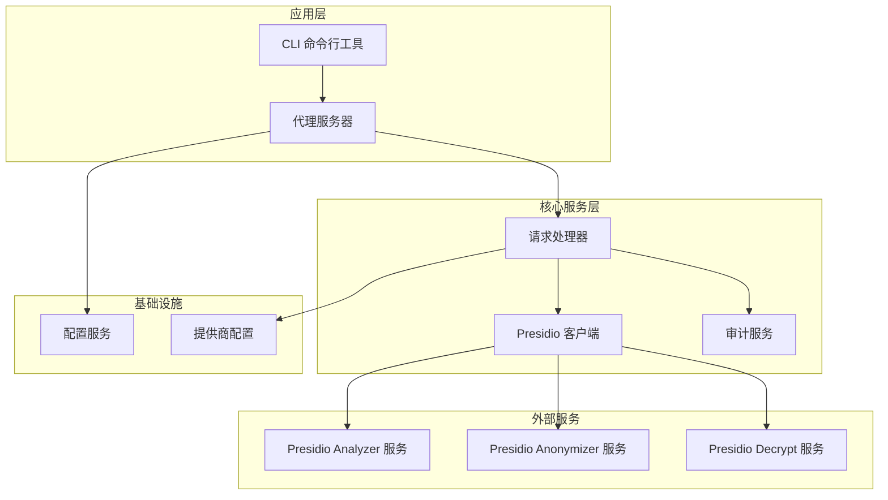
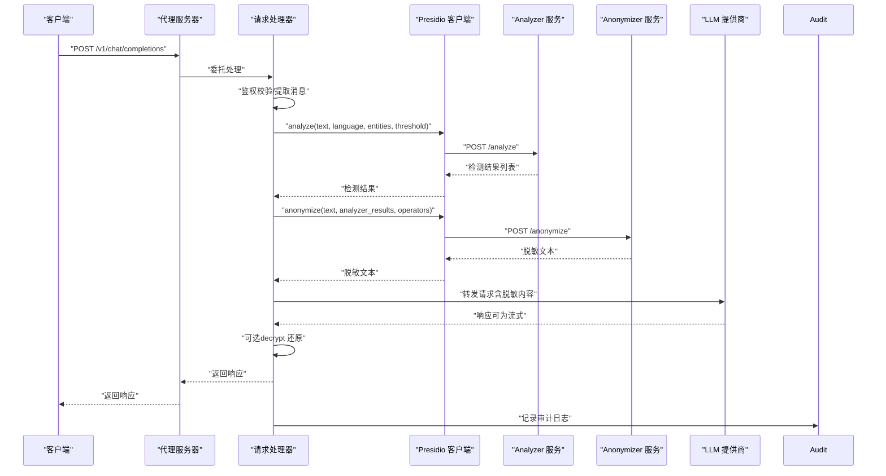
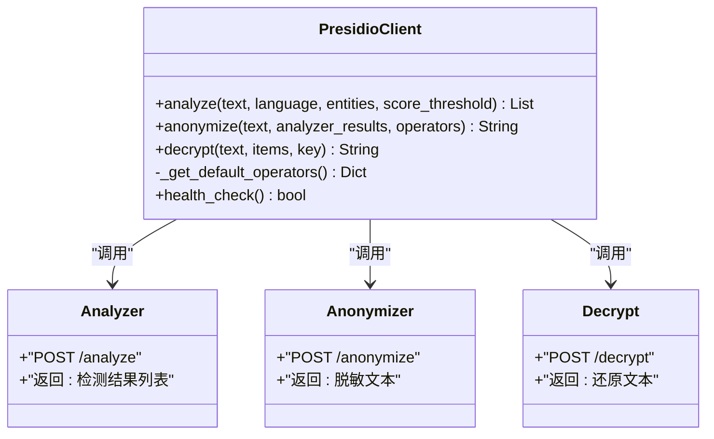
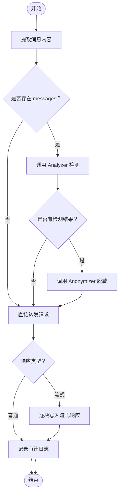
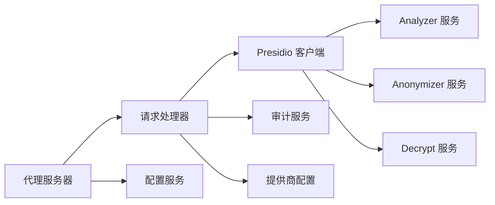

# PII检测与脱敏

<cite>
**本文引用的文件**   
- [设计文档](file://doc/design/design-update-20260404-v1.0-init.md)
- [PII检测测试用例](file://doc/test/tcs/v1.0/04_pii_detection.md)
- [配置示例](file://doc/test/tcs/v1.0/test_data/config_sample.yaml)
- [环境变量覆盖配置示例](file://doc/test/tcs/v1.0/test_data/config_env_override.yaml)
- [审计日志测试数据](file://doc/test/tcs/v1.0/06_audit_logging_testdata.md)
</cite>

## 目录
1. [简介](#简介)
2. [项目结构](#项目结构)
3. [核心组件](#核心组件)
4. [架构总览](#架构总览)
5. [详细组件分析](#详细组件分析)
6. [依赖关系分析](#依赖关系分析)
7. [性能考量](#性能考量)
8. [故障排除指南](#故障排除指南)
9. [结论](#结论)
10. [附录](#附录)

## 简介
本文件围绕 LLM Privacy Gateway 的 PII 检测与脱敏能力，基于仓库中的设计文档与测试用例，系统化阐述 Presidio 集成的实现细节、检测规则与脱敏策略、置信度阈值配置、数据还原与安全性考量，并提供自定义检测规则的开发指南与最佳实践。文档同时给出常见检测与脱敏场景的实操指引，兼顾不同技术背景读者的理解需求。

## 项目结构
- 设计文档：定义了 v1.0 的整体架构、模块职责、请求处理流程以及 Presidio 集成点（Analyzer/Anonymizer/Decrypt）。
- 测试用例：覆盖 PII 检测与脱敏的黑盒测试场景，包括多实体类型、多语言、边界情况、Presidio 服务连通性与超时处理、请求/响应处理等。
- 配置示例：提供代理、日志、提供商、规则等配置样例，支撑 Presidio 服务的端点、语言、超时等参数配置。
- 审计日志测试数据：提供 PII 检测结果、脱敏操作、日志字段等测试数据，便于理解审计记录结构与字段语义。

**图表来源**
- [设计文档:70-122](file://doc/design/design-update-20260404-v1.0-init.md#L70-L122)
- [设计文档:570-741](file://doc/design/design-update-20260404-v1.0-init.md#L570-L741)
- [设计文档:946-1113](file://doc/design/design/design-update-20260404-v1.0-init.md#L946-L1113)

**章节来源**
- [设计文档:70-122](file://doc/design/design-update-20260404-v1.0-init.md#L70-L122)
- [设计文档:570-741](file://doc/design/design-update-20260404-v1.0-init.md#L570-L741)
- [设计文档:946-1113](file://doc/design/design_update_20260404_v1.0_init.md#L946-L1113)

## 核心组件
- 代理服务器：负责接收外部请求、转发至 LLM 提供商，并在请求/响应阶段执行 PII 检测与脱敏。
- 请求处理器：实现鉴权校验、消息提取、调用 Presidio Analyzer/Anonymizer、构建下游请求、处理流式响应、记录审计日志。
- Presidio 客户端：封装对 Analyzer、Anonymizer、Decrypt 的 HTTP 调用，提供默认脱敏策略与超时控制。
- 审计服务：记录请求处理日志，包含 PII 检测结果、脱敏动作、耗时、状态等关键字段。
- 配置服务：提供代理、日志、提供商、规则等配置项，支持环境变量覆盖。

**章节来源**
- [设计文档:570-741](file://doc/design/design_update_20260404_v1.0_init.md#L570-L741)
- [设计文档:946-1113](file://doc/design/design_update_20260404_v1.0_init.md#L946-L1113)
- [设计文档:1441-1599](file://doc/design/design_update_20260404_v1.0_init.md#L1441-L1599)

## 架构总览
下图展示了请求从进入代理到完成处理的完整流程，重点标注了 PII 检测与脱敏的关键节点。

**图表来源**
- [设计文档:800-944](file://doc/design/design_update_20260404_v1.0_init.md#L800-L944)
- [设计文档:946-1113](file://doc/design/design_update_20260404_v1.0_init.md#L946-L1113)

**章节来源**
- [设计文档:800-944](file://doc/design/design_update_20260404_v1.0_init.md#L800-L944)
- [设计文档:946-1113](file://doc/design/design_update_20260404_v1.0_init.md#L946-L1113)

## 详细组件分析

### Presidio 集成：Analyzer 与 Anonymizer 工作原理
- Analyzer 调用
  - 功能：对文本进行 PII 检测，返回实体类型、起止位置与置信度分数。
  - 关键参数：text、language、entities（可选）、score_threshold（默认 0.5）。
  - 返回：实体列表，包含 entity_type、start、end、score。
- Anonymizer 调用
  - 功能：根据 Analyzer 结果对文本进行脱敏，支持多种脱敏策略。
  - 关键参数：text、analyzer_results、operators（可自定义覆盖默认策略）。
  - 返回：脱敏后的文本。
- 默认脱敏策略
  - 针对 EMAIL_ADDRESS、PHONE_NUMBER、CREDIT_CARD、PERSON、LOCATION、IP_ADDRESS、URL 等实体类型提供默认脱敏规则。
  - 支持中国特定实体类型（如 CN_PHONE_NUMBER、CN_ID_CARD、CN_BANK_CARD）的默认策略。
- Decrypt 调用
  - 功能：在响应处理阶段，可对脱敏文本进行解密还原（用于审计或调试目的）。
  - 关键参数：text、items（脱敏项列表）、key（解密密钥）。

**图表来源**
- [设计文档:946-1113](file://doc/design/design_update_20260404_v1.0_init.md#L946-L1113)

**章节来源**
- [设计文档:946-1113](file://doc/design/design_update_20260404_v1.0_init.md#L946-L1113)

### 检测规则配置与实体类型
- 支持的实体类型（示例）
  - EMAIL_ADDRESS、PHONE_NUMBER、CREDIT_CARD、PERSON、LOCATION、IP_ADDRESS、URL
  - 中国特定实体：CN_PHONE_NUMBER、CN_ID_CARD、CN_BANK_CARD
- 置信度阈值
  - analyze 接口支持 score_threshold，默认 0.5；可通过配置调整以平衡召回与精度。
- 实体类型过滤
  - analyze 接口支持 entities 参数，仅检测指定类型，减少误报与提升性能。

**章节来源**
- [设计文档:972-1010](file://doc/design/design_update_20260404_v1.0_init.md#L972-L1010)

### 脱敏策略与操作符
- 默认策略（示例）
  - DEFAULT：替换为占位符
  - EMAIL_ADDRESS：mask 策略（部分遮盖）
  - PHONE_NUMBER：replace 策略（替换为占位符）
  - CREDIT_CARD：mask 策略（部分遮盖）
  - PERSON/LOCATION/IP_ADDRESS/URL：replace 策略
  - 中国特定实体：CN_* 类型采用 replace 策略
- 自定义脱敏策略
  - 通过 operators 参数传入自定义规则，覆盖默认策略。
  - 支持的操作类型：replace、mask、hash、redact 等（依据 Presidio 支持情况）。

**章节来源**
- [设计文档:1085-1103](file://doc/design/design_update_20260404_v1.0_init.md#L1085-L1103)

### 多语言支持与边界情况
- 多语言
  - analyze 接口支持 language 参数，默认使用配置项；测试用例覆盖中文、英文、混合语言与日文场景。
- 边界情况
  - 空文本、超长文本、无 PII 文本、特殊字符与 Unicode、异常字符包围的 PII 等均有测试覆盖。

**章节来源**
- [PII检测测试用例:408-544](file://doc/test/tcs/v1.0/04_pii_detection.md#L408-L544)

### 请求/响应处理与流式响应
- 请求处理
  - 仅对包含 messages 的请求进行 PII 检测与脱敏；提取 content 字段，调用 Presidio.analyze 与 Presidio.anonymize。
- 响应处理
  - 普通响应：直接转发上游响应并记录审计日志。
  - 流式响应（SSE）：逐块转发响应流，结束后记录审计日志。
- 数据还原
  - 可调用 Presidio.decrypt 对脱敏文本进行还原（用于审计或调试），需提供 items 与 key。

**图表来源**
- [设计文档:800-944](file://doc/design/design_update_20260404_v1.0_init.md#L800-L944)

**章节来源**
- [设计文档:800-944](file://doc/design/design_update_20260404_v1.0_init.md#L800-L944)

### 审计日志与数据还原
- 审计记录字段
  - 包含时间戳、URL、方法、状态码、耗时、PII 检测结果、脱敏动作、原始/脱敏文本长度等。
- 数据还原
  - 通过 decrypt 接口，结合 items 与 key 还原脱敏文本，便于审计与合规审查。

**章节来源**
- [设计文档:1441-1599](file://doc/design/design_update_20260404_v1.0_init.md#L1441-L1599)
- [设计文档:1051-1083](file://doc/design/design_update_20260404_v1.0_init.md#L1051-L1083)
- [审计日志测试数据:165-493](file://doc/test/tcs/v1.0/06_audit_logging_testdata.md#L165-L493)

## 依赖关系分析
- 组件耦合
  - 代理服务器与请求处理器通过依赖注入组合 Presidio 客户端、审计服务、配置服务与提供商配置。
  - Presidio 客户端独立封装外部服务调用，降低对外部服务变更的耦合。
- 外部依赖
  - Presidio Analyzer/Anonymizer/Decrypt 服务端点、超时与健康检查由配置控制。
- 配置驱动
  - 代理、日志、提供商、规则等配置通过配置服务集中管理，支持环境变量覆盖。

**图表来源**
- [设计文档:570-741](file://doc/design/design_update_20260404_v1.0_init.md#L570-L741)
- [设计文档:946-1113](file://doc/design/design_update_20260404_v1.0_init.md#L946-L1113)

**章节来源**
- [设计文档:570-741](file://doc/design/design_update_20260404_v1.0_init.md#L570-L741)
- [设计文档:946-1113](file://doc/design/design_update_20260404_v1.0_init.md#L946-L1113)

## 性能考量
- 预算外部服务调用
  - Presidio 客户端默认超时为 30 秒，建议根据网络与服务性能在配置中调整。
- 降低检测开销
  - 使用 entities 参数仅检测必要实体类型；提高 score_threshold 以减少误报与后续处理成本。
- 流式响应优化
  - 流式响应按块转发，避免一次性缓冲大响应体，降低内存峰值。
- 日志与审计
  - 审计日志采用 JSONL 格式，建议在高吞吐场景下合理设置日志级别与轮转策略。

[本节为通用指导，无需引用具体文件]

## 故障排除指南
- Presidio 服务不可达或超时
  - 现象：调用 Analyzer/Anonymizer/Decrypt 抛出异常或返回空结果。
  - 排查：检查 presidio.endpoint、presidio.language、presidio.timeout 配置；使用 health_check 验证服务状态。
- 脱敏策略不符合预期
  - 现象：脱敏结果与期望不符。
  - 排查：核对 operators 配置；确认 entities 与 score_threshold 设置；检查默认策略覆盖逻辑。
- 多语言识别异常
  - 现象：中文/英文/日文等识别效果不佳。
  - 排查：确认 language 配置与 Presidio 版本支持情况；必要时调整实体类型集合。
- 审计日志缺失或格式异常
  - 现象：日志文件为空或无法解析。
  - 排查：检查 audit.log_file 路径与权限；确认日志格式与字段完整性。

**章节来源**
- [设计文档:1105-1113](file://doc/design/design_update_20260404_v1.0_init.md#L1105-L1113)
- [PII检测测试用例:547-591](file://doc/test/tcs/v1.0/04_pii_detection.md#L547-L591)
- [审计日志测试数据:634-768](file://doc/test/tcs/v1.0/06_audit_logging_testdata.md#L634-L768)

## 结论
LLM Privacy Gateway 通过清晰的模块划分与配置驱动的设计，实现了与 Presidio 的深度集成，覆盖多实体类型、多语言、边界情况与流式响应等关键场景。默认脱敏策略与可配置 operators 提供了灵活的安全处理能力；审计日志与数据还原机制满足合规与审计需求。建议在生产环境中结合业务场景优化实体类型集合、置信度阈值与超时配置，并建立完善的监控与告警体系。

[本节为总结性内容，无需引用具体文件]

## 附录

### 常见检测与脱敏场景示例（基于测试用例）
- 邮箱地址检测与 mask 脱敏
  - 场景：包含多个邮箱地址的混合文本。
  - 预期：检测到 EMAIL_ADDRESS 实体并按 mask 策略进行部分遮盖。
- 中国手机号检测与 replace 脱敏
  - 场景：包含中国手机号的文本。
  - 预期：检测到 PHONE_NUMBER 实体并替换为占位符。
- 国际手机号检测与 mask 脱敏
  - 场景：包含国际格式手机号的文本。
  - 预期：检测到 PHONE_NUMBER 实体并按 mask 策略进行部分遮盖。
- 中国身份证号检测与 replace 脱敏
  - 场景：包含身份证号的文本。
  - 预期：检测到 CN_ID_CARD 实体并替换为占位符。
- 信用卡号检测与 mask 脱敏
  - 场景：包含信用卡号的文本。
  - 预期：检测到 CREDIT_CARD 实体并按 mask 策略进行部分遮盖。
- 人名与地址检测与 replace 脫敏
  - 场景：包含 PERSON 与 LOCATION 的文本。
  - 预期：检测到 PERSON 与 LOCATION 实体并替换为占位符。
- IP 地址与 URL 检测与 mask 脫敏
  - 场景：包含 IP 与 URL 的文本。
  - 预期：检测到 IP_ADDRESS 与 URL 实体并按 mask 策略进行部分遮盖。
- 多语言混合文本检测
  - 场景：中英文混合文本。
  - 预期：正确识别中文人名与英文邮箱/电话等实体。
- 请求/响应中 PII 检测与脱敏
  - 场景：请求消息与响应消息中的 PII 处理。
  - 预期：请求消息在转发前完成脱敏；响应消息可按需进行脱敏（测试用例中提供可选配置说明）。

**章节来源**
- [PII检测测试用例:42-544](file://doc/test/tcs/v1.0/04_pii_detection.md#L42-L544)

### 配置要点与示例
- 代理与日志
  - proxy.host、proxy.port、proxy.timeout、log.level、log.file 等。
- 提供商
  - providers.<name>.type、providers.<name>.api_key、providers.<name>.base_url、providers.<name>.timeout。
- 规则
  - rules.enabled、rules.path 等。
- Presidio
  - presidio.endpoint、presidio.language、presidio.timeout（默认 30 秒）。

**章节来源**
- [配置示例:1-27](file://doc/test/tcs/v1.0/test_data/config_sample.yaml#L1-L27)
- [环境变量覆盖配置示例:1-16](file://doc/test/tcs/v1.0/test_data/config_env_override.yaml#L1-L16)

### 自定义检测规则开发指南与最佳实践
- 规则类型
  - 正则表达式（regex）与关键词（keyword）两类规则，支持测试与导入。
- 规则优先级与冲突
  - 规则具有优先级，高优先级规则先应用；冲突规则按配置策略处理。
- 规则持久化
  - 规则状态与配置在重启后保持一致，确保一致性与可维护性。
- 最佳实践
  - 从简单规则开始，逐步引入正则规则；定期评估误报与漏报；结合置信度阈值与实体类型过滤优化性能。

**章节来源**
- [设计文档:1277-1439](file://doc/design/design_update_20260404_v1.0_init.md#L1277-L1439)
- [PII检测测试用例:641-684](file://doc/test/tcs/v1.0/04_pii_detection.md#L641-L684)