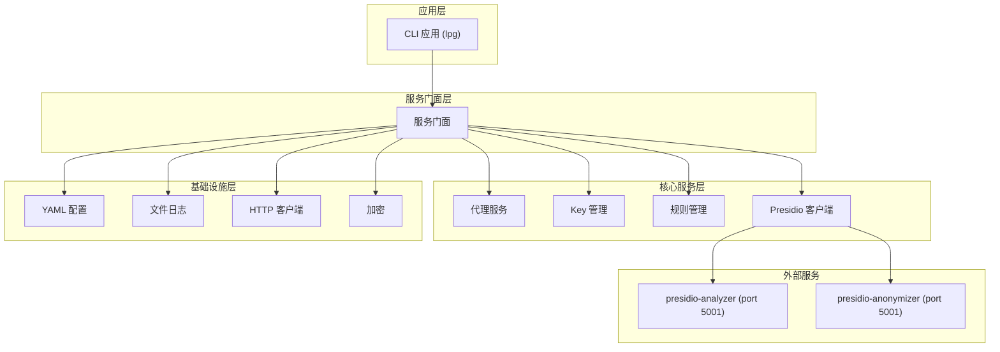
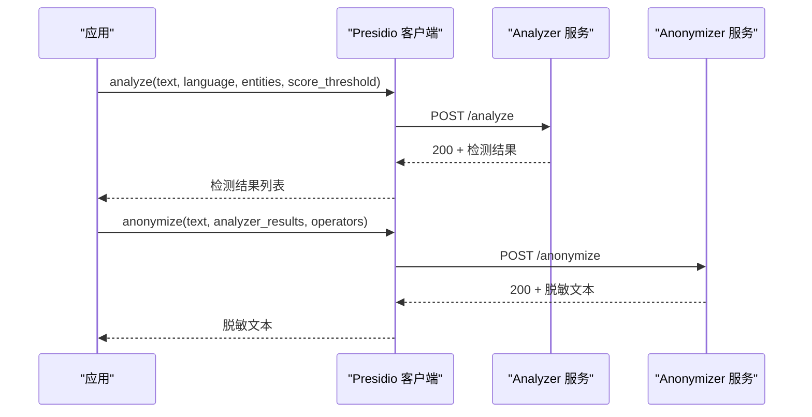
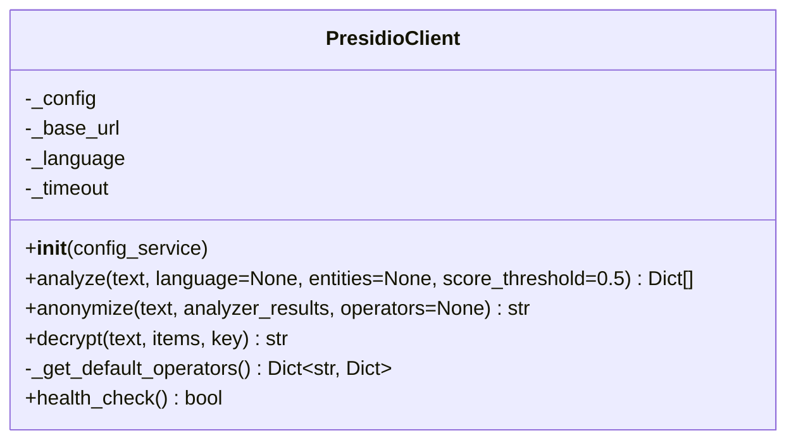
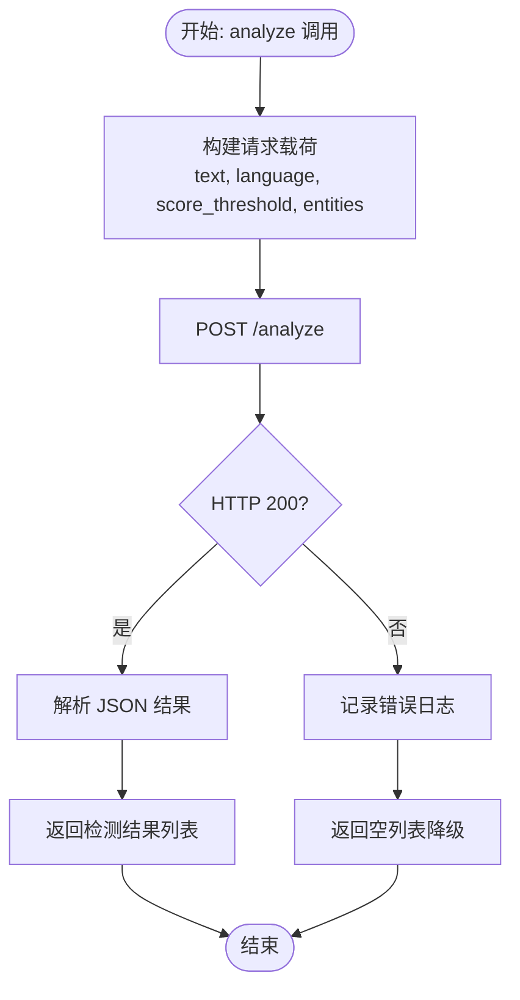
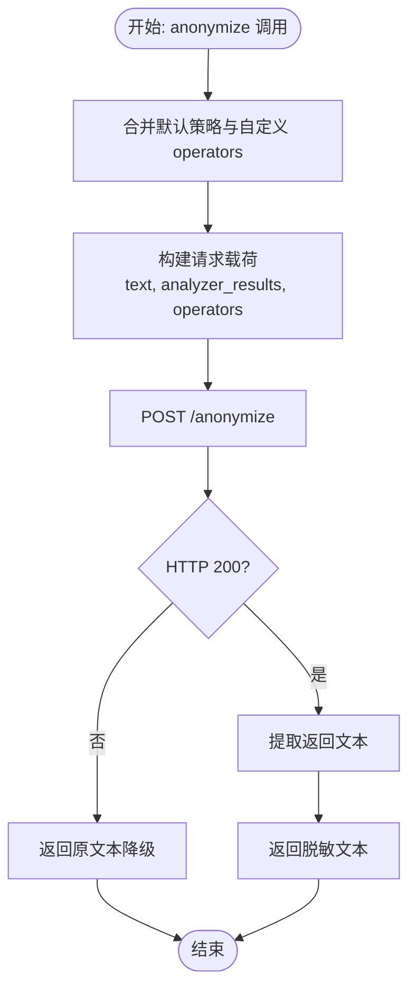
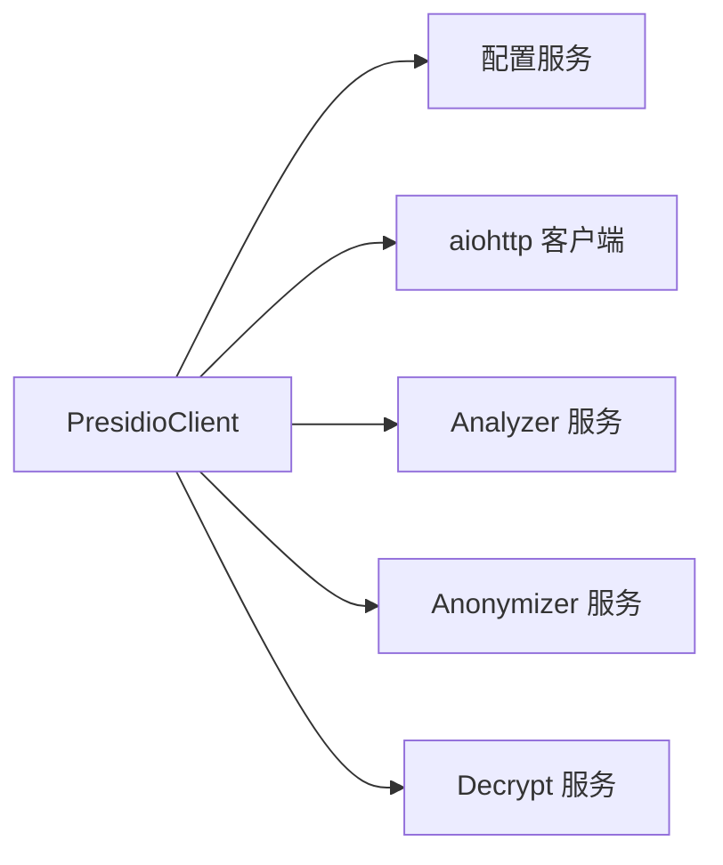

# Presidio服务集成

<cite>
**本文引用的文件**
- [设计文档](file://doc/design/design-update-20260404-v1.0-init.md)
- [编码规范](file://AGENTS.md)
- [PII检测测试用例](file://doc/test/tcs/v1.0/04_pii_detection.md)
- [PII检测测试数据](file://doc/test/tcs/v1.0/04_pii_detection_testdata.md)
- [配置测试数据](file://doc/test/tcs/v1.0/07_configuration_testdata.md)
- [配置样例](file://doc/test/tcs/v1.0/test_data/config_sample.yaml)
- [提供商配置样例](file://doc/test/tcs/v1.0/test_data/providers_sample.yaml)
</cite>

## 目录
1. [简介](#简介)
2. [项目结构](#项目结构)
3. [核心组件](#核心组件)
4. [架构总览](#架构总览)
5. [组件详细分析](#组件详细分析)
6. [依赖关系分析](#依赖关系分析)
7. [性能考量](#性能考量)
8. [故障排除指南](#故障排除指南)
9. [结论](#结论)
10. [附录](#附录)

## 简介
本文件面向开发者，系统化阐述 LLM Privacy Gateway 中 Presidio 服务的集成实现，重点覆盖以下方面：
- Presidio Analyzer 与 Anonymizer 的服务发现与连接管理
- 错误处理机制与降级策略
- Analyzer 的实体检测能力（支持的 PII 类型、检测算法与置信度阈值配置）
- Anonymizer 的脱敏处理流程与策略实现原理
- 服务超时、连接失败恢复与降级策略
- Presidio 服务配置最佳实践与性能优化建议
- 实际代码示例路径与集成要点

## 项目结构
Presidio 集成位于核心服务层，作为统一服务门面的一部分，向上游提供简化的 PII 检测与脱敏能力，向下对接外部 Presidio Analyzer/Anonymizer 服务。

**图示来源**
- [设计文档:70-122](file://doc/design/design-update-20260404-v1.0-init.md#L70-L122)

**章节来源**
- [设计文档:70-122](file://doc/design/design-update-20260404-v1.0-init.md#L70-L122)

## 核心组件
- Presidio 客户端：封装 Analyzer/Anonymizer/Decrypt 的 HTTP 调用，提供简化的 Python 接口，内置默认脱敏策略与健康检查。
- 配置服务：从配置读取 Presidio 服务端点、语言、超时等参数，支持环境覆盖与默认值。
- 异常体系：PresidioConnectionError、PresidioTimeoutError 等，便于上层进行差异化处理与降级。
- 日志与测试：统一日志级别与格式，配套黑盒测试用例与测试数据，覆盖多语言、边界值与性能场景。

**章节来源**
- [编码规范:473-547](file://AGENTS.md#L473-L547)
- [设计文档:946-1113](file://doc/design/design-update-20260404-v1.0-init.md#L946-L1113)

## 架构总览
Presidio 集成采用“客户端直连外部服务”的轻量架构，核心要点：
- 服务发现：通过配置项指定 presidio.endpoint，支持 HTTP/HTTPS 与本地/远程地址。
- 连接管理：使用 aiohttp ClientSession，按请求生命周期创建与释放，统一超时控制。
- 错误处理：捕获连接异常与超时异常，分别抛出 PresidioConnectionError、PresidioTimeoutError；对非 200 响应进行降级返回空结果。
- 健康检查：提供 /health 探针，便于运维监控与自动恢复。

**图示来源**
- [设计文档:1707-1774](file://doc/design/design-update-20260404-v1.0-init.md#L1707-L1774)

**章节来源**
- [设计文档:946-1113](file://doc/design/design-update-20260404-v1.0-init.md#L946-L1113)
- [设计文档:1707-1774](file://doc/design/design-update-20260404-v1.0-init.md#L1707-L1774)

## 组件详细分析

### Presidio 客户端类设计
- 职责划分清晰：分别封装 analyze/anonymize/decrypt 三个核心能力，提供健康检查。
- 配置驱动：从配置服务读取 endpoint/language/timeout，默认语言 zh，超时 30 秒。
- 默认脱敏策略：内置针对 EMAIL_ADDRESS、PHONE_NUMBER、CREDIT_CARD、PERSON、LOCATION、IP_ADDRESS、URL 等实体的策略，支持中国特定实体 CN_*。
- 错误处理：捕获连接与超时异常并转换为领域异常；非 200 响应返回空结果，实现降级。

**图示来源**
- [设计文档:956-1113](file://doc/design/design-update-20260404-v1.0-init.md#L956-L1113)

**章节来源**
- [设计文档:946-1113](file://doc/design/design-update-20260404-v1.0-init.md#L946-L1113)

### Analyzer 服务集成与实体检测
- 接口行为：接收 text、language、score_threshold、entities 等参数，返回检测结果数组，包含 entity_type、start、end、score。
- 支持的 PII 类型：根据测试数据与默认策略，涵盖 EMAIL_ADDRESS、PHONE_NUMBER、CREDIT_CARD、PERSON、LOCATION、IP_ADDRESS、URL，以及中国特定实体 CN_PHONE_NUMBER、CN_ID_CARD、CN_BANK_CARD。
- 置信度阈值：支持传入 score_threshold 控制最低置信度，结合测试数据验证高/中/低置信度场景。
- 多语言支持：language 参数可切换，测试覆盖中文、英文、日文、韩文及混合文本。

**图示来源**
- [设计文档:972-1010](file://doc/design/design-update-20260404-v1.0-init.md#L972-L1010)
- [PII检测测试数据:367-401](file://doc/test/tcs/v1.0/04_pii_detection_testdata.md#L367-L401)

**章节来源**
- [设计文档:972-1010](file://doc/design/design-update-20260404-v1.0-init.md#L972-L1010)
- [PII检测测试数据:367-401](file://doc/test/tcs/v1.0/04_pii_detection_testdata.md#L367-L401)

### Anonymizer 服务集成与脱敏策略
- 接口行为：接收 text、analyzer_results、operators，返回脱敏后的文本与脱敏项明细。
- 默认策略：针对常见实体提供默认脱敏策略（如 replace/mask/hash/redact），并支持自定义 operators 覆盖。
- 策略实现原理（基于默认策略）：
  - replace：将实体替换为占位符（如 <REDACTED>、<PHONE>、<ID_CARD> 等）。
  - mask：对实体进行部分遮蔽（如邮箱用户名首字符保留、其余星号；手机号中间部分遮蔽；身份证前后保留等）。
  - hash：对实体进行哈希处理（保持同一输入的哈希一致性）。
  - redact：完全移除实体（返回固定标记）。
- 自定义 operators：允许按实体类型覆盖默认策略，满足业务定制需求。

**图示来源**
- [设计文档:1011-1050](file://doc/design/design-update-20260404-v1.0-init.md#L1011-L1050)
- [设计文档:1085-1103](file://doc/design/design-update-20260404-v1.0-init.md#L1085-L1103)

**章节来源**
- [设计文档:1011-1050](file://doc/design/design-update-20260404-v1.0-init.md#L1011-L1050)
- [设计文档:1085-1103](file://doc/design/design-update-20260404-v1.0-init.md#L1085-L1103)

### Decrypt 还原流程
- 用途：在响应侧需要还原脱敏项时使用，向 /decrypt 发送 text、items、key，返回还原后的文本。
- 场景：审计或调试需要查看原始内容时启用。

**章节来源**
- [设计文档:1051-1084](file://doc/design/design-update-20260404-v1.0-init.md#L1051-L1084)

### 健康检查与服务发现
- 健康检查：GET /health，成功返回 200，否则视为不可用。
- 服务发现：通过配置项 presidio.endpoint 指定服务地址，支持本地与远程部署。

**章节来源**
- [设计文档:1105-1113](file://doc/design/design-update-20260404-v1.0-init.md#L1105-L1113)

## 依赖关系分析
- 组件耦合：Presidio 客户端依赖配置服务读取 endpoint/language/timeout；对外依赖 aiohttp 进行 HTTP 通信。
- 外部依赖：Presidio Analyzer/Anonymizer 服务，端口 5001，支持 /analyze、/anonymize、/decrypt、/health。
- 异常契约：上层可捕获 PresidioConnectionError（连接失败）、PresidioTimeoutError（超时），并进行降级或重试。

**图示来源**
- [设计文档:946-1113](file://doc/design/design-update-20260404-v1.0-init.md#L946-L1113)

**章节来源**
- [设计文档:946-1113](file://doc/design/design-update-20260404-v1.0-init.md#L946-L1113)

## 性能考量
- 连接与会话：使用 aiohttp ClientSession，按请求生命周期创建，避免连接泄漏；合理设置超时，防止阻塞。
- 超时策略：默认 30 秒，可在配置中调整；对高延迟场景建议适度放宽，同时配合重试与熔断。
- 并发与限流：结合上游代理的最大连接数配置，避免对 Presidio 服务造成过大压力。
- 脱敏策略成本：mask/hash 等策略在大规模文本上会有额外计算开销，建议按需启用并缓存策略配置。
- 健康检查：定期 /health 探针有助于及时发现服务异常，减少失败请求。

[本节为通用性能建议，不直接分析具体文件，故无“章节来源”]

## 故障排除指南
- 连接失败（PresidioConnectionError）
  - 现象：无法连接到 Presidio 服务。
  - 排查：确认 presidio.endpoint 是否可达；检查网络策略与防火墙；核对服务状态。
  - 处理：记录错误日志并触发降级（返回空结果或原文本）。
- 请求超时（PresidioTimeoutError）
  - 现象：请求超过预设超时时间。
  - 排查：检查服务负载与资源；适当增大超时；观察队列积压。
  - 处理：记录警告日志并降级；必要时引入指数退避重试。
- 非 200 响应
  - 现象：Analyzer/Anonymizer 返回非 200。
  - 排查：查看服务端日志与错误码；确认请求格式与参数。
  - 处理：记录错误并降级返回空结果或原文本。
- 配置错误
  - 现象：端点、语言、超时等配置无效。
  - 排查：核对配置文件与环境变量覆盖；使用配置测试数据验证边界值。
  - 处理：修正配置并重启服务。

**章节来源**
- [编码规范:473-547](file://AGENTS.md#L473-L547)
- [配置测试数据:37-117](file://doc/test/tcs/v1.0/07_configuration_testdata.md#L37-L117)

## 结论
Presidio 服务集成在 LLM Privacy Gateway 中实现了清晰的职责分离与稳健的错误处理机制。通过配置驱动与默认策略，既保证了易用性，又提供了灵活的扩展空间。建议在生产环境中结合健康检查、超时与重试策略，确保系统的稳定性与性能。

[本节为总结性内容，不直接分析具体文件，故无“章节来源”]

## 附录

### Presidio 服务接口规范
- Analyzer 接口
  - 请求：POST /analyze，参数包括 text、language、score_threshold、entities。
  - 响应：检测结果数组，包含 entity_type、start、end、score。
- Anonymizer 接口
  - 请求：POST /anonymize，参数包括 text、analyzer_results、operators。
  - 响应：脱敏后的文本与脱敏项明细。
- Decrypt 接口
  - 请求：POST /decrypt，参数包括 text、items、key。
  - 响应：还原后的文本。
- Health 接口
  - 请求：GET /health。
  - 响应：200 表示健康。

**章节来源**
- [设计文档:1707-1774](file://doc/design/design-update-20260404-v1.0-init.md#L1707-L1774)

### 配置最佳实践
- 端点与协议：优先使用 HTTPS；本地开发可用 http://localhost:5001。
- 语言与区域：根据业务文本主要语言设置 language，默认 zh。
- 超时与并发：结合服务性能设置超时（建议 30-120 秒），并控制最大连接数。
- 策略定制：在默认策略基础上，按实体类型覆盖 operators，确保合规与可审计。

**章节来源**
- [配置样例:1-27](file://doc/test/tcs/v1.0/test_data/config_sample.yaml#L1-L27)
- [提供商配置样例:1-25](file://doc/test/tcs/v1.0/test_data/providers_sample.yaml#L1-L25)
- [配置测试数据:108-117](file://doc/test/tcs/v1.0/07_configuration_testdata.md#L108-L117)

### 测试与验证
- 黑盒测试覆盖：邮箱、手机号、身份证、信用卡、人名、地址、IP、URL 等实体的检测与脱敏；多语言与边界值场景。
- 性能测试：大量数据与并发场景验证。
- 错误处理：异常输入与资源限制场景。

**章节来源**
- [PII检测测试用例:1-625](file://doc/test/tcs/v1.0/04_pii_detection.md#L1-L625)
- [PII检测测试数据:1-457](file://doc/test/tcs/v1.0/04_pii_detection_testdata.md#L1-L457)