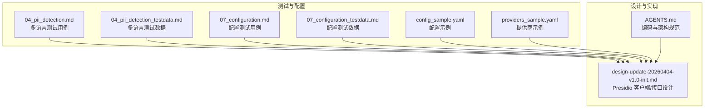
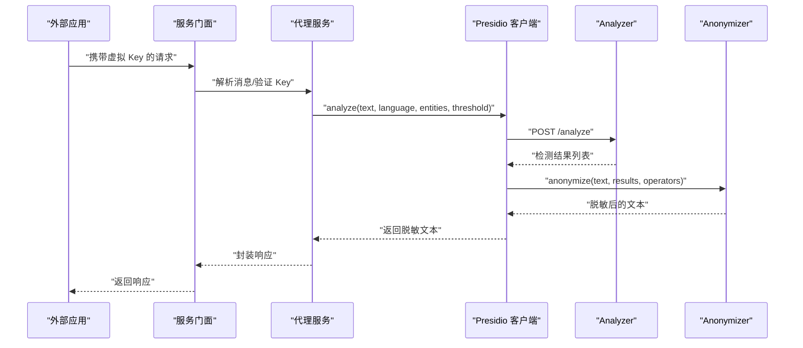
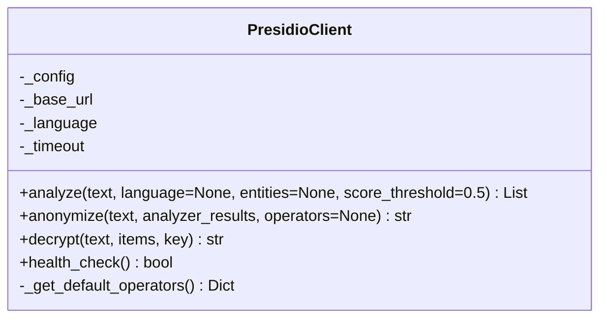
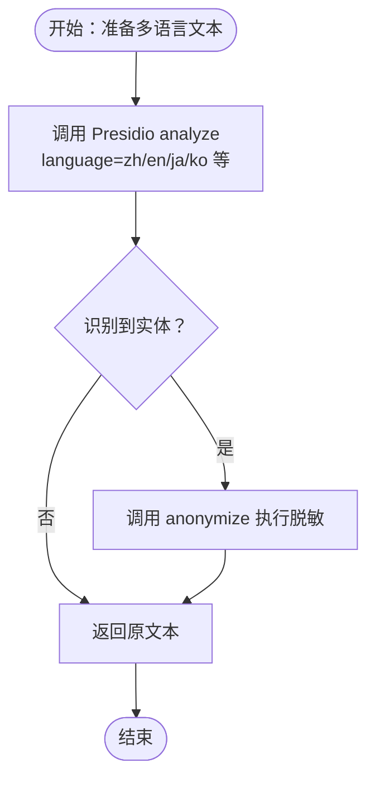
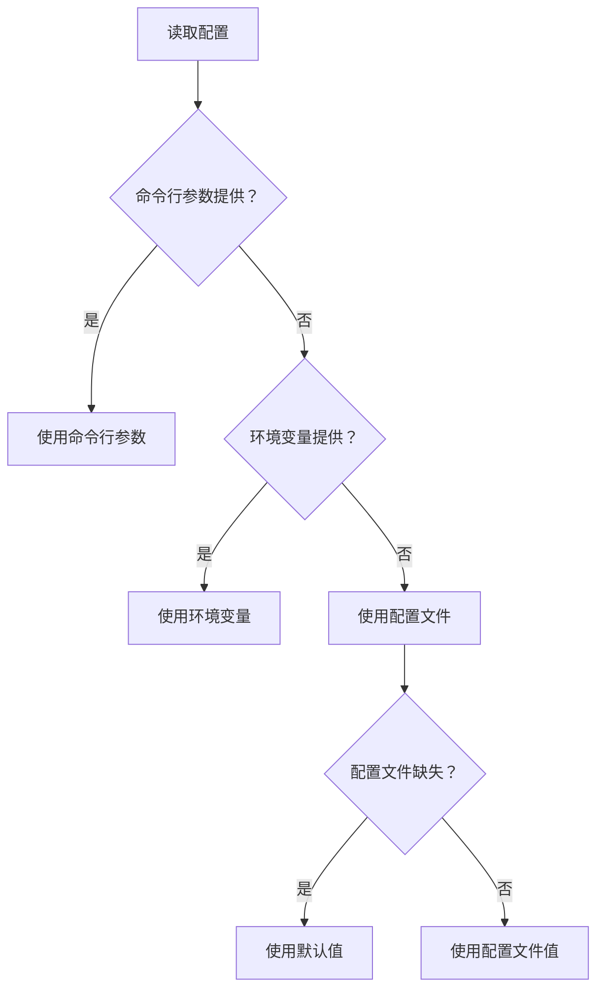
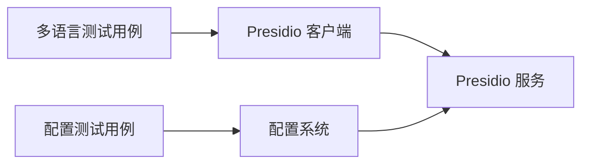

# 多语言支持

<cite>
**本文引用的文件**
- [04_pii_detection.md](file://doc/test/tcs/v1.0/04_pii_detection.md)
- [04_pii_detection_testdata.md](file://doc/test/tcs/v1.0/04_pii_detection_testdata.md)
- [07_configuration.md](file://doc/test/tcs/v1.0/07_configuration.md)
- [07_configuration_testdata.md](file://doc/test/tcs/v1.0/07_configuration_testdata.md)
- [design-update-20260404-v1.0-init.md](file://doc/design/design-update-20260404-v1.0-init.md)
- [AGENTS.md](file://AGENTS.md)
- [config_sample.yaml](file://doc/test/tcs/v1.0/test_data/config_sample.yaml)
- [providers_sample.yaml](file://doc/test/tcs/v1.0/test_data/providers_sample.yaml)
</cite>

## 目录
1. [简介](#简介)
2. [项目结构](#项目结构)
3. [核心组件](#核心组件)
4. [架构总览](#架构总览)
5. [详细组件分析](#详细组件分析)
6. [依赖关系分析](#依赖关系分析)
7. [性能考量](#性能考量)
8. [故障排查指南](#故障排查指南)
9. [结论](#结论)
10. [附录](#附录)

## 简介
本文件聚焦 LLM Privacy Gateway 的多语言支持能力，围绕中文、英文、日文、韩文等语言的 PII 检测与脱敏展开，系统性说明语言检测机制、自动语言识别、不同语言环境下的实体识别差异、混合文本处理策略、配置要点、最佳实践、测试用例与验证方法，并给出问题排查与性能优化建议，帮助国际化场景下的开发者与管理员高效落地多语言隐私保护。

## 项目结构
- 测试与配置层面：
  - 多语言 PII 检测测试用例与数据：doc/test/tcs/v1.0/04_pii_detection.md、04_pii_detection_testdata.md
  - 配置管理测试用例与数据：doc/test/tcs/v1.0/07_configuration.md、07_configuration_testdata.md
  - 配置样例：doc/test/tcs/v1.0/test_data/config_sample.yaml、providers_sample.yaml
- 设计与实现层面：
  - Presidio 客户端与接口设计：doc/design/design-update-20260404-v1.0-init.md
  - 编码与架构规范：AGENTS.md

图表来源
- [04_pii_detection.md:1-717](file://doc/test/tcs/v1.0/04_pii_detection.md#L1-L717)
- [04_pii_detection_testdata.md:1-457](file://doc/test/tcs/v1.0/04_pii_detection_testdata.md#L1-L457)
- [07_configuration.md:1-594](file://doc/test/tcs/v1.0/07_configuration.md#L1-L594)
- [07_configuration_testdata.md:1-808](file://doc/test/tcs/v1.0/07_configuration_testdata.md#L1-L808)
- [design-update-20260404-v1.0-init.md:946-1788](file://doc/design/design-update-20260404-v1.0-init.md#L946-L1788)
- [AGENTS.md:1-397](file://AGENTS.md#L1-L397)

章节来源
- [04_pii_detection.md:1-717](file://doc/test/tcs/v1.0/04_pii_detection.md#L1-L717)
- [07_configuration.md:1-594](file://doc/test/tcs/v1.0/07_configuration.md#L1-L594)
- [design-update-20260404-v1.0-init.md:946-1788](file://doc/design/design-update-20260404-v1.0-init.md#L946-L1788)

## 核心组件
- Presidio 客户端（分析与脱敏）
  - 负责调用 Presidio Analyzer/Anonymizer，支持语言参数传入，内置默认脱敏策略。
  - 关键点：language 参数来自配置或调用方传参；支持 entities 过滤与 score_threshold 控制。
- 配置系统
  - 支持 presidio.language、presidio.endpoint、presidio.enabled 等配置项，提供环境变量覆盖与优先级。
- 测试体系
  - 覆盖中文、英文、日文、韩文及中英混合文本的 PII 检测与脱敏用例，以及语言配置的边界与有效性验证。

章节来源
- [design-update-20260404-v1.0-init.md:946-1788](file://doc/design/design-update-20260404-v1.0-init.md#L946-L1788)
- [04_pii_detection.md:408-469](file://doc/test/tcs/v1.0/04_pii_detection.md#L408-L469)
- [07_configuration.md:1-594](file://doc/test/tcs/v1.0/07_configuration.md#L1-L594)

## 架构总览
多语言 PII 处理的关键流程如下：外部应用请求经由 CLI/服务门面进入，先进行虚拟 Key 验证与消息提取，随后调用 Presidio Analyzer 进行 PII 检测，再调用 Anonymizer 执行脱敏，最终返回响应。语言参数通过配置或调用参数传递至 Presidio。

图表来源
- [design-update-20260404-v1.0-init.md:946-1788](file://doc/design/design-update-20260404-v1.0-init.md#L946-L1788)

## 详细组件分析

### 组件一：Presidio 客户端与语言参数
- 语言参数来源
  - 默认从配置读取：presidio.language（例如 zh/en/ja/ko/de/fr）
  - 调用方可显式传入 language 覆盖默认值
- 分析与脱敏接口
  - analyze：支持 entities 过滤、score_threshold 控制
  - anonymize：基于默认 operators 或自定义 operators 执行脱敏
- 中国特定实体
  - CN_PHONE_NUMBER、CN_ID_CARD、CN_BANK_CARD 等默认策略

图表来源
- [design-update-20260404-v1.0-init.md:946-1788](file://doc/design/design-update-20260404-v1.0-init.md#L946-L1788)

章节来源
- [design-update-20260404-v1.0-init.md:946-1788](file://doc/design/design-update-20260404-v1.0-init.md#L946-L1788)

### 组件二：多语言 PII 检测测试用例
- 中文文本 PII 检测（TC-PII-025）
  - 覆盖中文人名、手机号、邮箱等实体
- 英文文本 PII 检测（TC-PII-026）
  - 覆盖英文人名、电话、邮箱、信用卡等实体
- 中英混合文本 PII 检测（TC-PII-027）
  - 验证混合文本中中英文实体均被正确识别
- 日文文本 PII 检测（TC-PII-028）
  - 验证日文人名、邮箱、电话等实体识别（若 Presidio 支持）

图表来源
- [04_pii_detection.md:408-469](file://doc/test/tcs/v1.0/04_pii_detection.md#L408-L469)
- [design-update-20260404-v1.0-init.md:946-1788](file://doc/design/design-update-20260404-v1.0-init.md#L946-L1788)

章节来源
- [04_pii_detection.md:408-469](file://doc/test/tcs/v1.0/04_pii_detection.md#L408-L469)

### 组件三：多语言测试数据与边界
- 纯中文/英文/日文/韩文文本
  - 覆盖无 PII、含邮箱/手机号/人名/地址/信用卡等场景
- 中英混合文本
  - 验证混合文本中多语言实体识别
- 边界与特殊字符
  - 空文本、超长文本、特殊字符、Unicode 表情等

章节来源
- [04_pii_detection_testdata.md:284-332](file://doc/test/tcs/v1.0/04_pii_detection_testdata.md#L284-L332)

### 组件四：语言配置与优先级
- 配置项
  - presidio.language：支持 zh/en/ja/ko/de/fr 等 ISO 639-1 代码
  - presidio.endpoint：Presidio 服务端点
  - presidio.enabled：是否启用 Presidio
- 优先级（命令行 > 环境变量 > 配置文件 > 默认值）
- 语言代码有效性
  - 有效：zh/en/ja/ko/de/fr 等
  - 无效：中文、大写、非 ISO 639-1 等

图表来源
- [07_configuration_testdata.md:680-745](file://doc/test/tcs/v1.0/07_configuration_testdata.md#L680-L745)

章节来源
- [07_configuration.md:1-594](file://doc/test/tcs/v1.0/07_configuration.md#L1-L594)
- [07_configuration_testdata.md:1-808](file://doc/test/tcs/v1.0/07_configuration_testdata.md#L1-L808)

### 组件五：脱敏策略与多语言一致性
- 默认脱敏策略
  - DEFAULT、EMAIL_ADDRESS、PHONE_NUMBER、CREDIT_CARD、PERSON、LOCATION、IP_ADDRESS、URL 等
  - 中国特定实体：CN_PHONE_NUMBER、CN_ID_CARD、CN_BANK_CARD
- 策略类型
  - replace、mask、hash、redact
- 多语言一致性
  - 不同语言文本在相同实体类型上采用一致的脱敏策略

章节来源
- [design-update-20260404-v1.0-init.md:946-1788](file://doc/design/design-update-20260404-v1.0-init.md#L946-L1788)

## 依赖关系分析
- 测试依赖设计
  - 多语言测试用例依赖 Presidio 客户端接口与配置系统
  - 配置测试用例依赖语言代码有效性与优先级规则
- 设计约束
  - Presidio 客户端通过 language 参数控制识别语言
  - 配置系统提供语言代码与端点、开关等关键参数

图表来源
- [04_pii_detection.md:408-469](file://doc/test/tcs/v1.0/04_pii_detection.md#L408-L469)
- [07_configuration.md:1-594](file://doc/test/tcs/v1.0/07_configuration.md#L1-L594)
- [design-update-20260404-v1.0-init.md:946-1788](file://doc/design/design-update-20260404-v1.0-init.md#L946-L1788)

章节来源
- [04_pii_detection.md:1-717](file://doc/test/tcs/v1.0/04_pii_detection.md#L1-L717)
- [07_configuration.md:1-594](file://doc/test/tcs/v1.0/07_configuration.md#L1-L594)
- [design-update-20260404-v1.0-init.md:946-1788](file://doc/design/design-update-20260404-v1.0-init.md#L946-L1788)

## 性能考量
- Presidio 服务性能
  - 通过配置超时与连接数控制，避免阻塞主流程
- 多语言文本处理
  - 合理设置置信度阈值与实体过滤，减少不必要的识别与脱敏开销
- 流式响应
  - 若启用流式响应，需评估脱敏时机（实时 vs 缓冲后脱敏）对延迟的影响

[本节为通用指导，无需特定文件引用]

## 故障排查指南
- Presidio 连接失败
  - 现象：抛出 PresidioConnectionError 或类似异常
  - 处理：检查 presidio.endpoint、网络连通性、服务状态；启用降级策略
- Presidio 超时
  - 现象：抛出 PresidioTimeoutError 或类似异常
  - 处理：调整超时配置、检查服务负载；记录超时日志，不阻塞主流程
- 语言配置错误
  - 现象：ValidationError（如无效语言代码、大小写错误等）
  - 处理：使用 ISO 639-1 小写代码；检查环境变量覆盖与优先级
- 脱敏策略不生效
  - 现象：实体未按预期脱敏
  - 处理：核对 entities 过滤、score_threshold、operators 配置

章节来源
- [04_pii_detection.md:547-591](file://doc/test/tcs/v1.0/04_pii_detection.md#L547-L591)
- [07_configuration_testdata.md:140-149](file://doc/test/tcs/v1.0/07_configuration_testdata.md#L140-L149)

## 结论
- LLM Privacy Gateway 通过 Presidio 客户端与配置系统实现了对中文、英文、日文、韩文等多语言文本的 PII 检测与脱敏能力。
- 语言参数可通过配置或调用参数传入，支持 entities 过滤与置信度阈值控制，满足不同场景需求。
- 测试用例覆盖纯语言文本与混合文本，验证多语言识别与脱敏效果；配置测试覆盖语言代码有效性与优先级。
- 建议在生产环境中结合业务需求选择合适的语言模型与脱敏策略，并持续监控 Presidio 服务性能与稳定性。

[本节为总结，无需特定文件引用]

## 附录

### A. 多语言 PII 检测配置示例
- 配置文件示例（含 Presidio 相关项）
  - 参考：doc/test/tcs/v1.0/test_data/config_sample.yaml
- 提供商配置示例
  - 参考：doc/test/tcs/v1.0/test_data/providers_sample.yaml

章节来源
- [config_sample.yaml:1-27](file://doc/test/tcs/v1.0/test_data/config_sample.yaml#L1-L27)
- [providers_sample.yaml:1-25](file://doc/test/tcs/v1.0/test_data/providers_sample.yaml#L1-L25)

### B. 多语言测试用例与验证方法
- 测试用例清单（多语言）
  - TC-PII-025：中文文本 PII 检测
  - TC-PII-026：英文文本 PII 检测
  - TC-PII-027：中英混合文本 PII 检测
  - TC-PII-028：日文文本 PII 检测
- 验证方法
  - 使用 LPG 代理发送请求，检查检测结果与脱敏效果
  - 对比预期实体类型与位置区间

章节来源
- [04_pii_detection.md:408-469](file://doc/test/tcs/v1.0/04_pii_detection.md#L408-L469)

### C. 语言模型选择与优化建议
- 语言选择
  - 根据主要业务语言设置 presidio.language（zh/en/ja/ko/de/fr）
- 识别优化
  - 合理设置 entities 与 score_threshold，平衡准确率与性能
  - 对高频实体配置更严格的阈值，降低误报
- 服务优化
  - 调整 Presidio 服务端点与超时配置，确保稳定响应

章节来源
- [07_configuration_testdata.md:129-149](file://doc/test/tcs/v1.0/07_configuration_testdata.md#L129-L149)
- [design-update-20260404-v1.0-init.md:946-1788](file://doc/design/design-update-20260404-v1.0-init.md#L946-L1788)