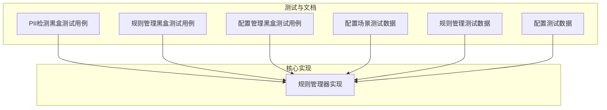
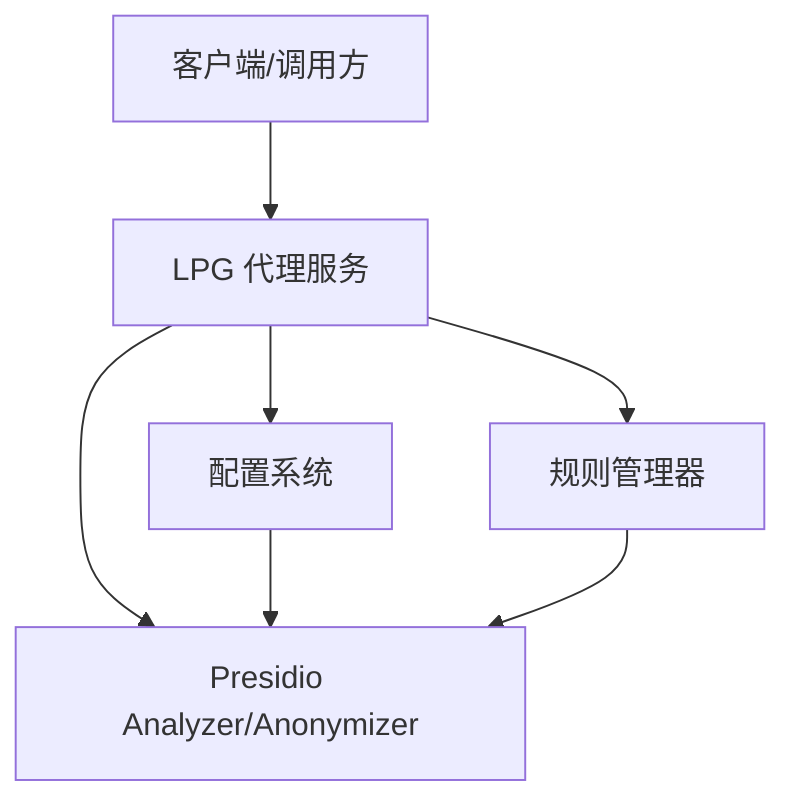
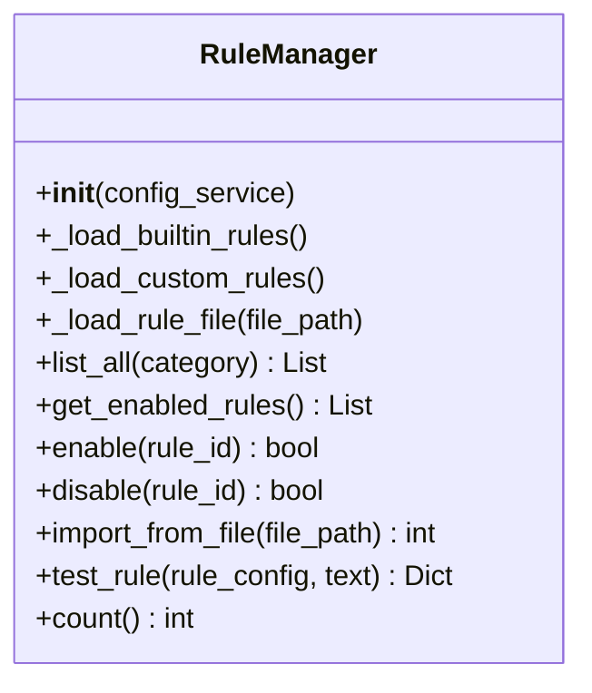
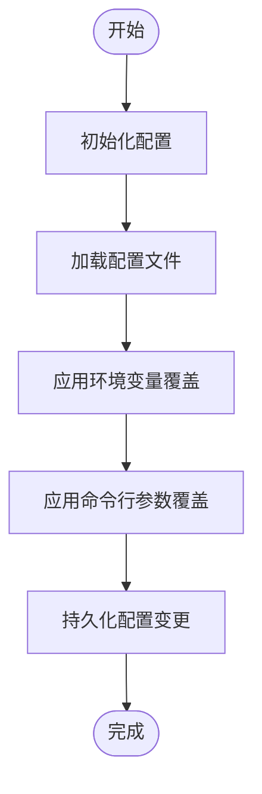
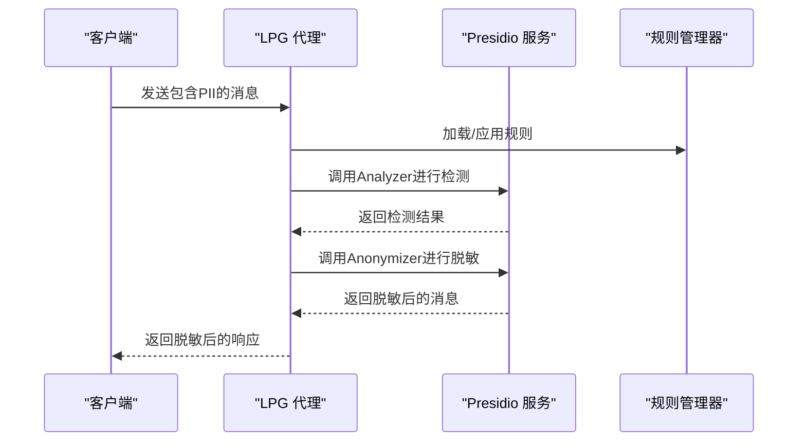
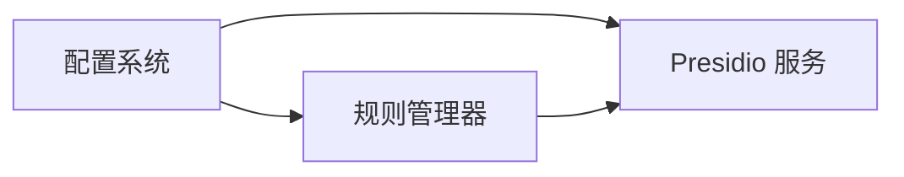

# 检测规则配置

<cite>
**本文引用的文件**
- [PII检测黑盒测试用例](file://doc/test/tcs/v1.0/04_pii_detection.md)
- [规则管理黑盒测试用例](file://doc/test/tcs/v1.0/05_rule_management.md)
- [配置管理黑盒测试用例](file://doc/test/tcs/v1.0/07_configuration.md)
- [配置场景测试数据](file://doc/test/tcs/v1.0/08_e2e_integration_testdata.md)
- [规则管理测试数据](file://doc/test/tcs/v1.0/05_rule_management_testdata.md)
- [配置测试数据](file://doc/test/tcs/v1.0/07_configuration_testdata.md)
- [规则管理器实现](file://doc/design/design-update-20260404-v1.0-init.md)
</cite>

## 目录
1. [简介](#简介)
2. [项目结构](#项目结构)
3. [核心组件](#核心组件)
4. [架构总览](#架构总览)
5. [详细组件分析](#详细组件分析)
6. [依赖关系分析](#依赖关系分析)
7. [性能考量](#性能考量)
8. [故障排查指南](#故障排查指南)
9. [结论](#结论)
10. [附录](#附录)

## 简介
本文件面向管理员与开发者，系统化梳理 LLM Privacy Gateway 的检测规则配置机制，重点覆盖以下方面：
- PII 检测规则的实体类型定义、语言支持与区域设置
- 置信度阈值的配置与影响，以及如何依据业务需求调整检测精度
- 实体类型过滤配置，涵盖 EMAIL_ADDRESS、PHONE_NUMBER、ID_CARD、CREDIT_CARD、PERSON、LOCATION、IP_ADDRESS、URL 等
- 多语言支持配置，包括中文、英文、日文等语言的检测差异
- 规则配置的实际示例与最佳实践
- 规则测试与验证方法，以及常见配置问题的解决方案

## 项目结构
本仓库围绕“测试用例 + 设计文档 + 配置样例”的结构组织，便于从“如何用”和“如何实现”两个维度理解规则配置体系。

图表来源
- [PII检测黑盒测试用例](file://doc/test/tcs/v1.0/04_pii_detection.md)
- [规则管理黑盒测试用例](file://doc/test/tcs/v1.0/05_rule_management.md)
- [配置管理黑盒测试用例](file://doc/test/tcs/v1.0/07_configuration.md)
- [配置场景测试数据](file://doc/test/tcs/v1.0/08_e2e_integration_testdata.md)
- [规则管理测试数据](file://doc/test/tcs/v1.0/05_rule_management_testdata.md)
- [配置测试数据](file://doc/test/tcs/v1.0/07_configuration_testdata.md)
- [规则管理器实现](file://doc/design/design-update-20260404-v1.0-init.md)

章节来源
- [PII检测黑盒测试用例](file://doc/test/tcs/v1.0/04_pii_detection.md)
- [规则管理黑盒测试用例](file://doc/test/tcs/v1.0/05_rule_management.md)
- [配置管理黑盒测试用例](file://doc/test/tcs/v1.0/07_configuration.md)
- [配置场景测试数据](file://doc/test/tcs/v1.0/08_e2e_integration_testdata.md)
- [规则管理测试数据](file://doc/test/tcs/v1.0/05_rule_management_testdata.md)
- [配置测试数据](file://doc/test/tcs/v1.0/07_configuration_testdata.md)
- [规则管理器实现](file://doc/design/design-update-20260404-v1.0-init.md)

## 核心组件
- 规则管理器：负责加载内置与自定义规则、启用/禁用、导入导出、规则测试与优先级排序。
- 配置系统：提供配置初始化、加载、读取、设置、验证、环境变量覆盖与持久化能力。
- Presidio 集成：通过 Presidio Analyzer/Anonymizer 提供 PII 检测与脱敏能力，支持语言与超时配置。

章节来源
- [规则管理器实现](file://doc/design/design-update-20260404-v1.0-init.md)
- [配置管理黑盒测试用例](file://doc/test/tcs/v1.0/07_configuration.md)
- [配置场景测试数据](file://doc/test/tcs/v1.0/08_e2e_integration_testdata.md)

## 架构总览
下图展示 LPG 与 Presidio 的交互，以及规则配置在系统中的作用位置。

图表来源
- [配置场景测试数据](file://doc/test/tcs/v1.0/08_e2e_integration_testdata.md)
- [规则管理器实现](file://doc/design/design-update-20260404-v1.0-init.md)

## 详细组件分析

### PII 检测规则配置
- 实体类型定义
  - 支持的实体类型包括：EMAIL_ADDRESS、PHONE_NUMBER、PERSON、LOCATION、CREDIT_CARD、IP_ADDRESS、URL 等。
  - 针对特定国家/地区，提供扩展实体类型，例如 CN_ID_CARD、CN_PHONE_NUMBER 等。
- 实体类型过滤
  - 可通过配置仅启用特定实体类型，从而缩小检测范围、降低误报。
  - 示例：仅启用 EMAIL_ADDRESS、PHONE_NUMBER、CN_ID_CARD、PERSON。
- 置信度阈值
  - 置信度阈值直接影响检测结果数量与准确性。较低阈值会提升召回率但可能引入误报；较高阈值提升精确率但可能漏检。
  - 测试数据提供了高置信度（>=0.9）与中置信度（0.5<=score<0.9）场景，可用于评估阈值影响。
- 多语言支持
  - Presidio 支持多语言，配置中提供 language 字段（如 zh、en、ja 等），用于选择合适的语言模型与规则。
  - 测试用例覆盖了中文、英文、日文与混合语言场景，验证跨语言检测能力。

章节来源
- [PII检测黑盒测试用例](file://doc/test/tcs/v1.0/04_pii_detection.md)
- [规则管理测试数据](file://doc/test/tcs/v1.0/05_rule_management_testdata.md)
- [配置场景测试数据](file://doc/test/tcs/v1.0/08_e2e_integration_testdata.md)

### 规则管理器与规则生命周期
- 规则加载
  - 内置规则：从内置规则目录加载。
  - 自定义规则：从配置中指定的自定义规则目录加载。
  - 单文件加载：支持通过命令行导入单个规则文件。
- 规则列表与筛选
  - 支持按分类（如 pii、credentials、finance）列出规则。
  - 支持筛选启用/禁用状态。
- 规则启用/禁用与批量操作
  - 支持单条规则启用/禁用，也支持批量启用/禁用。
- 规则测试
  - 支持对规则进行测试，返回匹配结果与数量，便于验证规则有效性。
- 规则优先级
  - 规则具有优先级（数值越小优先级越高），用于控制规则应用顺序与冲突处理。

图表来源
- [规则管理器实现](file://doc/design/design-update-20260404-v1.0-init.md)

章节来源
- [规则管理黑盒测试用例](file://doc/test/tcs/v1.0/05_rule_management.md)
- [规则管理器实现](file://doc/design/design-update-20260404-v1.0-init.md)

### 配置系统与优先级
- 配置初始化与加载
  - 支持交互式与非交互式初始化，可指定输出路径与强制覆盖。
  - 支持从默认路径或指定路径加载配置。
- 配置读取与设置
  - 支持读取单个/嵌套配置项，支持设置并持久化。
  - 对配置值进行范围与格式校验（如端口范围、日志级别、URL 格式等）。
- 环境变量与命令行参数覆盖
  - 环境变量可覆盖配置文件中的值；命令行参数优先级最高。
- 提供商配置
  - 支持添加、移除、更新与列出提供商配置，便于统一管理第三方服务凭据。

图表来源
- [配置管理黑盒测试用例](file://doc/test/tcs/v1.0/07_configuration.md)
- [配置测试数据](file://doc/test/tcs/v1.0/07_configuration_testdata.md)

章节来源
- [配置管理黑盒测试用例](file://doc/test/tcs/v1.0/07_configuration.md)
- [配置测试数据](file://doc/test/tcs/v1.0/07_configuration_testdata.md)

### PII 检测与脱敏流程
- 请求/响应处理
  - 支持对请求消息与响应消息中的 PII 进行检测与脱敏。
  - 流式响应场景下，需确保脱敏逻辑在合适时机执行（实时或缓冲后处理）。
- 脱敏策略
  - 支持 replace、mask、hash、redact 等策略，可针对不同实体类型配置差异化策略。
- Presidio 集成
  - 通过 Presidio Analyzer/Anonymizer 提供检测与脱敏能力，支持超时与连接失败处理。

图表来源
- [PII检测黑盒测试用例](file://doc/test/tcs/v1.0/04_pii_detection.md)
- [配置场景测试数据](file://doc/test/tcs/v1.0/08_e2e_integration_testdata.md)

章节来源
- [PII检测黑盒测试用例](file://doc/test/tcs/v1.0/04_pii_detection.md)
- [配置场景测试数据](file://doc/test/tcs/v1.0/08_e2e_integration_testdata.md)

## 依赖关系分析
- 规则管理器依赖配置系统提供的规则目录与自定义规则路径。
- LPG 代理服务依赖配置系统提供的 Presidio 端点、语言与超时等参数。
- Presidio 服务依赖外部 Analyzer/Anonymizer，需要保证网络连通与超时设置合理。

图表来源
- [配置场景测试数据](file://doc/test/tcs/v1.0/08_e2e_integration_testdata.md)
- [规则管理器实现](file://doc/design/design-update-20260404-v1.0-init.md)

章节来源
- [配置场景测试数据](file://doc/test/tcs/v1.0/08_e2e_integration_testdata.md)
- [规则管理器实现](file://doc/design/design-update-20260404-v1.0-init.md)

## 性能考量
- 规则数量与复杂度
  - 规则越多、正则越复杂，检测耗时越长。建议按需启用规则，避免不必要的规则组合。
- 置信度阈值
  - 降低阈值会增加匹配数量，可能带来额外计算开销；提高阈值可减少误报，但需平衡漏检风险。
- 多语言与 Presidio 超时
  - 语言模型切换与 Presidio 调用超时直接影响整体性能。建议在生产环境中设置合理的超时与重试策略。
- 流式处理
  - 流式响应场景下，脱敏策略应在合适时机执行，避免阻塞主流程。

## 故障排查指南
- Presidio 服务不可用
  - 现象：连接失败或超时异常。
  - 处理：检查 Presidio 端点、网络连通性与超时设置；必要时启用降级策略（返回原文或错误提示）。
- 规则加载失败
  - 现象：规则文件格式错误或空文件。
  - 处理：核对规则文件格式（YAML/JSON），确保字段完整；检查规则目录权限与路径。
- 置信度阈值不当
  - 现象：误报过多或漏检严重。
  - 处理：结合业务场景调整阈值；通过测试数据验证不同阈值下的表现。
- 多语言检测异常
  - 现象：日文/英文等语言检测不准确。
  - 处理：确认 language 配置为受支持的语言代码（如 zh/en/ja），并确保 Presidio 版本支持相应语言模型。

章节来源
- [PII检测黑盒测试用例](file://doc/test/tcs/v1.0/04_pii_detection.md)
- [配置管理黑盒测试用例](file://doc/test/tcs/v1.0/07_configuration.md)

## 结论
通过完善的规则管理器、灵活的配置系统与 Presidio 集成，LLM Privacy Gateway 能够在多语言环境下高效、可控地进行 PII 检测与脱敏。管理员与开发者应基于业务需求合理配置实体类型过滤、置信度阈值与脱敏策略，并结合测试用例持续验证与优化，确保在准确性与性能之间取得最佳平衡。

## 附录

### 实体类型与脱敏策略参考
- 实体类型
  - EMAIL_ADDRESS、PHONE_NUMBER、PERSON、LOCATION、CREDIT_CARD、IP_ADDRESS、URL
  - 中国实体类型：CN_PHONE_NUMBER、CN_ID_CARD、CN_BANK_CARD、CN_PASSPORT、CN_LICENSE_PLATE
- 脱敏策略
  - replace：用占位符替换
  - mask：部分遮盖
  - hash：哈希处理
  - redact：完全移除

章节来源
- [规则管理测试数据](file://doc/test/tcs/v1.0/05_rule_management_testdata.md)

### 置信度阈值与多语言配置示例
- 置信度阈值
  - 高置信度（>=0.9）与中置信度（0.5<=score<0.9）场景，可用于评估阈值对召回率与精确率的影响。
- 多语言配置
  - language 字段支持 zh、en、ja 等，测试用例覆盖中文、英文、日文与混合语言场景。

章节来源
- [PII检测黑盒测试用例](file://doc/test/tcs/v1.0/04_pii_detection.md)
- [配置场景测试数据](file://doc/test/tcs/v1.0/08_e2e_integration_testdata.md)

### 规则配置最佳实践
- 按需启用：仅启用必要的实体类型，减少误报与性能开销。
- 分类管理：将规则按类别（pii、credentials、finance）组织，便于维护与审计。
- 优先级控制：为关键规则设置更高优先级，避免被低优先级规则覆盖。
- 策略差异化：针对不同实体类型配置差异化脱敏策略，兼顾合规与可用性。
- 持续验证：结合测试用例定期验证规则有效性与阈值合理性。

章节来源
- [规则管理黑盒测试用例](file://doc/test/tcs/v1.0/05_rule_management.md)
- [配置管理黑盒测试用例](file://doc/test/tcs/v1.0/07_configuration.md)