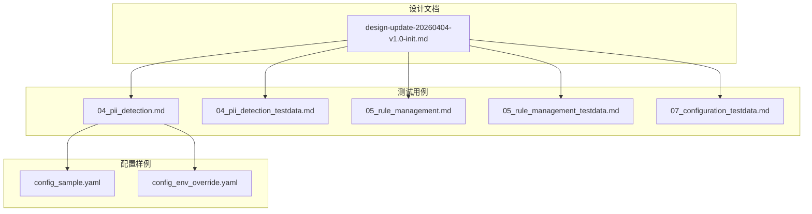
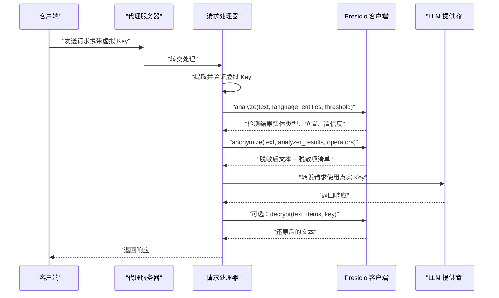
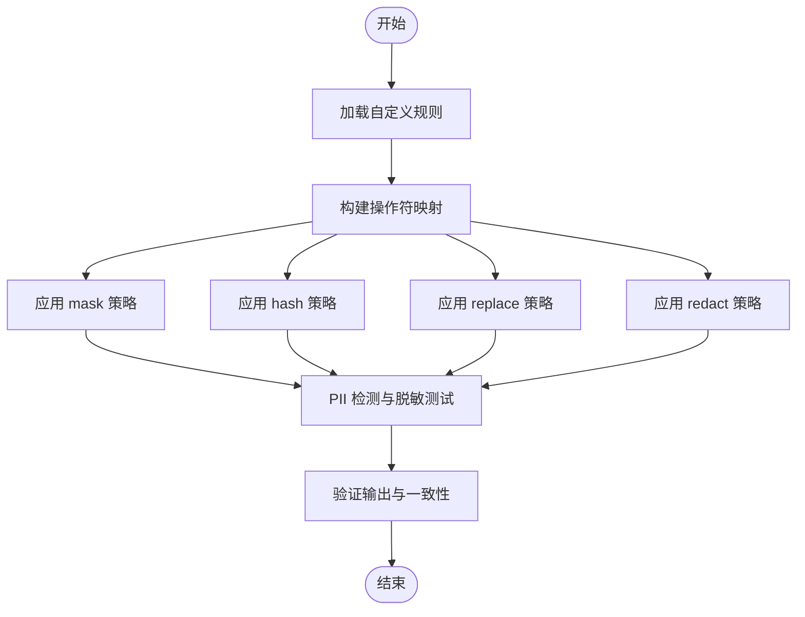
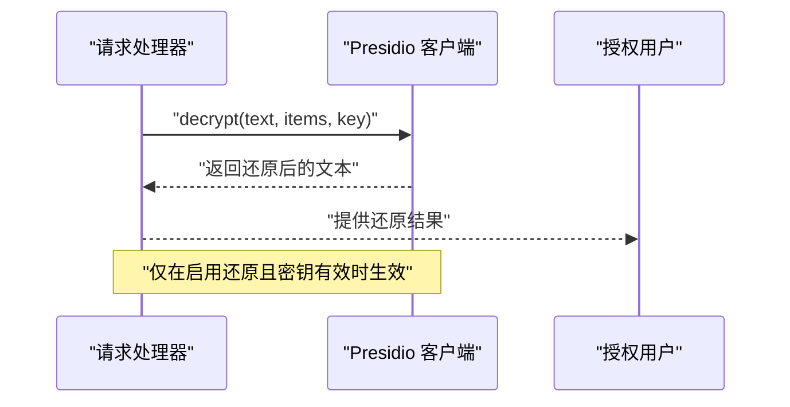
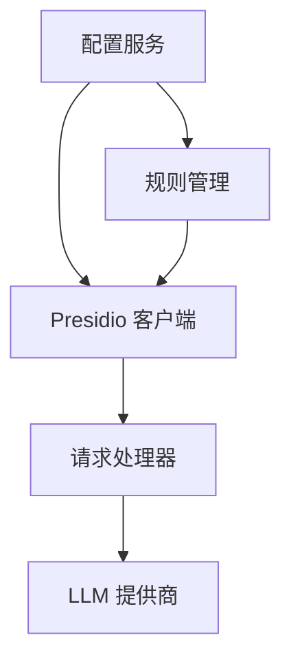

# 脱敏策略与操作符

<cite>
**本文档引用的文件**
- [design-update-20260404-v1.0-init.md](file://doc/design/design-update-20260404-v1.0-init.md)
- [04_pii_detection.md](file://doc/test/tcs/v1.0/04_pii_detection.md)
- [04_pii_detection_testdata.md](file://doc/test/tcs/v1.0/04_pii_detection_testdata.md)
- [05_rule_management.md](file://doc/test/tcs/v1.0/05_rule_management.md)
- [05_rule_management_testdata.md](file://doc/test/tcs/v1.0/05_rule_management_testdata.md)
- [07_configuration_testdata.md](file://doc/test/tcs/v1.0/07_configuration_testdata.md)
- [config_sample.yaml](file://doc/test/tcs/v1.0/test_data/config_sample.yaml)
- [config_env_override.yaml](file://doc/test/tcs/v1.0/test_data/config_env_override.yaml)
</cite>

## 目录
1. [简介](#简介)
2. [项目结构](#项目结构)
3. [核心组件](#核心组件)
4. [架构总览](#架构总览)
5. [详细组件分析](#详细组件分析)
6. [依赖关系分析](#依赖关系分析)
7. [性能考量](#性能考量)
8. [故障排查指南](#故障排查指南)
9. [结论](#结论)
10. [附录](#附录)

## 简介
本文件面向安全工程师与开发者，系统化梳理 LLM Privacy Gateway 的脱敏策略与操作符，涵盖策略原理、配置方法、适用场景、安全考虑、性能影响与选择建议，并提供基于仓库测试用例的验证方法与示例。重点包括：
- replace 策略（替换为占位符）
- mask 策略（部分遮盖）
- hash 策略（哈希加密）
- redact 策略（完全移除）

同时，文档说明如何基于 Presidio 客户端进行自定义脱敏操作符开发，以及在脱敏过程中对数据还原与安全性的保障。

## 项目结构
围绕脱敏策略与操作符的相关文件主要分布在以下位置：
- 设计文档：包含 Presidio 客户端与默认脱敏操作符定义
- 测试用例与测试数据：覆盖 PII 检测与脱敏策略的验证场景
- 配置样例：展示默认策略与还原开关等配置项

**图表来源**
- [design-update-20260404-v1.0-init.md:946-1113](file://doc/design/design-update-20260404-v1.0-init.md#L946-L1113)
- [04_pii_detection.md:1-717](file://doc/test/tcs/v1.0/04_pii_detection.md#L1-L717)
- [04_pii_detection_testdata.md:1-457](file://doc/test/tcs/v1.0/04_pii_detection_testdata.md#L1-L457)
- [05_rule_management.md:1-623](file://doc/test/tcs/v1.0/05_rule_management.md#L1-L623)
- [05_rule_management_testdata.md:1-585](file://doc/test/tcs/v1.0/05_rule_management_testdata.md#L1-L585)
- [07_configuration_testdata.md:467-508](file://doc/test/tcs/v1.0/07_configuration_testdata.md#L467-L508)
- [config_sample.yaml:1-27](file://doc/test/tcs/v1.0/test_data/config_sample.yaml#L1-L27)
- [config_env_override.yaml:1-16](file://doc/test/tcs/v1.0/test_data/config_env_override.yaml#L1-L16)

**章节来源**
- [design-update-20260404-v1.0-init.md:946-1113](file://doc/design/design-update-20260404-v1.0-init.md#L946-L1113)
- [04_pii_detection.md:1-717](file://doc/test/tcs/v1.0/04_pii_detection.md#L1-L717)
- [04_pii_detection_testdata.md:1-457](file://doc/test/tcs/v1.0/04_pii_detection_testdata.md#L1-L457)
- [05_rule_management.md:1-623](file://doc/test/tcs/v1.0/05_rule_management.md#L1-L623)
- [05_rule_management_testdata.md:1-585](file://doc/test/tcs/v1.0/05_rule_management_testdata.md#L1-L585)
- [07_configuration_testdata.md:467-508](file://doc/test/tcs/v1.0/07_configuration_testdata.md#L467-L508)
- [config_sample.yaml:1-27](file://doc/test/tcs/v1.0/test_data/config_sample.yaml#L1-L27)
- [config_env_override.yaml:1-16](file://doc/test/tcs/v1.0/test_data/config_env_override.yaml#L1-L16)

## 核心组件
- Presidio 客户端：负责调用 Presidio Analyzer 进行 PII 检测、Presidio Anonymizer 进行脱敏、Presidio Decrypt 进行可选的数据还原。
- 默认脱敏操作符集合：在客户端中定义了针对各类实体类型的默认脱敏策略（如 replace、mask、hash、redact）。
- 规则管理与测试：提供规则加载、启用/禁用、导入、测试、配置与持久化等能力，支撑脱敏策略的灵活配置与验证。
- 配置系统：提供默认策略、还原开关等配置项，支持环境变量覆盖。

**章节来源**
- [design-update-20260404-v1.0-init.md:946-1113](file://doc/design/design-update-20260404-v1.0-init.md#L946-L1113)
- [05_rule_management.md:1-623](file://doc/test/tcs/v1.0/05_rule_management.md#L1-L623)
- [05_rule_management_testdata.md:234-296](file://doc/test/tcs/v1.0/05_rule_management_testdata.md#L234-L296)
- [07_configuration_testdata.md:475-508](file://doc/test/tcs/v1.0/07_configuration_testdata.md#L475-L508)

## 架构总览
脱敏策略在请求处理链路中的位置如下：

**图表来源**
- [design-update-20260404-v1.0-init.md:170-250](file://doc/design/design-update-20260404-v1.0-init.md#L170-L250)
- [design-update-20260404-v1.0-init.md:946-1113](file://doc/design/design-update-20260404-v1.0-init.md#L946-L1113)

## 详细组件分析

### 策略与操作符概览
- replace 策略：将匹配到的 PII 替换为占位符（如 <EMAIL>、<PHONE> 等）。
- mask 策略：对 PII 进行部分遮盖（如邮箱中间部分、手机号中间部分、URL 路径等），可配置遮盖字符、遮盖长度与方向。
- hash 策略：对 PII 进行哈希处理（如 sha256），可配置盐值，保证相同输入产生相同输出。
- redact 策略：完全移除 PII，不保留任何痕迹。

默认操作符集合（来自客户端）：
- DEFAULT：replace，new_value="<REDACTED>"
- EMAIL_ADDRESS：mask，masking_char="*"，chars_to_mask=4，from_end=False
- PHONE_NUMBER：replace，new_value="<PHONE>"
- CREDIT_CARD：mask，masking_char="*"，chars_to_mask=12，from_end=False
- PERSON：replace，new_value="<PERSON>"
- LOCATION：replace，new_value="<LOCATION>"
- IP_ADDRESS：replace，new_value="<IP>"
- URL：mask，masking_char="*"，chars_to_mask=10，from_end=False
- CN_*：中国特定实体类型（如 CN_PHONE_NUMBER、CN_ID_CARD、CN_BANK_CARD）均采用 replace

**章节来源**
- [design-update-20260404-v1.0-init.md:1085-1103](file://doc/design/design-update-20260404-v1.0-init.md#L1085-L1103)

### replace 策略
- 原理：将检测到的实体替换为统一占位符，便于审计与日志记录。
- 适用场景：需要保留上下文但完全去除敏感信息的场合；日志脱敏、审计追踪。
- 配置方法：通过默认操作符或自定义操作符将实体类型映射到 replace 策略。
- 安全考虑：占位符本身不泄露原始信息；注意不要在占位符中隐含额外语义。
- 性能影响：字符串替换开销极低，几乎不影响整体性能。

示例（来自测试数据）：
- 邮箱 replace：user@example.com → [EMAIL]
- 手机号 replace：13812345678 → [PHONE]
- 身份证 replace：110101199001011234 → [ID_CARD]
- 信用卡 replace：4111111111111111 → [CREDIT_CARD]
- 人名 replace：张三 → [NAME]
- 地址 replace：北京市朝阳区 → [ADDRESS]
- IP 地址 replace：192.168.1.1 → [IP]
- URL replace：https://example.com → [URL]

**章节来源**
- [04_pii_detection_testdata.md:230-243](file://doc/test/tcs/v1.0/04_pii_detection_testdata.md#L230-L243)
- [04_pii_detection.md:226-238](file://doc/test/tcs/v1.0/04_pii_detection.md#L226-L238)
- [04_pii_detection.md:286-313](file://doc/test/tcs/v1.0/04_pii_detection.md#L286-L313)

### mask 策略
- 原理：对 PII 的部分字符进行遮盖，保留首/尾或中间片段以维持一定可读性。
- 适用场景：需要保留部分可识别特征的场合；邮件、手机号、信用卡、URL 等。
- 配置方法：通过 masking_char、chars_to_mask、mask_from_end 等参数控制遮盖行为。
- 安全考虑：遮盖策略需足够强，避免通过上下文推断原始信息；对 URL 可遮盖路径或域名部分。
- 性能影响：字符串处理与切片操作开销很小。

示例（来自测试数据）：
- 邮箱 mask：user@example.com → u***@e***.com
- 手机号 mask：13812345678 → 138****5678
- 身份证 mask：110101199001011234 → 110***********1234
- 信用卡 mask：4111111111111111 → 4111********1111
- 人名 mask：张三 → 张*
- 地址 mask：北京市朝阳区xxx路 → 北京市朝阳区***路
- IP 地址 mask：192.168.1.1 → 192.168.*.*
- URL mask：https://example.com/path → https://example.com/*** 或 https://*****.com

**章节来源**
- [04_pii_detection_testdata.md:245-256](file://doc/test/tcs/v1.0/04_pii_detection_testdata.md#L245-L256)
- [04_pii_detection.md:211-223](file://doc/test/tcs/v1.0/04_pii_detection.md#L211-L223)
- [04_pii_detection.md:316-328](file://doc/test/tcs/v1.0/04_pii_detection.md#L316-L328)

### hash 策略
- 原理：对 PII 进行哈希处理（如 sha256），并可配置盐值，确保相同输入产生相同哈希值。
- 适用场景：需要唯一标识但不暴露原始信息的场合；审计与关联分析。
- 配置方法：通过 hash_type 与 salt 参数控制哈希算法与盐值。
- 安全考虑：盐值应随机且保密；哈希算法应满足安全强度要求；避免与弱哈希算法组合。
- 性能影响：哈希计算成本较低，适合批量处理。

示例（来自测试数据）：
- 邮箱 hash：user@example.com → [hash值]
- 手机号 hash：13812345678 → [hash值]
- 身份证 hash：110101199001011234 → [hash值]
- 信用卡 hash：4111111111111111 → [hash值]
- 人名 hash：张三 → [hash值]
- 地址 hash：北京市朝阳区 → [hash值]
- 同一输入一致性：相同输入产生相同哈希值
- 不同输入差异性：不同输入产生不同哈希值

**章节来源**
- [04_pii_detection_testdata.md:258-269](file://doc/test/tcs/v1.0/04_pii_detection_testdata.md#L258-L269)
- [04_pii_detection.md:363-375](file://doc/test/tcs/v1.0/04_pii_detection.md#L363-L375)
- [05_rule_management_testdata.md:254-261](file://doc/test/tcs/v1.0/05_rule_management_testdata.md#L254-L261)

### redact 策略
- 原理：完全移除 PII，不保留任何痕迹。
- 适用场景：严格隐私保护要求；日志与报告中不允许出现任何敏感信息。
- 配置方法：将实体类型映射到 redact 策略。
- 安全考虑：确保移除彻底，避免残留；注意上下文中的间接信息。
- 性能影响：字符串移除开销极低。

示例（来自测试数据）：
- 邮箱 redact：user@example.com → [已删除]
- 手机号 redact：13812345678 → [已删除]
- 身份证 redact：110101199001011234 → [已删除]
- 信用卡 redact：4111111111111111 → [已删除]
- 人名 redact：张三 → [已删除]
- 地址 redact：北京市朝阳区 → [已删除]
- IP 地址 redact：192.168.1.1 → [已删除]
- URL redact：https://example.com → [已删除]

**章节来源**
- [04_pii_detection_testdata.md:271-282](file://doc/test/tcs/v1.0/04_pii_detection_testdata.md#L271-L282)
- [04_pii_detection.md:378-390](file://doc/test/tcs/v1.0/04_pii_detection.md#L378-L390)

### 自定义脱敏策略与操作符开发
- 开发流程：通过规则管理模块导入自定义规则文件，或在运行时动态传入 operators 参数（由客户端支持）。
- 配置要点：定义实体类型、策略类型与策略参数（如 mask 的 chars_to_mask、masking_char、mask_from_end；hash 的 hash_type、salt；replace 的 new_value）。
- 验证方法：使用规则测试用例与 PII 检测测试用例，分别验证规则加载、匹配与脱敏效果。

**图表来源**
- [05_rule_management.md:287-362](file://doc/test/tcs/v1.0/05_rule_management.md#L287-L362)
- [05_rule_management_testdata.md:234-296](file://doc/test/tcs/v1.0/05_rule_management_testdata.md#L234-L296)
- [04_pii_detection.md:393-405](file://doc/test/tcs/v1.0/04_pii_detection.md#L393-L405)

**章节来源**
- [05_rule_management.md:287-362](file://doc/test/tcs/v1.0/05_rule_management.md#L287-L362)
- [05_rule_management_testdata.md:234-296](file://doc/test/tcs/v1.0/05_rule_management_testdata.md#L234-L296)
- [04_pii_detection.md:393-405](file://doc/test/tcs/v1.0/04_pii_detection.md#L393-L405)

### 数据还原机制与安全保障
- 还原流程：在响应阶段，若启用还原功能，可通过 Presidio Decrypt 接口对脱敏文本进行还原，前提是持有正确的密钥与脱敏项清单。
- 安全保障：
  - 密钥管理：密钥应安全存储与传输，定期轮换。
  - 最小化原则：仅在必要时启用还原，且仅对授权人员开放。
  - 审计日志：记录还原操作的时间、操作者与上下文，便于审计。
  - 配置开关：通过配置项 enable_restoration 控制是否允许还原。

**图表来源**
- [design-update-20260404-v1.0-init.md:1051-1083](file://doc/design/design-update-20260404-v1.0-init.md#L1051-L1083)
- [07_configuration_testdata.md:494-508](file://doc/test/tcs/v1.0/07_configuration_testdata.md#L494-L508)

**章节来源**
- [design-update-20260404-v1.0-init.md:1051-1083](file://doc/design/design-update-20260404-v1.0-init.md#L1051-L1083)
- [07_configuration_testdata.md:494-508](file://doc/test/tcs/v1.0/07_configuration_testdata.md#L494-L508)

## 依赖关系分析
- Presidio 客户端依赖配置服务获取 Presidio 服务端点、语言与超时等参数。
- 请求处理器依赖 Presidio 客户端完成 PII 检测与脱敏；可选地进行数据还原。
- 规则管理模块提供规则加载、启用/禁用、导入、测试与持久化能力，支撑脱敏策略的灵活配置。
- 配置系统提供默认策略与还原开关等配置项，支持环境变量覆盖。

**图表来源**
- [design-update-20260404-v1.0-init.md:946-1113](file://doc/design/design-update-20260404-v1.0-init.md#L946-L1113)
- [05_rule_management.md:1-623](file://doc/test/tcs/v1.0/05_rule_management.md#L1-L623)

**章节来源**
- [design-update-20260404-v1.0-init.md:946-1113](file://doc/design/design-update-20260404-v1.0-init.md#L946-L1113)
- [05_rule_management.md:1-623](file://doc/test/tcs/v1.0/05_rule_management.md#L1-L623)

## 性能考量
- 策略选择：
  - replace：字符串替换，开销极低。
  - mask：字符串切片与拼接，开销很小。
  - hash：哈希计算，成本低，适合批量处理。
  - redact：字符串移除，开销极低。
- 影响因素：
  - 文本长度与实体数量。
  - Presidio 服务的响应时间与稳定性。
  - 规则数量与匹配复杂度。
- 优化建议：
  - 合理设置置信度阈值，减少误报与漏报。
  - 使用默认策略作为基线，按需定制。
  - 在高并发场景下，关注 Presidio 服务的吞吐与延迟。

[本节为通用指导，无需特定文件引用]

## 故障排查指南
- Presidio 服务不可用：
  - 现象：分析/脱敏/解密接口返回错误或超时。
  - 排查：检查服务健康检查端点、网络连通性与端口配置。
- 规则加载失败：
  - 现象：导入规则文件时报错或规则未生效。
  - 排查：确认文件格式（YAML/JSON）正确、字段完整、无语法错误。
- 脱敏策略不生效：
  - 现象：PII 未被替换/遮盖/哈希/移除。
  - 排查：检查实体类型映射、策略参数配置与 operators 更新是否正确。
- 还原失败：
  - 现象：无法还原脱敏文本。
  - 排查：确认密钥正确、items 清单完整、启用还原开关。

**章节来源**
- [04_pii_detection.md:548-591](file://doc/test/tcs/v1.0/04_pii_detection.md#L548-L591)
- [05_rule_management.md:103-115](file://doc/test/tcs/v1.0/05_rule_management.md#L103-L115)
- [07_configuration_testdata.md:467-508](file://doc/test/tcs/v1.0/07_configuration_testdata.md#L467-L508)

## 结论
- replace、mask、hash、redact 四大脱敏策略各有适用场景，应结合业务需求与合规要求进行选择。
- 默认操作符集合提供了开箱即用的策略基线，可按需扩展与定制。
- 自定义脱敏策略可通过规则管理与客户端 operators 参数实现，配合测试用例进行验证。
- 在保证安全的前提下，合理使用还原功能，严格控制密钥与访问范围。
- 性能方面，策略本身的开销较小，更应关注 Presidio 服务与整体链路的稳定性与吞吐。

[本节为总结，无需特定文件引用]

## 附录

### 配置项与示例
- 默认策略（default_strategy）：支持 replace、mask、hash、redact。
- 还原开关（enable_restoration）：true/false。
- Presidio 端点与语言：presidio.endpoint、presidio.language。
- 环境变量覆盖：通过环境变量覆盖配置文件中的相应项。

**章节来源**
- [07_configuration_testdata.md:475-508](file://doc/test/tcs/v1.0/07_configuration_testdata.md#L475-L508)
- [config_sample.yaml:1-27](file://doc/test/tcs/v1.0/test_data/config_sample.yaml#L1-L27)
- [config_env_override.yaml:1-16](file://doc/test/tcs/v1.0/test_data/config_env_override.yaml#L1-L16)

### 测试用例与验证方法
- PII 检测与脱敏测试：覆盖邮箱、手机号、身份证、信用卡、人名、地址、IP、URL 等类型。
- 规则管理测试：覆盖规则加载、列表、启用/禁用、导入、移除、测试、配置、优先级与持久化。
- 配置测试：覆盖默认策略、还原开关等配置项的有效性与边界值。

**章节来源**
- [04_pii_detection.md:1-717](file://doc/test/tcs/v1.0/04_pii_detection.md#L1-L717)
- [04_pii_detection_testdata.md:1-457](file://doc/test/tcs/v1.0/04_pii_detection_testdata.md#L1-L457)
- [05_rule_management.md:1-623](file://doc/test/tcs/v1.0/05_rule_management.md#L1-L623)
- [05_rule_management_testdata.md:1-585](file://doc/test/tcs/v1.0/05_rule_management_testdata.md#L1-L585)