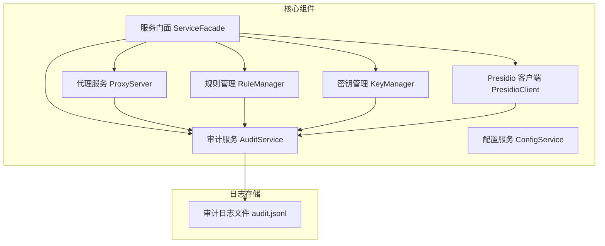
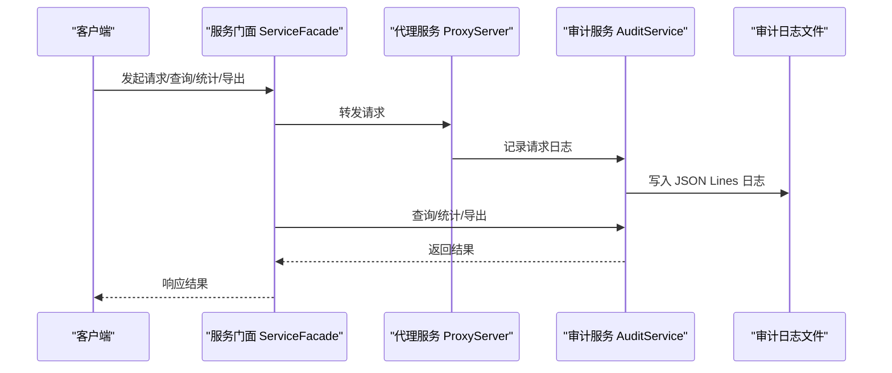
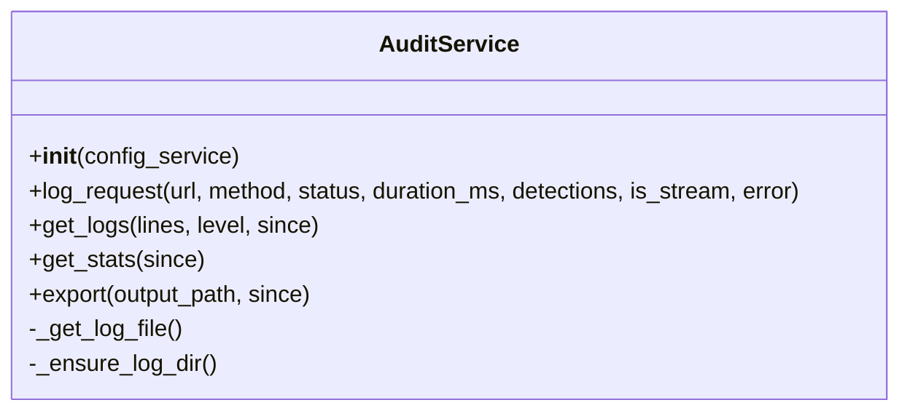
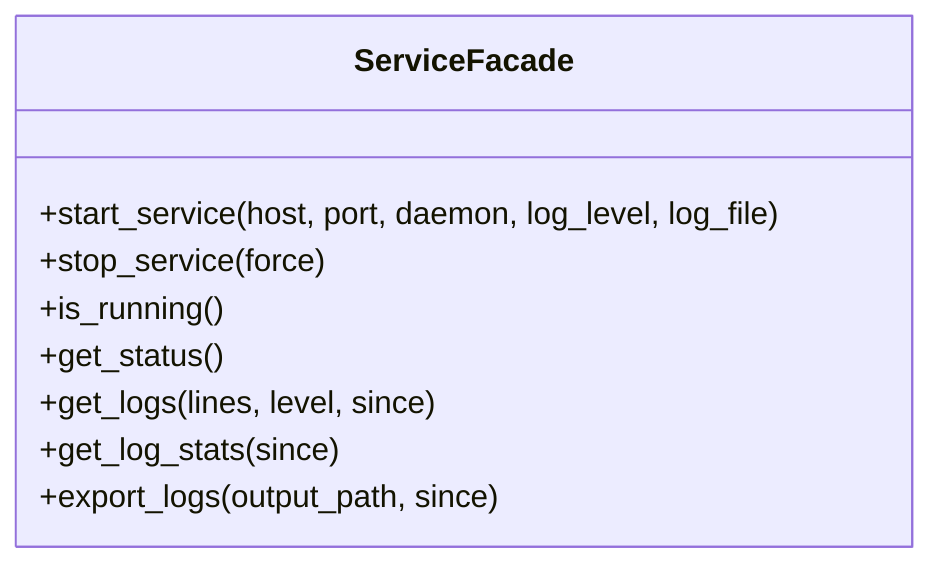
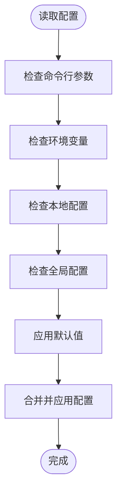
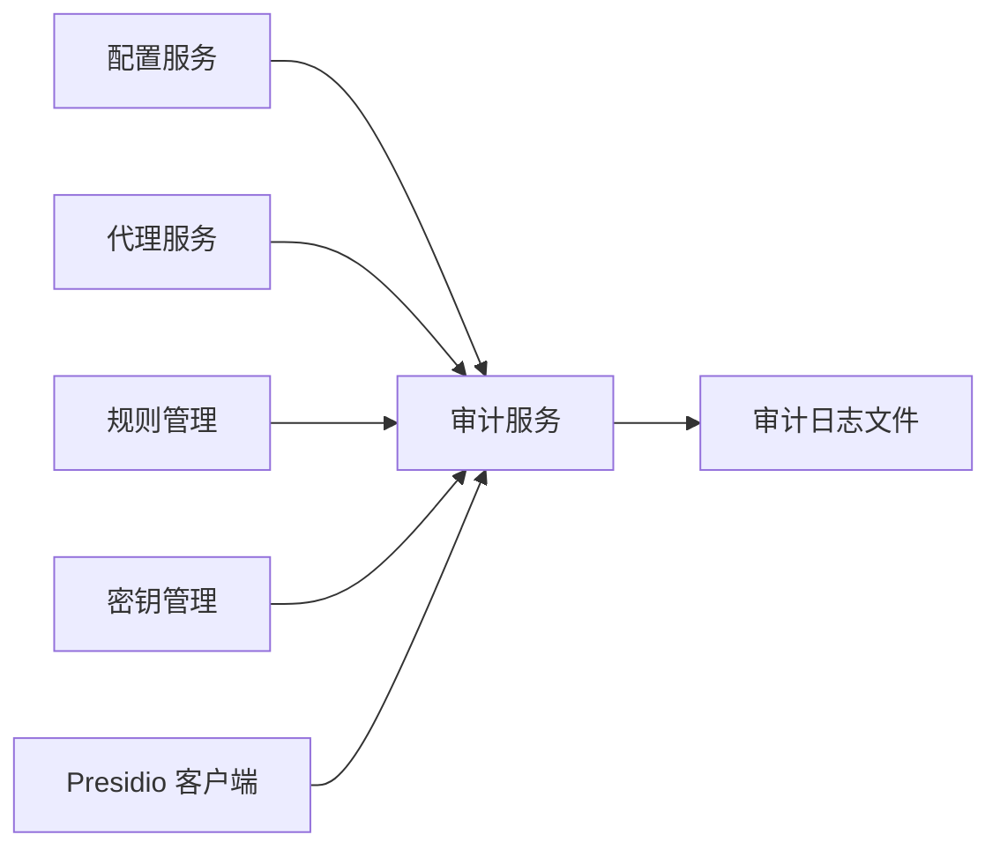

# 审计日志系统

<cite>
**本文引用的文件**
- [审计日志测试用例](file://doc/test/tcs/v1.0/06_audit_logging.md)
- [审计日志测试数据](file://doc/test/tcs/v1.0/06_audit_logging_testdata.md)
- [配置测试数据](file://doc/test/tcs/v1.0/07_configuration_testdata.md)
- [配置测试用例](file://doc/test/tcs/v1.0/07_configuration.md)
- [设计文档](file://doc/design/design-update-20260404-v1.0-init.md)
- [PII检测测试用例](file://doc/test/tcs/v1.0/04_pii_detection.md)
- [PII检测测试数据](file://doc/test/tcs/v1.0/04_pii_detection_testdata.md)
</cite>

## 目录
1. [简介](#简介)
2. [项目结构](#项目结构)
3. [核心组件](#核心组件)
4. [架构概览](#架构概览)
5. [详细组件分析](#详细组件分析)
6. [依赖关系分析](#依赖关系分析)
7. [性能考量](#性能考量)
8. [故障排除指南](#故障排除指南)
9. [结论](#结论)
10. [附录](#附录)

## 简介
本文件面向 LLM Privacy Gateway 的审计日志系统，系统性阐述日志记录机制、审计条目结构与存储方式、查询与统计能力、导出与分析方法、安全监控与合规应用、以及日志管理最佳实践。文档基于仓库中的测试用例与设计文档，结合实际实现细节，帮助开发者与运维人员快速理解并高效使用审计日志功能。

## 项目结构
围绕审计日志系统的关键文件与职责如下：
- 设计与实现
  - 审计服务类：负责日志记录、查询、统计与导出
  - 服务门面：统一对外接口，协调各子系统
  - 配置系统：集中管理日志级别、文件路径、轮转策略等
- 测试与验证
  - 审计日志黑盒测试用例：覆盖记录、查询、统计、导出、清理、格式与性能
  - 审计日志测试数据：提供字段、格式、边界与性能等详尽测试样例
  - 配置测试用例与数据：验证日志级别、文件路径、轮转参数等配置项
  - PII检测测试用例与数据：支撑审计日志中 PII 检测与脱敏记录

图示来源
- [设计文档:1441-1452](file://doc/design/design-update-20260404-v1.0-init.md#L1441-L1452)
- [设计文档:411-480](file://doc/design/design-update-20260404-v1.0-init.md#L411-L480)

章节来源
- [设计文档:1441-1452](file://doc/design/design-update-20260404-v1.0-init.md#L1441-L1452)
- [设计文档:411-480](file://doc/design/design-update-20260404-v1.0-init.md#L411-L480)

## 核心组件
- 审计服务（AuditService）
  - 职责：记录请求处理日志、查询与统计、导出日志、管理日志文件
  - 关键能力：日志条目构建、时间戳与耗时记录、PII 检测与脱敏记录、错误信息记录
- 服务门面（ServiceFacade）
  - 职责：统一 CLI 与业务调用入口，协调审计服务与其他核心组件
  - 接口：提供日志查询、统计、导出等便捷方法
- 配置系统（ConfigService）
  - 职责：集中管理日志级别、审计日志文件路径、轮转参数、保留天数等
  - 影响：决定审计日志的输出位置、格式与生命周期

章节来源
- [设计文档:1441-1452](file://doc/design/design-update-20260404-v1.0-init.md#L1441-L1452)
- [设计文档:411-480](file://doc/design/design-update-20260404-v1.0-init.md#L411-L480)
- [设计文档:1931-2013](file://doc/design/design-update-20260404-v1.0-init.md#L1931-L2013)

## 架构概览
审计日志系统在代理服务运行期间，对每个请求进行审计记录，并将结构化日志写入 JSON Lines 文件。服务门面提供统一查询与统计接口，配置系统控制日志级别与文件策略。

图示来源
- [设计文档:411-480](file://doc/design/design-update-20260404-v1.0-init.md#L411-L480)
- [设计文档:1441-1452](file://doc/design/design-update-20260404-v1.0-init.md#L1441-L1452)

## 详细组件分析

### 审计服务（AuditService）
- 日志记录
  - 条目字段：时间戳、URL、方法、状态码、耗时、PII 检测结果、是否流式、错误信息等
  - 写入策略：采用 JSON Lines 格式，逐条追加，便于流式处理与解析
- 日志查询
  - 支持按时间范围、日志级别、关键词、组合条件等过滤
  - 支持限制返回条数与分页
- 日志统计
  - 统计总量、成功/失败数、平均耗时、PII 类型分布、脱敏操作分布等
  - 支持按时间粒度（小时/天/周）聚合
- 日志导出
  - 支持 JSON、JSONL、压缩 JSON 等格式
  - 支持指定时间范围导出
- 日志清理
  - 支持按时间阈值清理旧日志
  - 支持自动轮转与保留策略

图示来源
- [设计文档:1441-1452](file://doc/design/design-update-20260404-v1.0-init.md#L1441-L1452)

章节来源
- [审计日志测试用例:7-86](file://doc/test/tcs/v1.0/06_audit_logging.md#L7-L86)
- [审计日志测试用例:87-166](file://doc/test/tcs/v1.0/06_audit_logging.md#L87-L166)
- [审计日志测试用例:167-246](file://doc/test/tcs/v1.0/06_audit_logging.md#L167-L246)
- [审计日志测试用例:247-287](file://doc/test/tcs/v1.0/06_audit_logging.md#L247-L287)
- [审计日志测试用例:288-328](file://doc/test/tcs/v1.0/06_audit_logging.md#L288-L328)
- [审计日志测试用例:370-410](file://doc/test/tcs/v1.0/06_audit_logging.md#L370-L410)
- [审计日志测试数据:297-494](file://doc/test/tcs/v1.0/06_audit_logging_testdata.md#L297-L494)

### 服务门面（ServiceFacade）
- 统一入口：对外暴露日志查询、统计、导出等方法
- 依赖注入：将审计服务与代理服务、规则管理、密钥管理、Presidio 客户端整合

图示来源
- [设计文档:411-480](file://doc/design/design-update-20260404-v1.0-init.md#L411-L480)

章节来源
- [设计文档:411-480](file://doc/design/design-update-20260404-v1.0-init.md#L411-L480)

### 配置系统（ConfigService）
- 日志配置项
  - 日志级别、文件路径、最大文件大小、保留文件数量、格式
  - 审计日志专用配置：启用开关、日志文件路径、保留天数
- 配置优先级
  - 命令行参数 > 环境变量 > 本地配置 > 全局配置 > 默认值

图示来源
- [设计文档:1931-2013](file://doc/design/design-update-20260404-v1.0-init.md#L1931-L2013)
- [配置测试数据:635-745](file://doc/test/tcs/v1.0/07_configuration_testdata.md#L635-L745)

章节来源
- [设计文档:1931-2013](file://doc/design/design-update-20260404-v1.0-init.md#L1931-L2013)
- [配置测试数据:198-245](file://doc/test/tcs/v1.0/07_configuration_testdata.md#L198-L245)
- [配置测试数据:635-745](file://doc/test/tcs/v1.0/07_configuration_testdata.md#L635-L745)

### PII 检测与脱敏在审计中的体现
- 审计日志包含 PII 检测结果与脱敏操作记录，支撑合规与安全审计
- 测试用例覆盖多种实体类型（邮箱、电话、身份证、信用卡、地址、人名）与脱敏策略（mask、replace、hash、redact）

章节来源
- [审计日志测试数据:165-232](file://doc/test/tcs/v1.0/06_audit_logging_testdata.md#L165-L232)
- [PII检测测试用例:104-146](file://doc/test/tcs/v1.0/04_pii_detection.md#L104-L146)
- [PII检测测试用例:194-206](file://doc/test/tcs/v1.0/04_pii_detection.md#L194-L206)
- [PII检测测试用例:211-268](file://doc/test/tcs/v1.0/04_pii_detection.md#L211-L268)
- [PII检测测试用例:348-375](file://doc/test/tcs/v1.0/04_pii_detection.md#L348-L375)

## 依赖关系分析
- 审计服务依赖配置服务确定日志文件路径与轮转策略
- 代理服务在请求处理完成后调用审计服务记录日志
- 规则管理与密钥管理在请求处理过程中可能触发 PII 检测与脱敏，审计服务记录相应结果
- Presidio 客户端用于 PII 检测，其结果作为审计日志的一部分

图示来源
- [设计文档:1441-1452](file://doc/design/design-update-20260404-v1.0-init.md#L1441-L1452)
- [设计文档:411-480](file://doc/design/design-update-20260404-v1.0-init.md#L411-L480)

章节来源
- [设计文档:1441-1452](file://doc/design/design-update-20260404-v1.0-init.md#L1441-L1452)
- [设计文档:411-480](file://doc/design/design-update-20260404-v1.0-init.md#L411-L480)

## 性能考量
- 写入性能
  - JSON Lines 追加写入，避免随机 IO；建议合理设置文件大小上限与轮转策略
  - 大量并发请求下，关注磁盘吞吐与锁竞争
- 查询性能
  - 支持按时间范围、级别、关键词过滤；建议对关键字段建立索引或采用流式解析
  - 对大数据量查询，建议分页与限制返回条数
- 导出性能
  - 支持 JSON、JSONL、压缩 JSON 等格式；压缩导出会增加 CPU 开销
- 资源占用
  - 控制日志文件数量与大小，避免磁盘空间压力

章节来源
- [审计日志测试用例:370-410](file://doc/test/tcs/v1.0/06_audit_logging.md#L370-L410)
- [审计日志测试数据:713-732](file://doc/test/tcs/v1.0/06_audit_logging_testdata.md#L713-L732)

## 故障排除指南
- 日志文件无法写入
  - 检查文件路径是否存在、权限是否足够、磁盘空间是否充足
  - 参考配置测试数据中的文件路径与权限校验用例
- 日志轮转异常
  - 检查最大文件大小与保留文件数量配置是否合理
  - 确认轮转策略与审计日志保留天数设置
- 查询结果为空
  - 检查时间范围、日志级别与关键词是否匹配
  - 确认审计服务是否已启用且正在记录日志
- 导出失败
  - 检查输出路径权限与磁盘空间
  - 确认导出格式与目标文件扩展名匹配

章节来源
- [配置测试数据:198-245](file://doc/test/tcs/v1.0/07_configuration_testdata.md#L198-L245)
- [配置测试数据:246-262](file://doc/test/tcs/v1.0/07_configuration_testdata.md#L246-L262)
- [审计日志测试用例:288-328](file://doc/test/tcs/v1.0/06_audit_logging.md#L288-L328)
- [审计日志测试用例:247-287](file://doc/test/tcs/v1.0/06_audit_logging.md#L247-L287)

## 结论
LLM Privacy Gateway 的审计日志系统以结构化 JSON Lines 为核心，提供完善的日志记录、查询、统计、导出与清理能力，并与 PII 检测与脱敏流程深度集成，满足安全监控与合规需求。通过合理的配置与轮转策略，可在保证性能的同时维持长期可追溯的日志体系。

## 附录

### 审计条目结构与字段
- 基础字段：时间戳、URL、方法、状态码、耗时
- PII 字段：检测结果、脱敏是否应用、原始长度、脱敏后长度
- 错误字段：错误类型、消息、堆栈信息
- 元数据：请求 ID、追踪 ID、跨度 ID、客户端 IP/端口、用户代理、请求/响应头与体大小、缓存命中、重试次数、熔断器状态、限流剩余与重置时间、标签与元数据

章节来源
- [审计日志测试数据:297-494](file://doc/test/tcs/v1.0/06_audit_logging_testdata.md#L297-L494)

### 查询与统计示例
- 查询最近 N 条日志：支持按时间范围、级别、关键词过滤
- 统计指标：总请求数、成功/失败数、平均耗时、PII 类型分布、脱敏操作分布
- 导出格式：JSON、JSONL、压缩 JSON；支持指定时间范围导出

章节来源
- [审计日志测试用例:87-166](file://doc/test/tcs/v1.0/06_audit_logging.md#L87-L166)
- [审计日志测试用例:167-246](file://doc/test/tcs/v1.0/06_audit_logging.md#L167-L246)
- [审计日志测试用例:247-287](file://doc/test/tcs/v1.0/06_audit_logging.md#L247-L287)

### 日志管理最佳实践
- 启用审计日志：在配置中开启审计并设置合适的日志级别
- 合理设置轮转：控制单文件大小与保留文件数量，结合保留天数清理旧日志
- 分离存储：将审计日志与应用日志分离，便于维护与分析
- 安全与合规：对敏感字段进行脱敏处理，遵循最小披露原则
- 性能优化：在高并发场景下，选择合适导出格式与分页策略

章节来源
- [设计文档:1931-2013](file://doc/design/design-update-20260404-v1.0-init.md#L1931-L2013)
- [配置测试数据:207-245](file://doc/test/tcs/v1.0/07_configuration_testdata.md#L207-L245)