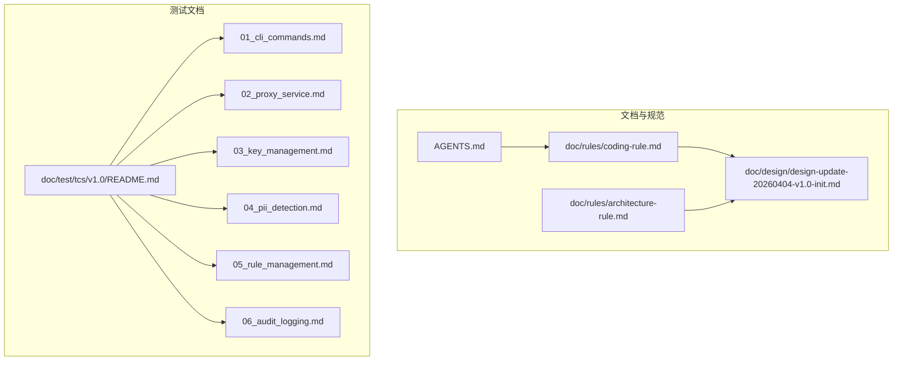
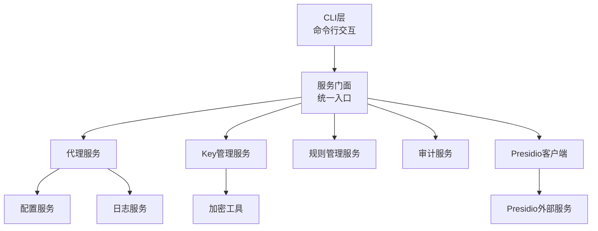
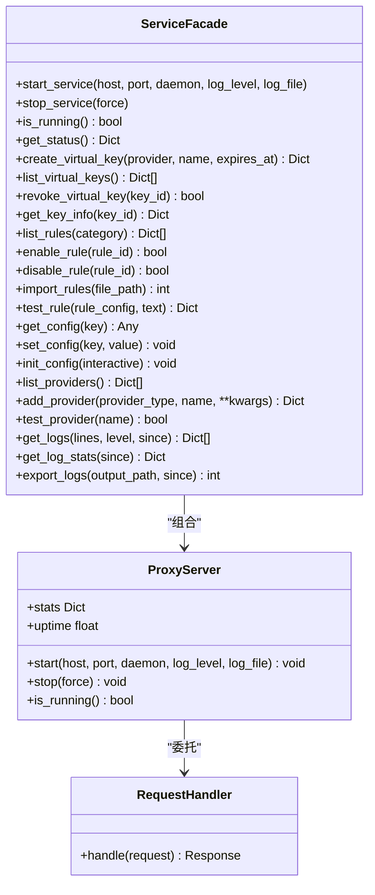
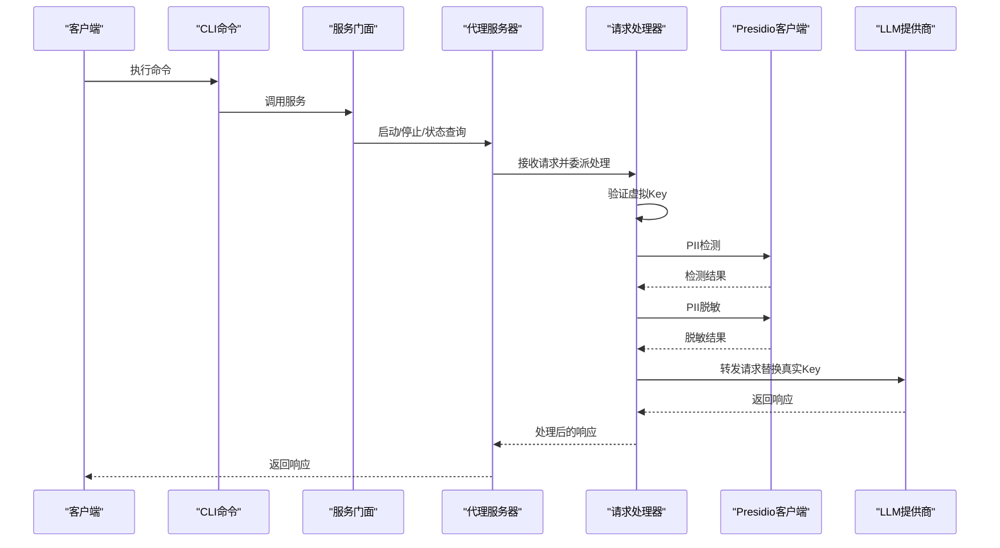
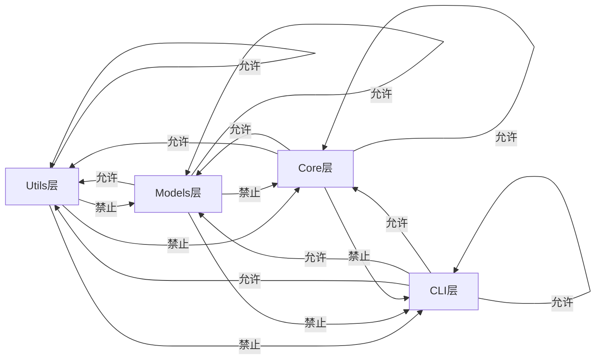

# 开发者指南

<cite>
**本文档引用的文件**
- [AGENTS.md](file://AGENTS.md)
- [doc/rules/coding-rule.md](file://doc/rules/coding-rule.md)
- [doc/rules/architecture-rule.md](file://doc/rules/architecture-rule.md)
- [doc/design/design-update-20260404-v1.0-init.md](file://doc/design/design-update-20260404-v1.0-init.md)
- [doc/test/tcs/v1.0/README.md](file://doc/test/tcs/v1.0/README.md)
- [doc/test/tcs/v1.0/01_cli_commands.md](file://doc/test/tcs/v1.0/01_cli_commands.md)
- [doc/test/tcs/v1.0/02_proxy_service.md](file://doc/test/tcs/v1.0/02_proxy_service.md)
- [doc/test/tcs/v1.0/03_key_management.md](file://doc/test/tcs/v1.0/03_key_management.md)
- [doc/test/tcs/v1.0/04_pii_detection.md](file://doc/test/tcs/v1.0/04_pii_detection.md)
- [doc/test/tcs/v1.0/05_rule_management.md](file://doc/test/tcs/v1.0/05_rule_management.md)
- [doc/test/tcs/v1.0/06_audit_logging.md](file://doc/test/tcs/v1.0/06_audit_logging.md)
</cite>

## 目录
1. [简介](#简介)
2. [项目结构](#项目结构)
3. [核心组件](#核心组件)
4. [架构总览](#架构总览)
5. [详细组件分析](#详细组件分析)
6. [依赖分析](#依赖分析)
7. [性能考量](#性能考量)
8. [故障排查指南](#故障排查指南)
9. [结论](#结论)
10. [附录](#附录)

## 简介
本指南面向LLM Privacy Gateway项目的开发者，提供从代码规范、架构规则、模块组织到测试与调试的完整开发手册。文档基于仓库内的编码规范、架构规则与设计文档，结合测试用例文档，帮助不同经验水平的开发者快速上手并高质量交付。

## 项目结构
项目采用分层架构与模块化组织，核心目录与职责如下：
- doc/：设计文档、规则文档、测试用例文档
- AGENTS.md：编码规范速查与示例
- doc/rules/：编码规范与架构分层规则
- doc/design/：系统设计文档
- doc/test/tcs/v1.0/：v1.0测试用例与测试数据

图表来源
- [doc/rules/coding-rule.md:1-120](file://doc/rules/coding-rule.md#L1-L120)
- [doc/rules/architecture-rule.md:1-120](file://doc/rules/architecture-rule.md#L1-L120)
- [doc/design/design-update-20260404-v1.0-init.md:1-120](file://doc/design/design-update-20260404-v1.0-init.md#L1-L120)
- [doc/test/tcs/v1.0/README.md:1-120](file://doc/test/tcs/v1.0/README.md#L1-L120)

章节来源
- [doc/test/tcs/v1.0/README.md:1-120](file://doc/test/tcs/v1.0/README.md#L1-L120)
- [doc/design/design-update-20260404-v1.0-init.md:1-120](file://doc/design/design-update-20260404-v1.0-init.md#L1-L120)

## 核心组件
- CLI层：命令行交互、参数解析、结果输出与错误提示
- Core层：核心业务逻辑、服务编排、外部服务集成
- Models层：数据模型与验证规则
- Utils层：通用工具函数与基础设施

章节来源
- [doc/rules/architecture-rule.md:86-478](file://doc/rules/architecture-rule.md#L86-L478)
- [doc/design/design-update-20260404-v1.0-init.md:70-162](file://doc/design/design-update-20260404-v1.0-init.md#L70-L162)

## 架构总览
系统采用三层分层与服务门面模式，CLI通过门面访问Core服务，Core层协调各子服务（代理、Key管理、规则、审计、Presidio集成），并通过配置与日志等基础设施支撑。

图表来源
- [doc/design/design-update-20260404-v1.0-init.md:124-160](file://doc/design/design-update-20260404-v1.0-init.md#L124-L160)
- [doc/design/design-update-20260404-v1.0-init.md:411-568](file://doc/design/design-update-20260404-v1.0-init.md#L411-L568)

## 详细组件分析

### 编码规范与最佳实践
- 基本原则：可读性优先、显式优于隐式、简单优于复杂、一致性、单一职责
- 代码格式：行长度≤100字符、缩进4空格、优先使用双引号、合理空行
- 命名规范：模块/包snake_case；类PascalCase；异常类PascalCase+Error；函数/方法snake_case；变量snake_case；常量UPPER_SNAKE_CASE；私有成员_前缀
- 类型注解：公共接口必须有完整类型注解；推荐使用Pydantic模型
- 文档字符串：Google风格；模块/类/公共函数必须有docstring
- 导入规范：标准库→第三方→本地模块；禁止通配导入；推荐绝对导入
- 函数与方法：单一职责、参数数量≤5、建议函数长度≤50行、避免返回None表示错误
- 类设计：构造函数注入依赖；使用Protocol定义接口；类组织顺序明确
- 异步编程：I/O密集使用async/await；CPU密集考虑线程池；避免阻塞调用
- 错误处理：使用具体异常类型；捕获具体异常；保留异常链
- 日志规范：DEBUG/INFO/WARNING/ERROR/CRITICAL；带上下文日志；异常自动记录堆栈
- Presidio集成：封装HTTP调用；处理连接错误与超时；配置驱动
- 测试规范：测试文件组织、命名、fixtures、异步测试、覆盖率要求

章节来源
- [AGENTS.md:9-127](file://AGENTS.md#L9-L127)
- [doc/rules/coding-rule.md:31-94](file://doc/rules/coding-rule.md#L31-L94)
- [doc/rules/coding-rule.md:115-173](file://doc/rules/coding-rule.md#L115-L173)
- [doc/rules/coding-rule.md:176-283](file://doc/rules/coding-rule.md#L176-L283)
- [doc/rules/coding-rule.md:286-400](file://doc/rules/coding-rule.md#L286-L400)
- [doc/rules/coding-rule.md:402-458](file://doc/rules/coding-rule.md#L402-L458)
- [doc/rules/coding-rule.md:461-541](file://doc/rules/coding-rule.md#L461-L541)
- [doc/rules/coding-rule.md:544-650](file://doc/rules/coding-rule.md#L544-L650)
- [doc/rules/coding-rule.md:652-722](file://doc/rules/coding-rule.md#L652-L722)
- [doc/rules/coding-rule.md:725-800](file://doc/rules/coding-rule.md#L725-L800)

### 架构分层与设计模式
- 分层目标：职责清晰、易于测试、便于维护、支持复用、降低耦合
- 层间依赖：CLI→Core→Models→Utils；禁止跨层直接调用
- 设计模式：服务门面（统一入口）、依赖注入（构造函数注入）、Protocol接口定义、异步上下文管理器
- 循环依赖：禁止任何形式；通过接口解耦

图表来源
- [doc/design/design-update-20260404-v1.0-init.md:411-568](file://doc/design/design-update-20260404-v1.0-init.md#L411-L568)
- [doc/design/design-update-20260404-v1.0-init.md:570-741](file://doc/design/design-update-20260404-v1.0-init.md#L570-L741)

章节来源
- [doc/rules/architecture-rule.md:22-83](file://doc/rules/architecture-rule.md#L22-L83)
- [doc/rules/architecture-rule.md:544-651](file://doc/rules/architecture-rule.md#L544-L651)
- [doc/design/design-update-20260404-v1.0-init.md:411-568](file://doc/design/design-update-20260404-v1.0-init.md#L411-L568)

### 请求处理流程（端到端）

图表来源
- [doc/design/design-update-20260404-v1.0-init.md:162-250](file://doc/design/design-update-20260404-v1.0-init.md#L162-L250)

章节来源
- [doc/design/design-update-20260404-v1.0-init.md:162-250](file://doc/design/design-update-20260404-v1.0-init.md#L162-L250)

### 测试策略与用例覆盖
- 测试类型：黑盒测试，覆盖CLI命令、代理服务、Key管理、PII检测脱敏、规则管理、审计日志、配置管理、端到端集成
- 用例数量：v1.0总计270个用例，测试数据约1226条
- 优先级：P0（核心功能，阻塞发布）占53%，P1（重要功能）占47%
- 执行方式：手动/自动化；支持pytest与覆盖率报告

章节来源
- [doc/test/tcs/v1.0/README.md:1-185](file://doc/test/tcs/v1.0/README.md#L1-L185)

## 依赖分析
- 层间依赖矩阵：Utils允许依赖自身；Models允许依赖Utils；Core允许依赖Utils与Models；CLI允许依赖Core与Models
- 依赖注入：通过构造函数注入，避免在方法内部创建依赖
- 跨层调用：禁止跳过中间层直接调用
- 循环依赖：禁止任何形式；通过Protocol接口解耦

图表来源
- [doc/rules/architecture-rule.md:546-558](file://doc/rules/architecture-rule.md#L546-L558)

章节来源
- [doc/rules/architecture-rule.md:544-651](file://doc/rules/architecture-rule.md#L544-L651)

## 性能考量
- 异步I/O：代理与外部服务调用使用异步模式，避免阻塞
- 资源管理：AppRunner生命周期管理、健康检查端点
- 统计指标：请求总量、成功/失败计数、PII检测数、平均延迟、运行时间
- 并发处理：支持并发请求与流式响应处理

章节来源
- [doc/design/design-update-20260404-v1.0-init.md:570-741](file://doc/design/design-update-20260404-v1.0-init.md#L570-L741)
- [doc/test/tcs/v1.0/02_proxy_service.md:1-200](file://doc/test/tcs/v1.0/02_proxy_service.md#L1-L200)

## 故障排查指南
- CLI命令测试：覆盖帮助信息、版本信息、无效选项、启动/停止/状态查询等
- 代理服务测试：覆盖启动/停止、端口/Host配置、后台模式、健康检查、流式响应、错误处理、并发与统计
- Key管理测试：覆盖创建/解析/列表/详情/吊销/过期处理、权限与多提供商映射
- PII检测脱敏测试：覆盖多实体类型、多语言、混合内容、边界情况
- 规则管理测试：覆盖加载、列表、启用/禁用、导入、测试与配置
- 审计日志测试：覆盖记录、查询、统计、导出、清理与格式

章节来源
- [doc/test/tcs/v1.0/01_cli_commands.md:1-200](file://doc/test/tcs/v1.0/01_cli_commands.md#L1-L200)
- [doc/test/tcs/v1.0/02_proxy_service.md:1-200](file://doc/test/tcs/v1.0/02_proxy_service.md#L1-L200)
- [doc/test/tcs/v1.0/03_key_management.md:1-200](file://doc/test/tcs/v1.0/03_key_management.md#L1-L200)
- [doc/test/tcs/v1.0/04_pii_detection.md:1-200](file://doc/test/tcs/v1.0/04_pii_detection.md#L1-L200)
- [doc/test/tcs/v1.0/05_rule_management.md:1-200](file://doc/test/tcs/v1.0/05_rule_management.md#L1-L200)
- [doc/test/tcs/v1.0/06_audit_logging.md:1-200](file://doc/test/tcs/v1.0/06_audit_logging.md#L1-L200)

## 结论
本指南基于仓库现有文档，系统梳理了LLM Privacy Gateway的编码规范、架构规则、模块组织与测试策略。建议开发者在开发过程中严格遵循分层与依赖约束，使用类型注解与文档字符串提升可读性与可维护性，并结合测试用例文档进行端到端验证与回归测试。

## 附录
- 开发环境建议：Python 3.10+，安装依赖后使用Black/Ruff/Mypy进行格式化与静态检查
- 测试执行：pytest tests/ 与 pytest --cov=lpg --cov-report=html 生成覆盖率报告
- 贡献流程：遵循Git提交规范（feat/fix/docs/refactor/perf/test/chore/ci），通过代码审查与测试验证

章节来源
- [doc/rules/coding-rule.md:55-94](file://doc/rules/coding-rule.md#L55-L94)
- [doc/test/tcs/v1.0/README.md:134-162](file://doc/test/tcs/v1.0/README.md#L134-L162)