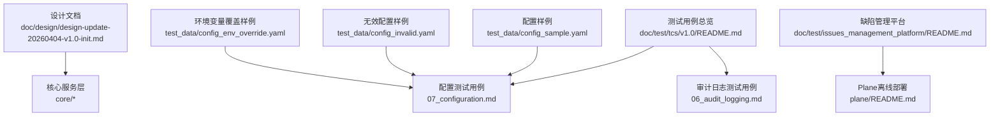
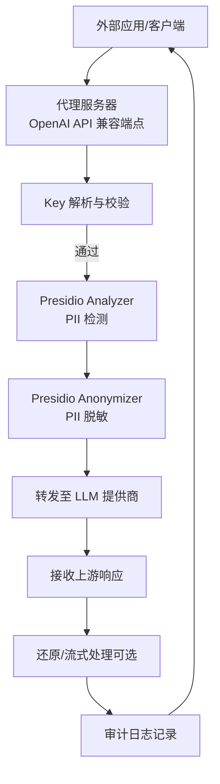
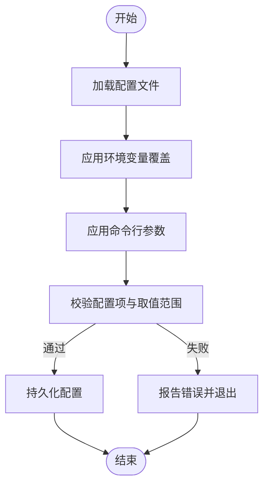
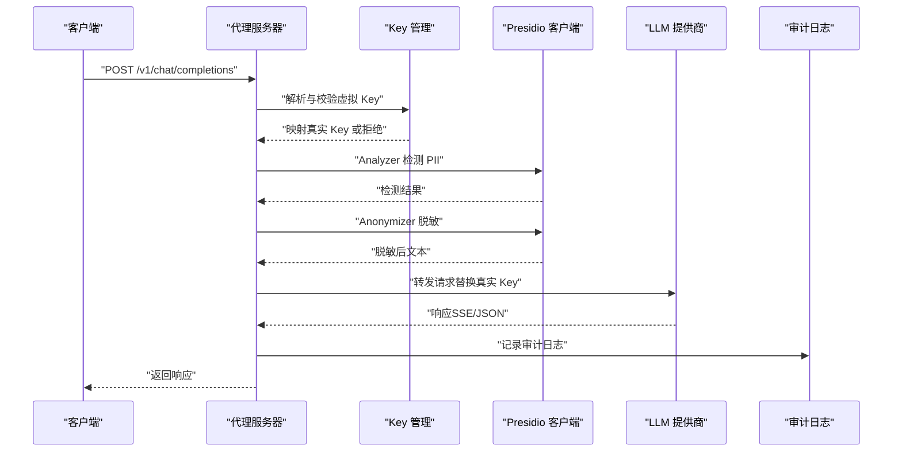
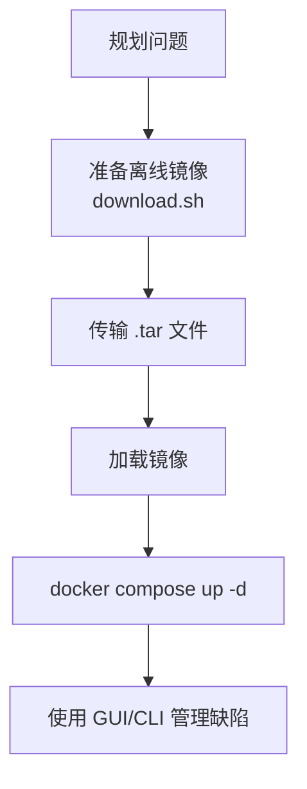
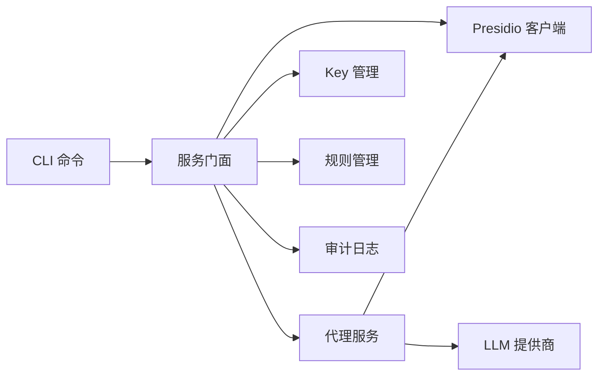

# 故障排除与常见问题

<cite>
**本文引用的文件**
- [AGENTS.md](file://AGENTS.md)
- [design-update-20260404-v1.0-init.md](file://doc/design/design-update-20260404-v1.0-init.md)
- [07_configuration_testdata.md](file://doc/test/tcs/v1.0/test_data/config_env_override.yaml)
- [config_invalid.yaml](file://doc/test/tcs/v1.0/test_data/config_invalid.yaml)
- [config_sample.yaml](file://doc/test/tcs/v1.0/test_data/config_sample.yaml)
- [07_configuration.md](file://doc/test/tcs/v1.0/07_configuration.md)
- [06_audit_logging.md](file://doc/test/tcs/v1.0/06_audit_logging.md)
- [06_audit_logging_testdata.md](file://doc/test/tcs/v1.0/06_audit_logging_testdata.md)
- [08_e2e_integration_testdata.md](file://doc/test/tcs/v1.0/08_e2e_integration_testdata.md)
- [README.md（测试用例总览）](file://doc/test/tcs/v1.0/README.md)
- [README.md（缺陷管理平台）](file://doc/test/issues_management_platform/README.md)
- [plane/README.md](file://doc/test/issues_management_platform/plane/README.md)
- [download.sh](file://doc/test/issues_management_platform/plane/images/download.sh)
</cite>

## 目录
1. [简介](#简介)
2. [项目结构](#项目结构)
3. [核心组件](#核心组件)
4. [架构总览](#架构总览)
5. [详细组件分析](#详细组件分析)
6. [依赖分析](#依赖分析)
7. [性能考量](#性能考量)
8. [故障排除指南](#故障排除指南)
9. [结论](#结论)
10. [附录](#附录)

## 简介
本指南面向最终用户与运维人员，聚焦 LLM Privacy Gateway（隐私保护网关）在使用与运维过程中的常见问题、系统化诊断方法、调试技巧、性能优化建议、错误信息解读以及不同环境下的注意事项。文档基于仓库内的设计文档、测试用例与配置样例进行归纳总结，并提供问题报告模板与社区支持资源。

## 项目结构
- 顶层包含设计文档、测试用例与缺陷管理平台说明。
- 设计文档给出整体架构、模块职责与数据流；测试用例文档覆盖配置、审计日志、端到端集成等关键路径。
- 缺陷管理平台提供离线部署与 CLI 使用说明，便于问题跟踪与反馈。

**图示来源**
- [design-update-20260404-v1.0-init.md](file://doc/design/design-update-20260404-v1.0-init.md)
- [README.md（测试用例总览）](file://doc/test/tcs/v1.0/README.md)
- [07_configuration.md](file://doc/test/tcs/v1.0/07_configuration.md)
- [06_audit_logging.md](file://doc/test/tcs/v1.0/06_audit_logging.md)
- [README.md（缺陷管理平台）](file://doc/test/issues_management_platform/README.md)
- [plane/README.md](file://doc/test/issues_management_platform/plane/README.md)
- [config_sample.yaml](file://doc/test/tcs/v1.0/test_data/config_sample.yaml)
- [config_invalid.yaml](file://doc/test/tcs/v1.0/test_data/config_invalid.yaml)
- [07_configuration_testdata.md](file://doc/test/tcs/v1.0/test_data/config_env_override.yaml)

**章节来源**
- [design-update-20260404-v1.0-init.md](file://doc/design/design-update-20260404-v1.0-init.md)
- [README.md（测试用例总览）](file://doc/test/tcs/v1.0/README.md)

## 核心组件
- CLI 层：提供启动、停止、状态、配置、Key 管理、规则管理、提供商管理、日志查看等命令。
- 服务门面：统一对外暴露服务，屏蔽内部依赖关系，便于扩展。
- 代理服务：HTTP 代理服务器，负责接收请求、鉴权、PII 检测与脱敏、转发上游、响应处理与审计日志。
- Key 管理：虚拟 Key 的生成、解析、映射与吊销。
- 规则管理：规则加载、启用/禁用、导入与测试。
- 审计日志：请求处理记录，支持查询、统计、导出与清理。
- 配置服务：YAML 配置、环境变量覆盖、命令行参数优先级、提供商配置维护。
- Presidio 集成：PII 检测与脱敏的 HTTP 客户端封装。

**章节来源**
- [design-update-20260404-v1.0-init.md](file://doc/design/design-update-20260404-v1.0-init.md)
- [AGENTS.md](file://AGENTS.md)

## 架构总览
下图展示 v1.0 MVP 的端到端请求处理流程，涵盖鉴权、PII 检测/脱敏、上游转发、响应处理与审计日志。

**图示来源**
- [design-update-20260404-v1.0-init.md](file://doc/design/design-update-20260404-v1.0-init.md)

## 详细组件分析

### 配置管理与常见问题
- 配置加载与优先级
  - 优先级：命令行参数 > 环境变量 > 配置文件。
  - 环境变量覆盖示例见“环境变量覆盖样例”。
- 无效配置与边界条件
  - YAML 语法错误、非法数值、类型不匹配、超范围取值等均有测试覆盖。
  - 参考测试数据与用例，定位配置项与取值范围。
- 提供商配置
  - 支持添加、移除、更新与列出提供商；变更后配置文件会持久化。

**图示来源**
- [07_configuration.md](file://doc/test/tcs/v1.0/07_configuration.md)
- [07_configuration_testdata.md](file://doc/test/tcs/v1.0/test_data/config_env_override.yaml)
- [config_invalid.yaml](file://doc/test/tcs/v1.0/test_data/config_invalid.yaml)
- [config_sample.yaml](file://doc/test/tcs/v1.0/test_data/config_sample.yaml)

**章节来源**
- [07_configuration.md](file://doc/test/tcs/v1.0/07_configuration.md)
- [07_configuration_testdata.md](file://doc/test/tcs/v1.0/test_data/config_env_override.yaml)

### 审计日志与性能观测
- 日志记录：正常/异常请求、PII 检测、脱敏操作、耗时、流式请求等。
- 日志查询：按时间范围、级别、关键词组合查询。
- 日志统计：请求数、成功率、PII 类型分布、平均延迟与分位延迟。
- 日志导出：支持导出到 JSON 文件，便于离线分析。
- 性能测试：并发场景、请求间隔、吞吐与延迟基线。

**图示来源**
- [design-update-20260404-v1.0-init.md](file://doc/design/design-update-20260404-v1.0-init.md)
- [06_audit_logging.md](file://doc/test/tcs/v1.0/06_audit_logging.md)

**章节来源**
- [06_audit_logging.md](file://doc/test/tcs/v1.0/06_audit_logging.md)
- [06_audit_logging_testdata.md](file://doc/test/tcs/v1.0/06_audit_logging_testdata.md)
- [08_e2e_integration_testdata.md](file://doc/test/tcs/v1.0/08_e2e_integration_testdata.md)

### 缺陷管理与问题反馈
- 缺陷管理平台采用 Plane，支持离线部署与 CLI 操作。
- 提供镜像下载与加载脚本，便于无网络环境部署。
- CLI 工具可用于创建缺陷、列出任务，便于问题跟踪。

**图示来源**
- [README.md（缺陷管理平台）](file://doc/test/issues_management_platform/README.md)
- [plane/README.md](file://doc/test/issues_management_platform/plane/README.md)
- [download.sh](file://doc/test/issues_management_platform/plane/images/download.sh)

**章节来源**
- [README.md（缺陷管理平台）](file://doc/test/issues_management_platform/README.md)
- [plane/README.md](file://doc/test/issues_management_platform/plane/README.md)

## 依赖分析
- 组件耦合与职责
  - CLI 通过服务门面访问核心服务，降低直接耦合，便于扩展。
  - 代理服务器依赖 Key/规则/审计/Presidio 等服务，形成清晰的职责边界。
- 外部依赖
  - Presidio 服务（Analyzer/Anonymizer），端口 5001。
  - LLM 提供商（如 OpenAI）的 API 端点。
- 配置与环境变量
  - 配置文件、环境变量与命令行参数共同决定运行行为，遵循“命令行 > 环境变量 > 配置文件”的优先级。

**图示来源**
- [design-update-20260404-v1.0-init.md](file://doc/design/design-update-20260404-v1.0-init.md)

**章节来源**
- [design-update-20260404-v1.0-init.md](file://doc/design/design-update-20260404-v1.0-init.md)

## 性能考量
- 并发与延迟
  - 并发场景测试数据提供了不同并发度与请求间隔下的预期成功率与平均延迟，可用于评估系统在压力下的表现。
- 日志性能
  - 大量日志写入与查询性能均有测试关注点，建议结合系统资源监控与日志轮转策略进行优化。
- 配置与超时
  - 合理设置代理超时、最大连接数与日志级别，避免过高的资源占用与阻塞。

**章节来源**
- [08_e2e_integration_testdata.md](file://doc/test/tcs/v1.0/08_e2e_integration_testdata.md)
- [06_audit_logging.md](file://doc/test/tcs/v1.0/06_audit_logging.md)

## 故障排除指南

### 一、启动与运行类问题
- 服务已运行
  - 现象：再次启动时报“已在运行”。
  - 处理：先执行停止命令，再启动；或检查进程 PID 与端口占用。
- 启动失败
  - 现象：启动报错并退出。
  - 处理：查看日志级别与日志文件，确认配置加载与提供商连通性；检查端口占用与权限。

**章节来源**
- [design-update-20260404-v1.0-init.md](file://doc/design/design-update-20260404-v1.0-init.md)

### 二、配置类问题
- 配置文件不存在
  - 现象：提示配置文件不存在。
  - 处理：使用初始化命令生成默认配置，或指定配置路径。
- 配置格式错误
  - 现象：提示配置文件格式错误。
  - 处理：检查 YAML 语法、缩进与键重复；参考无效配置样例定位问题。
- 配置值越界或类型错误
  - 现象：设置端口、超时、连接数等时报错。
  - 处理：核对取值范围与类型；参考配置测试数据进行修正。
- 环境变量覆盖无效
  - 现象：环境变量未生效或被警告。
  - 处理：确认变量名与格式；检查优先级与配置文件中的默认值。

**章节来源**
- [07_configuration.md](file://doc/test/tcs/v1.0/07_configuration.md)
- [config_invalid.yaml](file://doc/test/tcs/v1.0/test_data/config_invalid.yaml)
- [config_sample.yaml](file://doc/test/tcs/v1.0/test_data/config_sample.yaml)
- [07_configuration_testdata.md](file://doc/test/tcs/v1.0/test_data/config_env_override.yaml)

### 三、鉴权与 Key 问题
- 401 未授权
  - 现象：请求返回 401。
  - 处理：确认虚拟 Key 是否存在、是否过期；检查 Key 解析与映射是否正确。
- Key 管理
  - 现象：Key 列表为空或吊销后仍可用。
  - 处理：确认 Key 管理命令执行结果与配置持久化状态。

**章节来源**
- [design-update-20260404-v1.0-init.md](file://doc/design/design-update-20260404-v1.0-init.md)

### 四、PII 检测与脱敏问题
- Presidio 连接失败
  - 现象：检测/脱敏失败并记录错误。
  - 处理：检查 Presidio 服务端点、网络连通性与超时设置；参考 Presidio 集成规范进行排查。
- 脱敏结果异常
  - 现象：脱敏前后文本不一致或策略不生效。
  - 处理：检查规则配置与识别器设置；核对日志中的检测结果与脱敏动作。

**章节来源**
- [design-update-20260404-v1.0-init.md](file://doc/design/design-update-20260404-v1.0-init.md)
- [AGENTS.md](file://AGENTS.md)

### 五、审计日志问题
- 日志缺失或格式异常
  - 现象：查询不到日志或日志格式不符合预期。
  - 处理：确认日志级别、文件路径与轮转策略；检查导出与查询接口。
- 查询性能差
  - 现象：大量日志查询响应缓慢。
  - 处理：优化查询条件（时间范围、级别、关键词）；评估索引与存储性能。

**章节来源**
- [06_audit_logging.md](file://doc/test/tcs/v1.0/06_audit_logging.md)
- [06_audit_logging_testdata.md](file://doc/test/tcs/v1.0/06_audit_logging_testdata.md)

### 六、网络与上游问题
- 上游连接超时/失败
  - 现象：转发请求失败或超时。
  - 处理：检查提供商端点、鉴权头、网络连通性与代理超时设置。
- 流式响应异常
  - 现象：SSE/流式响应中断或乱序。
  - 处理：确认上游支持与代理流式处理逻辑；检查日志中的流式统计。

**章节来源**
- [design-update-20260404-v1.0-init.md](file://doc/design/design-update-20260404-v1.0-init.md)

### 七、不同环境下的注意事项
- macOS/Linux/Windows
  - 注意文件权限、路径分隔符与环境变量格式差异。
- 无网络环境
  - 可使用缺陷管理平台的离线部署方案，提前下载并加载镜像。
- 容器/守护进程
  - 后台运行时注意日志输出与健康检查端点；确保端口与资源限制合理。

**章节来源**
- [README.md（缺陷管理平台）](file://doc/test/issues_management_platform/README.md)
- [plane/README.md](file://doc/test/issues_management_platform/plane/README.md)
- [download.sh](file://doc/test/issues_management_platform/plane/images/download.sh)

### 八、常见错误信息与处理
- “配置文件格式错误”
  - 处理：修正 YAML 语法与缩进；参考无效配置样例。
- “端口必须在 1-65535 之间”
  - 处理：调整端口值至有效范围。
- “超时必须大于 0”
  - 处理：设置合理的超时时间。
- “Key not found / Key expired”
  - 处理：检查 Key 是否存在与有效期；重新生成或延长有效期。
- “Failed to connect to Presidio service / Presidio request timed out”
  - 处理：检查 Presidio 服务状态与网络；调整超时与重试策略。

**章节来源**
- [07_configuration.md](file://doc/test/tcs/v1.0/07_configuration.md)
- [AGENTS.md](file://AGENTS.md)

### 九、调试技巧与工具
- 启用详细日志：通过 CLI 的日志级别选项提升调试粒度。
- 使用健康检查端点：确认服务存活与运行时长。
- 结合审计日志：定位请求耗时、PII 检测与脱敏动作。
- 并发压测：参考端到端测试数据中的并发场景，评估系统上限。

**章节来源**
- [design-update-20260404-v1.0-init.md](file://doc/design/design-update-20260404-v1.0-init.md)
- [06_audit_logging.md](file://doc/test/tcs/v1.0/06_audit_logging.md)
- [08_e2e_integration_testdata.md](file://doc/test/tcs/v1.0/08_e2e_integration_testdata.md)

### 十、问题报告模板与信息收集指南
- 基本信息
  - 系统版本、Python 版本、操作系统类型与架构。
- 环境信息
  - 配置文件内容（脱敏敏感信息）、环境变量、命令行参数。
- 复现步骤
  - 详细的最小复现步骤与请求样例。
- 日志与指标
  - 代理服务日志、审计日志片段、关键指标（耗时、成功率）。
- 附件
  - 配置文件、环境变量快照、导出的日志文件。

**章节来源**
- [07_configuration.md](file://doc/test/tcs/v1.0/07_configuration.md)
- [06_audit_logging.md](file://doc/test/tcs/v1.0/06_audit_logging.md)

## 结论
本指南围绕配置、鉴权、PII 检测/脱敏、审计日志与性能等方面，提供了系统化的故障排除方法与最佳实践。建议在生产环境中结合日志与指标进行持续监控，并利用测试用例与并发场景评估系统性能边界。对于缺陷与问题反馈，可通过缺陷管理平台进行离线跟踪与协作。

## 附录

### 社区支持与问题反馈渠道
- 缺陷管理平台（Plane）离线部署与 CLI 使用说明参见：
  - [缺陷管理平台 README](file://doc/test/issues_management_platform/README.md)
  - [Plane 离线部署 README](file://doc/test/issues_management_platform/plane/README.md)
  - [镜像下载脚本](file://doc/test/issues_management_platform/plane/images/download.sh)

**章节来源**
- [README.md（缺陷管理平台）](file://doc/test/issues_management_platform/README.md)
- [plane/README.md](file://doc/test/issues_management_platform/plane/README.md)
- [download.sh](file://doc/test/issues_management_platform/plane/images/download.sh)