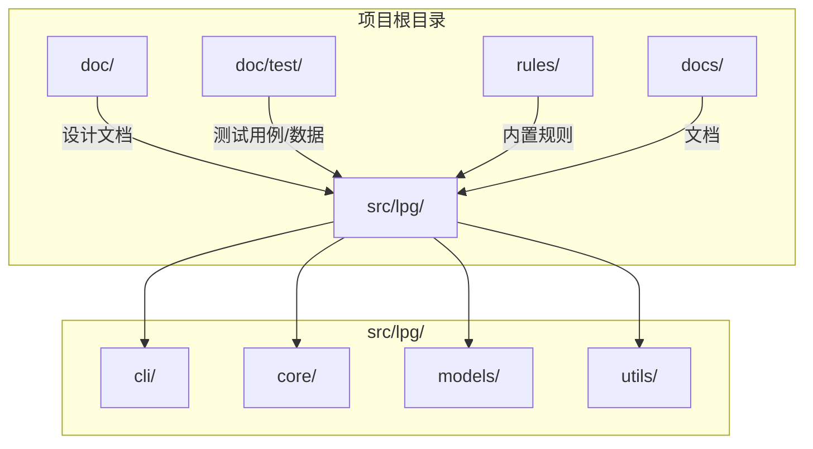
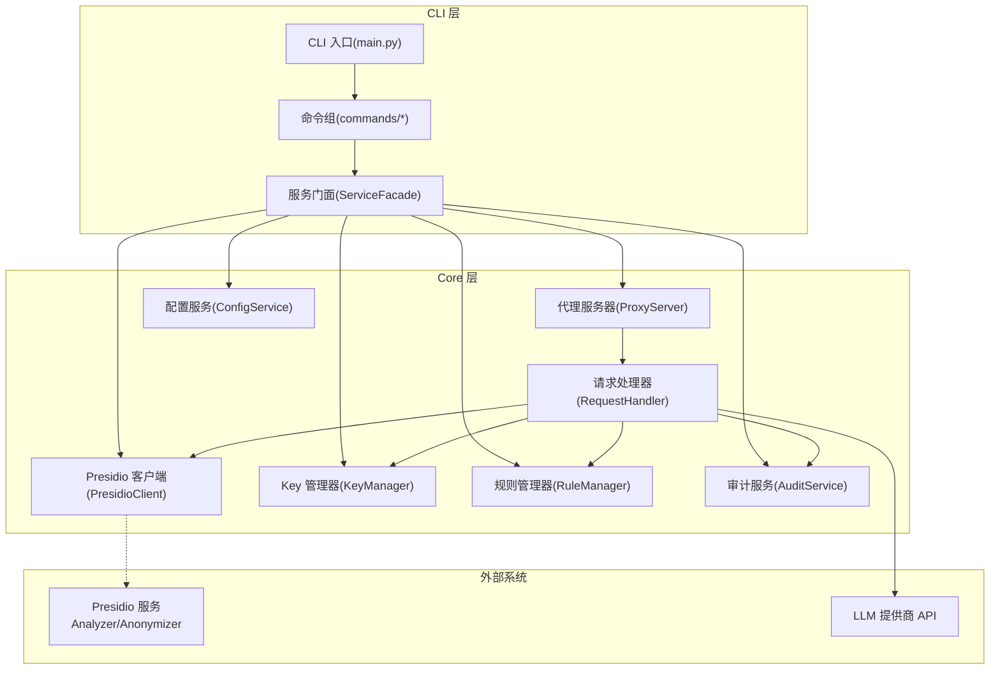
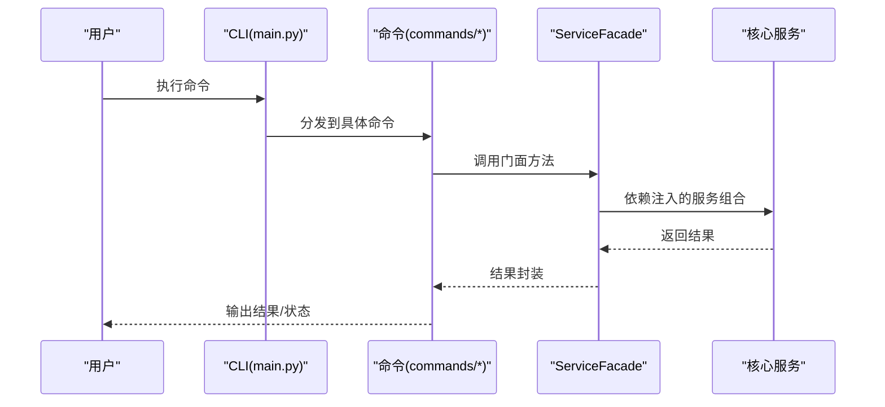
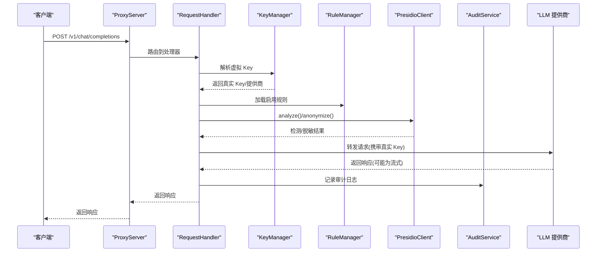
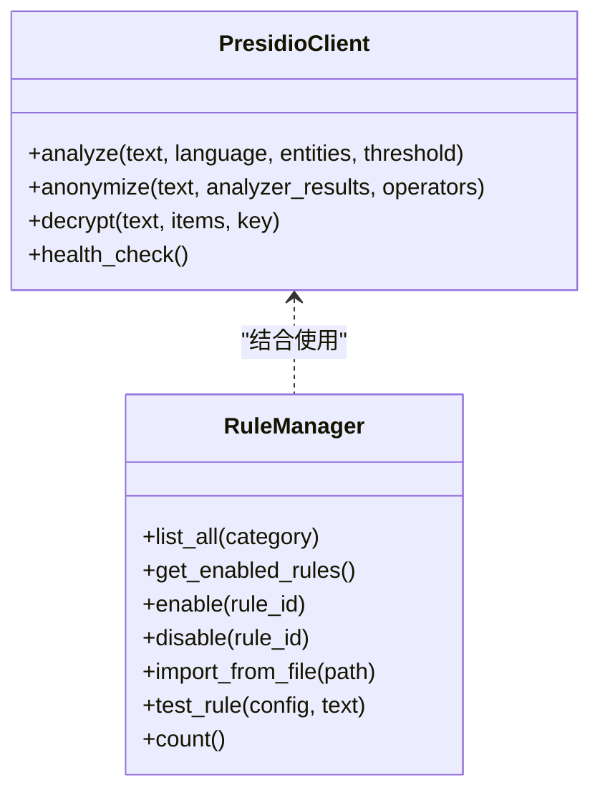
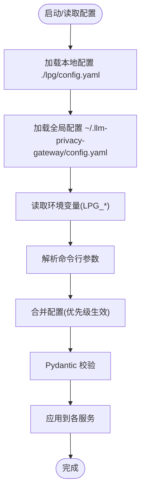
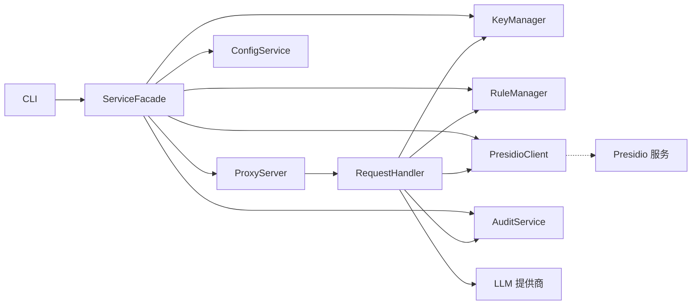
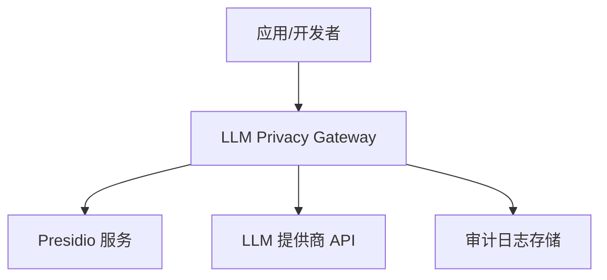

# 架构设计

<cite>
**本文引用的文件**
- [AGENTS.md](file://AGENTS.md)
- [design-update-20260404-v1.0-init.md](file://doc/design/design-update-20260404-v1.0-init.md)
- [01_cli_commands.md](file://doc/test/tcs/v1.0/01_cli_commands.md)
- [07_configuration.md](file://doc/test/tcs/v1.0/07_configuration.md)
- [README.md](file://doc/test/issues_management_platform/plane/README.md)
- [docker-compose.yml](file://doc/test/issues_management_platform/plane/docker-compose.yml)
</cite>

## 目录
1. [简介](#简介)
2. [项目结构](#项目结构)
3. [核心组件](#核心组件)
4. [架构总览](#架构总览)
5. [详细组件分析](#详细组件分析)
6. [依赖关系分析](#依赖关系分析)
7. [性能考量](#性能考量)
8. [故障排查指南](#故障排查指南)
9. [结论](#结论)
10. [附录](#附录)

## 简介
本文件为 LLM Privacy Gateway 的架构设计文档，聚焦 v1.0 MVP 的分层架构与模块化组织，阐述 CLI 层、Core 层、Models 层、Utils 层之间的职责划分与交互关系；解释异步编程、依赖注入与模块化带来的可测试性与可扩展性优势；梳理系统边界、数据流与集成模式（Presidio 服务与 LLM 提供商），并给出基础设施要求、可扩展性与部署拓扑建议。同时覆盖安全、监控与灾难恢复等横切关注点，记录技术栈、第三方依赖与版本兼容性。

## 项目结构
仓库采用按“层”组织的模块化结构，核心目录如下：
- doc/design：架构与设计文档
- doc/test/tcs/v1.0：测试用例与测试数据
- doc/test/issues_management_platform：缺陷管理平台（Plane）离线部署示例
- AGENTS.md：编码规范与设计原则（异步、依赖注入、类型注解、日志、错误处理等）

图表来源
- [design-update-20260404-v1.0-init.md:70-122](file://doc/design/design-update-20260404-v1.0-init.md#L70-L122)
- [AGENTS.md:739-768](file://AGENTS.md#L739-L768)

章节来源
- [design-update-20260404-v1.0-init.md:70-122](file://doc/design/design-update-20260404-v1.0-init.md#L70-L122)
- [AGENTS.md:739-768](file://AGENTS.md#L739-L768)

## 核心组件
- CLI 层：基于 Click 的命令行入口，提供 start/stop/status/config/key/rule/provider/log 等命令，统一通过 ServiceFacade 访问核心服务。
- Core 层：包含代理服务器、请求处理器、Key 管理、规则管理、Presidio 客户端、审计服务、配置服务等核心业务模块。
- Models 层：数据模型与配置模型（Pydantic），用于配置校验与序列化。
- Utils 层：加密工具、日志配置、验证工具等基础设施工具。

章节来源
- [design-update-20260404-v1.0-init.md:256-410](file://doc/design/design-update-20260404-v1.0-init.md#L256-L410)
- [design-update-20260404-v1.0-init.md:1642-1652](file://doc/design/design-update-20260404-v1.0-init.md#L1642-L1652)

## 架构总览
整体采用分层架构与服务门面模式，CLI 作为统一入口，Core 层承载业务逻辑并通过依赖注入组合各服务，Presidio 与 LLM 提供商作为外部集成点。

图表来源
- [design-update-20260404-v1.0-init.md:411-568](file://doc/design/design-update-20260404-v1.0-init.md#L411-L568)
- [design-update-20260404-v1.0-init.md:570-741](file://doc/design/design-update-20260404-v1.0-init.md#L570-L741)
- [design-update-20260404-v1.0-init.md:946-1113](file://doc/design/design-update-20260404-v1.0-init.md#L946-L1113)

章节来源
- [design-update-20260404-v1.0-init.md:411-568](file://doc/design/design-update-20260404-v1.0-init.md#L411-L568)

## 详细组件分析

### CLI 层与服务门面
- CLI 入口负责解析命令行参数、版本信息与全局选项，并通过 ServiceFacade 统一调度核心服务。
- ServiceFacade 聚合配置、Key、规则、Presidio、审计与代理服务，屏蔽服务间依赖，便于后续扩展。

图表来源
- [design-update-20260404-v1.0-init.md:280-311](file://doc/design/design-update-20260404-v1.0-init.md#L280-L311)
- [design-update-20260404-v1.0-init.md:411-568](file://doc/design/design-update-20260404-v1.0-init.md#L411-L568)

章节来源
- [design-update-20260404-v1.0-init.md:280-311](file://doc/design/design-update-20260404-v1.0-init.md#L280-L311)
- [design-update-20260404-v1.0-init.md:411-568](file://doc/design/design-update-20260404-v1.0-init.md#L411-L568)

### 代理服务器与请求处理
- 代理服务器基于 aiohttp，提供 OpenAI 兼容端点与通用转发端点，支持健康检查。
- 请求处理器负责 Key 校验、消息提取、Presidio 检测与脱敏、向 LLM 提供商转发、流式响应处理与审计日志记录。

图表来源
- [design-update-20260404-v1.0-init.md:570-741](file://doc/design/design-update-20260404-v1.0-init.md#L570-L741)
- [design-update-20260404-v1.0-init.md:743-944](file://doc/design/design-update-20260404-v1.0-init.md#L743-L944)
- [design-update-20260404-v1.0-init.md:946-1113](file://doc/design/design-update-20260404-v1.0-init.md#L946-L1113)

章节来源
- [design-update-20260404-v1.0-init.md:570-741](file://doc/design/design-update-20260404-v1.0-init.md#L570-L741)
- [design-update-20260404-v1.0-init.md:743-944](file://doc/design/design-update-20260404-v1.0-init.md#L743-L944)

### Presidio 客户端与规则管理
- Presidio 客户端封装 Analyzer/Anonymizer/Decrypt 接口，支持默认脱敏策略与健康检查。
- 规则管理器加载内置与自定义规则，支持启用/禁用、导入与测试。

图表来源
- [design-update-20260404-v1.0-init.md:946-1113](file://doc/design/design-update-20260404-v1.0-init.md#L946-L1113)
- [design-update-20260404-v1.0-init.md:1277-1439](file://doc/design/design-update-20260404-v1.0-init.md#L1277-L1439)

章节来源
- [design-update-20260404-v1.0-init.md:946-1113](file://doc/design/design-update-20260404-v1.0-init.md#L946-L1113)
- [design-update-20260404-v1.0-init.md:1277-1439](file://doc/design/design-update-20260404-v1.0-init.md#L1277-L1439)

### 配置系统与数据模型
- 配置系统支持多级优先级（命令行 > 环境变量 > 本地配置 > 全局配置 > 默认值），并提供提供商、代理、日志、规则、脱敏与审计等配置项。
- 数据模型使用 Pydantic，确保配置校验与序列化一致。

图表来源
- [design-update-20260404-v1.0-init.md:1931-2012](file://doc/design/design-update-20260404-v1.0-init.md#L1931-L2012)
- [design-update-20260404-v1.0-init.md:1805-1879](file://doc/design/design-update-20260404-v1.0-init.md#L1805-L1879)

章节来源
- [design-update-20260404-v1.0-init.md:1931-2012](file://doc/design/design-update-20260404-v1.0-init.md#L1931-L2012)
- [design-update-20260404-v1.0-init.md:1805-1879](file://doc/design/design-update-20260404-v1.0-init.md#L1805-L1879)

## 依赖关系分析
- 低耦合高内聚：各服务通过构造函数注入，便于单元测试与替换。
- 外部依赖：aiohttp（异步 HTTP）、pydantic（配置模型）、loguru（日志）、cryptography（加密）。
- 集成点：Presidio Analyzer/Anonymizer/Decrypt；LLM 提供商 API（OpenAI/Anthropic/Gemini/Custom）。

图表来源
- [design-update-20260404-v1.0-init.md:411-568](file://doc/design/design-update-20260404-v1.0-init.md#L411-L568)
- [design-update-20260404-v1.0-init.md:570-741](file://doc/design/design-update-20260404-v1.0-init.md#L570-L741)

章节来源
- [design-update-20260404-v1.0-init.md:411-568](file://doc/design/design-update-20260404-v1.0-init.md#L411-L568)
- [design-update-20260404-v1.0-init.md:570-741](file://doc/design/design-update-20260404-v1.0-init.md#L570-L741)

## 性能考量
- 异步 I/O：代理与 Presidio 调用均采用异步 HTTP 客户端，降低阻塞，提升并发吞吐。
- 流式响应：对流式响应（SSE）直接透传，减少中间缓冲与转换开销。
- 脱敏策略：默认脱敏策略集中配置，避免重复构建；Presidio 结果缓存与去重可按需引入。
- 资源限制：代理服务器支持最大连接数与超时配置，防止资源耗尽。

章节来源
- [AGENTS.md:418-470](file://AGENTS.md#L418-L470)
- [design-update-20260404-v1.0-init.md:570-741](file://doc/design/design-update-20260404-v1.0-init.md#L570-L741)

## 故障排查指南
- Presidio 连接失败/超时：检查 Presidio 服务端点、网络连通性与健康检查；查看 PresidioClient 异常类型与日志。
- Key 无效/过期：确认虚拟 Key 是否存在、是否过期；检查 KeyManager 解析流程与配置。
- 审计日志缺失：确认审计服务配置、日志文件路径与权限；检查写入异常。
- CLI 命令异常：参考 CLI 测试用例定位参数、环境变量与配置优先级问题。

章节来源
- [design-update-20260404-v1.0-init.md:946-1113](file://doc/design/design-update-20260404-v1.0-init.md#L946-L1113)
- [design-update-20260404-v1.0-init.md:1441-1640](file://doc/design/design-update-20260404-v1.0-init.md#L1441-L1640)
- [01_cli_commands.md:14-32](file://doc/test/tcs/v1.0/01_cli_commands.md#L14-L32)

## 结论
该架构以分层与门面模式实现 CLI 与核心服务的解耦，通过依赖注入与模块化提升可测试性与可扩展性；异步编程与流式处理满足 I/O 密集场景下的性能需求；配置系统与数据模型保障行为可控与一致性。Presidio 与 LLM 提供商的集成通过标准化接口与错误处理实现稳健的外部依赖管理。建议在后续版本中引入订阅/同步服务与插件化扩展点，保持接口稳定与增量演进。

## 附录

### 系统上下文图（概念）

[此图为概念示意，无需图表来源]

### 集成模式与外部系统
- Presidio 服务：Analyzer/Anonymizer/Decrypt 接口，支持健康检查与默认脱敏策略。
- LLM 提供商：OpenAI/Anthropic/Gemini/Custom，支持多种鉴权方式与基础 URL 配置。

章节来源
- [design-update-20260404-v1.0-init.md:1703-1774](file://doc/design/design-update-20260404-v1.0-init.md#L1703-L1774)
- [design-update-20260404-v1.0-init.md:1835-1842](file://doc/design/design-update-20260404-v1.0-init.md#L1835-L1842)

### 基础设施要求与部署拓扑
- 运行环境：Python 3.9+，支持异步运行时。
- 外部服务：Presidio 服务（Analyzer/Anonymizer/Decrypt），可本地或容器化部署。
- 部署拓扑：单机部署（代理服务 + Presidio 服务在同一主机或容器内），生产可横向扩展代理节点并引入负载均衡。

章节来源
- [01_cli_commands.md:14-21](file://doc/test/tcs/v1.0/01_cli_commands.md#L14-L21)

### 技术栈、第三方依赖与版本兼容性
- 核心依赖：aiohttp（异步 HTTP）、pydantic（配置模型）、loguru（日志）、cryptography（加密）。
- 版本兼容性：Python 3.9+；依赖版本遵循项目依赖声明与测试矩阵。

章节来源
- [AGENTS.md:270-285](file://AGENTS.md#L270-L285)

### 可扩展性与未来演进
- 服务门面预留扩展点（订阅/同步服务）。
- 规则管理器预留云端规则同步与规则包管理。
- CLI 命令组可按版本增量扩展。

章节来源
- [design-update-20260404-v1.0-init.md:2014-2128](file://doc/design/design-update-20260404-v1.0-init.md#L2014-L2128)

### 安全、监控与灾难恢复
- 安全：虚拟 Key 管理与鉴权、加密工具、最小权限原则；日志脱敏与审计。
- 监控：健康检查端点、审计日志统计、错误分类与告警。
- 灾难恢复：审计日志持久化、配置文件备份、服务重启与状态查询。

章节来源
- [design-update-20260404-v1.0-init.md:1441-1640](file://doc/design/design-update-20260404-v1.0-init.md#L1441-L1640)
- [design-update-20260404-v1.0-init.md:570-741](file://doc/design/design-update-20260404-v1.0-init.md#L570-L741)

### 测试策略与覆盖范围
- 单元测试（80%）：模块独立功能、边界条件、错误处理。
- 集成测试（15%）：服务间交互、Presidio 集成、配置加载。
- E2E 测试（5%）：完整请求流程与 CLI 命令集成。

章节来源
- [design-update-20260404-v1.0-init.md:2131-2346](file://doc/design/design-update-20260404-v1.0-init.md#L2131-L2346)
- [01_cli_commands.md:668-681](file://doc/test/tcs/v1.0/01_cli_commands.md#L668-L681)

### 缺陷管理平台（Plane）集成示例
- 仓库提供 Plane 缺陷管理平台的离线部署指南与 Docker Compose 配置，可用于项目缺陷追踪与团队协作。

章节来源
- [README.md:1-148](file://doc/test/issues_management_platform/plane/README.md#L1-L148)
- [docker-compose.yml](file://doc/test/issues_management_platform/plane/docker-compose.yml)