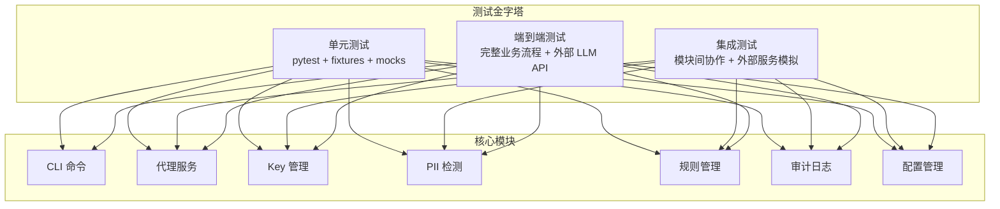
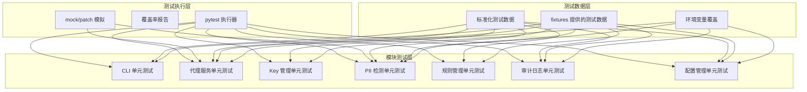
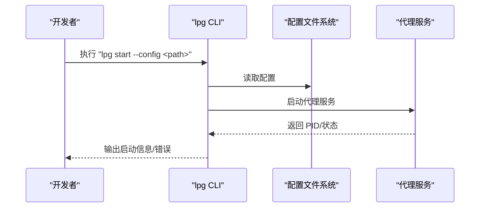
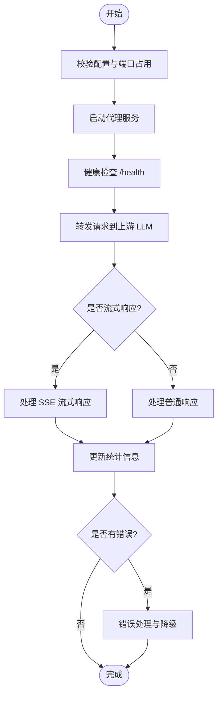
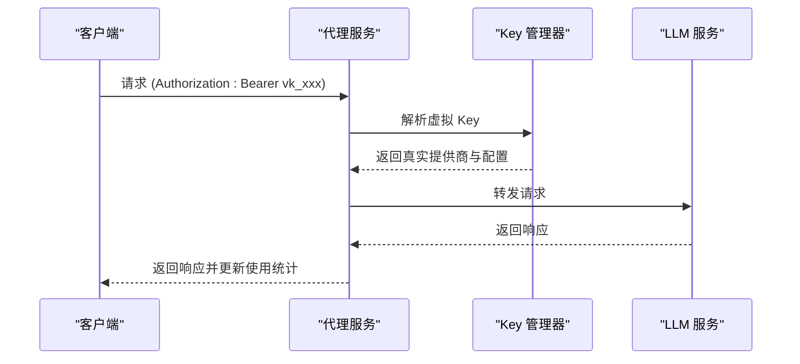
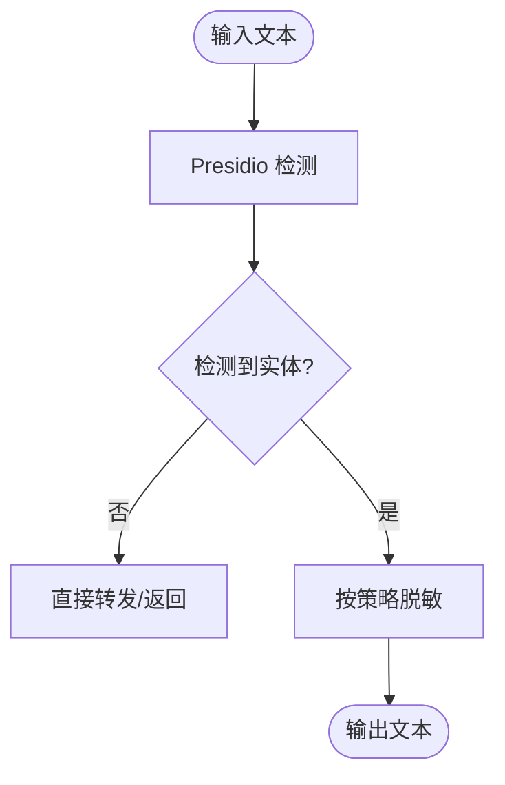
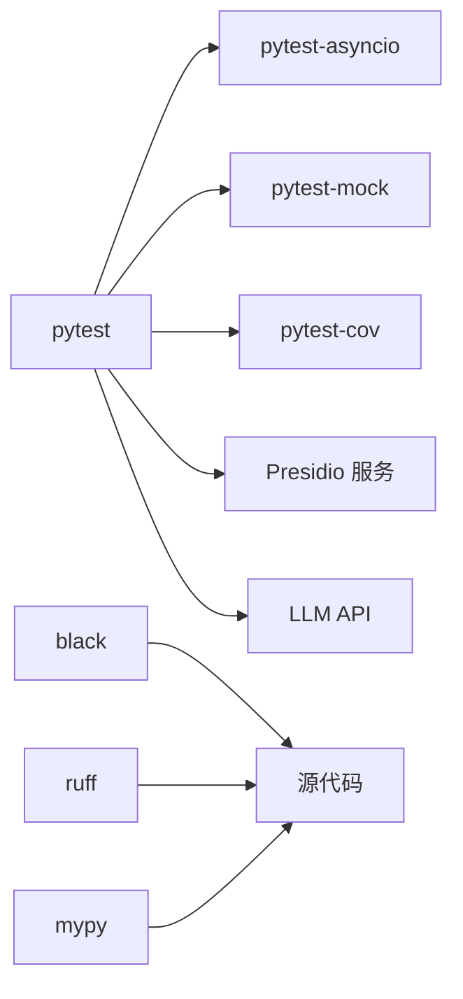

# 测试策略与质量保证

<cite>
**本文档引用的文件**
- [AGENTS.md](file://AGENTS.md)
- [README.md](file://doc/test/tcs/v1.0/README.md)
- [01_cli_commands.md](file://doc/test/tcs/v1.0/01_cli_commands.md)
- [02_proxy_service.md](file://doc/test/tcs/v1.0/02_proxy_service.md)
- [03_key_management.md](file://doc/test/tcs/v1.0/03_key_management.md)
- [04_pii_detection.md](file://doc/test/tcs/v1.0/04_pii_detection.md)
- [05_rule_management.md](file://doc/test/tcs/v1.0/05_rule_management.md)
- [06_audit_logging_testdata.md](file://doc/test/tcs/v1.0/06_audit_logging_testdata.md)
- [07_configuration_testdata.md](file://doc/test/tcs/v1.0/07_configuration_testdata.md)
- [08_e2e_integration_testdata.md](file://doc/test/tcs/v1.0/08_e2e_integration_testdata.md)
</cite>

## 目录
1. [引言](#引言)
2. [项目结构](#项目结构)
3. [核心组件](#核心组件)
4. [架构总览](#架构总览)
5. [详细组件分析](#详细组件分析)
6. [依赖分析](#依赖分析)
7. [性能考虑](#性能考虑)
8. [故障排除指南](#故障排除指南)
9. [结论](#结论)
10. [附录](#附录)

## 引言
本文件为 LLM Privacy Gateway（LPG）项目制定测试策略与质量保证方案，基于现有测试用例文档与编码规范，构建覆盖单元测试、集成测试与端到端测试的金字塔结构，明确测试规范、最佳实践、覆盖率要求、异步测试实现、测试工具使用、测试环境搭建与 CI/CD 集成建议，并提供测试数据管理与隔离策略、故障排除与调试技巧。

## 项目结构
LPG 项目采用模块化架构，测试体系围绕 CLI、代理服务、Key 管理、PII 检测、规则管理、审计日志、配置管理与端到端集成等模块展开。测试用例文档提供了各模块的黑盒测试场景与覆盖矩阵，配合编码规范中的测试章节，形成完整的测试策略基础。

**图表来源**
- [README.md:166-177](file://doc/test/tcs/v1.0/README.md#L166-L177)
- [01_cli_commands.md:1-10](file://doc/test/tcs/v1.0/01_cli_commands.md#L1-L10)
- [02_proxy_service.md:1-10](file://doc/test/tcs/v1.0/02_proxy_service.md#L1-L10)
- [03_key_management.md:1-10](file://doc/test/tcs/v1.0/03_key_management.md#L1-L10)
- [04_pii_detection.md:1-10](file://doc/test/tcs/v1.0/04_pii_detection.md#L1-L10)
- [05_rule_management.md:1-10](file://doc/test/tcs/v1.0/05_rule_management.md#L1-L10)
- [06_audit_logging_testdata.md:1-10](file://doc/test/test_data/06_audit_logging_testdata.md#L1-L10)
- [07_configuration_testdata.md:1-10](file://doc/test/test_data/07_configuration_testdata.md#L1-L10)
- [08_e2e_integration_testdata.md:1-10](file://doc/test/test_data/08_e2e_integration_testdata.md#L1-L10)

**章节来源**
- [README.md:1-185](file://doc/test/tcs/v1.0/README.md#L1-L185)

## 核心组件
- 测试金字塔组织
  - 单元测试：面向独立函数/类，使用 pytest fixtures 与 mock，覆盖高分支与边界条件。
  - 集成测试：验证模块间协作与外部服务（Presidio、LLM API）交互。
  - 端到端测试：完整业务流程，覆盖真实 Key、PII 检测、流式响应与错误处理。
- 测试规范与最佳实践
  - 测试文件组织、命名约定、fixtures 使用、异步测试与 mock 策略。
  - 覆盖率要求：核心模块覆盖率 > 80%。
- 测试数据与隔离
  - 使用标准化测试数据集，确保跨模块一致性；通过环境变量与配置覆盖实现测试隔离。
- 异步测试与工具
  - 使用 pytest-asyncio 运行异步测试；结合 pytest-mock 进行外部服务模拟。
- CI/CD 集成
  - 建议在 CI 中执行 pytest、覆盖率报告与静态检查（black/ruff/mypy）。

**章节来源**
- [AGENTS.md:637-737](file://AGENTS.md#L637-L737)
- [README.md:68-185](file://doc/test/tcs/v1.0/README.md#L68-L185)

## 架构总览
测试架构围绕“测试金字塔 + 模块化用例 + 标准化数据 + CI/CD”的闭环展开，确保从单元到端到端的全面覆盖与可重复执行。

**图表来源**
- [AGENTS.md:637-737](file://AGENTS.md#L637-L737)
- [01_cli_commands.md:1-10](file://doc/test/tcs/v1.0/01_cli_commands.md#L1-L10)
- [02_proxy_service.md:1-10](file://doc/test/tcs/v1.0/02_proxy_service.md#L1-L10)
- [03_key_management.md:1-10](file://doc/test/tcs/v1.0/03_key_management.md#L1-L10)
- [04_pii_detection.md:1-10](file://doc/test/tcs/v1.0/04_pii_detection.md#L1-L10)
- [05_rule_management.md:1-10](file://doc/test/test_data/05_rule_management.md#L1-L10)
- [06_audit_logging_testdata.md:1-10](file://doc/test/test_data/06_audit_logging_testdata.md#L1-L10)
- [07_configuration_testdata.md:1-10](file://doc/test/test_data/07_configuration_testdata.md#L1-L10)
- [08_e2e_integration_testdata.md:1-10](file://doc/test/test_data/08_e2e_integration_testdata.md#L1-L10)

## 详细组件分析

### CLI 命令测试
- 测试范围：基础命令、启动/停止、状态查询、配置管理、Key 管理、提供商管理、规则管理、日志管理等。
- 覆盖矩阵：集成测试与端到端测试覆盖 CLI 命令。
- 异步与并发：CLI 本身为同步命令，重点在于命令输出与错误码校验。
- 建议自动化：优先实现 P0 与带明确输入输出的用例。

**图表来源**
- [01_cli_commands.md:84-113](file://doc/test/tcs/v1.0/01_cli_commands.md#L84-L113)
- [README.md:166-177](file://doc/test/tcs/v1.0/README.md#L166-L177)

**章节来源**
- [01_cli_commands.md:1-702](file://doc/test/tcs/v1.0/01_cli_commands.md#L1-L702)
- [README.md:14-185](file://doc/test/tcs/v1.0/README.md#L14-L185)

### 代理服务测试
- 测试范围：启动/停止、请求转发、流式响应、错误处理、并发与超时、健康检查与统计。
- 覆盖矩阵：单元测试覆盖核心逻辑，集成与端到端测试覆盖外部服务交互。
- 异步测试：代理服务涉及异步 I/O 与流式响应，需使用 pytest-asyncio。
- Mock 策略：使用 patch 模拟上游 LLM 服务，验证错误路径与超时处理。

**图表来源**
- [02_proxy_service.md:46-800](file://doc/test/tcs/v1.0/02_proxy_service.md#L46-L800)
- [AGENTS.md:418-470](file://AGENTS.md#L418-L470)

**章节来源**
- [02_proxy_service.md:1-1038](file://doc/test/tcs/v1.0/02_proxy_service.md#L1-L1038)
- [AGENTS.md:697-737](file://AGENTS.md#L697-L737)

### Key 管理测试
- 测试范围：创建、解析、列表、详情、吊销、过期处理、使用统计与并发操作。
- 覆盖矩阵：单元测试覆盖解析与统计逻辑，集成测试覆盖与代理服务的 Key 解析。
- Mock 策略：使用 AsyncMock 模拟 Key 存储与权限校验。
- 并发测试：验证并发创建与并发解析的计数一致性。

**图表来源**
- [03_key_management.md:128-202](file://doc/test/tcs/v1.0/03_key_management.md#L128-L202)
- [02_proxy_service.md:253-422](file://doc/test/tcs/v1.0/02_proxy_service.md#L253-L422)

**章节来源**
- [03_key_management.md:1-564](file://doc/test/tcs/v1.0/03_key_management.md#L1-L564)

### PII 检测与脱敏测试
- 测试范围：多实体类型检测（邮箱、电话、身份证、人名、地址、IP、URL）、多种脱敏策略（replace、mask、hash、redact）、多语言支持、边界与异常情况。
- 覆盖矩阵：单元测试覆盖检测与脱敏算法，集成测试覆盖与代理服务的请求/响应处理。
- Mock 策略：使用 patch 模拟 Presidio Analyzer/Anonymizer，验证超时与连接失败处理。
- 配置驱动：验证置信度阈值、实体类型过滤与策略配置生效。

**图表来源**
- [04_pii_detection.md:42-717](file://doc/test/tcs/v1.0/04_pii_detection.md#L42-L717)
- [06_audit_logging_testdata.md:165-208](file://doc/test/test_data/06_audit_logging_testdata.md#L165-L208)

**章节来源**
- [04_pii_detection.md:1-717](file://doc/test/tcs/v1.0/04_pii_detection.md#L1-L717)
- [06_audit_logging_testdata.md:1-768](file://doc/test/test_data/06_audit_logging_testdata.md#L1-L768)

### 规则管理测试
- 测试范围：规则加载、列表、启用/禁用、导入/移除、测试、配置、优先级与持久化。
- 覆盖矩阵：单元测试覆盖规则引擎逻辑，集成测试覆盖与代理服务的规则应用。
- 配置驱动：验证内置/自定义规则目录、分类与优先级配置。

**章节来源**
- [05_rule_management.md:1-623](file://doc/test/test_data/05_rule_management.md#L1-L623)

### 审计日志测试
- 测试范围：时间戳、URL、HTTP 方法、状态码、请求耗时、PII 检测结果、脱敏操作、日志级别与格式、查询条件、统计信息、导出格式与文件路径、性能与安全。
- 覆盖矩阵：单元测试覆盖日志结构与字段校验，集成测试覆盖与代理服务的审计集成。
- 数据质量：提供大量边界与异常数据，确保日志系统的鲁棒性。

**章节来源**
- [06_audit_logging_testdata.md:1-768](file://doc/test/test_data/06_audit_logging_testdata.md#L1-L768)

### 配置管理测试
- 测试范围：配置文件路径、代理配置（host/port/timeout/max_connections）、Presidio 配置、日志配置、提供商配置、虚拟 Key 配置、规则配置、脱敏配置、审计配置、环境变量覆盖与配置合并优先级。
- 覆盖矩阵：单元测试覆盖配置解析与校验，集成测试覆盖配置合并与运行时生效。
- 配置合并：命令行参数 > 环境变量 > 本地配置 > 全局配置 > 默认配置。

**章节来源**
- [07_configuration_testdata.md:1-808](file://doc/test/test_data/07_configuration_testdata.md#L1-L808)

### 端到端集成测试
- 测试范围：完整请求流程（无 PII、单/多 PII、混合 PII）、OpenAI API 格式（chat/completions/embeddings）、虚拟 Key 场景（有效/无效/已吊销/已过期/不同 provider）、LLM 响应（200/400/401/500、流式/非流式）、规则配置场景（启用/禁用/自定义）。
- 覆盖矩阵：端到端测试覆盖真实 Key、PII 检测、流式响应与错误处理。
- 建议：在 CI 中使用 Presidio 服务镜像与 LLM API Mock，确保可重复执行。

**章节来源**
- [08_e2e_integration_testdata.md:1-1414](file://doc/test/test_data/08_e2e_integration_testdata.md#L1-L1414)

## 依赖分析
- 测试依赖
  - pytest：测试框架与执行器
  - pytest-asyncio：异步测试支持
  - pytest-mock：mock 与 patch
  - pytest-cov：覆盖率收集
  - black/ruff/mypy：代码格式、静态检查与类型检查
- 外部依赖
  - Presidio 服务：PII 检测与脱敏
  - LLM API：代理服务转发目标
- 依赖风险
  - 外部服务可用性与稳定性；网络超时与连接失败处理。
  - 建议：使用容器化服务与本地 Mock，降低外部依赖风险。

**图表来源**
- [AGENTS.md:33-39](file://AGENTS.md#L33-L39)
- [README.md:151-162](file://doc/test/tcs/v1.0/README.md#L151-L162)

**章节来源**
- [AGENTS.md:33-39](file://AGENTS.md#L33-L39)
- [README.md:134-162](file://doc/test/tcs/v1.0/README.md#L134-L162)

## 性能考虑
- 性能测试数据：高并发（10/100/1000/10000）、大数据量（1k/10k/100k/1M 条日志）与压力测试。
- 性能关注点：日志写入、PII 检测、脱敏处理、流式响应、并发连接与超时控制。
- 建议：在 CI 中引入性能回归检查，结合覆盖率与性能指标共同评估。

**章节来源**
- [06_audit_logging_testdata.md:713-732](file://doc/test/test_data/06_audit_logging_testdata.md#L713-L732)
- [07_configuration_testdata.md:713-732](file://doc/test/test_data/07_configuration_testdata.md#L713-L732)

## 故障排除指南
- 常见问题
  - Presidio 服务不可达：检查服务状态与端口；使用 Mock 降级测试。
  - LLM API 超时/错误：验证超时配置与重试策略；检查 Key 有效性。
  - 配置加载失败：检查配置文件格式与权限；验证环境变量覆盖。
  - 日志文件写入失败：检查路径权限与磁盘空间。
- 调试技巧
  - 使用 pytest -v 与 -s 输出详细日志。
  - 使用 pytest --tb=long 查看异常堆栈。
  - 使用 pytest --cov-report=term-missing 查看未覆盖代码。
  - 使用 pytest-xdist 并发执行，定位竞态条件。
- 隔离策略
  - 使用临时配置文件与临时日志目录。
  - 使用环境变量覆盖关键配置，避免污染全局配置。

**章节来源**
- [02_proxy_service.md:515-591](file://doc/test/tcs/v1.0/02_proxy_service.md#L515-L591)
- [04_pii_detection.md:547-591](file://doc/test/tcs/v1.0/04_pii_detection.md#L547-L591)
- [06_audit_logging_testdata.md:634-683](file://doc/test/test_data/06_audit_logging_testdata.md#L634-L683)
- [07_configuration_testdata.md:563-591](file://doc/test/test_data/07_configuration_testdata.md#L563-L591)

## 结论
通过测试金字塔与模块化测试用例，LPG 项目实现了从单元到端到端的全面覆盖。结合标准化测试数据、严格的命名与 fixtures 策略、异步测试与 mock 实践、以及 CI/CD 集成建议，能够持续保障系统质量与稳定性。建议在后续迭代中逐步完善单元测试覆盖率与性能回归检查，进一步提升测试效率与可靠性。

## 附录

### 测试金字塔与覆盖矩阵
- 单元测试：核心逻辑与边界条件
- 集成测试：模块间协作与外部服务交互
- 端到端测试：完整业务流程与真实外部服务

**章节来源**
- [README.md:166-177](file://doc/test/tcs/v1.0/README.md#L166-L177)

### 测试规范与最佳实践
- 测试文件组织：tests/unit、tests/integration、tests/e2e
- 命名约定：test_<module>.py、Test<ClassName>、test_<method>_<scenario>
- fixtures 使用：共享配置与测试数据
- 异步测试：pytest-asyncio
- mock 策略：patch 与 AsyncMock
- 覆盖率要求：核心模块 > 80%

**章节来源**
- [AGENTS.md:637-737](file://AGENTS.md#L637-L737)

### 测试环境搭建与 CI/CD 集成
- 环境要求：Python 3.10+、Presidio 服务、LLM API 可访问（或 Mock）
- 自动化执行：pytest tests/、pytest --cov=lpg
- 静态检查：black、ruff、mypy

**章节来源**
- [README.md:68-185](file://doc/test/tcs/v1.0/README.md#L68-L185)