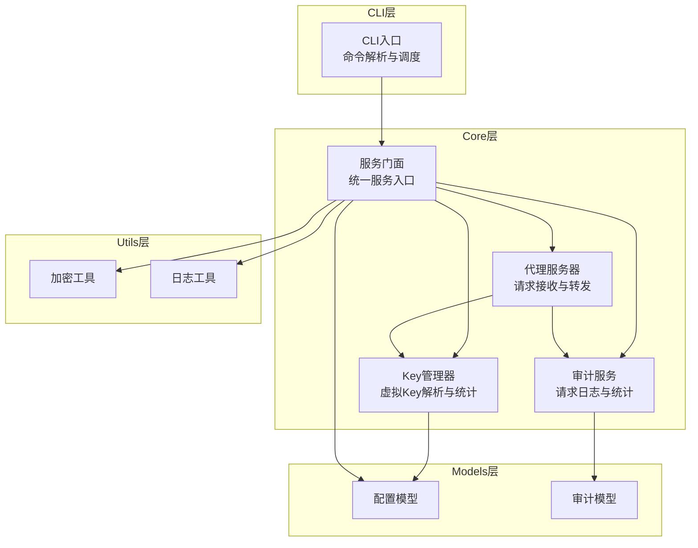
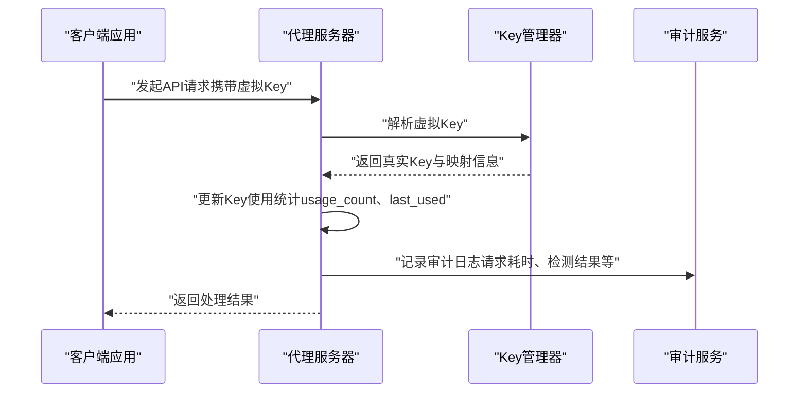
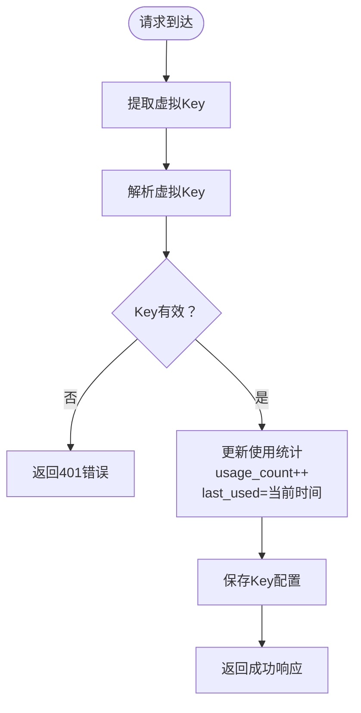
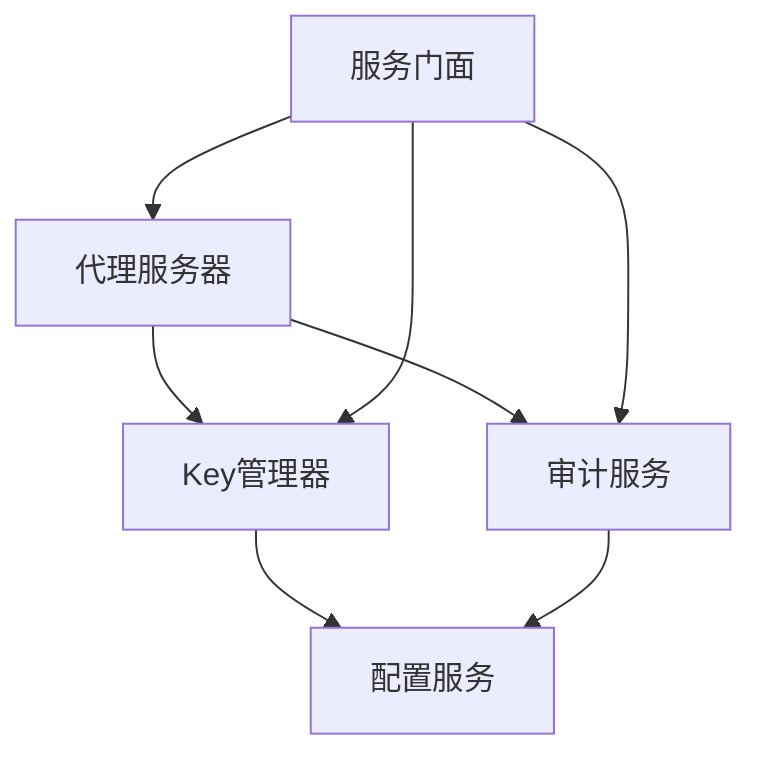

# Key使用统计与追踪

<cite>
**本文档引用的文件**
- [AGENTS.md](file://AGENTS.md)
- [design-update-20260404-v1.0-init.md](file://doc/design/design-update-20260404-v1.0-init.md)
- [req-init-20260401.md](file://doc/req/req-init-20260401.md)
- [03_key_management_testdata.md](file://doc/test/tcs/v1.0/03_key_management_testdata.md)
- [06_audit_logging_testdata.md](file://doc/test/tcs/v1.0/06_audit_logging_testdata.md)
</cite>

## 目录
1. [简介](#简介)
2. [项目结构](#项目结构)
3. [核心组件](#核心组件)
4. [架构概览](#架构概览)
5. [详细组件分析](#详细组件分析)
6. [依赖关系分析](#依赖关系分析)
7. [性能考虑](#性能考虑)
8. [故障排查指南](#故障排查指南)
9. [结论](#结论)
10. [附录](#附录)

## 简介
本文件聚焦于LLM Privacy Gateway的Key使用统计与追踪功能，系统性阐述以下方面：
- Key使用统计机制：请求次数统计、使用时间记录、使用模式分析
- 统计数据的采集、存储与查询机制
- 统计精度与延迟权衡
- 最后使用时间的记录与更新策略
- 统计可视化与报表能力
- 性能影响与优化策略
- 统计数据分析最佳实践与洞察提取
- 使用统计与审计日志的关系

## 项目结构
围绕Key使用统计与追踪，项目采用四层架构（CLI → Core → Models → Utils），关键模块包括：
- CLI层：对外提供命令行接口，统一调用服务门面
- Core层：包含代理服务、Key管理、规则管理、审计服务等核心业务
- Models层：数据模型定义
- Utils层：通用工具（加密、日志、验证）

**图表来源**
- [design-update-20260404-v1.0-init.md:411-568](file://doc/design/design-update-20260404-v1.0-init.md#L411-L568)

**章节来源**
- [AGENTS.md:93-111](file://AGENTS.md#L93-L111)
- [design-update-20260404-v1.0-init.md:372-410](file://doc/design/design-update-20260404-v1.0-init.md#L372-L410)

## 核心组件
Key使用统计与追踪涉及以下核心组件及其职责：
- KeyManager：负责虚拟Key的生成、解析、权限校验，并维护使用统计（使用次数、最后使用时间）
- ProxyServer：代理服务器，负责请求统计（总请求数、成功/失败请求数、总延迟）
- AuditService：审计服务，负责请求日志记录与统计查询
- ServiceFacade：服务门面，统一对外提供服务接口

关键统计字段与来源：
- Key使用统计：usage_count、last_used（KeyManager）
- 代理统计：total_requests、success_requests、failed_requests、total_latency_ms（ProxyServer）
- 审计统计：基于审计日志的统计（AuditService）

**章节来源**
- [design-update-20260404-v1.0-init.md:1115-1275](file://doc/design/design-update-20260404-v1.0-init.md#L1115-L1275)
- [design-update-20260404-v1.0-init.md:570-741](file://doc/design/design-update-20260404-v1.0-init.md#L570-L741)
- [design-update-20260404-v1.0-init.md:1441-1640](file://doc/design/design-update-20260404-v1.0-init.md#L1441-L1640)

## 架构概览
Key使用统计与追踪在请求处理链路中的位置如下：

**图表来源**
- [design-update-20260404-v1.0-init.md:743-944](file://doc/design/design-update-20260404-v1.0-init.md#L743-L944)
- [design-update-20260404-v1.0-init.md:1115-1275](file://doc/design/design-update-20260404-v1.0-init.md#L1115-L1275)
- [design-update-20260404-v1.0-init.md:1441-1640](file://doc/design/design-update-20260404-v1.0-init.md#L1441-L1640)

## 详细组件分析

### Key使用统计机制
Key使用统计由KeyManager负责，核心机制包括：
- 使用次数统计：每次成功解析虚拟Key时，usage_count递增
- 最后使用时间：每次成功解析虚拟Key时，last_used更新为当前时间
- 数据持久化：统计信息保存在配置中（虚拟Key配置列表）

**图表来源**
- [design-update-20260404-v1.0-init.md:1198-1232](file://doc/design/design-update-20260404-v1.0-init.md#L1198-L1232)

**章节来源**
- [design-update-20260404-v1.0-init.md:1115-1275](file://doc/design/design-update-20260404-v1.0-init.md#L1115-L1275)

### 代理请求统计机制
代理服务器负责整体请求统计，包括：
- total_requests：请求总数
- success_requests：成功请求数
- failed_requests：失败请求数
- total_latency_ms：累计延迟（毫秒）

统计更新发生在请求处理流程的finally块中，无论成功或失败都会累加延迟。

**章节来源**
- [design-update-20260404-v1.0-init.md:570-741](file://doc/design/design-update-20260404-v1.0-init.md#L570-L741)

### 审计日志与统计查询
审计服务负责：
- 记录请求日志（时间戳、URL、方法、状态、耗时、检测结果等）
- 提供日志查询与统计分析接口
- 支持按时间范围、状态、关键词等条件查询

审计统计涵盖：
- 总请求数、成功/失败请求数
- PII检测总数、各类PII类型分布
- 平均处理耗时

**章节来源**
- [design-update-20260404-v1.0-init.md:1441-1640](file://doc/design/design-update-20260404-v1.0-init.md#L1441-L1640)

### 统计数据的收集、存储与查询
- 收集：在Key解析成功时更新Key统计；在请求处理完成后更新代理统计；在请求完成后记录审计日志
- 存储：Key统计保存在配置文件的虚拟Key列表中；审计日志以JSON Lines格式存储
- 查询：审计服务提供查询与统计接口，支持时间范围、状态、关键词过滤

**章节来源**
- [design-update-20260404-v1.0-init.md:1115-1275](file://doc/design/design-update-20260404-v1.0-init.md#L1115-L1275)
- [design-update-20260404-v1.0-init.md:1441-1640](file://doc/design/design-update-20260404-v1.0-init.md#L1441-L1640)

### 使用统计的精度与延迟考虑
- 精度：Key统计基于每次成功解析，last_used精确到时间戳；代理统计基于请求完成后的累计延迟
- 延迟：Key统计更新为内存操作，开销极小；代理统计在请求完成后更新，对请求时延影响可忽略
- 数据一致性：Key统计保存在配置中，频繁写入可能带来I/O开销，建议在批量操作或定期任务中进行

**章节来源**
- [design-update-20260404-v1.0-init.md:1115-1275](file://doc/design/design-update-20260404-v1.0-init.md#L1115-L1275)
- [design-update-20260404-v1.0-init.md:570-741](file://doc/design/design-update-20260404-v1.0-init.md#L570-L741)

### 最后使用时间的记录与更新策略
- 记录时机：每次成功解析虚拟Key时更新last_used
- 更新策略：采用“最近一次使用”策略，覆盖之前的记录
- 数据持久化：保存到虚拟Key配置中，确保重启后统计不丢失

**章节来源**
- [design-update-20260404-v1.0-init.md:1198-1232](file://doc/design/design-update-20260404-v1.0-init.md#L1198-L1232)

### 可视化与报表功能
- CLI状态命令：提供实时监控输出，包含请求总量、成功率、平均延迟等关键指标
- 日志统计：支持按时间范围统计，生成趋势分析
- 报表建议：可基于审计日志导出功能生成PII类型分布、应用使用排行等报表

**章节来源**
- [req-init-20260401.md:1000-1028](file://doc/req/req-init-20260401.md#L1000-L1028)
- [design-update-20260404-v1.0-init.md:1559-1598](file://doc/design/design-update-20260404-v1.0-init.md#L1559-L1598)

### 使用统计与审计日志的关系
- 使用统计：关注Key维度的使用频次与时序
- 审计日志：关注请求维度的完整生命周期与合规性
- 关系：两者互补，使用统计用于运营与运维监控，审计日志用于合规与取证

**章节来源**
- [design-update-20260404-v1.0-init.md:1441-1640](file://doc/design/design-update-20260404-v1.0-init.md#L1441-L1640)

## 依赖关系分析
Key使用统计与追踪涉及的关键依赖关系如下：

**图表来源**
- [design-update-20260404-v1.0-init.md:411-568](file://doc/design/design-update-20260404-v1.0-init.md#L411-L568)

**章节来源**
- [design-update-20260404-v1.0-init.md:372-410](file://doc/design/design-update-20260404-v1.0-init.md#L372-L410)

## 性能考虑
- Key统计更新：内存操作，开销极小
- 代理统计：请求完成后累计，对时延影响可忽略
- 审计日志：文件写入，建议采用异步写入或批量写入减少I/O开销
- 并发场景：Key解析与统计更新需保证线程安全，避免竞态条件

[本节为通用性能讨论，不直接分析具体文件]

## 故障排查指南
- Key统计异常：检查Key解析流程与配置保存逻辑
- 代理统计异常：检查请求处理流程与统计更新时机
- 审计日志异常：检查日志文件路径、权限与格式

**章节来源**
- [03_key_management_testdata.md:287-384](file://doc/test/tcs/v1.0/03_key_management_testdata.md#L287-L384)
- [06_audit_logging_testdata.md:634-768](file://doc/test/tcs/v1.0/06_audit_logging_testdata.md#L634-L768)

## 结论
Key使用统计与追踪通过KeyManager、ProxyServer与AuditService协同工作，实现了从Key维度到请求维度的多层次统计。结合CLI状态命令与审计日志导出，可满足日常运维监控与合规审计的需求。建议在高并发场景下关注I/O写入与数据一致性，在可视化与报表层面进一步增强PII类型分布与使用趋势分析能力。

[本节为总结性内容，不直接分析具体文件]

## 附录
- 测试数据覆盖Key使用统计与审计日志的关键场景，可作为功能验证与回归测试的基础

**章节来源**
- [03_key_management_testdata.md:1-384](file://doc/test/tcs/v1.0/03_key_management_testdata.md#L1-L384)
- [06_audit_logging_testdata.md:1-768](file://doc/test/tcs/v1.0/06_audit_logging_testdata.md#L1-L768)