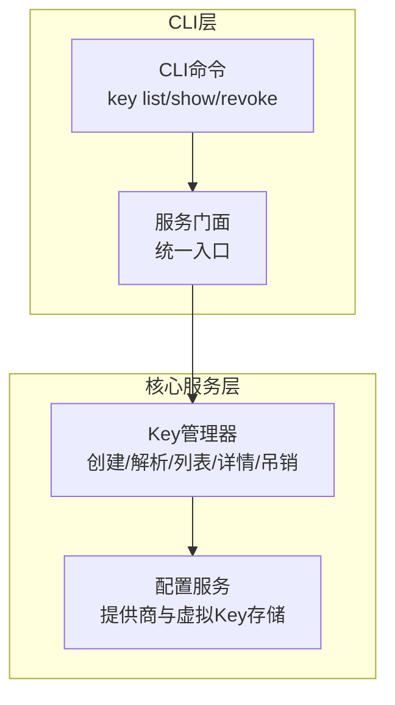
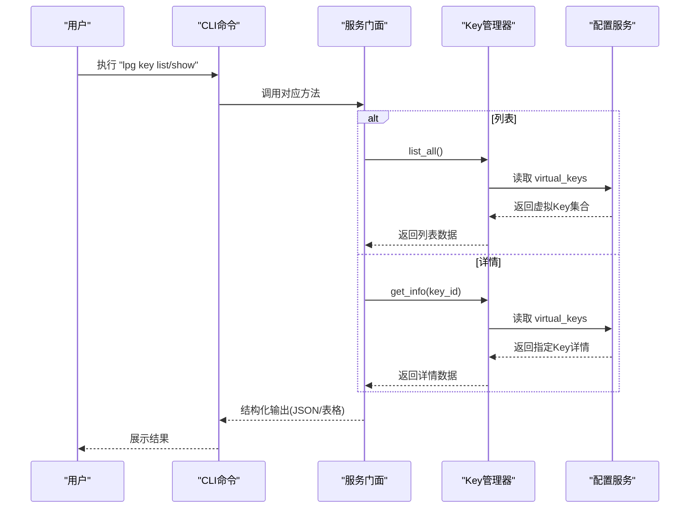
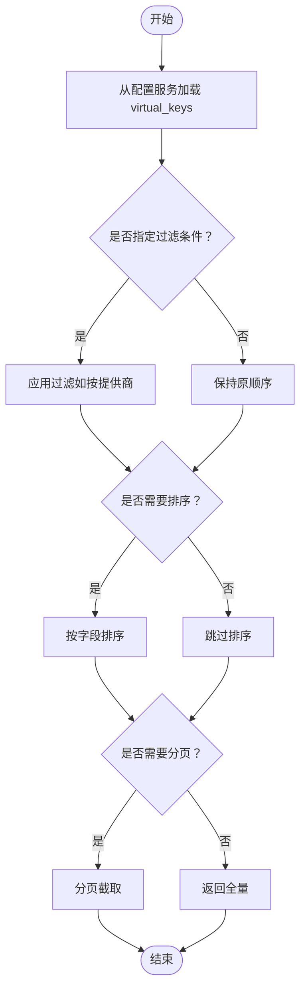
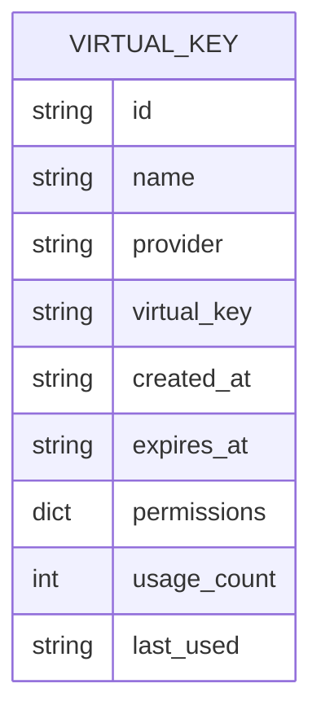
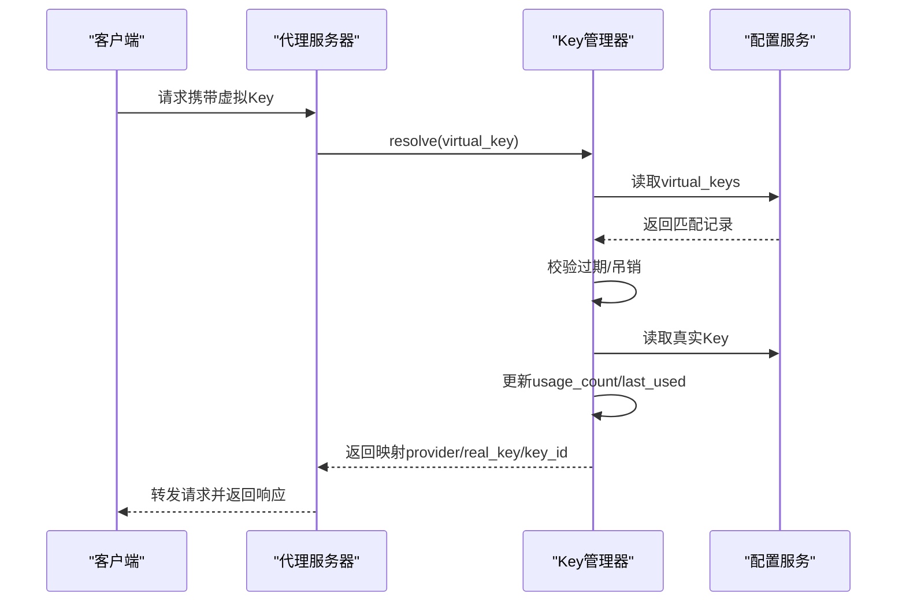

# Key列表与详情

<cite>
**本文引用的文件**
- [设计文档](file://doc/design/design-update-20260404-v1.0-init.md)
- [需求文档](file://doc/req/req-init-20260401.md)
- [Key管理测试用例](file://doc/test/tcs/v1.0/03_key_management.md)
- [Key管理测试数据](file://doc/test/tcs/v1.0/03_key_management_testdata.md)
</cite>

## 目录
1. [简介](#简介)
2. [项目结构](#项目结构)
3. [核心组件](#核心组件)
4. [架构总览](#架构总览)
5. [详细组件分析](#详细组件分析)
6. [依赖分析](#依赖分析)
7. [性能考虑](#性能考虑)
8. [故障排除指南](#故障排除指南)
9. [结论](#结论)
10. [附录](#附录)

## 简介
本文件聚焦于LLM Privacy Gateway的Key列表与详情功能，系统阐述Key列表查询机制（过滤、排序、分页）、Key详情展示内容与格式、查询性能优化策略与缓存机制、字段含义与数据来源、API接口说明、最佳实践与性能调优建议，以及使用示例与故障排除指南。目标是帮助开发者与运维人员高效理解与使用Key管理能力。

## 项目结构
Key管理功能位于核心服务层的Key子系统，CLI通过服务门面统一调度。关键位置如下：
- CLI命令入口与服务门面：负责对外暴露Key管理命令并协调核心服务
- Key管理器：负责虚拟Key的创建、解析、列表、详情、吊销与生命周期管理
- 配置服务：提供提供商配置与虚拟Key持久化存储

**图表来源**
- [设计文档:411-568](file://doc/design/design-update-20260404-v1.0-init.md#L411-L568)
- [设计文档:1118-1275](file://doc/design/design-update-20260404-v1.0-init.md#L1118-L1275)

**章节来源**
- [设计文档:411-568](file://doc/design/design-update-20260404-v1.0-init.md#L411-L568)
- [设计文档:1118-1275](file://doc/design/design-update-20260404-v1.0-init.md#L1118-L1275)

## 核心组件
- Key管理器（KeyManager）
  - 职责：生成虚拟Key、维护虚拟Key与真实Key映射、生命周期管理（过期、吊销）、使用统计更新
  - 关键方法：创建、解析、列表、详情、吊销、计数、过期判断
- 配置服务（ConfigService）
  - 职责：提供提供商配置、虚拟Key持久化（virtual_keys数组）
- 服务门面（ServiceFacade）
  - 职责：为CLI命令提供统一接口，封装Key管理相关操作

**章节来源**
- [设计文档:1118-1275](file://doc/design/design-update-20260404-v1.0-init.md#L1118-L1275)
- [设计文档:411-568](file://doc/design/design-update-20260404-v1.0-init.md#L411-L568)

## 架构总览
Key列表与详情的调用链路如下：

**图表来源**
- [设计文档:488-500](file://doc/design/design-update-20260404-v1.0-init.md#L488-L500)
- [设计文档:1118-1275](file://doc/design/design-update-20260404-v1.0-init.md#L1118-L1275)

## 详细组件分析

### Key列表查询机制
- 查询范围与数据源
  - 列表数据来源于配置服务中的virtual_keys数组，Key管理器按需读取并返回
- 过滤
  - 测试用例显示支持按提供商过滤（示例：key list --provider openai），表明CLI层具备过滤能力；具体实现由CLI命令解析参数并传递给服务门面/Key管理器
- 排序
  - 列表返回顺序遵循virtual_keys的存储顺序；未见显式排序逻辑，若需排序可在上层或CLI层进行二次处理
- 分页
  - 未发现分页实现；如Key数量较多，建议在CLI层增加分页参数并在服务门面/Key管理器中实现分页逻辑

**图表来源**
- [设计文档:1118-1275](file://doc/design/design-update-20260404-v1.0-init.md#L1118-L1275)
- [Key管理测试用例:205-249](file://doc/test/tcs/v1.0/03_key_management.md#L205-L249)

**章节来源**
- [设计文档:1118-1275](file://doc/design/design-update-20260404-v1.0-init.md#L1118-L1275)
- [Key管理测试用例:205-249](file://doc/test/tcs/v1.0/03_key_management.md#L205-L249)

### Key详情展示内容与格式
- 字段清单（依据测试用例与数据模型）
  - 基本信息：id、virtual_key、provider、name、created_at
  - 状态信息：expires_at（可为空表示永不过期）
  - 使用统计：usage_count、last_used
  - 权限配置：permissions（字典，包含模型、端点、Token限制等）
- 数据来源
  - 详情直接来自配置服务中的virtual_keys条目；Key管理器提供get_info(key_id)读取
- 输出格式
  - CLI支持JSON输出模式（-j/--json），也支持表格输出（Rich）

**图表来源**
- [设计文档:1844-1852](file://doc/design/design-update-20260404-v1.0-init.md#L1844-L1852)
- [Key管理测试用例:252-296](file://doc/test/tcs/v1.0/03_key_management.md#L252-L296)

**章节来源**
- [设计文档:1844-1852](file://doc/design/design-update-20260404-v1.0-init.md#L1844-L1852)
- [Key管理测试用例:252-296](file://doc/test/tcs/v1.0/03_key_management.md#L252-L296)

### Key解析与使用统计更新
- 解析流程
  - CLI/代理层提取Authorization头中的虚拟Key
  - Key管理器根据virtual_keys匹配，校验过期状态，获取真实Key并返回映射
  - 同时更新usage_count与last_used并持久化
- 使用统计
  - usage_count每次解析成功后递增
  - last_used记录最近一次使用时间（ISO 8601格式）

**图表来源**
- [设计文档:1198-1232](file://doc/design/design-update-20260404-v1.0-init.md#L1198-L1232)

**章节来源**
- [设计文档:1198-1232](file://doc/design/design-update-20260404-v1.0-init.md#L1198-L1232)

### Key查询的性能优化与缓存
- 现状
  - Key列表与详情基于内存中的virtual_keys集合读取，未见专用缓存层
- 建议
  - 读缓存：对高频查询（如列表/详情）增加内存缓存，结合配置变更触发失效
  - 写缓存：解析真实Key时可缓存映射关系，减少重复查找
  - 分页与过滤：在服务门面/Key管理器中实现分页与过滤，降低CLI层负担
  - 并发安全：使用线程安全的数据结构或锁保护共享状态

**章节来源**
- [设计文档:1118-1275](file://doc/design/design-update-20260404-v1.0-init.md#L1118-L1275)

### API接口说明
- CLI命令
  - 列表：lpg key list（支持JSON输出与按提供商过滤）
  - 详情：lpg key show <key-id>
  - 吊销：lpg key revoke <key-id>
- 服务门面接口
  - list_virtual_keys()：返回Key列表
  - get_key_info(key_id)：返回Key详情
  - revoke_virtual_key(key_id)：吊销Key
- 输出格式
  - 支持JSON输出（-j/--json）
  - 支持表格输出（Rich）

**章节来源**
- [需求文档:1060-1087](file://doc/req/req-init-20260401.md#L1060-L1087)
- [Key管理测试用例:205-296](file://doc/test/tcs/v1.0/03_key_management.md#L205-L296)
- [设计文档:488-500](file://doc/design/design-update-20260404-v1.0-init.md#L488-L500)

## 依赖分析
- 组件耦合
  - CLI通过服务门面间接依赖Key管理器
  - Key管理器依赖配置服务读取/写入virtual_keys
- 外部依赖
  - 配置文件（YAML）作为虚拟Key存储介质
  - CLI Rich库用于表格输出
- 潜在风险
  - virtual_keys为内存态，重启后丢失；建议引入持久化存储或配置中心
  - 缺少索引与过滤，大规模Key时查询效率低

**图表来源**
- [设计文档:411-568](file://doc/design/design-update-20260404-v1.0-init.md#L411-L568)
- [设计文档:1118-1275](file://doc/design/design-update-20260404-v1.0-init.md#L1118-L1275)

**章节来源**
- [设计文档:411-568](file://doc/design/design-update-20260404-v1.0-init.md#L411-L568)
- [设计文档:1118-1275](file://doc/design/design-update-20260404-v1.0-init.md#L1118-L1275)

## 性能考虑
- 查询路径
  - 列表/详情均为O(n)扫描virtual_keys，n为Key数量
- 优化建议
  - 增加内存缓存与失效策略
  - 对provider字段建立索引，加速过滤
  - 引入分页与排序参数，避免一次性返回全部数据
  - 对解析路径增加映射缓存，减少重复查找
- 并发与一致性
  - 使用读写锁或原子操作保护virtual_keys的并发访问
  - 持久化采用事务性写入，避免部分写入导致的数据不一致

[本节为通用性能指导，无需特定文件引用]

## 故障排除指南
- 常见问题与定位
  - Key不存在：get_key_info返回None或抛出异常；检查key-id格式与是否存在
  - Key已过期：resolve返回None；检查expires_at字段
  - Key已吊销：resolve返回None；确认是否已被删除
  - 列表为空：确认配置文件中virtual_keys是否正确加载
- 建议排查步骤
  - 使用lpg key show <key-id>核对详情字段
  - 使用lpg key list --json查看完整列表
  - 检查配置文件路径与权限
  - 开启详细日志模式（如适用）定位异常

**章节来源**
- [Key管理测试用例:269-281](file://doc/test/tcs/v1.0/03_key_management.md#L269-L281)
- [Key管理测试数据:219-242](file://doc/test/tcs/v1.0/03_key_management_testdata.md#L219-L242)

## 结论
Key列表与详情功能以配置文件为数据源，通过服务门面与Key管理器提供统一查询接口。当前实现简洁可靠，适合小规模使用；随着Key数量增长，建议引入缓存、索引、分页与过滤等优化措施，以提升查询性能与用户体验。

[本节为总结性内容，无需特定文件引用]

## 附录

### 字段含义与数据来源对照
- id：Key唯一标识（vk_前缀）
- virtual_key：虚拟Key字符串
- provider：关联的LLM提供商名称
- name：Key标识名称
- created_at：创建时间（ISO 8601）
- expires_at：过期时间（ISO 8601，可为空）
- permissions：权限配置（字典）
- usage_count：使用次数（整数）
- last_used：最后使用时间（ISO 8601，可为空）

**章节来源**
- [设计文档:1844-1852](file://doc/design/design-update-20260404-v1.0-init.md#L1844-L1852)
- [Key管理测试用例:252-296](file://doc/test/tcs/v1.0/03_key_management.md#L252-L296)

### 使用示例
- 列出所有Key：lpg key list
- 列出指定提供商的Key：lpg key list --provider openai
- 查看Key详情：lpg key show <key-id>
- JSON格式输出：lpg key list --json

**章节来源**
- [需求文档:1060-1087](file://doc/req/req-init-20260401.md#L1060-L1087)
- [Key管理测试用例:205-296](file://doc/test/tcs/v1.0/03_key_management.md#L205-L296)