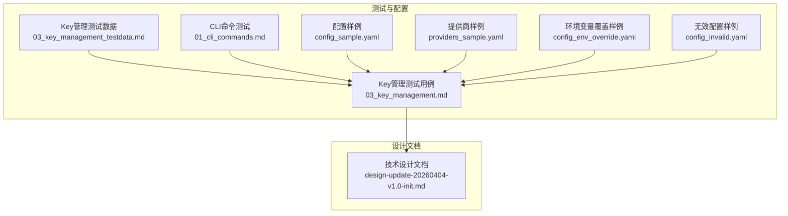
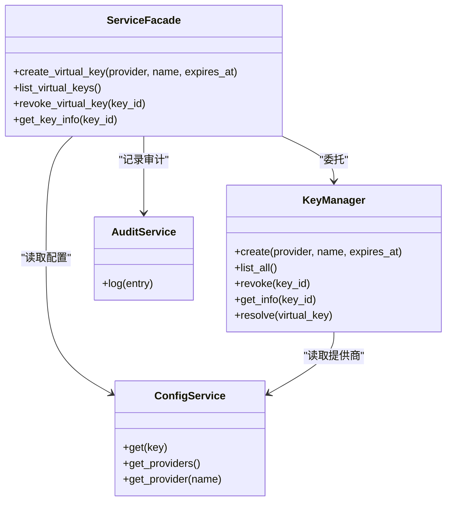
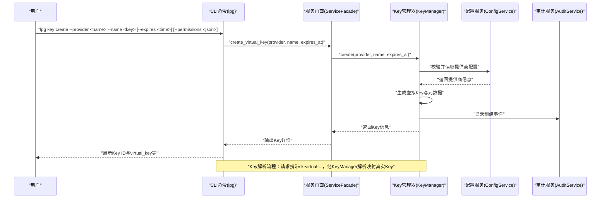
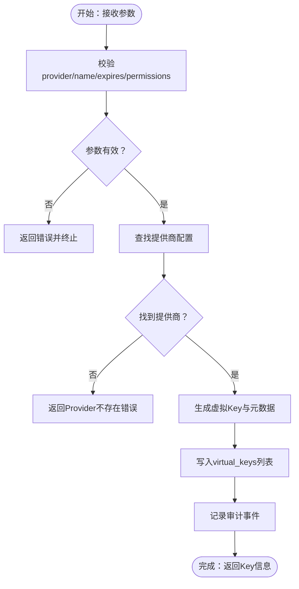
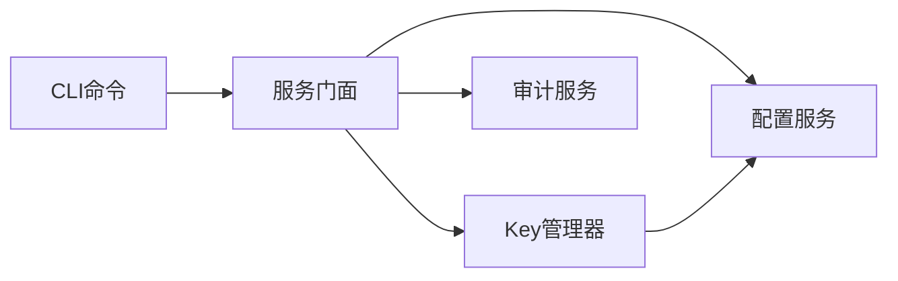

# Key创建与生成

<cite>
**本文引用的文件**
- [doc/test/tcs/v1.0/03_key_management.md](file://doc/test/tcs/v1.0/03_key_management.md)
- [doc/test/tcs/v1.0/03_key_management_testdata.md](file://doc/test/tcs/v1.0/03_key_management_testdata.md)
- [doc/test/tcs/v1.0/01_cli_commands.md](file://doc/test/tcs/v1.0/01_cli_commands.md)
- [doc/design/design-update-20260404-v1.0-init.md](file://doc/design/design-update-20260404-v1.0-init.md)
- [doc/test/tcs/v1.0/test_data/config_sample.yaml](file://doc/test/tcs/v1.0/test_data/config_sample.yaml)
- [doc/test/tcs/v1.0/test_data/providers_sample.yaml](file://doc/test/tcs/v1.0/test_data/providers_sample.yaml)
- [doc/test/tcs/v1.0/test_data/config_env_override.yaml](file://doc/test/tcs/v1.0/test_data/config_env_override.yaml)
- [doc/test/tcs/v1.0/test_data/config_invalid.yaml](file://doc/test/tcs/v1.0/test_data/config_invalid.yaml)
</cite>

## 目录
1. [简介](#简介)
2. [项目结构](#项目结构)
3. [核心组件](#核心组件)
4. [架构总览](#架构总览)
5. [详细组件分析](#详细组件分析)
6. [依赖分析](#依赖分析)
7. [性能考虑](#性能考虑)
8. [故障排查指南](#故障排查指南)
9. [结论](#结论)
10. [附录](#附录)

## 简介
本文件聚焦 LLM Privacy Gateway v1.0 的“Key创建与生成”能力，基于仓库中的黑盒测试用例与设计文档，系统化梳理虚拟 Key 的创建流程、命令行参数、配置选项、校验机制、唯一性与格式规范、权限分配、过期时间配置、错误处理与最佳实践。读者无需深入源码即可理解如何正确创建与管理虚拟 Key。

## 项目结构
围绕 Key 创建与生成的相关资料主要分布在以下位置：
- 测试用例与测试数据：doc/test/tcs/v1.0/03_key_management.md、03_key_management_testdata.md、01_cli_commands.md
- 配置样例：test_data/config_sample.yaml、providers_sample.yaml、config_env_override.yaml、config_invalid.yaml
- 架构与模块设计：doc/design/design-update-20260404-v1.0-init.md

**图表来源**
- [doc/test/tcs/v1.0/03_key_management.md:1-564](file://doc/test/tcs/v1.0/03_key_management.md#L1-L564)
- [doc/test/tcs/v1.0/03_key_management_testdata.md:1-384](file://doc/test/tcs/v1.0/03_key_management_testdata.md#L1-L384)
- [doc/test/tcs/v1.0/01_cli_commands.md:315-438](file://doc/test/tcs/v1.0/01_cli_commands.md#L315-L438)
- [doc/test/tcs/v1.0/test_data/config_sample.yaml:1-27](file://doc/test/tcs/v1.0/test_data/config_sample.yaml#L1-L27)
- [doc/test/tcs/v1.0/test_data/providers_sample.yaml:1-25](file://doc/test/tcs/v1.0/test_data/providers_sample.yaml#L1-L25)
- [doc/test/tcs/v1.0/test_data/config_env_override.yaml:1-16](file://doc/test/tcs/v1.0/test_data/config_env_override.yaml#L1-L16)
- [doc/test/tcs/v1.0/test_data/config_invalid.yaml:1-29](file://doc/test/tcs/v1.0/test_data/config_invalid.yaml#L1-L29)
- [doc/design/design-update-20260404-v1.0-init.md:280-311](file://doc/design/design-update-20260404-v1.0-init.md#L280-L311)

**章节来源**
- [doc/test/tcs/v1.0/03_key_management.md:1-564](file://doc/test/tcs/v1.0/03_key_management.md#L1-L564)
- [doc/test/tcs/v1.0/03_key_management_testdata.md:1-384](file://doc/test/tcs/v1.0/03_key_management_testdata.md#L1-L384)
- [doc/test/tcs/v1.0/01_cli_commands.md:315-438](file://doc/test/tcs/v1.0/01_cli_commands.md#L315-L438)
- [doc/design/design-update-20260404-v1.0-init.md:280-311](file://doc/design/design-update-20260404-v1.0-init.md#L280-L311)

## 核心组件
- CLI 命令层：lpg key create/list/show/revoke 等子命令，负责参数解析与调用服务门面。
- 服务门面（ServiceFacade）：统一暴露 create_virtual_key、list_virtual_keys、revoke_virtual_key、get_key_info 等能力。
- Key 管理器（KeyManager）：负责虚拟 Key 的创建、解析、吊销、查询与持久化（配置文件）。
- 配置服务（ConfigService）：提供提供商配置、全局配置读取与覆盖（环境变量优先级）。
- 审计服务（AuditService）：记录 Key 生命周期事件（创建、吊销、过期等）。

关键职责与交互见下图：

**图表来源**
- [doc/design/design-update-20260404-v1.0-init.md:415-568](file://doc/design/design-update-20260404-v1.0-init.md#L415-L568)

**章节来源**
- [doc/design/design-update-20260404-v1.0-init.md:415-568](file://doc/design/design-update-20260404-v1.0-init.md#L415-L568)

## 架构总览
Key 创建与解析的关键流程如下：

**图表来源**
- [doc/test/tcs/v1.0/03_key_management.md:36-125](file://doc/test/tcs/v1.0/03_key_management.md#L36-L125)
- [doc/design/design-update-20260404-v1.0-init.md:481-500](file://doc/design/design-update-20260404-v1.0-init.md#L481-L500)

**章节来源**
- [doc/test/tcs/v1.0/03_key_management.md:36-125](file://doc/test/tcs/v1.0/03_key_management.md#L36-L125)
- [doc/design/design-update-20260404-v1.0-init.md:481-500](file://doc/design/design-update-20260404-v1.0-init.md#L481-L500)

## 详细组件分析

### 命令行参数与使用示例
- 关键命令：lpg key create、lpg key list、lpg key show、lpg key revoke
- 常用参数
  - --provider：指定提供商名称（需与配置文件中的提供商一致）
  - --name：Key 名称（支持空格与特殊字符，长度限制见测试数据）
  - --expires：过期时间（ISO 8601格式，未来时间有效；过期或不存在将导致解析失败）
  - --permissions：权限配置（JSON字符串），支持模型、端点、Token限制等
- 示例（来自测试用例）
  - 创建带过期时间的 Key：lpg key create --provider openai --name temp-key --expires 2026-12-31T23:59:59
  - 创建带权限的 Key：lpg key create --provider openai --name limited-key --permissions '{"endpoints": ["/v1/chat/completions"]}'
  - 列出 Key：lpg key list
  - 查看 Key 详情：lpg key show <key_id>
  - 吊销 Key：lpg key revoke <key_id>

**章节来源**
- [doc/test/tcs/v1.0/01_cli_commands.md:315-438](file://doc/test/tcs/v1.0/01_cli_commands.md#L315-L438)
- [doc/test/tcs/v1.0/03_key_management.md:36-125](file://doc/test/tcs/v1.0/03_key_management.md#L36-L125)

### Key 格式规范与唯一性
- 格式规范
  - Key ID：vk_xxxxxxxxxxxxxxxx（示例测试用例）
  - 虚拟 Key：sk-virtual-xxxxxxxx（示例测试用例）
  - 长度与字符：48字符（字母数字），不含空格与特殊字符，前缀固定
- 唯一性
  - 多次创建后，Key ID 与 virtual_key 均应唯一；测试覆盖并发创建与唯一性校验
- 校验规则（来自测试数据）
  - 有效：sk-virtual-1234567890abcdef1234567890abcdef
  - 无效：空字符串、无前缀、超长/过短、包含空格或特殊字符、大小写错误、只有前缀、错误前缀

**章节来源**
- [doc/test/tcs/v1.0/03_key_management.md:36-125](file://doc/test/tcs/v1.0/03_key_management.md#L36-L125)
- [doc/test/tcs/v1.0/03_key_management_testdata.md:10-29](file://doc/test/tcs/v1.0/03_key_management_testdata.md#L10-L29)

### 配置选项与提供商选择
- 提供商配置
  - 配置文件中定义 providers（如 openai、anthropic、azure 等），每项包含 type、api_key、base_url、timeout 等
  - Key 创建时 --provider 必须与配置文件中的提供商名称一致
- 环境变量覆盖
  - 配置文件可通过环境变量覆盖（如 LPG_PROXY_HOST/LPG_PROXY_PORT 等），但 Key 创建直接依赖配置文件中的 providers
- 多提供商场景
  - 支持为不同提供商分别创建 Key，解析时按 Key 映射回对应提供商的真实 Key

**章节来源**
- [doc/test/tcs/v1.0/test_data/config_sample.yaml:1-27](file://doc/test/tcs/v1.0/test_data/config_sample.yaml#L1-L27)
- [doc/test/tcs/v1.0/test_data/providers_sample.yaml:1-25](file://doc/test/tcs/v1.0/test_data/providers_sample.yaml#L1-L25)
- [doc/test/tcs/v1.0/test_data/config_env_override.yaml:1-16](file://doc/test/tcs/v1.0/test_data/config_env_override.yaml#L1-L16)
- [doc/test/tcs/v1.0/03_key_management.md:190-202](file://doc/test/tcs/v1.0/03_key_management.md#L190-L202)

### 过期时间配置与权限分配
- 过期时间
  - 支持 ISO 8601 格式（含时区、毫秒、仅日期等），未来时间有效；过去时间将导致解析失败
  - 边界值测试覆盖：当前时间±1秒、闰年、无效日期等
- 权限配置
  - JSON 结构支持：endpoints（端点白名单，支持通配符）、max_tokens（Token 限制，必须为正整数）、models（模型白名单）
  - 空权限配置默认允许所有；额外字段会被忽略

**章节来源**
- [doc/test/tcs/v1.0/03_key_management_testdata.md:98-206](file://doc/test/tcs/v1.0/03_key_management_testdata.md#L98-L206)
- [doc/test/tcs/v1.0/03_key_management.md:83-110](file://doc/test/tcs/v1.0/03_key_management.md#L83-L110)

### Key 创建算法与唯一性保证
- Key 生成流程（基于测试与设计文档）
  - 参数校验：provider 存在、name 长度与字符合法、expires 格式与未来时间、permissions 结构合法
  - 映射提供商：读取配置文件中的提供商配置
  - 生成虚拟 Key：生成符合规范的 sk-virtual-xxxxxxxx
  - 写入持久化：将 Key 信息追加到配置文件的 virtual_keys 列表
  - 记录审计：记录创建事件
- 唯一性保证
  - Key ID 与 virtual_key 在多次创建后保持唯一；并发场景下无数据冲突（测试覆盖）

**图表来源**
- [doc/test/tcs/v1.0/03_key_management.md:36-125](file://doc/test/tcs/v1.0/03_key_management.md#L36-L125)
- [doc/test/tcs/v1.0/03_key_management_testdata.md:98-206](file://doc/test/tcs/v1.0/03_key_management_testdata.md#L98-L206)

**章节来源**
- [doc/test/tcs/v1.0/03_key_management.md:36-125](file://doc/test/tcs/v1.0/03_key_management.md#L36-L125)
- [doc/test/tcs/v1.0/03_key_management_testdata.md:98-206](file://doc/test/tcs/v1.0/03_key_management_testdata.md#L98-L206)

### 错误处理与失败场景
- Provider 不存在：返回“Provider not found”
- Key 不存在：吊销/查询/解析时返回“Key 不存在”
- Key 已过期：解析失败，返回“Invalid API key”
- Key 已吊销：解析失败，返回“Invalid API key”
- 配置无效：配置文件格式错误或字段缺失，启动/解析时报错
- 并发冲突：重复名称允许，ID 唯一；并发创建与吊销无竞争条件

**章节来源**
- [doc/test/tcs/v1.0/03_key_management.md:53-187](file://doc/test/tcs/v1.0/03_key_management.md#L53-L187)
- [doc/test/tcs/v1.0/03_key_management_testdata.md:219-243](file://doc/test/tcs/v1.0/03_key_management_testdata.md#L219-L243)
- [doc/test/tcs/v1.0/test_data/config_invalid.yaml:1-29](file://doc/test/tcs/v1.0/test_data/config_invalid.yaml#L1-L29)

### 最佳实践与安全建议
- 最小权限原则：通过 permissions 限制端点与模型，避免通配符滥用
- 合理设置过期时间：短期 Key 降低泄露风险；长期 Key 需严格管控
- 命名规范：使用语义化名称，便于审计与追踪
- 环境隔离：生产与开发使用不同 Key，避免混用
- 审计与监控：开启审计日志，定期检查 Key 使用统计与异常
- 配置安全：敏感信息（api_key）不应明文存储在公共仓库；使用环境变量或密管系统

**章节来源**
- [doc/test/tcs/v1.0/03_key_management_testdata.md:156-206](file://doc/test/tcs/v1.0/03_key_management_testdata.md#L156-L206)
- [doc/test/tcs/v1.0/03_key_management.md:36-125](file://doc/test/tcs/v1.0/03_key_management.md#L36-L125)

### 使用场景与配置示例
- 场景一：为不同团队/项目创建独立 Key，设置过期时间与端点白名单
- 场景二：临时 Key（短期有效）用于测试或应急，到期自动失效
- 场景三：多提供商场景，为 OpenAI/Anthropic/Azure 分别创建 Key，解析时自动映射
- 配置示例参考
  - 标准配置：providers/openai/anthropic/azure 等
  - 权限示例：限制端点与模型，设置 max_tokens
  - 环境变量覆盖：LPG_PROXY_HOST/LPG_PROXY_PORT 等

**章节来源**
- [doc/test/tcs/v1.0/test_data/config_sample.yaml:1-27](file://doc/test/tcs/v1.0/test_data/config_sample.yaml#L1-L27)
- [doc/test/tcs/v1.0/test_data/providers_sample.yaml:1-25](file://doc/test/tcs/v1.0/test_data/providers_sample.yaml#L1-L25)
- [doc/test/tcs/v1.0/03_key_management.md:190-202](file://doc/test/tcs/v1.0/03_key_management.md#L190-L202)

## 依赖分析
- CLI 命令依赖 ServiceFacade，后者再依赖 KeyManager、ConfigService、AuditService
- KeyManager 依赖 ConfigService 读取提供商配置
- Key 解析链路：请求携带 sk-virtual-... → KeyManager.resolve → 映射真实 Key → 转发至提供商

**图表来源**
- [doc/design/design-update-20260404-v1.0-init.md:415-568](file://doc/design/design-update-20260404-v1.0-init.md#L415-L568)

**章节来源**
- [doc/design/design-update-20260404-v1.0-init.md:415-568](file://doc/design/design-update-20260404-v1.0-init.md#L415-L568)

## 性能考虑
- Key 创建与解析均为内存操作，受配置文件大小与并发数影响
- 建议：Key 数量增长时定期清理过期与废弃 Key，减少配置文件体积
- 并发场景：测试覆盖高并发创建与解析，系统表现稳定

[本节为通用指导，不直接分析具体文件]

## 故障排查指南
- Provider 不存在：检查配置文件 providers 中是否存在该名称
- Key 解析失败（Invalid API key）：确认 Key 未过期、未吊销、格式正确
- 配置文件错误：检查 YAML 格式与必填字段（如 api_key/base_url）
- 并发问题：确认 Key ID 唯一，名称可重复；若出现异常，检查日志与审计记录

**章节来源**
- [doc/test/tcs/v1.0/03_key_management.md:53-187](file://doc/test/tcs/v1.0/03_key_management.md#L53-L187)
- [doc/test/tcs/v1.0/test_data/config_invalid.yaml:1-29](file://doc/test/tcs/v1.0/test_data/config_invalid.yaml#L1-L29)

## 结论
Key 创建与生成在 LLM Privacy Gateway v1.0 中通过 CLI 命令与服务门面实现，结合配置文件与审计服务，形成从创建、解析、吊销到过期处理的闭环。测试用例覆盖了格式规范、权限配置、过期时间、并发与错误处理等关键场景，确保功能稳定与安全可控。建议在实际使用中遵循最小权限、合理过期与命名规范等最佳实践。

[本节为总结性内容，不直接分析具体文件]

## 附录
- 常用命令速查
  - lpg key create --provider <name> --name <key> [--expires <time>] [--permissions <json>]
  - lpg key list
  - lpg key show <key_id>
  - lpg key revoke <key_id>
- 配置文件位置与环境变量覆盖参见配置样例文件

**章节来源**
- [doc/test/tcs/v1.0/01_cli_commands.md:315-438](file://doc/test/tcs/v1.0/01_cli_commands.md#L315-L438)
- [doc/test/tcs/v1.0/test_data/config_sample.yaml:1-27](file://doc/test/tcs/v1.0/test_data/config_sample.yaml#L1-L27)
- [doc/test/tcs/v1.0/test_data/config_env_override.yaml:1-16](file://doc/test/tcs/v1.0/test_data/config_env_override.yaml#L1-L16)