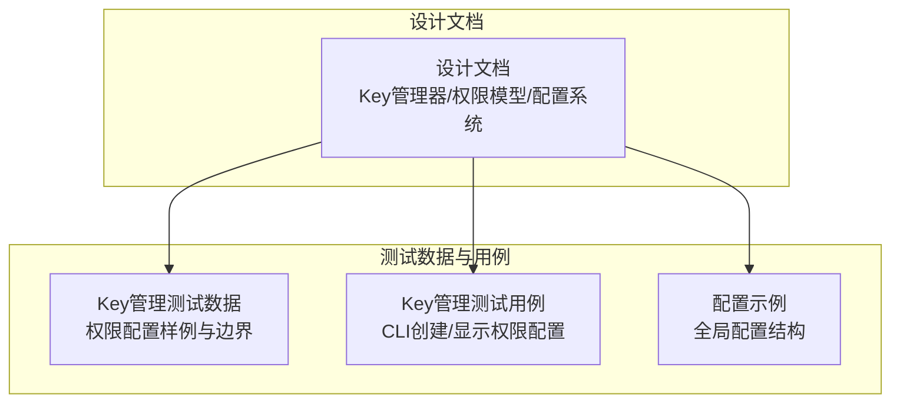
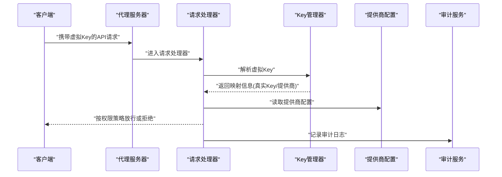
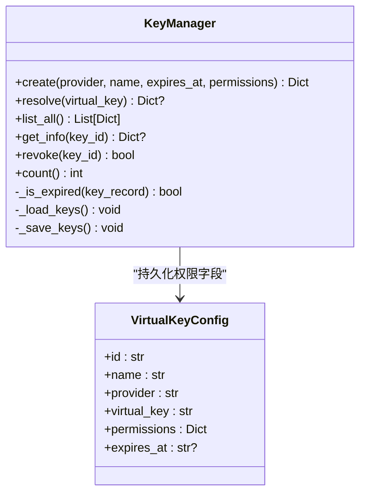
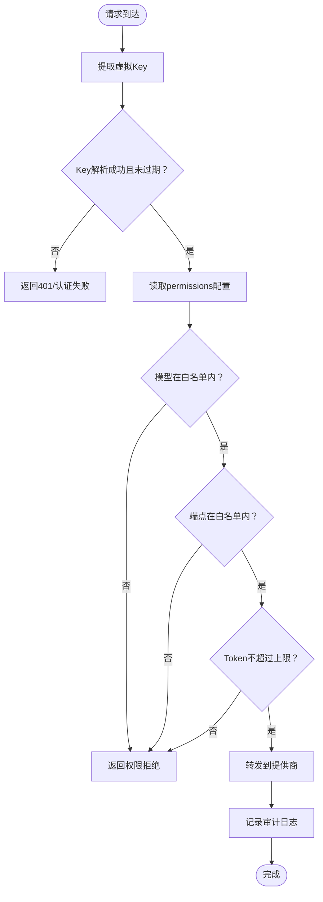
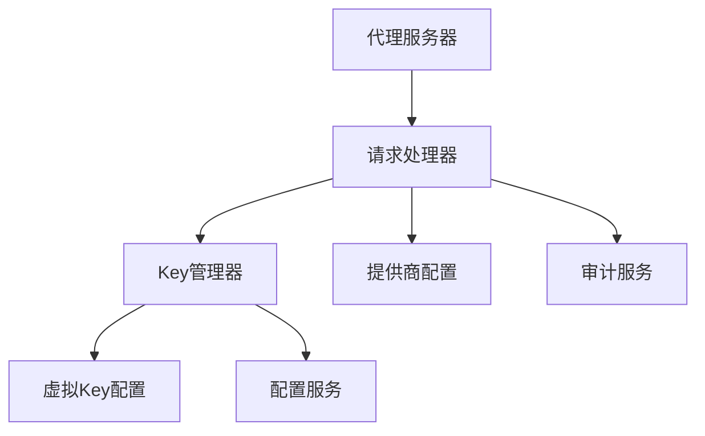

# Key权限控制

<cite>
**本文引用的文件**
- [设计文档](file://doc/design/design-update-20260404-v1.0-init.md)
- [Key管理测试数据](file://doc/test/tcs/v1.0/03_key_management_testdata.md)
- [Key管理测试用例](file://doc/test/tcs/v1.0/03_key_management.md)
- [配置示例](file://doc/test/tcs/v1.0/test_data/config_sample.yaml)
</cite>

## 目录
1. [简介](#简介)
2. [项目结构](#项目结构)
3. [核心组件](#核心组件)
4. [架构总览](#架构总览)
5. [详细组件分析](#详细组件分析)
6. [依赖分析](#依赖分析)
7. [性能考虑](#性能考虑)
8. [故障排除指南](#故障排除指南)
9. [结论](#结论)
10. [附录](#附录)

## 简介
本文件聚焦LLM Privacy Gateway的Key权限控制功能，系统化阐述虚拟Key的权限配置机制，包括端点权限、请求频率限制与模型访问控制。文档涵盖权限配置语法与JSON结构、权限验证流程、继承与组合规则、安全策略与风险评估、调试与故障排除方法，以及与审计日志等其他安全机制的集成关系。

## 项目结构
围绕Key权限控制的相关模块与文件分布如下：
- 设计文档：定义了虚拟Key管理器、权限数据模型、配置结构与服务门面等关键组件
- 测试数据与用例：提供了权限配置的样例、边界条件与组合场景
- 配置示例：展示全局配置文件结构，为理解权限生效范围提供上下文

**章节来源**
- [设计文档: 1115-1275:1115-1275](file://doc/design/design-update-20260404-v1.0-init.md#L1115-L1275)
- [设计文档: 1805-1880:1805-1880](file://doc/design/design-update-20260404-v1.0-init.md#L1805-L1880)
- [设计文档: 1931-2012:1931-2012](file://doc/design/design-update-20260404-v1.0-init.md#L1931-L2012)
- [Key管理测试数据: 156-208:156-208](file://doc/test/tcs/v1.0/03_key_management_testdata.md#L156-L208)
- [Key管理测试用例: 554-564:554-564](file://doc/test/tcs/v1.0/03_key_management.md#L554-L564)
- [配置示例: 1-27:1-27](file://doc/test/tcs/v1.0/test_data/config_sample.yaml#L1-L27)

## 核心组件
- Key管理器：负责虚拟Key的生成、解析、映射真实Key、生命周期管理与权限字段持久化
- 权限数据模型：定义虚拟Key的permissions字段结构，支持模型白名单、端点白名单与Token上限等
- 配置服务：提供提供商配置与全局配置读取，支撑Key解析与转发
- 审计服务：记录请求处理过程中的权限相关信息，便于合规与追踪

**章节来源**
- [设计文档: 1115-1275:1115-1275](file://doc/design/design-update-20260404-v1.0-init.md#L1115-L1275)
- [设计文档: 1805-1880:1805-1880](file://doc/design/design-update-20260404-v1.0-init.md#L1805-L1880)
- [设计文档: 411-568:411-568](file://doc/design/design-update-20260404-v1.0-init.md#L411-L568)

## 架构总览
Key权限控制在请求处理链路中的位置如下：

**图表来源**
- [设计文档: 570-741:570-741](file://doc/design/design-update-20260404-v1.0-init.md#L570-L741)
- [设计文档: 743-800:743-800](file://doc/design/design-update-20260404-v1.0-init.md#L743-L800)

## 详细组件分析

### Key管理器与权限字段
- 职责
  - 生成虚拟Key并持久化至配置
  - 解析虚拟Key，校验有效期，映射真实Key
  - 在解析成功后更新使用统计
- 权限字段
  - permissions为字典类型，默认为空对象
  - 支持模型白名单、端点白名单、Token上限等字段
  - 未识别字段会被忽略，空权限对象默认允许所有

**图表来源**
- [设计文档: 1115-1275:1115-1275](file://doc/design/design-update-20260404-v1.0-init.md#L1115-L1275)
- [设计文档: 1844-1852:1844-1852](file://doc/design/design-update-20260404-v1.0-init.md#L1844-L1852)

**章节来源**
- [设计文档: 1115-1275:1115-1275](file://doc/design/design-update-20260404-v1.0-init.md#L1115-L1275)
- [设计文档: 1844-1852:1844-1852](file://doc/design/design-update-20260404-v1.0-init.md#L1844-L1852)

### 权限配置语法与JSON结构
- 结构要点
  - permissions为顶层字典，支持以下字段：
    - models：模型白名单，支持通配符
    - endpoints：端点白名单，支持通配符
    - max_tokens：单次请求Token上限（整数，0或负数视为无效）
  - 空权限对象默认允许所有；额外字段会被忽略
- 示例
  - 允许所有模型与端点，设置较高Token上限
  - 限制特定模型与端点，设置较低Token上限
  - 使用通配符匹配端点或模型前缀

**章节来源**
- [Key管理测试数据: 156-208:156-208](file://doc/test/tcs/v1.0/03_key_management_testdata.md#L156-L208)
- [Key管理测试用例: 554-564:554-564](file://doc/test/tcs/v1.0/03_key_management.md#L554-L564)

### 权限验证流程与检查机制
- 解析阶段
  - 从请求中提取虚拟Key
  - 在Key管理器中解析并校验有效期
  - 若解析失败或过期，返回认证失败
- 权限检查（基于permissions字段）
  - 模型白名单：若请求模型不在白名单内则拒绝
  - 端点白名单：若请求端点不在白名单内则拒绝
  - Token上限：若请求Token超过上限则拒绝
- 审计记录
  - 记录权限检查结果与拒绝原因，便于合规与追踪

**图表来源**
- [设计文档: 743-800:743-800](file://doc/design/design-update-20260404-v1.0-init.md#L743-L800)
- [Key管理测试数据: 156-208:156-208](file://doc/test/tcs/v1.0/03_key_management_testdata.md#L156-L208)

**章节来源**
- [设计文档: 743-800:743-800](file://doc/design/design-update-20260404-v1.0-init.md#L743-L800)
- [Key管理测试数据: 156-208:156-208](file://doc/test/tcs/v1.0/03_key_management_testdata.md#L156-L208)

### 权限继承与组合规则
- 继承规则
  - 虚拟Key的permissions直接来源于创建时提供的配置
  - 未显式配置的字段采用默认行为（例如空对象默认允许所有）
- 组合规则
  - 多字段组合时需同时满足：模型白名单、端点白名单、Token上限
  - 任一条件不满足即拒绝
- 通配符支持
  - models与endpoints均支持通配符，用于简化配置与灵活匹配

**章节来源**
- [Key管理测试数据: 156-208:156-208](file://doc/test/tcs/v1.0/03_key_management_testdata.md#L156-L208)

### 权限配置示例与最佳实践
- 示例
  - 最小权限：仅允许特定端点与模型，并设置合理Token上限
  - 最大权限：允许所有模型与端点，设置较高Token上限（谨慎使用）
- 最佳实践
  - 以“最小权限”为原则，逐步放开
  - 对高频调用场景设置合理的Token上限，防止滥用
  - 使用通配符时注意粒度控制，避免过度宽泛
  - 定期审查Key权限配置，及时回收不再使用的Key

**章节来源**
- [Key管理测试数据: 367-372:367-372](file://doc/test/tcs/v1.0/03_key_management_testdata.md#L367-L372)
- [Key管理测试用例: 106-108:106-108](file://doc/test/tcs/v1.0/03_key_management.md#L106-L108)

### 安全策略与风险评估
- 安全策略
  - 强制使用虚拟Key进行鉴权，真实Key仅在内部使用
  - 权限配置与Key生命周期分离，支持吊销与过期控制
  - 审计日志记录权限检查与拒绝事件，支持追溯
- 风险评估
  - 过度宽松的权限可能导致敏感端点或模型被滥用
  - 通配符配置不当可能扩大攻击面
  - 未设置Token上限可能引发资源消耗风险

**章节来源**
- [设计文档: 1115-1275:1115-1275](file://doc/design/design-update-20260404-v1.0-init.md#L1115-L1275)
- [设计文档: 1805-1880:1805-1880](file://doc/design/design-update-20260404-v1.0-init.md#L1805-L1880)

### 与其他安全机制的集成
- 与审计日志集成
  - 权限检查失败与通过均会记录审计条目，便于合规与取证
- 与提供商配置集成
  - Key解析成功后读取提供商配置，确保真实Key与上游服务一致
- 与配置系统集成
  - 权限配置作为虚拟Key的一部分，随配置文件持久化与加载

**章节来源**
- [设计文档: 411-568:411-568](file://doc/design/design-update-20260404-v1.0-init.md#L411-L568)
- [设计文档: 1931-2012:1931-2012](file://doc/design/design-update-20260404-v1.0-init.md#L1931-L2012)

## 依赖分析
Key权限控制涉及的关键依赖关系如下：

**图表来源**
- [设计文档: 411-568:411-568](file://doc/design/design-update-20260404-v1.0-init.md#L411-L568)
- [设计文档: 570-741:570-741](file://doc/design/design-update-20260404-v1.0-init.md#L570-L741)

**章节来源**
- [设计文档: 411-568:411-568](file://doc/design/design-update-20260404-v1.0-init.md#L411-L568)
- [设计文档: 570-741:570-741](file://doc/design/design-update-20260404-v1.0-init.md#L570-L741)

## 性能考虑
- Key解析与权限检查为轻量逻辑，通常不会成为瓶颈
- 建议对频繁访问的端点与模型进行白名单缓存，减少重复计算
- 合理设置Token上限，避免单次请求过大导致下游压力

## 故障排除指南
- 常见问题
  - 401认证失败：确认虚拟Key格式正确、未过期、未被吊销
  - 权限拒绝：检查permissions配置是否包含所需模型/端点，Token是否超限
  - 配置未生效：确认虚拟Key的permissions字段已正确写入配置文件
- 调试步骤
  - 使用CLI命令创建Key并指定permissions，随后查看Key详情确认字段
  - 通过审计日志定位权限拒绝的具体原因
  - 使用测试数据中的边界用例验证权限配置的正确性

**章节来源**
- [Key管理测试用例: 106-108:106-108](file://doc/test/tcs/v1.0/03_key_management.md#L106-L108)
- [Key管理测试用例: 292-294:292-294](file://doc/test/tcs/v1.0/03_key_management.md#L292-L294)
- [Key管理测试数据: 209-243:209-243](file://doc/test/tcs/v1.0/03_key_management_testdata.md#L209-L243)

## 结论
Key权限控制通过虚拟Key与permissions配置实现了细粒度的访问治理，结合审计日志与提供商配置，形成完整的安全闭环。遵循最小权限原则、合理使用通配符与Token上限，并定期审查权限配置，是保障系统安全与合规的关键。

## 附录
- 配置文件示例（全局配置）
  - 展示代理、日志、提供商、规则与审计等配置项，为理解权限生效范围提供参考

**章节来源**
- [配置示例: 1-27:1-27](file://doc/test/tcs/v1.0/test_data/config_sample.yaml#L1-L27)