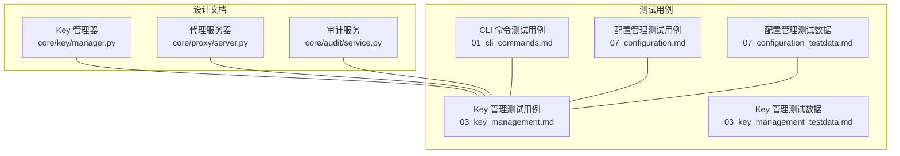
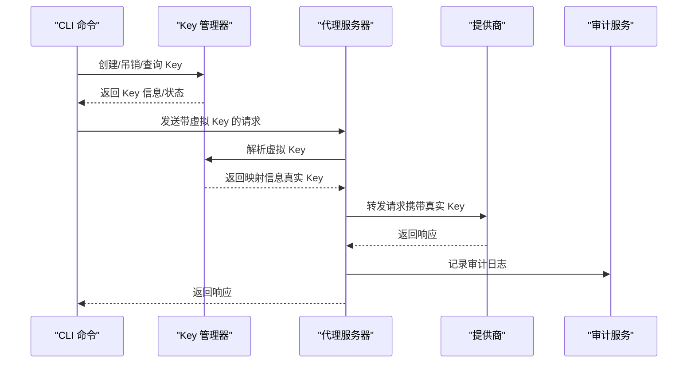
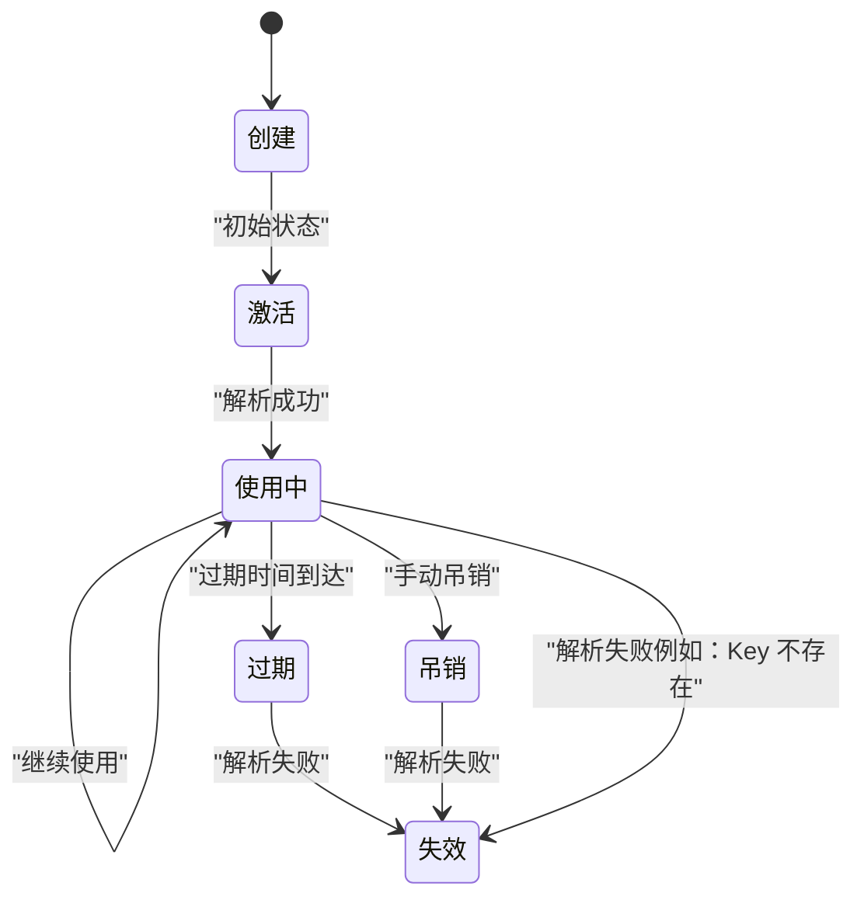
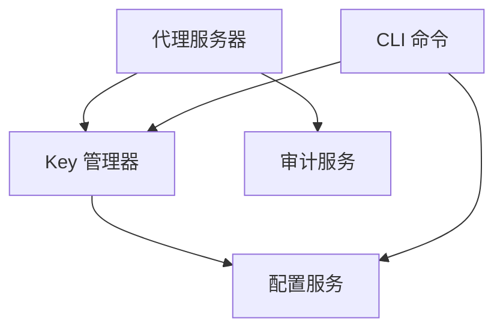

# Key生命周期管理

<cite>
**本文引用的文件**
- [03_key_management.md](file://doc/test/tcs/v1.0/03_key_management.md)
- [03_key_management_testdata.md](file://doc/test/tcs/v1.0/03_key_management_testdata.md)
- [07_configuration.md](file://doc/test/tcs/v1.0/07_configuration.md)
- [07_configuration_testdata.md](file://doc/test/tcs/v1.0/07_configuration_testdata.md)
- [01_cli_commands.md](file://doc/test/tcs/v1.0/01_cli_commands.md)
- [design-update-20260404-v1.0-init.md](file://doc/design/design-update-20260404-v1.0-init.md)
</cite>

## 目录
1. [简介](#简介)
2. [项目结构](#项目结构)
3. [核心组件](#核心组件)
4. [架构总览](#架构总览)
5. [详细组件分析](#详细组件分析)
6. [依赖分析](#依赖分析)
7. [性能考虑](#性能考虑)
8. [故障排查指南](#故障排查指南)
9. [结论](#结论)
10. [附录](#附录)

## 简介
本文件围绕 LLM Privacy Gateway 的 Key 生命周期管理功能进行系统化文档化，涵盖 Key 的创建、激活、使用、过期与吊销等关键阶段，解释状态转换机制与管理策略，详述过期处理（自动失效、过期通知与清理）、吊销流程（手动与自动）以及监控与审计能力，并提供最佳实践与安全策略、配置示例与典型使用场景。

## 项目结构
Key 生命周期管理相关的设计与测试资料主要分布在以下位置：
- 设计文档：包含 Key 管理器、代理服务器、审计服务等核心组件的职责与交互
- 测试用例：覆盖 Key 创建、解析、列表、详情、吊销、过期处理、使用统计、并发操作等
- 配置管理：提供 Key 配置项、提供商配置、虚拟 Key 配置等
- CLI 命令：提供 Key 管理相关的命令行操作入口

图表来源
- [design-update-20260404-v1.0-init.md](file://doc/design/design-update-20260404-v1.0-init.md)
- [03_key_management.md](file://doc/test/tcs/v1.0/03_key_management.md)
- [03_key_management_testdata.md](file://doc/test/tcs/v1.0/03_key_management_testdata.md)
- [01_cli_commands.md](file://doc/test/tcs/v1.0/01_cli_commands.md)
- [07_configuration.md](file://doc/test/tcs/v1.0/07_configuration.md)
- [07_configuration_testdata.md](file://doc/test/tcs/v1.0/07_configuration_testdata.md)

章节来源
- [design-update-20260404-v1.0-init.md](file://doc/design/design-update-20260404-v1.0-init.md)
- [03_key_management.md](file://doc/test/tcs/v1.0/03_key_management.md)
- [03_key_management_testdata.md](file://doc/test/tcs/v1.0/03_key_management_testdata.md)
- [01_cli_commands.md](file://doc/test/tcs/v1.0/01_cli_commands.md)
- [07_configuration.md](file://doc/test/tcs/v1.0/07_configuration.md)
- [07_configuration_testdata.md](file://doc/test/tcs/v1.0/07_configuration_testdata.md)

## 核心组件
- Key 管理器（KeyManager）：负责虚拟 Key 的生成、映射、生命周期管理（创建、解析、吊销、统计、过期判断）
- 代理服务器（ProxyServer）：接收请求、调用 Key 管理器解析 Key、转发到提供商、记录审计日志
- 审计服务（AuditService）：记录请求处理日志、提供查询与统计、支持导出与清理

章节来源
- [design-update-20260404-v1.0-init.md](file://doc/design/design-update-20260404-v1.0-init.md)

## 架构总览
Key 生命周期管理在系统中的整体流程如下：
- CLI 命令触发 Key 创建、列表、详情、吊销等操作
- Key 管理器维护虚拟 Key 与真实 Key 的映射关系，并记录使用统计
- 代理服务器在请求到达时解析虚拟 Key，校验过期状态，替换为真实 Key 后转发
- 审计服务记录请求处理过程，支持查询、统计与导出

图表来源
- [design-update-20260404-v1.0-init.md](file://doc/design/design-update-20260404-v1.0-init.md)
- [03_key_management.md](file://doc/test/tcs/v1.0/03_key_management.md)

## 详细组件分析

### Key 生命周期阶段与状态管理
- 创建阶段
  - CLI 命令触发 Key 创建，Key 管理器生成虚拟 Key 与唯一 ID，记录提供商、名称、过期时间、权限等信息
  - Key 初始状态为“激活”，使用次数为 0，最后使用时间为 None
- 激活阶段
  - Key 可用于请求解析与转发；每次解析成功会更新使用次数与最后使用时间
- 使用阶段
  - 代理服务器解析虚拟 Key，校验过期状态；若未过期，则替换为真实 Key 并转发
  - 使用统计实时更新，支持后续审计与监控
- 过期阶段
  - 过期时间到期后，Key 自动失效，解析返回失败
  - 过期处理遵循 ISO 8601 格式，支持边界值测试（刚过期、未来时间、无效时间等）
- 吊销阶段
  - 手动吊销：通过 CLI 命令吊销 Key，Key 从存储中移除，后续解析失败
  - 自动吊销：测试数据中包含“已吊销 Key”场景，解析返回相应错误信息
  - 撤销恢复：当前实现为直接移除，未提供撤销恢复功能

图表来源
- [03_key_management.md](file://doc/test/tcs/v1.0/03_key_management.md)
- [03_key_management_testdata.md](file://doc/test/tcs/v1.0/03_key_management_testdata.md)

章节来源
- [03_key_management.md](file://doc/test/tcs/v1.0/03_key_management.md)
- [03_key_management_testdata.md](file://doc/test/tcs/v1.0/03_key_management_testdata.md)

### Key 状态转换机制与策略
- 状态转换
  - 创建 → 激活（初始）
  - 激活 → 使用中（解析成功）
  - 使用中 → 过期（过期时间到达）
  - 使用中 → 吊销（手动吊销）
  - 使用中/过期/吊销 → 失效（解析失败）
- 策略
  - 过期策略：基于 ISO 8601 过期时间比较，过期即失效
  - 吊销策略：直接移除 Key 记录，后续解析失败
  - 使用统计策略：每次解析成功更新使用次数与最后使用时间

章节来源
- [design-update-20260404-v1.0-init.md](file://doc/design/design-update-20260404-v1.0-init.md)
- [03_key_management.md](file://doc/test/tcs/v1.0/03_key_management.md)

### Key 过期处理机制
- 自动失效
  - 过期时间到达后，解析返回失败，请求被拒绝
- 过期通知与清理
  - 当前实现未提供专门的过期通知机制；可通过审计日志与使用统计进行事后追踪
  - 清理策略：Key 过期后仍可存在于列表中，但解析失败；建议结合外部调度定期清理过期 Key
- 边界测试
  - 包含过期时间边界值测试（当前时间±1 秒），验证过期前后的行为差异

章节来源
- [03_key_management.md](file://doc/test/tcs/v1.0/03_key_management.md)
- [03_key_management_testdata.md](file://doc/test/tcs/v1.0/03_key_management_testdata.md)

### Key 吊销流程
- 手动吊销
  - 通过 CLI 命令吊销 Key，Key 从存储中移除，后续解析失败
- 自动吊销
  - 测试数据包含“已吊销 Key”的场景，解析返回相应错误信息
- 撤销恢复
  - 当前实现未提供撤销恢复功能；建议在业务层面增加“撤销恢复”策略（如软删除与恢复）

章节来源
- [03_key_management.md](file://doc/test/tcs/v1.0/03_key_management.md)
- [03_key_management_testdata.md](file://doc/test/tcs/v1.0/03_key_management_testdata.md)
- [01_cli_commands.md](file://doc/test/tcs/v1.0/01_cli_commands.md)

### Key 使用统计与监控
- 使用统计
  - 每次解析成功会更新使用次数与最后使用时间
  - 列表与详情接口包含使用统计字段，便于监控与审计
- 监控与审计
  - 代理服务器在请求处理完成后记录审计日志，包含请求 URL、方法、状态、耗时、PII 检测结果等
  - 审计服务支持日志查询、统计与导出，可用于 Key 使用行为的长期追踪

章节来源
- [design-update-20260404-v1.0-init.md](file://doc/design/design-update-20260404-v1.0-init.md)
- [03_key_management.md](file://doc/test/tcs/v1.0/03_key_management.md)

### Key 生命周期的监控与审计
- 审计日志
  - 记录请求处理全过程，支持按时间范围、级别、关键词等条件查询
  - 提供统计信息（总请求数、成功率、PII 检测数等）与导出功能
- 监控建议
  - 结合使用统计与审计日志，建立 Key 使用趋势与异常告警
  - 对频繁过期或吊销的 Key 进行专项审计与复盘

章节来源
- [design-update-20260404-v1.0-init.md](file://doc/design/design-update-20260404-v1.0-init.md)
- [03_key_management.md](file://doc/test/tcs/v1.0/03_key_management.md)

### Key 生命周期管理最佳实践与安全策略
- 最佳实践
  - 为 Key 设置合理的过期时间，避免长期有效 Key 带来的风险
  - 为不同用途与权限的 Key 配置细粒度权限，降低滥用风险
  - 定期清理过期与废弃 Key，保持 Key 管理整洁
  - 使用审计日志与使用统计进行持续监控与合规审计
- 安全策略
  - Key 生成采用安全随机源，避免可预测性
  - 审计日志中对敏感信息（如 API Key）进行掩码处理
  - 严格控制 Key 的访问权限与使用范围，遵循最小权限原则

章节来源
- [03_key_management_testdata.md](file://doc/test/tcs/v1.0/03_key_management_testdata.md)
- [07_configuration_testdata.md](file://doc/test/tcs/v1.0/07_configuration_testdata.md)

### 配置示例与使用场景
- 配置示例
  - Key 创建：通过 CLI 命令创建带提供商、名称、过期时间与权限的 Key
  - 列表与详情：通过 CLI 命令查看 Key 列表与详细信息
  - 吊销：通过 CLI 命令吊销指定 Key
- 使用场景
  - 开发与测试：短期有效 Key，便于快速迭代与回收
  - 生产环境：细粒度权限 Key，配合审计日志进行合规监控
  - 多提供商：为不同提供商分别创建 Key，隔离风险

章节来源
- [01_cli_commands.md](file://doc/test/tcs/v1.0/01_cli_commands.md)
- [07_configuration.md](file://doc/test/tcs/v1.0/07_configuration.md)
- [07_configuration_testdata.md](file://doc/test/tcs/v1.0/07_configuration_testdata.md)

## 依赖分析
Key 生命周期管理涉及的关键依赖关系如下：
- Key 管理器依赖配置服务，用于读取提供商配置与持久化 Key
- 代理服务器依赖 Key 管理器进行 Key 解析，依赖审计服务进行日志记录
- CLI 命令依赖 Key 管理器与配置服务，提供 Key 管理与配置操作入口

图表来源
- [design-update-20260404-v1.0-init.md](file://doc/design/design-update-20260404-v1.0-init.md)
- [01_cli_commands.md](file://doc/test/tcs/v1.0/01_cli_commands.md)

章节来源
- [design-update-20260404-v1.0-init.md](file://doc/design/design-update-20260404-v1.0-init.md)
- [01_cli_commands.md](file://doc/test/tcs/v1.0/01_cli_commands.md)

## 性能考虑
- Key 解析性能
  - Key 解析为内存查找与时间比较，复杂度较低，适合高并发场景
- 使用统计更新
  - 每次解析成功都会更新使用次数与最后使用时间，建议在高并发下关注存储写入开销
- 审计日志
  - 审计日志写入为顺序追加，建议合理配置日志轮转与保留策略，避免磁盘压力

[本节为通用指导，无需特定文件引用]

## 故障排查指南
- Key 解析失败
  - 检查 Key 是否过期或已被吊销
  - 确认虚拟 Key 格式与提供商配置是否正确
- 过期 Key 仍然可用
  - 检查过期时间格式与系统时间是否一致
  - 验证边界值测试场景（过期前/过期后）
- 吊销 Key 仍可使用
  - 确认吊销操作是否成功，Key 是否从存储中移除
- 审计日志缺失
  - 检查审计服务配置与日志文件路径
  - 确认代理服务器是否正确记录审计日志

章节来源
- [03_key_management.md](file://doc/test/tcs/v1.0/03_key_management.md)
- [03_key_management_testdata.md](file://doc/test/tcs/v1.0/03_key_management_testdata.md)
- [design-update-20260404-v1.0-init.md](file://doc/design/design-update-20260404-v1.0-init.md)

## 结论
Key 生命周期管理在 LLM Privacy Gateway 中通过 Key 管理器、代理服务器与审计服务协同实现，具备完善的创建、解析、使用统计与吊销能力，并通过审计日志提供监控与合规支持。建议在生产环境中结合过期策略、权限控制与审计监控，形成闭环的安全管理体系。

[本节为总结性内容，无需特定文件引用]

## 附录
- 相关测试用例与数据
  - Key 管理测试用例与测试数据
  - CLI 命令测试用例
  - 配置管理测试用例与测试数据
- 设计文档
  - Key 管理器、代理服务器、审计服务设计

章节来源
- [03_key_management.md](file://doc/test/tcs/v1.0/03_key_management.md)
- [03_key_management_testdata.md](file://doc/test/tcs/v1.0/03_key_management_testdata.md)
- [01_cli_commands.md](file://doc/test/tcs/v1.0/01_cli_commands.md)
- [07_configuration.md](file://doc/test/tcs/v1.0/07_configuration.md)
- [07_configuration_testdata.md](file://doc/test/tcs/v1.0/07_configuration_testdata.md)
- [design-update-20260404-v1.0-init.md](file://doc/design/design-update-20260404-v1.0-init.md)