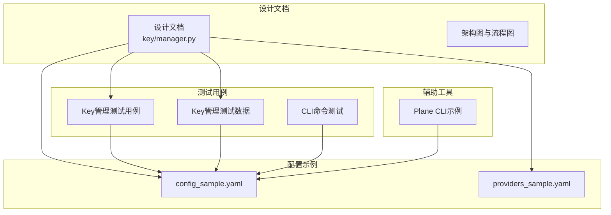
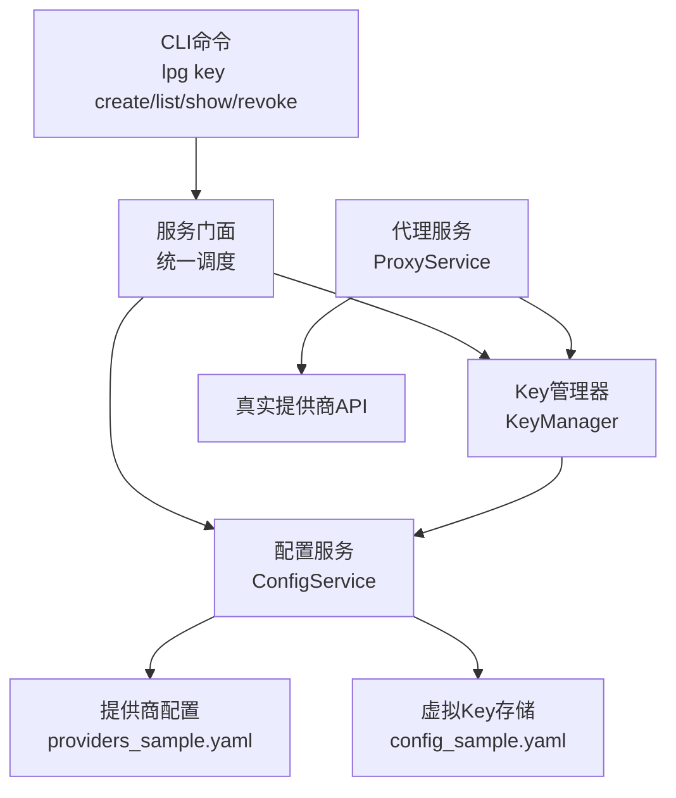
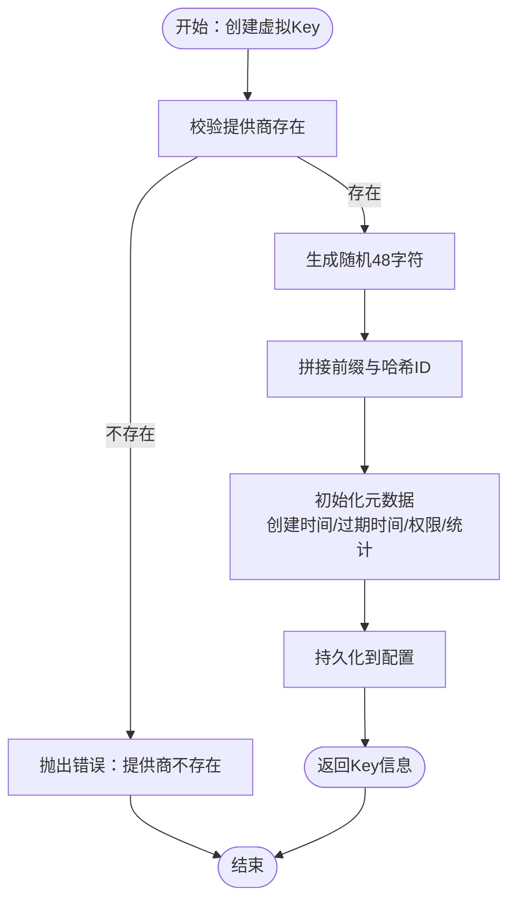
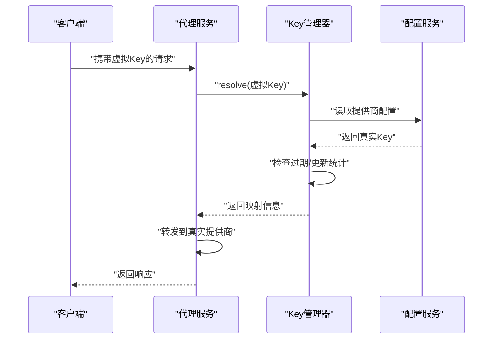
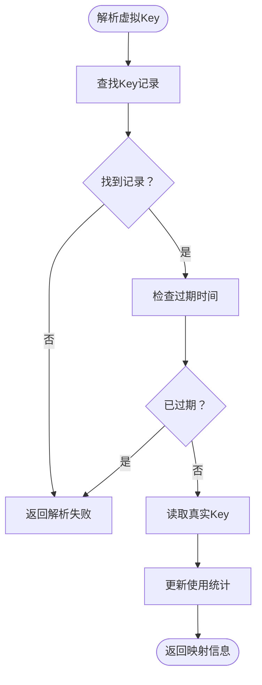
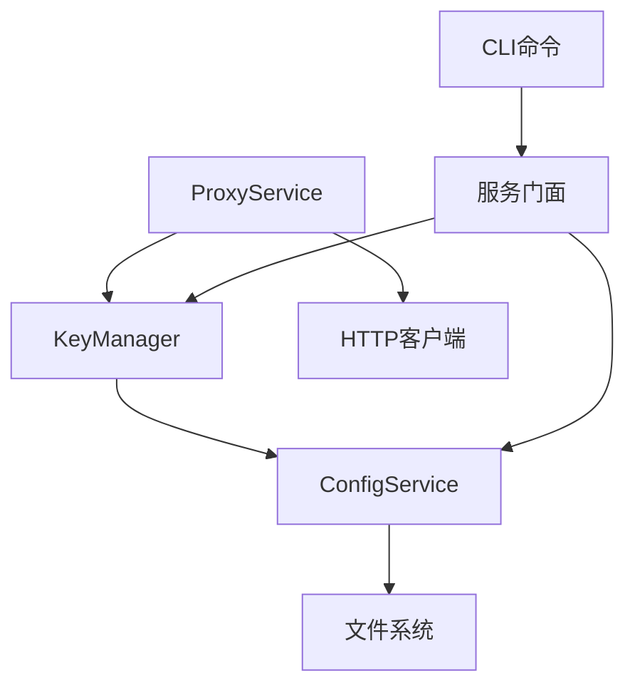

# 虚拟Key管理系统

<cite>
**本文档引用的文件**
- [design-update-20260404-v1.0-init.md](file://doc/design/design-update-20260404-v1.0-init.md)
- [03_key_management.md](file://doc/test/tcs/v1.0/03_key_management.md)
- [03_key_management_testdata.md](file://doc/test/tcs/v1.0/03_key_management_testdata.md)
- [01_cli_commands.md](file://doc/test/tcs/v1.0/01_cli_commands.md)
- [config_sample.yaml](file://doc/test/tcs/v1.0/test_data/config_sample.yaml)
- [providers_sample.yaml](file://doc/test/tcs/v1.0/test_data/providers_sample.yaml)
- [plane_cli.py](file://doc/test/issues_management_platform/cli/plane_cli.py)
</cite>

## 目录
1. [简介](#简介)
2. [项目结构](#项目结构)
3. [核心组件](#核心组件)
4. [架构概览](#架构概览)
5. [详细组件分析](#详细组件分析)
6. [依赖分析](#依赖分析)
7. [性能考虑](#性能考虑)
8. [故障排除指南](#故障排除指南)
9. [结论](#结论)
10. [附录](#附录)

## 简介
本文件为 LLM Privacy Gateway 的虚拟Key管理系统提供全面的技术文档。系统通过“虚拟Key”对真实提供商API Key进行抽象与隔离，实现细粒度的访问控制、生命周期管理、使用统计与审计追踪。本文档涵盖虚拟Key的生成机制、映射流程、权限控制、安全策略、生命周期管理、过期处理、审计与配置示例，并给出与其他组件的集成关系与故障排除建议。

## 项目结构
围绕虚拟Key管理的相关文件主要分布在设计文档与测试用例中，形成“设计-测试-配置”的闭环：
- 设计文档：定义虚拟Key管理器的职责、数据结构与核心流程
- 测试用例：覆盖创建、解析、列表、详情、吊销、过期处理、使用统计等全链路
- 测试数据：提供格式校验、提供商校验、权限配置、并发与边界值等详尽样例
- 配置文件：演示代理、提供商与虚拟Key存储的配置方式

**图表来源**
- [design-update-20260404-v1.0-init.md](file://doc/design/design-update-20260404-v1.0-init.md)
- [03_key_management.md](file://doc/test/tcs/v1.0/03_key_management.md)
- [03_key_management_testdata.md](file://doc/test/tcs/v1.0/03_key_management_testdata.md)
- [01_cli_commands.md](file://doc/test/tcs/v1.0/01_cli_commands.md)
- [config_sample.yaml](file://doc/test/tcs/v1.0/test_data/config_sample.yaml)
- [providers_sample.yaml](file://doc/test/tcs/v1.0/test_data/providers_sample.yaml)
- [plane_cli.py](file://doc/test/issues_management_platform/cli/plane_cli.py)

**章节来源**
- [design-update-20260404-v1.0-init.md](file://doc/design/design-update-20260404-v1.0-init.md)
- [03_key_management.md](file://doc/test/tcs/v1.0/03_key_management.md)
- [03_key_management_testdata.md](file://doc/test/tcs/v1.0/03_key_management_testdata.md)
- [01_cli_commands.md](file://doc/test/tcs/v1.0/01_cli_commands.md)
- [config_sample.yaml](file://doc/test/tcs/v1.0/test_data/config_sample.yaml)
- [providers_sample.yaml](file://doc/test/tcs/v1.0/test_data/providers_sample.yaml)
- [plane_cli.py](file://doc/test/issues_management_platform/cli/plane_cli.py)

## 核心组件
- 虚拟Key管理器（KeyManager）
  - 职责：生成虚拟Key、维护虚拟Key与真实Key映射、生命周期管理、使用统计
  - 关键方法：创建、解析、列表、详情、吊销、计数、过期判断
  - 数据存储：基于配置服务的虚拟Key数组持久化
- 配置服务（ConfigService）
  - 职责：提供提供商配置、真实Key读取、虚拟Key集合读写
- CLI服务门面（Service Facade）
  - 职责：暴露命令（key create/list/show/revoke等），调用KeyManager与ConfigService
- 代理服务（ProxyService）
  - 职责：接收请求、提取Authorization头中的虚拟Key、调用KeyManager解析、转发至真实提供商

**章节来源**
- [design-update-20260404-v1.0-init.md](file://doc/design/design-update-20260404-v1.0-init.md)
- [03_key_management.md](file://doc/test/tcs/v1.0/03_key_management.md)
- [01_cli_commands.md](file://doc/test/tcs/v1.0/01_cli_commands.md)

## 架构概览
虚拟Key管理贯穿“CLI命令—配置服务—Key管理器—代理解析—真实提供商”的链路，形成“配置驱动、命令入口、解析映射、统计审计”的闭环。

**图表来源**
- [design-update-20260404-v1.0-init.md](file://doc/design/design-update-20260404-v1.0-init.md)
- [03_key_management.md](file://doc/test/tcs/v1.0/03_key_management.md)
- [config_sample.yaml](file://doc/test/tcs/v1.0/test_data/config_sample.yaml)
- [providers_sample.yaml](file://doc/test/tcs/v1.0/test_data/providers_sample.yaml)

## 详细组件分析

### 虚拟Key生成机制
- 格式规范
  - 前缀固定为“sk-virtual-”
  - 随机部分长度为48字符（十六进制），确保全局唯一性
  - Key ID由虚拟Key进行哈希截断得到，作为索引标识
- 创建流程
  - 校验提供商是否存在
  - 生成随机虚拟Key与Key ID
  - 写入创建时间、过期时间、权限、使用统计等字段
  - 持久化到配置的虚拟Key数组

**图表来源**
- [design-update-20260404-v1.0-init.md](file://doc/design/design-update-20260404-v1.0-init.md)

**章节来源**
- [design-update-20260404-v1.0-init.md](file://doc/design/design-update-20260404-v1.0-init.md)
- [03_key_management_testdata.md](file://doc/test/tcs/v1.0/03_key_management_testdata.md)

### Key映射机制与解析流程
- 解析步骤
  - 遍历虚拟Key集合，匹配虚拟Key字符串
  - 检查是否过期（过期直接返回失败）
  - 读取对应提供商的真实Key
  - 更新使用次数与最后使用时间
  - 返回映射信息（提供商、真实Key、Key ID）
- 映射关系
  - 一对一：每个虚拟Key映射到一个真实Key
  - 多提供商：同一系统可配置多个提供商，虚拟Key按提供商分类

**图表来源**
- [design-update-20260404-v1.0-init.md](file://doc/design/design-update-20260404-v1.0-init.md)

**章节来源**
- [design-update-20260404-v1.0-init.md](file://doc/design/design-update-20260404-v1.0-init.md)
- [03_key_management.md](file://doc/test/tcs/v1.0/03_key_management.md)

### 生命周期管理与过期处理
- 生命周期阶段
  - 创建：生成虚拟Key并持久化
  - 使用：解析时更新使用次数与最后使用时间
  - 吊销：从持久化集合中删除（视为无效）
  - 过期：根据过期时间判断是否可用
- 过期判定
  - 若未设置过期时间，默认永不过期
  - 过期时间采用ISO 8601格式，解析为UTC时间比较

**图表来源**
- [design-update-20260404-v1.0-init.md](file://doc/design/design-update-20260404-v1.0-init.md)

**章节来源**
- [design-update-20260404-v1.0-init.md](file://doc/design/design-update-20260404-v1.0-init.md)
- [03_key_management.md](file://doc/test/tcs/v1.0/03_key_management.md)

### 权限控制与安全策略
- 权限配置
  - 支持端点白名单、模型白名单、Token上限等维度
  - 权限字段可为空，表示默认允许所有
- 安全策略
  - 虚拟Key前缀与长度严格校验
  - 过期与吊销优先级高于有效性
  - 使用统计用于审计与异常检测
- 最佳实践
  - 为不同用途与环境设置独立虚拟Key
  - 启用过期时间，定期轮换
  - 限制端点与模型范围，最小权限原则
  - 开启审计日志，保留访问轨迹

**章节来源**
- [03_key_management_testdata.md](file://doc/test/tcs/v1.0/03_key_management_testdata.md)
- [03_key_management.md](file://doc/test/tcs/v1.0/03_key_management.md)

### CLI与配置示例
- CLI命令
  - 创建：lpg key create --provider <name> --name <desc> [--expires <time>] [--permissions <json>]
  - 列表：lpg key list
  - 详情：lpg key show <key_id>
  - 吊销：lpg key revoke <key_id>
- 配置文件
  - 代理监听地址与端口
  - 提供商列表（名称、类型、真实Key、基础URL、超时等）
  - 虚拟Key存储位置（配置文件数组）

**章节来源**
- [01_cli_commands.md](file://doc/test/tcs/v1.0/01_cli_commands.md)
- [config_sample.yaml](file://doc/test/tcs/v1.0/test_data/config_sample.yaml)
- [providers_sample.yaml](file://doc/test/tcs/v1.0/test_data/providers_sample.yaml)

## 依赖分析
- 组件耦合
  - KeyManager依赖ConfigService进行提供商与虚拟Key的读写
  - ProxyService依赖KeyManager进行虚拟Key解析
  - CLI通过服务门面间接调用KeyManager与ConfigService
- 外部依赖
  - HTTP客户端用于转发请求
  - 文件系统用于配置与日志持久化
  - 可选：审计服务用于记录访问日志

**图表来源**
- [design-update-20260404-v1.0-init.md](file://doc/design/design-update-20260404-v1.0-init.md)

**章节来源**
- [design-update-20260404-v1.0-init.md](file://doc/design/design-update-20260404-v1.0-init.md)

## 性能考虑
- 存储与并发
  - 虚拟Key集合为内存字典，解析为O(n)线性扫描；建议控制Key规模或引入索引优化
  - 并发创建/解析/吊销需保证配置写入的原子性，避免竞态
- 解析效率
  - 解析流程包含磁盘读写与时间比较，建议在高并发场景下增加缓存层
- 日志与审计
  - 审计日志写入文件，注意落盘频率与轮转策略，避免IO瓶颈

[本节为通用性能建议，无需特定文件引用]

## 故障排除指南
- 常见问题
  - 虚拟Key格式错误：检查前缀与长度，确保为48字符十六进制
  - 提供商不存在：确认配置文件中已添加对应提供商
  - Key已过期：检查expires_at字段，调整或重新创建
  - Key已吊销：吊销后会从持久化集合中移除，需重新创建
  - 解析失败返回401：确认Authorization头格式与代理端点
- 审计与统计
  - 使用lpg key list与lpg key show核对使用次数与最后使用时间
  - 结合审计日志定位异常请求

**章节来源**
- [03_key_management.md](file://doc/test/tcs/v1.0/03_key_management.md)
- [03_key_management_testdata.md](file://doc/test/tcs/v1.0/03_key_management_testdata.md)

## 结论
虚拟Key管理系统通过“虚拟Key—真实Key—提供商”的三层映射，实现了对LLM API访问的精细化控制与可观测性。结合CLI命令、配置驱动与审计日志，系统在v1.0版本提供了完整的生命周期管理能力。建议在生产环境中遵循最小权限、定期轮换与审计留痕的安全策略，并根据业务规模评估并发与存储优化方案。

[本节为总结性内容，无需特定文件引用]

## 附录

### 使用场景示例
- 开发测试：为不同项目或环境创建独立虚拟Key，设置短期过期时间
- 多团队共享：为团队限定端点与模型，避免越权调用
- 安全审计：开启审计日志，结合使用统计监控异常流量

[本节为概念性内容，无需特定文件引用]

### 集成关系参考
- 与代理服务：代理在请求到达时解析虚拟Key并转发
- 与配置系统：虚拟Key与提供商配置均来自配置服务
- 与审计服务：代理与Key管理器均可触发审计事件

**章节来源**
- [design-update-20260404-v1.0-init.md](file://doc/design/design-update-20260404-v1.0-init.md)
- [03_key_management.md](file://doc/test/tcs/v1.0/03_key_management.md)