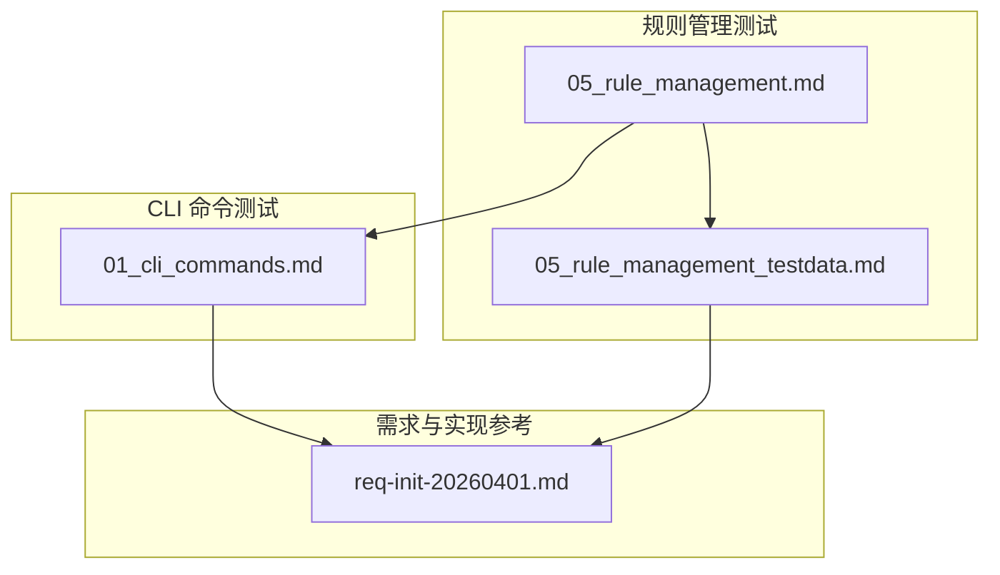
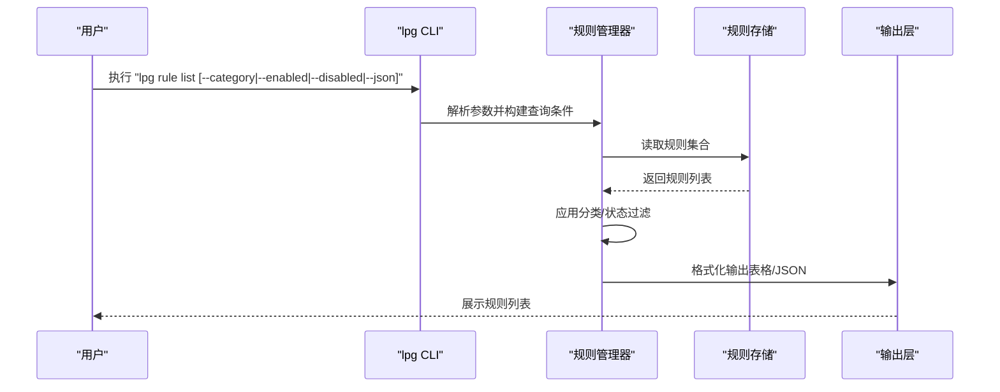
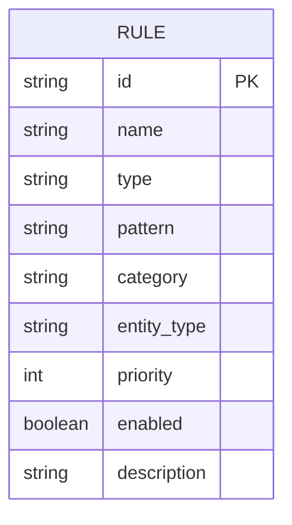
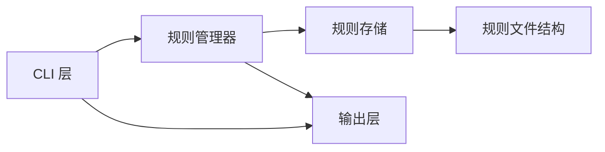

# 规则列表查询

<cite>
**本文引用的文件**
- [05_rule_management.md](file://doc/test/tcs/v1.0/05_rule_management.md)
- [01_cli_commands.md](file://doc/test/tcs/v1.0/01_cli_commands.md)
- [05_rule_management_testdata.md](file://doc/test/tcs/v1.0/05_rule_management_testdata.md)
- [req-init-20260401.md](file://doc/req/req-init-20260401.md)
</cite>

## 目录
1. [简介](#简介)
2. [项目结构](#项目结构)
3. [核心组件](#核心组件)
4. [架构总览](#架构总览)
5. [详细组件分析](#详细组件分析)
6. [依赖关系分析](#依赖关系分析)
7. [性能考虑](#性能考虑)
8. [故障排查指南](#故障排查指南)
9. [结论](#结论)
10. [附录](#附录)

## 简介
本文件面向 LLM Privacy Gateway v1.0 的规则管理能力，聚焦于 lpg rule list 命令的完整功能说明与使用实践。内容涵盖：
- 按分类筛选（pii、credentials、finance）
- 按状态筛选（启用/禁用）
- 综合查询组合
- 查询参数使用方法（如 --category、--enabled、--disabled 等）
- 查询结果展示字段（规则名称、分类、状态、优先级等）的含义
- 实际使用示例与最佳实践
- 性能优化建议与大数据量场景下的最佳实践

## 项目结构
围绕规则列表查询的相关文档与测试用例主要分布在以下文件：
- 规则管理黑盒测试用例：覆盖规则加载、列表、启用/禁用、导入、移除、测试、配置、优先级与持久化等
- CLI 命令黑盒测试用例：覆盖基础命令、启动停止、状态查询、配置管理、Key 管理、提供商管理、规则管理、日志管理等
- 规则管理测试数据：提供规则字段结构、分类、优先级、启用状态、文件格式等测试数据
- 需求文档：给出 lpg rule list 的命令用法、选项与示例

图表来源
- [05_rule_management.md:118-177](file://doc/test/tcs/v1.0/05_rule_management.md#L118-L177)
- [01_cli_commands.md:500-513](file://doc/test/tcs/v1.0/01_cli_commands.md#L500-L513)
- [05_rule_management_testdata.md:410-441](file://doc/test/tcs/v1.0/05_rule_management_testdata.md#L410-L441)
- [req-init-20260401.md:1120-1137](file://doc/req/req-init-20260401.md#L1120-L1137)

章节来源
- [05_rule_management.md:118-177](file://doc/test/tcs/v1.0/05_rule_management.md#L118-L177)
- [01_cli_commands.md:500-513](file://doc/test/tcs/v1.0/01_cli_commands.md#L500-L513)
- [05_rule_management_testdata.md:410-441](file://doc/test/tcs/v1.0/05_rule_management_testdata.md#L410-L441)
- [req-init-20260401.md:1120-1137](file://doc/req/req-init-20260401.md#L1120-L1137)

## 核心组件
- 规则列表查询命令：lpg rule list
- 查询参数
  - --category/-c：按分类筛选（pii、credentials、finance）
  - --enabled：仅显示启用的规则
  - --disabled：仅显示禁用的规则
  - --json/-j：以 JSON 格式输出
- 查询结果字段
  - 规则名称（name）
  - 分类（category）
  - 状态（enabled）
  - 优先级（priority）
  - 其他字段（如 id、entity_type、description 等）

章节来源
- [05_rule_management.md:135-177](file://doc/test/tcs/v1.0/05_rule_management.md#L135-L177)
- [01_cli_commands.md:500-513](file://doc/test/tcs/v1.0/01_cli_commands.md#L500-L513)
- [05_rule_management_testdata.md:410-441](file://doc/test/tcs/v1.0/05_rule_management_testdata.md#L410-L441)
- [req-init-20260401.md:1126-1137](file://doc/req/req-init-20260401.md#L1126-L1137)

## 架构总览
规则列表查询属于规则管理子系统的查询能力，通常由 CLI 层接收参数，调用规则存储与过滤逻辑，最终输出结果。查询过程的关键节点如下：

图表来源
- [05_rule_management.md:135-177](file://doc/test/tcs/v1.0/05_rule_management.md#L135-L177)
- [01_cli_commands.md:500-513](file://doc/test/tcs/v1.0/01_cli_commands.md#L500-L513)
- [req-init-20260401.md:1126-1137](file://doc/req/req-init-20260401.md#L1126-L1137)

## 详细组件分析

### lpg rule list 命令与参数
- 基本用法
  - 列出所有规则：lpg rule list
  - 按分类筛选：lpg rule list --category <分类>
  - 仅显示启用规则：lpg rule list --enabled
  - 仅显示禁用规则：lpg rule list --disabled
  - JSON 格式输出：lpg rule list --json
- 参数说明
  - --category/-c：支持的分类包括 pii、credentials、finance；大小写不敏感
  - --enabled：仅显示 enabled=true 的规则
  - --disabled：仅显示 enabled=false 的规则
  - --json/-j：以 JSON 格式输出，便于程序消费与集成

章节来源
- [05_rule_management.md:135-177](file://doc/test/tcs/v1.0/05_rule_management.md#L135-L177)
- [01_cli_commands.md:500-513](file://doc/test/tcs/v1.0/01_cli_commands.md#L500-L513)
- [req-init-20260401.md:1126-1137](file://doc/req/req-init-20260401.md#L1126-L1137)

### 查询结果字段与含义
- 字段示例（来自规则文件结构）
  - id：规则唯一标识
  - name：规则名称
  - type：规则类型（regex、keyword、ai 等）
  - pattern：正则表达式（当 type=regex 时）
  - category：规则分类（pii、credentials、finance 等）
  - entity_type：实体类型（如 EMAIL_ADDRESS、PHONE_NUMBER 等）
  - priority：优先级（数值越小优先级越高）
  - enabled：启用状态（布尔值）
  - description：规则描述
- 字段含义
  - 规则名称：用于人类可读的规则标识
  - 分类：规则适用的敏感信息类别
  - 状态：规则是否参与检测
  - 优先级：规则应用顺序的重要依据

章节来源
- [05_rule_management_testdata.md:410-441](file://doc/test/tcs/v1.0/05_rule_management_testdata.md#L410-L441)
- [05_rule_management.md:601-623](file://doc/test/tcs/v1.0/05_rule_management.md#L601-L623)

### 查询组合与示例
- 示例一：列出所有规则
  - lpg rule list
- 示例二：按分类筛选
  - lpg rule list --category pii
  - lpg rule list --category credentials
  - lpg rule list --category finance
- 示例三：按状态筛选
  - lpg rule list --enabled
  - lpg rule list --disabled
- 示例四：JSON 输出
  - lpg rule list --json
- 示例五：组合查询
  - lpg rule list --category pii --enabled
  - lpg rule list --category finance --disabled
  - lpg rule list --category credentials --json

章节来源
- [05_rule_management.md:135-177](file://doc/test/tcs/v1.0/05_rule_management.md#L135-L177)
- [01_cli_commands.md:500-513](file://doc/test/tcs/v1.0/01_cli_commands.md#L500-L513)
- [req-init-20260401.md:1131-1137](file://doc/req/req-init-20260401.md#L1131-L1137)

### 数据模型与字段关系

图表来源
- [05_rule_management_testdata.md:410-441](file://doc/test/tcs/v1.0/05_rule_management_testdata.md#L410-L441)

## 依赖关系分析
- 规则列表查询依赖于规则存储与规则管理器的协作
- CLI 层负责参数解析与输出格式控制
- 规则文件结构定义了查询结果字段的来源与约束

图表来源
- [05_rule_management_testdata.md:410-441](file://doc/test/tcs/v1.0/05_rule_management_testdata.md#L410-L441)
- [01_cli_commands.md:500-513](file://doc/test/tcs/v1.0/01_cli_commands.md#L500-L513)

章节来源
- [05_rule_management_testdata.md:410-441](file://doc/test/tcs/v1.0/05_rule_management_testdata.md#L410-L441)
- [01_cli_commands.md:500-513](file://doc/test/tcs/v1.0/01_cli_commands.md#L500-L513)

## 性能考虑
- 大数据量场景下的最佳实践
  - 优先使用分类与状态过滤缩小结果集，减少内存与网络传输开销
  - 在需要批量处理时，使用 JSON 输出（--json/-j），便于下游程序高效解析
  - 对频繁查询的场景，建议缓存查询结果并在规则变更时失效缓存
  - 避免同时使用过多过滤条件导致的复杂度上升，必要时分步查询
- 与 CLI 输出设计的关系
  - CLI 输出设计强调结构化与可读性，JSON 输出适合自动化集成

章节来源
- [01_cli_commands.md:500-513](file://doc/test/tcs/v1.0/01_cli_commands.md#L500-L513)
- [05_rule_management_testdata.md:410-441](file://doc/test/tcs/v1.0/05_rule_management_testdata.md#L410-L441)

## 故障排查指南
- 问题：执行 lpg rule list 无输出或提示“未加载任何规则”
  - 排查要点：确认规则文件已正确加载、规则目录配置正确、规则文件格式有效
  - 参考测试用例：TC-RULE-010（列出空规则集）
- 问题：--category 参数无效或未返回预期结果
  - 排查要点：确认分类值为 pii、credentials 或 finance，大小写不敏感
  - 参考测试用例：TC-RULE-007（按分类列出规则）
- 问题：--enabled/--disabled 未按预期筛选
  - 排查要点：检查规则的 enabled 字段值（布尔或可转换为布尔的字符串）
  - 参考测试用例：TC-RULE-008（列出启用的规则）、TC-RULE-009（列出禁用的规则）
- 问题：JSON 输出不符合预期
  - 排查要点：确认使用 --json/-j 选项，检查规则文件字段完整性
  - 参考测试数据：有效 YAML/JSON 规则文件示例

章节来源
- [05_rule_management.md:180-192](file://doc/test/tcs/v1.0/05_rule_management.md#L180-L192)
- [05_rule_management.md:135-177](file://doc/test/tcs/v1.0/05_rule_management.md#L135-L177)
- [05_rule_management_testdata.md:410-441](file://doc/test/tcs/v1.0/05_rule_management_testdata.md#L410-L441)

## 结论
lpg rule list 命令提供了灵活的规则查询能力，支持按分类与状态进行筛选，并可通过 JSON 输出满足自动化集成需求。结合测试用例与规则文件结构，用户可以快速定位所需规则并进行精细化管理。在大规模规则场景下，建议采用组合查询与 JSON 输出的方式提升效率与可维护性。

## 附录
- 命令与选项参考
  - lpg rule list：列出所有规则
  - lpg rule list --category <分类>：按分类筛选
  - lpg rule list --enabled：仅显示启用规则
  - lpg rule list --disabled：仅显示禁用规则
  - lpg rule list --json：以 JSON 格式输出
- 支持的分类
  - pii：个人身份信息
  - credentials：凭证信息
  - finance：金融信息
- 状态说明
  - enabled：启用，参与检测
  - disabled：禁用，不参与检测
- 优先级范围
  - 高：1-100
  - 中：101-200
  - 低：201-300

章节来源
- [05_rule_management.md:601-623](file://doc/test/tcs/v1.0/05_rule_management.md#L601-L623)
- [01_cli_commands.md:500-513](file://doc/test/tcs/v1.0/01_cli_commands.md#L500-L513)
- [req-init-20260401.md:1126-1137](file://doc/req/req-init-20260401.md#L1126-L1137)