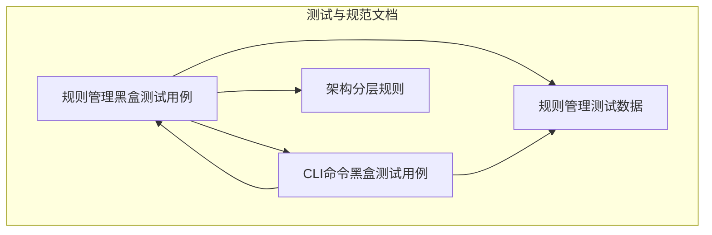
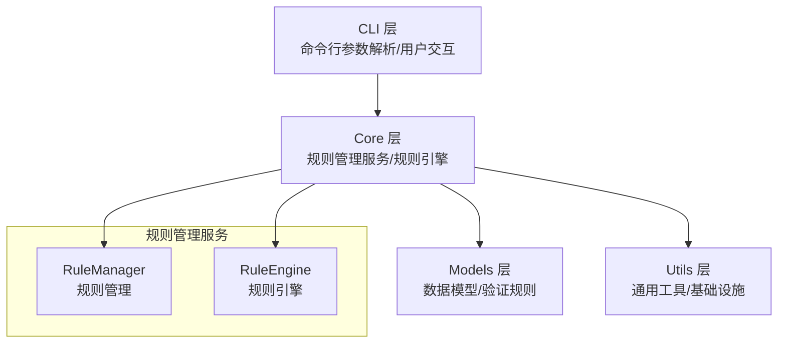
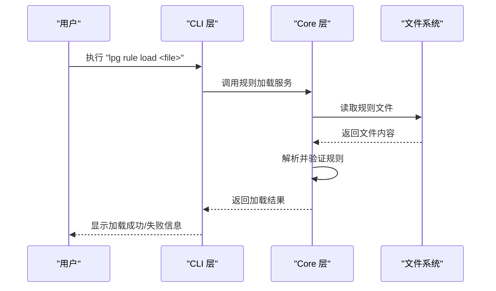
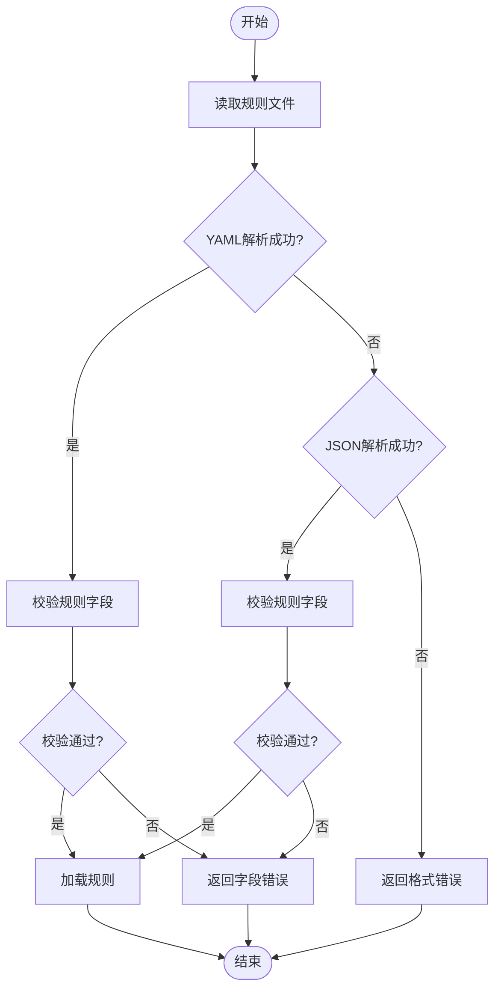
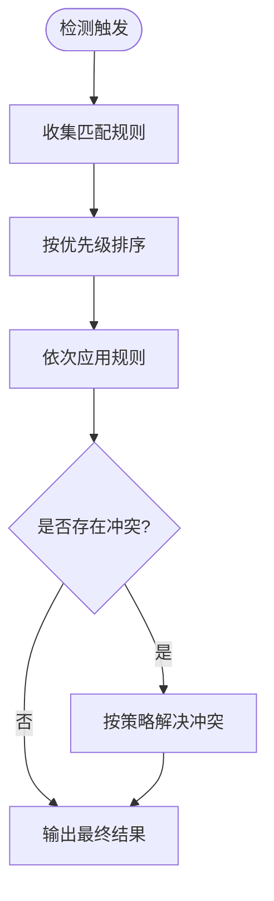
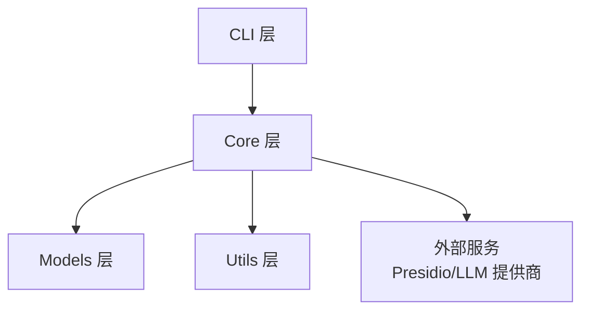

# 规则加载与管理

<cite>
**本文引用的文件**
- [规则管理黑盒测试用例](file://doc/test/tcs/v1.0/05_rule_management.md)
- [规则管理测试数据](file://doc/test/tcs/v1.0/05_rule_management_testdata.md)
- [CLI命令黑盒测试用例](file://doc/test/tcs/v1.0/01_cli_commands.md)
- [架构分层规则](file://doc/rules/architecture-rule.md)
</cite>

## 目录
1. [简介](#简介)
2. [项目结构](#项目结构)
3. [核心组件](#核心组件)
4. [架构总览](#架构总览)
5. [详细组件分析](#详细组件分析)
6. [依赖分析](#依赖分析)
7. [性能考虑](#性能考虑)
8. [故障排除指南](#故障排除指南)
9. [结论](#结论)
10. [附录](#附录)

## 简介
本文件面向 LLM Privacy Gateway 的规则加载与管理功能，系统化阐述规则加载机制（内置规则目录、自定义规则目录、单个规则文件）、规则文件格式（YAML/JSON）、错误处理策略（格式错误、空文件、重复规则等）、规则管理命令参考（lpg rule load、lpg rule load-dir 等），以及规则加载优先级与冲突解决策略。文档同时提供配置示例与故障排除指南，帮助开发者与运维人员快速理解与落地。

## 项目结构
围绕规则加载与管理的相关文档主要分布在以下位置：
- 规则管理测试用例：覆盖规则加载、列表、启用/禁用、导入、移除、测试、配置、优先级与持久化等场景
- 规则管理测试数据：提供规则ID、名称、类型、正则、关键词、分类、脱敏策略、实体类型、优先级、启用状态、文件格式等测试数据
- CLI命令测试用例：涵盖规则管理相关命令（list、enable、disable、import、remove、test、config）的使用与期望行为
- 架构分层规则：定义分层职责与依赖约束，为规则引擎与管理服务的实现提供架构指导

**图表来源**
- [规则管理黑盒测试用例:1-623](file://doc/test/tcs/v1.0/05_rule_management.md#L1-L623)
- [规则管理测试数据:1-585](file://doc/test/tcs/v1.0/05_rule_management_testdata.md#L1-L585)
- [CLI命令黑盒测试用例:1-702](file://doc/test/tcs/v1.0/01_cli_commands.md#L1-L702)
- [架构分层规则:1-800](file://doc/rules/architecture-rule.md#L1-L800)

**章节来源**
- [规则管理黑盒测试用例:1-623](file://doc/test/tcs/v1.0/05_rule_management.md#L1-L623)
- [规则管理测试数据:1-585](file://doc/test/tcs/v1.0/05_rule_management_testdata.md#L1-L585)
- [CLI命令黑盒测试用例:1-702](file://doc/test/tcs/v1.0/01_cli_commands.md#L1-L702)
- [架构分层规则:1-800](file://doc/rules/architecture-rule.md#L1-L800)

## 核心组件
- 规则加载机制
  - 内置规则目录加载：启动服务时自动扫描内置规则目录，加载其中的规则文件
  - 自定义规则目录加载：通过配置文件指定自定义规则目录，重启服务后加载
  - 单个规则文件加载：通过命令行直接加载单个规则文件
- 规则文件格式
  - 支持 YAML 与 JSON 两种格式；文件需包含 rules 数组，数组内为规则对象
- 错误处理
  - 格式错误：解析失败时返回错误并提示具体位置与原因
  - 空文件：提示未找到规则或为空
  - 重复规则：导入时检测重复并给出覆盖或跳过的策略提示
- 规则管理命令
  - lpg rule list：列出规则（支持按分类、启用/禁用筛选）
  - lpg rule enable/disable：启用/禁用规则
  - lpg rule import/load/load-dir：导入/加载规则文件或目录
  - lpg rule remove：移除规则
  - lpg rule test：测试规则匹配效果
  - lpg rule config：显示规则配置
- 优先级与冲突
  - 规则具有优先级数值，高优先级先应用
  - 冲突处理依据配置决定（如优先级、首次匹配等）

**章节来源**
- [规则管理黑盒测试用例:41-134](file://doc/test/tcs/v1.0/05_rule_management.md#L41-L134)
- [规则管理黑盒测试用例:287-362](file://doc/test/tcs/v1.0/05_rule_management.md#L287-L362)
- [规则管理黑盒测试用例:520-551](file://doc/test/tcs/v1.0/05_rule_management.md#L520-L551)
- [规则管理测试数据:408-441](file://doc/test/tcs/v1.0/05_rule_management_testdata.md#L408-L441)
- [CLI命令黑盒测试用例:499-590](file://doc/test/tcs/v1.0/01_cli_commands.md#L499-L590)

## 架构总览
规则加载与管理功能位于系统架构的 Core 层，CLI 层负责命令解析与结果展示，Core 层负责业务逻辑与外部服务集成。规则引擎与规则管理服务属于 Core 层范畴，遵循“上层调用下层、禁止跨层直接调用”的依赖约束。

**图表来源**
- [架构分层规则:34-83](file://doc/rules/architecture-rule.md#L34-L83)

**章节来源**
- [架构分层规则:34-83](file://doc/rules/architecture-rule.md#L34-L83)

## 详细组件分析

### 规则加载机制
- 内置规则目录加载
  - 启动服务时扫描内置规则目录，加载其中的规则文件
  - 预期：日志显示成功加载，规则列表与文件数量一致
- 自定义规则目录加载
  - 通过配置文件指定自定义规则目录，重启服务后加载
  - 预期：日志显示成功加载，规则列表与自定义目录文件数量一致
- 单个规则文件加载
  - 通过命令行加载单个规则文件，加载后可通过规则列表确认
  - 预期：命令显示成功加载，规则数量增加

**图表来源**
- [规则管理黑盒测试用例:73-85](file://doc/test/tcs/v1.0/05_rule_management.md#L73-L85)
- [CLI命令黑盒测试用例:546-558](file://doc/test/tcs/v1.0/01_cli_commands.md#L546-L558)

**章节来源**
- [规则管理黑盒测试用例:43-85](file://doc/test/tcs/v1.0/05_rule_management.md#L43-L85)
- [CLI命令黑盒测试用例:546-558](file://doc/test/tcs/v1.0/01_cli_commands.md#L546-L558)

### 规则文件格式与校验
- 支持格式
  - YAML：rules 数组包含规则对象
  - JSON：rules 数组包含规则对象
- 规则对象字段
  - id、name、type、pattern（正则规则）、category、entity_type、priority、enabled、description 等
- 校验与错误处理
  - 语法错误：解析失败，返回错误与具体位置
  - 空文件：提示未找到规则或为空
  - 仅注释文件：视为无规则
- 有效与无效示例
  - 有效YAML/JSON示例与无效YAML/JSON示例均有测试数据覆盖

**图表来源**
- [规则管理测试数据:408-441](file://doc/test/tcs/v1.0/05_rule_management_testdata.md#L408-L441)

**章节来源**
- [规则管理测试数据:408-441](file://doc/test/tcs/v1.0/05_rule_management_testdata.md#L408-L441)

### 规则管理命令参考
- lpg rule list
  - 功能：列出所有规则，支持按分类、启用/禁用筛选
  - 期望：显示规则列表与总数
- lpg rule enable/disable
  - 功能：启用/禁用指定规则
  - 期望：状态变更并显示确认信息
- lpg rule import
  - 功能：从文件导入规则
  - 期望：成功导入并显示导入数量
- lpg rule load/load-dir
  - 功能：加载单个规则文件或规则目录
  - 期望：加载成功或提示未找到规则
- lpg rule remove
  - 功能：移除规则（内置规则不可移除）
  - 期望：成功移除或提示错误
- lpg rule test
  - 功能：测试规则匹配效果
  - 期望：显示匹配结果与详细信息
- lpg rule config
  - 功能：显示规则配置
  - 期望：显示当前规则配置与目录信息

**章节来源**
- [规则管理黑盒测试用例:586-623](file://doc/test/tcs/v1.0/05_rule_management.md#L586-L623)
- [CLI命令黑盒测试用例:499-590](file://doc/test/tcs/v1.0/01_cli_commands.md#L499-L590)

### 优先级与冲突解决策略
- 优先级
  - 规则具有优先级数值，数值越小优先级越高
  - 高优先级规则先应用，随后是中优先级，最后低优先级
- 冲突处理
  - 当多个规则匹配同一内容时，根据优先级与配置决定处理方式
  - 可通过测试命令查看规则应用顺序与最终结果

**图表来源**
- [规则管理黑盒测试用例:520-551](file://doc/test/tcs/v1.0/05_rule_management.md#L520-L551)

**章节来源**
- [规则管理黑盒测试用例:520-551](file://doc/test/tcs/v1.0/05_rule_management.md#L520-L551)

## 依赖分析
规则管理功能位于 Core 层，CLI 层负责命令解析与展示，Core 层负责业务逻辑与外部服务集成。规则引擎与规则管理服务属于 Core 层范畴，遵循分层依赖约束，禁止跨层直接调用。

**图表来源**
- [架构分层规则:544-592](file://doc/rules/architecture-rule.md#L544-L592)

**章节来源**
- [架构分层规则:544-592](file://doc/rules/architecture-rule.md#L544-L592)

## 性能考虑
- 规则加载性能
  - 建议将规则文件拆分为较小的文件，避免一次性加载过多规则导致启动时间过长
  - 对于大规模规则集，可采用延迟加载或按需加载策略
- 规则匹配性能
  - 优先级高的规则应尽量精简，减少匹配开销
  - 正则表达式应避免回溯陷阱，确保匹配效率
- I/O 与缓存
  - 规则目录与文件的读取应避免频繁 I/O，可引入缓存机制
  - 对热点规则进行缓存，提升匹配速度

## 故障排除指南
- 规则文件格式错误
  - 现象：命令显示规则文件格式错误，提示具体位置与原因
  - 排查：检查 YAML/JSON 语法，确保 rules 数组与字段格式正确
- 空规则文件
  - 现象：命令显示警告：未找到规则或为空
  - 排查：确认文件内容是否为空或仅包含注释
- 重复规则
  - 现象：导入时提示发现重复规则，建议覆盖或跳过
  - 排查：检查规则ID是否重复，必要时修改ID或选择覆盖策略
- 规则目录为空
  - 现象：加载目录时提示未找到规则文件
  - 排查：确认目录路径正确且包含规则文件
- 规则不可移除
  - 现象：尝试移除内置规则时报错
  - 排查：内置规则不可移除，请使用禁用命令替代

**章节来源**
- [规则管理黑盒测试用例:88-115](file://doc/test/tcs/v1.0/05_rule_management.md#L88-L115)
- [规则管理黑盒测试用例:364-408](file://doc/test/tcs/v1.0/05_rule_management.md#L364-L408)
- [规则管理测试数据:408-441](file://doc/test/tcs/v1.0/05_rule_management_testdata.md#L408-L441)

## 结论
规则加载与管理功能通过内置规则目录、自定义规则目录与单个规则文件加载三种方式实现灵活的规则管理；支持 YAML 与 JSON 两种格式，并具备完善的错误处理与优先级冲突解决策略。配合 CLI 命令，用户可以高效地完成规则的导入、启用/禁用、测试与持久化。遵循架构分层规则有助于保持代码职责清晰、易于维护与扩展。

## 附录

### 规则文件格式示例
- 有效 YAML 格式
  - rules 数组包含规则对象，字段包括 id、name、type、pattern、category、entity_type、priority、enabled、description 等
- 有效 JSON 格式
  - 与 YAML 格式等价，字段结构一致
- 无效格式示例
  - YAML/JSON 语法错误、缺少必需字段、空文件、仅注释文件等

**章节来源**
- [规则管理测试数据:408-441](file://doc/test/tcs/v1.0/05_rule_management_testdata.md#L408-L441)

### 规则管理命令参考
- lpg rule list：列出规则（支持按分类、启用/禁用筛选）
- lpg rule enable/disable：启用/禁用规则
- lpg rule import：从文件导入规则
- lpg rule load：加载单个规则文件
- lpg rule load-dir：加载规则目录
- lpg rule remove：移除规则
- lpg rule test：测试规则匹配效果
- lpg rule config：显示规则配置

**章节来源**
- [规则管理黑盒测试用例:586-623](file://doc/test/tcs/v1.0/05_rule_management.md#L586-L623)
- [CLI命令黑盒测试用例:499-590](file://doc/test/tcs/v1.0/01_cli_commands.md#L499-L590)