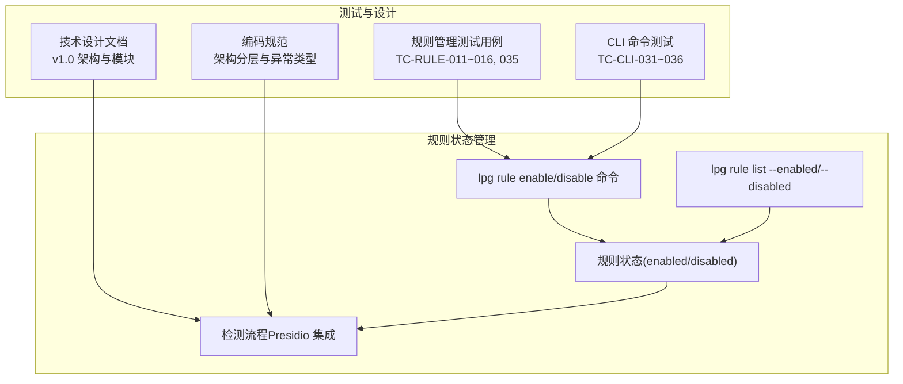
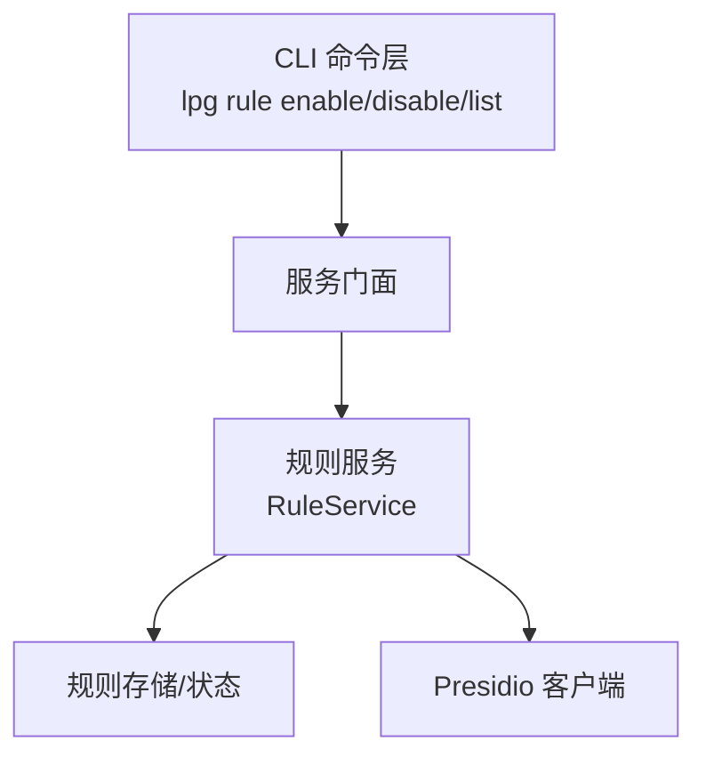
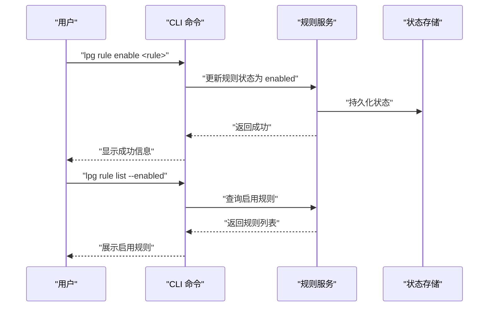
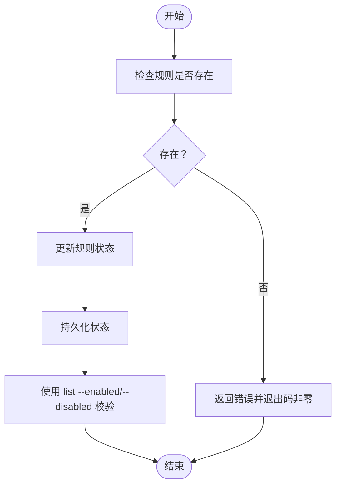
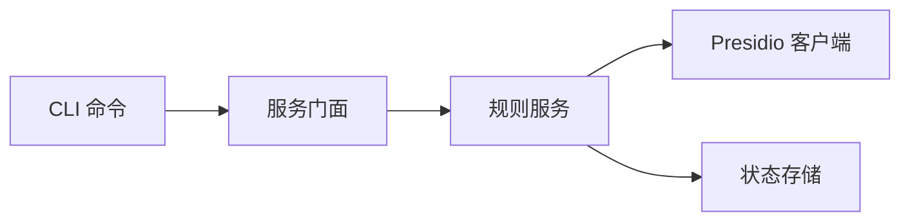

# 规则启用与禁用

<cite>
**本文引用的文件**
- [05_rule_management.md](file://doc/test/tcs/v1.0/05_rule_management.md)
- [05_rule_management_testdata.md](file://doc/test/tcs/v1.0/05_rule_management_testdata.md)
- [01_cli_commands.md](file://doc/test/tcs/v1.0/01_cli_commands.md)
- [design-update-20260404-v1.0-init.md](file://doc/design/design-update-20260404-v1.0-init.md)
- [AGENTS.md](file://AGENTS.md)
</cite>

## 目录
1. [简介](#简介)
2. [项目结构](#项目结构)
3. [核心组件](#核心组件)
4. [架构总览](#架构总览)
5. [详细组件分析](#详细组件分析)
6. [依赖分析](#依赖分析)
7. [性能考虑](#性能考虑)
8. [故障排除指南](#故障排除指南)
9. [结论](#结论)
10. [附录](#附录)

## 简介
本文件围绕 LLM Privacy Gateway 的“规则启用与禁用”能力，系统化阐述命令使用方法、状态管理机制、验证与回滚策略、最佳实践、与检测流程的关系及性能影响，并提供常见错误预防与排障建议。文档基于仓库内测试用例与设计文档进行归纳总结，确保读者能够安全、可控地管理规则状态。

## 项目结构
- 规则管理相关测试用例集中在规则管理测试文档中，覆盖单条规则启用/禁用、批量操作、状态持久化等关键场景。
- CLI 命令参考与规则管理命令测试在 CLI 命令测试文档中给出。
- 设计文档明确了 v1.0 的模块边界与核心服务（RuleService），为理解规则状态如何参与检测提供背景。
- 编码规范文档提供了架构分层与错误类型体系，有助于理解状态变更的异常处理与日志记录。

**图示来源**
- [05_rule_management.md: 195-284:195-284](file://doc/test/tcs/v1.0/05_rule_management.md#L195-L284)
- [01_cli_commands.md: 499-590:499-590](file://doc/test/tcs/v1.0/01_cli_commands.md#L499-L590)
- [design-update-20260404-v1.0-init.md: 70-122:70-122](file://doc/design/design-update-20260404-v1.0-init.md#L70-L122)
- [AGENTS.md: 11-27:11-27](file://AGENTS.md#L11-L27)

**章节来源**
- [05_rule_management.md: 195-284:195-284](file://doc/test/tcs/v1.0/05_rule_management.md#L195-L284)
- [01_cli_commands.md: 499-590:499-590](file://doc/test/tcs/v1.0/01_cli_commands.md#L499-L590)
- [design-update-20260404-v1.0-init.md: 70-122:70-122](file://doc/design/design-update-20260404-v1.0-init.md#L70-L122)
- [AGENTS.md: 11-27:11-27](file://AGENTS.md#L11-L27)

## 核心组件
- 规则状态
  - enabled：规则启用，参与检测。
  - disabled：规则禁用，不参与检测。
- CLI 命令
  - lpg rule enable <rule_name>：启用单个规则。
  - lpg rule disable <rule_name>：禁用单个规则。
  - lpg rule list --enabled / --disabled：查看启用/禁用规则。
  - lpg rule enable --all | lpg rule disable --all：批量启用/禁用。
- 状态持久化
  - 规则状态在服务重启后保持，确保变更持久化。

**章节来源**
- [05_rule_management.md: 588-599:588-599](file://doc/test/tcs/v1.0/05_rule_management.md#L588-L599)
- [05_rule_management.md: 569-581:569-581](file://doc/test/tcs/v1.0/05_rule_management.md#L569-L581)
- [05_rule_management_testdata.md: 379-405:379-405](file://doc/test/tcs/v1.0/05_rule_management_testdata.md#L379-L405)

## 架构总览
规则状态管理位于 CLI 与核心服务之间，CLI 命令通过服务门面调用规则服务，规则服务维护规则状态字典并在检测阶段根据 enabled/disabled 决定是否参与匹配。

**图示来源**
- [design-update-20260404-v1.0-init.md: 144-159:144-159](file://doc/design/design-update-20260404-v1.0-init.md#L144-L159)

**章节来源**
- [design-update-20260404-v1.0-init.md: 144-159:144-159](file://doc/design/design-update-20260404-v1.0-init.md#L144-L159)

## 详细组件分析

### 命令使用与行为
- 单个规则启用
  - 步骤：执行启用命令 → 使用 list --enabled 校验。
  - 预期：命令成功，规则状态变为 enabled；list --enabled 显示该规则。
- 单个规则禁用
  - 步骤：执行禁用命令 → 使用 list --disabled 校验。
  - 预期：命令成功，规则状态变为 disabled；list --disabled 显示该规则。
- 批量启用/禁用
  - 两种方式：全量启用/禁用（--all）与指定规则列表。
  - 预期：命令成功，指定规则状态更新，显示操作数量。
- 不存在的规则
  - 启用/禁用不存在的规则应返回错误并退出码非零。
- 已禁用规则再次禁用
  - 预期：第一次成功，第二次显示警告且状态保持禁用。

**图示来源**
- [05_rule_management.md: 197-209:197-209](file://doc/test/tcs/v1.0/05_rule_management.md#L197-L209)
- [05_rule_management.md: 206-224:206-224](file://doc/test/tcs/v1.0/05_rule_management.md#L206-L224)
- [05_rule_management.md: 257-269:257-269](file://doc/test/tcs/v1.0/05_rule_management.md#L257-L269)
- [05_rule_management.md: 272-284:272-284](file://doc/test/tcs/v1.0/05_rule_management.md#L272-L284)

**章节来源**
- [05_rule_management.md: 197-209:197-209](file://doc/test/tcs/v1.0/05_rule_management.md#L197-L209)
- [05_rule_management.md: 206-224:206-224](file://doc/test/tcs/v1.0/05_rule_management.md#L206-L224)
- [05_rule_management.md: 227-254:227-254](file://doc/test/tcs/v1.0/05_rule_management.md#L227-L254)
- [05_rule_management.md: 257-284:257-284](file://doc/test/tcs/v1.0/05_rule_management.md#L257-L284)

### 状态变更验证机制
- 列表过滤校验：使用 list --enabled / list --disabled 对比变更前后状态。
- 成功/失败语义：成功操作返回成功信息；失败（如规则不存在）返回错误并非零退出码。
- 幂等性：对已禁用规则再次禁用应显示警告而非报错。

**图示来源**
- [05_rule_management.md: 227-239:227-239](file://doc/test/tcs/v1.0/05_rule_management.md#L227-L239)
- [05_rule_management.md: 242-254:242-254](file://doc/test/tcs/v1.0/05_rule_management.md#L242-L254)

**章节来源**
- [05_rule_management.md: 227-239:227-239](file://doc/test/tcs/v1.0/05_rule_management.md#L227-L239)
- [05_rule_management.md: 242-254:242-254](file://doc/test/tcs/v1.0/05_rule_management.md#L242-L254)

### 回滚策略
- 建议采用“就地回滚”：若启用/禁用导致异常或风险，立即执行反向操作（如将启用的规则再次禁用，或将禁用的规则再次启用）。
- 结合状态持久化：服务重启后状态保持，可在确认变更无误后再重启以固化状态。
- 变更窗口与灰度：批量操作建议分批执行，先在小范围验证，再扩大范围。

**章节来源**
- [05_rule_management.md: 569-581:569-581](file://doc/test/tcs/v1.0/05_rule_management.md#L569-L581)

### 与检测流程的关系
- 规则状态直接影响检测：只有 enabled 的规则会参与 Presidio 分析与脱敏。
- 禁用规则不会产生匹配结果，也不会触发脱敏动作，从而降低检测开销与误报风险。

**章节来源**
- [design-update-20260404-v1.0-init.md: 164-200:164-200](file://doc/design/design-update-20260404-v1.0-init.md#L164-L200)

### 最佳实践（生产环境）
- 变更前核查
  - 使用 list --enabled / list --disabled 获取当前状态快照。
  - 对关键规则进行白名单核对，避免误禁用核心规则。
- 变更方式
  - 优先使用批量操作时明确列出规则集合，避免 --all 导致不可控范围。
  - 在维护窗口执行变更，尽量避开业务高峰期。
- 审计与可观测性
  - 通过 CLI 输出与日志记录变更轨迹，配合审计日志进行追踪。
- 安全建议
  - 仅授权人员执行规则状态变更。
  - 对高风险规则（如凭证类）采用双人复核或审批流程。

**章节来源**
- [05_rule_management.md: 588-599:588-599](file://doc/test/tcs/v1.0/05_rule_management.md#L588-L599)
- [AGENTS.md: 169-194:169-194](file://AGENTS.md#L169-L194)

## 依赖分析
- CLI 依赖服务门面，服务门面依赖规则服务；规则服务负责状态维护并与 Presidio 客户端交互。
- 规则状态属于共享组件的一部分，贯穿于检测链路。

**图示来源**
- [design-update-20260404-v1.0-init.md: 144-159:144-159](file://doc/design/design-update-20260404-v1.0-init.md#L144-L159)

**章节来源**
- [design-update-20260404-v1.0-init.md: 144-159:144-159](file://doc/design/design-update-20260404-v1.0-init.md#L144-L159)

## 性能考虑
- 启用/禁用规则本身为轻量操作，主要成本在于后续检测阶段对规则的匹配与脱敏。
- 禁用规则可降低检测复杂度与响应时间，适合在高负载或合规要求较低的场景临时降级。
- 批量变更可能在短时间内触发多次状态刷新，建议分批执行以避免瞬时压力。

[本节为通用指导，无需特定文件引用]

## 故障排除指南
- 常见错误
  - 规则不存在：启用/禁用不存在的规则会返回错误并退出码非零。
  - 已禁用规则再次禁用：显示警告，状态保持禁用。
- 排查步骤
  - 使用 list --enabled / list --disabled 快速定位状态。
  - 若怀疑规则 ID 书写错误，使用 list 查看完整规则列表核对。
  - 如需恢复，执行反向操作（如将禁用规则再次启用）。
- 日志与审计
  - 结合 CLI 输出与审计日志，定位变更时间线与责任人。

**章节来源**
- [05_rule_management.md: 227-239:227-239](file://doc/test/tcs/v1.0/05_rule_management.md#L227-L239)
- [05_rule_management.md: 242-254:242-254](file://doc/test/tcs/v1.0/05_rule_management.md#L242-L254)

## 结论
规则启用与禁用是 LLM Privacy Gateway 中影响检测行为与系统性能的关键操作。通过 CLI 命令与状态持久化机制，用户可以在保证安全的前提下灵活管理规则。建议在生产环境中采用严格的变更流程、可观测性与回滚策略，确保变更可控、可追溯、可恢复。

[本节为总结，无需特定文件引用]

## 附录

### 命令速查
- 列出所有规则：lpg rule list
- 列出启用规则：lpg rule list --enabled
- 列出禁用规则：lpg rule list --disabled
- 启用单个规则：lpg rule enable <rule_name>
- 禁用单个规则：lpg rule disable <rule_name>
- 批量启用规则：lpg rule enable --all 或 lpg rule enable rule1 rule2 ...
- 批量禁用规则：lpg rule disable --all 或 lpg rule disable rule1 rule2 ...

**章节来源**
- [05_rule_management.md: 588-599:588-599](file://doc/test/tcs/v1.0/05_rule_management.md#L588-L599)