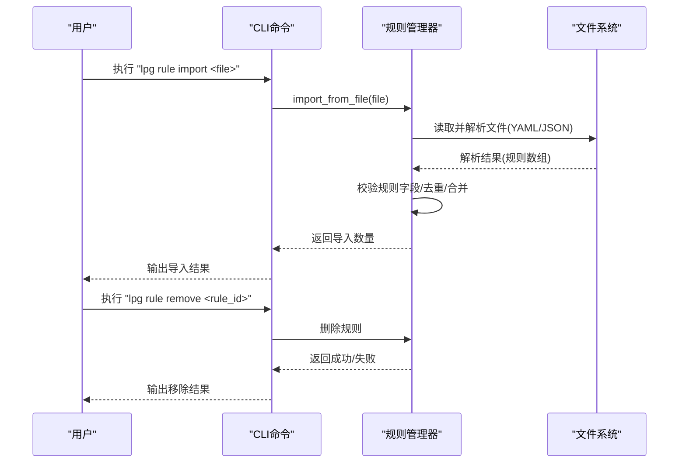
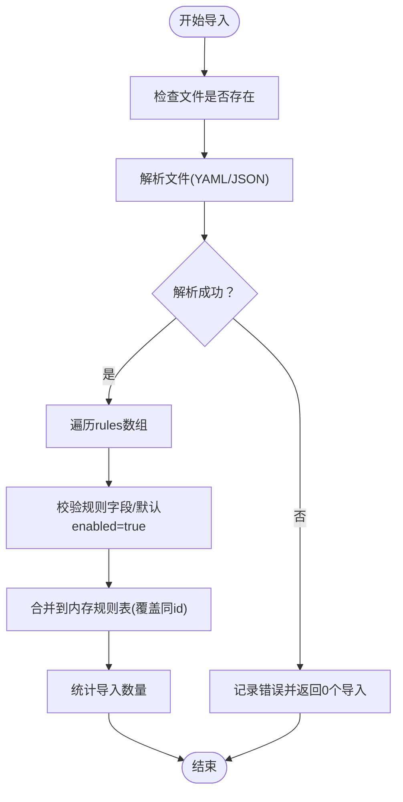
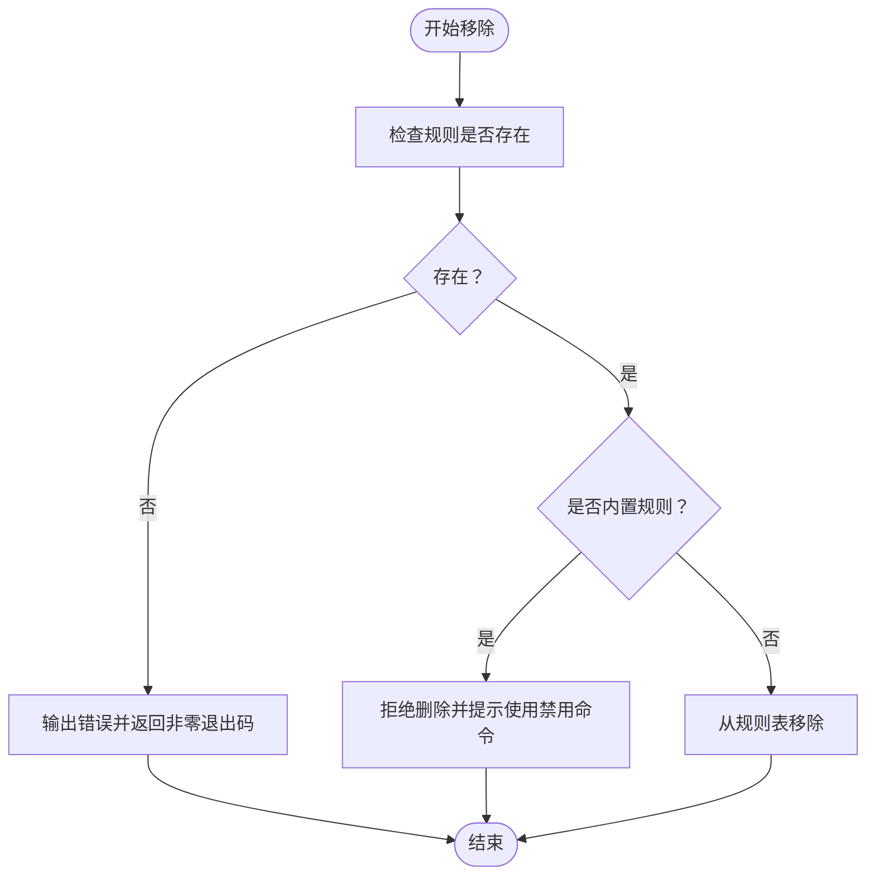
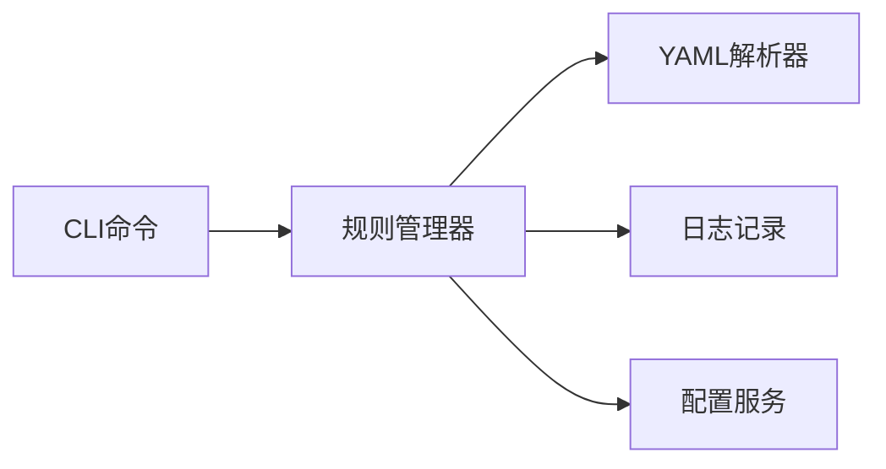

# 规则导入与移除

<cite>
**本文引用的文件**
- [规则管理测试用例](file://doc/test/tcs/v1.0/05_rule_management.md)
- [规则管理测试数据](file://doc/test/tcs/v1.0/05_rule_management_testdata.md)
- [CLI命令测试用例](file://doc/test/tcs/v1.0/01_cli_commands.md)
- [规则管理器设计](file://doc/design/design-update-20260404-v1.0-init.md)
</cite>

## 目录
1. [简介](#简介)
2. [项目结构](#项目结构)
3. [核心组件](#核心组件)
4. [架构总览](#架构总览)
5. [详细组件分析](#详细组件分析)
6. [依赖分析](#依赖分析)
7. [性能考虑](#性能考虑)
8. [故障排查指南](#故障排查指南)
9. [结论](#结论)
10. [附录](#附录)

## 简介
本文件面向 LLM Privacy Gateway 的规则导入与移除功能，系统化阐述从 YAML/JSON 文件导入规则的完整流程、命令使用方法、文件格式校验、重复规则处理、失败回滚与错误恢复、规则移除（单个与批量）、内置规则与自定义规则的差异及不可删除约束，并提供导入/导出工作流、备份与迁移策略、实际示例与常见问题解决方案。文档同时兼顾非技术读者的理解，通过图示与分层讲解帮助快速上手。

## 项目结构
围绕规则导入与移除的关键文件与职责如下：
- 规则管理器：负责规则加载、启用/禁用、导入、测试与统计
- CLI 命令：提供规则列表、启用/禁用、导入、移除、测试等命令入口
- 测试用例与测试数据：覆盖导入/移除的正常与异常场景，明确期望行为与错误信息

```mermaid
graph TB
subgraph "规则管理"
RM["规则管理器<br/>core/rule/manager.py"]
end
subgraph "CLI"
CLI["CLI命令<br/>lpg rule ..."]
end
subgraph "测试"
T1["规则管理测试用例<br/>doc/test/tcs/v1.0/05_rule_management.md"]
T2["规则管理测试数据<br/>doc/test/tcs/v1.0/05_rule_management_testdata.md"]
T3["CLI命令测试用例<br/>doc/test/tcs/v1.0/01_cli_commands.md"]
end
CLI --> RM
T1 --> CLI
T2 --> CLI
T3 --> CLI
```

图表来源
- [规则管理器设计:1277-1439](file://doc/design/design-update-20260404-v1.0-init.md#L1277-L1439)
- [规则管理测试用例:287-395](file://doc/test/tcs/v1.0/05_rule_management.md#L287-L395)
- [CLI命令测试用例:499-590](file://doc/test/tcs/v1.0/01_cli_commands.md#L499-L590)

章节来源
- [规则管理器设计:1277-1439](file://doc/design/design-update-20260404-v1.0-init.md#L1277-L1439)
- [规则管理测试用例:287-395](file://doc/test/tcs/v1.0/05_rule_management.md#L287-L395)
- [CLI命令测试用例:499-590](file://doc/test/tcs/v1.0/01_cli_commands.md#L499-L590)

## 核心组件
- 规则管理器
  - 职责：加载内置规则与自定义规则、启用/禁用规则、从文件导入规则、测试规则、统计规则数量
  - 关键方法：导入文件、加载规则文件、列出规则、启用/禁用、测试规则、统计数量
- CLI 命令
  - 职责：提供规则管理命令入口，调用规则管理器完成导入/移除/列表/测试等操作
  - 关键命令：lpg rule import、lpg rule remove、lpg rule list、lpg rule enable/disable、lpg rule test

章节来源
- [规则管理器设计:1277-1439](file://doc/design/design-update-20260404-v1.0-init.md#L1277-L1439)
- [规则管理测试用例:287-395](file://doc/test/tcs/v1.0/05_rule_management.md#L287-L395)
- [CLI命令测试用例:499-590](file://doc/test/tcs/v1.0/01_cli_commands.md#L499-L590)

## 架构总览
规则导入与移除的端到端流程如下：



图表来源
- [规则管理器设计:1378-1386](file://doc/design/design-update-20260404-v1.0-init.md#L1378-L1386)
- [规则管理测试用例:287-395](file://doc/test/tcs/v1.0/05_rule_management.md#L287-L395)

## 详细组件分析

### 规则导入机制（YAML/JSON）
- 文件格式支持
  - YAML：以 rules 数组承载规则列表，每条规则包含 id、name、type、pattern/category/entity_type/priority/enabled/description 等字段
  - JSON：同结构，rules 为数组
- 导入流程
  - CLI 接收文件路径并调用规则管理器的导入方法
  - 规则管理器读取文件，使用安全解析器加载 YAML/JSON
  - 遍历 rules 数组，提取每条规则的 id，设置默认 enabled 为 true，并记录来源文件
  - 将规则存入内存字典，键为规则 id，值为规则配置
- 文件格式验证
  - 语法错误：解析失败时记录错误日志；测试用例覆盖格式错误文件导入
  - 空文件/仅注释：解析后 rules 为空，导入数量为 0，CLI 应给出警告
  - 重复规则：当 id 重复时，后续规则会覆盖已有规则（测试用例覆盖重复规则导入）
- 错误恢复与失败回滚
  - 导入过程中若某条规则解析失败，不影响其他规则的导入；整体导入数量为成功导入的数量
  - CLI 在导入失败时应返回非零退出码并输出错误信息
- 导入失败的错误恢复机制
  - CLI 应在导入前检查文件是否存在
  - 若导入失败，CLI 应提示用户检查文件格式与字段完整性



图表来源
- [规则管理器设计:1322-1386](file://doc/design/design-update-20260404-v1.0-init.md#L1322-L1386)
- [规则管理测试用例:287-361](file://doc/test/tcs/v1.0/05_rule_management.md#L287-L361)

章节来源
- [规则管理器设计:1322-1386](file://doc/design/design-update-20260404-v1.0-init.md#L1322-L1386)
- [规则管理测试用例:287-361](file://doc/test/tcs/v1.0/05_rule_management.md#L287-L361)
- [规则管理测试数据:408-441](file://doc/test/tcs/v1.0/05_rule_management_testdata.md#L408-L441)

### lpg rule import 命令使用方法
- 命令格式
  - lpg rule import <file>
- 使用步骤
  - 准备规则文件（YAML/JSON），确保 rules 数组存在且每条规则包含 id
  - 执行命令，观察输出的导入数量与状态
  - 使用 lpg rule list 确认规则已导入
- 文件格式要求
  - 必填字段：id
  - 常用字段：name、type、pattern（正则）、category、entity_type、priority、enabled、description
  - enabled 默认为 true，未提供时按默认处理
- 常见场景
  - 正常导入：文件格式正确，返回导入数量大于 0
  - 格式错误：解析失败，CLI 输出错误信息并返回非零退出码
  - 空文件：导入数量为 0，CLI 输出警告
  - 重复规则：后续规则覆盖先前同 id 规则，CLI 输出重复警告

章节来源
- [规则管理测试用例:287-316](file://doc/test/tcs/v1.0/05_rule_management.md#L287-L316)
- [CLI命令测试用例:546-558](file://doc/test/tcs/v1.0/01_cli_commands.md#L546-L558)

### 规则移除功能
- 单个规则删除
  - 命令：lpg rule remove <rule_id>
  - 行为：从内存规则表中移除指定 id 的规则
  - 约束：内置规则不可删除；CLI 应拒绝删除内置规则并提示使用禁用命令
- 批量删除
  - CLI 可支持批量删除（如通过参数列表或全量删除），规则管理器内部实现可按 id 列表循环删除
- 删除失败处理
  - 不存在的规则：CLI 输出错误并返回非零退出码
  - 内置规则：CLI 输出错误并提示不能删除内置规则



图表来源
- [规则管理测试用例:364-408](file://doc/test/tcs/v1.0/05_rule_management.md#L364-L408)

章节来源
- [规则管理测试用例:364-408](file://doc/test/tcs/v1.0/05_rule_management.md#L364-L408)

### 内置规则与自定义规则
- 内置规则
  - 来源：规则目录下的 YAML 文件
  - 特征：启动时自动加载，不可删除
  - 示例 ID 列表：email_detector、cn_phone_detector、credit_card_detector、cn_id_card_detector、ip_detector、mac_detector、url_detector、password_detector、api_key_detector
- 自定义规则
  - 来源：配置中指定的自定义规则目录下的 YAML 文件
  - 特征：可导入、可删除、可启用/禁用
- 为什么不能删除内置规则
  - 保障系统基础能力与稳定性；删除内置规则会导致关键检测能力缺失
  - CLI 对内置规则删除进行拦截并提示使用禁用命令替代

章节来源
- [规则管理测试数据:29-47](file://doc/test/tcs/v1.0/05_rule_management_testdata.md#L29-L47)
- [规则管理测试用例:396-408](file://doc/test/tcs/v1.0/05_rule_management.md#L396-L408)

### 规则导入/导出工作流程与备份迁移策略
- 导入流程
  - 准备规则文件（YAML/JSON）
  - 执行 lpg rule import <file>
  - 使用 lpg rule list 验证导入结果
- 导出流程（建议）
  - 当前仓库未提供导出命令；可通过备份规则文件或使用配置持久化能力实现导出
  - 建议：定期将自定义规则文件归档至版本控制或私有存储，作为备份
- 备份与迁移
  - 备份：保存自定义规则目录与配置文件
  - 迁移：在新环境中重新导入自定义规则文件，并确保配置指向正确的自定义规则目录

章节来源
- [规则管理测试用例:287-316](file://doc/test/tcs/v1.0/05_rule_management.md#L287-L316)
- [CLI命令测试用例:546-558](file://doc/test/tcs/v1.0/01_cli_commands.md#L546-L558)

## 依赖分析
- 规则管理器依赖
  - 文件解析：YAML 安全解析
  - 日志：记录加载/导入过程与错误
  - 配置服务：读取自定义规则目录
- CLI 依赖
  - 规则管理器：封装导入/移除/列表/测试等操作
  - 用户输入：解析命令参数与文件路径



图表来源
- [规则管理器设计:1277-1439](file://doc/design/design-update-20260404-v1.0-init.md#L1277-L1439)

章节来源
- [规则管理器设计:1277-1439](file://doc/design/design-update-20260404-v1.0-init.md#L1277-L1439)

## 性能考虑
- 规则加载
  - 内置规则与自定义规则均采用一次性加载到内存的方式，适合中小规模规则集
- 导入性能
  - 导入为 O(n) 遍历 rules 数组，n 为文件中规则数量
  - 重复规则覆盖为字典键查找与替换，时间复杂度 O(1)
- 测试性能
  - 正则规则使用预编译正则表达式，避免重复编译开销
  - 关键词规则逐次查找，建议控制关键词数量与长度

[本节为通用性能讨论，无需特定文件来源]

## 故障排查指南
- 导入格式错误
  - 现象：CLI 输出“规则文件格式错误”，并显示错误位置与原因
  - 处理：修正 YAML/JSON 语法，确保 rules 数组存在且每条规则包含 id
- 导入空文件
  - 现象：CLI 输出“规则文件为空”，导入数量为 0
  - 处理：检查文件是否包含有效规则
- 导入重复规则
  - 现象：CLI 输出“发现重复规则”，后续规则覆盖先前规则
  - 处理：确保规则 id 唯一
- 移除不存在的规则
  - 现象：CLI 输出“规则不存在”，返回非零退出码
  - 处理：确认规则 id 是否正确
- 移除内置规则
  - 现象：CLI 输出“不能移除内置规则”，建议使用禁用命令
  - 处理：使用 lpg rule disable 替代删除

章节来源
- [规则管理测试用例:319-408](file://doc/test/tcs/v1.0/05_rule_management.md#L319-L408)
- [规则管理测试数据:408-441](file://doc/test/tcs/v1.0/05_rule_management_testdata.md#L408-L441)

## 结论
- 规则导入与移除功能通过 CLI 与规则管理器协同实现，支持 YAML/JSON 格式，具备完善的格式校验、重复处理与错误恢复机制
- 内置规则不可删除，保障系统稳定性；自定义规则可灵活导入、移除与启停
- 建议在生产环境中定期备份自定义规则文件，并在迁移时重新导入，确保规则一致性

[本节为总结性内容，无需特定文件来源]

## 附录

### 命令参考
- 列出规则：lpg rule list
- 启用规则：lpg rule enable <rule_id>
- 禁用规则：lpg rule disable <rule_id>
- 导入规则：lpg rule import <file>
- 移除规则：lpg rule remove <rule_id>
- 测试规则：lpg rule test <rule_id> --text "<text>"

章节来源
- [规则管理测试用例:586-600](file://doc/test/tcs/v1.0/05_rule_management.md#L586-L600)
- [CLI命令测试用例:500-590](file://doc/test/tcs/v1.0/01_cli_commands.md#L500-L590)