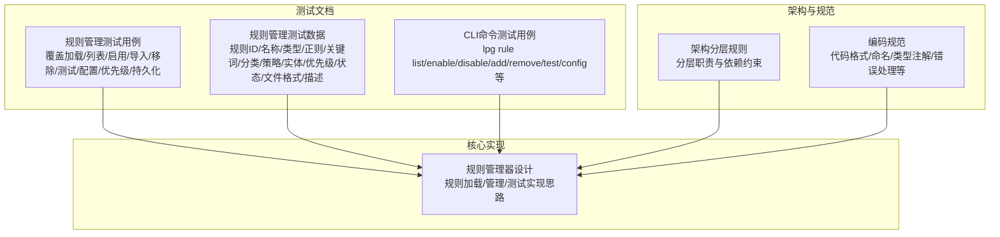
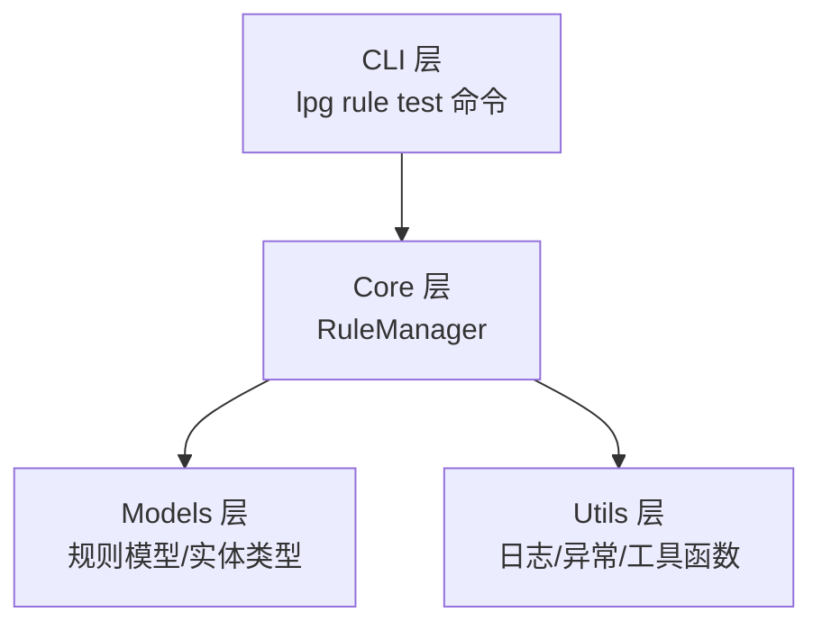
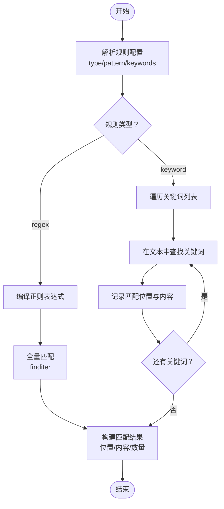
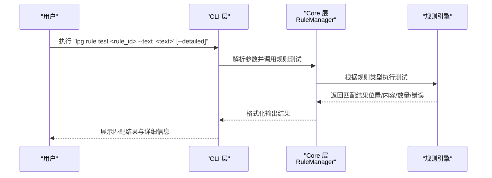
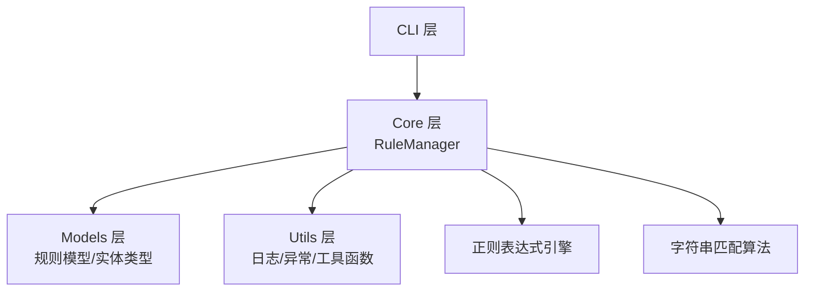

# 规则测试与验证

<cite>
**本文档引用的文件**
- [规则管理测试用例](file://doc/test/tcs/v1.0/05_rule_management.md)
- [规则管理测试数据](file://doc/test/tcs/v1.0/05_rule_management_testdata.md)
- [CLI命令测试用例](file://doc/test/tcs/v1.0/01_cli_commands.md)
- [架构分层规则](file://doc/rules/architecture-rule.md)
- [编码规范](file://doc/rules/coding-rule.md)
- [规则管理器设计](file://doc/design/design-update-20260404-v1.0-init.md)
</cite>

## 目录
1. [简介](#简介)
2. [项目结构](#项目结构)
3. [核心组件](#核心组件)
4. [架构概览](#架构概览)
5. [详细组件分析](#详细组件分析)
6. [依赖关系分析](#依赖关系分析)
7. [性能考量](#性能考量)
8. [故障排查指南](#故障排查指南)
9. [结论](#结论)
10. [附录](#附录)

## 简介
本文件面向 LLM Privacy Gateway 的规则测试与验证功能，系统阐述规则测试机制的实现原理，涵盖正则表达式规则与关键词规则的测试方法；详解 `lpg rule test` 命令的使用方式，包括文本输入、匹配结果分析与详细输出选项；文档化测试结果的解读方法，包括匹配位置、置信度、处理建议等；并提供规则验证的最佳实践，包括测试用例设计与测试数据准备，解释规则测试在开发与部署过程中的作用，以及如何利用测试结果优化规则效果。

## 项目结构
围绕规则测试与验证，项目文档主要由以下几类组成：
- 规则管理测试用例：覆盖规则加载、列表、启用/禁用、导入、移除、测试、配置、优先级与持久化等黑盒测试场景。
- 规则管理测试数据：提供规则ID、名称、类型、正则表达式、关键词列表、分类、脱敏策略、实体类型、优先级、启用状态、文件格式、描述等测试数据，确保高覆盖率。
- CLI命令测试用例：包含 `lpg rule` 子命令的完整测试场景，支撑规则测试命令的使用验证。
- 架构分层规则与编码规范：定义项目分层职责与代码规范，为规则引擎与测试实现提供架构与质量保障。
- 规则管理器设计：提供规则加载、管理与测试的核心实现思路，作为测试机制的技术基础。

**图表来源**
- [规则管理测试用例:1-623](file://doc/test/tcs/v1.0/05_rule_management.md#L1-L623)
- [规则管理测试数据:1-585](file://doc/test/tcs/v1.0/05_rule_management_testdata.md#L1-L585)
- [CLI命令测试用例:1-702](file://doc/test/tcs/v1.0/01_cli_commands.md#L1-L702)
- [架构分层规则:1-800](file://doc/rules/architecture-rule.md#L1-L800)
- [编码规范:1-800](file://doc/rules/coding-rule.md#L1-L800)
- [规则管理器设计:1277-1439](file://doc/design/design-update-20260404-v1.0-init.md#L1277-L1439)

**章节来源**
- [规则管理测试用例:1-623](file://doc/test/tcs/v1.0/05_rule_management.md#L1-L623)
- [规则管理测试数据:1-585](file://doc/test/tcs/v1.0/05_rule_management_testdata.md#L1-L585)
- [CLI命令测试用例:1-702](file://doc/test/tcs/v1.0/01_cli_commands.md#L1-L702)
- [架构分层规则:1-800](file://doc/rules/architecture-rule.md#L1-L800)
- [编码规范:1-800](file://doc/rules/coding-rule.md#L1-L800)
- [规则管理器设计:1277-1439](file://doc/design/design-update-20260404-v1.0-init.md#L1277-L1439)

## 核心组件
- 规则管理器（RuleManager）：负责规则的加载、管理与测试。其核心方法包括加载内置与自定义规则、列出规则、启用/禁用规则、从文件导入规则、测试规则（正则与关键词）等。
- 规则测试引擎：根据规则类型（regex/keyword）分别执行正则匹配与关键词匹配，返回匹配结果（位置、内容、数量），并在正则编译失败时返回错误信息。
- CLI 规则子命令：提供 `lpg rule test` 命令，支持传入规则ID与测试文本，输出匹配结果与详细信息（如启用 `--detailed` 时显示置信度与处理建议）。

**章节来源**
- [规则管理器设计:1277-1439](file://doc/design/design-update-20260404-v1.0-init.md#L1277-L1439)
- [规则管理测试用例:411-470](file://doc/test/tcs/v1.0/05_rule_management.md#L411-L470)
- [CLI命令测试用例:576-588](file://doc/test/tcs/v1.0/01_cli_commands.md#L576-L588)

## 架构概览
规则测试与验证在项目中的架构定位如下：
- CLI 层：接收用户输入，解析 `lpg rule test` 命令，调用 Core 层服务。
- Core 层：包含规则管理服务（RuleManager），负责规则的加载、管理与测试。
- Models 层：定义规则模型与数据结构（如规则配置、实体类型等）。
- Utils 层：提供通用工具函数（如日志、异常定义等）。

**图表来源**
- [架构分层规则:34-83](file://doc/rules/architecture-rule.md#L34-L83)
- [规则管理器设计:1277-1439](file://doc/design/design-update-20260404-v1.0-init.md#L1277-L1439)

**章节来源**
- [架构分层规则:34-83](file://doc/rules/architecture-rule.md#L34-L83)
- [编码规范:1-800](file://doc/rules/coding-rule.md#L1-L800)

## 详细组件分析

### 规则测试机制实现原理
规则测试机制分为两类：
- 正则规则测试：编译规则中的正则表达式，对测试文本进行全量匹配，返回每个匹配的位置（起始/结束）、原文内容与匹配数量；若正则编译失败，返回错误信息。
- 关键词规则测试：遍历关键词列表，在测试文本中逐个查找匹配，记录每次匹配的位置与内容，返回匹配结果与数量。

**图表来源**
- [规则管理器设计:1388-1434](file://doc/design/design-update-20260404-v1.0-init.md#L1388-L1434)

**章节来源**
- [规则管理器设计:1388-1434](file://doc/design/design-update-20260404-v1.0-init.md#L1388-L1434)

### lpg rule test 命令使用详解
- 基本用法：`lpg rule test <rule_id> --text "<测试文本>"`，用于测试指定规则在给定文本上的匹配效果。
- 详细输出：`lpg rule test <rule_id> --text "<测试文本>" --detailed`，显示更详细的匹配结果，包括匹配位置、内容、置信度与处理建议。
- 测试场景覆盖：测试用例覆盖正则规则、关键词规则、无效规则、匹配结果分析与详细输出等场景。

**图表来源**
- [CLI命令测试用例:576-588](file://doc/test/tcs/v1.0/01_cli_commands.md#L576-L588)
- [规则管理测试用例:411-470](file://doc/test/tcs/v1.0/05_rule_management.md#L411-L470)
- [规则管理器设计:1388-1434](file://doc/design/design-update-20260404-v1.0-init.md#L1388-L1434)

**章节来源**
- [CLI命令测试用例:576-588](file://doc/test/tcs/v1.0/01_cli_commands.md#L576-L588)
- [规则管理测试用例:411-470](file://doc/test/tcs/v1.0/05_rule_management.md#L411-L470)

### 测试结果解读方法
- 匹配位置：返回每个匹配的起始与结束索引，可用于高亮或定位敏感信息。
- 匹配内容：返回匹配到的原文片段，便于人工核验。
- 匹配数量：统计总匹配次数，辅助评估规则覆盖面。
- 置信度与处理建议：在启用详细输出时，可获得置信度与处理建议，指导后续脱敏或拦截策略。
- 错误信息：当规则格式无效（如正则编译失败）时，返回具体错误原因，便于快速修复。

**章节来源**
- [规则管理测试用例:458-470](file://doc/test/tcs/v1.0/05_rule_management.md#L458-L470)
- [规则管理器设计:1406-1414](file://doc/design/design-update-20260404-v1.0-init.md#L1406-L1414)

### 规则验证最佳实践
- 测试用例设计：
  - 覆盖正则规则：包含标准正则、锚点正则、复杂正则与无效正则。
  - 覆盖关键词规则：包含单个关键词、多个关键词、中文关键词、混合关键词与空关键词列表。
  - 覆盖规则分类：PII、凭证、金融与自定义分类。
  - 覆盖优先级：高、中、低优先级与边界值。
  - 覆盖启用状态：布尔值、字符串、数字与默认状态。
  - 覆盖文件格式：有效YAML/JSON、语法错误、空文件、仅注释文件。
- 测试数据准备：
  - 使用测试数据文档提供的规则ID、名称、类型、正则、关键词、分类、实体类型、优先级、状态、文件格式与描述等数据，确保高覆盖率。
  - 准备包含真实业务场景的测试文本，模拟生产环境中的敏感信息出现位置与形态。
- 测试执行：
  - 使用 `lpg rule test` 命令执行测试，结合 `--detailed` 输出进行深入分析。
  - 对比不同规则的匹配结果，评估优先级与冲突处理效果。
  - 验证规则配置加载、自定义规则目录配置与规则分类配置的正确性。

**章节来源**
- [规则管理测试数据:1-585](file://doc/test/tcs/v1.0/05_rule_management_testdata.md#L1-L585)
- [规则管理测试用例:411-549](file://doc/test/tcs/v1.0/05_rule_management.md#L411-L549)

### 规则测试在开发与部署中的作用
- 开发阶段：通过规则测试用例与测试数据，快速验证规则的正确性与稳定性，减少回归风险。
- 部署阶段：验证规则配置加载与持久化，确保重启后规则状态与配置保持一致。
- 运维阶段：通过 `lpg rule test` 与 `--detailed` 输出，持续监控规则效果，及时优化匹配精度与性能。

**章节来源**
- [规则管理测试用例:552-581](file://doc/test/tcs/v1.0/05_rule_management.md#L552-L581)

## 依赖关系分析
规则测试与验证涉及的依赖关系如下：
- CLI 层依赖 Core 层的 RuleManager 提供规则测试能力。
- Core 层依赖 Models 层的规则模型与实体类型定义。
- Core 层依赖 Utils 层的日志与异常处理。
- 规则测试依赖正则表达式引擎与字符串匹配算法。

**图表来源**
- [架构分层规则:544-591](file://doc/rules/architecture-rule.md#L544-L591)
- [规则管理器设计:1277-1439](file://doc/design/design-update-20260404-v1.0-init.md#L1277-L1439)

**章节来源**
- [架构分层规则:544-591](file://doc/rules/architecture-rule.md#L544-L591)
- [编码规范:1-800](file://doc/rules/coding-rule.md#L1-L800)

## 性能考量
- 正则匹配性能：复杂正则可能导致匹配耗时增加，建议在规则设计时优化正则表达式，避免回溯陷阱；必要时拆分规则或采用关键词预筛选。
- 关键词匹配性能：对长文本进行多次关键词查找时，可考虑建立索引或使用更高效的字符串匹配算法（如KMP、Boyer-Moore）。
- 并发与批处理：在高并发场景下，合理控制规则测试的并发度，避免对系统资源造成过大压力。
- 缓存与复用：对常用规则与测试结果进行缓存，减少重复计算；同时注意缓存失效策略，确保规则更新后能及时反映最新状态。

## 故障排查指南
- 规则格式错误：当正则编译失败或规则文件格式不正确时，会返回错误信息。建议检查规则配置的语法与格式，确保正则表达式合法。
- 规则不存在：当指定的规则ID不存在时，命令会返回错误并提示规则不存在。请确认规则ID拼写与是否存在。
- 规则未启用：若规则被禁用，测试结果可能为空或与预期不符。请使用 `lpg rule enable` 启用相应规则。
- 性能问题：若规则测试耗时过长，建议优化规则设计、减少复杂度或引入预筛选机制。

**章节来源**
- [规则管理测试用例:443-454](file://doc/test/tcs/v1.0/05_rule_management.md#L443-L454)
- [规则管理器设计:1406-1414](file://doc/design/design-update-20260404-v1.0-init.md#L1406-L1414)

## 结论
规则测试与验证是确保 LLM Privacy Gateway 规则体系稳定可靠的关键环节。通过完善的测试用例与测试数据，结合 `lpg rule test` 命令与详细输出，能够有效评估规则的准确性、性能与可维护性。遵循架构分层与编码规范，有助于提升规则引擎的可扩展性与可测试性；在开发与部署过程中持续进行规则测试，可显著降低生产风险并提升整体安全性。

## 附录
- 命令参考（规则相关）：
  - `lpg rule list`：列出所有规则
  - `lpg rule list --category <category>`：按分类列出规则
  - `lpg rule list --enabled`：列出启用的规则
  - `lpg rule list --disabled`：列出禁用的规则
  - `lpg rule enable <rule_name>`：启用规则
  - `lpg rule disable <rule_name>`：禁用规则
  - `lpg rule import <file>`：导入规则文件
  - `lpg rule remove <rule_name>`：移除规则
  - `lpg rule test <rule_name> --text <text>`：测试规则
  - `lpg rule config`：显示规则配置
- 规则分类：
  - PII：个人身份信息（姓名、邮箱、电话、地址等）
  - Credentials：凭证信息（密码、API Key、Token等）
  - Finance：金融信息（信用卡号、银行账号、交易记录等）

**章节来源**
- [规则管理测试用例:586-623](file://doc/test/tcs/v1.0/05_rule_management.md#L586-L623)
- [CLI命令测试用例:576-588](file://doc/test/tcs/v1.0/01_cli_commands.md#L576-L588)