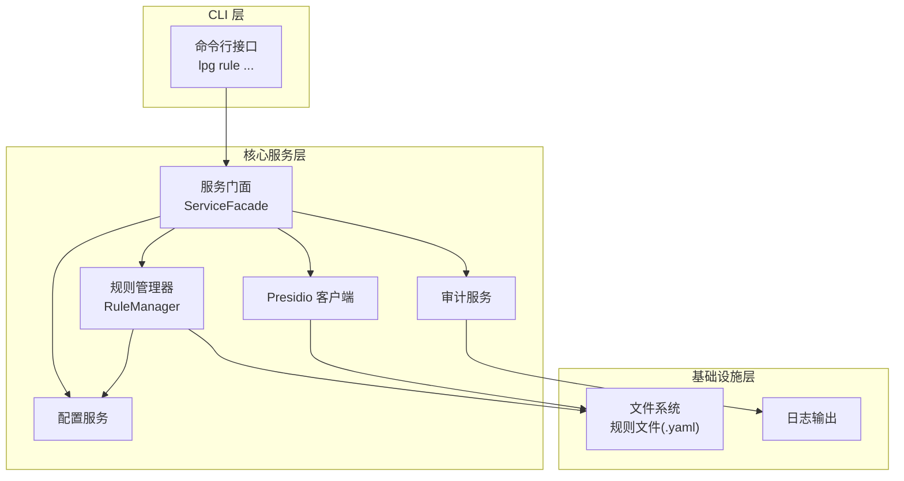
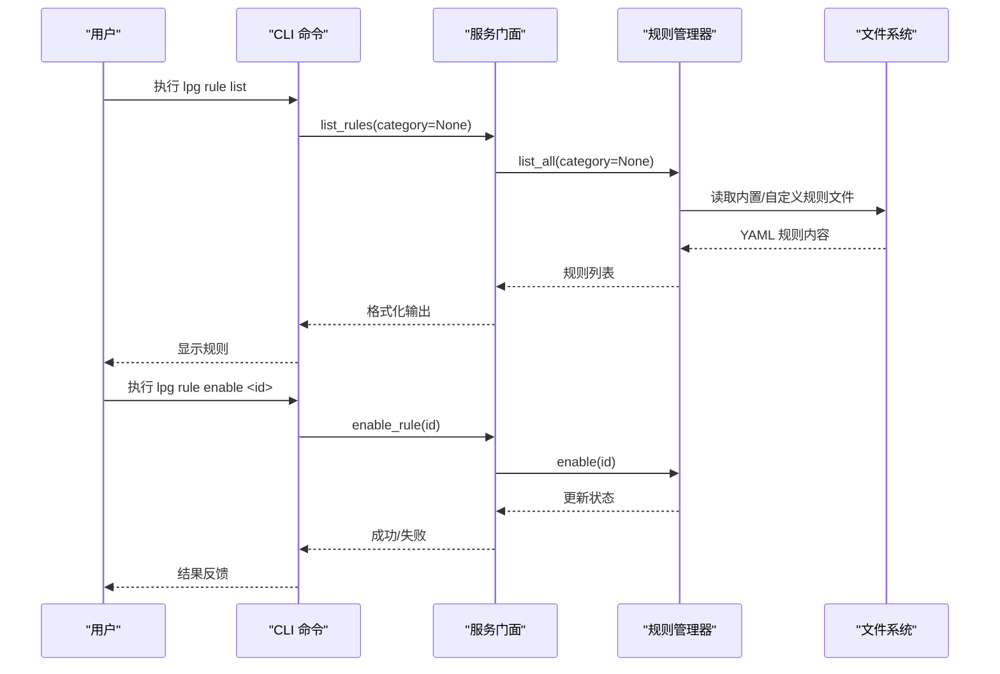
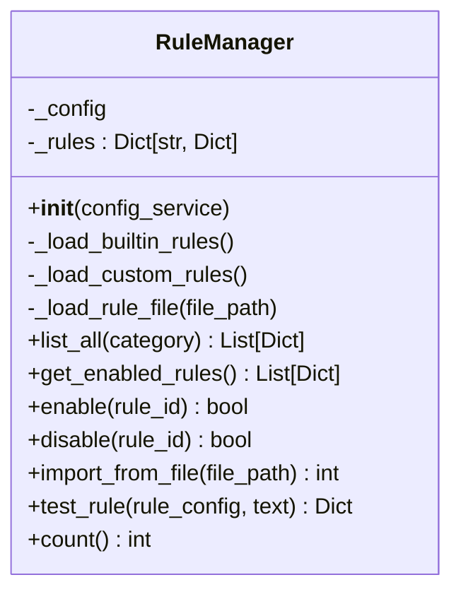
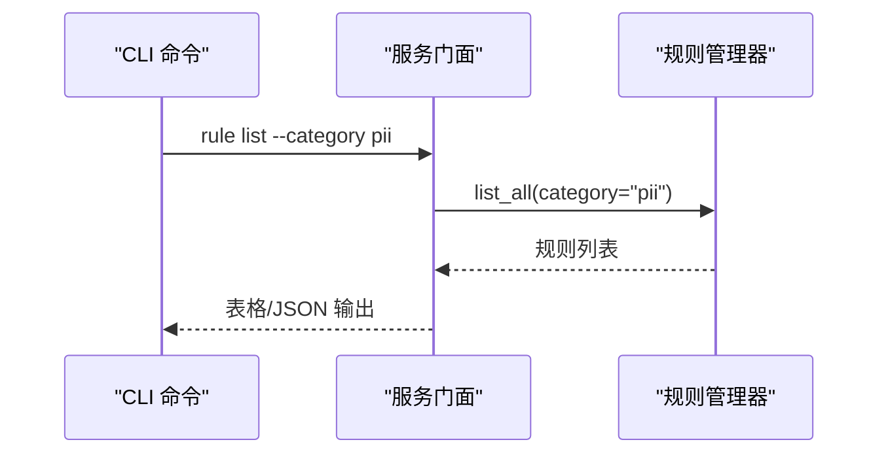
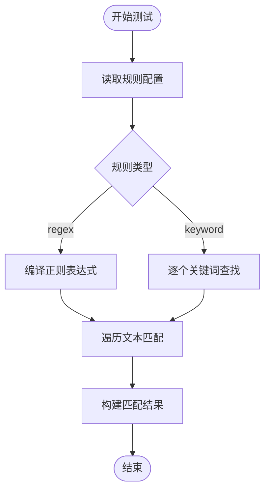
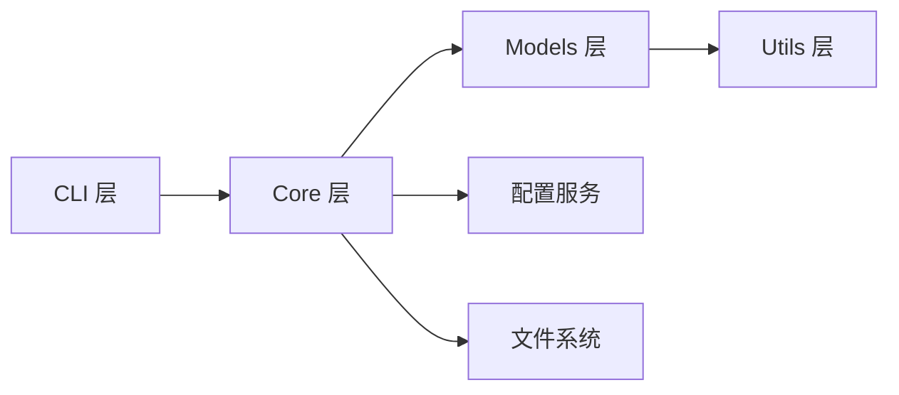

# 规则管理系统

<cite>
**本文引用的文件**
- [规则管理黑盒测试用例](file://doc/test/tcs/v1.0/05_rule_management.md)
- [规则管理测试数据](file://doc/test/tcs/v1.0/05_rule_management_testdata.md)
- [端到端集成测试数据](file://doc/test/tcs/v1.0/08_e2e_integration_testdata.md)
- [技术设计文档](file://doc/design/design-update-20260404-v1.0-init.md)
- [架构分层规则](file://doc/rules/architecture-rule.md)
- [编码规范](file://doc/rules/coding-rule.md)
</cite>

## 目录
1. [简介](#简介)
2. [项目结构](#项目结构)
3. [核心组件](#核心组件)
4. [架构总览](#架构总览)
5. [详细组件分析](#详细组件分析)
6. [依赖分析](#依赖分析)
7. [性能考量](#性能考量)
8. [故障排除指南](#故障排除指南)
9. [结论](#结论)
10. [附录](#附录)

## 简介
本文件系统化阐述 LLM Privacy Gateway（LPG）v1.0 的规则管理系统，覆盖规则加载、启用/禁用、导入/移除、测试与验证、与 PII 检测的集成关系、最佳实践与性能优化建议，以及常见问题排查。文档基于仓库内的设计文档、测试用例与测试数据，确保内容可追溯至实际实现。

## 项目结构
规则管理模块位于核心服务层，围绕 RuleManager 提供规则生命周期管理；CLI 层通过命令将用户操作委派给 RuleManager；配置服务提供规则相关配置项（如自定义规则目录）。整体采用分层架构，职责清晰、依赖单向。

图表来源
- [技术设计文档:1277-1439](file://doc/design/design-update-20260404-v1.0-init.md#L1277-L1439)
- [架构分层规则:36-83](file://doc/rules/architecture-rule.md#L36-L83)

章节来源
- [技术设计文档:1277-1439](file://doc/design/design-update-20260404-v1.0-init.md#L1277-L1439)
- [架构分层规则:36-83](file://doc/rules/architecture-rule.md#L36-L83)

## 核心组件
- 规则管理器（RuleManager）：负责规则加载、启用/禁用、导入、测试与统计；内置规则与自定义规则目录均通过 YAML 文件加载。
- 服务门面（ServiceFacade）：对外暴露规则相关 API，供 CLI 命令调用。
- 配置服务（ConfigService）：提供规则相关配置项，如自定义规则目录。
- CLI 命令（rule.py）：提供 list、enable、disable、import、remove、test、config 等子命令。
- Presidio 集成：规则系统与 PII 检测/脱敏流程协同工作，规则状态影响检测行为。

章节来源
- [技术设计文档:1277-1439](file://doc/design/design-update-20260404-v1.0-init.md#L1277-L1439)
- [规则管理黑盒测试用例:586-623](file://doc/test/tcs/v1.0/05_rule_management.md#L586-L623)

## 架构总览
规则管理在 v1.0 中采用“配置驱动 + 文件系统”的轻量方案：
- 内置规则：随产品分发的 YAML 文件，位于规则目录。
- 自定义规则：由配置指定的自定义目录，支持动态加载。
- 规则状态：内存中维护，支持启用/禁用；持久化能力在测试用例中验证（重启后状态保持）。

图表来源
- [技术设计文档:1277-1439](file://doc/design/design-update-20260404-v1.0-init.md#L1277-L1439)
- [规则管理黑盒测试用例:586-623](file://doc/test/tcs/v1.0/05_rule_management.md#L586-L623)

## 详细组件分析

### 规则管理器（RuleManager）
- 职责
  - 加载内置规则与自定义规则（YAML）
  - 列出规则、按分类过滤、统计数量
  - 启用/禁用规则
  - 从文件导入规则
  - 测试规则（正则/关键词）
- 关键行为
  - 内置规则目录扫描 *.yaml 并解析 rules 数组
  - 自定义规则目录通过配置项 rules.custom_rules_dir 指定
  - 规则默认启用，支持覆盖
  - 测试支持 regex 与 keyword 两种类型

图表来源
- [技术设计文档:1277-1439](file://doc/design/design-update-20260404-v1.0-init.md#L1277-L1439)

章节来源
- [技术设计文档:1277-1439](file://doc/design/design-update-20260404-v1.0-init.md#L1277-L1439)

### CLI 命令与服务门面
- CLI 命令
  - list：列出规则（支持 --category/--enabled/--disabled）
  - enable/disable：单条或多条批量启用/禁用
  - import：从 YAML/JSON 导入规则
  - remove：移除规则（内置规则不可移除）
  - test：对规则进行匹配测试
  - config：查看规则相关配置
- 服务门面
  - 将 CLI 命令委派给 RuleManager，统一返回格式化结果

图表来源
- [规则管理黑盒测试用例:586-623](file://doc/test/tcs/v1.0/05_rule_management.md#L586-L623)

章节来源
- [规则管理黑盒测试用例:586-623](file://doc/test/tcs/v1.0/05_rule_management.md#L586-L623)

### 规则文件格式与配置项
- 文件格式
  - YAML：顶层包含 rules 数组，数组元素为单条规则
  - 规则字段（示例）
    - id：规则唯一标识（必填）
    - name：规则名称（可选）
    - category：规则分类（如 pii/credentials/finance）
    - type：规则类型（regex/keyword）
    - enabled：是否启用（默认 True）
    - description：描述
    - pattern/keywords：规则匹配条件
    - entity_type：实体类型（用于 PII 检测）
- 配置项
  - rules.custom_rules_dir：自定义规则目录路径（展开 ~）

章节来源
- [技术设计文档:1277-1439](file://doc/design/design-update-20260404-v1.0-init.md#L1277-L1439)
- [规则管理测试数据:1-69](file://doc/test/tcs/v1.0/05_rule_management_testdata.md#L1-L69)

### 规则测试与验证
- 测试类型
  - 正则规则：基于 pattern 的正则匹配
  - 关键词规则：基于 keywords 的子串匹配
- 测试输出
  - 匹配位置（start/end）、匹配文本、匹配数量
  - 详细模式可输出更丰富的匹配细节
- 验证要点
  - 格式错误的规则文件应给出明确错误提示
  - 重复规则导入应给出告警并按策略处理
  - 空规则文件导入应给出警告

图表来源
- [技术设计文档:1388-1434](file://doc/design/design-update-20260404-v1.0-init.md#L1388-L1434)

章节来源
- [规则管理黑盒测试用例:411-470](file://doc/test/tcs/v1.0/05_rule_management.md#L411-L470)
- [技术设计文档:1388-1434](file://doc/design/design-update-20260404-v1.0-init.md#L1388-L1434)

### 规则与 PII 检测的集成
- 规则状态影响检测行为
  - 若仅启用 PII 规则，则仅检测 PII 实体
  - 若仅启用凭证规则，则检测凭证相关模式
  - 若禁用所有规则，则不进行规则层面的检测
- 端到端场景
  - 场景覆盖：仅启用 PII、仅启用凭证、禁用所有、自定义规则等
  - 预期：检测数量、检测类型、输出与输入一致性

章节来源
- [端到端集成测试数据:723-828](file://doc/test/tcs/v1.0/08_e2e_integration_testdata.md#L723-L828)

## 依赖分析
- 分层依赖
  - CLI → Core → Models → Utils（单向依赖）
  - RuleManager 位于 Core 层，依赖 ConfigService 与文件系统
- 跨层调用
  - CLI 不应直接调用 Utils，应通过 Core 封装
  - RuleManager 不应直接处理用户交互，应通过 Facade 暴露

图表来源
- [架构分层规则:70-83](file://doc/rules/architecture-rule.md#L70-L83)

章节来源
- [架构分层规则:70-83](file://doc/rules/architecture-rule.md#L70-L83)

## 性能考量
- 规则加载
  - 内置规则与自定义规则分别扫描，建议合理规划规则数量与文件拆分
  - YAML 解析与正则编译为 O(n) 操作，注意避免过于复杂的正则
- 规则测试
  - 正则匹配按文本长度线性扫描；关键词匹配为多模式匹配，建议控制关键词数量
  - 对大文本建议分段处理或限制扫描范围
- 运行时
  - 规则状态在内存维护，启用/禁用为 O(1) 操作
  - 建议在高频场景下缓存常用规则的编译结果（如正则）

[本节为通用指导，无需引用具体文件]

## 故障排除指南
- 规则加载失败
  - 检查规则文件格式（YAML/JSON），确保顶层包含 rules 数组
  - 确认规则 id 唯一，避免重复
  - 自定义规则目录需在配置中正确设置
- 规则导入告警
  - 空规则文件：导入后无新增规则
  - 重复规则：导入时给出告警，按策略决定覆盖或跳过
  - 格式错误：导入时报错并显示错误位置
- 规则启用/禁用异常
  - 规则不存在：命令返回错误并退出码非零
  - 已禁用再次禁用：给出警告并保持状态
- 规则测试异常
  - 正则无效：返回错误提示
  - 关键词匹配：确认大小写与全角半角差异
- 持久化验证
  - 启动/重启后规则状态与配置应保持一致（测试用例覆盖）

章节来源
- [规则管理黑盒测试用例:87-115](file://doc/test/tcs/v1.0/05_rule_management.md#L87-L115)
- [规则管理黑盒测试用例:227-254](file://doc/test/tcs/v1.0/05_rule_management.md#L227-L254)
- [规则管理黑盒测试用例:319-361](file://doc/test/tcs/v1.0/05_rule_management.md#L319-L361)
- [规则管理黑盒测试用例:443-454](file://doc/test/tcs/v1.0/05_rule_management.md#L443-L454)
- [规则管理黑盒测试用例:552-581](file://doc/test/tcs/v1.0/05_rule_management.md#L552-L581)

## 结论
LPG v1.0 的规则管理系统以 YAML 文件为核心载体，结合配置驱动与内存状态管理，提供了开箱即用的规则加载、启用/禁用、导入/移除与测试能力。通过 CLI 命令与服务门面解耦，系统具备良好的可测试性与扩展性。建议在生产环境中配合严格的规则格式校验、合理的规则拆分与缓存策略，以获得更优的性能与稳定性。

[本节为总结性内容，无需引用具体文件]

## 附录

### 规则分类与状态
- 分类
  - pii：个人身份信息（姓名、邮箱、电话、地址等）
  - credentials：凭证信息（密码、API Key、Token 等）
  - finance：金融信息（信用卡号、银行账号、交易记录等）
- 状态
  - enabled：启用，参与检测
  - disabled：禁用，不参与检测

章节来源
- [规则管理黑盒测试用例:601-623](file://doc/test/tcs/v1.0/05_rule_management.md#L601-L623)

### 规则优先级
- 高：优先应用（1-100）
- 中：普通应用（101-200）
- 低：最后应用（201-300）

章节来源
- [规则管理黑盒测试用例:616-623](file://doc/test/tcs/v1.0/05_rule_management.md#L616-L623)

### 自定义规则开发指南
- 规则语法
  - YAML：rules 数组，每条规则包含 id/name/category/type/enabled/description/pattern/keywords/entity_type
  - JSON：与 YAML 等价的数据结构
- 匹配条件
  - regex：使用 pattern 字段编写正则表达式
  - keyword：使用 keywords 数组编写关键词列表
- 处理逻辑
  - entity_type 用于与 PII 检测对接
  - enabled 控制是否参与检测
- 导入与验证
  - 使用 import 命令导入规则文件
  - 通过 test 命令验证规则匹配效果

章节来源
- [规则管理黑盒测试用例:287-361](file://doc/test/tcs/v1.0/05_rule_management.md#L287-L361)
- [规则管理黑盒测试用例:411-470](file://doc/test/tcs/v1.0/05_rule_management.md#L411-L470)
- [规则管理测试数据:1-69](file://doc/test/tcs/v1.0/05_rule_management_testdata.md#L1-L69)

### 最佳实践
- 规则文件组织
  - 将相似规则归类到同一文件，避免单文件过大
  - 使用明确的 id 与 name，便于检索与管理
- 正则与关键词
  - 正则应简洁高效，避免回溯陷阱
  - 关键词建议去重并统一大小写
- 配置与持久化
  - 自定义规则目录通过配置集中管理
  - 重启后验证规则状态与配置一致性

[本节为通用指导，无需引用具体文件]