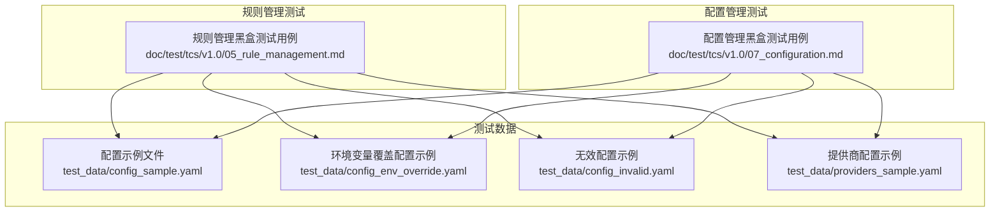
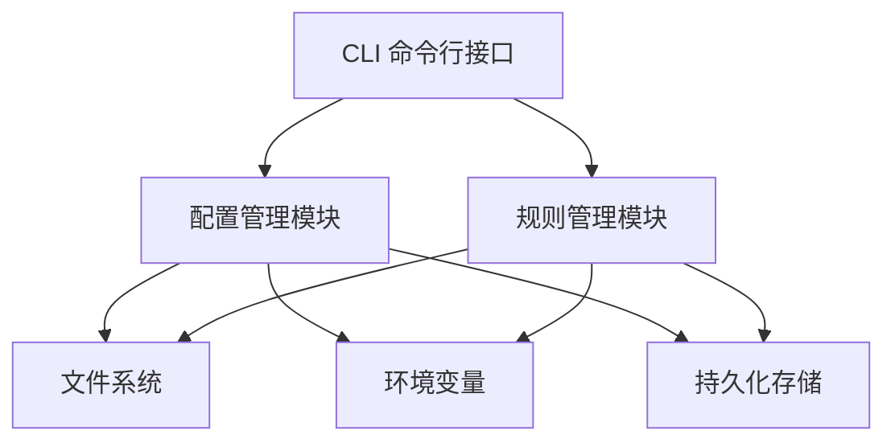
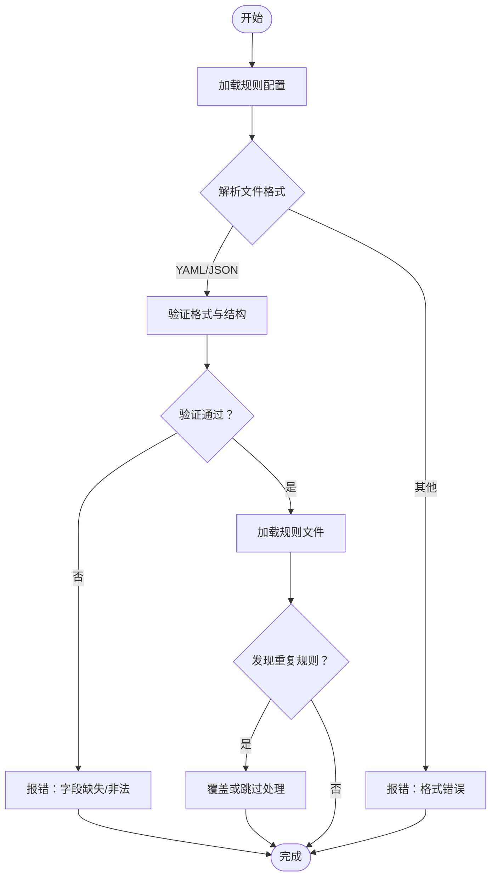
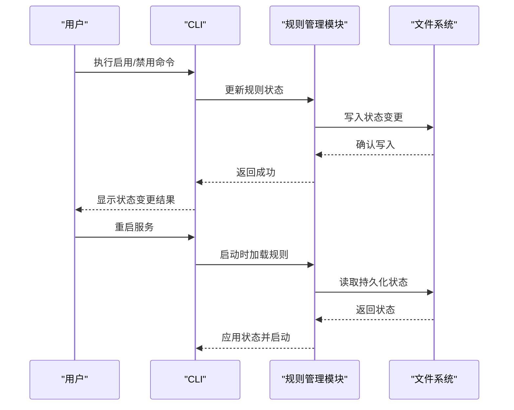
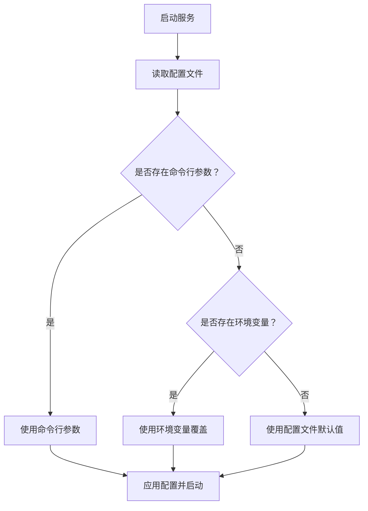
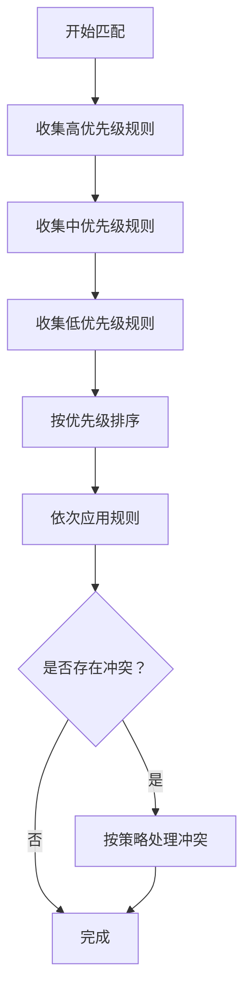
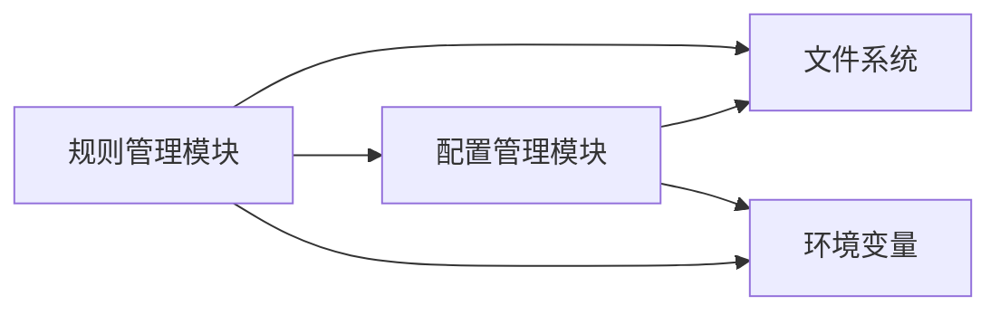

# 规则配置与持久化

<cite>
**本文引用的文件**
- [规则管理黑盒测试用例](file://doc/test/tcs/v1.0/05_rule_management.md)
- [配置管理黑盒测试用例](file://doc/test/tcs/v1.0/07_configuration.md)
- [配置示例文件](file://doc/test/tcs/v1.0/test_data/config_sample.yaml)
- [环境变量覆盖配置示例](file://doc/test/tcs/v1.0/test_data/config_env_override.yaml)
- [无效配置示例](file://doc/test/tcs/v1.0/test_data/config_invalid.yaml)
- [提供商配置示例](file://doc/test/tcs/v1.0/test_data/providers_sample.yaml)
</cite>

## 目录
1. [简介](#简介)
2. [项目结构](#项目结构)
3. [核心组件](#核心组件)
4. [架构总览](#架构总览)
5. [详细组件分析](#详细组件分析)
6. [依赖关系分析](#依赖关系分析)
7. [性能考虑](#性能考虑)
8. [故障排除指南](#故障排除指南)
9. [结论](#结论)
10. [附录](#附录)

## 简介
本文件聚焦于 LLM Privacy Gateway 的规则配置与持久化能力，围绕以下目标展开：
- 解释规则配置的存储机制：配置文件格式、配置项定义与验证策略
- 说明规则状态持久化的实现原理：启用/禁用状态的保存与恢复
- 文档化配置加载的优先级与覆盖规则，以及配置变更的生效机制
- 提供配置管理最佳实践：备份、版本管理与多环境同步
- 解释规则优先级系统：高、中、低三个优先级的配置与应用顺序
- 给出配置示例与故障排除指南

## 项目结构
本仓库中与规则配置和持久化直接相关的资料主要集中在测试用例与测试数据中：
- 规则管理测试用例：涵盖规则加载、列表、启用/禁用、导入、移除、测试、配置、优先级与持久化等场景
- 配置管理测试用例：涵盖配置初始化、加载、读取、设置、验证、环境变量覆盖、优先级、持久化与提供商配置等场景
- 测试数据：包含标准配置、环境变量覆盖配置、无效配置与提供商配置示例

**图表来源**
- [规则管理黑盒测试用例](file://doc/test/tcs/v1.0/05_rule_management.md)
- [配置管理黑盒测试用例](file://doc/test/tcs/v1.0/07_configuration.md)
- [配置示例文件](file://doc/test/tcs/v1.0/test_data/config_sample.yaml)
- [环境变量覆盖配置示例](file://doc/test/tcs/v1.0/test_data/config_env_override.yaml)
- [无效配置示例](file://doc/test/tcs/v1.0/test_data/config_invalid.yaml)
- [提供商配置示例](file://doc/test/tcs/v1.0/test_data/providers_sample.yaml)

**章节来源**
- [规则管理黑盒测试用例](file://doc/test/tcs/v1.0/05_rule_management.md)
- [配置管理黑盒测试用例](file://doc/test/tcs/v1.0/07_configuration.md)

## 核心组件
- 规则配置存储与加载
  - 支持从内置规则目录、自定义规则目录与单个规则文件加载规则
  - 支持 YAML/JSON 格式的规则文件导入
  - 支持对重复规则进行覆盖或跳过的处理策略
- 规则状态管理
  - 支持单个/批量启用/禁用规则
  - 规则状态变更具备持久化能力，重启后状态保持
- 规则优先级系统
  - 定义高、中、低三个优先级区间，确保高优先级规则优先应用
  - 冲突规则按优先级或配置策略处理
- 配置优先级与覆盖
  - 命令行参数 > 环境变量 > 配置文件
  - 环境变量可覆盖配置文件中的特定字段
- 配置持久化与安全
  - 配置修改后自动保存至配置文件
  - 配置文件权限检查（示例为 600），保障安全性

**章节来源**
- [规则管理黑盒测试用例](file://doc/test/tcs/v1.0/05_rule_management.md)
- [配置管理黑盒测试用例](file://doc/test/tcs/v1.0/07_configuration.md)

## 架构总览
下图展示了规则配置与持久化在系统中的关键交互：

**图表来源**
- [规则管理黑盒测试用例](file://doc/test/tcs/v1.0/05_rule_management.md)
- [配置管理黑盒测试用例](file://doc/test/tcs/v1.0/07_configuration.md)

## 详细组件分析

### 规则配置存储机制
- 配置文件格式
  - 支持 YAML/JSON 格式，用于导入规则文件
  - 规则文件需满足格式规范，否则会触发错误提示并阻止加载
- 配置项定义
  - 规则启用开关与规则目录路径
  - 支持内置规则目录与自定义规则目录
- 配置验证
  - 对格式错误的规则文件进行严格校验，拒绝加载并给出具体错误位置
  - 对空规则文件进行告警提示，避免误操作

**图表来源**
- [规则管理黑盒测试用例](file://doc/test/tcs/v1.0/05_rule_management.md)

**章节来源**
- [规则管理黑盒测试用例](file://doc/test/tcs/v1.0/05_rule_management.md)

### 规则状态持久化
- 启用/禁用状态的保存与恢复
  - 支持单个与批量启用/禁用规则
  - 状态变更后具备持久化能力，重启服务后状态保持一致
- 验证流程
  - 修改规则状态后，重启服务并检查状态是否保持
  - 日志中应显示加载持久化配置与状态

**图表来源**
- [规则管理黑盒测试用例](file://doc/test/tcs/v1.0/05_rule_management.md)

**章节来源**
- [规则管理黑盒测试用例](file://doc/test/tcs/v1.0/05_rule_management.md)

### 配置加载优先级与覆盖规则
- 优先级顺序
  - 命令行参数优先级最高
  - 环境变量次之
  - 配置文件优先级最低
- 环境变量覆盖
  - 支持通过环境变量覆盖配置文件中的特定字段
  - 当环境变量值无效时，系统会发出警告并回退到配置文件值
- 生效机制
  - 配置修改后自动保存至配置文件
  - 服务重启后加载持久化配置，确保一致性

**图表来源**
- [配置管理黑盒测试用例](file://doc/test/tcs/v1.0/07_configuration.md)

**章节来源**
- [配置管理黑盒测试用例](file://doc/test/tcs/v1.0/07_configuration.md)

### 规则优先级系统
- 优先级区间
  - 高优先级：1-100
  - 中优先级：101-200
  - 低优先级：201-300
- 应用顺序
  - 高优先级规则优先应用
  - 冲突规则根据配置策略处理（如优先级或首次匹配）
- 验证方法
  - 通过测试所有规则匹配结果，确认应用顺序与优先级一致

**图表来源**
- [规则管理黑盒测试用例](file://doc/test/tcs/v1.0/05_rule_management.md)

**章节来源**
- [规则管理黑盒测试用例](file://doc/test/tcs/v1.0/05_rule_management.md)

### 配置管理最佳实践
- 配置备份
  - 在修改前备份配置文件，防止误操作导致不可逆影响
- 版本管理
  - 使用版本控制工具跟踪配置变更历史，便于回滚与审计
- 多环境同步
  - 通过环境变量覆盖实现不同环境的差异化配置
  - 使用统一的配置模板与环境变量清单，确保一致性
- 权限与安全
  - 保持配置文件权限为 600，限制读写权限
  - 敏感信息（如 API Key）通过环境变量注入，避免硬编码

**章节来源**
- [配置管理黑盒测试用例](file://doc/test/tcs/v1.0/07_configuration.md)

## 依赖关系分析
- 规则管理模块依赖配置管理模块提供的配置加载与优先级机制
- 文件系统作为持久化存储，承载规则状态与配置文件的读写
- 环境变量作为外部输入源，参与配置的覆盖与优先级判定

**图表来源**
- [规则管理黑盒测试用例](file://doc/test/tcs/v1.0/05_rule_management.md)
- [配置管理黑盒测试用例](file://doc/test/tcs/v1.0/07_configuration.md)

**章节来源**
- [规则管理黑盒测试用例](file://doc/test/tcs/v1.0/05_rule_management.md)
- [配置管理黑盒测试用例](file://doc/test/tcs/v1.0/07_configuration.md)

## 性能考虑
- 规则加载与验证
  - 对大量规则文件进行批量加载时，建议分批处理并异步验证，避免阻塞主线程
- 状态持久化
  - 状态写入采用原子写入策略，减少并发写入冲突
- 配置优先级计算
  - 优先级计算复杂度与规则数量线性相关，建议对规则进行分组与索引优化

## 故障排除指南
- 规则文件格式错误
  - 现象：导入/加载规则时报错，提示格式错误
  - 处理：检查 YAML/JSON 格式，修正语法错误后重试
- 规则文件为空
  - 现象：导入/加载规则提示空文件
  - 处理：确认规则文件包含有效规则定义
- 重复规则
  - 现象：导入规则提示发现重复规则
  - 处理：根据配置选择覆盖或跳过策略，清理重复项
- 配置文件不存在
  - 现象：读取配置时报错，提示文件不存在
  - 处理：使用初始化命令生成配置文件，或指定正确的配置路径
- 环境变量值无效
  - 现象：环境变量覆盖失败并发出警告
  - 处理：修正环境变量值格式或删除无效变量，确保符合配置要求
- 配置权限问题
  - 现象：配置文件权限不符合预期
  - 处理：调整文件权限为 600，确保仅当前用户可读写

**章节来源**
- [规则管理黑盒测试用例](file://doc/test/tcs/v1.0/05_rule_management.md)
- [配置管理黑盒测试用例](file://doc/test/tcs/v1.0/07_configuration.md)

## 结论
本文件基于测试用例与测试数据，系统梳理了 LLM Privacy Gateway 的规则配置与持久化能力，明确了配置文件格式、配置项定义与验证策略，解释了规则状态持久化的实现原理与配置加载优先级，并提供了最佳实践与故障排除指南。建议在生产环境中遵循备份与版本管理策略，结合环境变量覆盖实现多环境同步，确保系统的稳定性与安全性。

## 附录
- 配置示例
  - 标准配置示例：包含代理、日志、提供商与规则配置
  - 环境变量覆盖配置示例：演示环境变量如何覆盖配置文件
  - 无效配置示例：展示格式错误的配置文件
  - 提供商配置示例：包含多种提供商的配置模板
- 规则优先级区间
  - 高：1-100
  - 中：101-200
  - 低：201-300

**章节来源**
- [配置示例文件](file://doc/test/tcs/v1.0/test_data/config_sample.yaml)
- [环境变量覆盖配置示例](file://doc/test/tcs/v1.0/test_data/config_env_override.yaml)
- [无效配置示例](file://doc/test/tcs/v1.0/test_data/config_invalid.yaml)
- [提供商配置示例](file://doc/test/tcs/v1.0/test_data/providers_sample.yaml)