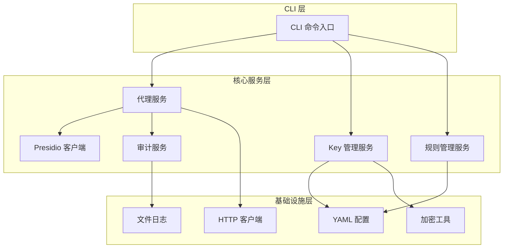
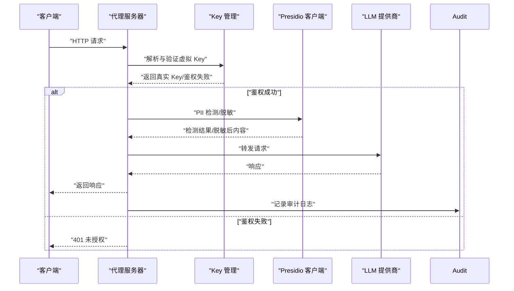
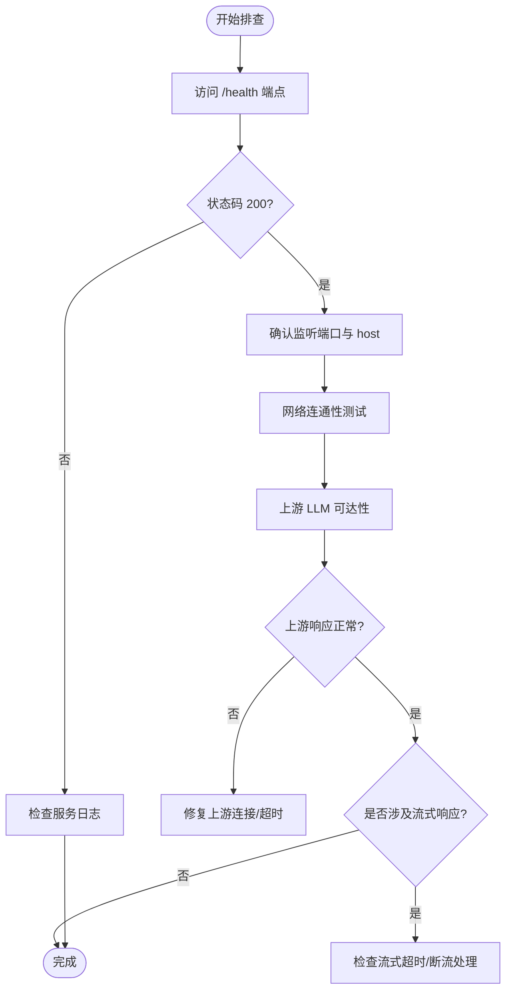
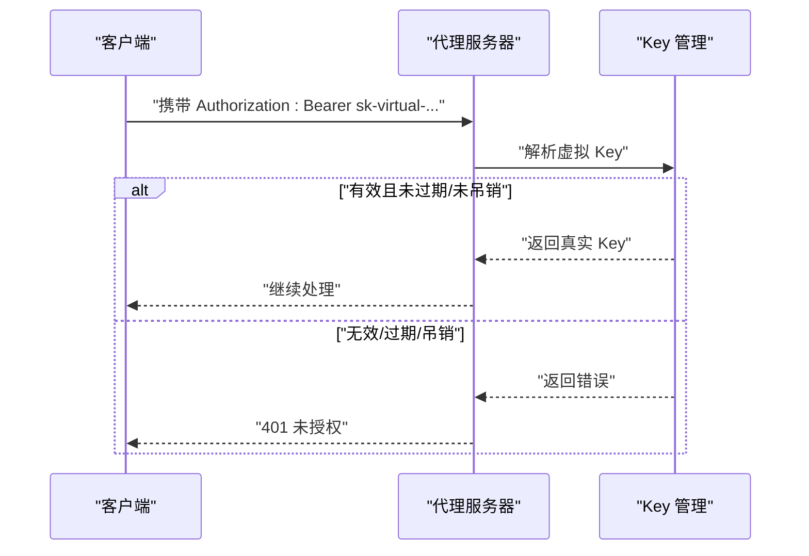
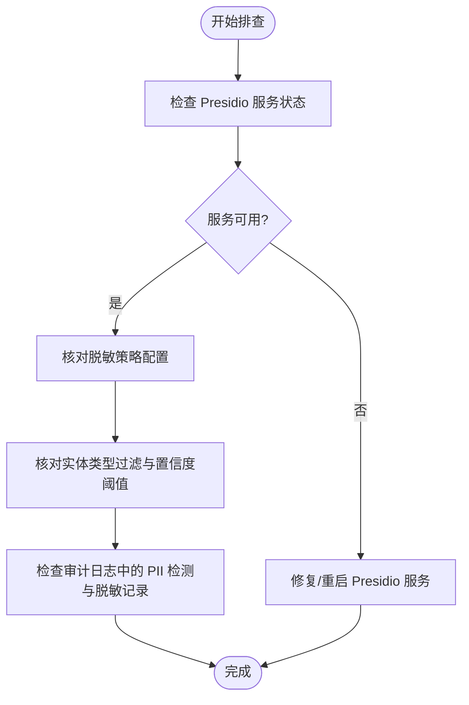
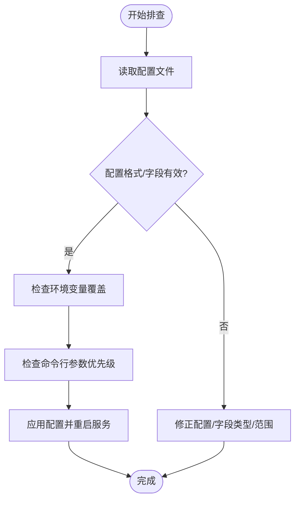
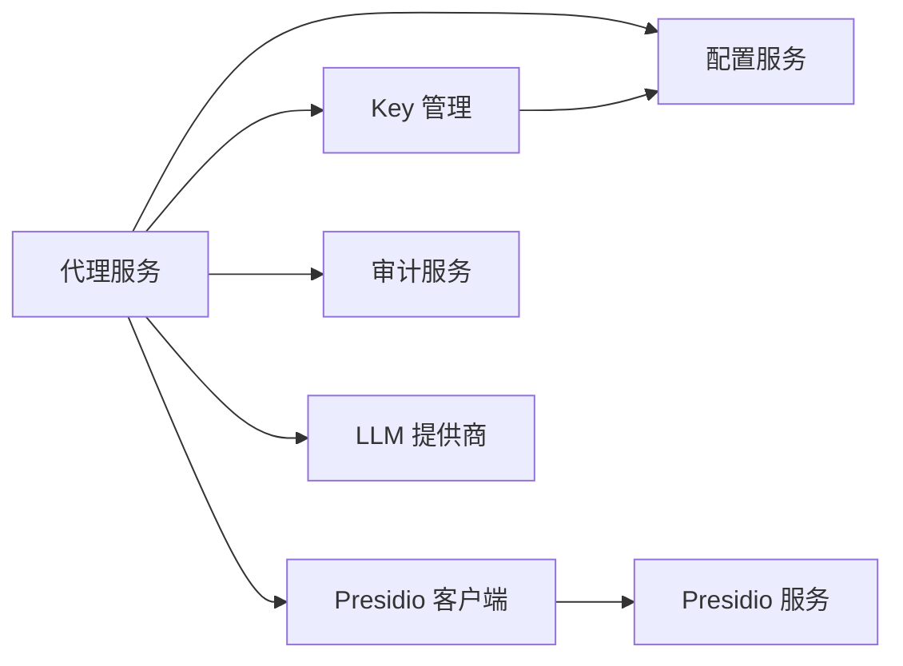

# 故障排除与调试

<cite>
**本文引用的文件**
- [AGENTS.md](file://AGENTS.md)
- [设计文档](file://doc/design/design-update-20260404-v1.0-init.md)
- [代理服务测试用例](file://doc/test/tcs/v1.0/02_proxy_service.md)
- [Key 管理测试用例](file://doc/test/tcs/v1.0/03_key_management.md)
- [PII 检测脱敏测试用例](file://doc/test/tcs/v1.0/04_pii_detection.md)
- [配置管理测试用例](file://doc/test/tcs/v1.0/07_configuration.md)
- [配置管理测试数据](file://doc/test/tcs/v1.0/07_configuration_testdata.md)
- [审计日志测试数据](file://doc/test/tcs/v1.0/06_audit_logging_testdata.md)
- [测试用例总览](file://doc/test/tcs/v1.0/README.md)
</cite>

## 目录
1. [简介](#简介)
2. [项目结构](#项目结构)
3. [核心组件](#核心组件)
4. [架构总览](#架构总览)
5. [详细组件分析](#详细组件分析)
6. [依赖分析](#依赖分析)
7. [性能考虑](#性能考虑)
8. [故障排除指南](#故障排除指南)
9. [结论](#结论)
10. [附录](#附录)

## 简介
本指南面向运维与技术支持人员，提供 LLM Privacy Gateway 的系统化故障排除与调试手册。内容涵盖日志分析技巧、错误代码解读、常见问题定位、调试工具使用、诊断信息收集与性能数据采集，以及紧急情况下的应急处理与回滚策略。文档基于仓库内的测试用例与设计文档，确保方法与依据可追溯。

## 项目结构
- 代码采用四层架构：CLI、Core、Models、Utils，强调分层与依赖注入，便于测试与维护。
- 测试用例覆盖代理服务、Key 管理、PII 检测、配置管理、审计日志等多个模块，形成完善的黑盒与集成测试矩阵。

**图表来源**
- [设计文档:70-122](file://doc/design/design-update-20260404-v1.0-init.md#L70-L122)

**章节来源**
- [AGENTS.md:11-28](file://AGENTS.md#L11-L28)
- [设计文档:70-122](file://doc/design/design-update-20260404-v1.0-init.md#L70-L122)

## 核心组件
- 代理服务器：负责接收请求、鉴权、转发、统计与健康检查。
- Key 管理：虚拟 Key 的创建、解析、吊销、过期与使用统计。
- Presidio 集成：PII 检测与脱敏，支持连接与超时异常。
- 审计日志：结构化日志输出，支持查询、导出与统计。
- 配置系统：YAML 配置、环境变量覆盖、命令行参数优先级。

**章节来源**
- [代理服务测试用例:1-80](file://doc/test/tcs/v1.0/02_proxy_service.md#L1-L80)
- [Key 管理测试用例:1-35](file://doc/test/tcs/v1.0/03_key_management.md#L1-L35)
- [PII 检测脱敏测试用例:1-40](file://doc/test/tcs/v1.0/04_pii_detection.md#L1-L40)
- [配置管理测试用例:1-35](file://doc/test/tcs/v1.0/07_configuration.md#L1-L35)

## 架构总览
代理服务作为核心入口，接收来自客户端的请求，经过 Key 验证与 Presidio PII 检测/脱敏后，转发至上游 LLM 提供商。审计服务记录请求处理全过程，配置系统贯穿各组件的行为控制。

**图表来源**
- [设计文档:162-200](file://doc/design/design-update-20260404-v1.0-init.md#L162-L200)
- [代理服务测试用例:108-167](file://doc/test/tcs/v1.0/02_proxy_service.md#L108-L167)
- [Key 管理测试用例:128-172](file://doc/test/tcs/v1.0/03_key_management.md#L128-L172)

## 详细组件分析

### 代理服务故障排查
- 启动失败
  - 检查端口占用与权限：使用测试用例中的“默认参数启动”“自定义端口启动”“自定义 host 启动”等步骤验证。
  - 关注健康检查端点 /health 的响应与响应时间。
- 请求转发异常
  - 4xx/5xx 错误：对照“目标服务器返回 4xx/5xx 错误”的测试步骤，确认上游响应与重试策略。
  - 超时与连接失败：参照“目标服务器超时/连接失败”的测试步骤，检查上游可达性与超时配置。
- 流式响应
  - 断流与超时：参考“流式响应中断/超时处理”，关注客户端断开与服务端资源释放。
- 统计与可观测性
  - 请求数、成功率、平均延迟、PII 检测数、运行时间等指标，可通过健康端点或状态接口获取。

**图表来源**
- [代理服务测试用例:776-801](file://doc/test/tcs/v1.0/02_proxy_service.md#L776-L801)
- [代理服务测试用例:515-573](file://doc/test/tcs/v1.0/02_proxy_service.md#L515-L573)

**章节来源**
- [代理服务测试用例:46-167](file://doc/test/tcs/v1.0/02_proxy_service.md#L46-L167)
- [代理服务测试用例:515-573](file://doc/test/tcs/v1.0/02_proxy_service.md#L515-L573)
- [代理服务测试用例:684-744](file://doc/test/tcs/v1.0/02_proxy_service.md#L684-L744)

### Key 验证失败排查
- 无效/吊销/过期 Key
  - 使用“解析无效/已吊销/已过期 Key”的测试步骤，确认返回 401 与错误信息。
- Key 列表与详情
  - 使用“列出/显示 Key 详情”的测试步骤，核对 Key 状态、权限与使用统计。
- 并发场景
  - 参考“并发解析 Key”的测试步骤，验证计数一致性与竞态条件。

**图表来源**
- [Key 管理测试用例:128-172](file://doc/test/tcs/v1.0/03_key_management.md#L128-L172)
- [Key 管理测试用例:361-390](file://doc/test/tcs/v1.0/03_key_management.md#L361-L390)

**章节来源**
- [Key 管理测试用例:36-125](file://doc/test/tcs/v1.0/03_key_management.md#L36-L125)
- [Key 管理测试用例:175-202](file://doc/test/tcs/v1.0/03_key_management.md#L175-L202)
- [Key 管理测试用例:408-437](file://doc/test/tcs/v1.0/03_key_management.md#L408-L437)

### PII 检测异常排查
- Presidio 服务不可用
  - 参考“Presidio 服务连接失败/超时处理”，确认连接与超时配置，必要时降级处理。
- 检测/脱敏策略
  - 使用“多种实体类型检测/脱敏策略验证”的测试步骤，核对策略配置与边界值。
- 多语言与边界情况
  - 参考“多语言支持/边界情况测试”，验证语言配置与特殊字符处理。

**图表来源**
- [PII 检测脱敏测试用例:547-591](file://doc/test/tcs/v1.0/04_pii_detection.md#L547-L591)
- [PII 检测脱敏测试用例:640-685](file://doc/test/tcs/v1.0/04_pii_detection.md#L640-L685)

**章节来源**
- [PII 检测脱敏测试用例:547-591](file://doc/test/tcs/v1.0/04_pii_detection.md#L547-L591)
- [PII 检测脱敏测试用例:640-685](file://doc/test/tcs/v1.0/04_pii_detection.md#L640-L685)

### 配置问题排查
- 配置加载与覆盖
  - 使用“配置加载/读取/设置/验证”的测试步骤，核对默认值、环境变量覆盖与命令行参数优先级。
- 路径与权限
  - 参考“配置文件路径/日志文件路径/权限”测试数据，确认路径存在、权限正确与格式合法。
- 提供商配置
  - 使用“添加/移除/修改提供商配置”的测试步骤，核对 base_url、auth_type、api_key 等字段。

**图表来源**
- [配置管理测试用例:100-173](file://doc/test/tcs/v1.0/07_configuration.md#L100-L173)
- [配置管理测试用例:454-498](file://doc/test/tcs/v1.0/07_configuration.md#L454-L498)
- [配置管理测试数据:1-80](file://doc/test/tcs/v1.0/07_configuration_testdata.md#L1-L80)

**章节来源**
- [配置管理测试用例:100-173](file://doc/test/tcs/v1.0/07_configuration.md#L100-L173)
- [配置管理测试用例:454-498](file://doc/test/tcs/v1.0/07_configuration.md#L454-L498)
- [配置管理测试数据:1-80](file://doc/test/tcs/v1.0/07_configuration_testdata.md#L1-L80)

### 审计日志与统计
- 日志格式与字段
  - 参考“JSON/结构化日志字段”与“错误日志条目示例”，确保日志字段完整、时间戳与请求链路信息正确。
- 查询与导出
  - 使用“查询条件/导出格式/文件路径/权限”测试数据，验证查询语法、导出格式与文件权限。
- 统计指标
  - 参考“统计信息测试数据”，核对请求数、成功率、平均延迟、PII 检测分布与脱敏操作分布。

**章节来源**
- [审计日志测试数据:266-493](file://doc/test/tcs/v1.0/06_audit_logging_testdata.md#L266-L493)
- [审计日志测试数据:598-683](file://doc/test/tcs/v1.0/06_audit_logging_testdata.md#L598-L683)

## 依赖分析
- 组件耦合
  - 代理服务依赖 Key 管理、Presidio 客户端与审计服务；配置服务贯穿各模块。
- 外部依赖
  - Presidio 服务（Analyzer/Anonymizer）、LLM 提供商 API、文件系统（配置与日志）。
- 异常与降级
  - Presidio 连接/超时异常、上游 4xx/5xx、配置无效等均有明确的错误处理与降级策略。

**图表来源**
- [设计文档:124-160](file://doc/design/design-update-20260404-v1.0-init.md#L124-L160)

**章节来源**
- [设计文档:124-160](file://doc/design/design-update-20260404-v1.0-init.md#L124-L160)

## 性能考虑
- 并发与连接数
  - 参考“并发请求处理/最大连接数限制/请求队列管理”的测试步骤，评估并发压力与队列行为。
- 延迟与超时
  - 使用“请求耗时测试数据”评估不同场景下的延迟边界与超时配置。
- 大数据量与高吞吐
  - 参考“大数据量/高并发测试数据”，验证内存使用与处理效率。

**章节来源**
- [代理服务测试用例:686-744](file://doc/test/tcs/v1.0/02_proxy_service.md#L686-L744)
- [代理服务测试用例:833-972](file://doc/test/tcs/v1.0/02_proxy_service.md#L833-L972)
- [审计日志测试数据:713-732](file://doc/test/tcs/v1.0/06_audit_logging_testdata.md#L713-L732)

## 故障排除指南

### 通用排查流程
- 确认服务状态
  - 访问 /health 端点，检查响应码与响应时间。
  - 使用状态接口获取运行时间、请求数、成功率、平均延迟等指标。
- 检查日志
  - 使用日志级别与格式规范，定位错误堆栈与关键字段。
  - 关注审计日志中的请求链路、PII 检测与脱敏记录。
- 验证配置
  - 核对配置文件、环境变量与命令行参数的优先级与有效性。
  - 检查路径、权限与格式，确保配置可读写。
- 复现与回归
  - 使用测试用例中的最小复现场景，逐步缩小问题范围。

**章节来源**
- [代理服务测试用例:776-801](file://doc/test/tcs/v1.0/02_proxy_service.md#L776-L801)
- [审计日志测试数据:266-363](file://doc/test/tcs/v1.0/06_audit_logging_testdata.md#L266-L363)
- [配置管理测试用例:454-498](file://doc/test/tcs/v1.0/07_configuration.md#L454-L498)

### 常见问题与解决方案

- 代理服务无法启动
  - 端口占用：更换端口或释放占用进程。
  - 权限不足：以足够权限运行或使用非特权端口。
  - 配置错误：检查配置文件与环境变量，确保格式与范围有效。
  - 参考测试用例：默认参数启动、自定义端口启动、自定义 host 启动。

- PII 检测异常
  - Presidio 服务不可用：检查服务状态、网络连通性与超时配置。
  - 策略配置不当：核对实体类型过滤、置信度阈值与脱敏策略。
  - 参考测试用例：Presidio 连接失败/超时处理、脱敏策略验证。

- Key 验证失败
  - 无效/吊销/过期：检查 Key 状态与权限，必要时重新创建或更新。
  - 并发计数异常：核对并发解析测试步骤，确保计数一致性。
  - 参考测试用例：无效/吊销/过期 Key 的解析与使用统计。

- Presidio 服务连接问题
  - 网络与防火墙：确认服务可达与端口开放。
  - 超时与重试：调整超时配置，必要时启用重试策略。
  - 参考测试用例：连接失败/超时处理与降级策略。

- 性能瓶颈
  - 并发与队列：参考并发测试步骤，评估最大连接数与队列行为。
  - 延迟与超时：使用耗时测试数据评估边界，优化上游与本地处理。
  - 参考测试用例：并发请求处理、请求耗时测试数据。

**章节来源**
- [代理服务测试用例:46-167](file://doc/test/tcs/v1.0/02_proxy_service.md#L46-L167)
- [PII 检测脱敏测试用例:547-591](file://doc/test/tcs/v1.0/04_pii_detection.md#L547-L591)
- [Key 管理测试用例:128-172](file://doc/test/tcs/v1.0/03_key_management.md#L128-L172)
- [代理服务测试用例:686-744](file://doc/test/tcs/v1.0/02_proxy_service.md#L686-L744)
- [审计日志测试数据:138-163](file://doc/test/tcs/v1.0/06_audit_logging_testdata.md#L138-L163)

### 调试工具与方法
- HTTP 请求追踪
  - 使用 curl/浏览器访问 /health 与业务端点，记录状态码、响应时间与响应体。
  - 参考测试用例中的请求样例与期望响应，快速定位差异。
- 配置验证
  - 使用配置读取/设置/验证测试步骤，逐项校验字段范围与格式。
- 规则测试
  - 基于测试用例中的实体类型与策略配置，构造最小复现场景。
- 连接测试
  - 使用“连接失败/超时处理”测试步骤，验证上游可达性与超时配置。

**章节来源**
- [代理服务测试用例:776-801](file://doc/test/tcs/v1.0/02_proxy_service.md#L776-L801)
- [配置管理测试用例:176-250](file://doc/test/tcs/v1.0/07_configuration.md#L176-L250)
- [PII 检测脱敏测试用例:547-591](file://doc/test/tcs/v1.0/04_pii_detection.md#L547-L591)

### 诊断信息与性能数据收集
- 诊断信息
  - 服务状态与统计：/health 与状态接口。
  - 审计日志：请求链路、PII 检测与脱敏、错误信息与耗时。
- 性能数据
  - 并发场景与延迟分布：参考并发测试与耗时测试数据。
  - 统计指标：总请求数、成功率、平均/分位延迟、PII 检测分布。

**章节来源**
- [代理服务测试用例:833-972](file://doc/test/tcs/v1.0/02_proxy_service.md#L833-L972)
- [审计日志测试数据:547-597](file://doc/test/tcs/v1.0/06_audit_logging_testdata.md#L547-L597)

### 应急处理与回滚策略
- 紧急处理
  - 降级 Presidio：暂时禁用 PII 检测与脱敏，保证服务可用。
  - 降低并发与超时：减少最大连接数与延长超时，缓解上游压力。
  - 临时绕过：在测试环境中验证最小可行配置，快速恢复服务。
- 回滚策略
  - 配置回滚：使用版本化的配置文件，快速切换到上一个稳定版本。
  - 服务回滚：若升级引入问题，回退到上一个稳定版本的二进制或镜像。
  - 变更隔离：变更配置或规则时，先在预生产环境验证，再灰度发布。

**章节来源**
- [配置管理测试用例:454-498](file://doc/test/tcs/v1.0/07_configuration.md#L454-L498)
- [PII 检测脱敏测试用例:547-591](file://doc/test/tcs/v1.0/04_pii_detection.md#L547-L591)

## 结论
本指南提供了基于测试用例与设计文档的系统化故障排除方法，涵盖代理服务、Key 管理、PII 检测、配置与审计日志等关键模块。通过健康检查、日志分析、配置验证与性能测试，可快速定位并解决大多数运行时问题。建议在日常运维中结合测试用例构建自动化巡检与回归测试，提升稳定性与可维护性。

## 附录
- 测试用例与测试数据来源于仓库内文档，覆盖启动/停止、请求转发、Key 管理、PII 检测、配置管理与审计日志等模块。
- 建议将本指南与测试用例结合使用，形成“问题定位—最小复现—修复验证—回归测试”的闭环。

**章节来源**
- [测试用例总览:1-185](file://doc/test/tcs/v1.0/README.md#L1-L185)