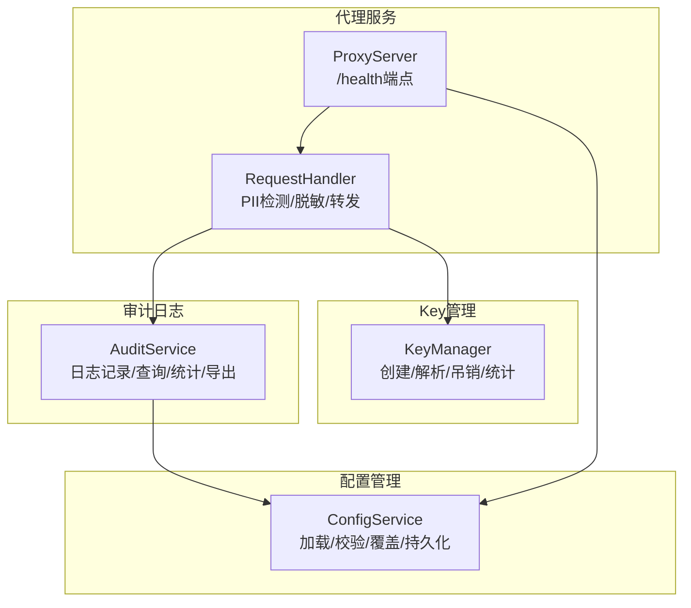
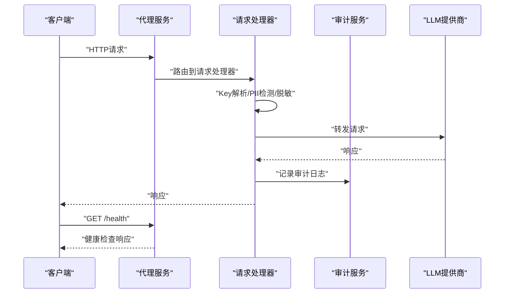
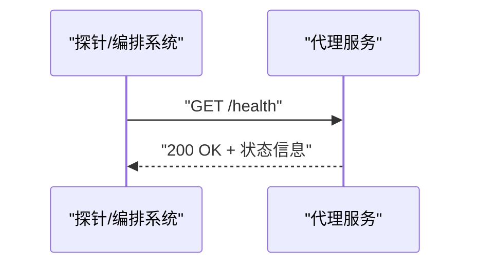
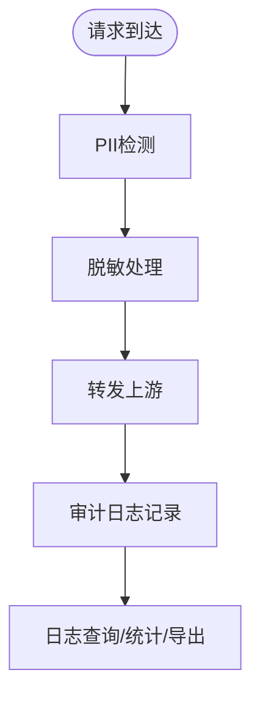
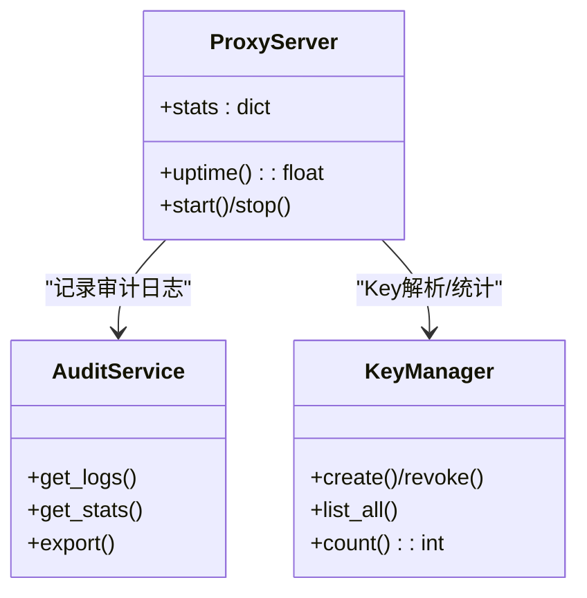
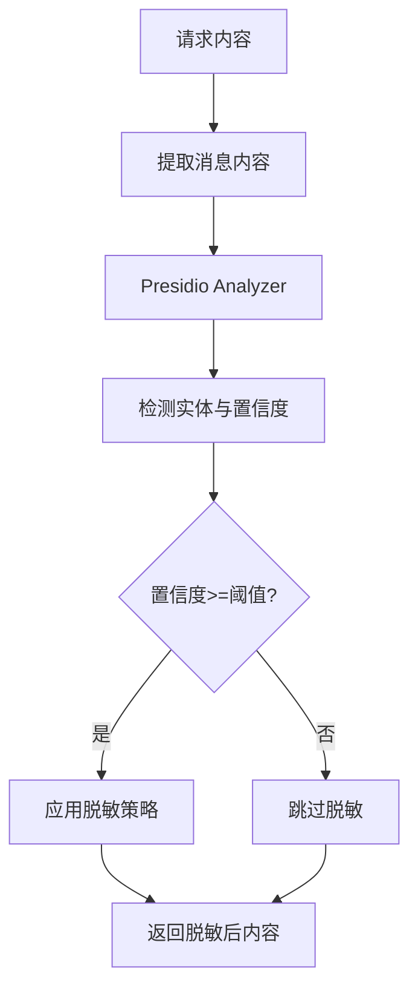
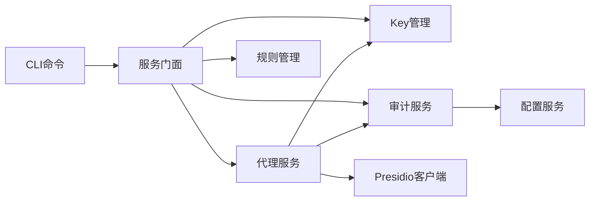

# 监控与告警

<cite>
**本文引用的文件**   
- [设计更新v1.0-初始化.md](file://doc/design/design-update-20260404-v1.0-init.md)
- [代理服务-黑盒测试用例.md](file://doc/test/tcs/v1.0/02_proxy_service.md)
- [审计日志-黑盒测试用例.md](file://doc/test/tcs/v1.0/06_audit_logging.md)
- [审计日志测试数据.md](file://doc/test/tcs/v1.0/06_audit_logging_testdata.md)
- [PII检测-黑盒测试用例.md](file://doc/test/tcs/v1.0/04_pii_detection.md)
- [Key管理-黑盒测试用例.md](file://doc/test/tcs/v1.0/03_key_management.md)
- [配置管理-黑盒测试用例.md](file://doc/test/tcs/v1.0/07_configuration.md)
- [CLI命令-黑盒测试用例.md](file://doc/test/tcs/v1.0/01_cli_commands.md)
</cite>

## 目录
1. [简介](#简介)
2. [项目结构](#项目结构)
3. [核心组件](#核心组件)
4. [架构总览](#架构总览)
5. [详细组件分析](#详细组件分析)
6. [依赖分析](#依赖分析)
7. [性能考虑](#性能考虑)
8. [故障排查指南](#故障排查指南)
9. [结论](#结论)
10. [附录](#附录)

## 简介
本文件面向运维团队，提供LLM Privacy Gateway项目的监控与告警体系建设指导。内容涵盖关键性能指标监控（请求量、响应时间、错误率、PII检测成功率、Key使用统计）、审计日志采集与分析（格式、存储、查询）、系统健康检查端点使用、告警规则与渠道配置、Prometheus集成与Grafana仪表板建议，以及性能基准与容量规划建议。

## 项目结构
- 代理服务提供HTTP端点与健康检查，负责请求转发、PII检测与脱敏、审计日志记录与统计。
- 审计日志模块提供结构化JSON日志，支持查询、统计、导出与轮转。
- Key管理模块提供虚拟Key的创建、解析、吊销与使用统计。
- 配置管理模块提供配置加载、校验、环境变量覆盖与持久化。
- CLI命令提供启动/停止/状态查询、配置管理、Key管理、规则管理、日志管理等运维能力。

**图示来源**
- [设计更新v1.0-初始化.md:708-741](file://doc/design/design-update-20260404-v1.0-init.md#L708-L741)
- [代理服务-黑盒测试用例.md:777-802](file://doc/test/tcs/v1.0/02_proxy_service.md#L777-L802)

**章节来源**
- [设计更新v1.0-初始化.md:708-741](file://doc/design/design-update-20260404-v1.0-init.md#L708-L741)
- [代理服务-黑盒测试用例.md:777-802](file://doc/test/tcs/v1.0/02_proxy_service.md#L777-L802)

## 核心组件
- 代理服务器与健康检查：提供/health端点，返回服务状态、版本与运行时长等信息。
- 审计日志：记录请求/响应、PII检测、脱敏、耗时、错误等结构化JSON日志。
- Key使用统计：记录Key使用次数与最后使用时间，支持统计与查询。
- 配置与持久化：支持环境变量覆盖、命令行参数优先级、配置文件校验与持久化。

**章节来源**
- [代理服务-黑盒测试用例.md:777-802](file://doc/test/tcs/v1.0/02_proxy_service.md#L777-L802)
- [审计日志-黑盒测试用例.md:1-450](file://doc/test/tcs/v1.0/06_audit_logging.md#L1-L450)
- [Key管理-黑盒测试用例.md:408-437](file://doc/test/tcs/v1.0/03_key_management.md#L408-L437)
- [配置管理-黑盒测试用例.md:454-498](file://doc/test/tcs/v1.0/07_configuration.md#L454-L498)

## 架构总览
代理服务作为核心入口，接收请求后进行Key解析、PII检测与脱敏、转发至上游LLM提供商，并记录审计日志。健康检查端点无需认证即可访问，便于探活与编排系统使用。

**图示来源**
- [设计更新v1.0-初始化.md:708-741](file://doc/design/design-update-20260404-v1.0-init.md#L708-L741)
- [代理服务-黑盒测试用例.md:777-802](file://doc/test/tcs/v1.0/02_proxy_service.md#L777-L802)

## 详细组件分析

### 健康检查端点（/health）
- 端点：GET /health
- 响应：包含状态、版本、运行时长等信息
- 用途：容器编排、负载均衡探活、自动化巡检
- 性能：响应时间应小于100ms

**图示来源**
- [代理服务-黑盒测试用例.md:777-802](file://doc/test/tcs/v1.0/02_proxy_service.md#L777-L802)

**章节来源**
- [代理服务-黑盒测试用例.md:777-802](file://doc/test/tcs/v1.0/02_proxy_service.md#L777-L802)

### 审计日志采集与分析
- 日志格式：结构化JSON，包含时间戳、级别、请求ID、客户端IP、方法、路径、状态码、耗时、PII检测结果、脱敏操作、错误信息等。
- 存储位置：配置文件中定义日志文件路径，默认位于/var/log/lpg/audit.log。
- 查询方式：CLI提供日志查看、统计、导出与清理能力；支持按时间范围、日志级别、关键词组合查询。
- 性能：支持大量日志写入与查询，具备轮转与大小限制能力。

**图示来源**
- [审计日志-黑盒测试用例.md:1-450](file://doc/test/tcs/v1.0/06_audit_logging.md#L1-L450)
- [审计日志测试数据.md:266-493](file://doc/test/tcs/v1.0/06_audit_logging_testdata.md#L266-L493)

**章节来源**
- [审计日志-黑盒测试用例.md:1-450](file://doc/test/tcs/v1.0/06_audit_logging.md#L1-L450)
- [审计日志测试数据.md:266-493](file://doc/test/tcs/v1.0/06_audit_logging_testdata.md#L266-L493)
- [CLI命令-黑盒测试用例.md:591-665](file://doc/test/tcs/v1.0/01_cli_commands.md#L591-L665)

### 关键性能指标与监控
- 请求量：代理服务器统计总请求数、成功/失败请求数。
- 响应时间：平均延迟、P50/P95/P99延迟分布。
- 错误率：4xx/5xx错误占比、上游超时/连接失败比例。
- PII检测成功率：检测到的PII实体数量、各类型分布、置信度统计。
- Key使用统计：Key使用次数、最后使用时间、过期与吊销状态。

**图示来源**
- [设计更新v1.0-初始化.md:613-635](file://doc/design/design-update-20260404-v1.0-init.md#L613-L635)
- [代理服务-黑盒测试用例.md:833-862](file://doc/test/tcs/v1.0/02_proxy_service.md#L833-L862)
- [Key管理-黑盒测试用例.md:408-437](file://doc/test/tcs/v1.0/03_key_management.md#L408-L437)

**章节来源**
- [设计更新v1.0-初始化.md:613-635](file://doc/design/design-update-20260404-v1.0-init.md#L613-L635)
- [代理服务-黑盒测试用例.md:833-862](file://doc/test/tcs/v1.0/02_proxy_service.md#L833-L862)
- [Key管理-黑盒测试用例.md:408-437](file://doc/test/tcs/v1.0/03_key_management.md#L408-L437)

### PII检测与脱敏统计
- 检测实体类型分布：邮箱、电话、身份证、银行卡、地址、姓名等。
- 脱敏策略分布：mask、replace、hash、redact等。
- 置信度阈值与边界：支持配置阈值，影响检测召回与误报。
- 流式响应处理：支持流式请求的PII检测与脱敏。

**图示来源**
- [PII检测-黑盒测试用例.md:408-467](file://doc/test/tcs/v1.0/04_pii_detection.md#L408-L467)

**章节来源**
- [PII检测-黑盒测试用例.md:408-467](file://doc/test/tcs/v1.0/04_pii_detection.md#L408-L467)
- [审计日志测试数据.md:580-597](file://doc/test/tcs/v1.0/06_audit_logging_testdata.md#L580-L597)

### 告警规则与渠道配置
- 阈值设定建议
  - 错误率：5xx错误率>2%、429限流率>5%、上游超时率>3%
  - 响应时间：P95/P99延迟>30s、平均延迟>5s
  - 请求量：突发下降>50%（可能上游不可用）
  - Key使用：Key吊销/过期预警提前7天
- 告警级别
  - P1：服务不可用/严重错误（邮件+Slack+Webhook）
  - P2：性能退化/错误率上升（Slack+Webhook）
  - P3：一般告警（仅记录）
- 告警渠道
  - 邮件：紧急通知
  - Slack：即时沟通
  - Webhook：接入运维平台或工单系统
- 告警抑制与静默
  - 维护窗口内静默
  - 同类告警合并上报

[本节为概念性指导，不直接分析具体文件]

### Prometheus监控集成与Grafana仪表板
- 指标导出
  - 使用/health端点返回的运行时长、版本等信息作为存活与版本指标
  - 通过审计日志统计与Key使用统计构建业务指标（可通过日志分析或中间件埋点）
- 建议指标
  - http_requests_total{method, endpoint, status}
  - http_request_duration_seconds{method, endpoint}
  - pii_detection_total{type}
  - key_usage_total{key_id}
  - key_expiration_days_left{key_id}
- Grafana仪表板建议
  - 实时请求量与错误率
  - 延迟分布（P50/P95/P99）
  - PII检测与脱敏趋势
  - Key使用与到期预警
  - 健康检查状态与探活成功率

[本节为概念性指导，不直接分析具体文件]

## 依赖分析
- 代理服务依赖配置服务、Key管理、规则管理、Presidio客户端与审计服务。
- 审计服务依赖日志存储（文件）与配置。
- CLI命令通过服务门面访问核心服务，保证扩展性。

**图示来源**
- [设计更新v1.0-初始化.md:415-568](file://doc/design/design-update-20260404-v1.0-init.md#L415-L568)

**章节来源**
- [设计更新v1.0-初始化.md:415-568](file://doc/design/design-update-20260404-v1.0-init.md#L415-L568)

## 性能考虑
- 并发与连接数：代理服务支持并发请求与最大连接数限制，建议结合负载均衡与限流策略。
- 超时与重试：合理设置代理超时与上游超时，避免雪崩效应。
- 日志性能：大量日志写入与查询需关注磁盘IO与索引优化，建议启用轮转与大小限制。
- PII处理：Presidio分析与匿名化为CPU密集型，建议评估并发与资源配额。

[本节为通用指导，不直接分析具体文件]

## 故障排查指南
- 健康检查失败
  - 检查/health端点响应状态与响应体
  - 确认服务进程运行与端口占用
- 请求失败
  - 检查4xx/5xx错误码与错误响应
  - 核对上游提供商状态与认证信息
- 日志异常
  - 检查日志文件路径与权限
  - 使用CLI查看日志与统计，定位问题
- Key相关问题
  - 检查Key状态（有效/吊销/过期）
  - 核对Key映射与提供商配置

**章节来源**
- [代理服务-黑盒测试用例.md:516-630](file://doc/test/tcs/v1.0/02_proxy_service.md#L516-L630)
- [审计日志-黑盒测试用例.md:288-410](file://doc/test/tcs/v1.0/06_audit_logging.md#L288-L410)
- [Key管理-黑盒测试用例.md:361-405](file://doc/test/tcs/v1.0/03_key_management.md#L361-L405)
- [CLI命令-黑盒测试用例.md:591-665](file://doc/test/tcs/v1.0/01_cli_commands.md#L591-L665)

## 结论
通过/health端点、结构化审计日志、Key使用统计与配置管理，LLM Privacy Gateway具备完善的可观测性基础。建议结合Prometheus/Grafana实现指标可视化与自动化告警，配合日志查询与导出能力，形成覆盖请求链路、PII处理与Key治理的完整监控体系。

## 附录
- 配置文件示例与提供商配置：参考配置管理测试用例中的样例文件。
- CLI命令清单：启动/停止/状态、配置、Key、规则、日志等命令。

**章节来源**
- [配置管理-黑盒测试用例.md:533-591](file://doc/test/tcs/v1.0/07_configuration.md#L533-L591)
- [CLI命令-黑盒测试用例.md:35-702](file://doc/test/tcs/v1.0/01_cli_commands.md#L35-L702)