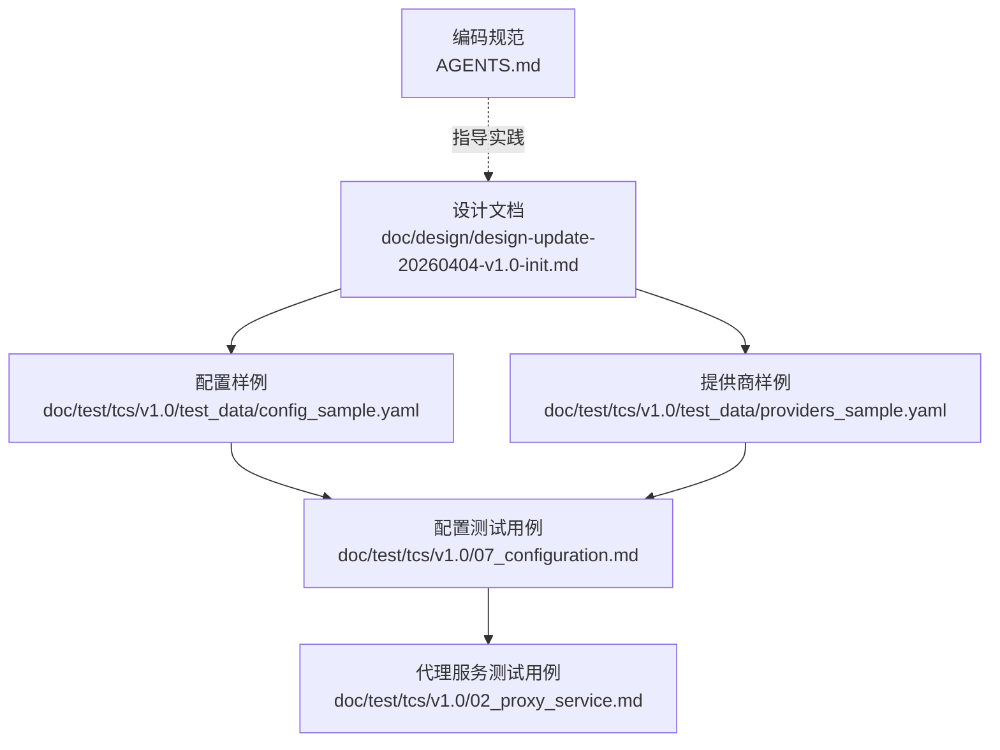
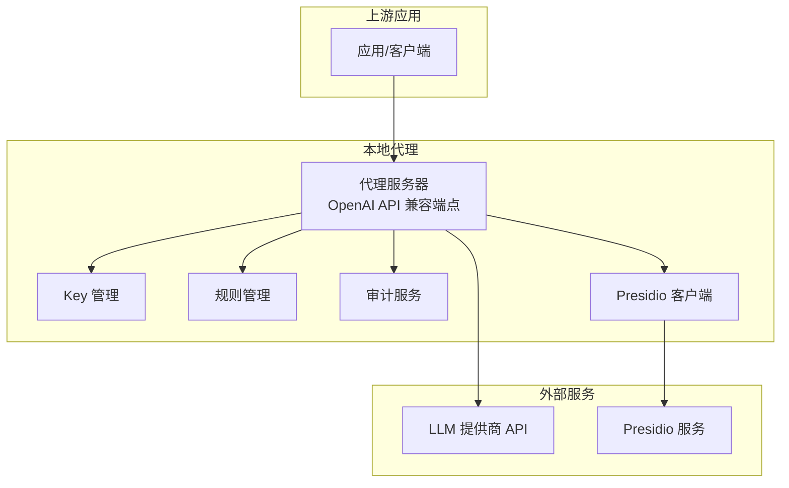
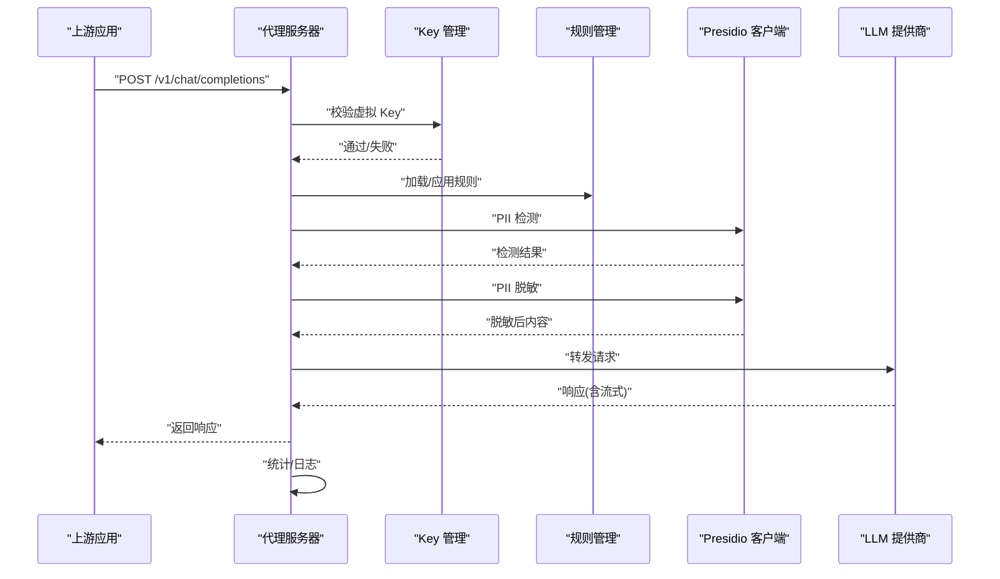
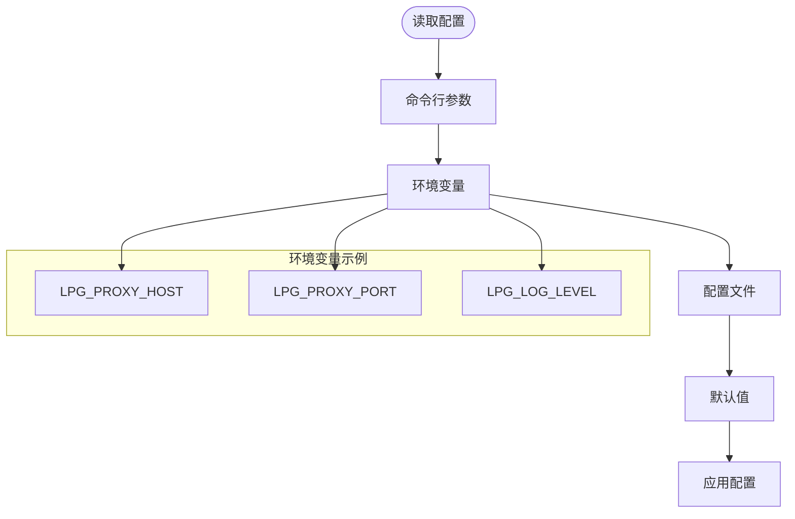
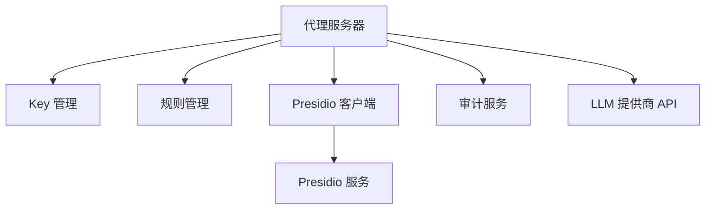

# 部署与运维

<cite>
**本文引用的文件**
- [设计文档](file://doc/design/design-update-20260404-v1.0-init.md)
- [配置样例](file://doc/test/tcs/v1.0/test_data/config_sample.yaml)
- [提供商样例](file://doc/test/tcs/v1.0/test_data/providers_sample.yaml)
- [配置测试用例](file://doc/test/tcs/v1.0/07_configuration.md)
- [代理服务测试用例](file://doc/test/tcs/v1.0/02_proxy_service.md)
- [编码规范](file://AGENTS.md)
- [Plane Docker Compose](file://doc/test/issues_management_platform/plane/docker-compose.yml)
</cite>

## 目录
1. [简介](#简介)
2. [项目结构](#项目结构)
3. [核心组件](#核心组件)
4. [架构总览](#架构总览)
5. [详细组件分析](#详细组件分析)
6. [依赖分析](#依赖分析)
7. [性能考量](#性能考量)
8. [故障排除指南](#故障排除指南)
9. [结论](#结论)
10. [附录](#附录)

## 简介
本文件面向运维与系统管理员，提供 LLM Privacy Gateway 的生产环境部署与运维指南。内容涵盖系统要求、依赖安装、配置设置、监控告警、故障排除、备份恢复、扩容与负载均衡、安全加固、版本升级与回滚等，帮助您在生产环境中稳定运行该隐私保护代理。

## 项目结构
- 顶层包含设计文档、测试用例与配置样例，用于理解架构、验证功能与指导部署。
- 关键目录与文件：
  - 设计文档：描述整体架构、模块职责与数据流。
  - 配置样例与提供商样例：提供生产部署所需的配置模板。
  - 配置与代理服务测试用例：覆盖启动、停止、转发、流式响应、错误处理、并发与健康检查等运维关键场景。
  - 编码规范：为开发与运维人员提供一致的实践标准。

**图表来源**
- [设计文档](file://doc/design/design-update-20260404-v1.0-init.md)
- [配置样例](file://doc/test/tcs/v1.0/test_data/config_sample.yaml)
- [提供商样例](file://doc/test/tcs/v1.0/test_data/providers_sample.yaml)
- [配置测试用例](file://doc/test/tcs/v1.0/07_configuration.md)
- [代理服务测试用例](file://doc/test/tcs/v1.0/02_proxy_service.md)
- [编码规范](file://AGENTS.md)

**章节来源**
- [设计文档](file://doc/design/design-update-20260404-v1.0-init.md)
- [配置样例](file://doc/test/tcs/v1.0/test_data/config_sample.yaml)
- [提供商样例](file://doc/test/tcs/v1.0/test_data/providers_sample.yaml)
- [配置测试用例](file://doc/test/tcs/v1.0/07_configuration.md)
- [代理服务测试用例](file://doc/test/tcs/v1.0/02_proxy_service.md)
- [编码规范](file://AGENTS.md)

## 核心组件
- CLI 应用与命令体系：提供启动、停止、状态查询、配置管理、Key 管理、规则管理、提供商管理与日志查看等运维命令。
- 服务门面：统一对外暴露服务，隐藏内部依赖关系，便于扩展。
- 代理服务器：基于异步 HTTP 框架，支持 OpenAI API 兼容端点与通用转发，内置健康检查与统计信息。
- Key 管理：虚拟 Key 生成、映射、验证与吊销。
- 规则管理：规则加载、启用/禁用、导入与测试。
- 审计日志：请求处理记录，支持查询、统计与导出。
- Presidio 集成：PII 检测与脱敏，支持配置驱动与错误处理。

**章节来源**
- [设计文档](file://doc/design/design-update-20260404-v1.0-init.md)
- [编码规范](file://AGENTS.md)

## 架构总览
下图展示生产环境中的典型部署形态：代理服务作为本地隐私保护代理，接收上游应用请求，进行 Key 验证、PII 检测与脱敏、转发至 LLM 提供商，并记录审计日志。

**图表来源**
- [设计文档](file://doc/design/design-update-20260404-v1.0-init.md)

## 详细组件分析

### 代理服务器与请求处理流程
- 启动/停止：支持前台与后台模式，健康检查端点用于存活探测。
- 请求处理：Key 验证 → Presidio 检测 → 脱敏 → 转发 → 响应处理（含流式） → 审计日志。
- 统计信息：总请求数、成功/失败数、平均延迟、PII 检测数、运行时长等。

**图表来源**
- [设计文档](file://doc/design/design-update-20260404-v1.0-init.md)

**章节来源**
- [代理服务测试用例](file://doc/test/tcs/v1.0/02_proxy_service.md)
- [设计文档](file://doc/design/design-update-20260404-v1.0-init.md)

### 配置系统与环境变量优先级
- 配置来源优先级：命令行参数 > 环境变量 > 配置文件。
- 支持交互式与非交互式初始化，覆盖、强制覆盖、默认值与格式校验。
- 提供商配置支持增删改查与格式校验。

**图表来源**
- [配置测试用例](file://doc/test/tcs/v1.0/07_configuration.md)
- [配置样例](file://doc/test/tcs/v1.0/test_data/config_sample.yaml)
- [提供商样例](file://doc/test/tcs/v1.0/test_data/providers_sample.yaml)

**章节来源**
- [配置测试用例](file://doc/test/tcs/v1.0/07_configuration.md)
- [配置样例](file://doc/test/tcs/v1.0/test_data/config_sample.yaml)
- [提供商样例](file://doc/test/tcs/v1.0/test_data/providers_sample.yaml)

### Key 管理与提供商配置
- Key 生命周期：创建、查询、吊销、详情查看。
- 提供商管理：新增、删除、更新、列表与连通性测试。

**章节来源**
- [设计文档](file://doc/design/design-update-20260404-v1.0-init.md)
- [配置测试用例](file://doc/test/tcs/v1.0/07_configuration.md)

### 审计日志与导出
- 支持日志查询、统计与导出，便于合规与审计追踪。

**章节来源**
- [设计文档](file://doc/design/design-update-20260404-v1.0-init.md)

## 依赖分析
- 外部服务依赖：
  - Presidio 服务：用于 PII 检测与脱敏。
  - LLM 提供商 API：如 OpenAI、Azure OpenAI、Anthropic 等。
- 内部组件依赖：
  - 代理服务器依赖 Key 管理、规则管理、Presidio 客户端与审计服务。
  - 服务门面统一聚合各服务，降低耦合。

**图表来源**
- [设计文档](file://doc/design/design-update-20260404-v1.0-init.md)

**章节来源**
- [设计文档](file://doc/design/design-update-20260404-v1.0-init.md)

## 性能考量
- 异步 I/O：代理服务器采用异步框架，适合高并发与流式响应。
- 超时与连接限制：通过配置项控制请求超时与最大连接数，避免资源耗尽。
- 统计指标：请求数、成功率、失败率、平均延迟、PII 检测数、运行时长等可用于性能监控。
- 建议：
  - 合理设置超时与最大连接数，结合压测确定最优参数。
  - 对流式响应进行超时控制，防止长时间占用连接。
  - 监控 CPU、内存、网络与磁盘 IO，结合日志定位瓶颈。

[本节为通用性能建议，无需特定文件引用]

## 故障排除指南

### 常见问题与排查步骤
- 服务无法启动
  - 检查端口占用与权限；确认配置文件路径与权限。
  - 查看启动日志，关注端口绑定、配置加载与依赖连接。
- 请求转发失败
  - 检查提供商配置、API Key 有效性与网络连通性。
  - 关注代理服务器错误响应与审计日志。
- 流式响应中断或超时
  - 调整流式超时配置，检查上游服务稳定性。
- 并发与连接数问题
  - 检查最大连接数与队列配置，评估硬件资源与网络带宽。

### 日志分析与定位
- 日志级别：根据问题严重程度选择 debug/info/warn/error。
- 关键字段：时间戳、请求 ID、源应用、提供商、端点、状态码、耗时、错误信息。
- 审计日志：用于复现请求链路与定位异常节点。

### 性能诊断
- 指标采集：请求数、成功率、失败率、平均/95 分位延迟、PII 检测数。
- 压测：模拟峰值流量，观察代理服务器与下游服务表现。
- 资源监控：CPU、内存、网络、磁盘 IO，结合日志交叉验证。

**章节来源**
- [代理服务测试用例](file://doc/test/tcs/v1.0/02_proxy_service.md)
- [配置测试用例](file://doc/test/tcs/v1.0/07_configuration.md)
- [编码规范](file://AGENTS.md)

## 结论
通过遵循本文档的部署与运维实践，结合配置优先级、健康检查、审计日志与性能监控，可在生产环境中稳定运行 LLM Privacy Gateway。建议在上线前完成压测与演练，制定变更与回滚预案，确保系统可用性与安全性。

[本节为总结性内容，无需特定文件引用]

## 附录

### A. 生产环境部署清单
- 系统要求
  - 操作系统：Linux/macOS（参考测试环境）。
  - Python 版本：3.9+（参考测试环境）。
- 依赖安装
  - 安装 Python 依赖（参考测试用例中的依赖文件）。
  - 准备 Presidio 服务与 LLM 提供商 API 访问权限。
- 配置设置
  - 使用配置样例初始化配置，设置代理监听地址、端口、日志级别与文件路径。
  - 配置提供商信息（类型、API Key、Base URL、超时等）。
  - 环境变量覆盖（如需），注意优先级高于配置文件。
- 启动与验证
  - 启动代理服务，访问 /health 端点确认健康状态。
  - 执行基本请求测试，验证转发与脱敏流程。
- 监控与告警
  - 配置日志轮转与集中化收集。
  - 建立关键指标告警（错误率、延迟、连接数、磁盘空间等）。

**章节来源**
- [配置样例](file://doc/test/tcs/v1.0/test_data/config_sample.yaml)
- [提供商样例](file://doc/test/tcs/v1.0/test_data/providers_sample.yaml)
- [配置测试用例](file://doc/test/tcs/v1.0/07_configuration.md)
- [代理服务测试用例](file://doc/test/tcs/v1.0/02_proxy_service.md)

### B. 备份与恢复策略
- 配置备份
  - 定期备份配置文件与提供商密钥。
  - 使用版本控制管理配置变更历史。
- 日志备份
  - 配置日志轮转与归档，保留合规周期内的审计日志。
- 恢复流程
  - 从最近备份恢复配置与密钥。
  - 验证代理服务健康状态与关键指标。
  - 逐步放量验证业务流量。

**章节来源**
- [配置测试用例](file://doc/test/tcs/v1.0/07_configuration.md)
- [设计文档](file://doc/design/design-update-20260404-v1.0-init.md)

### C. 扩容与负载均衡
- 横向扩展
  - 多实例部署，结合反向代理或负载均衡器分发流量。
  - 各实例共享配置中心或持久化存储（如需共享 Key/规则）。
- 负载均衡
  - 健康检查端点用于探活。
  - 根据延迟与错误率动态调度。
- 注意事项
  - 保证会话无状态或实现会话亲和。
  - 统一日志与审计，便于跨实例排查。

**章节来源**
- [代理服务测试用例](file://doc/test/tcs/v1.0/02_proxy_service.md)
- [设计文档](file://doc/design/design-update-20260404-v1.0-init.md)

### D. 安全加固建议
- 最小权限原则：代理服务以非特权用户运行，限制文件与网络权限。
- 配置与密钥保护：配置文件权限 600，API Key 通过环境变量注入。
- 网络隔离：将代理服务置于内网或受限网络，必要时启用防火墙策略。
- 审计与合规：开启审计日志，定期审查访问与异常行为。
- 更新与补丁：定期更新依赖与系统组件，关注安全公告。

**章节来源**
- [编码规范](file://AGENTS.md)
- [配置测试用例](file://doc/test/tcs/v1.0/07_configuration.md)

### E. 版本升级与回滚
- 升级流程
  - 制定升级窗口，提前备份配置与日志。
  - 在预生产环境验证升级包与配置兼容性。
  - 逐步替换实例，观察健康检查与关键指标。
- 回滚策略
  - 保留上一版本二进制与配置快照。
  - 回滚时优先恢复配置，再重启服务。
  - 回滚后持续监控，确认业务恢复正常。

**章节来源**
- [配置测试用例](file://doc/test/tcs/v1.0/07_configuration.md)

### F. 监控与告警配置要点
- 关键指标
  - 代理服务：请求数、成功率、失败率、平均/95 分位延迟、运行时长、连接数。
  - PII：检测数、脱敏命中率。
  - 系统：CPU、内存、磁盘空间、网络吞吐。
- 告警策略
  - 错误率与延迟阈值告警。
  - 连接数接近上限与磁盘空间不足告警。
  - 审计日志异常与配置变更告警。

**章节来源**
- [代理服务测试用例](file://doc/test/tcs/v1.0/02_proxy_service.md)
- [设计文档](file://doc/design/design-update-20260404-v1.0-init.md)

### G. 参考部署示例（容器化）
- 可参考 Plane 项目的 Docker Compose 示例，学习容器编排、环境变量注入与持久化卷配置思路，结合本项目需求进行适配。

**章节来源**
- [Plane Docker Compose](file://doc/test/issues_management_platform/plane/docker-compose.yml)