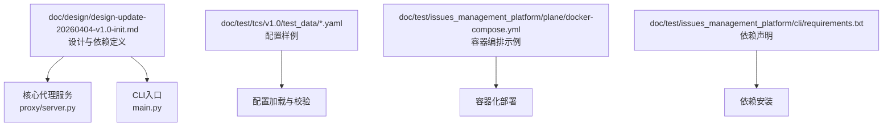
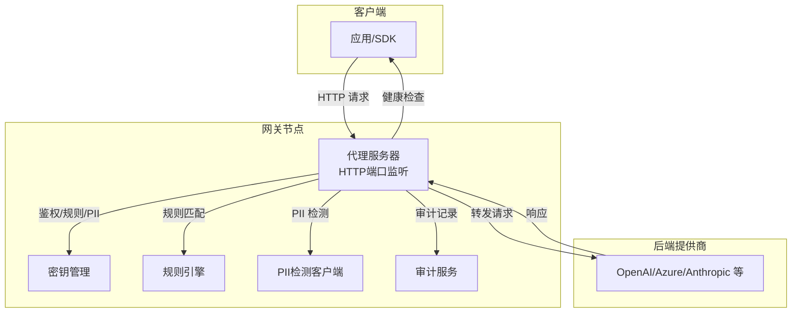
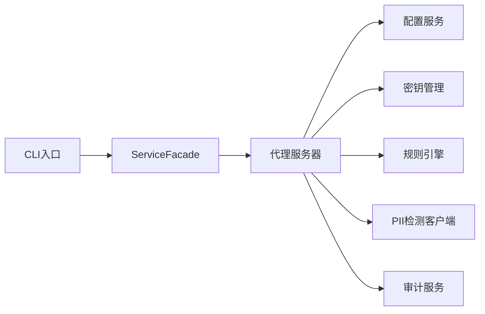

# 部署指南

<cite>
**本文引用的文件**
- [design-update-20260404-v1.0-init.md](file://doc/design/design-update-20260404-v1.0-init.md)
- [config_sample.yaml](file://doc/test/tcs/v1.0/test_data/config_sample.yaml)
- [providers_sample.yaml](file://doc/test/tcs/v1.0/test_data/providers_sample.yaml)
- [config_env_override.yaml](file://doc/test/tcs/v1.0/test_data/config_env_override.yaml)
- [config_invalid.yaml](file://doc/test/tcs/v1.0/test_data/config_invalid.yaml)
- [docker-compose.yml](file://doc/test/issues_management_platform/plane/docker-compose.yml)
- [requirements.txt](file://doc/test/issues_management_platform/cli/requirements.txt)
</cite>

## 目录
1. [简介](#简介)
2. [项目结构](#项目结构)
3. [核心组件](#核心组件)
4. [架构总览](#架构总览)
5. [详细组件分析](#详细组件分析)
6. [依赖分析](#依赖分析)
7. [性能考虑](#性能考虑)
8. [故障排查指南](#故障排查指南)
9. [结论](#结论)
10. [附录](#附录)

## 简介
本指南面向系统管理员与DevOps工程师，提供LLM Privacy Gateway在生产环境中的完整部署方案。内容涵盖系统要求、依赖安装、配置文件准备、多环境部署方式（Docker容器、裸机、Kubernetes）、服务启停与重启标准流程、端口与网络配置、防火墙规则、部署验证方法以及常见问题排查。

## 项目结构
仓库中与部署相关的关键位置与文件如下：
- 设计与依赖定义：doc/design/design-update-20260404-v1.0-init.md
- 配置样例：doc/test/tcs/v1.0/test_data/config_sample.yaml、providers_sample.yaml、config_env_override.yaml、config_invalid.yaml
- 容器编排参考：doc/test/issues_management_platform/plane/docker-compose.yml
- 依赖声明：doc/test/issues_management_platform/cli/requirements.txt

图表来源
- [design-update-20260404-v1.0-init.md](file://doc/design/design-update-20260404-v1.0-init.md)
- [config_sample.yaml](file://doc/test/tcs/v1.0/test_data/config_sample.yaml)
- [providers_sample.yaml](file://doc/test/tcs/v1.0/test_data/providers_sample.yaml)
- [docker-compose.yml](file://doc/test/issues_management_platform/plane/docker-compose.yml)
- [requirements.txt](file://doc/test/issues_management_platform/cli/requirements.txt)

章节来源
- [design-update-20260404-v1.0-init.md](file://doc/design/design-update-20260404-v1.0-init.md)
- [config_sample.yaml](file://doc/test/tcs/v1.0/test_data/config_sample.yaml)
- [providers_sample.yaml](file://doc/test/tcs/v1.0/test_data/providers_sample.yaml)
- [config_env_override.yaml](file://doc/test/tcs/v1.0/test_data/config_env_override.yaml)
- [config_invalid.yaml](file://doc/test/tcs/v1.0/test_data/config_invalid.yaml)
- [docker-compose.yml](file://doc/test/issues_management_platform/plane/docker-compose.yml)
- [requirements.txt](file://doc/test/issues_management_platform/cli/requirements.txt)

## 核心组件
- 代理服务器：基于aiohttp实现HTTP代理，支持OpenAI兼容端点与通用转发，并提供健康检查端点。
- CLI命令行：通过Click提供统一入口，支持启动、停止、状态查询、配置管理、密钥管理、规则管理、提供商配置与日志查看。
- 配置系统：支持YAML配置文件、默认路径、环境变量覆盖与严格类型校验；提供交互式初始化与列表展示。
- 审计与日志：可配置审计日志文件路径与级别，支持请求处理记录与统计。

章节来源
- [design-update-20260404-v1.0-init.md](file://doc/design/design-update-20260404-v1.0-init.md)

## 架构总览
下图展示了生产部署中的典型拓扑：客户端通过网关访问后端LLM提供商，网关负责鉴权、规则过滤、PII检测与审计记录。

图表来源
- [design-update-20260404-v1.0-init.md](file://doc/design/design-update-20260404-v1.0-init.md)

## 详细组件分析

### 1) 系统要求与依赖安装
- Python版本：设计文档中明确要求Python版本“>=3.10”。请确保生产主机满足该版本要求。
- 关键依赖（来自依赖清单）：aiohttp、click、pyyaml、pydantic、rich、cryptography、loguru。
- 可选开发依赖：pytest、black、ruff、mypy等，用于开发与质量保障。
- 示例依赖声明文件：doc/test/issues_management_platform/cli/requirements.txt（用于其他组件的依赖示例，实际项目依赖以设计文档为准）。

章节来源
- [design-update-20260404-v1.0-init.md](file://doc/design/design-update-20260404-v1.0-init.md)
- [requirements.txt](file://doc/test/issues_management_platform/cli/requirements.txt)

### 2) 配置文件准备
- 默认配置文件路径：首次运行可通过交互式初始化生成于用户主目录下的默认路径（具体路径以实现为准）。
- 配置项示例（节选）：proxy.host、proxy.port、proxy.timeout、proxy.max_connections、log.level、log.file、providers.*、rules.enabled、rules.path、audit.enabled、audit.log_file。
- 提供商配置示例：包含openai、azure_openai、anthropic等类型及对应字段。
- 环境变量覆盖：支持通过环境变量对部分配置进行覆盖。
- 无效配置样例：用于验证错误处理与边界条件。

章节来源
- [config_sample.yaml](file://doc/test/tcs/v1.0/test_data/config_sample.yaml)
- [providers_sample.yaml](file://doc/test/tcs/v1.0/test_data/providers_sample.yaml)
- [config_env_override.yaml](file://doc/test/tcs/v1.0/test_data/config_env_override.yaml)
- [config_invalid.yaml](file://doc/test/tcs/v1.0/test_data/config_invalid.yaml)

### 3) 多环境部署方式

#### Docker容器部署
- 使用容器编排示例文件作为参考，按需调整镜像、端口映射、环境变量与卷挂载。
- 建议将配置文件与审计日志目录映射到宿主机，便于维护与备份。
- 健康检查端点可用于容器编排的存活探针与就绪探针。

章节来源
- [docker-compose.yml](file://doc/test/issues_management_platform/plane/docker-compose.yml)
- [design-update-20260404-v1.0-init.md](file://doc/design/design-update-20260404-v1.0-init.md)

#### 裸机部署
- 安装Python 3.10+与依赖。
- 准备配置文件与提供商凭据，确保日志与审计目录可写。
- 使用CLI命令启动服务，并根据需要启用守护进程模式。
- 建议结合系统服务管理器（如systemd）实现开机自启与自动重启。

章节来源
- [design-update-20260404-v1.0-init.md](file://doc/design/design-update-20260404-v1.0-init.md)

#### Kubernetes集群部署
- 基于Docker镜像创建Deployment与Service，暴露HTTP端口。
- 使用ConfigMap管理配置文件，使用Secret管理敏感信息（如提供商API Key）。
- 将审计日志目录挂载为持久化存储（如HostPath或PV/PVC），确保日志可采集与归档。
- 配置健康检查探针指向健康检查端点。

章节来源
- [design-update-20260404-v1.0-init.md](file://doc/design/design-update-20260404-v1.0-init.md)

### 4) 服务启停与重启标准流程
- 启动：通过CLI命令启动服务，支持指定主机、端口、日志级别与日志文件。
- 停止：优雅关闭代理服务器，释放资源。
- 重启：先停止再启动，或使用系统服务管理器的restart命令。
- 守护进程：支持以守护进程模式运行，便于系统集成。

章节来源
- [design-update-20260404-v1.0-init.md](file://doc/design/design-update-20260404-v1.0-init.md)

### 5) 端口配置、网络设置与防火墙规则
- 网络监听：代理服务器默认监听HTTP端口（示例为8080），可通过配置文件host与port调整。
- 端口开放：确保防火墙放行代理端口；若使用反向代理（Nginx/Traefik），需正确转发至代理端口。
- 健康检查：提供健康检查端点，便于负载均衡与编排平台探测。

章节来源
- [config_sample.yaml](file://doc/test/tcs/v1.0/test_data/config_sample.yaml)
- [design-update-20260404-v1.0-init.md](file://doc/design/design-update-20260404-v1.0-init.md)

### 6) 部署验证方法
- 健康检查：调用健康检查端点确认服务可用。
- 功能连通：发送一条兼容的聊天补全请求，验证转发链路与提供商连通性。
- 日志审计：检查日志与审计文件是否正常写入，确认PII检测与规则生效。

章节来源
- [design-update-20260404-v1.0-init.md](file://doc/design/design-update-20260404-v1.0-init.md)

## 依赖分析
- 组件耦合：代理服务器依赖配置、密钥、规则、PII检测与审计服务；CLI通过ServiceFacade统一调度。
- 外部依赖：aiohttp用于HTTP服务，click用于CLI，pydantic用于配置模型校验，loguru用于日志，pyyaml用于配置解析。
- 可能的循环依赖：当前设计通过Facade与模块职责分离避免循环依赖。

图表来源
- [design-update-20260404-v1.0-init.md](file://doc/design/design-update-20260404-v1.0-init.md)

章节来源
- [design-update-20260404-v1.0-init.md](file://doc/design/design-update-20260404-v1.0-init.md)

## 性能考虑
- 异步并发：基于aiohttp的异步I/O适合高并发请求场景，建议合理设置超时与最大连接数。
- 日志级别：生产环境建议使用info或更高级别，避免过多I/O开销。
- 审计成本：审计日志写入可能带来磁盘与IO压力，建议配置合适的轮转策略与落盘频率。

## 故障排查指南
- 配置格式错误：当YAML语法不合法或包含制表符、重复键时，会触发解析异常。请使用提供的无效配置样例进行对照修正。
- 类型校验失败：端口、布尔值、数组等类型不匹配会导致校验错误。请核对配置文件类型与取值。
- 环境变量覆盖：若期望通过环境变量覆盖配置，请确认变量名与优先级符合预期。
- 端口占用：若启动失败提示端口被占用，请修改配置文件中的端口或释放占用端口。
- 权限问题：日志与审计目录需具备写权限；容器部署时注意卷挂载权限与SELinux/AppArmor限制。
- 健康检查失败：检查代理端口、防火墙与编排探针配置。

章节来源
- [config_invalid.yaml](file://doc/test/tcs/v1.0/test_data/config_invalid.yaml)
- [config_env_override.yaml](file://doc/test/tcs/v1.0/test_data/config_env_override.yaml)
- [design-update-20260404-v1.0-init.md](file://doc/design/design-update-20260404-v1.0-init.md)

## 结论
通过本指南，您可以在Docker、裸机与Kubernetes环境中完成LLM Privacy Gateway的生产部署。建议在部署前准备好配置文件与提供商凭据，规划好日志与审计目录，开启健康检查与监控，并在变更发布前进行充分验证。

## 附录

### A. 配置文件字段速查
- 代理：host、port、timeout、max_connections
- 日志：level、file
- 审计：enabled、log_file
- 规则：enabled、path
- 提供商：type、api_key、base_url、api_version（如适用）、timeout、enabled

章节来源
- [config_sample.yaml](file://doc/test/tcs/v1.0/test_data/config_sample.yaml)
- [providers_sample.yaml](file://doc/test/tcs/v1.0/test_data/providers_sample.yaml)