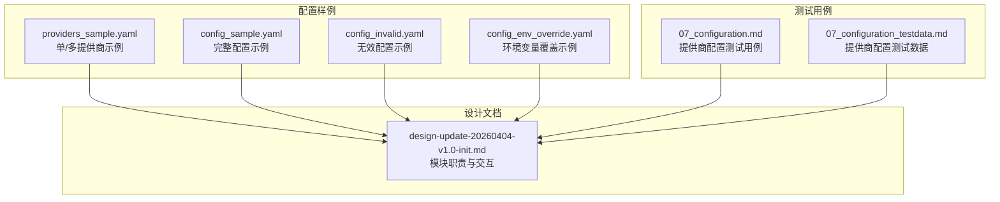
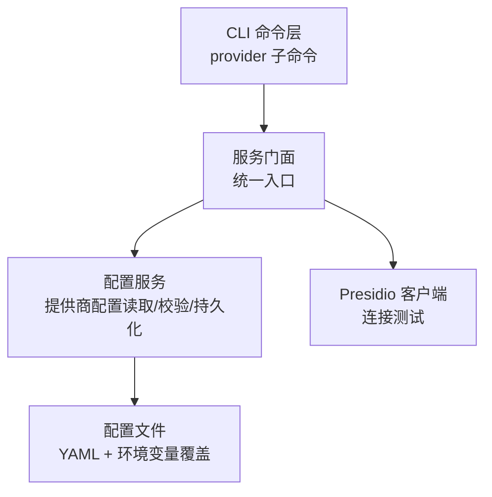
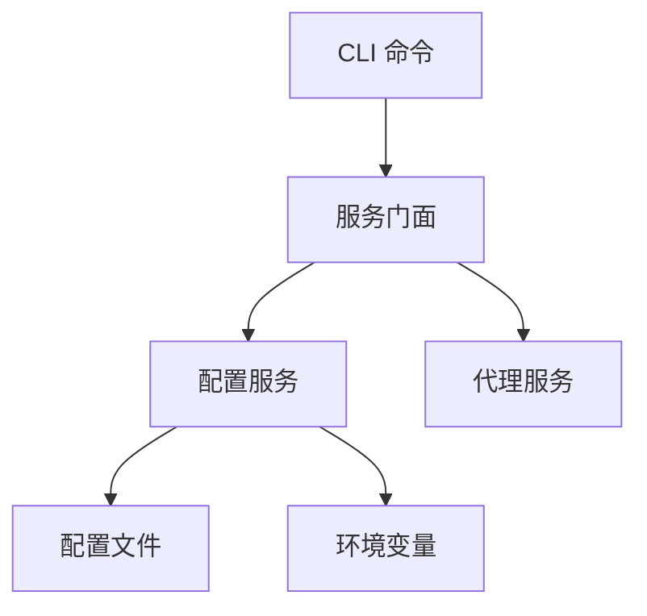

# 提供商配置管理

<cite>
**本文引用的文件**
- [design-update-20260404-v1.0-init.md](file://doc/design/design-update-20260404-v1.0-init.md)
- [providers_sample.yaml](file://doc/test/tcs/v1.0/test_data/providers_sample.yaml)
- [config_sample.yaml](file://doc/test/tcs/v1.0/test_data/config_sample.yaml)
- [config_invalid.yaml](file://doc/test/tcs/v1.0/test_data/config_invalid.yaml)
- [config_env_override.yaml](file://doc/test/tcs/v1.0/test_data/config_env_override.yaml)
- [07_configuration.md](file://doc/test/tcs/v1.0/07_configuration.md)
- [07_configuration_testdata.md](file://doc/test/tcs/v1.0/07_configuration_testdata.md)
- [plane_cli.py](file://doc/test/issues_management_platform/cli/plane_cli.py)
</cite>

## 目录
1. [简介](#简介)
2. [项目结构](#项目结构)
3. [核心组件](#核心组件)
4. [架构总览](#架构总览)
5. [详细组件分析](#详细组件分析)
6. [依赖分析](#依赖分析)
7. [性能考虑](#性能考虑)
8. [故障排除指南](#故障排除指南)
9. [结论](#结论)
10. [附录](#附录)

## 简介
本文件围绕 LLM Privacy Gateway 的“提供商配置管理”主题，系统化梳理提供商配置的数据结构、字段定义、增删改查操作、不同提供商类型的配置差异与特殊要求、验证规则与错误处理、多提供商配置的管理与切换机制，以及实际使用示例、最佳实践、故障排除与性能优化建议。文档基于仓库中提供的设计文档、配置样例与测试用例进行归纳总结，帮助开发者与运维人员快速理解并正确使用提供商配置。

## 项目结构
- 配置样例位于测试数据目录，涵盖单提供商与多提供商配置示例，以及环境变量覆盖示例与无效配置示例，便于对照学习与验证。
- 设计文档提供了 CLI 命令、服务门面、配置服务等模块的职责与交互关系，是理解提供商配置在系统中如何被读取、校验与使用的权威依据。
- 测试用例文档明确了提供商配置的增删改查、有效性与错误场景，是制定验证规则与排障流程的重要参考。

**图表来源**
- [providers_sample.yaml:1-25](file://doc/test/tcs/v1.0/test_data/providers_sample.yaml#L1-L25)
- [config_sample.yaml:1-27](file://doc/test/tcs/v1.0/test_data/config_sample.yaml#L1-L27)
- [config_invalid.yaml:1-29](file://doc/test/tcs/v1.0/test_data/config_invalid.yaml#L1-L29)
- [config_env_override.yaml:1-16](file://doc/test/tcs/v1.0/test_data/config_env_override.yaml#L1-L16)
- [design-update-20260404-v1.0-init.md:1-800](file://doc/design/design-update-20260404-v1.0-init.md#L1-L800)
- [07_configuration.md:565-594](file://doc/test/tcs/v1.0/07_configuration.md#L565-L594)
- [07_configuration_testdata.md:263-309](file://doc/test/tcs/v1.0/07_configuration_testdata.md#L263-L309)

**章节来源**
- [providers_sample.yaml:1-25](file://doc/test/tcs/v1.0/test_data/providers_sample.yaml#L1-L25)
- [config_sample.yaml:1-27](file://doc/test/tcs/v1.0/test_data/config_sample.yaml#L1-L27)
- [config_invalid.yaml:1-29](file://doc/test/tcs/v1.0/test_data/config_invalid.yaml#L1-L29)
- [config_env_override.yaml:1-16](file://doc/test/tcs/v1.0/test_data/config_env_override.yaml#L1-L16)
- [design-update-20260404-v1.0-init.md:1-800](file://doc/design/design-update-20260404-v1.0-init.md#L1-L800)
- [07_configuration.md:565-594](file://doc/test/tcs/v1.0/07_configuration.md#L565-L594)
- [07_configuration_testdata.md:263-309](file://doc/test/tcs/v1.0/07_configuration_testdata.md#L263-L309)

## 核心组件
- CLI 命令层：通过 provider 子命令实现提供商的增删改查与连接测试等操作，命令由 Click 定义并通过服务门面调用配置服务。
- 服务门面：统一对外暴露提供商管理能力，内部依赖配置服务获取/更新提供商配置。
- 配置服务：负责提供商配置的读取、校验、持久化与变更传播；提供提供商列表、新增、更新、删除、连接测试等能力。
- 配置文件：以 YAML 格式存储提供商配置，支持环境变量覆盖；包含基础字段与各提供商类型的特有字段。

关键职责与交互关系详见设计文档的模块设计与服务门面章节。

**章节来源**
- [design-update-20260404-v1.0-init.md:254-568](file://doc/design/design-update-20260404-v1.0-init.md#L254-L568)
- [07_configuration.md:565-594](file://doc/test/tcs/v1.0/07_configuration.md#L565-L594)

## 架构总览
下图展示了提供商配置在系统中的位置与流转：CLI 通过 provider 子命令发起操作，服务门面调用配置服务，配置服务读取/写入 YAML 配置文件，并对提供商配置进行校验与持久化。

**图表来源**
- [design-update-20260404-v1.0-init.md:411-568](file://doc/design/design-update-20260404-v1.0-init.md#L411-L568)
- [07_configuration.md:565-594](file://doc/test/tcs/v1.0/07_configuration.md#L565-L594)

## 详细组件分析

### 数据结构与字段定义
- 提供商配置的顶层键为 providers，其值为字典或列表（根据样例与测试用例），每个提供商包含以下通用字段：
  - name：提供商标识名，用于在虚拟 Key 与配置中引用。
  - type：提供商类型，如 openai、azure_openai、anthropic 等。
  - api_key：访问密钥。
  - base_url：提供商 API 基础地址。
  - timeout：请求超时秒数。
  - enabled：布尔值，指示该提供商是否启用。
  - 其他特有字段：例如 Azure OpenAI 的 api_version。
- 配置文件还包含 proxy、log、rules、audit 等顶层键，其中 proxy.host/port/timeout/max_connections 等为代理服务相关配置。

字段来源与示例参见以下文件：

**章节来源**
- [providers_sample.yaml:3-25](file://doc/test/tcs/v1.0/test_data/providers_sample.yaml#L3-L25)
- [config_sample.yaml:13-27](file://doc/test/tcs/v1.0/test_data/config_sample.yaml#L13-L27)
- [07_configuration_testdata.md:263-309](file://doc/test/tcs/v1.0/07_configuration_testdata.md#L263-L309)

### 添加、删除、修改与查询操作
- 列出提供商：支持纯文本与 JSON 格式输出，便于自动化集成。
- 新增提供商：通过 provider 子命令传入提供商类型、名称与必要字段，配置服务进行校验并持久化。
- 更新提供商：支持按字段增量更新，如更新 API Key 等。
- 删除提供商：通过 provider 子命令删除指定 name 的提供商配置。
- 连接测试：对指定提供商进行连通性测试，验证配置的有效性。

上述操作流程与期望结果来自测试用例文档。

**章节来源**
- [07_configuration.md:565-594](file://doc/test/tcs/v1.0/07_configuration.md#L565-L594)

### 不同提供商类型的配置差异与特殊要求
- 类型差异：不同 type 对应不同的必填字段与行为。例如 Azure OpenAI 需要额外的 api_version 字段。
- 字段校验：name、type、base_url 等字段具有严格的格式与取值范围约束，超出范围将触发验证错误。
- URL 与端点：base_url 必须为合法的 HTTPS/HTTP 地址，且符合各提供商的 API 规范。
- 超时与启用：timeout 与 enabled 字段影响请求行为与可用性。

以上差异与校验规则来自测试数据与用例文档。

**章节来源**
- [providers_sample.yaml:11-17](file://doc/test/tcs/v1.0/test_data/providers_sample.yaml#L11-L17)
- [07_configuration_testdata.md:263-309](file://doc/test/tcs/v1.0/07_configuration_testdata.md#L263-L309)

### 验证规则与错误处理
- 无效配置文件：当 YAML 语法错误或缺少闭合括号时，配置加载会失败，需修正后重试。
- 字段验证：name、type、base_url、format、max_files 等字段若不符合规范，将抛出验证错误。
- 错误处理：CLI 在请求失败时输出错误信息并返回相应状态码；配置服务在持久化失败时回滚或提示修复。

**章节来源**
- [config_invalid.yaml:27-29](file://doc/test/tcs/v1.0/test_data/config_invalid.yaml#L27-L29)
- [07_configuration_testdata.md:236-262](file://doc/test/tcs/v1.0/07_configuration_testdata.md#L236-L262)

### 多提供商配置的管理与切换机制
- 多提供商配置：配置文件可同时包含多个提供商，每个提供商独立配置。
- 切换机制：通过虚拟 Key 将请求路由至对应提供商；虚拟 Key 中绑定的 provider 名称决定最终使用的提供商配置。
- 最佳实践：为不同提供商设置独立的 API Key、base_url 与超时；启用必要的提供商以减少不必要的连接尝试。

**章节来源**
- [providers_sample.yaml:3-25](file://doc/test/tcs/v1.0/test_data/providers_sample.yaml#L3-L25)
- [design-update-20260404-v1.0-init.md:1129-1175](file://doc/design/design-update-20260404-v1.0-init.md#L1129-L1175)

### 实际使用示例与最佳实践
- 示例一：OpenAI 提供商配置（含 API Key、基础 URL、超时与启用状态）。
- 示例二：Azure OpenAI 提供商配置（含 api_version）。
- 示例三：Anthropic 提供商配置（含 API Key、基础 URL、超时与禁用状态）。
- 最佳实践：
  - 为每个提供商单独配置独立的 API Key；
  - 合理设置 timeout，避免长时间阻塞；
  - 对于生产环境，建议启用提供商并定期进行连接测试；
  - 使用环境变量覆盖敏感字段，避免明文写入配置文件。

**章节来源**
- [providers_sample.yaml:3-25](file://doc/test/tcs/v1.0/test_data/providers_sample.yaml#L3-L25)
- [config_env_override.yaml:11-16](file://doc/test/tcs/v1.0/test_data/config_env_override.yaml#L11-L16)

### 配置加载与环境变量覆盖
- 配置文件采用 YAML 格式，支持通过环境变量进行覆盖，便于在不同环境中灵活调整配置。
- 加载顺序：先加载默认配置，再应用环境变量覆盖，最后进行字段校验。

**章节来源**
- [config_env_override.yaml:1-16](file://doc/test/tcs/v1.0/test_data/config_env_override.yaml#L1-L16)
- [design-update-20260404-v1.0-init.md:411-568](file://doc/design/design-update-20260404-v1.0-init.md#L411-L568)

## 依赖分析
- CLI 依赖服务门面；服务门面依赖配置服务；配置服务依赖 YAML 配置文件与环境变量。
- 提供商配置直接影响虚拟 Key 的解析与转发，进而影响代理服务的可用性与稳定性。

**图表来源**
- [design-update-20260404-v1.0-init.md:411-568](file://doc/design/design-update-20260404-v1.0-init.md#L411-L568)

**章节来源**
- [design-update-20260404-v1.0-init.md:411-568](file://doc/design/design-update-20260404-v1.0-init.md#L411-L568)

## 性能考虑
- 合理设置 timeout：避免过长导致资源占用，过短导致频繁超时。
- 控制并发与连接数：结合代理服务的 max_connections 设置，避免对上游提供商造成过大压力。
- 启用必要的提供商：禁用不使用的提供商可减少不必要的连接与验证开销。
- 使用连接测试：定期对提供商进行连通性测试，及时发现网络或鉴权问题，降低运行时失败率。

[本节为通用指导，无需特定文件来源]

## 故障排除指南
- 配置加载失败：检查 YAML 语法与闭合括号，确保字段类型与取值范围符合要求。
- 连接测试失败：确认 API Key 正确、base_url 可达、网络策略允许访问、必要时检查 api_version（如 Azure OpenAI）。
- 虚拟 Key 解析失败：确认虚拟 Key 中绑定的 provider 名称与配置文件中的 name 一致。
- CLI 错误输出：关注 CLI 的错误提示与状态码，结合审计日志定位问题。

**章节来源**
- [config_invalid.yaml:27-29](file://doc/test/tcs/v1.0/test_data/config_invalid.yaml#L27-L29)
- [07_configuration_testdata.md:263-309](file://doc/test/tcs/v1.0/07_configuration_testdata.md#L263-L309)
- [plane_cli.py:96-100](file://doc/test/issues_management_platform/cli/plane_cli.py#L96-L100)

## 结论
提供商配置管理是 LLM Privacy Gateway 的关键基础设施之一。通过清晰的数据结构、严格的验证规则、完善的 CLI 操作与测试用例，系统实现了对多提供商配置的高效管理与稳定运行。遵循本文的最佳实践与故障排除建议，可在保证安全与合规的前提下，最大化提升系统的可用性与性能。

[本节为总结，无需特定文件来源]

## 附录
- 相关命令与流程参考测试用例文档中的提供商配置用例与测试数据。
- 如需进一步了解 CLI 与服务门面的实现细节，可查阅设计文档中的模块设计与服务门面章节。

**章节来源**
- [07_configuration.md:565-594](file://doc/test/tcs/v1.0/07_configuration.md#L565-L594)
- [07_configuration_testdata.md:263-309](file://doc/test/tcs/v1.0/07_configuration_testdata.md#L263-L309)
- [design-update-20260404-v1.0-init.md:254-568](file://doc/design/design-update-20260404-v1.0-init.md#L254-L568)