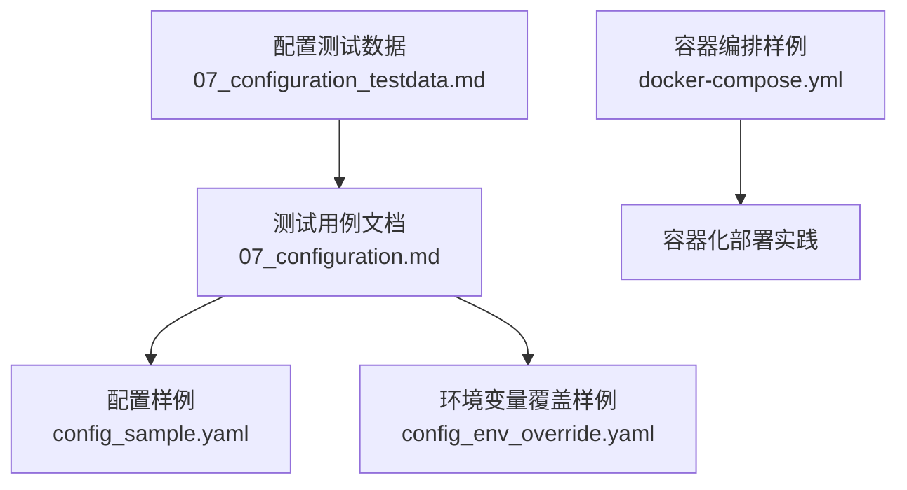
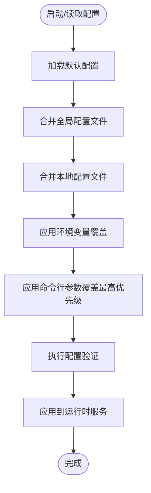
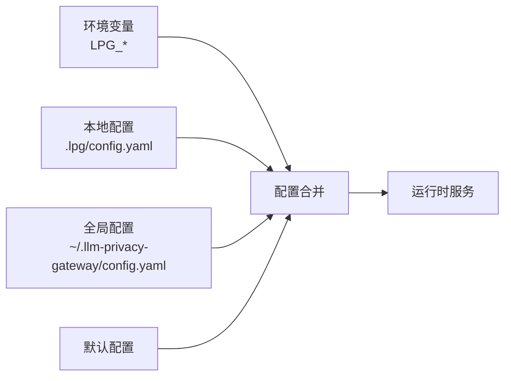

# 环境变量配置

<cite>
**本文引用的文件**
- [07_configuration.md](file://doc/test/tcs/v1.0/07_configuration.md)
- [07_configuration_testdata.md](file://doc/test/tcs/v1.0/07_configuration_testdata.md)
- [config_sample.yaml](file://doc/test/tcs/v1.0/test_data/config_sample.yaml)
- [config_env_override.yaml](file://doc/test/tcs/v1.0/test_data/config_env_override.yaml)
- [docker-compose.yml](file://doc/test/issues_management_platform/plane/docker-compose.yml)
</cite>

## 目录
1. [简介](#简介)
2. [项目结构](#项目结构)
3. [核心组件](#核心组件)
4. [架构总览](#架构总览)
5. [详细组件分析](#详细组件分析)
6. [依赖关系分析](#依赖关系分析)
7. [性能考量](#性能考量)
8. [故障排查指南](#故障排查指南)
9. [结论](#结论)
10. [附录](#附录)

## 简介
本文件面向 LLM Privacy Gateway（隐私网关）的环境变量配置，系统化梳理支持的环境变量、命名约定与前缀规则、覆盖机制与优先级、实际使用示例、值验证与错误处理策略，以及容器化部署的最佳实践与安全建议。内容基于仓库中的测试用例与样例配置文件整理而成，确保读者能够准确理解并安全地进行环境变量配置。

## 项目结构
围绕环境变量配置的相关资料主要分布在以下位置：
- 配置管理测试用例：涵盖环境变量覆盖、优先级、无效值处理等
- 配置样例文件：展示标准配置结构与字段
- 容器编排样例：提供容器化部署的环境变量注入参考

图表来源
- [07_configuration.md:1-594](file://doc/test/tcs/v1.0/07_configuration.md#L1-L594)
- [07_configuration_testdata.md:563-745](file://doc/test/tcs/v1.0/07_configuration_testdata.md#L563-L745)
- [config_sample.yaml:1-27](file://doc/test/tcs/v1.0/test_data/config_sample.yaml#L1-L27)
- [config_env_override.yaml:1-16](file://doc/test/tcs/v1.0/test_data/config_env_override.yaml#L1-L16)
- [docker-compose.yml](file://doc/test/issues_management_platform/plane/docker-compose.yml)

章节来源
- [07_configuration.md:1-594](file://doc/test/tcs/v1.0/07_configuration.md#L1-L594)
- [07_configuration_testdata.md:563-745](file://doc/test/tcs/v1.0/07_configuration_testdata.md#L563-L745)
- [config_sample.yaml:1-27](file://doc/test/tcs/v1.0/test_data/config_sample.yaml#L1-L27)
- [config_env_override.yaml:1-16](file://doc/test/tcs/v1.0/test_data/config_env_override.yaml#L1-L16)
- [docker-compose.yml](file://doc/test/issues_management_platform/plane/docker-compose.yml)

## 核心组件
- 环境变量前缀与命名
  - 统一前缀：LPG_
  - 命名规则：大写单词，点号“.”替换为下划线“_”，例如 proxy.host → LPG_PROXY_HOST
- 支持的关键配置域
  - 代理（proxy）：host、port、timeout、max_connections
  - Presidio（presidio）：endpoint、language、enabled、timeout
  - 日志（logging）：level、file、max_size、max_files、format
  - 审计（audit）：enabled、log_file、retention_days
  - 提供商（providers）：name、type、base_url、auth_type、api_key_file
  - 虚拟Key（virtual_keys）：id、name、provider、permissions、expires_at
  - 规则（rules）：enabled_categories、custom_rules_dir
  - 脱敏（masking）：default_strategy、enable_restoration
  - 其他：config_path（配置文件路径）

章节来源
- [07_configuration_testdata.md:567-591](file://doc/test/tcs/v1.0/07_configuration_testdata.md#L567-L591)
- [07_configuration_testdata.md:596-633](file://doc/test/tcs/v1.0/07_configuration_testdata.md#L596-L633)
- [config_sample.yaml:1-27](file://doc/test/tcs/v1.0/test_data/config_sample.yaml#L1-L27)

## 架构总览
环境变量在配置体系中的作用与优先级如下：

图表来源
- [07_configuration_testdata.md:699-745](file://doc/test/tcs/v1.0/07_configuration_testdata.md#L699-L745)
- [07_configuration.md:454-498](file://doc/test/tcs/v1.0/07_configuration.md#L454-L498)

章节来源
- [07_configuration_testdata.md:699-745](file://doc/test/tcs/v1.0/07_configuration_testdata.md#L699-L745)
- [07_configuration.md:454-498](file://doc/test/tcs/v1.0/07_configuration.md#L454-L498)

## 详细组件分析

### 环境变量命名约定与前缀规则
- 前缀：LPG_
- 域映射：将配置树中的点号“.”替换为下划线“_”
- 示例
  - proxy.host → LPG_PROXY_HOST
  - proxy.port → LPG_PROXY_PORT
  - presidio.endpoint → LPG_PRESIDIO_ENDPOINT
  - logging.level → LPG_LOG_LEVEL
  - audit.enabled → LPG_AUDIT_ENABLED
  - providers.openai.base_url → LPG_PROVIDERS_OPENAI_BASE_URL
  - virtual_keys.vk_local_001.name → LPG_VIRTUAL_KEYS_VK_LOCAL_001_NAME

章节来源
- [07_configuration_testdata.md:567-591](file://doc/test/tcs/v1.0/07_configuration_testdata.md#L567-L591)

### 环境变量覆盖机制与优先级
- 优先级（从高到低）
  1) 命令行参数（最高）
  2) 环境变量
  3) 本地配置文件（./.lpg/config.yaml）
  4) 全局配置文件（~/.llm-privacy-gateway/config.yaml）
  5) 默认配置（最低）
- 有效覆盖示例
  - 设置 LPG_PROXY_HOST、LPG_PROXY_PORT 后，lpg config list 显示的值应来自环境变量
- 命令行覆盖示例
  - lpg start --port 7777 会覆盖 LPG_PROXY_PORT 与配置文件中的端口值

章节来源
- [07_configuration.md:424-436](file://doc/test/tcs/v1.0/07_configuration.md#L424-L436)
- [07_configuration.md:456-468](file://doc/test/tcs/v1.0/07_configuration.md#L456-L468)
- [07_configuration_testdata.md:680-697](file://doc/test/tcs/v1.0/07_configuration_testdata.md#L680-L697)

### 环境变量值验证与错误处理
- 无效值处理策略
  - 当环境变量值无效时，系统会显示警告并回退到配置文件中的值，不中断程序
- 典型无效值场景
  - 代理端口：0、超出范围（如 65536）、非数字字符串
  - 代理主机：非法IP或主机名
  - 日志级别：大小写不一致或未知级别
  - 布尔开关：字符串“yes”/“no”、数字1/0等
- 验证范围示例
  - 端口：1–65535
  - 超时：>0（秒）
  - 日志级别：debug/info/warn/error（小写）
  - 最大连接数：>0（上限见测试数据）
  - 保留天数：>0（上限见测试数据）

章节来源
- [07_configuration.md:439-451](file://doc/test/tcs/v1.0/07_configuration.md#L439-L451)
- [07_configuration_testdata.md:580-591](file://doc/test/tcs/v1.0/07_configuration_testdata.md#L580-L591)
- [07_configuration_testdata.md:29-88](file://doc/test/tcs/v1.0/07_configuration_testdata.md#L29-L88)
- [07_configuration_testdata.md:169-188](file://doc/test/tcs/v1.0/07_configuration_testdata.md#L169-L188)
- [07_configuration_testdata.md:108-166](file://doc/test/tcs/v1.0/07_configuration_testdata.md#L108-L166)
- [07_configuration_testdata.md:510-527](file://doc/test/tcs/v1.0/07_configuration_testdata.md#L510-L527)

### 环境变量配置的实际使用示例
- 基本覆盖示例
  - LPG_PROXY_HOST=0.0.0.0
  - LPG_PROXY_PORT=7777
  - LPG_LOG_LEVEL=info
- Presidio 与审计
  - LPG_PRESIDIO_ENDPOINT=http://localhost:5001
  - LPG_AUDIT_ENABLED=false
- 提供商与密钥
  - LPG_PROVIDERS_OPENAI_BASE_URL=https://api.openai.com
  - LPG_PROVIDERS_OPENAI_AUTH_TYPE=bearer
- 命令行覆盖
  - lpg start --port 7777

章节来源
- [07_configuration.md:424-436](file://doc/test/tcs/v1.0/07_configuration.md#L424-L436)
- [07_configuration.md:456-468](file://doc/test/tcs/v1.0/07_configuration.md#L456-L468)
- [07_configuration_testdata.md:680-697](file://doc/test/tcs/v1.0/07_configuration_testdata.md#L680-L697)

### 容器化部署中的环境变量配置最佳实践
- 使用容器编排注入环境变量
  - 参考 docker-compose.yml 中的 environment 或 env_file 方式
- 安全注入敏感信息
  - 使用 secrets 或外部密钥管理（如 Vault/KMS），避免明文写入配置文件
- 分环境隔离
  - 通过不同 compose 文件或 profiles 管理 dev/stage/prod 的环境变量集合
- 健壮性与可观测性
  - 为关键环境变量设置默认值与校验，结合日志级别与审计开关
  - 在容器入口脚本中打印生效配置摘要，便于排障

章节来源
- [docker-compose.yml](file://doc/test/issues_management_platform/plane/docker-compose.yml)

## 依赖关系分析
环境变量与配置文件之间的依赖关系如下：

图表来源
- [07_configuration_testdata.md:635-657](file://doc/test/tcs/v1.0/07_configuration_testdata.md#L635-L657)
- [07_configuration_testdata.md:659-678](file://doc/test/tcs/v1.0/07_configuration_testdata.md#L659-L678)
- [07_configuration_testdata.md:699-745](file://doc/test/tcs/v1.0/07_configuration_testdata.md#L699-L745)

章节来源
- [07_configuration_testdata.md:635-657](file://doc/test/tcs/v1.0/07_configuration_testdata.md#L635-L657)
- [07_configuration_testdata.md:659-678](file://doc/test/tcs/v1.0/07_configuration_testdata.md#L659-L678)
- [07_configuration_testdata.md:699-745](file://doc/test/tcs/v1.0/07_configuration_testdata.md#L699-L745)

## 性能考量
- 环境变量覆盖发生在配置加载阶段，通常开销极低
- 建议在容器启动时一次性注入环境变量，避免频繁变更导致的重启
- 对于大规模部署，建议集中化管理环境变量，减少配置漂移

## 故障排查指南
- 症状：环境变量未生效
  - 检查前缀与命名是否符合 LPG_ 前缀与“.”→“_”映射规则
  - 确认命令行参数未覆盖该环境变量
- 症状：出现警告但服务仍启动
  - 系统会回退到配置文件中的值，属于预期行为
- 症状：端口或日志级别报错
  - 检查端口范围、日志级别大小写、布尔值格式等

章节来源
- [07_configuration.md:439-451](file://doc/test/tcs/v1.0/07_configuration.md#L439-L451)
- [07_configuration_testdata.md:580-591](file://doc/test/tcs/v1.0/07_configuration_testdata.md#L580-L591)

## 结论
- LLM Privacy Gateway 采用 LPG_ 前缀的环境变量体系，通过“命令行参数 > 环境变量 > 本地配置 > 全局配置 > 默认配置”的优先级保证灵活性与可控性
- 无效环境变量值会被安全回退，不中断服务
- 建议在容器化环境中通过编排工具集中管理环境变量，并配合密钥管理与审计策略提升安全性

## 附录

### 环境变量清单与对应配置项
- 代理
  - LPG_PROXY_HOST → proxy.host
  - LPG_PROXY_PORT → proxy.port
  - LPG_PROXY_TIMEOUT → proxy.timeout
  - LPG_PROXY_MAX_CONNECTIONS → proxy.max_connections
- Presidio
  - LPG_PRESIDIO_ENDPOINT → presidio.endpoint
  - LPG_PRESIDIO_LANGUAGE → presidio.language
  - LPG_PRESIDIO_ENABLED → presidio.enabled
  - LPG_PRESIDIO_TIMEOUT → presidio.timeout
- 日志
  - LPG_LOG_LEVEL → logging.level
  - LPG_LOG_FILE → logging.file
  - LPG_LOG_MAX_SIZE → logging.max_size
  - LPG_LOG_MAX_FILES → logging.max_files
  - LPG_LOG_FORMAT → logging.format
- 审计
  - LPG_AUDIT_ENABLED → audit.enabled
  - LPG_AUDIT_LOG_FILE → audit.log_file
  - LPG_AUDIT_RETENTION_DAYS → audit.retention_days
- 提供商
  - LPG_PROVIDERS_{NAME}_BASE_URL → providers.{name}.base_url
  - LPG_PROVIDERS_{NAME}_AUTH_TYPE → providers.{name}.auth_type
  - LPG_PROVIDERS_{NAME}_API_KEY_FILE → providers.{name}.api_key_file
- 虚拟Key
  - LPG_VIRTUAL_KEYS_{ID}_NAME → virtual_keys.{id}.name
  - LPG_VIRTUAL_KEYS_{ID}_PROVIDER → virtual_keys.{id}.provider
  - LPG_VIRTUAL_KEYS_{ID}_PERMISSIONS → virtual_keys.{id}.permissions
  - LPG_VIRTUAL_KEYS_{ID}_EXPIRES_AT → virtual_keys.{id}.expires_at
- 规则
  - LPG_RULES_ENABLED_CATEGORIES → rules.enabled_categories
  - LPG_RULES_CUSTOM_RULES_DIR → rules.custom_rules_dir
- 脱敏
  - LPG_MASKING_DEFAULT_STRATEGY → masking.default_strategy
  - LPG_MASKING_ENABLE_RESTORE → masking.enable_restoration
- 其他
  - LPG_CONFIG_PATH → config_path

章节来源
- [07_configuration_testdata.md:567-591](file://doc/test/tcs/v1.0/07_configuration_testdata.md#L567-L591)
- [07_configuration_testdata.md:596-633](file://doc/test/tcs/v1.0/07_configuration_testdata.md#L596-L633)
- [config_sample.yaml:1-27](file://doc/test/tcs/v1.0/test_data/config_sample.yaml#L1-L27)