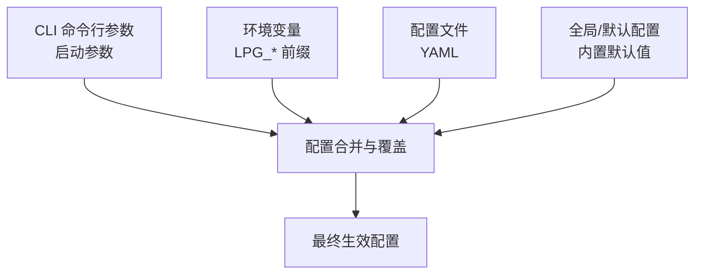
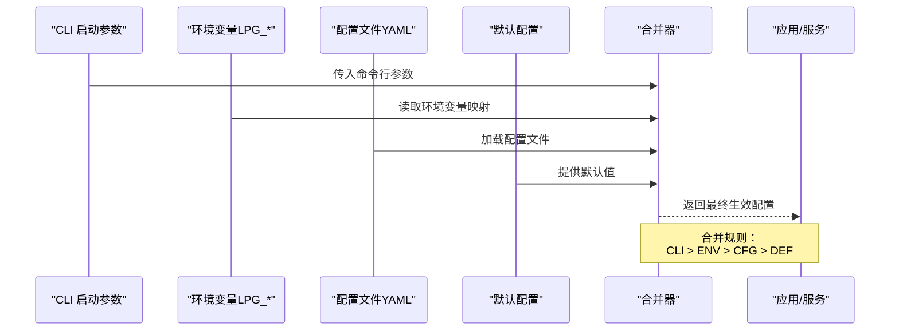
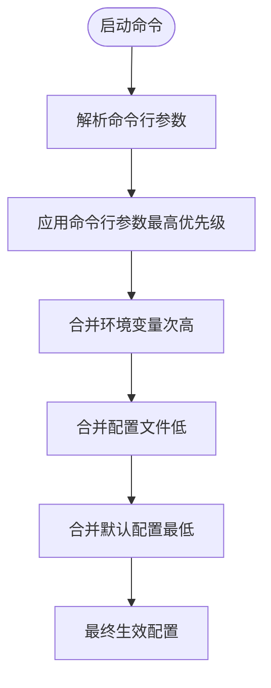
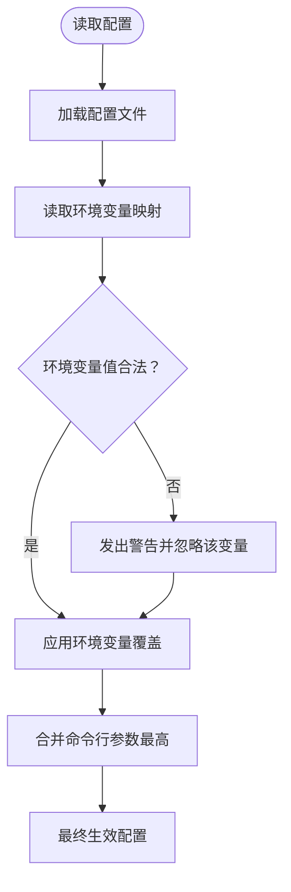
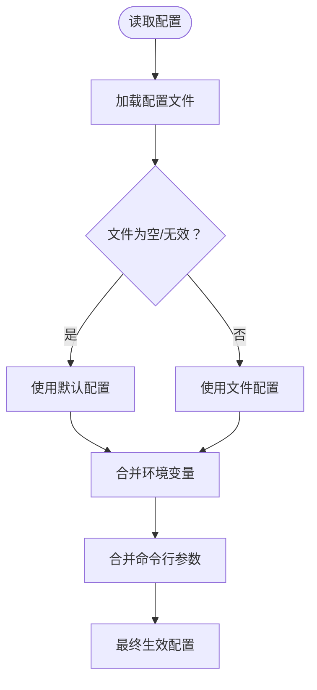
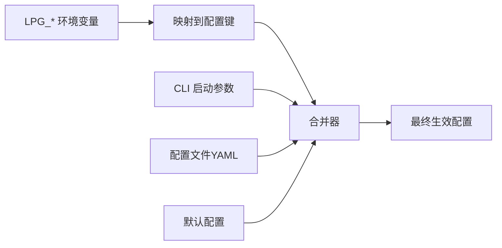

# 配置优先级与合并

<cite>
**本文引用的文件**   
- [配置管理黑盒测试用例](file://doc/test/tcs/v1.0/07_configuration.md)
- [配置测试数据与合并示例](file://doc/test/tcs/v1.0/07_configuration_testdata.md)
- [配置样例文件](file://doc/test/tcs/v1.0/test_data/config_sample.yaml)
- [环境变量覆盖样例](file://doc/test/tcs/v1.0/test_data/config_env_override.yaml)
- [提供商配置样例](file://doc/test/tcs/v1.0/test_data/providers_sample.yaml)
- [设计文档（含环境变量映射）](file://doc/design/design-update-20260404-v1.0-init.md)
</cite>

## 目录
1. [简介](#简介)
2. [项目结构](#项目结构)
3. [核心组件](#核心组件)
4. [架构总览](#架构总览)
5. [详细组件分析](#详细组件分析)
6. [依赖分析](#依赖分析)
7. [性能考虑](#性能考虑)
8. [故障排除指南](#故障排除指南)
9. [结论](#结论)
10. [附录](#附录)

## 简介
本文件系统化阐述 LLM Privacy Gateway 的配置优先级与合并机制，覆盖命令行参数、环境变量、配置文件三类来源的优先级顺序、合并规则、覆盖行为与冲突处理，并提供实际应用场景、调试方法与最佳实践。文档基于仓库内的测试用例与设计文档进行归纳总结，确保与实现一致。

## 项目结构
围绕配置优先级与合并的相关资料主要分布在以下位置：
- 测试用例文档：集中描述优先级、环境变量覆盖、命令行参数优先级等场景
- 测试数据与合并示例：给出合并后的预期配置形态
- 配置样例与提供商样例：展示典型配置结构
- 设计文档：明确环境变量与配置键的映射关系

**图表来源**
- [配置管理黑盒测试用例:454-498](file://doc/test/tcs/v1.0/07_configuration.md#L454-L498)
- [配置测试数据与合并示例:699-745](file://doc/test/tcs/v1.0/07_configuration_testdata.md#L699-L745)
- [设计文档（含环境变量映射）:2005-2009](file://doc/design/design-update-20260404-v1.0-init.md#L2005-L2009)

**章节来源**
- [配置管理黑盒测试用例:1-594](file://doc/test/tcs/v1.0/07_configuration.md#L1-L594)
- [配置测试数据与合并示例:690-808](file://doc/test/tcs/v1.0/07_configuration_testdata.md#L690-L808)
- [配置样例文件:1-27](file://doc/test/tcs/v1.0/test_data/config_sample.yaml#L1-L27)
- [环境变量覆盖样例:1-16](file://doc/test/tcs/v1.0/test_data/config_env_override.yaml#L1-L16)
- [提供商配置样例:1-25](file://doc/test/tcs/v1.0/test_data/providers_sample.yaml#L1-L25)
- [设计文档（含环境变量映射）:2005-2009](file://doc/design/design-update-20260404-v1.0-init.md#L2005-L2009)

## 核心组件
- 命令行参数：由 CLI 启动命令传入，具有最高优先级，直接覆盖其他来源
- 环境变量：以 LPG_* 前缀命名，对相应配置键进行覆盖
- 配置文件：YAML 格式，作为主要持久化来源
- 全局/默认配置：当上述来源缺失或为空时提供默认值

**章节来源**
- [配置管理黑盒测试用例:454-498](file://doc/test/tcs/v1.0/07_configuration.md#L454-L498)
- [配置测试数据与合并示例:699-745](file://doc/test/tcs/v1.0/07_configuration_testdata.md#L699-L745)
- [设计文档（含环境变量映射）:2005-2009](file://doc/design/design-update-20260404-v1.0-init.md#L2005-L2009)

## 架构总览
下图展示了配置来源在运行时的合并与覆盖流程，体现“命令行参数 > 环境变量 > 配置文件 > 默认配置”的优先级顺序。

**图表来源**
- [配置管理黑盒测试用例:454-498](file://doc/test/tcs/v1.0/07_configuration.md#L454-L498)
- [配置测试数据与合并示例:699-745](file://doc/test/tcs/v1.0/07_configuration_testdata.md#L699-L745)
- [设计文档（含环境变量映射）:2005-2009](file://doc/design/design-update-20260404-v1.0-init.md#L2005-L2009)

## 详细组件分析

### 命令行参数优先级
- 命令行参数优先级最高，能覆盖环境变量与配置文件中的同名键
- 示例：通过启动参数覆盖端口与日志级别，最终以命令行为准

**图表来源**
- [配置管理黑盒测试用例:456-468](file://doc/test/tcs/v1.0/07_configuration.md#L456-L468)

**章节来源**
- [配置管理黑盒测试用例:456-468](file://doc/test/tcs/v1.0/07_configuration.md#L456-L468)

### 环境变量优先级
- 环境变量以 LPG_* 前缀映射到配置键，覆盖配置文件中的对应值
- 若环境变量值非法，系统会发出警告并回退到配置文件值

**图表来源**
- [配置管理黑盒测试用例:424-451](file://doc/test/tcs/v1.0/07_configuration.md#L424-L451)
- [设计文档（含环境变量映射）:2005-2009](file://doc/design/design-update-20260404-v1.0-init.md#L2005-L2009)

**章节来源**
- [配置管理黑盒测试用例:424-451](file://doc/test/tcs/v1.0/07_configuration.md#L424-L451)
- [设计文档（含环境变量映射）:2005-2009](file://doc/design/design-update-20260404-v1.0-init.md#L2005-L2009)

### 配置文件与默认配置
- 配置文件为主要来源；若文件为空或缺失，系统使用默认配置
- 合并时遵循“键存在即覆盖，缺失则保留或使用默认值”的规则

**图表来源**
- [配置管理黑盒测试用例:101-173](file://doc/test/tcs/v1.0/07_configuration.md#L101-L173)
- [配置测试数据与合并示例:749-756](file://doc/test/tcs/v1.0/07_configuration_testdata.md#L749-L756)

**章节来源**
- [配置管理黑盒测试用例:101-173](file://doc/test/tcs/v1.0/07_configuration.md#L101-L173)
- [配置测试数据与合并示例:749-756](file://doc/test/tcs/v1.0/07_configuration_testdata.md#L749-L756)

### 合并后的预期配置（示例）
- 文档提供了合并后的预期配置样例，直观展示优先级效果
- 关键点：命令行参数覆盖最高，环境变量次之，其余按来源降级

**章节来源**
- [配置测试数据与合并示例:699-745](file://doc/test/tcs/v1.0/07_configuration_testdata.md#L699-L745)

### 动态配置更新时的优先级处理
- 运行时通过 CLI 对配置进行设置与持久化，写回配置文件
- 下次启动时，命令行参数仍具最高优先级，随后依次为环境变量、配置文件、默认配置
- 建议：在容器化或 CI/CD 场景中，优先使用环境变量或命令行参数进行覆盖，避免频繁修改配置文件

**章节来源**
- [配置管理黑盒测试用例:501-531](file://doc/test/tcs/v1.0/07_configuration.md#L501-L531)
- [配置测试数据与合并示例:699-745](file://doc/test/tcs/v1.0/07_configuration_testdata.md#L699-L745)

## 依赖分析
- 环境变量与配置键的映射关系由设计文档明确，确保测试用例与实现一致
- CLI 启动参数直接影响服务启动行为，优先级高于其他来源

**图表来源**
- [设计文档（含环境变量映射）:2005-2009](file://doc/design/design-update-20260404-v1.0-init.md#L2005-L2009)
- [配置管理黑盒测试用例:454-498](file://doc/test/tcs/v1.0/07_configuration.md#L454-L498)

**章节来源**
- [设计文档（含环境变量映射）:2005-2009](file://doc/design/design-update-20260404-v1.0-init.md#L2005-L2009)
- [配置管理黑盒测试用例:454-498](file://doc/test/tcs/v1.0/07_configuration.md#L454-L498)

## 性能考虑
- 配置合并发生在启动阶段，通常开销极小
- 避免在高频路径中反复解析配置；建议在服务启动时一次性完成合并
- 在容器或云环境中，优先使用环境变量覆盖，减少磁盘 I/O

## 故障排除指南
- 环境变量值非法
  - 现象：系统发出警告并忽略该变量，继续使用配置文件值
  - 处理：修正环境变量值或删除无效变量
  - 参考：[配置管理黑盒测试用例:439-451](file://doc/test/tcs/v1.0/07_configuration.md#L439-L451)
- 配置文件格式错误
  - 现象：加载失败并提示格式错误
  - 处理：修复 YAML 语法或替换为有效配置
  - 参考：[配置管理黑盒测试用例:146-158](file://doc/test/tcs/v1.0/07_configuration.md#L146-L158)
- 配置文件为空或仅含注释
  - 现象：使用默认配置
  - 处理：补充必要配置项或提供有效配置文件
  - 参考：[配置管理黑盒测试用例:161-173](file://doc/test/tcs/v1.0/07_configuration.md#L161-L173)
- 命令行参数与环境变量冲突
  - 现象：命令行参数覆盖环境变量
  - 处理：根据需要调整启动参数或环境变量
  - 参考：[配置管理黑盒测试用例:456-483](file://doc/test/tcs/v1.0/07_configuration.md#L456-L483)

**章节来源**
- [配置管理黑盒测试用例:146-173](file://doc/test/tcs/v1.0/07_configuration.md#L146-L173)
- [配置管理黑盒测试用例:439-483](file://doc/test/tcs/v1.0/07_configuration.md#L439-L483)

## 结论
- 优先级顺序：命令行参数 > 环境变量 > 配置文件 > 默认配置
- 合并规则：键存在即覆盖，缺失则保留或使用默认值
- 冲突处理：命令行参数始终最高优先；环境变量非法时回退到配置文件值
- 最佳实践：在容器/CI 中使用环境变量覆盖；在开发机上使用命令行参数快速切换；避免频繁修改配置文件

## 附录

### 实际应用场景与使用示例
- 开发环境快速切换
  - 使用命令行参数临时覆盖端口与日志级别，无需修改配置文件
  - 参考：[配置管理黑盒测试用例:456-468](file://doc/test/tcs/v1.0/07_configuration.md#L456-L468)
- 生产环境通过环境变量覆盖
  - 通过 LPG_* 环境变量覆盖特定配置键，避免硬编码
  - 参考：[配置管理黑盒测试用例:424-451](file://doc/test/tcs/v1.0/07_configuration.md#L424-L451)
- 容器编排中的配置注入
  - 在容器编排平台设置环境变量，实现不同环境的差异化配置
  - 参考：[设计文档（含环境变量映射）:2005-2009](file://doc/design/design-update-20260404-v1.0-init.md#L2005-L2009)

**章节来源**
- [配置管理黑盒测试用例:424-468](file://doc/test/tcs/v1.0/07_configuration.md#L424-L468)
- [设计文档（含环境变量映射）:2005-2009](file://doc/design/design-update-20260404-v1.0-init.md#L2005-L2009)