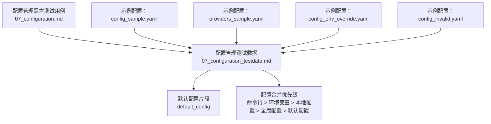
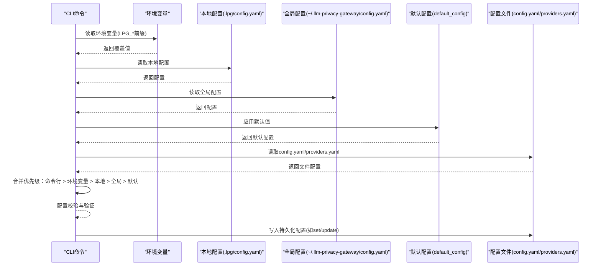
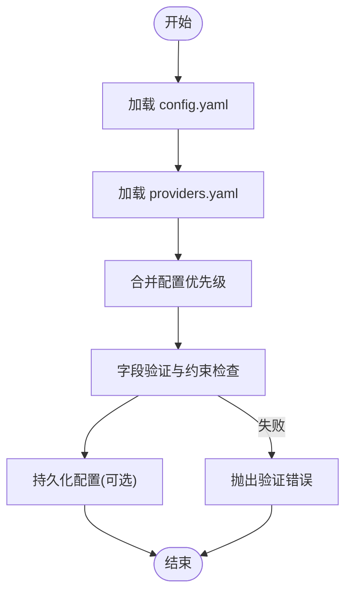
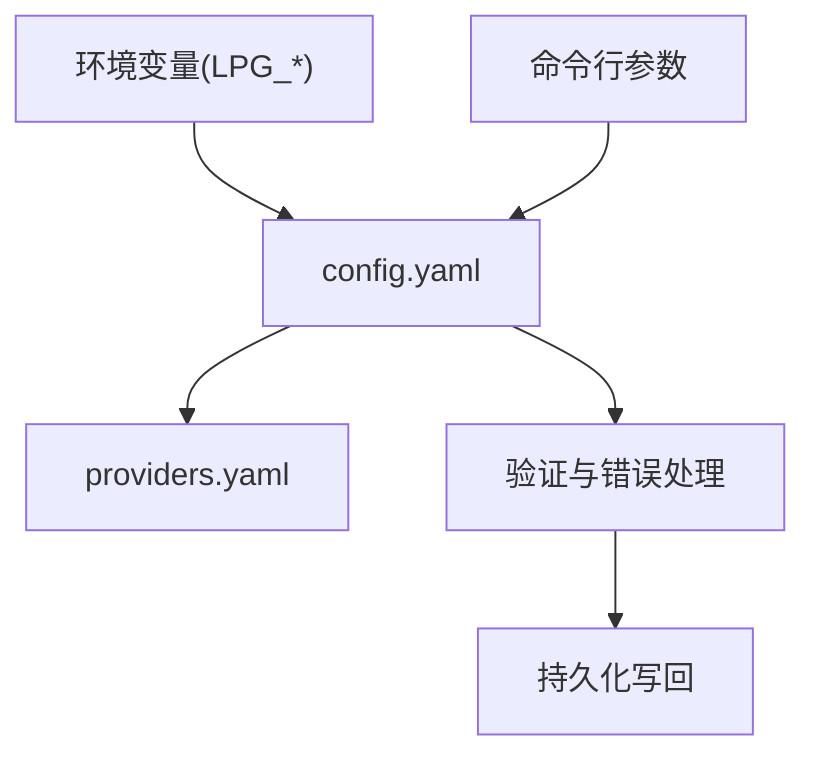

# 配置文件格式与结构

<cite>
**本文引用的文件**
- [配置管理黑盒测试用例](file://doc/test/tcs/v1.0/07_configuration.md)
- [配置管理测试数据](file://doc/test/tcs/v1.0/07_configuration_testdata.md)
- [配置样例：config_sample.yaml](file://doc/test/tcs/v1.0/test_data/config_sample.yaml)
- [配置样例：providers_sample.yaml](file://doc/test/tcs/v1.0/test_data/providers_sample.yaml)
- [配置样例：config_env_override.yaml](file://doc/test/tcs/v1.0/test_data/config_env_override.yaml)
- [配置样例：config_invalid.yaml](file://doc/test/tcs/v1.0/test_data/config_invalid.yaml)
</cite>

## 目录
1. [简介](#简介)
2. [项目结构](#项目结构)
3. [核心组件](#核心组件)
4. [架构总览](#架构总览)
5. [详细组件分析](#详细组件分析)
6. [依赖分析](#依赖分析)
7. [性能考虑](#性能考虑)
8. [故障排查指南](#故障排查指南)
9. [结论](#结论)
10. [附录](#附录)

## 简介
本文件面向 LLM Privacy Gateway 的使用者与维护者，系统性地文档化配置文件格式与结构，涵盖 config.yaml 与 providers.yaml 的字段定义、数据类型、层次结构与嵌套关系；提供默认配置、自定义配置与生产环境配置的示例；明确配置项的验证规则与约束条件；解释配置文件的语法要求与格式规范；给出配置优先级与合并策略；并提供最佳实践与安全建议。

## 项目结构
- 配置相关测试数据集中于文档目录下，便于通过测试用例与测试数据理解配置项的定义、默认值、验证规则与优先级。
- 关键文件：
  - 配置管理黑盒测试用例：定义配置初始化、加载、读取、设置、验证、环境变量覆盖、优先级、持久化、提供商配置等行为。
  - 配置管理测试数据：提供默认配置、有效/无效配置项、边界条件、环境变量覆盖、配置合并等详尽测试数据。
  - 示例配置文件：config_sample.yaml、providers_sample.yaml、config_env_override.yaml、config_invalid.yaml，展示不同场景下的配置形态与错误形态。

**图表来源**
- [配置管理黑盒测试用例:1-594](file://doc/test/tcs/v1.0/07_configuration.md#L1-L594)
- [配置管理测试数据:594-745](file://doc/test/tcs/v1.0/07_configuration_testdata.md#L594-L745)

**章节来源**
- [配置管理黑盒测试用例:1-594](file://doc/test/tcs/v1.0/07_configuration.md#L1-L594)
- [配置管理测试数据:1-808](file://doc/test/tcs/v1.0/07_configuration_testdata.md#L1-L808)

## 核心组件
- 配置文件类型
  - config.yaml：主配置文件，包含代理、日志、规则、审计、提供商等顶层配置。
  - providers.yaml：提供商配置文件，独立存放提供商列表及其认证信息。
- 配置项来源与优先级
  - 命令行参数优先级最高，其次为环境变量，再次为本地配置文件，再其次为全局配置文件，最后为默认配置。
- 配置持久化
  - 对配置进行 set/update 操作后会自动保存到配置文件。

**章节来源**
- [配置管理黑盒测试用例:454-498](file://doc/test/tcs/v1.0/07_configuration.md#L454-L498)
- [配置管理测试数据:594-745](file://doc/test/tcs/v1.0/07_configuration_testdata.md#L594-L745)

## 架构总览
配置加载与生效的总体流程如下：

**图表来源**
- [配置管理黑盒测试用例:454-498](file://doc/test/tcs/v1.0/07_configuration.md#L454-L498)
- [配置管理测试数据:594-745](file://doc/test/tcs/v1.0/07_configuration_testdata.md#L594-L745)

## 详细组件分析

### config.yaml 字段定义与数据类型
- 代理配置（proxy）
  - host：字符串；有效值示例见测试数据；非法值将触发验证错误。
  - port：整数；范围 1–65535；超出范围或非数字将触发验证错误。
  - timeout：整数；最小 1，最大 300；0 或负数、浮点数、超出范围将触发验证错误。
  - max_connections：整数；最小 1，最大 10000；0、负数、浮点数、超出范围将触发验证错误。
- 日志配置（log/logging）
  - level：字符串；允许值为 debug/info/warn/error/critical；大小写敏感，无效值将触发验证错误。
  - file：字符串；日志文件路径；路径不存在、无权限、包含空字符等将触发错误。
  - max_size：字符串；带单位的大小，如 MB/GB；无效格式、缺少单位、负数将触发验证错误。
  - max_files：整数；最小 1，最大 1000；0、负数、浮点数、超出范围将触发验证错误。
  - format：字符串；允许值为 json/text/structured；大小写敏感，无效值将触发验证错误。
- 规则配置（rules）
  - enabled：布尔；true/false；字符串或数字将触发验证错误。
  - path：字符串；规则目录路径；路径不存在、无权限、空路径将触发错误。
- 审计配置（audit）
  - enabled：布尔；true/false；字符串或数字将触发验证错误。
  - log_file：字符串；审计日志文件路径；路径不存在、无权限、空路径将触发错误。
  - retention_days：整数；最小 1，最大 3650；0、负数、浮点数、超出范围将触发验证错误。
- 提供商配置（providers）
  - 以键值对形式列出提供商，每个提供商包含：
    - type：字符串；提供商类型，如 openai/anthropic/azure_openai 等；无效类型将触发验证错误。
    - api_key：字符串；API 密钥；建议使用密钥文件或环境变量替代直接明文存储。
    - base_url：字符串；提供商 API 基础地址；缺少协议、无效 URL、不支持协议将触发验证错误。
    - api_version：字符串（可选）；Azure OpenAI 版本号；按提供商要求填写。
    - timeout：整数；超时秒数；范围与通用超时一致。
    - enabled：布尔；是否启用该提供商；字符串或数字将触发验证错误。

**章节来源**
- [配置样例：config_sample.yaml:1-27](file://doc/test/tcs/v1.0/test_data/config_sample.yaml#L1-L27)
- [配置样例：providers_sample.yaml:1-25](file://doc/test/tcs/v1.0/test_data/providers_sample.yaml#L1-L25)
- [配置管理测试数据:25-106](file://doc/test/tcs/v1.0/07_configuration_testdata.md#L25-L106)
- [配置管理测试数据:167-262](file://doc/test/tcs/v1.0/07_configuration_testdata.md#L167-L262)
- [配置管理测试数据:405-438](file://doc/test/tcs/v1.0/07_configuration_testdata.md#L405-L438)
- [配置管理测试数据:510-561](file://doc/test/tcs/v1.0/07_configuration_testdata.md#L510-L561)

### providers.yaml 字段定义与数据类型
- providers：数组；每个元素为一个提供商对象，包含：
  - name：字符串；提供商名称；不允许空字符串、包含空格或特殊字符；过长将触发验证错误。
  - type：字符串；提供商类型；不允许无效类型、空字符串、不存在的变体。
  - base_url：字符串；提供商 API 基础地址；缺少协议、无效 URL、不支持协议将触发验证错误。
  - auth_type：字符串（可选）；认证方式，如 bearer/x-api-key/api-key/basic；无效类型将触发验证错误。
  - api_key_file：字符串（可选）；密钥文件路径；路径不存在、无权限、空路径将触发错误。
  - timeout：整数（可选）；超时秒数；范围与通用超时一致。
  - enabled：布尔（可选）；是否启用；字符串或数字将触发验证错误。

**章节来源**
- [配置样例：providers_sample.yaml:1-25](file://doc/test/tcs/v1.0/test_data/providers_sample.yaml#L1-L25)
- [配置管理测试数据:263-353](file://doc/test/tcs/v1.0/07_configuration_testdata.md#L263-L353)

### 层次结构与嵌套关系
- config.yaml 采用分层结构，顶层键包括 proxy、log/logging、rules、audit、providers 等。
- providers.yaml 采用数组结构，数组元素为提供商对象，每个对象包含 name/type/base_url 等字段。
- 嵌套关系遵循 YAML 语法规则，键值对与列表项严格缩进；不支持 tab 缩进。

**图表来源**
- [配置管理黑盒测试用例:454-498](file://doc/test/tcs/v1.0/07_configuration.md#L454-L498)
- [配置管理测试数据:594-745](file://doc/test/tcs/v1.0/07_configuration_testdata.md#L594-L745)

**章节来源**
- [配置样例：config_sample.yaml:1-27](file://doc/test/tcs/v1.0/test_data/config_sample.yaml#L1-L27)
- [配置样例：providers_sample.yaml:1-25](file://doc/test/tcs/v1.0/test_data/providers_sample.yaml#L1-L25)

### 配置项验证规则与约束条件
- 代理配置
  - host：支持 IPv4/域名；非法 IP、非法主机名将触发验证错误。
  - port：必须为 1–65535 的整数；0、负数、超界、非数字、浮点数将触发验证错误。
  - timeout/max_connections：均需为正整数，且满足各自上限；0、负数、超界、非数字、浮点数将触发验证错误。
- 日志配置
  - level：仅允许小写 debug/info/warn/error/critical；大写或无效值将触发验证错误。
  - file/max_size/max_files/format：路径、大小、文件数、格式均有明确范围与格式要求；非法值将触发验证错误。
- 规则与审计
  - enabled：布尔；字符串或数字将触发验证错误。
  - path/log_file：路径存在性、权限、空值等；retention_days：1–3650；越界或非整数将触发验证错误。
- 提供商配置
  - name/type/base_url/auth_type/api_key_file：均有严格的格式与取值范围；非法值将触发验证错误。
- 环境变量覆盖
  - 支持 LPG_* 前缀的环境变量覆盖；无效值将触发警告并回退到配置文件值。

**章节来源**
- [配置管理测试数据:25-106](file://doc/test/tcs/v1.0/07_configuration_testdata.md#L25-L106)
- [配置管理测试数据:167-262](file://doc/test/tcs/v1.0/07_configuration_testdata.md#L167-L262)
- [配置管理测试数据:405-438](file://doc/test/tcs/v1.0/07_configuration_testdata.md#L405-L438)
- [配置管理测试数据:510-561](file://doc/test/tcs/v1.0/07_configuration_testdata.md#L510-L561)
- [配置管理黑盒测试用例:407-451](file://doc/test/tcs/v1.0/07_configuration.md#L407-L451)

### 语法要求与格式规范
- YAML 语法
  - 使用空格缩进；禁止使用 tab。
  - 键唯一；重复键将导致解析错误。
  - 字符集支持中文与特殊字符；路径中包含空格、中文、特殊符号可正常解析。
- 错误示例
  - 缺少闭合括号、无效缩进、重复键等将导致解析错误。
- JSON 与 YAML 的差异
  - 规则配置文件支持 YAML/JSON；语法错误将触发解析错误。

**章节来源**
- [配置样例：config_invalid.yaml:1-29](file://doc/test/tcs/v1.0/test_data/config_invalid.yaml#L1-L29)
- [配置管理测试数据:757-779](file://doc/test/tcs/v1.0/07_configuration_testdata.md#L757-L779)

### 配置优先级与合并策略
- 优先级顺序（从高到低）：命令行参数 > 环境变量 > 本地配置 > 全局配置 > 默认配置。
- 合并策略
  - 字段逐级覆盖；未提供的字段沿用上一层配置或默认值。
  - 默认配置包含代理、Presidio、日志、提供商、虚拟密钥、规则、脱敏、审计等默认值。

**章节来源**
- [配置管理黑盒测试用例:454-498](file://doc/test/tcs/v1.0/07_configuration.md#L454-L498)
- [配置管理测试数据:594-745](file://doc/test/tcs/v1.0/07_configuration_testdata.md#L594-L745)

### 配置示例
- 默认配置
  - 参考默认配置片段，了解各字段的默认值与类型。
- 自定义配置
  - 使用 config_sample.yaml 作为模板，按需修改代理、日志、规则、审计与提供商配置。
- 生产环境配置
  - 建议使用环境变量覆盖敏感字段（如端口），并使用密钥文件或外部密钥管理服务存储 API Key。
- 环境变量覆盖示例
  - 使用 config_env_override.yaml 展示如何通过环境变量覆盖配置项。

**章节来源**
- [配置样例：config_sample.yaml:1-27](file://doc/test/tcs/v1.0/test_data/config_sample.yaml#L1-L27)
- [配置样例：providers_sample.yaml:1-25](file://doc/test/tcs/v1.0/test_data/providers_sample.yaml#L1-L25)
- [配置样例：config_env_override.yaml:1-16](file://doc/test/tcs/v1.0/test_data/config_env_override.yaml#L1-L16)
- [配置管理测试数据:594-745](file://doc/test/tcs/v1.0/07_configuration_testdata.md#L594-L745)

## 依赖分析
- 配置文件依赖关系
  - config.yaml 依赖 providers.yaml 中的提供商列表。
  - 环境变量与命令行参数对 config.yaml 的字段具有覆盖能力。
- 验证与错误处理
  - 配置加载阶段即进行字段类型与取值范围验证；格式错误与路径错误在加载阶段即报错。
- 配置持久化
  - set/update 操作会写回配置文件，确保配置一致性。

**图表来源**
- [配置管理黑盒测试用例:454-498](file://doc/test/tcs/v1.0/07_configuration.md#L454-L498)
- [配置管理测试数据:594-745](file://doc/test/tcs/v1.0/07_configuration_testdata.md#L594-L745)

**章节来源**
- [配置管理黑盒测试用例:454-498](file://doc/test/tcs/v1.0/07_configuration.md#L454-L498)
- [配置管理测试数据:594-745](file://doc/test/tcs/v1.0/07_configuration_testdata.md#L594-L745)

## 性能考虑
- 配置加载与合并为轻量级操作，通常不影响运行时性能。
- 建议避免在高频路径中频繁读取配置文件；可通过缓存或一次性加载策略优化。
- 日志文件大小与轮转配置会影响磁盘 IO；合理设置 max_size 与 max_files。

[本节为通用指导，无需特定文件来源]

## 故障排查指南
- 配置文件不存在
  - 现象：提示配置文件不存在。
  - 处理：使用初始化命令生成默认配置，或手动创建配置文件。
- 配置文件格式错误
  - 现象：YAML 解析错误、重复键、缩进问题。
  - 处理：修正 YAML 语法，确保键唯一、使用空格缩进。
- 配置项值无效
  - 现象：端口越界、超时范围错误、日志级别大小写错误、布尔值格式错误。
  - 处理：根据验证规则调整配置值。
- 环境变量覆盖异常
  - 现象：环境变量值无效但未导致程序退出。
  - 处理：检查环境变量命名与取值，确认覆盖优先级。
- 提供商配置错误
  - 现象：提供商类型无效、URL 缺少协议、密钥文件路径错误。
  - 处理：核对提供商类型与 URL 格式，确保存储密钥的安全性。

**章节来源**
- [配置管理黑盒测试用例:131-173](file://doc/test/tcs/v1.0/07_configuration.md#L131-L173)
- [配置管理黑盒测试用例:407-451](file://doc/test/tcs/v1.0/07_configuration.md#L407-L451)
- [配置样例：config_invalid.yaml:1-29](file://doc/test/tcs/v1.0/test_data/config_invalid.yaml#L1-L29)

## 结论
本文基于测试用例与测试数据，系统梳理了 LLM Privacy Gateway 的配置文件格式与结构，明确了字段定义、数据类型、验证规则、优先级与合并策略，并提供了示例与最佳实践。建议在生产环境中结合环境变量与密钥管理服务，确保配置的安全性与可维护性。

[本节为总结性内容，无需特定文件来源]

## 附录

### A. 字段与类型速查表
- 代理配置（proxy）
  - host：字符串；IPv4/域名
  - port：整数；1–65535
  - timeout：整数；1–300
  - max_connections：整数；1–10000
- 日志配置（log/logging）
  - level：字符串；debug/info/warn/error/critical
  - file：字符串；日志文件路径
  - max_size：字符串；带单位的大小
  - max_files：整数；1–1000
  - format：字符串；json/text/structured
- 规则配置（rules）
  - enabled：布尔；true/false
  - path：字符串；规则目录路径
- 审计配置（audit）
  - enabled：布尔；true/false
  - log_file：字符串；审计日志路径
  - retention_days：整数；1–3650
- 提供商配置（providers）
  - name：字符串；提供商名称
  - type：字符串；提供商类型
  - base_url：字符串；API 基础地址
  - api_version：字符串（可选）；Azure 版本
  - auth_type：字符串（可选）；认证方式
  - api_key_file：字符串（可选）；密钥文件路径
  - timeout：整数（可选）；超时秒数
  - enabled：布尔（可选）；是否启用

**章节来源**
- [配置管理测试数据:25-106](file://doc/test/tcs/v1.0/07_configuration_testdata.md#L25-L106)
- [配置管理测试数据:167-262](file://doc/test/tcs/v1.0/07_configuration_testdata.md#L167-L262)
- [配置管理测试数据:405-438](file://doc/test/tcs/v1.0/07_configuration_testdata.md#L405-L438)
- [配置管理测试数据:510-561](file://doc/test/tcs/v1.0/07_configuration_testdata.md#L510-L561)

### B. 配置优先级与合并示例
- 优先级顺序：命令行参数 > 环境变量 > 本地配置 > 全局配置 > 默认配置。
- 合并示例参考默认配置与合并后配置片段，理解字段覆盖与默认回退机制。

**章节来源**
- [配置管理测试数据:594-745](file://doc/test/tcs/v1.0/07_configuration_testdata.md#L594-L745)

### C. 安全与最佳实践
- 使用环境变量覆盖敏感字段（如端口）。
- 使用密钥文件或外部密钥管理服务存储 API Key，避免明文写入配置文件。
- 严格控制配置文件权限，确保只有授权用户可读写。
- 在生产环境启用审计日志，并设置合理的保留期。
- 定期审查配置项的有效性与安全性，避免使用过期或弱化的配置。

**章节来源**
- [配置管理黑盒测试用例:518-529](file://doc/test/tcs/v1.0/07_configuration.md#L518-L529)
- [配置管理测试数据:510-561](file://doc/test/tcs/v1.0/07_configuration_testdata.md#L510-L561)