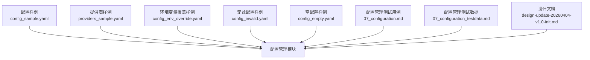
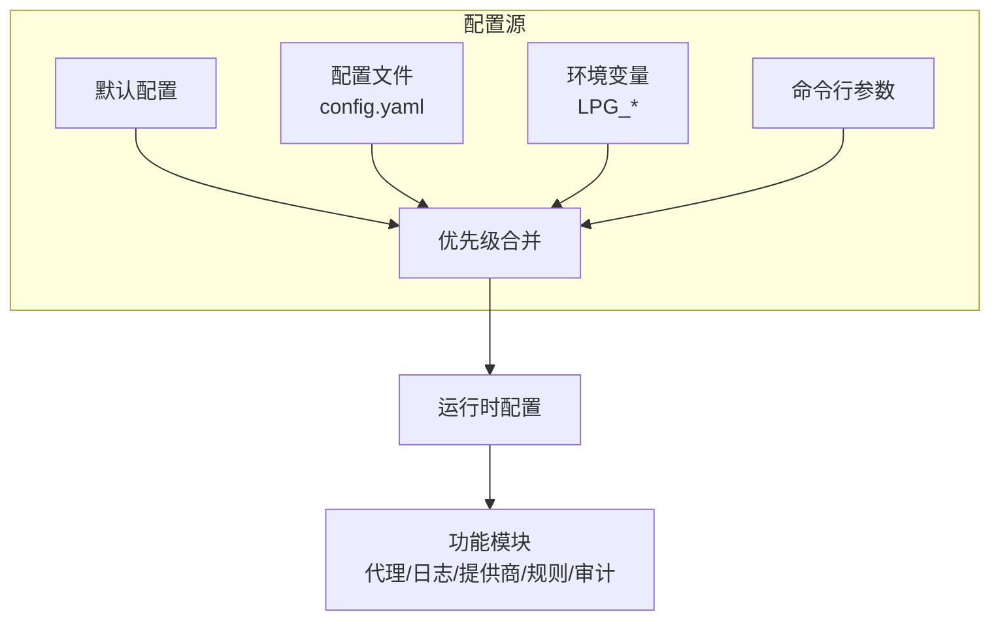
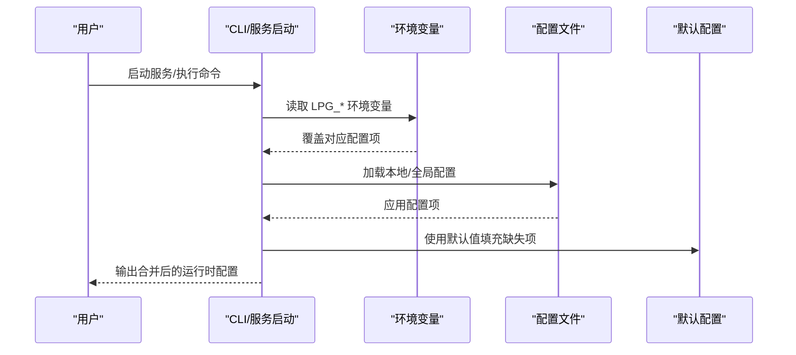
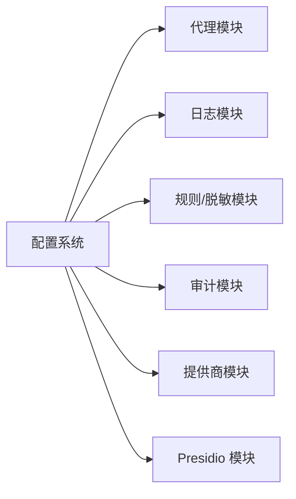
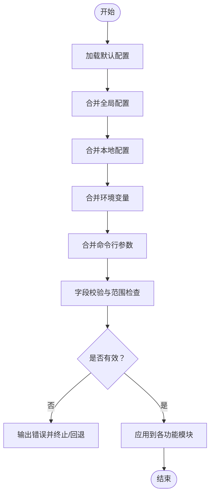

# 配置管理系统

<cite>
**本文引用的文件**
- [config_sample.yaml](file://doc/test/tcs/v1.0/test_data/config_sample.yaml)
- [providers_sample.yaml](file://doc/test/tcs/v1.0/test_data/providers_sample.yaml)
- [config_env_override.yaml](file://doc/test/tcs/v1.0/test_data/config_env_override.yaml)
- [config_invalid.yaml](file://doc/test/tcs/v1.0/test_data/config_invalid.yaml)
- [config_empty.yaml](file://doc/test/tcs/v1.0/test_data/config_empty.yaml)
- [配置管理黑盒测试用例.md](file://doc/test/tcs/v1.0/07_configuration.md)
- [配置管理测试数据.md](file://doc/test/tcs/v1.0/07_configuration_testdata.md)
- [设计文档.md](file://doc/design/design-update-20260404-v1.0-init.md)
</cite>

## 目录
1. [简介](#简介)
2. [项目结构](#项目结构)
3. [核心组件](#核心组件)
4. [架构总览](#架构总览)
5. [详细组件分析](#详细组件分析)
6. [依赖关系分析](#依赖关系分析)
7. [性能考虑](#性能考虑)
8. [故障排除指南](#故障排除指南)
9. [结论](#结论)
10. [附录](#附录)

## 简介
本文件系统化地文档化 LLM Privacy Gateway 的配置管理系统，覆盖配置文件格式与字段、环境变量映射与优先级、动态配置更新机制与限制、典型使用场景与部署示例、字段间的依赖与校验规则、常见错误诊断与最佳实践，以及配置系统与各功能模块的集成关系。本文所有技术细节均来源于仓库内测试用例与设计文档。

## 项目结构
配置相关的核心文件与测试数据分布如下：
- 配置样例与测试数据
  - config_sample.yaml：标准配置示例（代理、日志、提供商、规则、审计）
  - providers_sample.yaml：提供商配置示例（多提供商、启用/禁用、类型与基础URL等）
  - config_env_override.yaml：环境变量覆盖示例
  - config_invalid.yaml：格式错误示例
  - config_empty.yaml：空配置示例
- 测试用例与测试数据
  - 配置管理黑盒测试用例.md：覆盖初始化、加载、读取、设置、验证、环境变量、优先级、持久化、提供商配置等
  - 配置管理测试数据.md：提供大量边界与有效性测试数据，包含默认配置、合并优先级、路径与类型校验等
- 设计文档
  - 设计文档.md：给出配置文件结构、环境变量映射、优先级顺序等设计说明

**图表来源**
- [config_sample.yaml:1-27](file://doc/test/tcs/v1.0/test_data/config_sample.yaml#L1-L27)
- [providers_sample.yaml:1-25](file://doc/test/tcs/v1.0/test_data/providers_sample.yaml#L1-L25)
- [config_env_override.yaml:1-16](file://doc/test/tcs/v1.0/test_data/config_env_override.yaml#L1-L16)
- [config_invalid.yaml:1-29](file://doc/test/tcs/v1.0/test_data/config_invalid.yaml#L1-L29)
- [config_empty.yaml:1-1](file://doc/test/tcs/v1.0/test_data/config_empty.yaml#L1-L1)
- [配置管理黑盒测试用例.md:1-594](file://doc/test/tcs/v1.0/07_configuration.md#L1-L594)
- [配置管理测试数据.md:1-808](file://doc/test/tcs/v1.0/07_configuration_testdata.md#L1-L808)
- [设计文档.md:1930-2129](file://doc/design/design-update-20260404-v1.0-init.md#L1930-L2129)

**章节来源**
- [配置管理黑盒测试用例.md:1-594](file://doc/test/tcs/v1.0/07_configuration.md#L1-L594)
- [配置管理测试数据.md:1-808](file://doc/test/tcs/v1.0/07_configuration_testdata.md#L1-L808)
- [设计文档.md:1930-2129](file://doc/design/design-update-20260404-v1.0-init.md#L1930-L2129)

## 核心组件
- 配置文件（config.yaml）
  - 顶层键：proxy、log、providers、rules、audit、masking、virtual_keys、presidio 等
  - 支持嵌套键（如 proxy.host、log.level）
- 提供商配置（providers.yaml 或 config.yaml 中的 providers 列表）
  - 每个提供商包含 name、type、base_url、timeout、enabled 等字段
- 环境变量
  - 以 LPG_ 前缀映射到配置项，如 LPG_PROXY_PORT → proxy.port
- CLI 子命令
  - config init/list/get/set 等子命令用于配置初始化、列出、读取、设置
  - provider add/remove/update/list 子命令用于提供商配置管理

**章节来源**
- [config_sample.yaml:1-27](file://doc/test/tcs/v1.0/test_data/config_sample.yaml#L1-L27)
- [providers_sample.yaml:1-25](file://doc/test/tcs/v1.0/test_data/providers_sample.yaml#L1-L25)
- [配置管理黑盒测试用例.md:39-592](file://doc/test/tcs/v1.0/07_configuration.md#L39-L592)
- [设计文档.md:1930-2011](file://doc/design/design-update-20260404-v1.0-init.md#L1930-L2011)

## 架构总览
配置系统采用“默认值 + 文件 + 环境变量 + 命令行参数”的分层合并策略，最终形成运行时配置。CLI 与服务在启动时按优先级加载并校验配置。

**图表来源**
- [设计文档.md:1992-2011](file://doc/design/design-update-20260404-v1.0-init.md#L1992-L2011)
- [配置管理测试数据.md:699-745](file://doc/test/tcs/v1.0/07_configuration_testdata.md#L699-L745)

**章节来源**
- [设计文档.md:1992-2011](file://doc/design/design-update-20260404-v1.0-init.md#L1992-L2011)
- [配置管理测试数据.md:699-745](file://doc/test/tcs/v1.0/07_configuration_testdata.md#L699-L745)

## 详细组件分析

### 配置文件格式与字段说明
- 顶层结构与关键字段
  - proxy：host、port、timeout、max_connections
  - log：level、file、max_size、max_files、format
  - providers：数组，元素包含 name、type、base_url、timeout、enabled 等
  - rules：enabled_categories（数组）、custom_rules_dir（路径）
  - masking：default_strategy、enable_restoration
  - audit：enabled、log_file、retention_days
  - virtual_keys：数组，元素包含 id、name、provider 等
  - presidio：endpoint、language、enabled、timeout
- 字段类型与约束
  - 数值类：port（1-65535）、timeout（>0）、max_connections（>0）、max_files（>0）、retention_days（>0）
  - 字符串类：level（debug/info/warn/error/critical）、format（json/text/structured）、strategy（replace/mask/hash/redact）
  - 布尔类：enabled、enable_restoration
  - 路径类：file、log_file、custom_rules_dir、api_key_file 等，需可写或存在
  - URL 类：base_url、endpoint，需包含协议且格式有效
- 示例参考
  - 标准配置示例：见 config_sample.yaml
  - 提供商配置示例：见 providers_sample.yaml

**章节来源**
- [config_sample.yaml:1-27](file://doc/test/tcs/v1.0/test_data/config_sample.yaml#L1-L27)
- [providers_sample.yaml:1-25](file://doc/test/tcs/v1.0/test_data/providers_sample.yaml#L1-L25)
- [配置管理测试数据.md:25-245](file://doc/test/tcs/v1.0/07_configuration_testdata.md#L25-L245)
- [配置管理测试数据.md:263-353](file://doc/test/tcs/v1.0/07_configuration_testdata.md#L263-L353)
- [配置管理测试数据.md:405-562](file://doc/test/tcs/v1.0/07_configuration_testdata.md#L405-L562)
- [配置管理测试数据.md:563-591](file://doc/test/tcs/v1.0/07_configuration_testdata.md#L563-L591)

### 环境变量配置与优先级
- 环境变量映射（部分）
  - LPG_PROXY_HOST → proxy.host
  - LPG_PROXY_PORT → proxy.port
  - LPG_PRESIDIO_ENDPOINT → presidio.endpoint
  - LPG_LOG_LEVEL → log.level
  - LPG_CONFIG_PATH → 配置文件路径（仅影响加载，不直接映射到具体键）
- 优先级顺序（高到低）
  1) 命令行参数
  2) 环境变量
  3) 本地配置（./.lpg/config.yaml）
  4) 全局配置（~/.llm-privacy-gateway/config.yaml）
  5) 默认值
- 行为特征
  - 环境变量覆盖同名配置项；无效值会触发警告并回退到配置文件值
  - 通过 CLI 子命令设置的值会持久化到配置文件

**图表来源**
- [设计文档.md:1992-2011](file://doc/design/design-update-20260404-v1.0-init.md#L1992-L2011)
- [配置管理黑盒测试用例.md:409-451](file://doc/test/tcs/v1.0/07_configuration.md#L409-L451)
- [配置管理测试数据.md:699-745](file://doc/test/tcs/v1.0/07_configuration_testdata.md#L699-L745)

**章节来源**
- [设计文档.md:2002-2011](file://doc/design/design-update-20260404-v1.0-init.md#L2002-L2011)
- [配置管理黑盒测试用例.md:409-498](file://doc/test/tcs/v1.0/07_configuration.md#L409-L498)
- [配置管理测试数据.md:699-745](file://doc/test/tcs/v1.0/07_configuration_testdata.md#L699-L745)

### 动态配置更新机制与限制
- 更新方式
  - 通过 CLI 子命令 config set 设置并持久化到配置文件
  - 通过 provider 子命令管理提供商配置（增删改查）
- 限制与约束
  - 设置值需满足类型与范围校验；非法值会被拒绝
  - 空配置文件将回退到默认配置
  - 格式错误的配置文件会导致加载失败
- 权限与持久化
  - 配置文件权限通常为 600，修改后保持该权限
  - 配置修改后会自动保存到文件

**章节来源**
- [配置管理黑盒测试用例.md:253-531](file://doc/test/tcs/v1.0/07_configuration.md#L253-L531)
- [配置管理测试数据.md:747-780](file://doc/test/tcs/v1.0/07_configuration_testdata.md#L747-L780)

### 配置示例（场景化）
- 开发环境示例
  - 本地配置：监听 0.0.0.0，端口 3000，日志级别 warn，本地日志文件
  - 参考：本地配置片段（来自测试数据）
- 生产环境示例
  - 全局配置：监听 0.0.0.0，端口 9000，调试日志，较大日志轮转
  - 参考：全局配置片段（来自测试数据）
- 环境变量覆盖示例
  - 通过 LPG_PROXY_HOST/LPG_PROXY_PORT 覆盖代理地址与端口
  - 参考：环境变量覆盖样例
- 多提供商示例
  - OpenAI/Azure Anthropic 等提供商配置，包含启用/禁用、基础URL、超时等
  - 参考：providers_sample.yaml

**章节来源**
- [配置管理测试数据.md:635-697](file://doc/test/tcs/v1.0/07_configuration_testdata.md#L635-L697)
- [config_env_override.yaml:1-16](file://doc/test/tcs/v1.0/test_data/config_env_override.yaml#L1-L16)
- [providers_sample.yaml:1-25](file://doc/test/tcs/v1.0/test_data/providers_sample.yaml#L1-L25)

### 字段依赖与验证规则
- 代理与网络
  - host：支持 IPv4/域名；无效值将被拒绝
  - port：1-65535；0、负数、超界均无效
  - timeout：>0；0、负数、超界无效
  - max_connections：>0；超上限无效
- 日志与审计
  - level：debug/info/warn/error/critical；大小写敏感
  - format：json/text/structured；大小写敏感
  - file/log_file：路径存在性与可写性；包含空字符无效
  - retention_days：>0；超上限无效
- 规则与脱敏
  - enabled_categories：数组，至少一项；非法类别无效
  - default_strategy：replace/mask/hash/redact；大小写敏感
  - enable_restoration：布尔；字符串"yes"/"no"、数字 1/0 无效
- 提供商
  - name/type/base_url：长度与格式约束；非法值无效
  - auth_type：bearer/x-api-key/api-key/basic；非法值无效
  - api_key_file：路径存在性与可读性；包含空字符无效
- YAML 语法与路径
  - 无效 YAML 语法、制表符缩进、重复键将导致解析失败
  - 路径包含空字符无效

**章节来源**
- [配置管理测试数据.md:25-245](file://doc/test/tcs/v1.0/07_configuration_testdata.md#L25-L245)
- [配置管理测试数据.md:405-562](file://doc/test/tcs/v1.0/07_configuration_testdata.md#L405-L562)
- [配置管理测试数据.md:757-780](file://doc/test/tcs/v1.0/07_configuration_testdata.md#L757-L780)

### 配置系统与功能模块的集成
- 代理模块：读取 proxy.host/port/timeout/max_connections
- 日志模块：读取 log.level/file/max_size/max_files/format
- 规则与脱敏：读取 rules.categories/custom_rules_dir、masking.strategy/restoration
- 审计：读取 audit.enabled/log_file/retention_days
- 提供商：读取 providers 列表，按类型与认证方式调用外部 API
- Presidio：读取 presidio.endpoint/language/enabled/timeout

**图表来源**
- [设计文档.md:1930-1990](file://doc/design/design-update-20260404-v1.0-init.md#L1930-L1990)

**章节来源**
- [设计文档.md:1930-1990](file://doc/design/design-update-20260404-v1.0-init.md#L1930-L1990)

## 依赖关系分析
- 配置加载链路
  - 默认配置 ← 全局配置 ← 本地配置 ← 环境变量 ← 命令行参数
- 字段间依赖
  - rules.enabled_categories 与 masking.enable_restoration 共同决定脱敏策略
  - audit.enabled 与 retention_days 决定审计日志保留策略
  - providers[].type 与 auth_type 决定认证方式
- 错误传播
  - 无效环境变量值不会中断进程，而是发出警告并回退到配置文件值
  - 无效配置文件将导致加载失败并提示初始化或修正

**图表来源**
- [设计文档.md:1992-2011](file://doc/design/design-update-20260404-v1.0-init.md#L1992-L2011)
- [配置管理测试数据.md:699-745](file://doc/test/tcs/v1.0/07_configuration_testdata.md#L699-L745)

**章节来源**
- [设计文档.md:1992-2011](file://doc/design/design-update-20260404-v1.0-init.md#L1992-L2011)
- [配置管理测试数据.md:699-745](file://doc/test/tcs/v1.0/07_configuration_testdata.md#L699-L745)

## 性能考虑
- 配置加载为一次性操作，通常开销极小
- 日志轮转与审计文件写入可能带来 I/O 影响，建议合理设置 max_size 与 max_files
- 大量提供商配置会增加初始化与认证开销，建议按需启用

[本节为通用指导，无需引用具体文件]

## 故障排除指南
- 配置文件不存在
  - 现象：提示配置文件不存在
  - 处理：使用 lpg config init 初始化，或提供 --config 指定路径
- 配置文件格式错误
  - 现象：显示 YAML 解析错误
  - 处理：修正 YAML 语法（禁止制表符缩进、避免重复键），或删除无效条目
- 空配置文件
  - 现象：使用默认配置
  - 处理：按需设置必要字段，或提供有效配置
- 环境变量值无效
  - 现象：警告无效值，回退到配置文件值
  - 处理：修正环境变量值或移除
- 设置值非法
  - 现象：设置失败并提示具体错误
  - 处理：根据提示调整类型与范围（端口、超时、布尔值、路径等）

**章节来源**
- [配置管理黑盒测试用例.md:131-173](file://doc/test/tcs/v1.0/07_configuration.md#L131-L173)
- [配置管理黑盒测试用例.md:439-451](file://doc/test/tcs/v1.0/07_configuration.md#L439-L451)
- [配置管理黑盒测试用例.md:285-327](file://doc/test/tcs/v1.0/07_configuration.md#L285-L327)
- [配置管理测试数据.md:757-780](file://doc/test/tcs/v1.0/07_configuration_testdata.md#L757-L780)

## 结论
配置管理系统通过清晰的优先级与严格的校验，确保在不同部署环境与运行场景下的一致性与可靠性。结合 CLI 的初始化、读取、设置与提供商管理能力，用户可以高效地完成配置的全生命周期管理。建议在生产环境中遵循最小权限原则与安全最佳实践，并利用环境变量与命令行参数实现灵活的动态覆盖。

[本节为总结性内容，无需引用具体文件]

## 附录

### 字段与校验速查
- 代理与网络
  - host：IPv4/域名；无效值拒绝
  - port：1-65535；拒绝 0、负数、超界
  - timeout：>0；拒绝 0、负数、超界
  - max_connections：>0；拒绝 0、负数、超界
- 日志与审计
  - level：debug/info/warn/error/critical；大小写敏感
  - format：json/text/structured；大小写敏感
  - file/log_file：路径存在性与可写性；禁止空字符
  - retention_days：>0；拒绝 0、负数、超界
- 规则与脱敏
  - enabled_categories：数组，至少一项；非法类别拒绝
  - default_strategy：replace/mask/hash/redact；大小写敏感
  - enable_restoration：布尔；字符串"yes"/"no"、数字 1/0 拒绝
- 提供商
  - name/type/base_url：长度与格式约束；非法值拒绝
  - auth_type：bearer/x-api-key/api-key/basic；非法值拒绝
  - api_key_file：路径存在性与可读性；禁止空字符
- YAML 与路径
  - 语法：禁止制表符缩进、重复键；解析失败
  - 路径：禁止空字符

**章节来源**
- [配置管理测试数据.md:25-245](file://doc/test/tcs/v1.0/07_configuration_testdata.md#L25-L245)
- [配置管理测试数据.md:405-562](file://doc/test/tcs/v1.0/07_configuration_testdata.md#L405-L562)
- [配置管理测试数据.md:757-780](file://doc/test/tcs/v1.0/07_configuration_testdata.md#L757-L780)