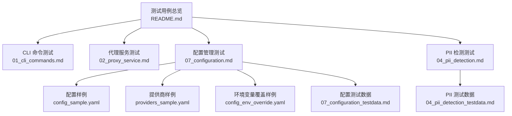
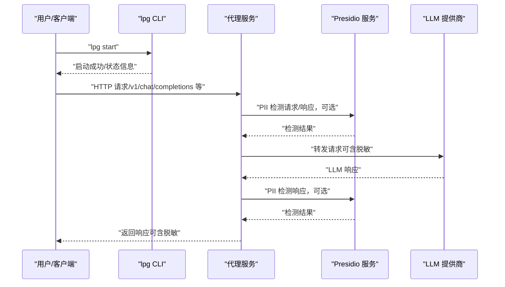
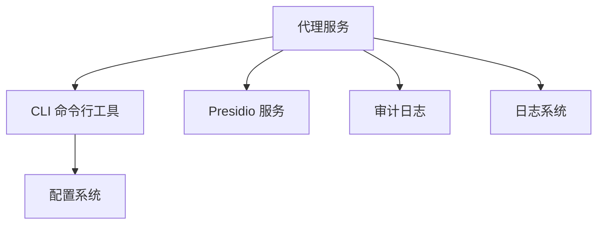

# 快速开始

<cite>
**本文引用的文件**   
- [01_cli_commands.md](file://doc/test/tcs/v1.0/01_cli_commands.md)
- [02_proxy_service.md](file://doc/test/tcs/v1.0/02_proxy_service.md)
- [07_configuration.md](file://doc/test/tcs/v1.0/07_configuration.md)
- [04_pii_detection.md](file://doc/test/tcs/v1.0/04_pii_detection.md)
- [README.md](file://doc/test/tcs/v1.0/README.md)
- [07_configuration_testdata.md](file://doc/test/tcs/v1.0/07_configuration_testdata.md)
- [04_pii_detection_testdata.md](file://doc/test/tcs/v1.0/04_pii_detection_testdata.md)
- [config_sample.yaml](file://doc/test/tcs/v1.0/test_data/config_sample.yaml)
- [providers_sample.yaml](file://doc/test/tcs/v1.0/test_data/providers_sample.yaml)
- [config_env_override.yaml](file://doc/test/tcs/v1.0/test_data/config_env_override.yaml)
</cite>

## 目录
1. [简介](#简介)
2. [项目结构](#项目结构)
3. [核心组件](#核心组件)
4. [架构总览](#架构总览)
5. [详细组件分析](#详细组件分析)
6. [依赖关系分析](#依赖关系分析)
7. [性能考虑](#性能考虑)
8. [故障排除指南](#故障排除指南)
9. [结论](#结论)
10. [附录](#附录)

## 简介
本快速开始指南面向首次使用 LLM Privacy Gateway（LPG v1.0）的用户，目标是在最短时间内完成安装、配置与基础使用，涵盖：
- 环境与依赖要求（Python 3.9+）
- 项目克隆与安装
- 配置文件最小化示例（config.yaml、providers.yaml）
- 首次使用全流程（启动代理服务 → 验证健康检查 → 进行一次 PII 检测）
- 常见部署场景（本地开发、容器化、生产部署要点）
- 故障排除与常见问题定位

## 项目结构
仓库中与“快速开始”直接相关的文档集中在测试用例与配置样例中，核心结构如下：
- 测试用例文档：覆盖 CLI、代理服务、配置管理、PII 检测等模块
- 配置样例：提供 config.yaml 与 providers.yaml 的最小可用示例
- 测试数据：包含大量边界与错误场景，便于理解与排障

图表来源
- [README.md:1-185](file://doc/test/tcs/v1.0/README.md#L1-L185)
- [01_cli_commands.md:1-702](file://doc/test/tcs/v1.0/01_cli_commands.md#L1-L702)
- [02_proxy_service.md:1-800](file://doc/test/tcs/v1.0/02_proxy_service.md#L1-L800)
- [07_configuration.md:1-594](file://doc/test/tcs/v1.0/07_configuration.md#L1-L594)
- [04_pii_detection.md:1-717](file://doc/test/tcs/v1.0/04_pii_detection.md#L1-L717)
- [config_sample.yaml:1-27](file://doc/test/tcs/v1.0/test_data/config_sample.yaml#L1-L27)
- [providers_sample.yaml:1-25](file://doc/test/tcs/v1.0/test_data/providers_sample.yaml#L1-L25)
- [config_env_override.yaml:1-16](file://doc/test/tcs/v1.0/test_data/config_env_override.yaml#L1-L16)

章节来源
- [README.md:1-185](file://doc/test/tcs/v1.0/README.md#L1-L185)

## 核心组件
- CLI 命令行工具：提供启动/停止/状态查看、配置管理、Key 管理、提供商管理、规则管理、日志管理等功能
- 代理服务：对外提供统一入口，转发请求至下游 LLM 提供商，内置 PII 检测与脱敏
- 配置管理：支持默认/本地/全局路径、环境变量覆盖、命令行参数覆盖，以及提供商、日志、审计等配置
- PII 检测与脱敏：基于 Presidio 的实体识别与多种脱敏策略（replace、mask、hash、redact）

章节来源
- [01_cli_commands.md:1-702](file://doc/test/tcs/v1.0/01_cli_commands.md#L1-L702)
- [02_proxy_service.md:1-800](file://doc/test/tcs/v1.0/02_proxy_service.md#L1-L800)
- [07_configuration.md:1-594](file://doc/test/tcs/v1.0/07_configuration.md#L1-L594)
- [04_pii_detection.md:1-717](file://doc/test/tcs/v1.0/04_pii_detection.md#L1-L717)

## 架构总览
下图展示了从用户发起请求到 LLM 响应返回的关键路径，以及 PII 检测与脱敏的插入点。

图表来源
- [02_proxy_service.md:255-284](file://doc/test/tcs/v1.0/02_proxy_service.md#L255-L284)
- [04_pii_detection.md:596-623](file://doc/test/tcs/v1.0/04_pii_detection.md#L596-L623)

## 详细组件分析

### 安装与环境要求
- Python 版本：3.9+（测试环境要求为 3.10+）
- 依赖服务：Presidio Analyzer/Anonymizer（本地或远程）
- 安装方式：推荐使用项目根目录的可编辑安装（pip install -e .）
- 测试执行：可使用 pytest 运行测试套件

章节来源
- [README.md:68-162](file://doc/test/tcs/v1.0/README.md#L68-L162)

### 配置文件最小化示例
- config.yaml（最小可用）
  - 代理监听地址与端口
  - 日志级别与输出文件
  - 提供商配置（示例：OpenAI/Azure Anthropic）
  - 规则与审计开关
- providers.yaml（提供商配置）
  - 多提供商并存，支持启用/禁用、超时、认证方式等

章节来源
- [config_sample.yaml:1-27](file://doc/test/tcs/v1.0/test_data/config_sample.yaml#L1-L27)
- [providers_sample.yaml:1-25](file://doc/test/tcs/v1.0/test_data/providers_sample.yaml#L1-L25)

### 首次使用全流程（从零到一）
- 初始化配置
  - 交互式：lpg config init
  - 非交互式：lpg config init --non-interactive
  - 指定输出路径：lpg config init --output /tmp/test_config.yaml
- 启动代理服务
  - 默认启动：lpg start
  - 自定义端口：lpg start --port 9090
  - 后台运行：lpg start --daemon
- 验证服务
  - 查看状态：lpg status
  - 健康检查：curl http://localhost:8080/health
- 进行一次 PII 检测
  - 通过代理发送请求，触发 Presidio 检测与脱敏（如邮箱、手机号、身份证等）
  - 参考 PII 测试数据与策略，验证脱敏效果

章节来源
- [01_cli_commands.md:225-312](file://doc/test/tcs/v1.0/01_cli_commands.md#L225-L312)
- [02_proxy_service.md:48-78](file://doc/test/tcs/v1.0/02_proxy_service.md#L48-L78)
- [04_pii_detection.md:44-116](file://doc/test/tcs/v1.0/04_pii_detection.md#L44-L116)

### 常见使用场景
- 本地开发环境
  - 使用默认配置（~/.lpg/config.yaml）或本地配置（./.lpg/config.yaml）
  - 启动 Presidio 服务（本地或 Docker），再启动 LPG
- Docker 部署
  - 将配置挂载到容器内，暴露代理端口
  - 确保 Presidio 服务可达（容器或宿主机）
- 生产环境部署
  - 使用环境变量覆盖敏感配置（如 API Key）
  - 启用审计日志与合适的日志轮转策略
  - 限制最大连接数与超时时间，保障稳定性

章节来源
- [07_configuration.md:407-451](file://doc/test/tcs/v1.0/07_configuration.md#L407-L451)
- [07_configuration_testdata.md:680-745](file://doc/test/tcs/v1.0/07_configuration_testdata.md#L680-L745)

### 配置优先级与覆盖
- 命令行参数 > 环境变量 > 本地配置（./.lpg/config.yaml）> 全局配置（~/.lpg/config.yaml）> 默认配置
- 环境变量示例：LPG_PROXY_PORT、LPG_PRESIDIO_ENDPOINT、LPG_LOG_LEVEL 等

章节来源
- [07_configuration.md:454-498](file://doc/test/tcs/v1.0/07_configuration.md#L454-L498)
- [07_configuration_testdata.md:680-697](file://doc/test/tcs/v1.0/07_configuration_testdata.md#L680-L697)

### PII 检测与脱敏策略
- 支持实体类型：邮箱、手机号（含国际/国内）、身份证、信用卡、人名、地址、IP、URL 等
- 脱敏策略：replace、mask、hash、redact
- 多语言支持：中文、英文、日文、韩文等
- 置信度阈值与实体过滤可配置

章节来源
- [04_pii_detection.md:40-422](file://doc/test/tcs/v1.0/04_pii_detection.md#L40-L422)
- [04_pii_detection_testdata.md:230-283](file://doc/test/tcs/v1.0/04_pii_detection_testdata.md#L230-L283)

## 依赖关系分析
- CLI 依赖于配置系统（默认/本地/全局/环境变量/命令行）
- 代理服务依赖 CLI 的启动命令与配置
- PII 检测依赖 Presidio 服务（Analyzer/Anonymizer）
- 审计与日志模块独立于核心代理，可按需启用

图表来源
- [01_cli_commands.md:84-128](file://doc/test/tcs/v1.0/01_cli_commands.md#L84-L128)
- [02_proxy_service.md:46-78](file://doc/test/tcs/v1.0/02_proxy_service.md#L46-L78)
- [07_configuration.md:454-498](file://doc/test/tcs/v1.0/07_configuration.md#L454-L498)

章节来源
- [01_cli_commands.md:84-128](file://doc/test/tcs/v1.0/01_cli_commands.md#L84-L128)
- [02_proxy_service.md:46-78](file://doc/test/tcs/v1.0/02_proxy_service.md#L46-L78)
- [07_configuration.md:454-498](file://doc/test/tcs/v1.0/07_configuration.md#L454-L498)

## 性能考虑
- 合理设置代理超时与最大连接数，避免上游 LLM 服务抖动影响整体吞吐
- 对大请求体与流式响应进行压力测试，关注内存与 CPU 使用
- 启用日志轮转与审计日志，避免磁盘空间与 IO 压力

## 故障排除指南
- 启动失败（端口占用）
  - 现象：启动时报端口被占用
  - 处理：更换端口或释放占用端口
- 配置文件不存在
  - 现象：提示配置文件不存在
  - 处理：使用 lpg config init 初始化，或指定 --config 路径
- Presidio 服务不可达
  - 现象：PII 检测/脱敏失败，返回连接错误
  - 处理：检查 Presidio 端点配置与网络连通性
- 配置项无效或类型错误
  - 现象：设置配置时报错（如端口范围、布尔值、数组格式）
  - 处理：参考配置测试数据，修正类型与取值范围
- 健康检查失败
  - 现象：/health 返回非 200
  - 处理：查看状态与日志，确认代理已启动且端口正确

章节来源
- [01_cli_commands.md:131-158](file://doc/test/tcs/v1.0/01_cli_commands.md#L131-L158)
- [02_proxy_service.md:517-544](file://doc/test/tcs/v1.0/02_proxy_service.md#L517-L544)
- [07_configuration.md:146-173](file://doc/test/tcs/v1.0/07_configuration.md#L146-L173)
- [07_configuration_testdata.md:15-23](file://doc/test/tcs/v1.0/07_configuration_testdata.md#L15-L23)

## 结论
通过本快速开始指南，您可以在本地快速完成 LPG 的安装与配置，并完成一次从启动代理到 PII 检测的端到端验证。建议结合测试用例与配置样例进一步熟悉各模块行为，并在生产环境中按需启用审计与日志轮转，确保合规与可观测性。

## 附录
- 示例配置文件路径
  - 默认全局配置：~/.lpg/config.yaml
  - 本地配置：./.lpg/config.yaml
  - 环境变量覆盖：LPG_PROXY_PORT、LPG_PRESIDIO_ENDPOINT、LPG_LOG_LEVEL 等
- 常用命令参考
  - lpg --help / --version
  - lpg start / stop / status
  - lpg config init/list/get/set
  - lpg provider list/add/remove/test
  - lpg key list/create/revoke
  - lpg rule list/enable/disable/add/remove/test
  - lpg log show/stats/export/clear

章节来源
- [README.md:138-162](file://doc/test/tcs/v1.0/README.md#L138-L162)
- [01_cli_commands.md:39-81](file://doc/test/tcs/v1.0/01_cli_commands.md#L39-L81)
- [07_configuration_testdata.md:680-697](file://doc/test/tcs/v1.0/07_configuration_testdata.md#L680-L697)