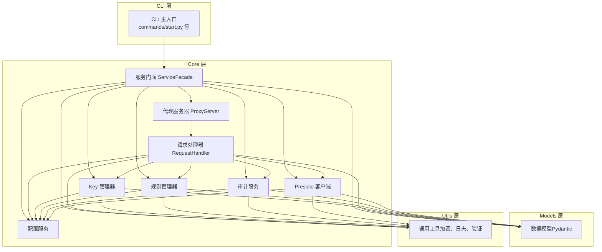
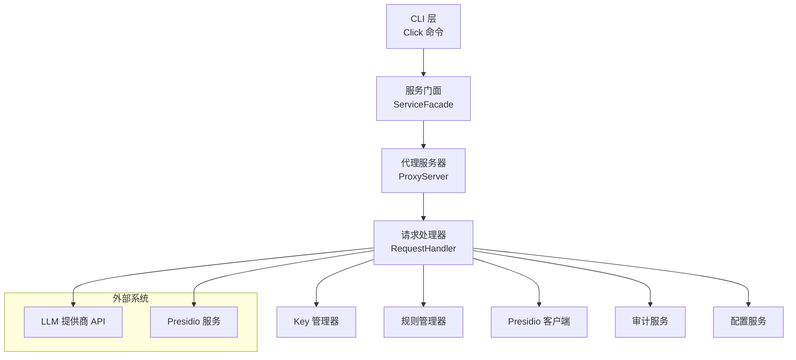
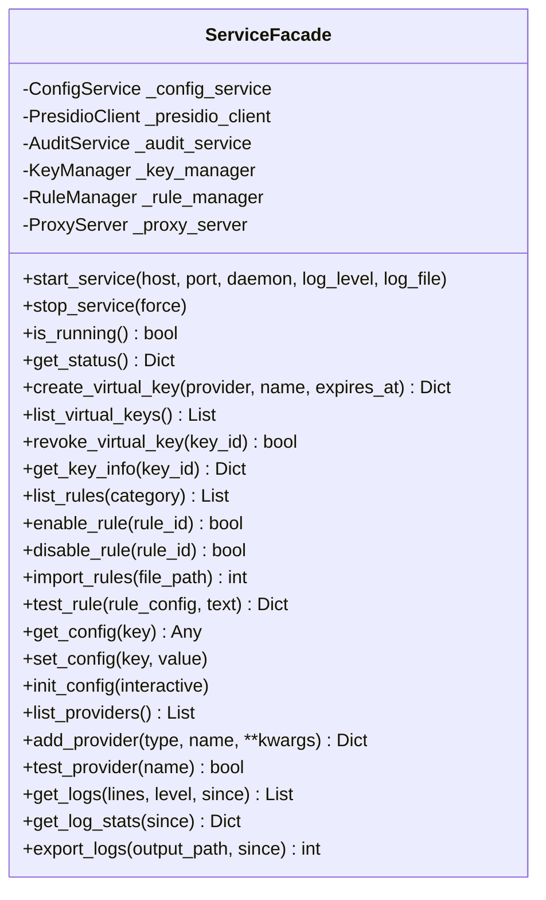
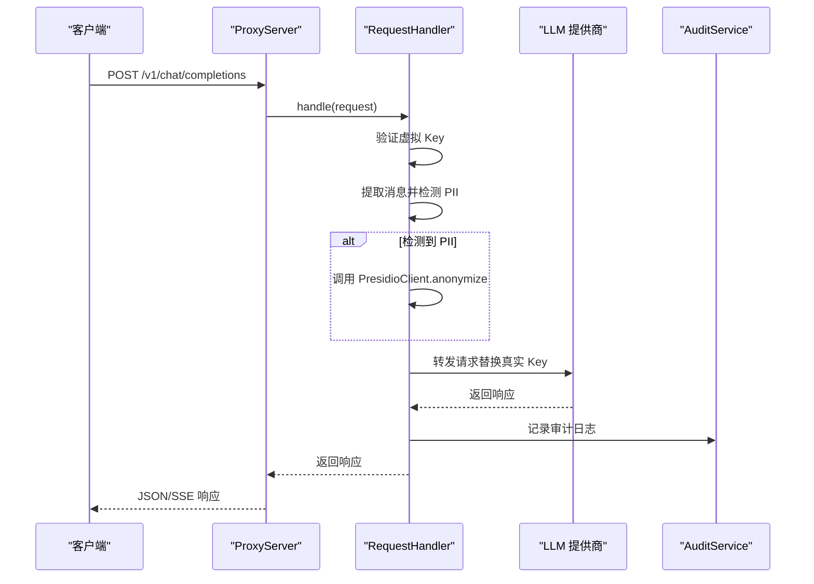
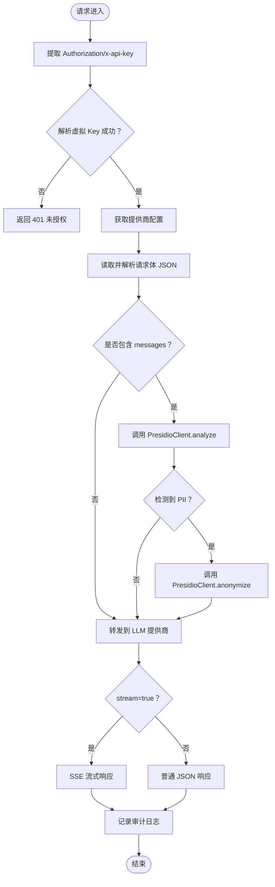
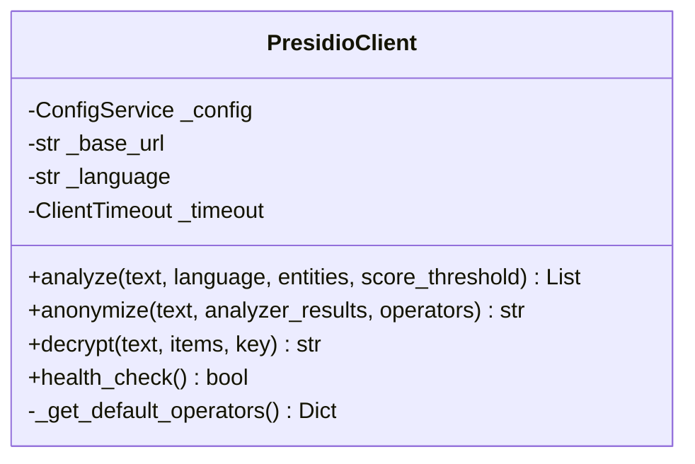
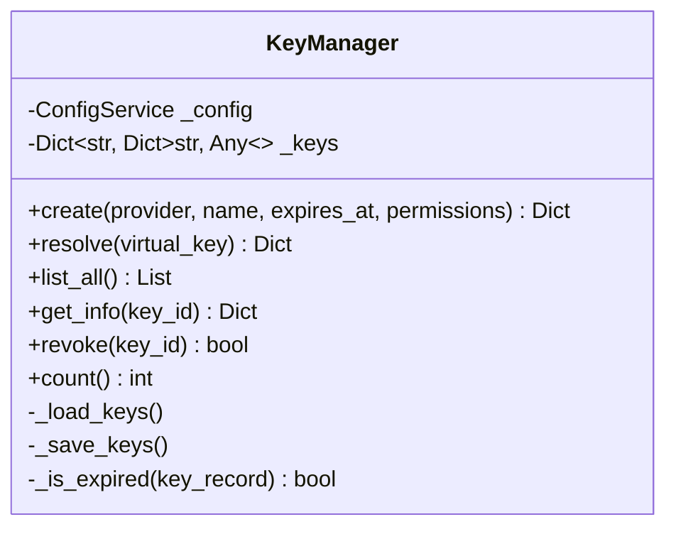
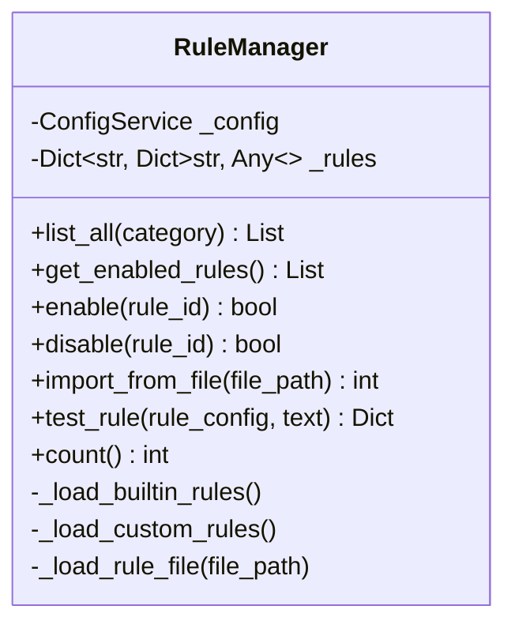
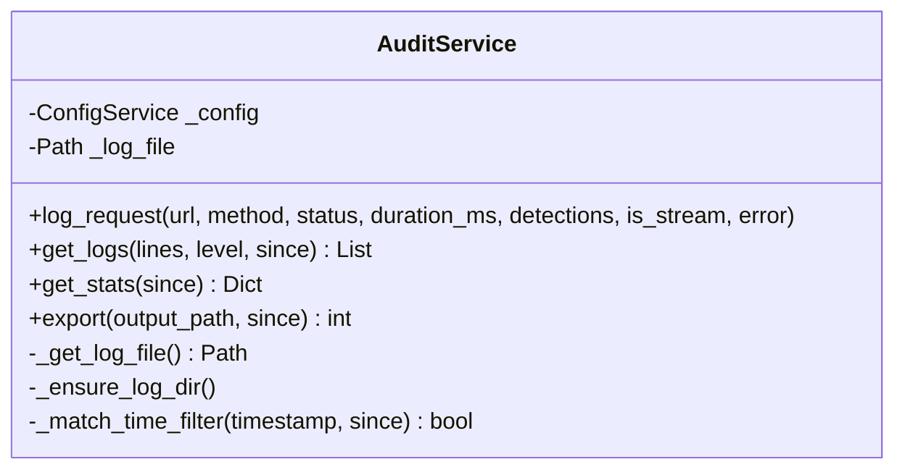
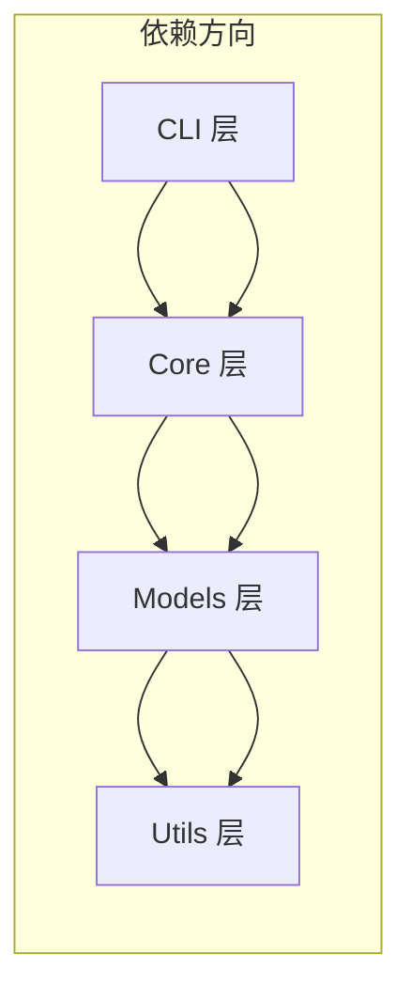

# 架构概览

<cite>
**本文档引用的文件**
- [AGENTS.md](file://AGENTS.md)
- [design-update-20260404-v1.0-init.md](file://doc/design/design-update-20260404-v1.0-init.md)
- [architecture-rule.md](file://doc/rules/architecture-rule.md)
- [coding-rule.md](file://doc/rules/coding-rule.md)
- [plane_cli.py](file://doc/test/issues_management_platform/cli/plane_cli.py)
</cite>

## 目录
1. [简介](#简介)
2. [项目结构](#项目结构)
3. [核心组件](#核心组件)
4. [架构总览](#架构总览)
5. [详细组件分析](#详细组件分析)
6. [依赖分析](#依赖分析)
7. [性能考量](#性能考量)
8. [故障排查指南](#故障排查指南)
9. [结论](#结论)
10. [附录](#附录)

## 简介
本项目为 LLM Privacy Gateway（LLM 隐私保护网关），旨在提供本地化的隐私保护代理服务，支持 OpenAI API 格式的请求转发，并在请求进入 LLM 提供商之前对敏感信息（PII）进行检测与脱敏。系统采用四层架构设计，结合异步编程模式与依赖注入原则，确保可测试性、可维护性与可扩展性。本文档从整体架构、组件关系、数据流、异步与事件驱动设计、依赖注入与服务门面模式、扩展点与插件机制等方面进行全面阐述，帮助开发者快速理解并参与开发。

## 项目结构
项目采用“四层架构”组织代码，分别对应 CLI 层、Core 层、Models 层、Utils 层。各层职责明确，禁止跨层直接调用，通过依赖注入实现松耦合。

- CLI 层：命令行交互，参数解析与结果展示，调用 Core 层执行业务逻辑。
- Core 层：核心业务逻辑与服务编排，集成外部服务（Presidio、LLM 提供商），管理资源生命周期。
- Models 层：数据模型与验证规则，提供 DTO 与领域模型。
- Utils 层：通用工具函数与基础设施封装，提供纯函数与跨层共享组件。

**图表来源**
- [design-update-20260404-v1.0-init.md](file://doc/design/design-update-20260404-v1.0-init.md)
- [architecture-rule.md](file://doc/rules/architecture-rule.md)

**章节来源**
- [AGENTS.md:11-28](file://AGENTS.md#L11-L28)
- [architecture-rule.md:34-68](file://doc/rules/architecture-rule.md#L34-L68)

## 核心组件
- 服务门面（ServiceFacade）：统一服务入口，隐藏服务间依赖关系，CLI 通过门面访问核心服务，便于后续版本扩展。
- 代理服务器（ProxyServer）：基于 aiohttp 的异步 HTTP 服务器，监听本地端口，接收请求并委托给 RequestHandler 处理。
- 请求处理器（RequestHandler）：实现请求验证、PII 检测与脱敏、转发到 LLM 提供商、流式响应处理与审计日志记录。
- Presidio 客户端（PresidioClient）：封装 Presidio Analyzer/Anonymizer/Decryptor 的 HTTP 调用，提供异步接口。
- Key 管理器（KeyManager）：生成与解析虚拟 Key，管理 Key 生命周期与权限。
- 规则管理器（RuleManager）：加载与管理检测规则，支持启用/禁用与自定义规则导入。
- 审计服务（AuditService）：记录请求处理日志，支持查询、统计与导出。
- 配置服务（ConfigService）：集中管理配置，支持文件与环境变量优先级。
- 工具模块（Utils）：加密、日志配置、通用验证等工具函数。

**章节来源**
- [design-update-20260404-v1.0-init.md:411-568](file://doc/design/design-update-20260404-v1.0-init.md#L411-L568)
- [design-update-20260404-v1.0-init.md:570-741](file://doc/design/design-update-20260404-v1.0-init.md#L570-L741)
- [design-update-20260404-v1.0-init.md:743-944](file://doc/design/design-update-20260404-v1.0-init.md#L743-L944)
- [design-update-20260404-v1.0-init.md:946-1113](file://doc/design/design-update-20260404-v1.0-init.md#L946-L1113)
- [design-update-20260404-v1.0-init.md:1115-1275](file://doc/design/design-update-20260404-v1.0-init.md#L1115-L1275)
- [design-update-20260404-v1.0-init.md:1277-1439](file://doc/design/design-update-20260404-v1.0-init.md#L1277-L1439)
- [design-update-20260404-v1.0-init.md:1441-1640](file://doc/design/design-update-20260404-v1.0-init.md#L1441-L1640)

## 架构总览
系统采用分层架构与服务门面模式，CLI 层通过 ServiceFacade 统一调度 Core 层服务；Core 层内部通过依赖注入组合 Key、Rule、Presidio、Audit、Config 等服务；Models 层提供数据模型；Utils 层提供通用工具。异步编程贯穿请求处理链路，使用 aiohttp 实现异步 HTTP 处理与事件驱动架构。

**图表来源**
- [design-update-20260404-v1.0-init.md](file://doc/design/design-update-20260404-v1.0-init.md)
- [architecture-rule.md:34-68](file://doc/rules/architecture-rule.md#L34-L68)

## 详细组件分析

### 服务门面（ServiceFacade）
- 统一入口：CLI 通过 ServiceFacade 访问核心服务，隐藏服务间依赖关系，便于后续版本扩展。
- 依赖注入：在构造函数中注入 ConfigService、PresidioClient、AuditService、KeyManager、RuleManager。
- 生命周期：根据 CLI 命令启动/停止代理服务，提供状态查询与日志管理等能力。

**图表来源**
- [design-update-20260404-v1.0-init.md:411-568](file://doc/design/design-update-20260404-v1.0-init.md#L411-L568)

**章节来源**
- [design-update-20260404-v1.0-init.md:411-568](file://doc/design/design-update-20260404-v1.0-init.md#L411-L568)

### 代理服务器（ProxyServer）
- 异步启动：基于 aiohttp 的 web.Application，AppRunner/TCP 站点异步启动。
- 路由与健康检查：注册 /v1/chat/completions、/v1/completions、/v1/embeddings 以及 /health 端点。
- 生命周期：支持守护进程模式与事件循环等待，统计指标（请求总数、成功率、失败率、PII 检测次数、总延迟）。

**图表来源**
- [design-update-20260404-v1.0-init.md:570-741](file://doc/design/design-update-20260404-v1.0-init.md#L570-L741)
- [design-update-20260404-v1.0-init.md:743-944](file://doc/design/design-update-20260404-v1.0-init.md#L743-L944)

**章节来源**
- [design-update-20260404-v1.0-init.md:570-741](file://doc/design/design-update-20260404-v1.0-init.md#L570-L741)

### 请求处理器（RequestHandler）
- 核心流程：提取虚拟 Key → 解析映射 → 获取提供商配置 → PII 检测与脱敏 → 构建目标 URL/Headers → 转发请求 → 处理响应（普通/流式）→ 记录审计日志。
- 流式处理：SSE 流式响应，逐块写回客户端。
- 错误处理：统一错误响应格式，记录失败统计。

**图表来源**
- [design-update-20260404-v1.0-init.md:743-944](file://doc/design/design-update-20260404-v1.0-init.md#L743-L944)

**章节来源**
- [design-update-20260404-v1.0-init.md:743-944](file://doc/design/design-update-20260404-v1.0-init.md#L743-L944)

### Presidio 客户端（PresidioClient）
- 封装 Analyzer/Anonymizer/Decryptor 的 HTTP 调用，提供异步接口。
- 默认脱敏策略：针对多种实体类型（邮箱、电话、身份证等）提供默认脱敏策略。
- 健康检查：定期检查 Presidio 服务可用性。

**图表来源**
- [design-update-20260404-v1.0-init.md:946-1113](file://doc/design/design-update-20260404-v1.0-init.md#L946-L1113)

**章节来源**
- [design-update-20260404-v1.0-init.md:946-1113](file://doc/design/design-update-20260404-v1.0-init.md#L946-L1113)

### Key 管理器（KeyManager）
- 生成虚拟 Key：使用安全随机数生成器与哈希算法，确保唯一性与安全性。
- 解析映射：验证虚拟 Key 并解析到真实提供商 Key，支持过期检查与使用统计。
- 生命周期管理：支持吊销、计数与列表查询。

**图表来源**
- [design-update-20260404-v1.0-init.md:1115-1275](file://doc/design/design-update-20260404-v1.0-init.md#L1115-L1275)

**章节来源**
- [design-update-20260404-v1.0-init.md:1115-1275](file://doc/design/design-update-20260404-v1.0-init.md#L1115-L1275)

### 规则管理器（RuleManager）
- 加载内置与自定义规则：支持 YAML 规则文件，自动启用与禁用。
- 规则测试：提供规则测试接口，支持正则与关键词匹配。
- 导入与统计：支持从文件导入规则并统计数量。

**图表来源**
- [design-update-20260404-v1.0-init.md:1277-1439](file://doc/design/design-update-20260404-v1.0-init.md#L1277-L1439)

**章节来源**
- [design-update-20260404-v1.0-init.md:1277-1439](file://doc/design/design-update-20260404-v1.0-init.md#L1277-L1439)

### 审计服务（AuditService）
- 日志记录：记录请求 URL、方法、状态码、耗时、PII 检测结果、是否流式等。
- 查询与统计：支持按时间范围过滤、按状态过滤、统计总数、成功率、失败率、平均耗时、PII 类型分布。
- 导出：支持将日志导出为 JSON 文件。

**图表来源**
- [design-update-20260404-v1.0-init.md:1441-1640](file://doc/design/design-update-20260404-v1.0-init.md#L1441-L1640)

**章节来源**
- [design-update-20260404-v1.0-init.md:1441-1640](file://doc/design/design-update-20260404-v1.0-init.md#L1441-L1640)

### Utils 层（通用工具）
- 加密工具：Fernet 对称加密、PBKDF2 密钥派生。
- 日志配置：统一日志格式与级别。
- 验证工具：通用验证函数。

**章节来源**
- [design-update-20260404-v1.0-init.md:1642-1699](file://doc/design/design-update-20260404-v1.0-init.md#L1642-L1699)

## 依赖分析
- 层间依赖：CLI → Core → Models → Utils；禁止跨层直接调用。
- 依赖注入：通过构造函数注入依赖，避免在类内部创建依赖，提升可测试性。
- 循环依赖：禁止任何形式的循环依赖，可通过 Protocol/接口解耦。

**图表来源**
- [architecture-rule.md:70-83](file://doc/rules/architecture-rule.md#L70-L83)

**章节来源**
- [architecture-rule.md:544-651](file://doc/rules/architecture-rule.md#L544-L651)

## 性能考量
- 异步 I/O：使用 aiohttp 异步 HTTP 客户端与服务器，避免阻塞调用，提升吞吐量。
- 资源管理：使用 async with 管理会话与连接，及时释放资源。
- 流式响应：SSE 流式响应减少内存占用，提升大响应的处理效率。
- 统计指标：代理服务器维护请求总量、成功率、失败率、PII 检测次数、总延迟等指标，便于性能监控与优化。

**章节来源**
- [coding-rule.md:652-722](file://doc/rules/coding-rule.md#L652-L722)
- [design-update-20260404-v1.0-init.md:570-741](file://doc/design/design-update-20260404-v1.0-init.md#L570-L741)

## 故障排查指南
- 常见异常层次：LPGError → ConfigError、KeyError（KeyNotFoundError、KeyExpiredError）、PresidioError（PresidioConnectionError、PresidioTimeoutError）、ProxyError、RuleError。
- 异常捕获：捕获具体异常类型，避免使用通用 Exception；重新抛出时保留上下文。
- 日志规范：使用 loguru，异常日志使用 logger.exception 自动包含堆栈；日志级别包括 DEBUG、INFO、WARNING、ERROR、CRITICAL。
- Presidio 集成：封装 HTTP 调用细节，处理连接错误与超时；从配置读取端点，避免硬编码。

**章节来源**
- [coding-rule.md:725-800](file://doc/rules/coding-rule.md#L725-L800)
- [design-update-20260404-v1.0-init.md:1215-1229](file://doc/design/design-update-20260404-v1.0-init.md#L1215-L1229)

## 结论
本项目通过四层架构与服务门面模式实现了清晰的职责分离与松耦合设计，结合异步编程与依赖注入原则，确保了系统的可测试性、可维护性与可扩展性。Presidio 集成提供了强大的 PII 检测与脱敏能力，配合完善的审计日志体系，满足本地隐私保护代理的核心需求。未来版本可在服务门面、规则管理与 CLI 命令层面预留扩展点，逐步引入云端规则同步、订阅管理与插件化机制。

## 附录
- 测试策略：E2E（5%）、集成测试（15%）、单元测试（80%），覆盖关键模块与边界条件。
- 扩展性设计：服务门面、规则管理器、CLI 命令预留扩展点；配置系统支持多级优先级与环境变量映射。
- 配置系统：全局配置文件 ~/.llm-privacy-gateway/config.yaml，支持命令行参数、环境变量与本地配置的优先级合并。

**章节来源**
- [design-update-20260404-v1.0-init.md:2131-2346](file://doc/design/design-update-20260404-v1.0-init.md#L2131-L2346)
- [design-update-20260404-v1.0-init.md:1931-2011](file://doc/design/design-update-20260404-v1.0-init.md#L1931-L2011)